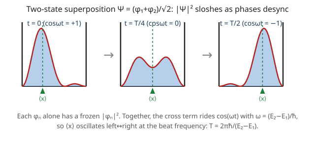

# Quantum Mechanics · Lesson 2.2: Stationary states and time evolution

> ⏱ ~15 min · Module 2: The Schrödinger equation and one-dimensional systems · Builds on: [2.1 The Schrödinger equation](#/lesson/quantum-mechanics/02-01-schrodinger-equation.md), [1.4 Observables as Hermitian operators](#/lesson/quantum-mechanics/01-04-observables-hermitian-operators.md) · Unlocks: the infinite square well (2.3), where these energies and this sloshing become concrete numbers

## Why this matters

In 2.1 you split the Schrödinger equation and found that separable solutions carry a pure time phase $e^{-iE t/\hbar}$. That looks like a technical footnote. It is actually the entire engine of quantum dynamics: **once you know the energy eigenstates, you know how *every* state evolves, forever, with no further differential equations to solve.** The recipe — decompose into energy eigenstates, spin each one's phase, recombine — is the quantum analogue of "resolve a signal into pure tones, advance each tone's phase, add them back." Get this and you understand why atoms have sharp spectral lines, why a molecule vibrates at a definite frequency, and why an electron in a box sloshes back and forth.

## The idea

An energy eigenstate is a boring, beautiful thing: its probability cloud never moves. Put a particle in $\phi_n$ and its density $|\psi_n|^2$, its average position, its average momentum — all frozen for all time. That is why we call it **stationary**. The phase $e^{-iE_n t/\hbar}$ *is* spinning, furiously, but it is an invisible spin: it cancels out of every physical prediction.

The magic starts when you mix two of them. Say the state is half $\phi_1$ and half $\phi_2$. Each piece's phase spins at its own rate, $E_1/\hbar$ and $E_2/\hbar$. What you *measure* depends on their **relative** phase, which drifts at rate $(E_2-E_1)/\hbar$. So the two clouds beat against each other — constructive here, destructive there — and the total density $|\Psi|^2$ physically sloshes back and forth, like two slightly-out-of-tune tuning forks producing an audible wobble. The wobble frequency is set purely by the *energy gap*. That is the origin of every quantum oscillation you will ever compute.

And the deepest part: the *amounts* of each eigenstate never change. If you start 50/50, you stay 50/50 forever. The phases rotate; the probabilities of each energy outcome are locked in by the initial state and cannot budge.

## The formal version

**Stationary states.** For each energy eigenfunction $\phi_n(x)$ solving the time-independent Schrödinger equation $\hat H\phi_n = E_n\phi_n$, the full time-dependent solution is

$$\psi_n(x,t) = \phi_n(x)\, e^{-iE_n t/\hbar}.$$

Its density is $|\psi_n(x,t)|^2 = |\phi_n(x)|^2\,\big|e^{-iE_n t/\hbar}\big|^2 = |\phi_n(x)|^2$, with no $t$. For any operator $\hat Q$ with no explicit time dependence, $\langle \hat Q\rangle = \int \phi_n^{*}\,\hat Q\,\phi_n\,dx$ is likewise time-independent — the phases $e^{+iE_nt/\hbar}$ and $e^{-iE_nt/\hbar}$ from bra and ket annihilate.

*In words:* a single energy eigenstate is a standing wave — its shape and every average it produces are frozen; only an unobservable overall phase turns.

**The general solution.** Because the $\phi_n$ form a complete orthonormal basis (they are eigenstates of the Hermitian $\hat H$), any state expands in them, and the Schrödinger equation evolves each coefficient by its own phase:

$$\Psi(x,t) = \sum_n c_n\, \phi_n(x)\, e^{-iE_n t/\hbar}, \qquad c_n = \langle \phi_n | \Psi(\cdot,0)\rangle = \int \phi_n^{*}(x)\,\Psi(x,0)\,dx.$$

*In words:* to evolve a state, project the initial state onto each energy eigenstate to get the fixed weights $c_n$, multiply each by its spinning phase, and add them up. The $c_n$ are set *once*, by the initial condition, and never change.

This is the whole algorithm: **decompose → spin each phase → recombine.** No further PDE solving — time evolution has been reduced to attaching a phase to each of a fixed list of numbers.

**Beats and interference.** Keep two terms, $\Psi = c_m\phi_m e^{-iE_m t/\hbar} + c_n\phi_n e^{-iE_n t/\hbar}$. Any expectation value picks up a cross term:

$$\langle \hat Q\rangle(t) = |c_m|^2 Q_{mm} + |c_n|^2 Q_{nn} + 2\,\mathrm{Re}\!\left[c_m^{*}c_n\, Q_{mn}\, e^{-i(E_n-E_m)t/\hbar}\right],$$

where $Q_{mn} = \langle\phi_m|\hat Q|\phi_n\rangle$. The cross term oscillates at the **Bohr frequency** $\omega_{mn} = (E_n - E_m)/\hbar$.

*In words:* two energy levels interfere, and their beat — the moving part of any observable — happens at a frequency fixed by the *gap* between them, not by either energy alone.

**Conservation of the weights.** The amplitude to find energy $E_n$ at time $t$ is $\langle\phi_n|\Psi(t)\rangle = c_n e^{-iE_n t/\hbar}$, so the probability of that energy outcome is

$$P(E_n) = \big|c_n e^{-iE_n t/\hbar}\big|^2 = |c_n|^2, \quad\text{constant in }t, \qquad \sum_n |c_n|^2 = 1 \text{ for all } t.$$

*In words:* measuring the energy always gives the same odds — the phases spin but $|c_n|^2$ cannot change. Energy statistics are a constant of the motion. (This is exactly the unitarity of $e^{-i\hat H t/\hbar}$: time evolution reshuffles phases but preserves every length.)

## Picture

## Worked examples

**Example 1 (mechanical — evolve a two-state mix).** Suppose at $t=0$ a particle is $\Psi(x,0) = \tfrac{1}{\sqrt5}\big(\phi_1(x) + 2\,\phi_2(x)\big)$, with $\hat H\phi_n = E_n\phi_n$. Read off the weights directly (the basis is orthonormal, so no integral is needed): $c_1 = \tfrac{1}{\sqrt5}$, $c_2 = \tfrac{2}{\sqrt5}$. Spin each phase:

$$\Psi(x,t) = \tfrac{1}{\sqrt5}\,\phi_1(x)\,e^{-iE_1 t/\hbar} + \tfrac{2}{\sqrt5}\,\phi_2(x)\,e^{-iE_2 t/\hbar}.$$

An energy measurement returns $E_1$ with probability $|c_1|^2 = \tfrac15$ or $E_2$ with probability $|c_2|^2 = \tfrac45$ — at every time. The mean energy $\langle H\rangle = \tfrac15 E_1 + \tfrac45 E_2$ is also constant (energy is conserved), even though position and momentum will oscillate.

**Example 2 (why you'd care — the beat is the oscillation).** Take the equal mix $\Psi(x,0) = \tfrac{1}{\sqrt2}(\phi_1+\phi_2)$ from the figure. The density is

$$|\Psi(x,t)|^2 = \tfrac12\Big[\,|\phi_1|^2 + |\phi_2|^2 + 2\phi_1\phi_2\cos\big(\tfrac{(E_2-E_1)t}{\hbar}\big)\Big]$$

(using real $\phi_n$). The first two terms are the frozen backgrounds of the two stationary states; the last term is the interference, riding a cosine. When $\cos = +1$ the clouds add on one side, when $\cos = -1$ they add on the other — the blob slides from side to side and returns with period $T = 2\pi\hbar/(E_2-E_1)$. This is not a mathematical curiosity: a hydrogen atom prepared in a superposition of two levels has an oscillating dipole at exactly $\omega = (E_2-E_1)/\hbar$, and *that* is the frequency of the light it radiates. Spectral lines are Bohr frequencies of superpositions.

## Watch out

- You might think "stationary" means the wavefunction doesn't change. It changes constantly — the phase $e^{-iE_n t/\hbar}$ never stops turning. "Stationary" refers only to the *observables*: densities and expectation values are frozen because the phase is invisible to them. The state and the physics are not the same thing.
- You might think a superposition also just carries one overall phase, so it's stationary too. It is not. Different terms spin at *different* rates $E_n/\hbar$, so their relative phases drift, and observables move. **Only a single energy eigenstate is stationary**; the moment you mix two energies, things oscillate.
- You might think you can factor $e^{-iE t/\hbar}$ out of a superposition and call $E$ "the energy." You cannot — there is no single $E$. A superposition has no definite energy; it has a *distribution* of energies with weights $|c_n|^2$. Only $\langle H\rangle$ (an average) and the $|c_n|^2$ (probabilities) are well-defined, and both are constant.

## One-liner

> To evolve any state: decompose into energy eigenstates, spin each phase at $E_n/\hbar$, recombine — the weights $|c_n|^2$ stay fixed forever, and everything that moves moves at a Bohr frequency $(E_m-E_n)/\hbar$.

## Problems

**P1 (🟢)** A particle starts in $\Psi(x,0) = \dfrac{1}{\sqrt2}\big(\phi_1(x) + \phi_2(x)\big)$, where $\phi_1,\phi_2$ are orthonormal energy eigenstates with energies $E_1, E_2$. Write $\Psi(x,t)$ explicitly, and give the probability that an energy measurement (at any time) returns $E_1$ and that it returns $E_2$.

**P2 (🟡)** For that same equal superposition, but now with $\phi_1,\phi_2$ the ground and first-excited states of the infinite square well of width $a$ (real eigenfunctions $\phi_n(x)=\sqrt{2/a}\,\sin(n\pi x/a)$, so $\langle x\rangle_1 = \langle x\rangle_2 = a/2$ by symmetry), compute $\langle x\rangle(t)$. Identify the frequency at which it oscillates. (You may use $\int_0^a x\,\phi_1(x)\phi_2(x)\,dx = -\dfrac{16a}{9\pi^2}$; the *numerical* well energies $E_n$ arrive in [2.3](#/lesson/quantum-mechanics/02-03-infinite-square-well.md).)

**P3 (🔴, optional)** Show that for *any* superposition $\Psi(x,t) = \sum_n c_n \phi_n(x) e^{-iE_n t/\hbar}$ of orthonormal energy eigenstates, (a) the total probability $\int|\Psi|^2\,dx$ is independent of $t$ (so a state normalized at $t=0$ stays normalized), and (b) each energy probability $|c_n|^2$ is separately conserved.

Solutions

**P1** The weights are already exposed by the orthonormal basis: $c_1 = c_2 = \tfrac{1}{\sqrt2}$. Attach each phase:

$$\Psi(x,t) = \frac{1}{\sqrt2}\,\phi_1(x)\,e^{-iE_1 t/\hbar} + \frac{1}{\sqrt2}\,\phi_2(x)\,e^{-iE_2 t/\hbar}.$$

The energy outcomes have probabilities $|c_1|^2 = \tfrac12$ and $|c_2|^2 = \tfrac12$. The phases carry unit modulus, so these are $\tfrac12$ at *every* time — a defining feature: energy statistics don't evolve.

**P2** With real $\phi_n$ and $\omega \equiv (E_2-E_1)/\hbar$,

$$\langle x\rangle(t) = \int_0^a \Psi^{*}\,x\,\Psi\,dx = \frac12\int_0^a x\big(\phi_1^2+\phi_2^2\big)dx + \frac12\int_0^a x\,\phi_1\phi_2\big(e^{i\omega t}+e^{-i\omega t}\big)dx.$$

The first integral is $\tfrac12(\langle x\rangle_1 + \langle x\rangle_2) = \tfrac12(\tfrac a2 + \tfrac a2) = \tfrac a2$. In the second, $e^{i\omega t}+e^{-i\omega t} = 2\cos\omega t$, so it is $\cos(\omega t)\displaystyle\int_0^a x\,\phi_1\phi_2\,dx = -\dfrac{16a}{9\pi^2}\cos\omega t$. Hence

$$\boxed{\;\langle x\rangle(t) = \frac{a}{2} - \frac{16a}{9\pi^2}\cos\!\Big(\frac{(E_2-E_1)t}{\hbar}\Big)\;}$$

The particle's average position oscillates about the center $a/2$ with amplitude $\tfrac{16a}{9\pi^2}\approx 0.18\,a$, at angular frequency $\omega = (E_2-E_1)/\hbar$ — the Bohr frequency of the gap, exactly the sloshing in the figure. (In 2.3 you'll find $E_n = n^2\pi^2\hbar^2/2ma^2$, giving $\omega = 3\pi^2\hbar/2ma^2$.)

**P3** Use orthonormality $\langle\phi_m|\phi_n\rangle = \delta_{mn}$ throughout.

(a) Expand the norm:
$$\int|\Psi|^2\,dx = \sum_m\sum_n c_m^{*}c_n\,e^{i(E_m-E_n)t/\hbar}\underbrace{\langle\phi_m|\phi_n\rangle}_{\delta_{mn}} = \sum_n |c_n|^2\,e^{i(E_n-E_n)t/\hbar} = \sum_n |c_n|^2.$$
Only the $m=n$ terms survive, and for those the time phase is $e^{0}=1$ — the $t$-dependence cancels identically. So $\int|\Psi|^2\,dx = \sum_n|c_n|^2$ is constant; if it equals $1$ at $t=0$ it equals $1$ for all $t$.

(b) The amplitude to be found in eigenstate $\phi_n$ at time $t$ is
$$\langle\phi_n|\Psi(t)\rangle = \sum_m c_m e^{-iE_m t/\hbar}\langle\phi_n|\phi_m\rangle = c_n e^{-iE_n t/\hbar},$$
so its probability is $|c_n e^{-iE_n t/\hbar}|^2 = |c_n|^2$, with no $t$. Each energy probability is separately frozen. (Both facts are the statement that $e^{-i\hat H t/\hbar}$ is *unitary*: it preserves the total length and every component's length in the energy basis.)

## Flashback

**From Lesson 1.4 (Observables as Hermitian operators):** Let $\hat H$ be Hermitian with $\hat H\phi_1 = E_1\phi_1$ and $\hat H\phi_2 = E_2\phi_2$, where $E_1 \ne E_2$. Show directly that $\langle\phi_1|\phi_2\rangle = 0$ — and say in one line why this orthogonality is exactly what made $c_n = \langle\phi_n|\Psi\rangle$ pick out a single weight and made the cross terms in P3 vanish.

Solution

Compute $\langle\phi_1|\hat H|\phi_2\rangle$ two ways. Letting $\hat H$ act right: $\langle\phi_1|\hat H\phi_2\rangle = E_2\langle\phi_1|\phi_2\rangle$. Letting it act left (Hermiticity moves $\hat H$ onto the bra, and its eigenvalue $E_1$ is real because $\hat H$ is Hermitian): $\langle\hat H\phi_1|\phi_2\rangle = E_1^{*}\langle\phi_1|\phi_2\rangle = E_1\langle\phi_1|\phi_2\rangle$. Subtracting,
$$(E_2 - E_1)\,\langle\phi_1|\phi_2\rangle = 0.$$
Since $E_2 \ne E_1$, we must have $\langle\phi_1|\phi_2\rangle = 0$. 

Why it mattered: orthonormality is what collapses $\langle\phi_n|\Psi\rangle = \sum_m c_m\langle\phi_n|\phi_m\rangle$ down to the single term $c_n$, and it is what killed every $m\ne n$ term in P3 — leaving only the $m=n$ pieces whose time phases cancel. Without it, energy weights would leak into one another and $|c_n|^2$ would not be conserved.

## Connections

- **Backward:** the phase $e^{-iE_n t/\hbar}$ is the separation solution from [2.1](#/lesson/quantum-mechanics/02-01-schrodinger-equation.md); the completeness and orthonormality that let you expand $\Psi = \sum c_n\phi_n$ are the Hermitian-operator spectral facts from [1.4](#/lesson/quantum-mechanics/01-04-observables-hermitian-operators.md), and reading $|c_n|^2$ as the probability of energy $E_n$ is the Born rule of [1.5](#/lesson/quantum-mechanics/01-05-measurement-expectation-values.md) applied in the energy basis.
- **Forward:** [2.3](#/lesson/quantum-mechanics/02-03-infinite-square-well.md) supplies the concrete $\phi_n$ and $E_n$ that turn P2's symbolic $\langle x\rangle(t)$ into a number; the same decompose–spin–recombine recipe drives wave-packet spreading in 2.6. The conservation of $|c_n|^2$ is unitarity, made into an operator equation in the Heisenberg picture (3.5), and Bohr frequencies $(E_m-E_n)/\hbar$ become transition rates in Fermi's golden rule (6.6).
- **Sideways (analytical mechanics):** "advance each mode by its own phase" is precisely how you evolve a classical system in normal-mode coordinates — each normal mode oscillates independently at its own frequency, and a general motion is a superposition. Quantum time evolution is that same picture with $E_n/\hbar$ playing the role of the mode frequency and the energy eigenstates the role of normal modes.
