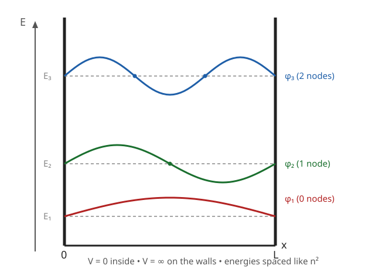

# Quantum Mechanics · Lesson 2.3: The infinite square well

> ⏱ ~15 min · Module 2: The Schrödinger equation and one-dimensional systems · Builds on: [2.1 The Schrödinger equation](#/lesson/quantum-mechanics/02-01-schrodinger-equation.md), [2.2 Stationary states and time evolution](#/lesson/quantum-mechanics/02-02-stationary-states-time-evolution.md) · Unlocks: 2.4 the finite well and tunneling, and every later "particle in a box" model

## Why this matters

This is the hydrogen atom of pedagogy: the simplest system where the Schrödinger equation actually produces the thing that makes quantum mechanics quantum — a **discrete ladder of allowed energies**. No potential to fight, no special functions, just a wave trapped between two walls. And it isn't a toy: it's the working model for electrons in quantum dots, $\pi$-electrons in conjugated molecules, and any nanostructure small enough that confinement matters. Master it and you own the three signatures you'll see in every bound system afterward — quantized energies, a nonzero ground-state energy, and eigenstates that form a basis you expand everything else in.

## The idea

Take a guitar string clamped at both ends. Pluck it and it doesn't vibrate at just any frequency — only the shapes with a fixed number of humps *fit* between the clamps: one hump, two humps, three. The rest die out. The string quantizes its own modes purely because the ends are pinned.

A quantum particle in a box is the same picture, one level up. The particle is a wave; the walls are the clamps; "pinned at the ends" means the wavefunction must vanish there. Only wavelengths that fit an exact number of half-humps into the box survive. A shorter wavelength means a wigglier wave, and in quantum mechanics wiggle *is* energy (curvature of $\psi$ is kinetic energy). So the discrete list of fitting wavelengths becomes a discrete list of energies. That's the whole lesson: **confinement + boundary conditions = quantization.**

## The formal version

The **infinite square well** is the potential

$$V(x) = \begin{cases} 0 & 0 < x < L \\ \infty & \text{otherwise,}\end{cases}$$

a particle of mass $m$ free to roam inside $[0,L]$ but forbidden outside. Because $V=\infty$ outside, the wavefunction is exactly $0$ there — infinite energy cost keeps the particle strictly inside. Continuity then forces the **boundary conditions**

$$\varphi(0) = \varphi(L) = 0.$$

*In words: the wave must reach zero at both walls, just like the clamped string.*

Inside the well $V=0$, so the time-independent Schrödinger equation (from [2.1](#/lesson/quantum-mechanics/02-01-schrodinger-equation.md)) is

$$-\frac{\hbar^2}{2m}\frac{d^2\varphi}{dx^2} = E\,\varphi \quad\Longrightarrow\quad \varphi'' = -k^2\varphi, \qquad k \equiv \frac{\sqrt{2mE}}{\hbar},$$

where $\hbar$ is the reduced Planck constant and $k$ is the wavenumber. The general solution is $\varphi(x) = A\sin kx + B\cos kx$. The left wall $\varphi(0)=0$ kills the cosine ($B=0$). The right wall $\varphi(L)=0$ then demands $\sin kL = 0$, i.e.

$$kL = n\pi, \qquad n = 1,2,3,\dots$$

*In words: only whole numbers of half-wavelengths fit in the box.* ($n=0$ gives $\varphi\equiv 0$ — no particle — so it's excluded; negative $n$ just flips an overall sign.) Feeding $k_n = n\pi/L$ back through $E = \hbar^2 k^2/2m$ and normalizing $\int_0^L|\varphi|^2\,dx = 1$ gives the complete answer:

$$\boxed{\;\varphi_n(x) = \sqrt{\frac{2}{L}}\,\sin\!\frac{n\pi x}{L}, \qquad E_n = \frac{n^2\pi^2\hbar^2}{2mL^2}, \qquad n = 1,2,3,\dots\;}$$

Read off the structure:

- **Quantized energies, spaced like $n^2$:** $E_1, 4E_1, 9E_1, \dots$ — the gaps *widen* as you climb.
- **Nonzero ground state.** $E_1 = \pi^2\hbar^2/2mL^2 > 0$: the particle can never sit still at the bottom. This is confinement made energetic — pin a particle into a region of size $L$ and the uncertainty principle ($\Delta x \sim L \Rightarrow \Delta p \gtrsim \hbar/L$) forces kinetic energy $\sim \hbar^2/2mL^2$, exactly the scale of $E_1$. A classical marble can rest on the floor with $E=0$; a quantum one cannot.
- **The scalings.** $E_n \propto 1/L^2$ — *squeeze the box and energies shoot up, steeply* (halve $L$, quadruple every energy). And $E_n \propto 1/m$ — heavier particles have a denser ladder. These two facts explain why confinement effects are huge for light electrons in nanometer boxes and negligible for anything macroscopic.
- **Node counting.** $\varphi_n$ crosses zero $n-1$ times *inside* the well (the walls don't count). More nodes = more curvature = more energy — the ordering is automatic.

**Orthonormality.** The eigenfunctions form an orthonormal set:

$$\int_0^L \varphi_m(x)\,\varphi_n(x)\,dx = \delta_{mn},$$

where $\delta_{mn}$ is $1$ if $m=n$ and $0$ otherwise. *In words: distinct energy states are perpendicular — this is the Hilbert-space orthogonality of [1.3](#/lesson/quantum-mechanics/01-03-hilbert-space-dirac-notation.md), now concrete.* (It's just the standard $\int_0^L \sin\frac{m\pi x}{L}\sin\frac{n\pi x}{L}\,dx = \frac{L}{2}\delta_{mn}$.)

**Expansion in the basis.** Because the $\{\varphi_n\}$ are a complete orthonormal set, *any* state inside the well can be written as

$$\psi(x) = \sum_{n=1}^\infty c_n\,\varphi_n(x), \qquad c_n = \int_0^L \varphi_n(x)\,\psi(x)\,dx.$$

*In words: to find how much of mode $n$ is present, project onto $\varphi_n$ — exactly like reading off a Fourier coefficient.* The dynamics then come for free (from [2.2](#/lesson/quantum-mechanics/02-02-stationary-states-time-evolution.md)): each mode just spins its own phase,

$$\Psi(x,t) = \sum_{n=1}^\infty c_n\,\varphi_n(x)\,e^{-iE_n t/\hbar},$$

and $|c_n|^2$ is the probability that a measurement of energy returns $E_n$.

## Picture

Each eigenfunction is drawn riding on its own energy level, so you can see three things at once: the $n^2$ spacing (the gaps grow going up), the node count (0, 1, 2 interior zeros), and the clamped ends (every curve hits the walls at zero).

## Worked examples

**Example 1 (mechanical — put in numbers).** An electron is confined to a well of width $L = 5\ \text{Å} = 0.5\ \text{nm}$ (roughly a small molecule). Find $E_1$. Using the handy constant $\hbar^2/2m_e = 3.81\ \text{eV·Å}^2$ for the electron,

$$E_1 = \frac{\pi^2\hbar^2}{2m_e L^2} = \frac{\pi^2 (3.81\ \text{eV·Å}^2)}{(5\ \text{Å})^2} = \frac{9.87 \times 3.81}{25}\ \text{eV} \approx 1.5\ \text{eV}.$$

So $E_2 = 4E_1 \approx 6.0\ \text{eV}$ and $E_3 = 9E_1 \approx 13.5\ \text{eV}$ — spacings of order electron-volts, i.e. the box emits and absorbs *visible-to-UV* light. That's not a coincidence: it's why the physical size of atoms and small molecules sets the color of the light they trade with.

**Example 2 (why you'd care — superposition sloshes).** Prepare $\Psi(x,0) = \frac{1}{\sqrt{2}}\big(\varphi_1 + \varphi_2\big)$, an equal mix of the two lowest states. Evolve it:

$$\Psi(x,t) = \tfrac{1}{\sqrt2}\Big(\varphi_1 e^{-iE_1 t/\hbar} + \varphi_2 e^{-iE_2 t/\hbar}\Big).$$

The probability density picks up a cross term,

$$|\Psi(x,t)|^2 = \tfrac12\Big(\varphi_1^2 + \varphi_2^2 + 2\varphi_1\varphi_2\cos\tfrac{(E_2-E_1)t}{\hbar}\Big),$$

which **oscillates** at the Bohr frequency $\omega_{21} = (E_2 - E_1)/\hbar = 3E_1/\hbar$: the electron's probability piles up on the left, then sloshes to the right, back and forth forever. A single stationary state is static (its $|\varphi_n|^2$ is time-independent); *motion in this box is what a superposition of two energies looks like.* This oscillating charge is exactly the antenna that later radiates in Module 6.

## Watch out

- You might think the lowest state is $n=0$ with $E=0$. But $n=0$ makes $\varphi\equiv 0$ — literally no particle — so the ground state is $n=1$ with $E_1 > 0$. **Zero-point energy is mandatory**, not optional; it's the uncertainty principle cashed out.
- You might expect $\varphi'$ to be continuous at the walls, as it is everywhere in a finite potential. It is *not* here: $\varphi$ has a kink at each wall. That's the one exception the rule allows — where $V$ is genuinely infinite, the slope may jump. (In [2.4](#/lesson/quantum-mechanics/02-04-finite-square-well.md) the walls become finite, $\varphi'$ becomes continuous again, and the wave leaks out.)
- You might read "probability of energy $E_n$" as $c_n$. It's $|c_n|^2$, and only for a **normalized** state ($\sum |c_n|^2 = 1$). The coefficient $c_n$ is an amplitude; square its modulus to get a probability.
- Doubling the box does **not** halve the energies — it quarters them. The dependence is $1/L^2$, not $1/L$. Confinement bites nonlinearly.

## One-liner

> Trap a wave between two walls and only the standing modes with nodes at both ends survive — $k_n = n\pi/L$ — so the energies quantize as $E_n \propto n^2/L^2$, with a ground state that can never be zero.

## Problems

**P1 (🟢)** Working in units of $E_0 \equiv \dfrac{\pi^2\hbar^2}{2mL^2}$, write down $E_1$, $E_2$, and $E_3$. Then a particle drops from $n=2$ to $n=1$, emitting one photon. What is the photon's energy (in terms of $E_0$, and hence of the well parameters)?

**P2 (🟡)** A particle in the well starts in $\Psi(x,0) = \dfrac{1}{\sqrt5}\,\varphi_1(x) + \dfrac{2}{\sqrt5}\,\varphi_2(x)$. (a) Confirm it's normalized. (b) Find $\langle E\rangle$. (c) If you measure the energy, what is the probability of getting $E_1$? What is the state right after that outcome?

**P3 (🔴, optional)** For the $n$-th eigenstate $\varphi_n$, compute $\langle x\rangle$ and $\langle x^2\rangle$, and hence the position uncertainty $\sigma_x$. Then take $n\to\infty$ and compare $\sigma_x$ to a *classical* particle bouncing back and forth in $[0,L]$ (uniform probability of being found anywhere in the box). What does the comparison say?

Solutions

**P1** Since $E_n = n^2 E_0$: $\;E_1 = E_0,\; E_2 = 4E_0,\; E_3 = 9E_0.$ The emitted photon carries the energy lost:

$$E_\gamma = E_2 - E_1 = 4E_0 - E_0 = 3E_0 = \frac{3\pi^2\hbar^2}{2mL^2}.$$

(Its frequency is $\omega = E_\gamma/\hbar = 3\pi^2\hbar/2mL^2$ — the same Bohr frequency that made Example 2's density slosh.)

**P2** Coefficients: $c_1 = 1/\sqrt5$, $c_2 = 2/\sqrt5$, so $|c_1|^2 = \tfrac15$, $|c_2|^2 = \tfrac45$.

(a) $\;|c_1|^2 + |c_2|^2 = \tfrac15 + \tfrac45 = 1.$ ✓ Normalized. (The orthonormality of $\varphi_1,\varphi_2$ is what lets us just add squared coefficients — no cross term.)

(b) Expectation of energy is the probability-weighted average of the eigenvalues:

$$\langle E\rangle = |c_1|^2 E_1 + |c_2|^2 E_2 = \tfrac15(E_0) + \tfrac45(4E_0) = \tfrac{1}{5}E_0 + \tfrac{16}{5}E_0 = \frac{17}{5}E_0 = \frac{17\pi^2\hbar^2}{10\,mL^2}.$$

Note $\langle E\rangle = 3.4\,E_0$ sits between $E_1$ and $E_2$, as any average of the two must.

(c) $P(E_1) = |c_1|^2 = \tfrac15 = 0.2.$ By the collapse postulate ([1.5](#/lesson/quantum-mechanics/01-05-measurement-expectation-values.md)), measuring $E_1$ projects the state onto that eigenspace: immediately after, the particle is in $\varphi_1(x) = \sqrt{2/L}\,\sin(\pi x/L)$ (up to phase), and a repeat measurement now yields $E_1$ with certainty.

**P3** Use $\varphi_n = \sqrt{2/L}\,\sin(n\pi x/L)$.

*Mean position.* $\displaystyle \langle x\rangle = \frac{2}{L}\int_0^L x\sin^2\!\frac{n\pi x}{L}\,dx = \frac{L}{2}$ for every $n$ — the density $\sin^2(n\pi x/L)$ is symmetric about the midpoint, so the average position is dead center regardless of the state.

*Mean square.* Write $\sin^2\theta = \tfrac12(1-\cos 2\theta)$:

$$\langle x^2\rangle = \frac{2}{L}\int_0^L x^2\sin^2\!\frac{n\pi x}{L}\,dx = \frac{1}{L}\left[\int_0^L x^2\,dx - \int_0^L x^2\cos\frac{2n\pi x}{L}\,dx\right].$$

The first integral is $L^3/3$. For the second, with $k = 2n\pi/L$, integration by parts (twice) gives $\int_0^L x^2\cos kx\,dx = 2L/k^2 = L^3/(2n^2\pi^2)$ (the boundary sines vanish since $\sin(2n\pi)=0$). Hence

$$\langle x^2\rangle = \frac{1}{L}\left[\frac{L^3}{3} - \frac{L^3}{2n^2\pi^2}\right] = L^2\left(\frac{1}{3} - \frac{1}{2n^2\pi^2}\right).$$

*Uncertainty.*

$$\sigma_x^2 = \langle x^2\rangle - \langle x\rangle^2 = L^2\left(\frac13 - \frac{1}{2n^2\pi^2}\right) - \frac{L^2}{4} = L^2\left(\frac{1}{12} - \frac{1}{2n^2\pi^2}\right),$$

$$\sigma_x = L\sqrt{\frac{1}{12} - \frac{1}{2n^2\pi^2}}.$$

*Classical limit.* A classical particle bouncing in $[0,L]$ spends equal time everywhere — a uniform distribution, whose variance is the textbook $L^2/12$, i.e. $\sigma_x^{\text{cl}} = L/\sqrt{12} = L/(2\sqrt3) \approx 0.289\,L$. As $n\to\infty$ the quantum correction $\tfrac{1}{2n^2\pi^2}\to 0$ and $\sigma_x \to L/\sqrt{12}$ — **the quantum spread converges to the classical one.** This is the correspondence principle in action: at high quantum numbers the rapid $\sin^2$ oscillations average out to the flat classical density, and the $1/n^2$ term is precisely the residual quantumness that fades as the state gets highly excited.

## Flashback

**From Lesson 1.2 (The wavefunction and the Born rule):** Not every state in the well is an energy eigenstate. Normalize the trial wavefunction $\psi(x) = A\,x(L-x)$ on $[0,L]$ (it vanishes at both walls, so it's a legitimate state) — find $A$.

Solution

Normalization demands $\int_0^L |\psi|^2\,dx = 1$, i.e. $|A|^2\int_0^L x^2(L-x)^2\,dx = 1$. Expand $x^2(L-x)^2 = L^2 x^2 - 2L x^3 + x^4$ and integrate:

$$\int_0^L \big(L^2 x^2 - 2Lx^3 + x^4\big)\,dx = \frac{L^5}{3} - \frac{L^5}{2} + \frac{L^5}{5} = L^5\left(\frac{10 - 15 + 6}{30}\right) = \frac{L^5}{30}.$$

So $|A|^2 \cdot L^5/30 = 1 \Rightarrow A = \sqrt{30/L^5}$. (This parabola is a superb approximation to the true ground state $\varphi_1$ — you'll meet it again as the trial function in the variational method, 6.3.)

## Connections

- **Backward:** this is [2.1](#/lesson/quantum-mechanics/02-01-schrodinger-equation.md)'s time-independent Schrödinger equation solved in the cleanest possible potential; the $|c_n|^2$ measurement rule and the phase evolution $e^{-iE_n t/\hbar}$ are straight from [2.2](#/lesson/quantum-mechanics/02-02-stationary-states-time-evolution.md); "orthonormal eigenfunctions that span the space" is the completeness of [1.3](#/lesson/quantum-mechanics/01-03-hilbert-space-dirac-notation.md) made explicit, with $E_n$ the real eigenvalues of the Hermitian $\hat H$ from [1.4](#/lesson/quantum-mechanics/01-04-observables-hermitian-operators.md).
- **Forward:** [2.4](#/lesson/quantum-mechanics/02-04-finite-square-well.md) lowers the walls to a finite height — the wave leaks out, $\varphi'$ becomes continuous, and only finitely many bound states survive. The sine basis here is a Fourier sine series, which is exactly the machinery [2.6](#/lesson/quantum-mechanics/02-06-free-particle-wave-packets.md) uses to build free-particle wave packets.
- **Sideways (math):** the clamped-string modes are the same boundary-value eigenproblem you solve for a vibrating string or a Fourier sine expansion in an ODE course; expanding an arbitrary $\psi$ in $\{\varphi_n\}$ is orthonormal-basis projection — the spectral theorem from `linalg-refresher` wearing a physics hat.
