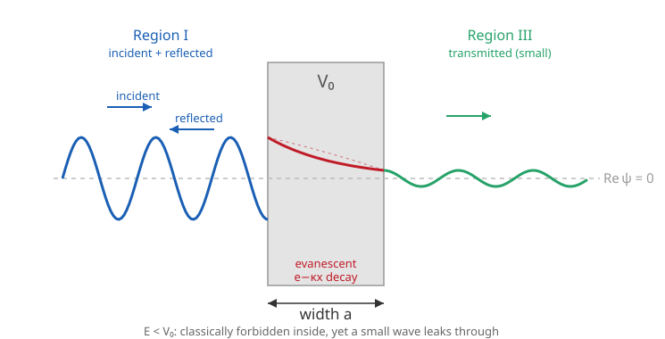

# Quantum Mechanics · Lesson 2.5: Scattering, barriers, and tunneling

> ⏱ ~15 min · Module 2: The Schrödinger equation and 1D systems · Builds on: [2.4 The finite square well](#/lesson/quantum-mechanics/02-04-finite-square-well.md), [1.2 The wavefunction and the Born rule](#/lesson/quantum-mechanics/01-02-wavefunction-born-rule.md) · Unlocks: 2.6 free particle & wave packets, Boss Problem 2, WKB tunneling (6.4)

## Why this matters

Every bound-state lesson so far asked "what energies are allowed?" Now we ask the *open* question: fire a particle at an obstacle and ask what comes back and what gets through. The classical answer is a step function — over the hill or not — but the quantum answer is a *probability*, and it contains the single most famous non-classical effect in the subject: **tunneling**, a particle passing through a wall taller than its energy. This isn't a curiosity. It is why the sun shines (fusion needs protons to tunnel through their mutual repulsion), why unstable nuclei decay (alpha particles tunnel out), and how a scanning tunneling microscope reads individual atoms. Boss Problem 2 is exactly this calculation.

## The idea

Classically a ball rolling at a hill either has enough energy to crest it or it rolls back — end of story, and if it lacks the energy it is *never* found on the far side. Quantum mechanically the wavefunction doesn't stop dead at the wall. Inside a region where its energy $E$ is below the potential $V_0$, the Schrödinger equation stops being an oscillator and becomes a *decay* equation: instead of $\psi'' = -k^2\psi$ (waves) you get $\psi'' = +\kappa^2\psi$ (real exponentials). The wave doesn't vanish at the wall; it **leaks in as a decaying exponential** — an *evanescent* wave. If the wall is thin enough, the exponential hasn't died to zero by the far side, so a small but nonzero wave emerges and travels on. That leaked amplitude is the tunneling probability.

Two headline surprises come out of this, both absent in classical physics:

- **Enough energy still isn't a guarantee.** Even with $E > V_0$ — enough to sail over — a wave *partially reflects* off any abrupt change in the potential, just as light partially reflects off a pane of glass it has plenty of energy to cross. Reflection is about the *sudden change in wavelength*, not about lacking energy.
- **Not enough energy isn't a prohibition.** With $E < V_0$ a finite wall gives a nonzero transmission. The narrower and lower the wall, the more gets through — and the dependence is brutally *exponential*.

## The formal version

**The step (a single edge).** Let $V=0$ for $x<0$ and $V=V_0$ for $x>0$, and send a particle in from the left with energy $E$. Define the wavenumbers $k=\sqrt{2mE}/\hbar$ (left) and, for $E>V_0$, $k'=\sqrt{2m(E-V_0)}/\hbar$ (right). Matching $\psi$ and $\psi'$ at $x=0$ gives the reflected and transmitted amplitudes; the reflection probability is

$$R=\left(\frac{k-k'}{k+k'}\right)^2\neq 0 \quad(\text{even for } E>V_0).$$

*In words:* an abrupt change in wavenumber always throws some of the wave back — only a perfectly smooth potential reflects nothing. If instead $E<V_0$, then $k'$ turns imaginary, $R=1$ (total reflection), and the wave penetrates the step as a pure decaying exponential $e^{-\kappa x}$ with $\kappa=\sqrt{2m(V_0-E)}/\hbar$ — present, but carrying no transmitted current.

**The rectangular barrier.** Now the forbidden region is *finite*: $V=V_0$ only for $0<x<a$, and $V=0$ on both sides, with $E<V_0$. Write a plane wave in each region:

$$\psi(x)=\begin{cases} A e^{ikx}+B e^{-ikx}, & x<0 \quad(\text{incident }A,\ \text{reflected }B)\\ Ce^{\kappa x}+De^{-\kappa x}, & 0<x<a \quad(\text{evanescent})\\ F e^{ikx}, & x>a \quad(\text{transmitted }F, \text{ nothing coming back}) \end{cases}$$

with $k=\sqrt{2mE}/\hbar$ and $\kappa=\sqrt{2m(V_0-E)}/\hbar$. Matching $\psi$ and $\psi'$ at $x=0$ and $x=a$ is four equations in the five ratios — the same continuity machinery as the [finite well (2.4)](#/lesson/quantum-mechanics/02-04-finite-square-well.md), just with an outgoing wave instead of a bound one. Solve for $F/A$. Define

$$R=\left|\frac{B}{A}\right|^2,\qquad T=\left|\frac{F}{A}\right|^2,\qquad \boxed{R+T=1}.$$

*In words:* $R$ is the fraction reflected, $T$ the fraction transmitted, and since the particle must end up somewhere, they sum to one. (Here both outer regions have the *same* potential, hence the same $k$, so $T$ is simply $|F/A|^2$ — no velocity correction needed. That correction returns in Problem 2.) The algebra yields the central result:

$$\boxed{\,T=\left[\,1+\frac{V_0^{\,2}\sinh^2(\kappa a)}{4E(V_0-E)}\,\right]^{-1}},\qquad \kappa=\frac{\sqrt{2m(V_0-E)}}{\hbar}.$$

*In words:* the taller ($V_0$), wider ($a$), or "deeper below the top" ($V_0-E$) the barrier, the larger $\sinh^2(\kappa a)$, and the smaller $T$. This is the formula Boss Problem 2 asks you to derive.

**The thick-/high-barrier limit.** When $\kappa a\gg 1$ (a strong barrier), $\sinh(\kappa a)\approx\frac12 e^{\kappa a}$, so $\sinh^2\approx\frac14 e^{2\kappa a}$ dominates the bracket and

$$\boxed{\,T\approx \frac{16\,E(V_0-E)}{V_0^{\,2}}\,e^{-2\kappa a}\,}.$$

*In words:* transmission is governed almost entirely by the exponential $e^{-2\kappa a}$; the prefactor is an $O(1)$ correction. Tunneling probability falls off **exponentially in the barrier width and in $\sqrt{V_0-E}$** — the fact that makes tunneling both spectacularly small and spectacularly sensitive. A handy numerical shortcut for electrons: $\kappa \approx 5.12\,\sqrt{(V_0-E)/\text{eV}}\ \text{nm}^{-1}$ (from $m_ec^2=0.511$ MeV, $\hbar c=197.3$ eV·nm).

## Picture

The left region carries the full incident-plus-reflected amplitude; inside the barrier the wave is *evanescent* — a real exponential $e^{-\kappa x}$ with no oscillation, sketched with its dashed decay envelope; and a small-amplitude copy of the wave emerges on the right, its size set by how much of the exponential survived the crossing.

## Worked examples

**Example 1 (mechanical — the formula and its limit agree).** An electron with $E=1$ eV hits a barrier of height $V_0=5$ eV and width $a=0.5$ nm. Then $V_0-E=4$ eV, so

$$\kappa=5.12\sqrt{4}\ \text{nm}^{-1}=10.25\ \text{nm}^{-1},\qquad \kappa a=5.12.$$

Exact formula: $\sinh(5.12)=83.9$, so $\sinh^2=6994$, and

$$T=\left[1+\frac{(5)^2(6994)}{4(1)(4)}\right]^{-1}=\frac{1}{1+10928}=9.1\times10^{-5}.$$

Thick-barrier shortcut: $e^{-2\kappa a}=e^{-10.25}=3.5\times10^{-5}$ and prefactor $16(1)(4)/25=2.56$, giving $T\approx 2.56\times3.5\times10^{-5}=9.1\times10^{-5}$. The two agree to two figures — with $\kappa a\approx 5$ the exponential already rules. About one electron in eleven thousand gets through.

**Example 2 (why you'd care — alpha decay and the Geiger–Nuttall law).** An alpha particle rattling inside a heavy nucleus is trapped behind the Coulomb barrier — the electrostatic repulsion of the daughter nucleus, a wall a few times taller than the alpha's energy. Decay *is* tunneling: each collision with the wall carries a tiny probability $T\sim e^{-2\kappa a}$ (really $e^{-2\int\kappa\,dx}$ for the smooth Coulomb shape — the [WKB generalization (6.4)](#/lesson/quantum-mechanics/06-04-wkb-approximation.md)). The half-life is that probability inverted times the collision rate. Because $T$ sits inside an exponential, a *factor-of-two* change in alpha energy shifts half-lives across **twenty-plus orders of magnitude** — from microseconds to billions of years. That staggering lever is the Geiger–Nuttall law, and Gamow's 1928 tunneling calculation was one of quantum theory's first great confirmations.

## Watch out

- You might think the particle "borrows energy" to climb over the wall and pays it back. It doesn't — energy is conserved, and you never *catch* it inside with $E<V_0$. What lives in the barrier is an evanescent wavefunction (a real decaying exponential), not a classical particle mid-flight. Nothing measurable is amiss; the leaked amplitude on the far side is all there is to explain.
- You might think transmission is always $T=|F/A|^2$. That holds only when the incident and transmitted regions share the same potential (same $k$), as in the rectangular barrier. Across a *step* the two sides have different $k$, so you must weight by the probability current: $T=(k_{\text{trans}}/k_{\text{inc}})\,|F/A|^2$. Forget the weight and $R+T\neq 1$ (Problem 2 is exactly this).
- You might confuse $\sinh$ with $\sin$. For $E<V_0$ the interior is evanescent and $\sinh(\kappa a)$ appears; for $E>V_0$ over a well/barrier the interior *oscillates*, $\kappa\to ik'$, and $\sinh\to i\sin$ — which can hit zero, giving perfect transmission $T=1$ (resonances). Same formula, but the hyperbolic-vs-trig switch flips the physics.

## One-liner

> A wall taller than a particle's energy still lets it through, with odds that collapse exponentially in the wall's width — $T\sim e^{-2\kappa a}$, the effect classical physics casts no shadow of.

## Problems

**P1 (🟢)** An electron of energy $E=2$ eV strikes a barrier of height $V_0=6$ eV and width $a=0.4$ nm. Compute $\kappa$ and the exponential suppression factor $e^{-2\kappa a}$. (Use $\kappa\approx 5.12\sqrt{(V_0-E)/\text{eV}}\ \text{nm}^{-1}$.)

**P2 (🟡)** For the *step* potential ($V=0$ for $x<0$, $V=V_0$ for $x>0$) with $E>V_0$, the amplitudes satisfy $B/A=(k-k')/(k+k')$ and $F/A=2k/(k+k')$, where $k=\sqrt{2mE}/\hbar$, $k'=\sqrt{2m(E-V_0)}/\hbar$. Using the flux-weighted coefficients $R=|B/A|^2$ and $T=(k'/k)\,|F/A|^2$, show that $R+T=1$. Explain in one line why the naive $T=|F/A|^2$ *fails* here but is fine for the rectangular barrier.

**P3 (🔴, optional)** In the thick-barrier regime $T\approx C\,e^{-2\kappa a}$ with $C=16E(V_0-E)/V_0^2$ nearly constant.
(a) Show that *doubling* the width $a\to 2a$ multiplies $T$ by $e^{-2\kappa a}$, and evaluate that factor for the Example 1 barrier ($\kappa=10.25\ \text{nm}^{-1}$, $a=0.5$ nm).
(b) An STM tunnels electrons across a vacuum gap with work-function barrier $V_0-E\approx 4$ eV, so $\kappa\approx 10.25\ \text{nm}^{-1}\approx 1.0\ \text{Å}^{-1}$. The tunneling current obeys $I\propto T\propto e^{-2\kappa a}$. By what factor does the current change when the tip moves $1$ Å ($=0.1$ nm) closer? Connect this to why the STM resolves single atoms.

Solutions

**P1** Here $V_0-E=4$ eV, so $\kappa=5.12\sqrt{4}=10.25\ \text{nm}^{-1}=1.025\times10^{10}\ \text{m}^{-1}$. Then
$$2\kappa a=2(10.25)(0.4)=8.20,\qquad e^{-2\kappa a}=e^{-8.20}=2.7\times10^{-4}.$$
So even before the $O(1)$ prefactor, only a few parts in ten thousand of the wave tunnels through — and shrinking the gap or lowering the barrier changes that *exponentially*.

**P2** Compute each coefficient:
$$R=\left(\frac{k-k'}{k+k'}\right)^2,\qquad T=\frac{k'}{k}\left(\frac{2k}{k+k'}\right)^2=\frac{4kk'}{(k+k')^2}.$$
Add them over the common denominator $(k+k')^2$:
$$R+T=\frac{(k-k')^2+4kk'}{(k+k')^2}=\frac{k^2-2kk'+k'^2+4kk'}{(k+k')^2}=\frac{(k+k')^2}{(k+k')^2}=1.\ \checkmark$$
*Why the weight is needed:* the transmitted probability current is $j=(\hbar k'/m)|F|^2$, carrying the region's *own* wavenumber $k'\neq k$. What must balance is *current*, not amplitude, so $T=j_{\text{trans}}/j_{\text{inc}}=(k'/k)|F/A|^2$. In the rectangular barrier both outer regions have identical potential, hence identical $k$, the $k'/k$ factor is $1$, and $T=|F/A|^2$ is correct. (This is probability-current conservation from [1.2](#/lesson/quantum-mechanics/01-02-wavefunction-born-rule.md) applied at a boundary.)

**P3** (a) With $T(a)\approx C\,e^{-2\kappa a}$,
$$\frac{T(2a)}{T(a)}=\frac{C\,e^{-2\kappa(2a)}}{C\,e^{-2\kappa a}}=e^{-2\kappa a}.$$
For $\kappa=10.25\ \text{nm}^{-1}$, $a=0.5$ nm: $e^{-2\kappa a}=e^{-10.25}=3.5\times10^{-5}$. Doubling the width drops transmission by roughly *thirty thousand–fold* — the far tail of an exponential is unforgiving.

(b) Moving $1$ Å closer means $\Delta a=-0.1$ nm, so the current changes by
$$\frac{I_{\text{new}}}{I_{\text{old}}}=e^{-2\kappa\,\Delta a}=e^{+2(10.25)(0.1)}=e^{2.05}\approx 7.8.$$
Nearly an *order of magnitude per angstrom*. Because the current is exponentially sensitive to the gap, a sub-angstrom change in tip height produces a large, easily measured current change — so as the tip scans across a surface, atom-scale bumps of a fraction of an angstrom register as big current swings. That exponential lever is precisely what gives the STM its atomic vertical resolution.

## Flashback

**From Lesson 2.4 (The finite square well):** A bound electron in a finite well sits with binding energy $2$ eV below the top of the well (outside, $V=0$ and $E=-2$ eV), so its wavefunction decays outside as $e^{-\kappa|x|}$ with $\kappa=\sqrt{2m|E|}/\hbar$. Find the penetration depth $1/\kappa$. What does its closeness to the $\kappa$ of a *tunneling* barrier tell you?

Solution

Using the same shortcut, $\kappa=5.12\sqrt{2}=7.25\ \text{nm}^{-1}$, so
$$\frac1\kappa=\frac{1}{7.25\ \text{nm}^{-1}}=0.14\ \text{nm}\approx 1.4\ \text{Å}.$$
The electron's presence bleeds about an angstrom past the wall before dying out. This is the *identical* $\kappa=\sqrt{2m(V_0-E)}/\hbar$ that governs the evanescent decay inside a tunneling barrier — a bound state's leakage and a scattering state's tunneling are the *same* exponential penetration. Tunneling is just what happens when a second wall appears before that exponential has finished decaying, letting the leaked wave re-emerge as a traveling wave.

## Connections

- **Backward:** the barrier is [2.4](#/lesson/quantum-mechanics/02-04-finite-square-well.md)'s continuity-matching of $\psi,\psi'$ turned inside out — an *outgoing* wave instead of a bound one, but the very same $\kappa$ and the same evanescent penetration. And $R+T=1$ is the probability-current conservation of [1.2](#/lesson/quantum-mechanics/01-02-wavefunction-born-rule.md) enforced across a boundary.
- **Forward:** this is the engine of **Boss Problem 2** (derive $T$, take the thick limit, estimate a real case). A physical particle is a wave *packet* ([2.6](#/lesson/quantum-mechanics/02-06-free-particle-wave-packets.md)), so real tunneling transmits a spread of $k$'s; and smooth barriers replace $e^{-2\kappa a}$ with the WKB integral $e^{-2\int\kappa\,dx}$ in [6.4](#/lesson/quantum-mechanics/06-04-wkb-approximation.md), which is how alpha decay and fusion rates are actually computed.
- **Sideways (optics/EM):** an evanescent wave is exactly *frustrated total internal reflection* — light "tunneling" across the thin gap between two prisms, the same decaying-exponential-across-a-gap mathematics from the `em-refresher` wave equations, with photons in place of electrons.
