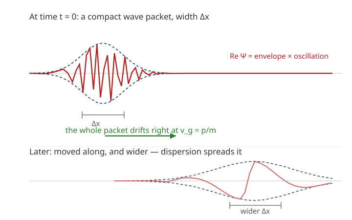

# Quantum Mechanics · Lesson 2.6: The free particle and wave packets

> ⏱ ~15 min · Module 2: The Schrödinger equation and one-dimensional systems · Builds on: [2.1 The Schrödinger equation](#/lesson/quantum-mechanics/02-01-schrodinger-equation.md), [2.2 Stationary states and time evolution](#/lesson/quantum-mechanics/02-02-stationary-states-time-evolution.md), [2.5 Scattering, barriers, and tunneling](#/lesson/quantum-mechanics/02-05-scattering-barriers-tunneling.md) · Unlocks: Module 3 — the harmonic oscillator, and the uncertainty principle (3.3) that this lesson quietly previews

## Why this matters

Every bound-state problem so far handed you a nice discrete spectrum: the well quantizes energies because walls fence the particle in. Remove the walls — set $V=0$ everywhere — and the quantization vanishes: a free particle can have *any* energy. But this "easiest" potential hides the subtlest lesson in the module. The obvious plane-wave solution turns out to be **not a physical state at all**, and repairing that defect forces you to build a particle out of a *continuum* of waves — a wave packet. Out of that construction fall three things you will use forever: the distinction between phase and group velocity (why a matter wave and the particle it describes move at different speeds), the inevitability that a localized particle **spreads**, and a Fourier width relation $\Delta x\,\Delta k \gtrsim 1$ that is the uncertainty principle in disguise.

## The idea

A free particle should be the simplest object in quantum mechanics — nothing pushing on it. Try the natural guess, a wave of definite wavelength travelling to the right: $\Psi(x,t)=e^{i(kx-\omega t)}$. It solves the equation. But $|\Psi|^2=1$ *everywhere*, out to infinity, so $\int|\Psi|^2\,dx=\infty$: it can't be normalized, so it can't be a probability amplitude for a real particle. A state of perfectly definite momentum is perfectly spread out in space — a mathematical idealization, not a thing.

The fix: real particles are **lumps**. A lump that is somewhat localized in space cannot have a single wavelength; by the same Fourier logic that says a short musical note contains a spread of pitches, a localized wave contains a *spread* of wavenumbers $k$. So you add up plane waves — a superposition over a band of $k$ values — and their crests reinforce in one region and cancel elsewhere, leaving a travelling bump: a **wave packet**. That bump is a legitimate normalizable state, and it is what "a free particle moving along" actually looks like.

Two speeds now appear, and this is the crux. Each individual ripple inside the packet slides along at its **phase velocity**. But the *envelope* — the lump itself, where the particle actually is — travels at the **group velocity**. For matter waves these differ by a factor of two, and it is the group velocity that equals the classical particle speed $p/m$. Finally, because different $k$-components travel at different speeds, the packet slowly smears out: **dispersion**. A quantum particle, left alone, gets fuzzier with time.

## The formal version

**The free particle.** With $V=0$, the time-dependent Schrödinger equation is

$$i\hbar\,\frac{\partial\Psi}{\partial t} = -\frac{\hbar^2}{2m}\frac{\partial^2\Psi}{\partial x^2}.$$

Plugging in the plane wave $\Psi=e^{i(kx-\omega t)}$ (here $k$ is the wavenumber, $\omega$ the angular frequency) gives $\hbar\omega = \dfrac{\hbar^2 k^2}{2m}$, i.e.

$$E=\hbar\omega=\frac{\hbar^2 k^2}{2m},\qquad \omega(k)=\frac{\hbar k^2}{2m},\qquad p=\hbar k.$$

In words: this is just $E=p^2/2m$ rewritten in wave language — the *dispersion relation* tying frequency to wavenumber. Note $\omega$ is **quadratic** in $k$; remember that, it causes everything downstream.

**These plane waves are not states.** Since $|e^{i(kx-\omega t)}|^2=1$, $\int_{-\infty}^{\infty}|\Psi|^2\,dx=\infty$: not normalizable, not physical on its own. They are a *basis* to build with, not members of the club.

**The wave packet.** A genuine state is a continuous superposition:

$$\boxed{\;\Psi(x,t)=\frac{1}{\sqrt{2\pi}}\int_{-\infty}^{\infty}\phi(k)\,e^{i\left(kx-\omega(k)\,t\right)}\,dk\;}$$

In words: weight each plane wave by an amplitude $\phi(k)$ and add them all up; the weights decide the shape. At $t=0$ this is exactly a Fourier transform, so $\phi(k)$ is recovered by the inverse transform:

$$\Psi(x,0)=\frac{1}{\sqrt{2\pi}}\int\phi(k)\,e^{ikx}\,dk,\qquad \phi(k)=\frac{1}{\sqrt{2\pi}}\int\Psi(x,0)\,e^{-ikx}\,dx.$$

In words: **$\phi(k)$ is the Fourier transform of the initial wavefunction** — it *is* the momentum-space wavefunction (with $p=\hbar k$), and $|\phi(k)|^2\,dk$ gives the probability of finding momentum in $[\hbar k,\hbar k+\hbar\,dk]$. Position picture and momentum picture are two Fourier faces of the same state (this is the Fourier-transform machinery from the calculus refresher, now doing physics).

**Two velocities.** Write $\omega(k)$ for the dispersion relation. Then

$$v_p=\frac{\omega}{k}=\frac{\hbar k}{2m}\quad(\text{phase velocity}),\qquad v_g=\left.\frac{d\omega}{dk}\right|_{k_0}=\frac{\hbar k_0}{m}\quad(\text{group velocity}).$$

In words: an individual crest moves at $v_p$; the packet (the bump, the particle) moves at $v_g$. For matter waves $v_g=\dfrac{\hbar k_0}{m}=\dfrac{p_0}{m}=2v_p$ — **the packet moves at exactly the classical speed, twice as fast as its own ripples.** ($k_0$ is the central wavenumber where $\phi(k)$ peaks.)

**Dispersion (spreading).** Expand $\omega$ about the central $k_0$: $\omega(k)\approx\omega_0+v_g\,(k-k_0)+\tfrac12\beta\,(k-k_0)^2$ with $\beta=\omega''(k_0)=\hbar/m$. The linear term just translates the packet at $v_g$; the quadratic term — nonzero precisely because $\omega\propto k^2$ — makes different $k$-components drift out of step, so the envelope **broadens** over time. A Gaussian packet of initial width $\sigma_0$ widens as

$$\sigma(t)=\sigma_0\sqrt{1+\left(\frac{\hbar t}{2m\sigma_0^2}\right)^2}.$$

In words: sharper packets (small $\sigma_0$) spread *faster* — localizing a particle tightly makes it fly apart sooner.

**The Fourier width relation.** For any packet, the spatial width $\Delta x$ and the wavenumber width $\Delta k$ obey

$$\Delta x\,\Delta k\gtrsim \tfrac12,$$

a pure fact about Fourier transforms (narrow in $x$ ⇒ broad in $k$, and vice versa). Multiply by $\hbar$ and use $p=\hbar k$: $\Delta x\,\Delta p\gtrsim \hbar/2$. In words: **the uncertainty principle is Fourier duality wearing a physics hat** — we make it a theorem in lesson 3.3.

## Picture

The oscillation under the envelope is the carrier (crests moving at $v_p$); the envelope is where the particle actually is, sliding right at $v_g=p/m$. Later, dispersion has widened the lump: same particle, fuzzier.

## Worked examples

**Example 1 (mechanical — the two velocities).** A free electron is described by a packet peaked at $k_0=5.0\times10^{10}\ \mathrm{m^{-1}}$. Find $v_p$ and $v_g$ and confirm $v_g=2v_p$. (Use $\hbar=1.055\times10^{-34}\ \mathrm{J\,s}$, $m_e=9.11\times10^{-31}\ \mathrm{kg}$.)

The dispersion relation is $\omega=\hbar k^2/2m$, so

$$v_g=\frac{d\omega}{dk}\bigg|_{k_0}=\frac{\hbar k_0}{m}=\frac{(1.055\times10^{-34})(5.0\times10^{10})}{9.11\times10^{-31}}\approx 5.8\times10^{6}\ \mathrm{m/s}.$$

$$v_p=\frac{\omega}{k_0}=\frac{\hbar k_0}{2m}=\tfrac12 v_g\approx 2.9\times10^{6}\ \mathrm{m/s}.$$

The factor of two is exact and $k$-independent: $v_g/v_p=(\hbar k/m)/(\hbar k/2m)=2$. And the physical check: $v_g=\hbar k_0/m=p_0/m$ — the packet moves at the classical velocity of an electron with momentum $p_0=\hbar k_0$. The crests, by contrast, slide backward *through* the packet at half that speed. (Contrast light in vacuum, where $\omega=ck$ is linear and $v_p=v_g=c$; the quadratic matter-wave dispersion is what splits them.)

**Example 2 (why you'd care — a packet is a superposition that must evolve).** Why does a wave packet spread, when a single energy eigenstate never changes shape? A stationary state $\psi_n e^{-iE_nt/\hbar}$ has $|\Psi|^2=|\psi_n|^2$, frozen — its time dependence is a global phase (lesson 2.2). A packet is a *superposition of many energies* $E(k)=\hbar\omega(k)$, and each rides a **different** phase clock $e^{-i\omega(k)t}$. At $t=0$ the phases are aligned and the crests pile up into a sharp lump. As time runs, the clocks with larger $k$ run faster (since $\omega\propto k^2$), the components dephase at different rates, and the pile-up smears. This is the same mechanism as the two-state beating from lesson 2.2 — just with a continuum of frequencies instead of two. Spreading is not friction or measurement; it is the free evolution of a superposition whose pieces tick at incommensurate rates.

## Watch out

- **You might think** the plane wave $e^{i(kx-\omega t)}$ is *the* free-particle state. **Actually** it is not normalizable and is not a physical state — it is an idealized basis element (definite momentum ⇒ totally delocalized). Only superpositions (packets) are real states — put slogan-style, there is no such thing as a free particle in a stationary state of definite energy.
- **You might think** the particle moves at the speed of the waves you see, $v_p$. **Actually** the observable motion is the envelope at $v_g=p/m$; the crests move at half-speed and are not where the probability is. Confusing the two is the classic error.
- **You might think** the packet spreads because "measurement disturbs it" or because of some force. **Actually** a free packet spreads all by itself, deterministically, because its component frequencies are nonlinear in $k$. Likewise, $\Delta x\,\Delta k\gtrsim\tfrac12$ is a Fourier identity true of *any* wave (sound, light, ocean swells) — the quantum content is only the bridge $p=\hbar k$.

## One-liner

> A free particle is a lump of plane waves: its crests slide at $v_p=\hbar k/2m$, the lump itself carries the particle at $v_g=p/m=2v_p$, and because $\omega\propto k^2$ the lump inevitably spreads — with $\Delta x\,\Delta k\gtrsim\tfrac12$ foreshadowing Heisenberg.

## Problems

**P1 (🟢)** A free neutron packet is peaked at $k_0=2.0\times10^{9}\ \mathrm{m^{-1}}$. Write down $v_p$ and $v_g$ symbolically, show algebraically that $v_g=2v_p$ for the free-particle dispersion $\omega=\hbar k^2/2m$, and state which one is the neutron's actual speed and why.

**P2 (🟡)** A packet has Gaussian momentum amplitude $\phi(k)=\exp\!\big[-(k-k_0)^2/(2\sigma_k^2)\big]$. Compute $\Psi(x,0)$ by Fourier transform, read off the position-space width, and verify $\Delta x\,\Delta k=\tfrac12$ (use the standard deviation of $|\phi|^2$ and $|\Psi|^2$ as the widths). This is the *minimum*-uncertainty case — a direct preview of lesson 3.3.

**P3 (🔴, optional)** (a) For any free packet, show the centroid obeys $\langle x\rangle(t)=\langle x\rangle(0)+v_g\,t$ — the Ehrenfest result that quantum expectation values follow classical trajectories (previewing lesson 3.5). (b) Estimate the time for an electron initially localized to $\Delta x_0\approx 1\ \mathrm{nm}$ to spread appreciably.

Solutions

**P1** With $\omega(k)=\hbar k^2/2m$:

$$v_p=\frac{\omega}{k_0}=\frac{\hbar k_0}{2m},\qquad v_g=\frac{d\omega}{dk}\bigg|_{k_0}=\frac{2\hbar k_0}{2m}=\frac{\hbar k_0}{m}.$$

Dividing, $v_g/v_p=(\hbar k_0/m)\big/(\hbar k_0/2m)=2$, so $v_g=2v_p$ for every $k_0$. The neutron's *actual* speed is $v_g=\hbar k_0/m=p_0/m$: the envelope carries the probability, so where the lump goes is where the particle goes, and $v_g$ matches the classical $p/m$. (Numerically, if wanted: $v_g=(1.055\times10^{-34})(2.0\times10^{9})/(1.675\times10^{-27})\approx 126\ \mathrm{m/s}$, and $v_p\approx 63\ \mathrm{m/s}$.)

**P2** Fourier transform (complete the square / standard Gaussian integral $\int e^{-au^2}e^{iux}\,du=\sqrt{\pi/a}\,e^{-x^2/4a}$). Let $u=k-k_0$, $a=1/(2\sigma_k^2)$:

$$\Psi(x,0)=\frac{1}{\sqrt{2\pi}}\int e^{-u^2/2\sigma_k^2}\,e^{i(k_0+u)x}\,du=\frac{e^{ik_0x}}{\sqrt{2\pi}}\sqrt{2\pi\sigma_k^2}\,e^{-\sigma_k^2x^2/2}=\sigma_k\,e^{ik_0x}\,e^{-\sigma_k^2 x^2/2}.$$

Now read widths from the probability densities.
Momentum side: $|\phi(k)|^2=e^{-(k-k_0)^2/\sigma_k^2}=\exp\!\big[-(k-k_0)^2/\big(2\cdot\tfrac{\sigma_k^2}{2}\big)\big]$, a Gaussian of variance $\sigma_k^2/2$, so $\Delta k=\sigma_k/\sqrt2$.
Position side: $|\Psi(x,0)|^2=\sigma_k^2\,e^{-\sigma_k^2x^2}=\sigma_k^2\exp\!\big[-x^2/\big(2\cdot\tfrac{1}{2\sigma_k^2}\big)\big]$, variance $1/(2\sigma_k^2)$, so $\Delta x=1/(\sigma_k\sqrt2)$.
Product:

$$\Delta x\,\Delta k=\frac{1}{\sigma_k\sqrt2}\cdot\frac{\sigma_k}{\sqrt2}=\frac12.$$

Exactly $\tfrac12$ — the Gaussian saturates the Fourier bound. With $p=\hbar k$: $\Delta x\,\Delta p=\hbar/2$, the minimum allowed by Heisenberg. A sharper $\phi$ (larger $\sigma_k$) narrows $|\phi|^2$? No — larger $\sigma_k$ *widens* $|\phi|^2$ and *narrows* $|\Psi|^2$: pin down position, pay in momentum spread.

**P3** (a) Expand $\omega(k)=\omega_0+v_g(k-k_0)+\tfrac12\beta(k-k_0)^2$ with $\beta=\omega''(k_0)$, and set $q=k-k_0$. The phase in the packet integral becomes

$$kx-\omega t=(k_0x-\omega_0 t)+q\,(x-v_g t)-\tfrac12\beta q^2 t,$$

so

$$\Psi(x,t)=e^{i(k_0x-\omega_0 t)}\frac{1}{\sqrt{2\pi}}\int\phi(k_0+q)\,e^{iq(x-v_g t)}\,e^{-i\beta q^2 t/2}\,dq \equiv e^{i(k_0x-\omega_0 t)}\,F\!\big(x-v_g t,\,t\big).$$

The envelope $F$ depends on position only through the shifted coordinate $x-v_g t$ (the extra $t$ inside $F$ from the $\beta$ term is *even* in $q$, so it only broadens $F$ symmetrically — it never displaces the peak). Hence $|\Psi(x,t)|^2=|F(x-v_g t,\,t)|^2$ is a profile that translates rigidly at $v_g$ while spreading symmetrically about its center, and its mean is

$$\langle x\rangle(t)=\int x\,|F(x-v_g t,t)|^2\,dx=\langle x\rangle(0)+v_g t.$$

The centroid moves in a straight line at the classical velocity $v_g=p_0/m$ — Ehrenfest's theorem in miniature (made general in lesson 3.5).

(b) A quick estimate: from P2, $\Delta x_0\,\Delta k\sim\tfrac12$, so the momentum band is $\Delta k\sim 1/(2\Delta x_0)$, giving a velocity spread $\Delta v=\hbar\,\Delta k/m\sim \hbar/(2m\,\Delta x_0)$. The packet has grown by roughly its own size when $\Delta v\cdot t\sim\Delta x_0$:

$$t\sim\frac{\Delta x_0}{\Delta v}\sim\frac{2m\,\Delta x_0^2}{\hbar}.$$

(This matches the exact Gaussian spreading time $\tau=2m\sigma_0^2/\hbar$ from the $\sigma(t)$ formula.) Numerically, with $\Delta x_0=10^{-9}\ \mathrm{m}$, $m_e=9.11\times10^{-31}\ \mathrm{kg}$, $\hbar=1.055\times10^{-34}\ \mathrm{J\,s}$:

$$t\sim\frac{2(9.11\times10^{-31})(10^{-9})^2}{1.055\times10^{-34}}\approx 1.7\times10^{-14}\ \mathrm{s}\approx 17\ \mathrm{fs}.$$

An electron pinned to a nanometer smears out in tens of femtoseconds — which is exactly why you cannot keep an electron "sitting still" in a tiny region: localization breeds momentum spread, and momentum spread breeds spreading.

## Flashback

**From Lesson 2.2 (Stationary states and time evolution):** A particle sits in the superposition $\Psi(x,0)=\tfrac{1}{\sqrt2}\big(\psi_1(x)+\psi_2(x)\big)$ of two real energy eigenstates with energies $E_1<E_2$. Show that $|\Psi(x,t)|^2$ oscillates in time, and give the angular frequency of the oscillation.

Solution

Each eigenstate evolves by its own phase, so

$$\Psi(x,t)=\tfrac{1}{\sqrt2}\Big(\psi_1 e^{-iE_1t/\hbar}+\psi_2 e^{-iE_2t/\hbar}\Big).$$

Then (with $\psi_1,\psi_2$ real)

$$|\Psi(x,t)|^2=\tfrac12\Big[\psi_1^2+\psi_2^2+2\psi_1\psi_2\cos\!\Big(\frac{(E_2-E_1)t}{\hbar}\Big)\Big].$$

The cross term breathes at angular frequency $\omega=(E_2-E_1)/\hbar$; the two "frozen" stationary states, once superposed, produce a time-dependent density. This is the two-frequency skeleton of the wave packet in this lesson — replace the two energies by a continuum $E(k)$ and the clean oscillation becomes irreversible spreading.

## Connections

- **Backward:** this is [2.2](#/lesson/quantum-mechanics/02-02-stationary-states-time-evolution.md)'s "superpose energy eigenstates, each with its own phase clock" carried to a continuum — a superposition of *momentum* eigenstates. The construction is the Fourier transform from the calculus refresher, now given a physical job: $\phi(k)$ is the momentum-space wavefunction.
- **Forward:** $\Delta x\,\Delta k\gtrsim\tfrac12$ becomes the Heisenberg uncertainty principle $\Delta x\,\Delta p\ge\hbar/2$ in [3.3](#/lesson/quantum-mechanics/03-03-commutators-uncertainty.md), and P3's $\langle x\rangle=\langle x\rangle_0+v_g t$ is the Ehrenfest theorem proved in general in [3.5](#/lesson/quantum-mechanics/03-05-heisenberg-picture-ehrenfest.md). The Gaussian minimum-uncertainty packet returns as the oscillator ground state in Module 3.
- **Sideways (waves/EM):** phase vs group velocity is not quantum — it governs light in a dispersive medium, signals on a transmission line, and deep-water ocean waves (which, like matter waves, have $v_g=\tfrac12 v_p$). The `em-refresher`'s dispersion in media is the same mathematics; only the dispersion relation $\omega(k)$ changes.
