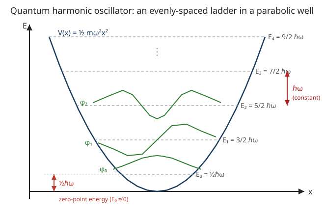

# Quantum Mechanics · Lesson 3.1: The harmonic oscillator I — the analytic method

> ⏱ ~15 min · Module 3: The harmonic oscillator and operator formalism · Builds on: [2.1 The Schrödinger equation](#/lesson/quantum-mechanics/02-01-schrodinger-equation.md), [2.3 The infinite square well](#/lesson/quantum-mechanics/02-03-infinite-square-well.md) · Unlocks: 3.2 ladder operators (the same spectrum, from algebra alone)

## Why this matters

The harmonic oscillator is the most important system in all of physics, and the reason is a one-line theorem: **near a stable equilibrium, every smooth potential is a parabola.** Taylor-expand any $V(x)$ about its minimum, and the leading term that actually moves the particle is $\tfrac12 V''(x_0)(x-x_0)^2$ — a spring. So the oscillator is not one special toy; it is the *universal small-vibration limit* of matter: molecular bonds, crystal lattice vibrations (phonons), the electromagnetic field mode by mode, even the fields of quantum field theory are all oscillators. It is also one of the very few systems we can solve exactly. Solve it once and you own the local behavior of almost everything.

## The idea

Classically a mass on a spring, $V=\tfrac12 m\omega^2 x^2$, oscillates forever between two turning points, and can sit *dead still at the bottom* with zero energy. Quantum mechanics forbids that last part. Confining the particle in the well squeezes its position, and the uncertainty principle then forces a spread in momentum — so the particle can never be simultaneously at rest and at the center. The lowest it can do is a compromise: a **Gaussian bump** hovering above the floor with a small but unavoidable **zero-point energy** $\tfrac12\hbar\omega$.

Above that, the allowed energies form a perfectly **even ladder**: each rung is exactly $\hbar\omega$ higher than the last, $E_n=\hbar\omega\big(n+\tfrac12\big)$. That even spacing is special to the parabola — the infinite well's levels spread *apart* as $n^2$; the oscillator's stay in lockstep. We'll get this by solving the Schrödinger equation directly, and the quantization will drop out of a single innocent-looking demand: *the wavefunction must not blow up at infinity.*

## The formal version

The time-independent Schrödinger equation (TISE) for the oscillator is

$$-\frac{\hbar^2}{2m}\,\varphi''(x)+\tfrac12 m\omega^2 x^2\,\varphi(x)=E\,\varphi(x),$$

where $\hbar$ is the reduced Planck constant, $m$ the mass, $\omega$ the classical angular frequency, and $E$ the energy we're solving for. *In words: kinetic curvature plus spring potential equals total energy, at every point.*

**Nondimensionalize.** Mixed units clutter the algebra, so introduce the dimensionless position $\xi=\sqrt{\tfrac{m\omega}{\hbar}}\,x$ (the natural length of the well is $\sqrt{\hbar/m\omega}$) and the dimensionless energy $\varepsilon=\tfrac{2E}{\hbar\omega}$. Since $\tfrac{d^2}{dx^2}=\tfrac{m\omega}{\hbar}\tfrac{d^2}{d\xi^2}$, the TISE collapses to

$$\varphi''(\xi)=(\xi^2-\varepsilon)\,\varphi(\xi).$$

*In words: one clean equation with all the constants absorbed — energy now measured in units of $\tfrac12\hbar\omega$.*

**Peel off the asymptotic behavior.** For large $\xi$, $\xi^2\gg\varepsilon$, so $\varphi''\approx\xi^2\varphi$, whose solutions behave like $e^{\pm\xi^2/2}$. Only $e^{-\xi^2/2}$ is normalizable. So write

$$\varphi(\xi)=h(\xi)\,e^{-\xi^2/2},$$

pulling out the Gaussian envelope and leaving $h(\xi)$ to be found. Substituting (using $\varphi''=(h''-2\xi h'+(\xi^2-1)h)e^{-\xi^2/2}$) and cancelling $e^{-\xi^2/2}$ gives **Hermite's equation**:

$$h''-2\xi h'+(\varepsilon-1)\,h=0.$$

**Power series (Frobenius).** Seek $h(\xi)=\sum_{j\ge0}a_j\xi^j$. Plugging in and matching powers of $\xi^j$ gives the two-step recursion

$$a_{j+2}=\frac{2j+1-\varepsilon}{(j+2)(j+1)}\,a_j.$$

*In words: fix $a_0$ and $a_1$ and every other coefficient is forced — one even series, one odd series.*

**Termination quantizes the energy.** Here is the whole game. If the series never stops, then for large $j$ the ratio $a_{j+2}/a_j\to 2/j$ — exactly the growth rate of $e^{\xi^2}$. That would make $h\sim e^{\xi^2}$ and hence $\varphi\sim e^{+\xi^2/2}$: not normalizable, physically dead. The only escape is for the series to **terminate** — some coefficient $a_n\neq0$ with $a_{n+2}=0$. The recursion kills $a_{n+2}$ exactly when its numerator vanishes:

$$2n+1-\varepsilon=0\quad\Longrightarrow\quad \varepsilon=2n+1,\quad n=0,1,2,\dots$$

(The *other* parity series must be switched off at the seed, $a_1=0$ or $a_0=0$, so each solution has definite parity.) Translating $\varepsilon=2E/\hbar\omega$ back:

$$\boxed{\,E_n=\hbar\omega\left(n+\tfrac12\right),\quad n=0,1,2,\dots\,}$$

*In words: normalizability alone — no boundary walls — forces a discrete, evenly spaced spectrum, floor at $\tfrac12\hbar\omega$.* The terminating polynomials are the **Hermite polynomials** $H_n(\xi)$: $H_0=1,\;H_1=2\xi,\;H_2=4\xi^2-2,\;H_3=8\xi^3-12\xi$. The eigenfunctions are

$$\varphi_n(x)=N_n\,H_n(\xi)\,e^{-\xi^2/2},\qquad \xi=\sqrt{\tfrac{m\omega}{\hbar}}\,x,$$

with $\varphi_n$ carrying exactly $n$ nodes and parity $(-1)^n$. The ground state is a pure Gaussian:

$$\varphi_0(x)=\left(\frac{m\omega}{\pi\hbar}\right)^{1/4}e^{-m\omega x^2/2\hbar},\qquad E_0=\tfrac12\hbar\omega.$$

## Picture

The rungs are equally spaced by $\hbar\omega$ (unlike the well, whose rungs fan apart). $\varphi_0$ is a nodeless Gaussian hump; $\varphi_1$ has one node; $\varphi_2$ has two — each state adds a wiggle, and each wiggle costs one quantum $\hbar\omega$.

## Worked examples

**Example 1 (mechanical — verify the ground state directly).** Claim: $\varphi_0=A\,e^{-\alpha x^2/2}$ with $\alpha\equiv m\omega/\hbar$ solves the TISE with $E_0=\tfrac12\hbar\omega$. Differentiate: $\varphi_0'=-\alpha x\,\varphi_0$, and $\varphi_0''=(\alpha^2x^2-\alpha)\varphi_0$. Feed into the left side:

$$-\frac{\hbar^2}{2m}(\alpha^2x^2-\alpha)\varphi_0+\tfrac12 m\omega^2x^2\varphi_0.$$

The $x^2$ terms cancel exactly, because $-\tfrac{\hbar^2}{2m}\alpha^2=-\tfrac{\hbar^2}{2m}\tfrac{m^2\omega^2}{\hbar^2}=-\tfrac12 m\omega^2$. What survives is $+\tfrac{\hbar^2}{2m}\alpha\,\varphi_0=\tfrac{\hbar^2}{2m}\tfrac{m\omega}{\hbar}\varphi_0=\tfrac12\hbar\omega\,\varphi_0$. So the equation holds with $E_0=\tfrac12\hbar\omega$. ✓ The Gaussian's curvature is precisely tuned to the spring.

**Example 2 (why you'd care — a molecular vibration).** A diatomic bond behaves like an oscillator with $\omega=4.0\times10^{14}\,\mathrm{rad/s}$ (an infrared frequency). The rung spacing is

$$\Delta E=\hbar\omega=(1.055\times10^{-34})(4.0\times10^{14})\,\mathrm{J}=4.22\times10^{-20}\,\mathrm{J}\approx0.26\,\text{eV}.$$

Every absorption/emission line of this bond sits at a multiple of that single gap — which is *why* vibrational spectra are ladders of equally spaced lines, and how infrared spectroscopy fingerprints molecules. Note also the zero-point energy $E_0=\tfrac12\hbar\omega\approx0.13$ eV: the bond is never truly still, even at absolute zero.

## Watch out

- You might think the particle can rest at the bottom with $E=0$. It cannot: $E_0=\tfrac12\hbar\omega\neq0$. Pinning it to $x=0$ with $p=0$ would violate $\Delta x\,\Delta p\ge\hbar/2$. The ground state is the optimal compromise, not the classical rest state.
- You might think $e^{-\xi^2/2}$ *is* the answer. It's only the asymptotic **envelope**. The Hermite polynomial $H_n(\xi)$ multiplying it supplies the $n$ nodes and the excited-state structure — drop it and you lose every state but the ground.
- You might think the growing solution $e^{+\xi^2/2}$ is discarded "by choice" or by a boundary wall. There is no wall. It's discarded because it isn't normalizable — and that single physical requirement (finite total probability) is what quantizes $E$. Quantization here is a *normalizability* effect, not a boundary-condition-at-walls effect like the square well.
- Don't confuse $\xi$ (dimensionless) with $x$ (a length), or the parameter $\alpha=m\omega/\hbar$ (units of $1/\text{length}^2$) with $\omega$.

## One-liner

> Every smooth potential is a harmonic oscillator near its minimum, and normalizability alone forces its energies to climb in equal steps of $\hbar\omega$ from a floor of $\tfrac12\hbar\omega$ — never zero.

## Problems

**P1 (🟢)** An oscillator has $\omega=3.0\times10^{14}\ \mathrm{rad/s}$. (a) Find its ground-state energy $E_0$ and the spacing $\Delta E$ between adjacent levels, in eV. (b) Which energies are allowed: $\hbar\omega,\ 2\hbar\omega,\ \tfrac32\hbar\omega,\ \tfrac52\hbar\omega$? (Use $\hbar=1.055\times10^{-34}\ \mathrm{J\,s}$, $1\ \mathrm{eV}=1.602\times10^{-19}\ \mathrm{J}$.)

**P2 (🟡)** For the ground state $\varphi_0=A\,e^{-\alpha x^2/2}$ with $\alpha=m\omega/\hbar$: (a) fix $A$ by normalization; (b) compute $\langle x\rangle$; (c) compute $\langle x^2\rangle$. You'll need $\int_{-\infty}^{\infty}e^{-\alpha x^2}dx=\sqrt{\pi/\alpha}$ and $\int_{-\infty}^{\infty}x^2 e^{-\alpha x^2}dx=\tfrac{1}{2}\sqrt{\pi/\alpha^{3}}$.

**P3 (🔴, optional)** Show that *any* potential $V(x)$ with a smooth minimum at $x_0$ looks like a harmonic oscillator for small displacements, and identify the effective frequency. Then apply it to the pendulum, $V(\theta)=mgL(1-\cos\theta)$, to read off $\omega$. (This is the small-oscillations / normal-modes reduction from analytical mechanics, transplanted into QM.)

Solutions

**P1** (a) $\hbar\omega=(1.055\times10^{-34})(3.0\times10^{14})=3.165\times10^{-20}\,\mathrm{J}=0.198\,\mathrm{eV}$. The spacing is $\Delta E=\hbar\omega\approx0.198\,\mathrm{eV}$, and $E_0=\tfrac12\hbar\omega\approx0.099\,\mathrm{eV}$.
(b) Allowed energies are $E_n=\hbar\omega(n+\tfrac12)=\tfrac12\hbar\omega,\ \tfrac32\hbar\omega,\ \tfrac52\hbar\omega,\dots$ — the half-integer multiples. So $\tfrac32\hbar\omega$ and $\tfrac52\hbar\omega$ are allowed; $\hbar\omega$ and $2\hbar\omega$ are **not** (integer multiples never appear — the zero-point $\tfrac12$ shifts the whole ladder).

**P2** (a) Normalize: $1=\int|\varphi_0|^2dx=A^2\int e^{-\alpha x^2}dx=A^2\sqrt{\pi/\alpha}$, so $A^2=\sqrt{\alpha/\pi}$ and

$$A=\left(\frac{\alpha}{\pi}\right)^{1/4}=\left(\frac{m\omega}{\pi\hbar}\right)^{1/4},$$

matching the boxed ground state.
(b) $\langle x\rangle=A^2\int x\,e^{-\alpha x^2}dx=0$: the integrand is odd, so it vanishes. The particle is centered at the origin, as symmetry demands.
(c) $\langle x^2\rangle=A^2\int x^2 e^{-\alpha x^2}dx=A^2\cdot\tfrac12\sqrt{\pi/\alpha^3}=\sqrt{\tfrac{\alpha}{\pi}}\cdot\tfrac{1}{2\alpha}\sqrt{\tfrac{\pi}{\alpha}}=\frac{1}{2\alpha}=\frac{\hbar}{2m\omega}.$

So $\Delta x=\sqrt{\langle x^2\rangle}=\sqrt{\hbar/2m\omega}$. (Foreshadow: in 3.3 you'll find $\langle p^2\rangle=\tfrac12 m\hbar\omega$, giving $\Delta x\,\Delta p=\hbar/2$ — the ground state *saturates* the uncertainty bound, which is exactly why it's a Gaussian.)

**P3** Taylor-expand about the minimum $x_0$:

$$V(x)=V(x_0)+V'(x_0)(x-x_0)+\tfrac12 V''(x_0)(x-x_0)^2+\cdots$$

At a minimum $V'(x_0)=0$, and $V''(x_0)>0$ (a genuine minimum, not a max or inflection). Dropping the constant $V(x_0)$ (it just shifts the energy zero) and writing $u=x-x_0$,

$$V\approx\tfrac12 V''(x_0)\,u^2.$$

Compare with $\tfrac12 m\omega^2 u^2$: the effective spring constant is $k=V''(x_0)$, so

$$\omega=\sqrt{\frac{V''(x_0)}{m}}.$$

Every result of this lesson then applies with this $\omega$ — the local spectrum near any stable equilibrium is $\hbar\omega(n+\tfrac12)$, the *curvature of the potential* setting the rung height. For the pendulum, $V(\theta)=mgL(1-\cos\theta)$ has its minimum at $\theta=0$; $V''(\theta)=mgL\cos\theta$, so $V''(0)=mgL$. With the "mass" being the moment of inertia $I=mL^2$ for angular motion, $\omega=\sqrt{V''(0)/I}=\sqrt{mgL/mL^2}=\sqrt{g/L}$ — the familiar small-angle pendulum frequency, now the frequency of its *quantum* vibrational ladder. This is the direct QM heir of the small-oscillations / normal-modes analysis in analytical mechanics: expand about equilibrium, and the motion is a sum of independent oscillators.

## Flashback

**From Lesson 2.3 (The infinite square well):** A particle in an infinite well of width $L$ has $E_n=\dfrac{n^2\pi^2\hbar^2}{2mL^2}$, $n=1,2,3,\dots$ (a) Find the ratios $E_2/E_1$ and $E_3/E_2$. (b) Write the spacing $E_{n+1}-E_n$ and say how it grows with $n$ — then contrast with the harmonic oscillator's spacing.

Solution

(a) Since $E_n\propto n^2$: $\;E_2/E_1=4$ and $E_3/E_2=9/4=2.25$. The levels spread *apart*.
(b) $E_{n+1}-E_n=\dfrac{\pi^2\hbar^2}{2mL^2}\big[(n+1)^2-n^2\big]=\dfrac{(2n+1)\pi^2\hbar^2}{2mL^2}$, which **grows linearly in $n$** — each rung is higher than the last. The harmonic oscillator instead has $E_{n+1}-E_n=\hbar\omega$, a **constant**. The difference traces directly to the potentials: hard walls ($V\sim$ step) versus a parabola ($V\sim x^2$). The shape of the confinement dictates how the ladder spaces out.

## Connections

- **Backward:** the machinery is [2.1](#/lesson/quantum-mechanics/02-01-schrodinger-equation.md)'s time-independent Schrödinger equation, and the *quantization-from-a-condition* pattern is [2.3](#/lesson/quantum-mechanics/02-03-infinite-square-well.md)'s — except here the condition is normalizability at infinity, not vanishing at walls.
- **Forward:** [3.2](#/lesson/quantum-mechanics/03-02-harmonic-oscillator-ladder-operators.md) rederives this exact spectrum $E_n=\hbar\omega(n+\tfrac12)$ from operator algebra alone (ladder operators $a,a^\dagger$) — no series, no Hermite polynomials — and the $\langle x^2\rangle=\hbar/2m\omega$ you computed reappears in 3.3, where the ground state is shown to *saturate* the uncertainty relation $\Delta x\,\Delta p=\hbar/2$.
- **Sideways (analytical mechanics):** P3 is the quantum face of the small-oscillations / normal-modes theorem — Taylor-expand any potential about a stable equilibrium and the leading dynamics is a set of independent harmonic oscillators, with frequencies fixed by the curvature (the Hessian of $V$). It's also why the Gaussian ground state ties back to the bell curve of `prob-stat-refresher`: minimum-uncertainty states are Gaussians.
