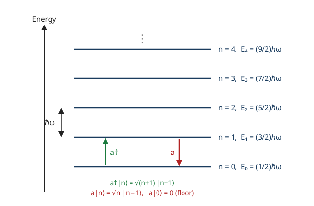

# Quantum Mechanics · Lesson 3.2: The harmonic oscillator II — ladder operators

> ⏱ ~15 min · Module 3: The harmonic oscillator and operator formalism · Builds on: [3.1 The harmonic oscillator I (analytic method)](#/lesson/quantum-mechanics/03-01-harmonic-oscillator-analytic.md) · Unlocks: 3.3 Commutators and the uncertainty principle

## Why this matters

In [3.1](#/lesson/quantum-mechanics/03-01-harmonic-oscillator-analytic.md) you solved the oscillator the hard way: a differential equation, a power series, a termination condition that forced Hermite polynomials, and out popped $E_n=\hbar\omega\left(n+\tfrac12\right)$. This lesson gets the **entire spectrum** — every energy, every state, every matrix element — from *algebra alone*, never touching a differential equation. The trick is to factor the Hamiltonian into two conjugate pieces $a$ and $a^\dagger$ that climb and descend the energy ladder one rung at a time. It is faster, it makes computations like $\langle x^2\rangle$ nearly automatic, and it is the exact template for the **creation and annihilation operators** that build quantum field theory: there, $a^\dagger$ doesn't raise an oscillator's energy, it *creates a particle*. Master this factorization once and you have the operational core of QFT, phonons, photons, and the whole second-quantized picture.

## The idea

Classically $\tfrac{p^2}{2m}+\tfrac12 m\omega^2 x^2$ is a sum of squares, and $A^2+B^2=(A-iB)(A+iB)$ tempts you to factor it. Quantum mechanically that almost works — the only obstruction is that $\hat x$ and $\hat p$ don't commute, so the two factors don't quite multiply back to $\hat H$; they miss by a constant. That leftover constant *is* the zero-point energy $\tfrac12\hbar\omega$, and the two factors are the ladder operators.

Here is the picture to hold onto (drawn below): the energy levels are a ladder of equally spaced rungs. One operator, $a^\dagger$ (the **raising** operator), takes any state and pushes it up one rung; its partner $a$ (the **lowering** operator) drops it down one rung. Because energy can't fall forever — a Hamiltonian that is a sum of squares is bounded below — the ladder must have a **bottom rung**, a state $|0\rangle$ that $a$ annihilates: $a|0\rangle=0$. From that single fact, applying $a^\dagger$ over and over generates every state, and the equal rung spacing $\hbar\omega$ hands you the whole spectrum. No integrals, no special functions — just "there's a floor, and you climb from it."

## The formal version

Start from the canonical commutator (the one non-negotiable input, derived in [1.4](#/lesson/quantum-mechanics/01-04-observables-hermitian-operators.md) and central to [3.3](#/lesson/quantum-mechanics/03-03-commutators-uncertainty.md)):
$$
[\hat x,\hat p]=i\hbar .
$$

**Ladder operators.** Define the dimensionless combinations
$$
a=\sqrt{\tfrac{m\omega}{2\hbar}}\left(\hat x+\tfrac{i\hat p}{m\omega}\right),\qquad
a^\dagger=\sqrt{\tfrac{m\omega}{2\hbar}}\left(\hat x-\tfrac{i\hat p}{m\omega}\right).
$$
*In words: $a$ and $a^\dagger$ are the two complex "halves" of $\hat x$ and $\hat p$.* Since $\hat x,\hat p$ are Hermitian, $a^\dagger$ really is the adjoint of $a$ (the $i$ flips sign under $\dagger$). Note $a$ is **not** Hermitian, so it is not an observable — it's a bookkeeping tool.

**Their commutator.** Expand using bilinearity and $[\hat x,\hat p]=i\hbar$:
$$
[a,a^\dagger]=\frac{m\omega}{2\hbar}\left[\hat x+\tfrac{i\hat p}{m\omega},\ \hat x-\tfrac{i\hat p}{m\omega}\right]
=\frac{m\omega}{2\hbar}\cdot\left(-\tfrac{2i}{m\omega}\right)[\hat x,\hat p]
=\frac{m\omega}{2\hbar}\cdot\left(-\tfrac{2i}{m\omega}\right)(i\hbar)=1 .
$$
$$
\boxed{[a,a^\dagger]=1}
$$
*In words: swapping the order of $a$ and $a^\dagger$ costs exactly $1$.* This single number carries all the information that $[\hat x,\hat p]=i\hbar$ did.

**The number operator and the Hamiltonian.** Multiply the factors out (keeping order — this is where the constant appears):
$$
a^\dagger a=\frac{m\omega}{2\hbar}\left(\hat x^2+\tfrac{\hat p^2}{m^2\omega^2}\right)+\frac{i}{2\hbar}[\hat x,\hat p]
=\frac{\hat H}{\hbar\omega}-\frac12 .
$$
Defining the **number operator** $N\equiv a^\dagger a$ (Hermitian, so a legitimate observable), this rearranges to
$$
\boxed{\hat H=\hbar\omega\!\left(N+\tfrac12\right)=\hbar\omega\!\left(a^\dagger a+\tfrac12\right).}
$$
*In words: the energy is $\hbar\omega$ times "how many rungs up you are," plus a fixed $\tfrac12\hbar\omega$ nobody can remove.* Since $\hat H$ and $N$ differ only by constants, they share eigenstates: write $N|n\rangle=n|n\rangle$, so $\hat H|n\rangle=\hbar\omega\!\left(n+\tfrac12\right)|n\rangle$.

**Why the rungs are spaced by $\hbar\omega$.** Compute two commutators from $[a,a^\dagger]=1$:
$$
[N,a]=[a^\dagger a,a]=-a,\qquad [N,a^\dagger]=+a^\dagger .
$$
Then $N\big(a^\dagger|n\rangle\big)=\big(a^\dagger N+a^\dagger\big)|n\rangle=(n+1)\,a^\dagger|n\rangle$. *In words: $a^\dagger|n\rangle$ is an eigenstate of $N$ with eigenvalue $n+1$* — one rung up. Likewise $a|n\rangle$ sits at eigenvalue $n-1$, one rung down.

**Normalization and the floor.** The rung-eigenvalue $n$ can't be negative, because
$$
n=\langle n|N|n\rangle=\langle n|a^\dagger a|n\rangle=\big\|\,a|n\rangle\,\big\|^2\ge 0 .
$$
*In words: $n$ is the squared length of a vector, so it can't drop below zero.* If you keep applying $a$ you'd eventually pass below zero — impossible — unless the chain terminates at a state with $a|0\rangle=0$, which has $n=0$. Climbing back up in integer steps forces $n=0,1,2,\dots$. Fixing the norms (Example 1 below):
$$
\boxed{a^\dagger|n\rangle=\sqrt{n+1}\,|n+1\rangle,\qquad a|n\rangle=\sqrt{n}\,|n-1\rangle,\qquad a|0\rangle=0.}
$$
So $E_n=\hbar\omega\!\left(n+\tfrac12\right)$ — the same spectrum as 3.1, from pure algebra.

**Inverting back to $\hat x$ and $\hat p$.** Add and subtract the definitions:
$$
\boxed{\hat x=\sqrt{\tfrac{\hbar}{2m\omega}}\,(a+a^\dagger),\qquad \hat p=i\sqrt{\tfrac{m\hbar\omega}{2}}\,(a^\dagger-a).}
$$
*In words: position is the symmetric combination, momentum the antisymmetric one.* This is the payoff: any matrix element of $\hat x$, $\hat p$, or their powers becomes a bookkeeping exercise in raising and lowering, because $\langle m|n\rangle=\delta_{mn}$.

## Picture

Every rung is $\hbar\omega$ above the last, the floor sits at $\tfrac12\hbar\omega$ (never at zero — the zero-point energy), and $a^\dagger$/$a$ are the elevator between rungs. The floor exists because $a|0\rangle=0$: there is nowhere lower to go.

## Concrete instance

Two matrix elements computed by pure ladder algebra — no integral in sight.

**The dipole element $\langle 1|\hat x|0\rangle$.** Using $\hat x=\sqrt{\tfrac{\hbar}{2m\omega}}(a+a^\dagger)$ and $a|0\rangle=0$, $a^\dagger|0\rangle=\sqrt{1}\,|1\rangle$:
$$
\hat x|0\rangle=\sqrt{\tfrac{\hbar}{2m\omega}}\,(a+a^\dagger)|0\rangle=\sqrt{\tfrac{\hbar}{2m\omega}}\,|1\rangle
\ \Rightarrow\ \langle 1|\hat x|0\rangle=\sqrt{\tfrac{\hbar}{2m\omega}} .
$$
This is the transition amplitude that governs whether the oscillator can absorb or emit a photon between the ground and first excited state — the seed of the **dipole selection rule** $\Delta n=\pm1$ you'll meet in [6.6](#/lesson/quantum-mechanics/06-06-fermi-golden-rule-radiation.md).

**The spread $\langle n|\hat x^2|n\rangle$.** Square the position:
$$
\hat x^2=\frac{\hbar}{2m\omega}\big(a+a^\dagger\big)^2=\frac{\hbar}{2m\omega}\big(a^2+a a^\dagger+a^\dagger a+a^{\dagger 2}\big).
$$
Sandwiched in $\langle n|\cdots|n\rangle$, the $a^2$ and $a^{\dagger2}$ terms shift the state to $|n{-}2\rangle$ and $|n{+}2\rangle$ — orthogonal to $|n\rangle$, so they vanish. Only the "up-then-down" pieces survive:
$$
\langle n|a^\dagger a|n\rangle=n,\qquad \langle n|a a^\dagger|n\rangle=\langle n|(a^\dagger a+1)|n\rangle=n+1,
$$
using $[a,a^\dagger]=1$ to reorder the second. Hence
$$
\langle n|\hat x^2|n\rangle=\frac{\hbar}{2m\omega}\,(2n+1)=\frac{\hbar}{m\omega}\!\left(n+\tfrac12\right).
$$
At $n=0$ this is $\tfrac{\hbar}{2m\omega}$ — precisely the width of the Gaussian ground state you integrated by hand in 3.1, now delivered in two lines.

## Worked examples

**Example 1 (mechanical — where the $\sqrt{n+1}$ comes from).** The relation $a^\dagger|n\rangle=c_n|n+1\rangle$ must hold for some constant $c_n$ (we showed $a^\dagger|n\rangle$ is the eigenstate one rung up). Fix $|c_n|$ by taking the squared norm:
$$
|c_n|^2=\langle n|a\,a^\dagger|n\rangle=\langle n|(a^\dagger a+1)|n\rangle=(n+1).
$$
Choosing the phase real and positive, $c_n=\sqrt{n+1}$, so $a^\dagger|n\rangle=\sqrt{n+1}\,|n+1\rangle$. The same move on $a|n\rangle=d_n|n-1\rangle$ gives $|d_n|^2=\langle n|a^\dagger a|n\rangle=n$, so $a|n\rangle=\sqrt{n}\,|n-1\rangle$ — and at $n=0$ the coefficient is $0$, which is *why* $a|0\rangle=0$ rather than producing a forbidden $|-1\rangle$. Every excited state is then $|n\rangle=\dfrac{(a^\dagger)^n}{\sqrt{n!}}\,|0\rangle$ (each rung contributes a factor $\sqrt{k}$, and $\prod_{k=1}^n\sqrt{k}=\sqrt{n!}$).

**Example 2 (why you'd care — matrix elements without integrals).** In 3.1, computing $\langle m|\hat x|n\rangle$ meant an integral of two Hermite polynomials against a Gaussian. With ladders it collapses instantly:
$$
\langle m|\hat x|n\rangle=\sqrt{\tfrac{\hbar}{2m\omega}}\,\langle m|(a+a^\dagger)|n\rangle
=\sqrt{\tfrac{\hbar}{2m\omega}}\Big(\sqrt{n}\,\delta_{m,\,n-1}+\sqrt{n+1}\,\delta_{m,\,n+1}\Big).
$$
*In words: $\hat x$ connects only states that differ by exactly one rung* — the **selection rule** $m=n\pm1$, read straight off the Kronecker deltas. The entire infinite $\hat x$ matrix is two thin off-diagonal stripes:
$$
\hat x \;\leftrightarrow\; \sqrt{\tfrac{\hbar}{2m\omega}}
\begin{pmatrix}
0 & \sqrt1 & 0 & 0 & \cdots\\
\sqrt1 & 0 & \sqrt2 & 0 & \\
0 & \sqrt2 & 0 & \sqrt3 & \\
0 & 0 & \sqrt3 & 0 & \\
\vdots & & & & \ddots
\end{pmatrix}.
$$
This is Heisenberg's original "matrix mechanics" appearing for free. Any operator built from $\hat x$ and $\hat p$ inherits a band structure: $\hat x^2$ connects $n$ to $n,\,n\pm2$; $\hat x^3$ to $n\pm1,\,n\pm3$; and so on — the number of $a$/$a^\dagger$ factors caps how far you can hop.

## Watch out

- You might think $a$ and $a^\dagger$ are observables like $\hat x$ and $\hat p$. They're **not Hermitian** ($a^\dagger\ne a$), so they have no real spectrum and represent nothing measurable. Only Hermitian combinations — $N=a^\dagger a$, $\hat x\propto a+a^\dagger$, $\hat p\propto a^\dagger-a$ — are physical.
- You might think you can factor $\hat H=(\text{something})^2$ and be done. Order matters: $a^\dagger a$ and $aa^\dagger$ differ by $1$, and that mismatch is the zero-point energy. Drop it and you'd wrongly predict a ground state at $E=0$, violating the uncertainty principle (a particle at rest at the bottom of the well would have definite $x$ *and* $p$).
- You might write $a|n\rangle=\sqrt{n+1}\,|n-1\rangle$ by pattern-matching. The lowering factor is $\sqrt{n}$ (it counts the rung you're *leaving*); the raising factor is $\sqrt{n+1}$ (the rung you're *entering*). Mixing them up is the single most common ladder error.
- You might expect $\langle n|\hat x|n\rangle\ne0$. It's always zero: $\hat x$ only connects $n\to n\pm1$, never $n\to n$. The oscillator sits symmetrically about the origin in every stationary state.

## One-liner

> Factor the Hamiltonian into $a$ and $a^\dagger$ with $[a,a^\dagger]=1$: the ladder has a floor at $a|0\rangle=0$, every rung is $\hbar\omega$ higher, and $\hat x\propto a+a^\dagger$ turns every matrix element into counting steps.

## Problems

**P1 (🟢)** Using only $\hat x=\sqrt{\tfrac{\hbar}{2m\omega}}(a+a^\dagger)$ and the ladder relations, compute $\langle\hat x\rangle$ and $\langle\hat x^2\rangle$ in the state $|n\rangle$.

**P2 (🟡)** Compute the general matrix element $\langle n'|\hat x|n\rangle$ and state the selection rule. Then read off the two nonzero entries in the row $n'=3$ (i.e. which $n$ they connect to, with their values in units of $\sqrt{\hbar/2m\omega}$).

**P3 (🔴, optional)** Evaluate $\langle n|\hat p^2|n\rangle$ purely algebraically. Use it, together with $\langle n|\hat x^2|n\rangle$ from the Concrete instance, to compute the expected kinetic energy $\langle T\rangle=\tfrac{\langle\hat p^2\rangle}{2m}$ and potential energy $\langle V\rangle=\tfrac12 m\omega^2\langle\hat x^2\rangle$ in $|n\rangle$. Verify the **virial split** $\langle T\rangle=\langle V\rangle=\tfrac12 E_n$. *(This is exactly $\langle p^2\rangle$ for Boss Problem 3, and the virial theorem you'll see again for the Coulomb potential in [4.4](#/lesson/quantum-mechanics/04-04-hydrogen-atom.md).)*

Solutions

**P1** With $\hat x=\sqrt{\tfrac{\hbar}{2m\omega}}(a+a^\dagger)$,
$$
\langle\hat x\rangle=\sqrt{\tfrac{\hbar}{2m\omega}}\,\langle n|(a+a^\dagger)|n\rangle
=\sqrt{\tfrac{\hbar}{2m\omega}}\big(\sqrt{n}\,\langle n|n{-}1\rangle+\sqrt{n{+}1}\,\langle n|n{+}1\rangle\big)=0,
$$
since both $|n{-}1\rangle$ and $|n{+}1\rangle$ are orthogonal to $|n\rangle$. For $\hat x^2$, expand $(a+a^\dagger)^2=a^2+aa^\dagger+a^\dagger a+a^{\dagger2}$; only the two "mixed" terms are diagonal:
$$
\langle\hat x^2\rangle=\frac{\hbar}{2m\omega}\big(\langle n|aa^\dagger|n\rangle+\langle n|a^\dagger a|n\rangle\big)=\frac{\hbar}{2m\omega}\big((n{+}1)+n\big)=\frac{\hbar}{m\omega}\!\left(n+\tfrac12\right).
$$
So the position spread is $\Delta x=\sqrt{\langle\hat x^2\rangle-\langle\hat x\rangle^2}=\sqrt{\tfrac{\hbar}{m\omega}\!\left(n+\tfrac12\right)}$ — it grows with $n$, as the oscillation amplitude should.

**P2** 
$$
\langle n'|\hat x|n\rangle=\sqrt{\tfrac{\hbar}{2m\omega}}\,\langle n'|(a+a^\dagger)|n\rangle
=\sqrt{\tfrac{\hbar}{2m\omega}}\Big(\sqrt{n}\,\delta_{n',\,n-1}+\sqrt{n+1}\,\delta_{n',\,n+1}\Big).
$$
**Selection rule:** nonzero only when $n'=n\pm1$ — $\hat x$ links states differing by one rung. For the row $n'=3$: the $\delta_{n',n-1}$ term fires at $n=4$ giving $\sqrt{4}=2$; the $\delta_{n',n+1}$ term fires at $n=2$ giving $\sqrt{2+1}=\sqrt3$. So row 3 connects to $n=2$ (value $\sqrt3$) and $n=4$ (value $2$), in units of $\sqrt{\hbar/2m\omega}$ — symmetric with the column entries, as it must be since $\hat x$ is Hermitian.

**P3** Write $\hat p=i\sqrt{\tfrac{m\hbar\omega}{2}}(a^\dagger-a)$, so
$$
\hat p^2=-\frac{m\hbar\omega}{2}(a^\dagger-a)^2=-\frac{m\hbar\omega}{2}\big(a^{\dagger2}-a^\dagger a-a a^\dagger+a^2\big).
$$
The $a^{\dagger2}$ and $a^2$ terms are off-diagonal and drop out of $\langle n|\cdots|n\rangle$. The surviving diagonal part is $-(a^\dagger a+aa^\dagger)=-(n+(n{+}1))=-(2n{+}1)$, so
$$
\langle\hat p^2\rangle=-\frac{m\hbar\omega}{2}\big(-(2n{+}1)\big)=m\hbar\omega\!\left(n+\tfrac12\right).
$$
Then
$$
\langle T\rangle=\frac{\langle\hat p^2\rangle}{2m}=\frac{\hbar\omega}{2}\!\left(n+\tfrac12\right)=\tfrac12 E_n,\qquad
\langle V\rangle=\tfrac12 m\omega^2\langle\hat x^2\rangle=\tfrac12 m\omega^2\cdot\frac{\hbar}{m\omega}\!\left(n+\tfrac12\right)=\frac{\hbar\omega}{2}\!\left(n+\tfrac12\right)=\tfrac12 E_n.
$$
So $\langle T\rangle=\langle V\rangle=\tfrac12 E_n$, and their sum reproduces $\langle\hat H\rangle=E_n=\hbar\omega\!\left(n+\tfrac12\right)$. ✓ The kinetic and potential energy share the total *equally* in every stationary state — the quantum virial theorem, which for a potential $V\propto x^2$ predicts exactly $\langle T\rangle=\langle V\rangle$. (For Boss Problem 3, note $\Delta x\,\Delta p=\sqrt{\langle\hat x^2\rangle\langle\hat p^2\rangle}=\hbar\!\left(n+\tfrac12\right)$, saturating the uncertainty bound $\tfrac\hbar2$ at $n=0$.)

## Flashback

**From Lesson 3.1 (The harmonic oscillator, analytic method):** The normalized ground state found by the analytic method is $\psi_0(x)=\left(\tfrac{m\omega}{\pi\hbar}\right)^{1/4}e^{-m\omega x^2/2\hbar}$. Compute $\langle\hat x^2\rangle$ in this state by direct Gaussian integration, and check it against the ladder result for $n=0$.

Solution

Let $\alpha=\tfrac{m\omega}{\hbar}$, so $|\psi_0|^2=\sqrt{\tfrac{\alpha}{\pi}}\,e^{-\alpha x^2}$. Then
$$
\langle\hat x^2\rangle=\sqrt{\tfrac{\alpha}{\pi}}\int_{-\infty}^{\infty}x^2 e^{-\alpha x^2}\,dx
=\sqrt{\tfrac{\alpha}{\pi}}\cdot\frac{1}{2\alpha}\sqrt{\tfrac{\pi}{\alpha}}=\frac{1}{2\alpha}=\frac{\hbar}{2m\omega},
$$
using the standard Gaussian moment $\int x^2 e^{-\alpha x^2}dx=\tfrac12\sqrt{\pi}\,\alpha^{-3/2}$. This matches the ladder value $\langle\hat x^2\rangle=\tfrac{\hbar}{m\omega}\!\left(n+\tfrac12\right)$ at $n=0$ exactly — the hard integral and the two-line algebra agree, as they must. The lesson: once you trust the ladder, you never do this integral again.

## Connections

- **Backward:** this reproduces every result of [3.1](#/lesson/quantum-mechanics/03-01-harmonic-oscillator-analytic.md) — the spectrum $E_n=\hbar\omega\!\left(n+\tfrac12\right)$, the Gaussian ground state (now defined by $a|0\rangle=0$, a first-order ODE instead of a series), and the widths — but algebraically, and it turns the Hermite-polynomial integrals into one-line counting.
- **Forward:** [3.3](#/lesson/quantum-mechanics/03-03-commutators-uncertainty.md) uses these $\langle\hat x^2\rangle,\langle\hat p^2\rangle$ to show the oscillator ground state saturates the uncertainty bound (Boss Problem 3). The *same* raising/lowering construction, applied to $[\hat L_i,\hat L_j]=i\hbar\,\epsilon_{ijk}\hat L_k$, generates the angular-momentum spectrum in [4.2](#/lesson/quantum-mechanics/04-02-angular-momentum-algebra.md) — a floor state, a ceiling state, integer steps between.
- **Sideways (quantum field theory):** promote $a,a^\dagger$ from "raise/lower one oscillator" to "annihilate/create one particle," attach a pair to every mode of a field, and $\hat H=\sum_k\hbar\omega_k(a_k^\dagger a_k+\tfrac12)$ becomes the free-field energy. Photons and phonons are literally rungs on ladders like this one — which is why this lesson is the operational entry point to QFT.
- **Sideways (classical mechanics):** the factorization mirrors the classical trick of packaging $x$ and $p$ into the complex amplitude $\alpha\propto x+i p/m\omega$ that rotates at frequency $\omega$; the commutator $[a,a^\dagger]=1$ is the quantum shadow of the Poisson bracket $\{x,p\}=1$ from `analytical-mechanics`, the theme [3.5](#/lesson/quantum-mechanics/03-05-heisenberg-picture-ehrenfest.md) makes precise.
