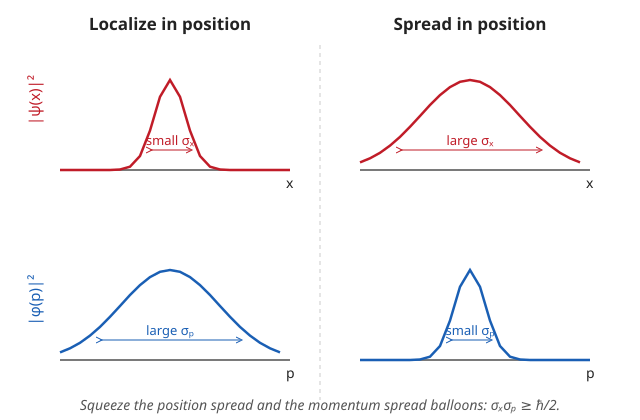

# Quantum Mechanics · Lesson 3.3: Commutators and the uncertainty principle

> ⏱ ~15 min · Module 3: The harmonic oscillator and operator formalism · Builds on: [3.2 The harmonic oscillator II: ladder operators](#/lesson/quantum-mechanics/03-02-harmonic-oscillator-ladder-operators.md), [1.5 Measurement, collapse, and expectation values](#/lesson/quantum-mechanics/01-05-measurement-expectation-values.md) · Unlocks: 3.4 Compatible observables and complete sets

## Why this matters

The ladder operators of 3.2 worked because $a$ and $a^\dagger$ *don't* commute — $[a,a^\dagger]=1$ was the whole engine. That non-commuting is not an accident of the oscillator; it is the deepest structural fact in quantum mechanics. Two observables that fail to commute **cannot both have sharp values at once**, and the exact amount they can't is the uncertainty principle. This is where the theory stops being "classical mechanics with waves" and becomes something genuinely new: it forbids a particle from having a definite position *and* momentum, it forces atoms to have a lowest non-zero energy so they never collapse, and it sets the width of every spectral line. All of it flows from one operator: the commutator.

## The idea

In ordinary arithmetic, order doesn't matter: $3\times 5 = 5\times 3$. For operators — which are really infinite matrices — order *does* matter, exactly as it does for matrix multiplication or for physical rotations (turn a book right-then-down vs. down-then-right and it ends up facing differently). The **commutator** $[\hat A,\hat B]=\hat A\hat B-\hat B\hat A$ is the bookkeeping device that measures this failure. If it's zero, the two operations don't interfere and the observables are **compatible** — you can pin both down simultaneously. If it's nonzero, sharpening one blurs the other, and the commutator tells you the exchange rate.

Position and momentum are the flagship offenders. Their commutator is not just nonzero, it's a *constant*: $[\hat x,\hat p]=i\hbar$. That single number, the size of $\hbar$, is the width of the crack between the classical world (where $\hbar\to 0$ and everything commutes) and the quantum one. Everything below is unpacking what that number costs you.

## The formal version

**The commutator.** For operators $\hat A,\hat B$,

$$[\hat A,\hat B] \equiv \hat A\hat B - \hat B\hat A.$$

*In words:* do $B$ then $A$, subtract $A$ then $B$; the leftover is itself an operator, and it's zero exactly when order doesn't matter. Two identities do almost all the work (both proved by expanding and cancelling):

$$[\hat A,\hat B]=-[\hat B,\hat A], \qquad [\hat A,\hat B\hat C]=[\hat A,\hat B]\hat C+\hat B[\hat A,\hat C].$$

The second is the **Leibniz rule** — the commutator differentiates across a product like $\tfrac{d}{dx}$ does. (Its mirror is $[\hat A\hat B,\hat C]=\hat A[\hat B,\hat C]+[\hat A,\hat C]\hat B$.)

**The canonical commutator.** With $\hat p=-i\hbar\,\dfrac{d}{dx}$, apply $[\hat x,\hat p]$ to an arbitrary test function $f(x)$ — the only honest way to compose differential operators:

$$[\hat x,\hat p]f = x\!\left(-i\hbar f'\right) - \left(-i\hbar\right)\frac{d}{dx}\!\big(xf\big) = -i\hbar x f' + i\hbar\big(f + x f'\big) = i\hbar f.$$

The $xf'$ terms cancel; the surviving $i\hbar f$ came entirely from the product rule hitting $x$. Since $f$ was arbitrary,

$$\boxed{[\hat x,\hat p]=i\hbar.}$$

*In words:* measuring position then momentum differs from the reverse order by a fixed imaginary constant $i\hbar$ — position and momentum are irreducibly incompatible.

**The generalized uncertainty relation.** Define the spread (standard deviation) of a Hermitian observable $\hat A$ in a state $|\psi\rangle$ by its variance $\sigma_A^2=\langle \hat A^2\rangle-\langle \hat A\rangle^2=\big\langle(\hat A-\langle \hat A\rangle)^2\big\rangle$. Then for any two Hermitian observables,

$$\boxed{\;\sigma_A\,\sigma_B \ \ge\ \tfrac12\big|\langle[\hat A,\hat B]\rangle\big|.\;}$$

*In words:* the product of the two spreads is bounded below by half the size of their (expected) commutator — non-commutation is a hard floor on joint sharpness.

*Why it's true (readable sketch).* Center the operators: let $|f\rangle=(\hat A-\langle A\rangle)|\psi\rangle$ and $|g\rangle=(\hat B-\langle B\rangle)|\psi\rangle$, so $\sigma_A^2=\langle f|f\rangle$ and $\sigma_B^2=\langle g|g\rangle$. The **Cauchy–Schwarz inequality** from `linalg-refresher` — the statement that $|\langle f|g\rangle|\le\|f\|\,\|g\|$, i.e. the "angle" between two vectors has cosine at most 1 — gives

$$\sigma_A^2\,\sigma_B^2=\langle f|f\rangle\langle g|g\rangle \ \ge\ |\langle f|g\rangle|^2.$$

Now throw away the real part and keep only the imaginary: for any complex $z$, $|z|^2\ge(\operatorname{Im}z)^2=\big(\tfrac{1}{2i}(z-z^*)\big)^2$. Taking $z=\langle f|g\rangle$ and using $\langle g|f\rangle=\langle f|g\rangle^*$,

$$\langle f|g\rangle-\langle g|f\rangle=\big\langle(\hat A-\langle A\rangle)(\hat B-\langle B\rangle)\big\rangle-\big\langle(\hat B-\langle B\rangle)(\hat A-\langle A\rangle)\big\rangle=\langle[\hat A,\hat B]\rangle,$$

since the $\langle A\rangle\langle B\rangle$ shifts cancel in the difference. So $|\langle f|g\rangle|^2\ge\big(\tfrac{1}{2i}\langle[\hat A,\hat B]\rangle\big)^2=\tfrac14|\langle[\hat A,\hat B]\rangle|^2$. Chain the two inequalities and take the square root. $\blacksquare$

**Position–momentum.** Plug $[\hat x,\hat p]=i\hbar$ into the box: $\langle[\hat x,\hat p]\rangle=i\hbar$ regardless of state, so

$$\sigma_x\,\sigma_p \ \ge\ \tfrac12|i\hbar| = \frac{\hbar}{2}.$$

This is Heisenberg's original relation, now a *theorem* rather than a slogan. The bound is **saturated** (equality) only when Cauchy–Schwarz is tight, which requires $|f\rangle\propto|g\rangle$ — a Gaussian wavefunction. The oscillator ground state of 3.1 is exactly that Gaussian, so it sits precisely on the floor $\sigma_x\sigma_p=\hbar/2$ (verified in Example 2 / P2).

**Energy–time.** There is a companion relation $\Delta E\,\Delta t\ge\hbar/2$, but read it carefully — **time is not an operator**, so this is *not* a commutator $[\hat t,\hat H]$. Instead, pick any observable $\hat Q$; its expectation drifts at rate $\tfrac{d\langle Q\rangle}{dt}=\tfrac{i}{\hbar}\langle[\hat H,\hat Q]\rangle$ (Ehrenfest, coming in 3.5). Feed $[\hat H,\hat Q]$ into the generalized relation and define the timescale $\Delta t\equiv \sigma_Q\big/\big|\tfrac{d\langle Q\rangle}{dt}\big|$ — the time for $\langle Q\rangle$ to shift by one of its own standard deviations. Then $\sigma_H\,\Delta t\ge\hbar/2$, i.e.

$$\Delta E\,\Delta t\ \ge\ \frac{\hbar}{2},\qquad \Delta t=\text{time for the system to change appreciably}.$$

*In words:* a state whose energy is sharp ($\Delta E$ small) is a state that evolves slowly; only a state with a broad energy spread can change quickly. A stationary state ($\Delta E=0$) never changes at all — consistent with 2.2.

## Picture

Position and momentum wavefunctions are Fourier transforms of each other, and a Fourier transform trades width for width: a spike in $x$ is a plane wave in $p$ (all momenta), and a single sharp momentum is a plane wave in $x$ (spread everywhere). The two columns show the extremes; the honest states live in between, always with $\sigma_x\sigma_p\ge\hbar/2$. This is the *same* narrow-wide tradeoff a signal processer knows as time–bandwidth, and a probabilist meets when a density and its characteristic function fight over concentration.

## Worked examples

**Example 1 (mechanical — the Leibniz rule in action).** Compute $[\hat H,\hat x]$ for the harmonic oscillator $\hat H=\dfrac{\hat p^2}{2m}+\tfrac12 m\omega^2\hat x^2$.

The potential term commutes with $\hat x$ (functions of $\hat x$ commute with $\hat x$), so only the kinetic term survives:

$$[\hat H,\hat x]=\frac{1}{2m}[\hat p^2,\hat x].$$

Use Leibniz on $[\hat p^2,\hat x]=[\hat p,\hat x]\hat p+\hat p[\hat p,\hat x]$. Since $[\hat p,\hat x]=-[\hat x,\hat p]=-i\hbar$,

$$[\hat p^2,\hat x]=(-i\hbar)\hat p+\hat p(-i\hbar)=-2i\hbar\,\hat p \quad\Longrightarrow\quad [\hat H,\hat x]=\frac{-2i\hbar\,\hat p}{2m}=-\frac{i\hbar}{m}\hat p.$$

Not just algebra: via Ehrenfest ($\tfrac{d\langle x\rangle}{dt}=\tfrac{i}{\hbar}\langle[\hat H,\hat x]\rangle$) this gives $\tfrac{d\langle x\rangle}{dt}=\langle \hat p\rangle/m$ — Newton's $v=p/m$ falling out of a commutator. That's the bridge to 3.5.

**Example 2 (why you'd care — zero-point energy and why atoms don't collapse).** Classically, an electron could sit at rest right on top of the nucleus: zero kinetic energy, infinitely negative potential energy — a catastrophe. Uncertainty forbids it. Confine a particle of mass $m$ to a region of size $a$, so $\sigma_x\sim a$. Then $\sigma_p\gtrsim\dfrac{\hbar}{2\sigma_x}\sim\dfrac{\hbar}{2a}$, and since $\langle p\rangle=0$ for a bound state, $\langle \hat p^2\rangle=\sigma_p^2\gtrsim\big(\tfrac{\hbar}{2a}\big)^2$. The kinetic energy therefore cannot vanish:

$$\langle T\rangle=\frac{\langle \hat p^2\rangle}{2m}\ \gtrsim\ \frac{\hbar^2}{8 m a^2}.$$

Squeeze the particle (small $a$) and this **confinement energy** blows up like $1/a^2$, fighting the attraction that wants to shrink it. For an electron ($m=9.1\times10^{-31}$ kg) confined to a Bohr radius $a\approx0.5\times10^{-10}$ m:

$$\langle T\rangle\gtrsim\frac{(1.055\times10^{-34})^2}{8(9.1\times10^{-31})(0.5\times10^{-10})^2}\approx 6\times10^{-19}\text{ J}\approx 4\text{ eV},$$

the right order of magnitude for atomic binding energies (a few eV). The atom settles at the size where this rising kinetic cost balances the falling Coulomb energy — a stable minimum exists *only because* uncertainty puts a floor under the kinetic term. The same mechanism gives the oscillator its ground-state energy $\tfrac12\hbar\omega$ (P2).

## Watch out

- You might think uncertainty is about clumsy measurement — that photons "kick" the particle (Heisenberg's microscope). But $\sigma_x,\sigma_p$ are properties of the *state itself*, spreads of a distribution that exist before anyone measures anything. The theorem is about what states are allowed to be, not about disturbance.
- You might think the bound $\tfrac12|\langle[\hat A,\hat B]\rangle|$ is a fixed number. For $\hat x,\hat p$ it is ($i\hbar$, state-independent), but in general it's a **state-dependent expectation** — for angular momentum $[\hat L_x,\hat L_y]=i\hbar\hat L_z$, the floor is $\tfrac{\hbar}{2}|\langle \hat L_z\rangle|$, which *vanishes* on states with $\langle \hat L_z\rangle=0$, allowing $L_x$ and $L_y$ to both be sharp there. Non-commuting does not force uncertainty in *every* state.
- You might read $\Delta E\,\Delta t\ge\hbar/2$ as "energy conservation can be violated for a time $\hbar/\Delta E$." That's a heuristic (the usual gloss for virtual particles), **not** the theorem. There is no time operator and no $[\hat t,\hat H]$; $\Delta t$ is a rate-of-change timescale, and energy is exactly conserved. Treat the virtual-particle picture as a mnemonic, not physics.
- Sign trap: $[\hat x,\hat p]=+i\hbar$ but $[\hat p,\hat x]=-i\hbar$. Order matters inside the commutator too.

## One-liner

> Non-commuting observables cannot be jointly sharp — the commutator $[\hat A,\hat B]$ is the exact price, and for position and momentum that price is $[\hat x,\hat p]=i\hbar$, forcing $\sigma_x\sigma_p\ge\hbar/2$.

## Problems

**P1 (🟢)** Using $[\hat x,\hat p]=i\hbar$ and the Leibniz rule, compute (a) $[\hat x,\hat p^2]$ and (b) $[\hat x^2,\hat p]$.

**P2 (🟡)** The oscillator ground state has (from 3.1/3.2) $\langle \hat x\rangle=\langle \hat p\rangle=0$, $\ \langle \hat x^2\rangle=\dfrac{\hbar}{2m\omega}$, and $\langle \hat p^2\rangle=\dfrac{m\hbar\omega}{2}$. (a) Compute $\sigma_x$, $\sigma_p$, and the product $\sigma_x\sigma_p$, and show it saturates the bound $\hbar/2$. (b) Using $\langle \hat H\rangle=\dfrac{\langle \hat p^2\rangle}{2m}+\tfrac12 m\omega^2\langle \hat x^2\rangle$, show the ground-state energy is $\tfrac12\hbar\omega$, and say in one sentence why uncertainty forbids anything lower.

**P3 (🔴, optional)** *(Lifetime ↔ linewidth — used in atomic spectroscopy.)* The hydrogen $2p$ excited state decays to the ground state with lifetime $\tau=1.6$ ns. Model the state as "changing appreciably" over $\Delta t\approx\tau$. (a) Estimate the natural energy spread $\Delta E$ of the emitted photon in eV, using $\Delta E\approx\hbar/\tau$ (the conventional linewidth; the rigorous floor is $\hbar/2\tau$). (b) Convert to a frequency width $\Delta\nu=\Delta E/h$ in Hz. Constants: $\hbar=1.055\times10^{-34}$ J·s $=6.58\times10^{-16}$ eV·s, $h=2\pi\hbar$.

Solutions

**P1** (a) Leibniz on the right slot: $[\hat x,\hat p^2]=[\hat x,\hat p]\hat p+\hat p[\hat x,\hat p]=i\hbar\,\hat p+\hat p\,(i\hbar)=2i\hbar\,\hat p$ (the scalar $i\hbar$ commutes with $\hat p$).

(b) Leibniz on the left slot: $[\hat x^2,\hat p]=\hat x[\hat x,\hat p]+[\hat x,\hat p]\hat x=\hat x\,(i\hbar)+(i\hbar)\,\hat x=2i\hbar\,\hat x$.

(Sanity check: these are consistent with Example 1, where $[\hat p^2,\hat x]=-[\hat x,\hat p^2]=-2i\hbar\hat p$. ✓)

**P2** (a) With zero means, $\sigma_x^2=\langle \hat x^2\rangle=\dfrac{\hbar}{2m\omega}$ and $\sigma_p^2=\langle \hat p^2\rangle=\dfrac{m\hbar\omega}{2}$, so

$$\sigma_x=\sqrt{\frac{\hbar}{2m\omega}},\quad \sigma_p=\sqrt{\frac{m\hbar\omega}{2}},\quad \sigma_x\sigma_p=\sqrt{\frac{\hbar}{2m\omega}\cdot\frac{m\hbar\omega}{2}}=\sqrt{\frac{\hbar^2}{4}}=\frac{\hbar}{2}.$$

Exactly the bound — equality, because the ground state is the Gaussian that makes Cauchy–Schwarz tight.

(b) $\langle \hat H\rangle=\dfrac{1}{2m}\cdot\dfrac{m\hbar\omega}{2}+\dfrac12 m\omega^2\cdot\dfrac{\hbar}{2m\omega}=\dfrac{\hbar\omega}{4}+\dfrac{\hbar\omega}{4}=\dfrac12\hbar\omega.$ The kinetic and potential halves each equal $\tfrac14\hbar\omega$. Lowering the energy would require shrinking *both* $\langle \hat x^2\rangle$ (less potential) and $\langle \hat p^2\rangle$ (less kinetic) together — but $\sigma_x\sigma_p\ge\hbar/2$ forbids shrinking both at once, so $\tfrac12\hbar\omega$ is an irreducible floor. This is the zero-point energy.

**P3** (a) $\Delta E\approx\dfrac{\hbar}{\tau}=\dfrac{6.58\times10^{-16}\text{ eV·s}}{1.6\times10^{-9}\text{ s}}\approx 4.1\times10^{-7}\text{ eV}.$ (About $0.4$ microelectron-volts — extraordinarily sharp, which is why atomic lines are such good clocks.)

(b) $\Delta\nu=\dfrac{\Delta E}{h}=\dfrac{\Delta E}{2\pi\hbar}=\dfrac{1}{2\pi\tau}=\dfrac{1}{2\pi(1.6\times10^{-9}\text{ s})}\approx 1.0\times10^{8}\text{ Hz}\approx 100\text{ MHz}.$

(Equivalently in SI: $\hbar/\tau=1.055\times10^{-34}/1.6\times10^{-9}=6.6\times10^{-26}$ J, divided by $h=6.63\times10^{-34}$ J·s gives $\approx1.0\times10^{8}$ Hz.) This ~100 MHz "natural linewidth" is close to the measured value for the $2p$ line — the finite lifetime, through energy–time uncertainty, blurs the emitted photon's frequency. Longer-lived states give sharper lines; a truly stable state ($\tau\to\infty$) would emit a perfectly monochromatic $\delta$-spike.

## Flashback

**From Lesson 1.5 (Measurement, collapse, and expectation values):** A system is prepared in the energy superposition $|\psi\rangle=\sqrt{\tfrac13}\,|E_0\rangle+\sqrt{\tfrac23}\,|E_1\rangle$, where $|E_0\rangle,|E_1\rangle$ are orthonormal energy eigenstates with $E_0=1$ eV and $E_1=4$ eV. Compute $\langle \hat H\rangle$, $\langle \hat H^2\rangle$, and the energy spread $\sigma_H$.

Solution

The outcome probabilities are $P_0=\tfrac13$, $P_1=\tfrac23$ (the squared amplitudes). For a superposition of eigenstates, expectation values are probability-weighted eigenvalues:

$$\langle \hat H\rangle=\tfrac13(1)+\tfrac23(4)=\tfrac13+\tfrac83=3\text{ eV},\qquad \langle \hat H^2\rangle=\tfrac13(1)^2+\tfrac23(4)^2=\tfrac13+\tfrac{32}{3}=11\text{ eV}^2.$$

Then $\sigma_H^2=\langle \hat H^2\rangle-\langle \hat H\rangle^2=11-9=2\text{ eV}^2$, so $\sigma_H=\sqrt2\approx1.41$ eV. (This $\sigma_H\ne0$ is exactly the $\Delta E$ of the energy–time relation: a non-stationary superposition has spread-out energy and therefore *evolves* in time, whereas either eigenstate alone would give $\sigma_H=0$ and sit frozen.)

## Connections

- **Backward:** the commutator makes precise the "compatible observables preview" of 1.5 and reuses the Cauchy–Schwarz inequality from `linalg-refresher`'s inner-product spaces. The ladder algebra $[a,a^\dagger]=1$ from 3.2 is the same canonical commutator $[\hat x,\hat p]=i\hbar$ in disguise.
- **Forward:** 3.4 takes the $[\hat A,\hat B]=0$ case seriously — commuting observables share eigenstates and can jointly label states (complete sets of commuting observables). 3.5 turns $\tfrac{d\langle A\rangle}{dt}=\tfrac{i}{\hbar}\langle[\hat H,\hat A]\rangle$ into the Heisenberg equation and Ehrenfest's theorem (already glimpsed in Example 1). Module 4 builds the *entire* angular-momentum spectrum from $[\hat L_i,\hat L_j]=i\hbar\,\epsilon_{ijk}\hat L_k$ — commutators as spectrum-generators.
- **Sideways:** $[\hat x,\hat p]=i\hbar$ is the quantization of the classical **Poisson bracket** $\{x,p\}=1$ from `analytical-mechanics` — Dirac's rule $\{\,\cdot\,,\cdot\,\}\to\tfrac{1}{i\hbar}[\,\cdot\,,\cdot\,]$ is the formal bridge from Hamiltonian mechanics to QM. The position–momentum spread tradeoff is literally the Fourier time–bandwidth theorem of signal processing, and the same duality a probabilist meets between a density and its characteristic function.
