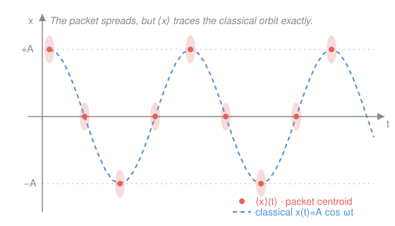

# Quantum Mechanics · Lesson 3.5: The Heisenberg picture and Ehrenfest's theorem

> ⏱ ~15 min · Module 3: The harmonic oscillator and operator formalism · Builds on: [3.3 Commutators and uncertainty](#/lesson/quantum-mechanics/03-03-commutators-uncertainty.md), [3.4 Compatible observables](#/lesson/quantum-mechanics/03-04-compatible-observables.md), [2.2 Stationary states and time evolution](#/lesson/quantum-mechanics/02-02-stationary-states-time-evolution.md) · Unlocks: Module 4 (angular momentum as a conserved quantity)

## Why this matters

Two questions have been hanging over everything so far. First: quantum mechanics is supposed to *contain* classical mechanics — a baseball is made of atoms, so Newton's $F=ma$ had better fall out somewhere. Where? Second: the quantization recipe you have been using — "promote $x,p$ to operators, impose $[\hat x,\hat p]=i\hbar$" — looks like a magic trick. Where does it *come from*? This lesson answers both at once. By moving time-dependence off the state and onto the operators (the **Heisenberg picture**), the dynamical law of QM turns into a near-photocopy of Hamilton's equations, and the expectation values $\langle \hat x\rangle,\langle \hat p\rangle$ are revealed to obey Newton's laws exactly. The bridge is a single substitution — Poisson bracket $\to$ commutator — and it is the whole payoff of the [analytical-mechanics](#/course/analytical-mechanics) course.

## The idea

You have always let the state $|\psi(t)\rangle$ carry the time-dependence: it rotates through Hilbert space while the operators $\hat x,\hat p,\hat H$ sit still. That is the **Schrödinger picture**. But a measurement only ever produces a number, $\langle \hat A\rangle = \langle\psi(t)|\hat A|\psi(t)\rangle$, and that number does not care *which* factor you consider to be moving. You can peel the time-evolution off the state and glue it onto the operator instead: freeze the state at $|\psi(0)\rangle$ and let $\hat A$ evolve. Same predictions, relabelled bookkeeping. That is the **Heisenberg picture**.

Why bother? Because once the operators move, you can ask "how fast?" — and the answer, $\dot{\hat A} = \frac{i}{\hbar}[\hat H,\hat A]$, is *structurally identical* to the classical equation of motion $\dot f = \{f,H\}$ with the Poisson bracket. Quantum dynamics and classical dynamics turn out to be the same equation written with two different brackets. And when you take the expectation value of this operator equation for $\hat x$ and $\hat p$, the commutators collapse into $\frac{d\langle x\rangle}{dt}=\frac{\langle p\rangle}{m}$ and $\frac{d\langle p\rangle}{dt}=\langle F\rangle$ — Newton, for the *average* position. The centre of a wave packet coasts along a classical trajectory even while the packet itself spreads and diffracts.

## The formal version

**Time-evolution operator.** For a time-independent Hamiltonian, the Schrödinger equation $i\hbar\,\partial_t|\psi\rangle = \hat H|\psi\rangle$ is solved by $|\psi(t)\rangle = \hat U(t)|\psi(0)\rangle$ with

$$\hat U(t) = e^{-i\hat H t/\hbar}, \qquad \hat U^\dagger \hat U = \mathbb{1}, \qquad [\hat U,\hat H]=0.$$

In words: $\hat U$ is the unitary "clock" that advances any state by a time $t$; it is built from $\hat H$, so it commutes with $\hat H$.

**The two pictures.** Write the same expectation value two ways:

$$\langle \hat A\rangle = \underbrace{\langle\psi(t)|\,\hat A_S\,|\psi(t)\rangle}_{\text{Schrödinger: state moves}} = \underbrace{\langle\psi(0)|\,\hat U^\dagger \hat A_S \hat U\,|\psi(0)\rangle}_{\text{Heisenberg: operator moves}}.$$

The **Heisenberg operator** is $\hat A_H(t) \equiv \hat U^\dagger(t)\,\hat A_S\,\hat U(t)$, acting on the frozen state $|\psi(0)\rangle$. In words: sandwich the fixed operator between the clock and its inverse, and let *that* combination carry the time-dependence.

**The Heisenberg equation of motion.** Differentiate $\hat A_H = \hat U^\dagger \hat A_S \hat U$ using $\dot{\hat U} = -\frac{i}{\hbar}\hat H\hat U$ and $\dot{\hat U}^\dagger = +\frac{i}{\hbar}\hat U^\dagger\hat H$:

$$\boxed{\ \frac{d\hat A_H}{dt} = \frac{i}{\hbar}\big[\hat H,\hat A_H\big] + \left(\frac{\partial \hat A}{\partial t}\right)_H\ }$$

In words: an operator's rate of change is set by how badly it fails to commute with the Hamiltonian (plus any *explicit* time-dependence it was built with, e.g. a time-varying field). If $[\hat H,\hat A]=0$, the operator is frozen — its expectation value is conserved.

**Ehrenfest's theorem.** Take the expectation value in any state; for operators with no explicit $t$-dependence, $\frac{d\langle\hat A\rangle}{dt} = \frac{i}{\hbar}\langle[\hat H,\hat A]\rangle$. Feed in $\hat H = \frac{\hat p^2}{2m} + V(\hat x)$ (see Worked example 1):

$$\frac{d\langle \hat x\rangle}{dt} = \frac{\langle \hat p\rangle}{m}, \qquad \frac{d\langle \hat p\rangle}{dt} = -\big\langle V'(\hat x)\big\rangle = \langle \hat F\rangle.$$

In words: the average momentum drives the average position, and the average force drives the average momentum — Newton's two first-order laws, for expectation values.

**Dirac's quantization rule.** Compare the Heisenberg equation with the classical one. In analytical mechanics, an observable evolves by $\frac{df}{dt} = \{f,H\} + \frac{\partial f}{\partial t}$, with the Poisson bracket $\{f,g\} = \sum_i \frac{\partial f}{\partial q_i}\frac{\partial g}{\partial p_i} - \frac{\partial f}{\partial p_i}\frac{\partial g}{\partial q_i}$. The two equations become identical under

$$\{f,g\} \ \longmapsto\ \frac{1}{i\hbar}\big[\hat f,\hat g\big].$$

In words: **to quantize a classical theory, replace every Poisson bracket by $\frac{1}{i\hbar}$ times the commutator.** The canonical relation $\{x,p\}=1$ becomes $[\hat x,\hat p]=i\hbar$ — the axiom you have been assuming since Module 1 is *derived* here, as the shadow of a classical fact.

## Picture

## Worked examples

**Example 1 (mechanical — the two commutators behind Ehrenfest).** Everything reduces to two brackets. Use $[\hat x,\hat p]=i\hbar$ and the product rule $[\hat A\hat B,\hat C]=\hat A[\hat B,\hat C]+[\hat A,\hat C]\hat B$.

*Position.* Only the kinetic term fails to commute with $\hat x$:

$$[\hat H,\hat x] = \tfrac{1}{2m}[\hat p^2,\hat x] = \tfrac{1}{2m}\big(\hat p[\hat p,\hat x]+[\hat p,\hat x]\hat p\big) = \tfrac{1}{2m}(-2i\hbar\,\hat p) = -\frac{i\hbar}{m}\hat p.$$

Hence $\frac{d\langle \hat x\rangle}{dt} = \frac{i}{\hbar}\langle[\hat H,\hat x]\rangle = \frac{i}{\hbar}\left(-\frac{i\hbar}{m}\right)\langle \hat p\rangle = \frac{\langle \hat p\rangle}{m}.$ ✓

*Momentum.* Only the potential fails to commute with $\hat p$. Using the identity $[V(\hat x),\hat p]=i\hbar\,V'(\hat x)$ (differentiate $V$; see Watch out):

$$[\hat H,\hat p] = [V(\hat x),\hat p] = i\hbar\,V'(\hat x) \ \Rightarrow\ \frac{d\langle \hat p\rangle}{dt} = \frac{i}{\hbar}\langle i\hbar\,V'(\hat x)\rangle = -\langle V'(\hat x)\rangle.$$ ✓

Two brackets, both Ehrenfest equations. This is the entire content of "QM contains Newton."

**Example 2 (why you'd care — momentum conservation, for free).** When is an observable conserved? Exactly when it commutes with $\hat H$. Take a *free* particle, $\hat H = \hat p^2/2m$. Then $[\hat H,\hat p] = \tfrac{1}{2m}[\hat p^2,\hat p]=0$, so

$$\frac{d\langle \hat p\rangle}{dt} = 0 \quad\Longrightarrow\quad \langle \hat p\rangle \text{ is constant in time.}$$

Momentum conservation is not a separate postulate — it is the statement "$\hat p$ commutes with the Hamiltonian because $V$ is flat." The same logic, applied to $\hat L_z$ and a central potential $V(r)$ in Module 4, will hand you angular-momentum conservation the instant you show $[\hat H,\hat L_z]=0$. Symmetry $\to$ commuting operator $\to$ conservation law is the quantum face of Noether's theorem from analytical mechanics.

## Watch out

- **You might think the Heisenberg operator $\hat A_H = \hat U^\dagger \hat A_S \hat U$ has the sandwich the other way.** It does not: the state evolves *forward* as $\hat U|\psi\rangle$, so pushing that onto the operator conjugates it as $\hat U^\dagger(\cdots)\hat U$. Get the daggers backwards and every sign in the Heisenberg equation flips.
- **You might think $\langle V'(\hat x)\rangle = V'(\langle \hat x\rangle)$, so the centroid always obeys Newton's law with the mean position.** False in general. $\langle V'(\hat x)\rangle$ is the average of the force *over the spread of the packet*; it equals the force at the mean only when $V'$ is linear — i.e. $V$ is at most quadratic (free particle, uniform field, harmonic oscillator). For any other potential the packet's width feeds back into its motion, and that gap *is* the leading quantum correction to classical mechanics (P3).
- **You might think $[V(\hat x),\hat p]=0$ because both are "just" functions of one variable each.** No — $\hat p$ generates translations, so it detects the *slope* of $V$: $[V(\hat x),\hat p]=i\hbar V'(\hat x)$. Only a constant potential commutes with $\hat p$. Derive it, don't guess it: act on a test state and let $\hat p=-i\hbar\,d/dx$ hit the product $V\psi$.

## One-liner

> Move time onto the operators and quantum dynamics becomes classical dynamics with $\{\,,\}\to\frac{1}{i\hbar}[\,,]$ — so expectation values obey Newton's laws, and $[\hat x,\hat p]=i\hbar$ is just $\{x,p\}=1$ in disguise.

## Problems

**P1 (🟢)** For the free particle $\hat H = \hat p^2/2m$, use the Heisenberg equation to compute $\dfrac{d\hat x_H}{dt}$ and $\dfrac{d\hat p_H}{dt}$, then integrate to get $\hat x_H(t)$ as an operator. Compare with the classical $x(t)=x_0+\frac{p_0}{m}t$.

**P2 (🟡)** Starting only from $\dfrac{d\langle\hat A\rangle}{dt}=\dfrac{i}{\hbar}\langle[\hat H,\hat A]\rangle$ and $\hat H=\dfrac{\hat p^2}{2m}+V(\hat x)$, derive *both* Ehrenfest equations. State clearly which term of $\hat H$ contributes to each and why the other drops out.

**P3 (🔴, optional)** For the harmonic oscillator $V(\hat x)=\tfrac12 m\omega^2\hat x^2$: (a) show $\langle \hat x\rangle(t)$ satisfies $\ddot{\langle x\rangle} = -\omega^2\langle x\rangle$ *exactly* — the classical SHM equation, for any state. (b) Explain precisely why the oscillator is special: which property of $V$ makes $\langle V'(\hat x)\rangle = V'(\langle \hat x\rangle)$, and what goes wrong for, say, $V=\lambda \hat x^4$.

Solutions

**P1** With no explicit time-dependence, $\dot{\hat A}_H=\frac{i}{\hbar}[\hat H,\hat A_H]$. From Example 1, $[\hat H,\hat x]=-\frac{i\hbar}{m}\hat p$, and this relation is preserved under the unitary conjugation defining $\hat A_H$, so

$$\frac{d\hat x_H}{dt} = \frac{i}{\hbar}\Big(-\frac{i\hbar}{m}\hat p_H\Big) = \frac{\hat p_H}{m}, \qquad \frac{d\hat p_H}{dt} = \frac{i}{\hbar}[\hat H,\hat p_H] = 0.$$

So $\hat p_H(t)=\hat p_H(0)=\hat p(0)$ is constant, and integrating the first equation,

$$\hat x_H(t) = \hat x(0) + \frac{\hat p(0)}{m}\,t.$$

This is the classical $x(t)=x_0+\frac{p_0}{m}t$ promoted verbatim to an operator equation — the Heisenberg picture makes the analogy literal, not just approximate. (Taking $\langle\cdot\rangle$ recovers Ehrenfest for the free particle.)

**P2** Only cross-terms survive each commutator.

*Position.* $\hat x$ commutes with $V(\hat x)$, so only the kinetic term acts:
$$[\hat H,\hat x]=\tfrac{1}{2m}[\hat p^2,\hat x]=\tfrac{1}{2m}\big(\hat p[\hat p,\hat x]+[\hat p,\hat x]\hat p\big)=\tfrac{1}{2m}\big(\hat p(-i\hbar)+(-i\hbar)\hat p\big)=-\frac{i\hbar}{m}\hat p.$$
Then $\frac{d\langle\hat x\rangle}{dt}=\frac{i}{\hbar}\big(-\frac{i\hbar}{m}\big)\langle\hat p\rangle=\dfrac{\langle\hat p\rangle}{m}$.

*Momentum.* $\hat p$ commutes with $\hat p^2$, so only the potential acts. With $[V(\hat x),\hat p]=i\hbar V'(\hat x)$,
$$[\hat H,\hat p]=[V(\hat x),\hat p]=i\hbar V'(\hat x)\ \Rightarrow\ \frac{d\langle\hat p\rangle}{dt}=\frac{i}{\hbar}\langle i\hbar V'(\hat x)\rangle=-\langle V'(\hat x)\rangle=\langle \hat F\rangle.$$

The kinetic term is invisible to $\hat x$ dynamics' potential half and the potential is invisible to $\hat p$ dynamics' kinetic half — each Ehrenfest equation is powered by exactly one piece of $\hat H$.

**P3** (a) Ehrenfest gives the two first-order equations $\frac{d\langle\hat x\rangle}{dt}=\frac{\langle\hat p\rangle}{m}$ and $\frac{d\langle\hat p\rangle}{dt}=-\langle V'(\hat x)\rangle$. Here $V'(\hat x)=m\omega^2\hat x$, so $\langle V'(\hat x)\rangle=m\omega^2\langle\hat x\rangle$. Differentiate the first equation and substitute the second:

$$\frac{d^2\langle\hat x\rangle}{dt^2}=\frac{1}{m}\frac{d\langle\hat p\rangle}{dt}=-\frac{1}{m}\,m\omega^2\langle\hat x\rangle=-\omega^2\langle\hat x\rangle.$$

So $\langle\hat x\rangle(t)=\langle\hat x\rangle_0\cos\omega t+\frac{\langle\hat p\rangle_0}{m\omega}\sin\omega t$ — pure classical SHM at frequency $\omega$, with **no** approximation and for **any** initial state, however broad or lumpy.

(b) The step that made it close was $\langle V'(\hat x)\rangle=m\omega^2\langle\hat x\rangle=V'(\langle\hat x\rangle)$. This holds because $V'$ is **linear** in $\hat x$, i.e. $V$ is quadratic. The average of a linear function is the linear function of the average, so no higher moments (the packet's spread) intrude. For $V=\lambda\hat x^4$, $V'=4\lambda\hat x^3$ and $\langle\hat x^3\rangle\neq\langle\hat x\rangle^3$ in general: expanding $\hat x=\langle\hat x\rangle+\delta\hat x$ gives $\langle\hat x^3\rangle=\langle\hat x\rangle^3+3\langle\hat x\rangle\langle\delta\hat x^2\rangle+\cdots$, and the variance term $\langle\delta\hat x^2\rangle=(\Delta x)^2$ couples the packet's *width* into the motion of its *centre*. That extra term is the leading quantum correction — it is exactly why anharmonic systems are where classical and quantum trajectories part ways.

## Flashback

**From Lesson 3.3 (Commutators and uncertainty):** Compute $[\hat x^2,\hat p]$ from the canonical relation $[\hat x,\hat p]=i\hbar$, using the product rule $[\hat A\hat B,\hat C]=\hat A[\hat B,\hat C]+[\hat A,\hat C]\hat B$. Then say how this is the *same identity* that produced $[\hat H,\hat p]$ in this lesson.

Solution

$$[\hat x^2,\hat p]=\hat x[\hat x,\hat p]+[\hat x,\hat p]\hat x=\hat x(i\hbar)+(i\hbar)\hat x=2i\hbar\,\hat x.$$

Equivalently, $[f(\hat x),\hat p]=i\hbar f'(\hat x)$ with $f=x^2$ gives $i\hbar(2x)=2i\hbar\hat x$ — the same result, faster. This is precisely the identity behind $[\hat H,\hat p]=[V(\hat x),\hat p]=i\hbar V'(\hat x)$: a harmonic potential $V=\tfrac12 m\omega^2\hat x^2$ has $[V,\hat p]=\tfrac12 m\omega^2\,[\hat x^2,\hat p]=i\hbar m\omega^2\hat x=i\hbar V'(\hat x)$, the force operator that drives $\frac{d\langle\hat p\rangle}{dt}=-m\omega^2\langle\hat x\rangle$. ✓

## Connections

- **Backward:** the machinery is all Module 3 commutator algebra — [3.3](#/lesson/quantum-mechanics/03-03-commutators-uncertainty.md) gave $[\hat x,\hat p]=i\hbar$ and the product rule, and [3.4](#/lesson/quantum-mechanics/03-04-compatible-observables.md)'s "$[\hat A,\hat H]=0$" reappears here as the exact condition for a conserved quantity. The clock $\hat U=e^{-i\hat H t/\hbar}$ is [2.2](#/lesson/quantum-mechanics/02-02-stationary-states-time-evolution.md)'s stationary-state phase, packaged as one operator.
- **Forward:** in Module 4, $[\hat H,\hat L_z]=0$ for a central potential makes angular momentum conserved — Example 2's argument, reused. Later, the Heisenberg picture is the natural home for the *interaction picture* of time-dependent perturbation theory ([6.5](#/lesson/quantum-mechanics/06-05-time-dependent-perturbation.md)).
- **Sideways (analytical mechanics):** this lesson is that course cashing its check. The Heisenberg equation $\dot{\hat A}=\frac{i}{\hbar}[\hat H,\hat A]$ *is* Hamilton's $\dot f=\{f,H\}$ under $\{\,,\}\to\frac{1}{i\hbar}[\,,]$; the whole Poisson-bracket formalism you learned there exists partly so that this one substitution can quantize any classical system. And "commutes with $\hat H$ $\Rightarrow$ conserved" is Noether's symmetry–conservation theorem, translated into operators.
