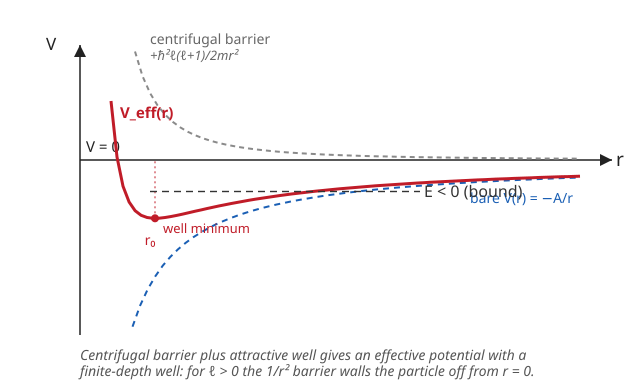

# Quantum Mechanics · Lesson 4.1: The Schrödinger equation in three dimensions

> ⏱ ~15 min · Module 4: Three dimensions, angular momentum, and spin · Builds on: [2.1 The Schrödinger equation](#/lesson/quantum-mechanics/02-01-schrodinger-equation.md), [2.3 The infinite square well](#/lesson/quantum-mechanics/02-03-infinite-square-well.md) · Unlocks: 4.2 (the angular-momentum operator algebra) and 4.4 (the hydrogen atom)

## Why this matters

Every atom, every molecule, every scattering experiment lives in three dimensions with a force that points toward a center. The whole reason quantum mechanics explains chemistry is that the 3D Schrödinger equation for a **central potential** — one that depends only on the distance $r$ from a center — splits cleanly into an *angular* piece that is the same for every such potential (it becomes angular momentum, the subject of the next three lessons) and a *radial* piece that is essentially a 1D problem you already know how to solve. This lesson performs that split. Do it once here and hydrogen, the rigid rotor, and the 3D oscillator all become variations on machinery you've already built.

## The idea

In one dimension the time-independent Schrödinger equation (TISE) balanced kinetic energy against a potential $V(x)$. In three dimensions the kinetic term becomes the **Laplacian** $\nabla^2$, and if the potential only cares about distance, $V=V(r)$, then the problem has full rotational symmetry: rotating the whole system changes nothing. Symmetry always lets you separate variables, and here it separates *angle* from *radius*. Write the wavefunction as a product,
$$\psi(r,\theta,\phi) = R(r)\,Y(\theta,\phi),$$
a radial function times an angular function, and the equation cracks into two independent equations tied together by a single **separation constant**.

That constant turns out to be $\ell(\ell+1)$ with $\ell = 0,1,2,\dots$ — it labels how much angular momentum the state carries. And here is the payoff you should hold onto: once you package the radial function as $u(r)=rR(r)$, the radial equation looks *exactly* like a 1D Schrödinger equation, but with an extra repulsive term added to the potential. That extra term is the **centrifugal barrier**: the energy cost of orbiting. It is the identical effective-potential trick from the classical central-force problem in analytical mechanics — spinning matter is flung outward, and quantum mechanically that shows up as a $1/r^2$ wall near the origin that any state with $\ell>0$ cannot climb over.

## The formal version

**The 3D time-independent Schrödinger equation.** For a particle of mass $m$ in a potential $V(\mathbf r)$,
$$-\frac{\hbar^2}{2m}\nabla^2\psi(\mathbf r) + V(\mathbf r)\,\psi(\mathbf r) = E\,\psi(\mathbf r),$$
where $\hbar$ is the reduced Planck constant, $E$ the energy eigenvalue, and $\nabla^2 = \partial_x^2+\partial_y^2+\partial_z^2$ the Laplacian. *In words:* kinetic energy (curvature of $\psi$) plus potential energy equals total energy — the 1D law with $\partial_x^2$ promoted to $\nabla^2$.

**The Laplacian in spherical coordinates** $(r,\theta,\phi)$ — quote it, don't derive it:
$$\nabla^2 = \underbrace{\frac{1}{r^2}\frac{\partial}{\partial r}\!\left(r^2\frac{\partial}{\partial r}\right)}_{\text{radial}} + \underbrace{\frac{1}{r^2}\left[\frac{1}{\sin\theta}\frac{\partial}{\partial\theta}\!\left(\sin\theta\frac{\partial}{\partial\theta}\right) + \frac{1}{\sin^2\theta}\frac{\partial^2}{\partial\phi^2}\right]}_{\text{angular}}.$$
*In words:* the derivatives split into a part that moves you outward and a part that moves you around the sphere, and every angular piece carries a $1/r^2$ out front.

**The angular operator.** The bracketed angular part is (up to a factor) an operator we will name and diagonalize in the next lesson:
$$\hat L^2 = -\hbar^2\left[\frac{1}{\sin\theta}\frac{\partial}{\partial\theta}\!\left(\sin\theta\frac{\partial}{\partial\theta}\right) + \frac{1}{\sin^2\theta}\frac{\partial^2}{\partial\phi^2}\right],$$
the square of the orbital angular momentum. Its eigenfunctions are the angular factors $Y(\theta,\phi)$, with eigenvalue
$$\hat L^2\,Y = \hbar^2\,\ell(\ell+1)\,Y,\qquad \ell = 0,1,2,\dots$$
*In words:* the angular part of any central-potential wavefunction is an eigenstate of total angular momentum squared, and its eigenvalue is quantized as $\hbar^2\ell(\ell+1)$. For now, $\ell(\ell+1)$ is simply the **separation constant** — the number you are allowed to peel off the angular equation. *Why that eigenvalue, and where the second label $m$ comes from, is exactly the algebra of Lesson 4.2; here we only need that such an $\ell$ exists.*

**Separation.** Insert $\psi=R(r)Y(\theta,\phi)$ into the TISE, use the Laplacian above, multiply through by $-2mr^2/(\hbar^2 RY)$, and the $r$-dependence and angle-dependence land on opposite sides of the equals sign. Each side must therefore equal the same constant, $\ell(\ell+1)$. The angular side gives the $\hat L^2$ eigenvalue equation above; the radial side gives the **radial equation**:
$$-\frac{\hbar^2}{2m}\frac{1}{r^2}\frac{d}{dr}\!\left(r^2\frac{dR}{dr}\right) + \left[V(r) + \frac{\hbar^2\ell(\ell+1)}{2mr^2}\right]R = E\,R.$$

**The $u=rR$ substitution.** Define $u(r) = rR(r)$. Then $\frac{1}{r^2}\frac{d}{dr}(r^2 R') = \frac{u''}{r}$, and multiplying the radial equation by $r$ collapses it into
$$\boxed{\;-\frac{\hbar^2}{2m}\,u''(r) + V_{\text{eff}}(r)\,u(r) = E\,u(r),\qquad V_{\text{eff}}(r) = V(r) + \frac{\hbar^2\ell(\ell+1)}{2mr^2}.\;}$$
*In words:* the radial problem is a **1D Schrödinger equation** on the half-line $r\ge 0$ for the function $u(r)$, in an **effective potential** equal to the real potential plus a repulsive **centrifugal barrier** $\dfrac{\hbar^2\ell(\ell+1)}{2mr^2}$. Rotational kinetic energy has been converted into a potential wall.

**Boundary conditions.** Two requirements pin down the allowed $u$:
- $u(0)=0$. Since $R=u/r$, a nonzero $u$ at the origin would make $R$ blow up like $1/r$; regularity forces $u(0)=0$. (This is exactly a hard wall at $r=0$ — the reason the radial problem behaves like a well with one rigid side.)
- Normalizability: $\int_0^\infty |u(r)|^2\,dr < \infty$, because the 3D norm $\int|\psi|^2\,d^3r = \int_0^\infty |R|^2 r^2\,dr\int|Y|^2 d\Omega = \int_0^\infty |u|^2\,dr$ when the angular part is normalized. So $u$ must decay at infinity for bound states.

## Picture

The gray curve is the centrifugal barrier $\hbar^2\ell(\ell+1)/2mr^2$ — pure repulsion, a wall at small $r$. The blue curve is an attractive well, drawn here as the Coulomb potential $-A/r$. Their sum, the red $V_{\text{eff}}(r)$, has a genuine minimum at some radius $r_0$: the state can neither fall into the origin (the barrier blocks it) nor escape to infinity (a bound level sits at $E<0$). For $\ell=0$ the gray curve vanishes and the barrier disappears entirely — only then can amplitude reach $r=0$.

## Worked examples

**Example 1 (mechanical — reading off the effective potential).** Take the 3D isotropic harmonic oscillator, $V(r)=\tfrac12 m\omega^2 r^2$. The radial equation for angular momentum $\ell$ is immediately
$$-\frac{\hbar^2}{2m}u'' + \left[\tfrac12 m\omega^2 r^2 + \frac{\hbar^2\ell(\ell+1)}{2mr^2}\right]u = Eu.$$
No new work: you *write down* the 1D problem whose potential is the parabola pushed up by the centrifugal $1/r^2$ term. For $\ell=0$ it is a 1D oscillator on the half-line with the wall $u(0)=0$ — which selects exactly the odd oscillator states (the ones that already vanish at the origin). The 3D structure did nothing but hand you a 1D problem and a boundary condition.

**Example 2 (why you'd care — the centrifugal barrier as physics).** Why can't a $\ell=2$ electron sit right on the nucleus, where the Coulomb attraction $-A/r$ is most negative? Compare the two competing terms as $r\to 0$: attraction goes like $-A/r$, but the barrier goes like $+\hbar^2\ell(\ell+1)/2mr^2$. The $1/r^2$ term wins — it dives to $+\infty$ faster than the attraction dives to $-\infty$. So $V_{\text{eff}}\to+\infty$ at the origin for any $\ell>0$: the wavefunction is walled off from $r=0$, and $u(r)$ must start from zero and stay small there. This is the quantum echo of the classical fact that a planet with nonzero angular momentum never hits the sun — it would need infinite energy to shed all that orbital motion. Only $\ell=0$ (an $s$-state, zero angular momentum) has any amplitude at the center, which is why $s$-electrons alone feel the nucleus directly (the origin of the *contact* hyperfine interaction).

## Watch out

- **You might think** the separation constant is arbitrary, **but actually** normalizability of the *angular* function on the full sphere forces it to be $\ell(\ell+1)$ with integer $\ell\ge 0$ — any other value makes $Y$ blow up at the poles. We are quoting that result now and proving it in 4.2; it is not a free knob.
- **You might think** $u(r)=rR(r)$ obeys the *same* equation as $R$. It does not — the whole point is that $u$ obeys a **cleaner** 1D-style equation with no first-derivative term, at the cost of a new boundary condition $u(0)=0$. Solve for $u$, then divide by $r$ to recover the physical radial function $R$.
- **You might think** the centrifugal term is part of the "real" potential. It is not a force in the input problem — it is kinetic energy (the angular part of $\nabla^2$) that got *reclassified* as potential energy when you froze the angular motion at fixed $\ell$. Same accounting trick as the classical effective potential.
- **You might** forget the measure: the radial normalization carries an $r^2$, $\int|R|^2 r^2\,dr$, which is precisely what makes $\int|u|^2\,dr$ (no $r^2$) the clean 1D norm. Drop the $r^2$ and every normalization constant is wrong.

## One-liner

> A central potential splits the 3D Schrödinger equation into a universal angular part (angular momentum, eigenvalue $\hbar^2\ell(\ell+1)$) and a 1D radial equation for $u=rR$ whose potential gains a repulsive centrifugal barrier $\hbar^2\ell(\ell+1)/2mr^2$.

## Problems

**P1 (🟢)** Write the effective potential $V_{\text{eff}}(r)$ for the Coulomb potential $V(r) = -\dfrac{A}{r}$ (with $A>0$ a constant, and angular momentum $\ell$), and find the radius $r_0$ at which it is a minimum. Express $r_0$ in terms of $A$, $m$, $\ell$.

**P2 (🟡)** Carry out the separation of variables explicitly. Write the spherical Laplacian as $\nabla^2 = \frac{1}{r^2}\frac{d}{dr}(r^2\frac{d}{dr}) + \frac{1}{r^2}\Lambda$, where $\Lambda$ is the angular differential operator $\frac{1}{\sin\theta}\partial_\theta(\sin\theta\,\partial_\theta)+\frac{1}{\sin^2\theta}\partial_\phi^2$. Insert $\psi=R(r)Y(\theta,\phi)$ into the TISE, divide by $RY$, multiply by $-2mr^2/\hbar^2$, and show the equation splits into an $r$-only part and an angle-only part. Identify the separation constant and state the two resulting equations.

**P3 (🔴, optional)** *The 3D infinite spherical well, $\ell=0$ — a clean payoff.* A particle is free ($V=0$) inside a sphere of radius $a$ and confined by infinite walls ($V=\infty$ for $r>a$). For $\ell=0$ the radial equation for $u=rR$ reduces to $u'' = -k^2 u$ with $k^2 = 2mE/\hbar^2$, subject to $u(0)=0$ and $u(a)=0$. Solve for the allowed energies $E_n$. Comment on what you recognize.

Solutions

**P1.** Add the centrifugal barrier to the Coulomb well:
$$V_{\text{eff}}(r) = -\frac{A}{r} + \frac{\hbar^2\ell(\ell+1)}{2mr^2}.$$
Set the derivative to zero:
$$V_{\text{eff}}'(r) = \frac{A}{r^2} - \frac{\hbar^2\ell(\ell+1)}{m r^3} = 0 \;\Longrightarrow\; A\,r = \frac{\hbar^2\ell(\ell+1)}{m} \;\Longrightarrow\; r_0 = \frac{\hbar^2\ell(\ell+1)}{mA}.$$
The second derivative is positive there (the $1/r^3$ term dominates near the origin), so it is a minimum. For $\ell=0$ there is no barrier and no minimum — $V_{\text{eff}}$ is just the monotone Coulomb well, consistent with $r_0\to 0$. For the hydrogen atom $A=e^2/4\pi\varepsilon_0$, so $r_0 = a_0\,\ell(\ell+1)$ where $a_0=4\pi\varepsilon_0\hbar^2/me^2$ is the Bohr radius — the classical orbit radius scales up with angular momentum, exactly as intuition demands.

**P2.** Insert $\psi=R(r)Y(\theta,\phi)$. The radial derivative hits only $R$, the angular operator $\Lambda$ (the bracket $\frac{1}{\sin\theta}\partial_\theta(\sin\theta\,\partial_\theta)+\frac{1}{\sin^2\theta}\partial_\phi^2$) hits only $Y$:
$$-\frac{\hbar^2}{2m}\left[\frac{Y}{r^2}\frac{d}{dr}\!\left(r^2\frac{dR}{dr}\right) + \frac{R}{r^2}\,\Lambda Y\right] + V(r)RY = E\,RY.$$
Divide by $RY$ and multiply by $-\dfrac{2mr^2}{\hbar^2}$:
$$\underbrace{\frac{1}{R}\frac{d}{dr}\!\left(r^2\frac{dR}{dr}\right) - \frac{2mr^2}{\hbar^2}\big[V(r)-E\big]}_{\text{depends on }r\text{ only}} \;=\; \underbrace{-\frac{1}{Y}\,\Lambda Y}_{\text{depends on }\theta,\phi\text{ only}}.$$
A function of $r$ alone equals a function of angles alone, so both equal a constant. Call it $\ell(\ell+1)$ (the standard name). Then:
- **Angular:** $-\Lambda Y = \ell(\ell+1)\,Y$, i.e. $\hat L^2 Y = \hbar^2\ell(\ell+1)Y$ after restoring the $-\hbar^2$.
- **Radial:** $\dfrac{d}{dr}\!\left(r^2\dfrac{dR}{dr}\right) - \dfrac{2mr^2}{\hbar^2}[V-E]R = \ell(\ell+1)R$, which rearranges to the radial equation from the lesson (and, via $u=rR$, to the boxed 1D form). The separation constant $\ell(\ell+1)$ is the single number linking the two.

**P3.** The general solution of $u''=-k^2u$ is $u(r)=B\sin(kr)+C\cos(kr)$. The condition $u(0)=0$ kills the cosine ($C=0$), leaving $u(r)=B\sin(kr)$. The condition $u(a)=0$ demands
$$\sin(ka)=0 \;\Longrightarrow\; ka = n\pi,\quad n=1,2,3,\dots \;\Longrightarrow\; k=\frac{n\pi}{a}.$$
Since $E=\hbar^2k^2/2m$,
$$\boxed{E_n = \frac{n^2\pi^2\hbar^2}{2ma^2},\qquad n=1,2,3,\dots}$$
This is **identical to the 1D infinite square well of width $a$** — the same formula, node counting, and orthogonal $\sin(n\pi r/a)$ profiles. That is the whole reward of the $u=rR$ substitution: the $\ell=0$ radial problem *is* the 1D box you solved in Lesson 2.3, with $r$ playing the role of $x$ and $u(0)=0$ enforced automatically by regularity. The physical radial function is $R(r)=u/r = B\,\dfrac{\sin(n\pi r/a)}{r}$ — the spherical-well "$j_0$" wavefunctions. (For $\ell>0$ the centrifugal barrier deforms this and the solutions become spherical Bessel functions $j_\ell$, with the zeros no longer evenly spaced.)

## Flashback

**From Lesson 2.1 (The Schrödinger equation):** In this lesson we separated *space* into radius and angle. Back in 2.1 you separated *time* from space. For a time-independent Hamiltonian, write $\Psi(\mathbf r,t)=\psi(\mathbf r)f(t)$, insert it into the time-dependent Schrödinger equation $i\hbar\,\partial_t\Psi = \hat H\Psi$, and separate. What ODE does the time factor $f(t)$ satisfy, what is its solution, and why does $|\Psi|^2$ come out time-independent?

Solution

Insert $\Psi=\psi f$ into $i\hbar\,\partial_t\Psi = \hat H\Psi$. The time derivative hits only $f$, the spatial Hamiltonian only $\psi$:
$$i\hbar\,\psi\,\frac{df}{dt} = f\,\hat H\psi.$$
Divide by $\psi f$:
$$i\hbar\,\frac{1}{f}\frac{df}{dt} = \frac{1}{\psi}\hat H\psi.$$
Left side depends only on $t$, right side only on $\mathbf r$, so both equal a constant with units of energy — call it $E$. The right side is the time-independent Schrödinger equation $\hat H\psi=E\psi$. The time factor obeys
$$i\hbar\,\frac{df}{dt} = E f \;\Longrightarrow\; \frac{df}{dt} = -\frac{iE}{\hbar}f \;\Longrightarrow\; f(t)=e^{-iEt/\hbar}.$$
So $\Psi(\mathbf r,t)=\psi(\mathbf r)\,e^{-iEt/\hbar}$. Its probability density is
$$|\Psi|^2 = |\psi|^2\,\big|e^{-iEt/\hbar}\big|^2 = |\psi|^2\cdot 1 = |\psi(\mathbf r)|^2,$$
independent of $t$ because the time dependence is a pure phase of unit modulus. That is exactly why energy eigenstates are called **stationary states** — same separation-of-variables move as today, applied to the time axis instead of the angular ones.

## Connections

- **Backward:** this reuses the separation-of-variables engine from [2.1](#/lesson/quantum-mechanics/02-01-schrodinger-equation.md) (there it split time from space; here it splits radius from angle), and the boxed radial equation is literally the 1D TISE of [2.3](#/lesson/quantum-mechanics/02-03-infinite-square-well.md) with an added centrifugal term — P3 makes them coincide when $\ell=0$.
- **Forward:** the angular eigenvalue $\hbar^2\ell(\ell+1)$ quoted here is *derived* from commutators in 4.2 (angular-momentum algebra), the eigenfunctions $Y_\ell^m$ are built in 4.3 (spherical harmonics), and the radial equation with the Coulomb $V=-A/r$ from P1 is solved in 4.4 to give the hydrogen spectrum.
- **Sideways (analytical mechanics):** the effective potential $V_{\text{eff}}=V(r)+\hbar^2\ell(\ell+1)/2mr^2$ is the quantum twin of the classical central-force effective potential $V(r)+L^2/2mr^2$, with the conserved classical angular momentum $L$ replaced by $\hbar\sqrt{\ell(\ell+1)}$. Same centrifugal barrier, same "orbiting matter is walled off from the center" physics — the correspondence you'd expect from quantizing a Hamiltonian.
