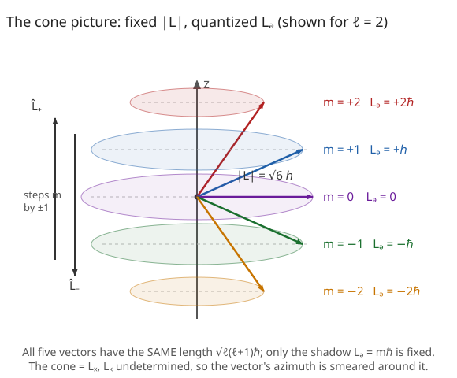

# Quantum Mechanics · Lesson 4.2: Angular momentum — the operator algebra

> ⏱ ~15 min · Module 4: Three dimensions, angular momentum, and spin · Builds on: [4.1 The Schrödinger equation in three dimensions](#/lesson/quantum-mechanics/04-01-schrodinger-3d.md), [3.2 The harmonic oscillator II: ladder operators](#/lesson/quantum-mechanics/03-02-harmonic-oscillator-ladder-operators.md) · Unlocks: 4.3 spherical harmonics & the rigid rotor; 4.5 spin-1/2; 4.6 adding angular momenta

## Why this matters

Separating the 3D Schrödinger equation for a central potential (Lesson 4.1) split every problem into a radial piece and an **angular** piece — and the angular piece is *universal*: it is identical for hydrogen, for a rotating molecule, for a nucleon in a shell, for anything spherically symmetric. That universal angular structure is governed entirely by the angular-momentum operators. The astonishing part — and the reason this lesson is pure joy — is that you never have to solve a differential equation. The **entire spectrum of angular momentum** falls out from three commutators and a positivity argument, exactly the way the oscillator's whole ladder came from $[a,a^\dagger]=1$ in [3.2](#/lesson/quantum-mechanics/03-02-harmonic-oscillator-ladder-operators.md). Master this algebra once and you own spin (4.5), the Zeeman effect, selection rules, and half of a graduate QM exam.

## The idea

Classically, angular momentum is $\mathbf L = \mathbf r \times \mathbf p$: a vector with three components you can all know at once. Quantum mechanically that fails. The three components $\hat L_x, \hat L_y, \hat L_z$ **do not commute**, so they are *incompatible* — sharpening one blurs the other two. You cannot point the angular-momentum vector in a definite direction; the best you can do is fix its **length** and **one** component (conventionally $\hat L_z$).

So the picture is a *cone*: the vector has a fixed length and a fixed $z$-shadow, but its tip is smeared around a circle because $L_x$ and $L_y$ are undetermined. And here's the payoff — asking "which lengths and which $z$-shadows are allowed?" turns out to have a purely algebraic answer. Build a raising and lowering operator, just like the oscillator's $a^\dagger, a$, that walks you up and down the allowed $z$-values. Demand that the walk terminate (it must, because a component can't exceed the whole length). Termination pins down the quantized menu. No wavefunctions required — only commutators.

## The formal version

**Orbital angular momentum.** Promote $\mathbf L = \mathbf r \times \mathbf p$ to operators, $\hat{\mathbf L} = \hat{\mathbf r} \times \hat{\mathbf p}$, i.e.

$$\hat L_x = \hat y\,\hat p_z - \hat z\,\hat p_y, \qquad \hat L_y = \hat z\,\hat p_x - \hat x\,\hat p_z, \qquad \hat L_z = \hat x\,\hat p_y - \hat y\,\hat p_x.$$

*In words:* each component is the same cross-product formula you know, now built from the operators $\hat x_i, \hat p_j$.

**The fundamental commutation relations.** Using only the canonical $[\hat x_i, \hat p_j] = i\hbar\,\delta_{ij}$ (positions commute among themselves, momenta among themselves), one finds

$$\boxed{[\hat L_i, \hat L_j] = i\hbar\,\epsilon_{ijk}\,\hat L_k}$$

where $\epsilon_{ijk}$ is the Levi-Civita symbol ($+1$ for cyclic $xyz$, $-1$ for anticyclic, $0$ if any index repeats) and repeated $k$ is summed. Written out: $[\hat L_x,\hat L_y]=i\hbar\hat L_z$, and cyclic. *In words:* the three components refuse to be simultaneously sharp — this is the mathematical statement that "you can't nail all three axes at once." (You'll derive one of these in Problem 1.)

**The Casimir operator.** Define the total-magnitude-squared operator

$$\hat L^2 = \hat L_x^2 + \hat L_y^2 + \hat L_z^2.$$

Its miracle: it commutes with every component,

$$[\hat L^2, \hat L_x] = [\hat L^2, \hat L_y] = [\hat L^2, \hat L_z] = 0.$$

*In words:* although the components fight each other, the **length** is compatible with any single component. So $\hat L^2$ and $\hat L_z$ form a compatible pair (a "complete set of commuting observables" for angular momentum, in the language of [3.4](#/lesson/quantum-mechanics/03-04-compatible-observables.md)) and share a common eigenbasis. Label those joint eigenstates $|\ell, m\rangle$:

$$\hat L^2\,|\ell,m\rangle = \hbar^2\,\lambda\,|\ell,m\rangle, \qquad \hat L_z\,|\ell,m\rangle = \hbar\,m\,|\ell,m\rangle,$$

with $\lambda, m$ dimensionless numbers to be determined (the $\hbar$'s carry the units, since angular momentum has units of $\hbar$).

**The ladder operators.** In exact analogy with the oscillator's $a, a^\dagger$, define

$$\hat L_\pm = \hat L_x \pm i\,\hat L_y, \qquad \hat L_- = (\hat L_+)^\dagger.$$

From the fundamental relations,

$$[\hat L_z, \hat L_\pm] = \pm\hbar\,\hat L_\pm, \qquad [\hat L^2, \hat L_\pm] = 0.$$

*In words:* $\hat L_+$ **raises** $m$ by one, $\hat L_-$ **lowers** it by one, and neither touches the length. Proof of the raising claim: since $\hat L_z(\hat L_\pm|\ell,m\rangle) = (\hat L_\pm \hat L_z + [\hat L_z,\hat L_\pm])|\ell,m\rangle = \hat L_\pm(\hbar m)|\ell,m\rangle \pm \hbar\hat L_\pm|\ell,m\rangle = \hbar(m\pm 1)\hat L_\pm|\ell,m\rangle$, the state $\hat L_\pm|\ell,m\rangle$ is an $\hat L_z$-eigenstate with eigenvalue $\hbar(m\pm 1)$ — one rung up or down. And $[\hat L^2,\hat L_\pm]=0$ means it stays at the same $\lambda$.

**The spectrum, from termination.** Because $\hat L_z^2 \le \hat L^2$ (a component can't exceed the whole), $m$ is bounded above and below at fixed $\lambda$. The ladder must therefore **stop at both ends**: call the top rung $m=\ell$, so $\hat L_+|\ell,\ell\rangle = 0$. Feeding this into the identity $\hat L_-\hat L_+ = \hat L^2 - \hat L_z^2 - \hbar\hat L_z$ (derived in Problem 3) forces $\lambda = \ell(\ell+1)$. The same move at the bottom rung gives $m_{\min} = -\ell$. Since $\hat L_\pm$ steps by exactly $1$, going from $-\ell$ to $+\ell$ takes an integer number of steps, so $2\ell$ is a non-negative integer:

$$\boxed{\;\hat L^2|\ell,m\rangle = \hbar^2\,\ell(\ell+1)\,|\ell,m\rangle,\quad \hat L_z|\ell,m\rangle=\hbar m\,|\ell,m\rangle,\quad m=-\ell,-\ell+1,\dots,+\ell,\quad \ell=0,\tfrac12,1,\tfrac32,2,\dots\;}$$

*In words:* the length is quantized to $\sqrt{\ell(\ell+1)}\,\hbar$, the $z$-shadow to $m\hbar$, and each $\ell$ carries $2\ell+1$ values of $m$. The algebra permits **half-integer** $\ell$ — orbital angular momentum $\hat{\mathbf L}=\hat{\mathbf r}\times\hat{\mathbf p}$ turns out to allow only *integer* $\ell$ (single-valuedness of the spatial wavefunction, seen in 4.3), but the half-integer solutions are not spurious: they are exactly **spin** (4.5), which no orbital motion produces.

**The ladder coefficient.** Normalizing so $|\ell,m\rangle$ are orthonormal,

$$\hat L_\pm\,|\ell,m\rangle = \hbar\sqrt{\ell(\ell+1) - m(m\pm 1)}\;|\ell, m\pm 1\rangle.$$

*In words:* the coefficient shrinks to zero exactly at the ends ($m=\pm\ell$), which is *why* the ladder terminates instead of running off to infinity.

This is the oscillator method wearing a new uniform: there, $[\hat N, a^\dagger]=+a^\dagger$ built an infinite ladder bounded **below** by $n=0$; here, $[\hat L_z,\hat L_+]=+\hbar\hat L_+$ builds a **finite** ladder bounded at *both* ends by $\pm\ell$. The extra bound is the whole difference, and it comes from $\hat L^2$ capping $\hat L_z^2$.

## Picture

The five vectors (for $\ell=2$) all have the **same** length $\sqrt{\ell(\ell+1)}\,\hbar=\sqrt6\,\hbar\approx 2.449\,\hbar$ — notice it is strictly *longer* than the maximum shadow $2\hbar$, so the vector can never lie flat along $z$. Each cone represents one allowed $m$: the $z$-projection $L_z=m\hbar$ is fixed, but $L_x$ and $L_y$ are undetermined, smearing the tip around the circle. $\hat L_+$ and $\hat L_-$ hop you between adjacent cones.

## Worked examples

**Example 1 (mechanical — the $\hat L^2 = \hat L_z^2 + \hbar\hat L_z + \hat L_-\hat L_+$ rewrite).** A rearrangement you will use constantly. Compute $\hat L_-\hat L_+$:

$$\hat L_-\hat L_+ = (\hat L_x - i\hat L_y)(\hat L_x + i\hat L_y) = \hat L_x^2 + \hat L_y^2 + i[\hat L_x,\hat L_y] = (\hat L^2 - \hat L_z^2) + i(i\hbar\hat L_z) = \hat L^2 - \hat L_z^2 - \hbar\hat L_z.$$

So $\hat L^2 = \hat L_-\hat L_+ + \hat L_z^2 + \hbar\hat L_z$. On the top rung $m=\ell$, $\hat L_+|\ell,\ell\rangle=0$ kills the first term, leaving $\hat L^2|\ell,\ell\rangle = (\hbar^2\ell^2 + \hbar^2\ell)|\ell,\ell\rangle = \hbar^2\ell(\ell+1)|\ell,\ell\rangle$. That single line is where the $\ell(\ell+1)$ — not $\ell^2$ — comes from, and hence why $|\mathbf L|=\sqrt{\ell(\ell+1)}\,\hbar > \ell\hbar$.

**Example 2 (why you'd care — the $\ell=1$ matrices, angular momentum you can multiply by hand).** Take $\ell=1$, so $\hat L^2$-eigenvalue is $\hbar^2(1)(2)=2\hbar^2$ and $m\in\{+1,0,-1\}$. Order the basis $\big(|1,1\rangle,\,|1,0\rangle,\,|1,-1\rangle\big)$. Then $\hat L_z$ is diagonal:

$$\hat L_z = \hbar\begin{pmatrix} 1 & 0 & 0 \\ 0 & 0 & 0 \\ 0 & 0 & -1\end{pmatrix}, \qquad \hat L^2 = 2\hbar^2\begin{pmatrix} 1 & 0 & 0 \\ 0 & 1 & 0 \\ 0 & 0 & 1\end{pmatrix}.$$

For $\hat L_+$, use the coefficient with $\ell(\ell+1)=2$: $\hat L_+|1,-1\rangle=\hbar\sqrt{2-(-1)(0)}\,|1,0\rangle=\hbar\sqrt2\,|1,0\rangle$ and $\hat L_+|1,0\rangle=\hbar\sqrt{2-0}\,|1,1\rangle=\hbar\sqrt2\,|1,1\rangle$, while $\hat L_+|1,1\rangle=0$. Reading these as columns,

$$\hat L_+ = \hbar\sqrt2\begin{pmatrix} 0 & 1 & 0 \\ 0 & 0 & 1 \\ 0 & 0 & 0\end{pmatrix}, \qquad \hat L_- = (\hat L_+)^\dagger = \hbar\sqrt2\begin{pmatrix} 0 & 0 & 0 \\ 1 & 0 & 0 \\ 0 & 1 & 0\end{pmatrix}.$$

Recover the Cartesian components from $\hat L_x = \tfrac12(\hat L_+ + \hat L_-)$ and $\hat L_y = \tfrac1{2i}(\hat L_+ - \hat L_-)$:

$$\hat L_x = \frac{\hbar}{\sqrt2}\begin{pmatrix} 0 & 1 & 0 \\ 1 & 0 & 1 \\ 0 & 1 & 0\end{pmatrix}, \qquad \hat L_y = \frac{\hbar}{\sqrt2}\begin{pmatrix} 0 & -i & 0 \\ i & 0 & -i \\ 0 & i & 0\end{pmatrix}.$$

These are the spin-1 matrices — the same objects that describe a spin-1 particle or a $J=1$ multiplet. You just built a chunk of Module 4's machinery with no calculus at all. (Sanity check you can do in your head: $\hat L_x^2+\hat L_y^2+\hat L_z^2$ must equal $2\hbar^2\mathbb 1$.)

## Watch out

- You might think the length of $\mathbf L$ is $\ell\hbar$. It is $\sqrt{\ell(\ell+1)}\,\hbar$, which is strictly larger. The gap is not a rounding artifact — it is *forced* by the algebra (Example 1) and is exactly why the vector can never align with $z$: if it could, all three components would be sharp, violating $[\hat L_i,\hat L_j]\ne 0$. The cone can never collapse to a line.
- You might think $\hat L_+$ is Hermitian because it's built from Hermitian $\hat L_x,\hat L_y$. It is **not**: $\hat L_+^\dagger = \hat L_-$. Like the oscillator's $a^\dagger$, ladder operators are not observables — they are bookkeeping tools that move between eigenstates. Only $\hat L^2, \hat L_z$ (and $\hat L_x,\hat L_y$) are observables.
- You might think the raising coefficient is $\sqrt{\ell(\ell+1)}$ regardless of $m$. It is $\sqrt{\ell(\ell+1)-m(m\pm1)}$, which **depends on the rung** and vanishes at the top/bottom. Forgetting the $-m(m\pm1)$ is the single most common matrix-element error; it is what makes the ladder finite.
- You might think half-integer $\ell$ is a mistake to be discarded. The algebra genuinely allows it; orbital angular momentum happens to exclude it (integer $\ell$ only, from wavefunction single-valuedness), but nature *uses* the half-integer solutions as spin. Don't throw them away.

## One-liner

> Three commutators $[\hat L_i,\hat L_j]=i\hbar\epsilon_{ijk}\hat L_k$ plus "the ladder must stop" hand you the entire spectrum: length $\sqrt{\ell(\ell+1)}\,\hbar$, shadow $m\hbar$ with $m=-\ell,\dots,\ell$ — no differential equation in sight.

## Problems

**P1 (🟢)** Starting from the canonical relations $[\hat x_i,\hat p_j]=i\hbar\delta_{ij}$ (with all positions commuting, all momenta commuting), verify the single fundamental relation

$$[\hat L_x,\hat L_y]=i\hbar\,\hat L_z.$$

Use $\hat L_x = \hat y\hat p_z - \hat z\hat p_y$, $\hat L_y=\hat z\hat p_x-\hat x\hat p_z$, and expand into four commutators.

**P2 (🟡)** For $\ell=1$, write down the matrices for $\hat L_z$ and $\hat L_x$ in the $\big(|1,1\rangle,|1,0\rangle,|1,-1\rangle\big)$ basis, then find the eigenvalues of $\hat L_x$. Comment on what the answer says about measuring angular momentum along a *different* axis than $z$. (This is the calculation behind a Stern–Gerlach magnet rotated off-axis, which you'll meet in 4.5.)

**P3 (🔴, optional)** Derive the ladder coefficient and use it to bound $m$.
(a) Show $\hat L_\mp\hat L_\pm = \hat L^2 - \hat L_z^2 \mp \hbar\hat L_z$.
(b) By evaluating $\langle \ell,m|\hat L_\mp\hat L_\pm|\ell,m\rangle$ two ways — once as the norm $\|\hat L_\pm|\ell,m\rangle\|^2$, once with part (a) — obtain $\hat L_\pm|\ell,m\rangle = \hbar\sqrt{\ell(\ell+1)-m(m\pm1)}\,|\ell,m\pm1\rangle$.
(c) Using that a norm is $\ge 0$, prove $-\ell \le m \le \ell$.

Solutions

**P1** Expand $[\hat L_x,\hat L_y]=[\hat y\hat p_z-\hat z\hat p_y,\ \hat z\hat p_x-\hat x\hat p_z]$ into four commutators:

$$[\hat y\hat p_z,\hat z\hat p_x]\;-\;[\hat y\hat p_z,\hat x\hat p_z]\;-\;[\hat z\hat p_y,\hat z\hat p_x]\;+\;[\hat z\hat p_y,\hat x\hat p_z].$$

Evaluate each, keeping only the one non-commuting pair inside (everything else commutes and can be factored out):

- $[\hat y\hat p_z,\hat z\hat p_x]$: only $\hat p_z$ and $\hat z$ fail to commute. Factoring the spectators $\hat y,\hat p_x$: $=\hat y\hat p_x[\hat p_z,\hat z]=\hat y\hat p_x(-i\hbar)=-i\hbar\,\hat y\hat p_x.$
- $[\hat y\hat p_z,\hat x\hat p_z]=0$: $\hat y,\hat x,\hat p_z$ all mutually commute.
- $[\hat z\hat p_y,\hat z\hat p_x]=0$: $\hat z,\hat p_y,\hat p_x$ all mutually commute.
- $[\hat z\hat p_y,\hat x\hat p_z]$: only $\hat z$ and $\hat p_z$ fail to commute. Factoring $\hat p_y,\hat x$: $=\hat x\hat p_y[\hat z,\hat p_z]=\hat x\hat p_y(i\hbar)=i\hbar\,\hat x\hat p_y.$

Sum: $-i\hbar\,\hat y\hat p_x + 0 - 0 + i\hbar\,\hat x\hat p_y = i\hbar(\hat x\hat p_y-\hat y\hat p_x)=i\hbar\,\hat L_z.$ ✓ (Used $[\hat p_z,\hat z]=-[\hat z,\hat p_z]=-i\hbar$.)

**P2** In the $\big(|1,1\rangle,|1,0\rangle,|1,-1\rangle\big)$ basis (from Example 2),

$$\hat L_z=\hbar\begin{pmatrix}1&0&0\\0&0&0\\0&0&-1\end{pmatrix},\qquad \hat L_x=\frac{\hbar}{\sqrt2}\begin{pmatrix}0&1&0\\1&0&1\\0&1&0\end{pmatrix}.$$

Eigenvalues of $\hat L_x$: with $\hat L_x=\frac{\hbar}{\sqrt2}M$, $M=\begin{pmatrix}0&1&0\\1&0&1\\0&1&0\end{pmatrix}$,

$$\det(M-\mu\mathbb 1)=-\mu(\mu^2-1)-1(-\mu)=-\mu^3+2\mu=-\mu(\mu^2-2)=0\ \Rightarrow\ \mu=0,\pm\sqrt2.$$

So the eigenvalues of $\hat L_x$ are $\frac{\hbar}{\sqrt2}\{0,\pm\sqrt2\}=\{0,+\hbar,-\hbar\}$ — **identical** to those of $\hat L_z$. That is the point: no axis is special. Measuring angular momentum along *any* direction yields the same menu $\{-\hbar,0,+\hbar\}$ (rotational invariance of the spectrum). What changes with the axis is only which *states* are definite, not which *values* are allowed — a rotated Stern–Gerlach magnet still splits the beam into $2\ell+1=3$ spots, just oriented differently.

**P3**
(a) $\hat L_\mp\hat L_\pm=(\hat L_x\mp i\hat L_y)(\hat L_x\pm i\hat L_y)=\hat L_x^2+\hat L_y^2\pm i(\hat L_x\hat L_y-\hat L_y\hat L_x)=(\hat L^2-\hat L_z^2)\pm i[\hat L_x,\hat L_y].$
With $[\hat L_x,\hat L_y]=i\hbar\hat L_z$: $\ =\hat L^2-\hat L_z^2\pm i(i\hbar\hat L_z)=\hat L^2-\hat L_z^2\mp\hbar\hat L_z.$ ✓

(b) Since $\hat L_\mp=(\hat L_\pm)^\dagger$, the expectation value *is* a norm:
$$\|\hat L_\pm|\ell,m\rangle\|^2=\langle\ell,m|\hat L_\mp\hat L_\pm|\ell,m\rangle=\langle\ell,m|\big(\hat L^2-\hat L_z^2\mp\hbar\hat L_z\big)|\ell,m\rangle=\hbar^2\big[\ell(\ell+1)-m^2\mp m\big]=\hbar^2\big[\ell(\ell+1)-m(m\pm1)\big].$$
Because $\hat L_\pm|\ell,m\rangle$ is (an unnormalized) $|\ell,m\pm1\rangle$, write $\hat L_\pm|\ell,m\rangle=c_\pm|\ell,m\pm1\rangle$ with $|c_\pm|^2$ equal to the norm above. Choosing the standard real, non-negative phase (Condon–Shortley), $c_\pm=\hbar\sqrt{\ell(\ell+1)-m(m\pm1)}$. ✓

(c) A norm cannot be negative, so from (b), $\ell(\ell+1)-m(m\pm1)\ge0$ for **both** signs:
$$m(m+1)\le\ell(\ell+1)\quad\text{and}\quad m(m-1)\le\ell(\ell+1).$$
The first factors as $(m-\ell)(m+\ell+1)\le0\Rightarrow -\ell-1\le m\le\ell$; the second as $(m+\ell)(m-\ell-1)\le0\Rightarrow -\ell\le m\le\ell+1$. Both must hold, so the intersection gives
$$-\ell\le m\le\ell.\ \checkmark$$
Equality at the ends is exactly where $c_+$ (at $m=\ell$) and $c_-$ (at $m=-\ell$) vanish, terminating the ladder — the self-consistency that quantizes $\ell$.

## Flashback

**From Lesson 3.2 (Ladder operators for the harmonic oscillator):** With $\hat a\,|n\rangle=\sqrt n\,|n-1\rangle$ and $\hat a^\dagger|n\rangle=\sqrt{n+1}\,|n+1\rangle$, compute the norms $\|\hat a\,|n\rangle\|^2$ and $\|\hat a^\dagger|n\rangle\|^2$. Which one hits zero, and at what $n$? Contrast the *shape* of the oscillator ladder with the angular-momentum ladder you built today.

Solution

$\|\hat a\,|n\rangle\|^2=\langle n|\hat a^\dagger\hat a|n\rangle=\langle n|\hat N|n\rangle=n$, and $\|\hat a^\dagger|n\rangle\|^2=\langle n|\hat a\hat a^\dagger|n\rangle=\langle n|(\hat N+1)|n\rangle=n+1$ (using $[\hat a,\hat a^\dagger]=1$). The lowering norm $\|\hat a|n\rangle\|^2=n$ hits zero at $n=0$, so $\hat a|0\rangle=0$: the ladder terminates **only at the bottom** and runs to $+\infty$ above ($\|\hat a^\dagger|n\rangle\|^2=n+1$ never vanishes).

Contrast: the angular-momentum ladder terminates at **both** ends, because its coefficient $\hbar^2[\ell(\ell+1)-m(m\pm1)]$ vanishes at $m=+\ell$ *and* $m=-\ell$. Structurally the difference is one operator: the oscillator's cap $\hat N=\hat a^\dagger\hat a$ is only bounded below (energies pile up without limit), whereas angular momentum's cap $\hat L^2$ bounds $\hat L_z^2$ from above, closing off the top of the ladder. Same algebraic machine, one extra bound → a finite $(2\ell+1)$-rung ladder instead of an infinite one.

## Connections

- **Backward:** this is the [3.2 ladder-operator method](#/lesson/quantum-mechanics/03-02-harmonic-oscillator-ladder-operators.md) transplanted from energy to angular momentum — $\hat L_\pm$ play the roles of $\hat a^\dagger,\hat a$. The incompatibility of components is the [3.3](#/lesson/quantum-mechanics/03-03-commutators-uncertainty.md) uncertainty story ($[\hat L_i,\hat L_j]\ne0$ means no joint sharp values), and $\hat L^2,\hat L_z$ being a compatible pair is [3.4](#/lesson/quantum-mechanics/03-04-compatible-observables.md)'s complete-set-of-commuting-observables idea. The whole apparatus is the angular half of [4.1](#/lesson/quantum-mechanics/04-01-schrodinger-3d.md)'s separation.
- **Forward:** [4.3](#/lesson/quantum-mechanics/04-03-spherical-harmonics-rigid-rotor.md) realizes $|\ell,m\rangle$ concretely as the spherical harmonics $Y_\ell^m(\theta,\phi)$ (integer $\ell$, degeneracy $2\ell+1$); [4.4](#/lesson/quantum-mechanics/04-04-hydrogen-atom.md) attaches them to the Coulomb radial problem to get hydrogen; [4.5](#/lesson/quantum-mechanics/04-05-spin-pauli-stern-gerlach.md) uses the *same* algebra with $\ell\to s=\tfrac12$ to build spin and the Pauli matrices; [4.6](#/lesson/quantum-mechanics/04-06-addition-angular-momenta.md) combines two such ladders into total-angular-momentum multiplets.
- **Sideways (analytical mechanics):** the classical angular-momentum components obey the Poisson brackets $\{L_i,L_j\}=\epsilon_{ijk}L_k$. Quantization sends $\{\cdot,\cdot\}\to\frac1{i\hbar}[\cdot,\cdot]$ — the correspondence you met in the Heisenberg-picture lesson — turning that bracket into $[\hat L_i,\hat L_j]=i\hbar\epsilon_{ijk}\hat L_k$. The quantum angular-momentum algebra is the Poisson-bracket algebra of rotations, promoted to operators.
