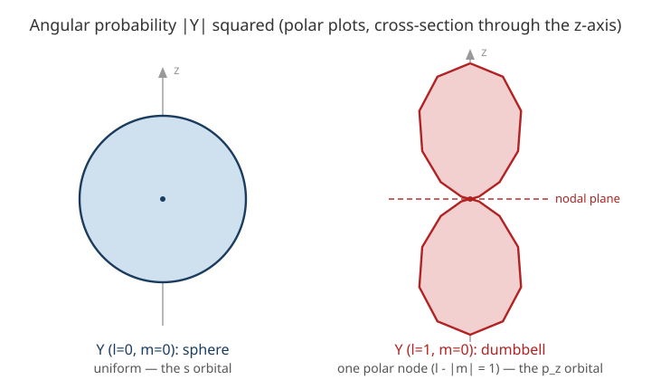

# Quantum Mechanics · Lesson 4.3: Spherical harmonics and the rigid rotor

> ⏱ ~15 min · Module 4: Three dimensions, angular momentum, and spin · Builds on: [4.1 The Schrödinger equation in 3D](#/lesson/quantum-mechanics/04-01-schrodinger-3d.md), [4.2 Angular momentum: the operator algebra](#/lesson/quantum-mechanics/04-02-angular-momentum-algebra.md) · Unlocks: the hydrogen atom (4.4), addition of angular momenta (4.6)

## Why this matters

In [4.1](#/lesson/quantum-mechanics/04-01-schrodinger-3d.md) we split any central-potential problem into a radial piece and an angular piece — and the angular piece **does not know what the potential is**. Solve it once and you own the angular structure of *every* central-force problem in physics: every hydrogen orbital, every atomic shell, every rotational spectrum. Those universal angular solutions are the **spherical harmonics** $Y_\ell^m(\theta,\phi)$. In [4.2](#/lesson/quantum-mechanics/04-02-angular-momentum-algebra.md) we learned *abstractly*, from commutators alone, that $\hat L^2$ and $\hat L_z$ have eigenvalues $\hbar^2\ell(\ell+1)$ and $\hbar m$. This lesson gives those abstract labels a **face**: the actual functions on the sphere, the orbital shapes chemists draw, and — for a molecule that can only tumble — a directly measurable microwave spectrum.

## The idea

$\hat L^2$ and $\hat L_z$ are built entirely from the angles $\theta$ (polar, measured from the $z$-axis) and $\phi$ (azimuthal, around the equator) — no radius appears. So their eigenfunctions are fixed patterns painted on the surface of a sphere. Think of the modes of a drumhead, but wrapped onto a sphere instead of a disk: each mode is labeled by how many times it wiggles.

Two numbers name the mode. The integer $m$ counts how the phase **winds around the equator** — $e^{im\phi}$ goes through $m$ full turns as you circle the $z$-axis. The integer $\ell$ measures the **total** amount of wiggle, pole to pole and around. $\ell=0$ is the featureless mode (a uniform glow over the whole sphere); crank $\ell$ up and you get ever more nodal lines slicing the sphere into alternating-sign patches. That's the entire content of $Y_\ell^m$: a stack of standing waves on a sphere, indexed by total wiggle $\ell$ and equatorial winding $m$.

## The formal version

In spherical coordinates the two operators are pure angular derivatives:

$$\hat L_z = -i\hbar\,\frac{\partial}{\partial\phi},\qquad \hat L^2 = -\hbar^2\left[\frac{1}{\sin\theta}\frac{\partial}{\partial\theta}\!\left(\sin\theta\,\frac{\partial}{\partial\theta}\right) + \frac{1}{\sin^2\theta}\frac{\partial^2}{\partial\phi^2}\right].$$

*In words:* $\hat L_z$ just differentiates the equatorial angle; $\hat L^2$ is (minus) the angular part of the 3D Laplacian — the "curvature on the sphere" operator.

Their simultaneous eigenfunctions are the **spherical harmonics**

$$\boxed{\,Y_\ell^m(\theta,\phi) = N_{\ell m}\,P_\ell^{m}(\cos\theta)\,e^{im\phi}\,},\qquad N_{\ell m} = \sqrt{\frac{2\ell+1}{4\pi}\,\frac{(\ell-|m|)!}{(\ell+|m|)!}}\, ,$$

where $P_\ell^m$ is the **associated Legendre function** (a fixed polynomial-in-$\cos\theta$ times a power of $\sin\theta$) and $N_{\ell m}$ is the normalization constant. They satisfy

$$\hat L^2\,Y_\ell^m = \hbar^2\,\ell(\ell+1)\,Y_\ell^m,\qquad \hat L_z\,Y_\ell^m = \hbar m\,Y_\ell^m,$$

with $\ell = 0,1,2,\dots$ and $m = -\ell,-\ell+1,\dots,+\ell$ — **exactly** the quantization the algebra of [4.2](#/lesson/quantum-mechanics/04-02-angular-momentum-algebra.md) forced. *In words:* the abstract $|\ell,m\rangle$ kets, written as functions of angle, *are* the spherical harmonics.

**The lowest few** (the ones you must recognize on sight):

$$Y_0^0 = \frac{1}{\sqrt{4\pi}},\qquad Y_1^0 = \sqrt{\frac{3}{4\pi}}\,\cos\theta,\qquad Y_1^{\pm 1} = \mp\sqrt{\frac{3}{8\pi}}\,\sin\theta\,e^{\pm i\phi}.$$

**Orthonormality over the sphere.** With solid-angle element $d\Omega = \sin\theta\,d\theta\,d\phi$,

$$\int Y_\ell^m\,\big(Y_{\ell'}^{m'}\big)^{*}\,d\Omega = \int_0^{2\pi}\!\!\int_0^\pi Y_\ell^m\big(Y_{\ell'}^{m'}\big)^{*}\sin\theta\,d\theta\,d\phi = \delta_{\ell\ell'}\,\delta_{mm'}.$$

*In words:* the $Y_\ell^m$ form a complete orthonormal basis for functions on the sphere — the Fourier basis of the sphere. Any angular function expands in them.

**Angular nodes** (where $Y_\ell^m = 0$, the pattern's zero-lines):

- $|m|$ **azimuthal** nodes — planes containing the $z$-axis, from the $e^{im\phi}$ factor changing sign.
- $\ell - |m|$ **polar** nodes — cones of constant $\theta$, from the zeros of $P_\ell^m(\cos\theta)$.

Total $\ell$ nodal lines. This is the origin of orbital shapes: $\ell=0$ (**s**, no nodes, a sphere), $\ell=1$ (**p**, one node), $\ell=2$ (**d**, two nodes).

**The rigid rotor.** Model a diatomic molecule as two atoms locked a fixed distance apart, free to tumble but not stretch. There is no potential, and the whole energy is rotational kinetic energy, which classically is $L^2/2I$ with $I$ the moment of inertia. Quantize by promoting $L^2\to\hat L^2$:

$$\hat H = \frac{\hat L^2}{2I}\quad\Longrightarrow\quad \boxed{\,E_\ell = \frac{\hbar^2\,\ell(\ell+1)}{2I}\,},\quad \text{each level }(2\ell+1)\text{-fold degenerate.}$$

*In words:* the rotor's energy eigenstates are just the spherical harmonics, and its spectrum is the $\ell(\ell+1)$ ladder. The degeneracy $2\ell+1$ counts the allowed $m$ values (orientations of the rotation) — all the same energy because empty space has no preferred axis.

## Picture

The distance from the origin is the angular probability density in that direction. $Y_0^0$ points everywhere equally (sphere, the s orbital). $Y_1^0\propto\cos\theta$ is fat along $\pm z$ and vanishes on the equator — the $p_z$ dumbbell, its single polar node the flat plane $\theta=\tfrac{\pi}{2}$.

## Worked examples

**Example 1 (mechanical — verify an eigenfunction, phase and all).** Confirm $Y_1^{1}\propto \sin\theta\,e^{i\phi}$ is a simultaneous eigenfunction. Drop the constant and write $f=\sin\theta\,e^{i\phi}$.

*$\hat L_z$:* $\displaystyle \hat L_z f = -i\hbar\,\frac{\partial}{\partial\phi}\big(\sin\theta\,e^{i\phi}\big) = -i\hbar\,(i)\,f = \hbar f$, so $m=1$. ✓

*$\hat L^2$:* work the two pieces. The $\theta$-piece: $\partial_\theta f = \cos\theta\,e^{i\phi}$, then $\sin\theta\,\partial_\theta f = \sin\theta\cos\theta\,e^{i\phi}$, and $\partial_\theta(\sin\theta\cos\theta\,e^{i\phi}) = (\cos^2\theta-\sin^2\theta)e^{i\phi}$; dividing by $\sin\theta$ gives $\frac{\cos^2\theta-\sin^2\theta}{\sin\theta}e^{i\phi}$. The $\phi$-piece: $\partial_\phi^2 f = -\sin\theta\,e^{i\phi}$, so $\frac{1}{\sin^2\theta}\partial_\phi^2 f = -\frac{1}{\sin\theta}e^{i\phi}$. Add them:

$$\frac{\cos^2\theta-\sin^2\theta-1}{\sin\theta}e^{i\phi} = \frac{-2\sin^2\theta}{\sin\theta}e^{i\phi} = -2\sin\theta\,e^{i\phi} = -2f,$$

using $\cos^2\theta-1=-\sin^2\theta$. Multiply by $-\hbar^2$: $\hat L^2 f = 2\hbar^2 f = \hbar^2\,\ell(\ell+1)f$ with $\ell=1$. ✓ Both eigenvalues land exactly where [4.2](#/lesson/quantum-mechanics/04-02-angular-momentum-algebra.md) predicted.

**Example 2 (why you'd care — the CO microwave line).** Carbon monoxide has moment of inertia $I \approx 1.46\times10^{-46}\ \mathrm{kg\,m^2}$. A photon absorbed on the $\ell=0\to\ell=1$ transition carries

$$\Delta E = E_1 - E_0 = \frac{\hbar^2}{2I}\big[1(2) - 0\big] = \frac{\hbar^2}{I} = \frac{(1.055\times10^{-34})^2}{1.46\times10^{-46}} \approx 7.6\times10^{-23}\ \mathrm{J}.$$

Its frequency is $\nu = \Delta E/h = 7.6\times10^{-23}/6.63\times10^{-34} \approx 1.15\times10^{11}\ \mathrm{Hz} = 115\ \mathrm{GHz}$ — squarely in the microwave band, and indeed CO's $J{=}0\to1$ line sits at $115.3$ GHz, the workhorse spectral line of radio astronomy for mapping molecular gas. The quantized angular momentum ladder is something you can literally tune a receiver to.

## Watch out

- **You might think $Y_\ell^m$ is the wavefunction.** It's only the *angular* factor: the full state is $\psi = R(r)\,Y_\ell^m(\theta,\phi)$. $|Y_\ell^m|^2$ is the angular probability density — the shape you see after integrating out the radius.
- **You might think $Y_1^{\pm1}$ is a dumbbell along $x$ or $y$.** Each $Y_1^{\pm1}$ has $|Y_1^{\pm1}|^2\propto\sin^2\theta$: a *donut* around the $z$-axis, not a lobe. The familiar real $p_x,p_y$ dumbbells are **combinations** $\frac{1}{\sqrt2}(Y_1^{-1}\mp Y_1^{1})$. Only $Y_1^0=p_z$ is already real and lobed.
- **You might expect a zero-point energy like the oscillator.** The rotor's ground state is $\ell=0$ with $E_0 = 0$ — a genuinely non-rotating, spherically symmetric state. Rotational energy starts from zero; there is nothing forcing it to tumble.
- **Rotational lines are equally spaced, but levels are not.** $E_\ell\propto\ell(\ell+1)$ spreads out quadratically, yet the *transition* energies $\ell\to\ell+1$ grow linearly, so the absorption lines come out evenly spaced by $\hbar^2/I$ — the fingerprint of a rigid rotor in a spectrum.

## One-liner

> The spherical harmonics are the standing waves of the sphere — $Y_\ell^m = (\text{normalization})\,P_\ell^m(\cos\theta)\,e^{im\phi}$ with $\ell$ nodal lines — and feeding $\hat L^2$ to a tumbling molecule turns them into an evenly spaced microwave ladder $E_\ell = \hbar^2\ell(\ell+1)/2I$.

## Problems

**P1 (🟢)** Take $Y_1^0 = \sqrt{\tfrac{3}{4\pi}}\cos\theta$. Show directly that it is an eigenfunction of $\hat L_z$ and read off its $m$. Then state (with a one-line reason) its $\hat L^2$ eigenvalue.

**P2 (🟡)** A diatomic molecule has moment of inertia $I = 2.64\times10^{-47}\ \mathrm{kg\,m^2}$ (roughly HCl). (a) Show the general $\ell\to\ell+1$ transition energy is $\Delta E_\ell = \hbar^2(\ell+1)/I$. (b) Compute the photon **frequency** of the $\ell=0\to1$ line. (c) What is the spacing (in frequency) between adjacent rotational lines? *(Connects to `em-refresher`: this is the microwave photon a molecule emits/absorbs.)*

**P3 (🔴, optional)** With $Y_0^0=\tfrac{1}{\sqrt{4\pi}}$ and $Y_1^0=\sqrt{\tfrac{3}{4\pi}}\cos\theta$: (a) confirm they are orthogonal, $\int Y_1^0\,(Y_0^0)^{*}\,d\Omega = 0$. (b) Verify $Y_1^0$ is correctly normalized, i.e. $\int |Y_1^0|^2\,d\Omega = 1$ — showing the constant $\sqrt{3/4\pi}$ is exactly what normalization demands.

Solutions

**P1** $Y_1^0$ has no $\phi$-dependence, so $\hat L_z Y_1^0 = -i\hbar\,\partial_\phi\big(\sqrt{\tfrac{3}{4\pi}}\cos\theta\big) = 0 = \hbar\cdot 0\cdot Y_1^0$. It's an eigenfunction with $m=0$. ✓ For $\hat L^2$: only the $\theta$-piece acts (no $\phi$). With $f=\cos\theta$: $\partial_\theta f = -\sin\theta$, $\sin\theta\,\partial_\theta f = -\sin^2\theta$, $\partial_\theta(-\sin^2\theta) = -2\sin\theta\cos\theta$, and dividing by $\sin\theta$ gives $-2\cos\theta$; times $-\hbar^2$ yields $\hat L^2 Y_1^0 = 2\hbar^2 Y_1^0$. So the eigenvalue is $\hbar^2\ell(\ell+1) = 2\hbar^2$ with $\ell = 1$ — consistent with $|m|=0\le\ell=1$.

**P2** (a) $\displaystyle \Delta E_\ell = E_{\ell+1}-E_\ell = \frac{\hbar^2}{2I}\big[(\ell+1)(\ell+2) - \ell(\ell+1)\big] = \frac{\hbar^2}{2I}(\ell+1)\big[(\ell+2)-\ell\big] = \frac{\hbar^2(\ell+1)}{I}.$

(b) The $\ell=0\to1$ line is $\Delta E_0 = \hbar^2/I = \dfrac{(1.055\times10^{-34})^2}{2.64\times10^{-47}} = \dfrac{1.113\times10^{-68}}{2.64\times10^{-47}} \approx 4.21\times10^{-22}\ \mathrm{J}.$ Then $\nu = \Delta E_0/h = \dfrac{4.21\times10^{-22}}{6.63\times10^{-34}} \approx 6.4\times10^{11}\ \mathrm{Hz} \approx 636\ \mathrm{GHz}.$

(c) Consecutive line frequencies are $\nu_\ell = \Delta E_\ell/h = \hbar^2(\ell+1)/(Ih)$, so the spacing is $\nu_{\ell+1}-\nu_\ell = \hbar^2/(Ih)$ — a constant, equal to the $\ell=0\to1$ frequency itself, $\approx 636\ \mathrm{GHz}$. Evenly spaced lines: the rigid-rotor signature.

**P3** (a) $\displaystyle \int Y_1^0(Y_0^0)^{*}\,d\Omega = \sqrt{\tfrac{3}{4\pi}}\cdot\tfrac{1}{\sqrt{4\pi}}\int_0^{2\pi}\!\!\int_0^\pi \cos\theta\,\sin\theta\,d\theta\,d\phi.$ The $\phi$-integral gives $2\pi$; the $\theta$-integral is $\int_0^\pi\cos\theta\sin\theta\,d\theta = \big[\tfrac12\sin^2\theta\big]_0^\pi = 0.$ So the whole thing is $0$. ✓ (Orthogonality is automatic here since the two functions have different $\ell$.)

(b) $\displaystyle \int|Y_1^0|^2\,d\Omega = \frac{3}{4\pi}\int_0^{2\pi}\!\!\int_0^\pi \cos^2\theta\,\sin\theta\,d\theta\,d\phi = \frac{3}{4\pi}\cdot 2\pi\int_0^\pi\cos^2\theta\sin\theta\,d\theta.$ Substitute $u=\cos\theta$, $du=-\sin\theta\,d\theta$: $\int_0^\pi\cos^2\theta\sin\theta\,d\theta = \int_{-1}^{1}u^2\,du = \tfrac23.$ Hence $\int|Y_1^0|^2 d\Omega = \frac{3}{4\pi}\cdot 2\pi\cdot\frac23 = \frac{3}{4\pi}\cdot\frac{4\pi}{3} = 1.$ ✓ The constant $\sqrt{3/4\pi}$ was chosen precisely so the $\tfrac{4\pi}{3}$ from the angular integral cancels.

## Flashback

**From Lesson 4.2 (Angular momentum: the operator algebra):** The ladder operators act as $\hat L_\pm\,|\ell,m\rangle = \hbar\sqrt{\ell(\ell+1) - m(m\pm1)}\;|\ell,m\pm1\rangle$. For the $\ell=1$ multiplet: (a) evaluate $\hat L_+|1,1\rangle$ and explain why the answer had to be that; (b) evaluate $\hat L_-|1,1\rangle$.

Solution

(a) With $\ell=1,\,m=1$: the coefficient is $\hbar\sqrt{1(2) - 1(1+1)} = \hbar\sqrt{2-2} = 0$, so $\hat L_+|1,1\rangle = 0$. It **had** to vanish because $|1,1\rangle$ is the top of the ladder ($m=\ell$ is the maximum allowed); raising past it would produce a forbidden $m=2>\ell$ state, so the algebra kills it. This "the ladder must terminate" condition is exactly what quantizes $\ell$ in the first place.

(b) $\hat L_-|1,1\rangle = \hbar\sqrt{1(2) - 1(1-1)}\;|1,0\rangle = \hbar\sqrt{2-0}\;|1,0\rangle = \sqrt2\,\hbar\,|1,0\rangle.$ In position space this is the statement that lowering $Y_1^1\propto\sin\theta\,e^{i\phi}$ produces $Y_1^0\propto\cos\theta$ (up to the $\sqrt2\,\hbar$ factor) — the algebra and the functions are the same object in two languages.

## Connections

- **Backward:** [4.2](#/lesson/quantum-mechanics/04-02-angular-momentum-algebra.md) derived the eigenvalues $\hbar^2\ell(\ell+1)$ and $\hbar m$ and the integer quantization from commutators alone; this lesson exhibits the *actual functions* carrying those labels. [4.1](#/lesson/quantum-mechanics/04-01-schrodinger-3d.md)'s separation of variables produced the angular equation the $Y_\ell^m$ solve.
- **Forward:** [4.4](#/lesson/quantum-mechanics/04-04-hydrogen-atom.md) tackles hydrogen — the angular half is already finished here, so only the radial equation $R(r)$ remains, and $\psi_{n\ell m}=R_{n\ell}(r)Y_\ell^m(\theta,\phi)$. The $Y_\ell^m$ also serve as the angular-momentum basis that [4.6](#/lesson/quantum-mechanics/04-06-addition-angular-momenta.md) combines.
- **Sideways (EM & classical waves):** the same angular Laplacian and its $Y_\ell^m$ eigenfunctions run the **multipole expansion** in `em-refresher` and every wave equation on a sphere — spherical harmonics are the Fourier analysis of the sphere. And the rotor Hamiltonian $\hat L^2/2I$ is the direct quantization of the classical rotational kinetic energy $L^2/2I$ from `analytical-mechanics`.
