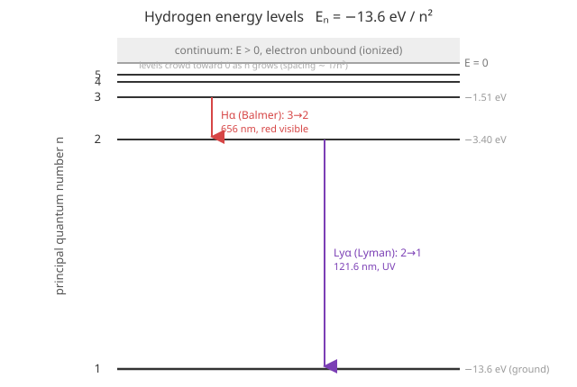

# Quantum Mechanics · Lesson 4.4: The hydrogen atom

> ⏱ ~15 min · Module 4: Three dimensions, angular momentum, and spin · Builds on: [4.1 The Schrödinger equation in three dimensions](#/lesson/quantum-mechanics/04-01-schrodinger-3d.md), [4.2 Angular momentum: the operator algebra](#/lesson/quantum-mechanics/04-02-angular-momentum-algebra.md), [4.3 Spherical harmonics and the rigid rotor](#/lesson/quantum-mechanics/04-03-spherical-harmonics-rigid-rotor.md) · Unlocks: spin and Stern–Gerlach (4.5), then fine structure via perturbation theory (Module 6)

## Why this matters

This is the problem quantum mechanics was invented to solve. Classically, an electron orbiting a proton radiates energy and spirals into the nucleus in about $10^{-11}$ s — matter should not exist. Quantize the same $1/r$ Coulomb attraction and out drops a **discrete** spectrum whose lowest state cannot decay, plus a set of spectral-line wavelengths that match the hydrogen lamp on a lab bench to five digits. It is the first-principles derivation of $-13.6\ \text{eV}$, of the Bohr radius, and of the periodic table's opening move. Every atom afterward is a correction to this.

## The idea

We already did all the hard geometry in 4.1–4.3. A central potential separates: $\psi(r,\theta,\phi) = R(r)\,Y_\ell^m(\theta,\phi)$, and the angular factor $Y_\ell^m$ — the spherical harmonics — is *universal*, the same for any $V$ that depends only on $r$. **The only thing an actual force law decides is the radial function $R(r)$ and the energies.**

So the hydrogen atom is one radial equation with one specific potential plugged in: the Coulomb attraction $V(r) = -e^2/(4\pi\epsilon_0 r)$. Solve that one ODE and you get the whole atom.

Two features make hydrogen special. First, the $1/r$ shape produces a bound-state energy that depends **only on a single integer $n$** — not on how much angular momentum the electron carries. States with wildly different orbital shapes ($\ell = 0$ spherical, $\ell = 2$ cloverleaf) sit at *exactly* the same energy. That is a coincidence for any other potential and a symmetry for this one. Second, the spectrum is a ladder of levels bunching up toward zero, and every jump between rungs is a photon of a definite color — the spectral lines that started the whole story.

## The formal version

**The Coulomb potential.** A proton (charge $+e$) attracts the electron (charge $-e$):
$$V(r) = -\frac{e^2}{4\pi\epsilon_0\, r}.$$
*In words:* energy drops without bound as the electron approaches — a $1/r$ well, negative and deepening toward the origin. (We treat the proton as fixed; strictly, $m$ is the electron–proton reduced mass, a $0.05\%$ correction.)

**The radial equation** (from 4.1, with $u(r) \equiv r\,R(r)$):
$$-\frac{\hbar^2}{2m}\frac{d^2u}{dr^2} + \underbrace{\left[-\frac{e^2}{4\pi\epsilon_0\,r} + \frac{\hbar^2\,\ell(\ell+1)}{2m\,r^2}\right]}_{V_{\text{eff}}(r)}u = E\,u.$$
*In words:* a 1D Schrödinger equation on the half-line $r\ge 0$, in an **effective potential** = Coulomb well + a repulsive centrifugal barrier $\propto \ell(\ell+1)/r^2$ that pushes higher-$\ell$ electrons outward.

**Nondimensionalize.** For a bound state $E<0$, the two natural scales are a length and an energy. The length is the **Bohr radius**
$$a = \frac{4\pi\epsilon_0\hbar^2}{m e^2} \approx 0.529\ \text{Å} = 0.529\times10^{-10}\ \text{m}.$$
*In words:* the size of the atom, built purely from constants. Measuring $r$ in units of $a$ strips the equation of clutter.

**Asymptotics + polynomial.** As $r\to\infty$ the potential terms vanish and $u''\approx (2m|E|/\hbar^2)u$, forcing $u\sim e^{-r/(na)}$ decay. As $r\to 0$ the centrifugal term dominates and $u\sim r^{\ell+1}$. Peeling both off, $u(r) = r^{\ell+1}e^{-r/na}\,v(r)$, and $v$ must solve a polynomial-terminating recursion — the **associated Laguerre polynomials** $L_{n-\ell-1}^{2\ell+1}$. Termination (needed for normalizability) is exactly what quantizes the energy. The full radial function is
$$R_{n\ell}(r) = N_{n\ell}\left(\frac{r}{a}\right)^{\ell} e^{-r/na}\, L_{n-\ell-1}^{2\ell+1}\!\left(\frac{2r}{na}\right),$$
with $N_{n\ell}$ a normalization constant. *In words:* every hydrogen orbital is (power of $r$) × (decaying exponential) × (a specific finite polynomial).

**The energy spectrum.** Termination fixes
$$\boxed{\,E_n = -\left[\frac{m}{2\hbar^2}\left(\frac{e^2}{4\pi\epsilon_0}\right)^{2}\right]\frac{1}{n^2} = -\frac{13.6\ \text{eV}}{n^2},\qquad n = 1,2,3,\dots}$$
*In words:* the bound energies depend **only** on the principal quantum number $n$ — one integer sets the energy, and the level spacing shrinks like $1/n^3$, crowding toward the ionization threshold $E=0$. The bracket is one Rydberg, $13.6\ \text{eV}$.

**The three quantum numbers.** A hydrogen stationary state $\psi_{n\ell m}$ carries
$$n = 1,2,3,\dots \quad(\text{energy}),\qquad \ell = 0,1,\dots,n-1 \quad(\hat L^2\to\hbar^2\ell(\ell+1)),\qquad m = -\ell,\dots,+\ell \quad(\hat L_z\to\hbar m).$$
*In words:* $n$ caps how much angular momentum fits ($\ell < n$), and for each $\ell$ there are $2\ell+1$ orientations $m$. The energy ignores $\ell$ and $m$ entirely.

**Degeneracy.** Since $E_n$ is blind to $\ell$ and $m$, level $n$ holds
$$\sum_{\ell=0}^{n-1}(2\ell+1) = n^2 \quad\text{degenerate states.}$$
*In words:* the $2\ell+1$ from $m$ is the ordinary rotational degeneracy you'd get for *any* central potential; the extra collapse of all the different $\ell$'s onto one energy is the **"accidental" degeneracy** unique to $1/r$. It is not an accident — it reflects a hidden $SO(4)$ symmetry (a conserved Laplace–Runge–Lenz vector, the quantum echo of the fact that classical Kepler ellipses don't precess). Any deviation from exact $1/r$ — relativistic corrections, other electrons — lifts it and splits the level.

**The ground state.** For $n=1$ only $\ell=m=0$ survives ($L_0^1$ is a constant, $Y_0^0=1/\sqrt{4\pi}$):
$$\psi_{100}(r) = \frac{1}{\sqrt{\pi a^3}}\,e^{-r/a}.$$
*In words:* a spherically symmetric exponential cloud of scale $a$, no nodes, no angular structure — the smallest, tightest, lowest-energy state.

**Spectral lines (the Rydberg formula).** An electron dropping $n_i\to n_f$ emits a photon of energy $E_{n_i}-E_{n_f}$, so
$$\frac{1}{\lambda} = R_\infty\left(\frac{1}{n_f^2} - \frac{1}{n_i^2}\right),\qquad R_\infty = \frac{13.6\ \text{eV}}{hc}\approx 1.097\times10^{7}\ \text{m}^{-1}.$$
*In words:* every observed hydrogen line is a difference of two $1/n^2$ rungs. $n_f=1$ is the **Lyman** series (ultraviolet), $n_f=2$ the **Balmer** series (the visible lines that first revealed the pattern).

> **Not modeled here:** electron spin, and the fine-structure splitting from relativity and spin–orbit coupling. Those turn each $E_n$ into a cluster of nearby levels — perturbation theory in Module 6. This lesson is the exact, spinless, nonrelativistic backbone they correct.

## Picture

The rungs pile up toward $E=0$; a downward jump is an emitted photon whose wavelength is set by the gap. Balmer-$\alpha$ (3→2) is the familiar red line of a hydrogen lamp; Lyman-$\alpha$ (2→1) is a deep-UV line.

## Worked examples

**Example 1 (the spectrum in numbers).** With $E_n = -13.6/n^2\ \text{eV}$:
$$E_1 = -13.6\ \text{eV},\quad E_2 = -3.40\ \text{eV},\quad E_3 = -1.51\ \text{eV},\quad E_\infty = 0.$$
The ionization energy of ground-state hydrogen is therefore $0-E_1 = 13.6\ \text{eV}$ — the energy to free the electron. A $3\to2$ photon carries $E_3 - E_2 = -1.51-(-3.40)=1.89\ \text{eV}$; using $hc = 1240\ \text{eV·nm}$, $\lambda = 1240/1.89 \approx 656\ \text{nm}$, the red Balmer-$\alpha$ line.

**Example 2 (why $\ell < n$ matters — the shell count).** How many *distinct spatial* states share the energy $E_2$? Level $n=2$ allows $\ell=0$ (one $m=0$ state) and $\ell=1$ ($m=-1,0,1$, three states): $1+3 = 4 = 2^2$. These are the one $2s$ orbital and three $2p$ orbitals of chemistry — all at $-3.40\ \text{eV}$ in hydrogen, even though they look nothing alike. (Include the two spin orientations of Module 4.5 and it becomes $2n^2 = 8$, the size of the second row of the periodic table.)

## Watch out

- You might think higher angular momentum costs more energy, as it does for a rigid rotor (4.3) or a generic central well. **For hydrogen it doesn't** — $E$ depends on $n$ alone. The $\ell$-independence is the special $1/r$ accident; don't carry it to other potentials.
- You might read $E_n<0$ as "impossible." Negative just means **bound**: you must *add* energy to reach the $E=0$ free-electron threshold. The zero of energy is the ionized state, deliberately.
- You might conflate $n$ with $\ell$. The constraint is $\ell \le n-1$, strict: there is no $1p$, no $2d$. And $n$ is *not* the number of angular nodes — it counts total structure, with radial nodes $= n-\ell-1$.
- You might expect the most probable radius to equal $\langle r\rangle$. For the ground state they differ ($a$ vs $\tfrac32 a$) because the radial distribution $r^2|R|^2$ is skewed — see P2 and P3.

## One-liner

> Plug the $1/r$ Coulomb well into the radial equation and Laguerre termination hands you $E_n=-13.6\,\text{eV}/n^2$ — energy set by $n$ alone, each level $n^2$-fold degenerate, its jumps the hydrogen spectral lines.

## Problems

**P1 (🟢)** Compute $E_1$, $E_2$, $E_3$ for hydrogen. Then find the energy and wavelength of the Lyman-$\alpha$ photon (the $2\to1$ transition). Use $hc = 1240\ \text{eV·nm}$.

**P2 (🟡)** Verify that $\psi_{100} = \dfrac{1}{\sqrt{\pi a^3}}\,e^{-r/a}$ solves the radial equation with $\ell=0$, and read off its energy. (Use $u=rR$, and the identity $\hbar^2/2m = \tfrac12 a\,k$ with $k\equiv e^2/4\pi\epsilon_0$, which follows from the definition of $a$.) Then compute the mean radius $\langle r\rangle$ in the ground state.

**P3 (🔴, optional)** List all the states of the $n=3$ level by $(\ell,m)$ and confirm the degeneracy is $9=3^2$ (ignore spin). Then find the **most probable** radius of the ground-state electron by maximizing the radial probability density $P(r)=r^2|R_{10}(r)|^2$, and compare it to $\langle r\rangle$ from P2.

Solutions

**P1** Directly from $E_n=-13.6/n^2\ \text{eV}$:
$$E_1=-13.6\ \text{eV},\qquad E_2=-\tfrac{13.6}{4}=-3.40\ \text{eV},\qquad E_3=-\tfrac{13.6}{9}=-1.51\ \text{eV}.$$
The $2\to1$ photon carries the energy released:
$$\Delta E = E_2-E_1 = -3.40-(-13.6)=10.2\ \text{eV}.$$
Wavelength: $\lambda = \dfrac{hc}{\Delta E}=\dfrac{1240\ \text{eV·nm}}{10.2\ \text{eV}}\approx 121.6\ \text{nm}$ — deep ultraviolet, the Lyman-$\alpha$ line. ✓

**P2** With $\ell=0$, $R = \dfrac{2}{a^{3/2}}e^{-r/a}$ (so that $\psi_{100}=R\,Y_0^0=\tfrac{1}{\sqrt{\pi a^3}}e^{-r/a}$), and $u=rR = C\,r\,e^{-r/a}$ with $C=2/a^{3/2}$. Differentiate:
$$u' = C\,e^{-r/a}\!\left(1-\tfrac{r}{a}\right),\qquad u'' = C\,e^{-r/a}\!\left(-\tfrac{2}{a}+\tfrac{r}{a^2}\right).$$
The $\ell=0$ radial equation is $-\tfrac{\hbar^2}{2m}u'' - \tfrac{k}{r}u = E\,u$. Insert $\tfrac{\hbar^2}{2m}=\tfrac12 a k$:
$$-\tfrac12 a k\,C e^{-r/a}\!\left(-\tfrac{2}{a}+\tfrac{r}{a^2}\right) - \tfrac{k}{r}\,C r e^{-r/a}
= C e^{-r/a}\!\left(k - \tfrac{k r}{2a}\right) - kC e^{-r/a}.$$
The $k$ terms cancel, leaving $-\dfrac{k}{2a}\,C r e^{-r/a} = -\dfrac{k}{2a}\,u$. So $u$ is an eigenfunction with
$$E = -\frac{k}{2a} = -\frac{e^2}{4\pi\epsilon_0}\cdot\frac{1}{2a} = -\frac{m}{2\hbar^2}\left(\frac{e^2}{4\pi\epsilon_0}\right)^{2} = -13.6\ \text{eV}. \checkmark$$
(using $1/a = mk/\hbar^2$). Mean radius — angular part integrates to 1, so
$$\langle r\rangle = \int_0^\infty r\,|R|^2 r^2\,dr = \frac{4}{a^3}\int_0^\infty r^3 e^{-2r/a}\,dr = \frac{4}{a^3}\cdot\frac{3!}{(2/a)^4}=\frac{4}{a^3}\cdot\frac{3a^4}{8}=\frac{3a}{2}.$$
So $\langle r\rangle = \tfrac32 a \approx 0.79\ \text{Å}$.

**P3** The $n=3$ states, using $\ell=0,\dots,n-1$ and $m=-\ell,\dots,\ell$:
- $\ell=0$: $m=0$ → **1** state ($3s$),
- $\ell=1$: $m=-1,0,1$ → **3** states ($3p$),
- $\ell=2$: $m=-2,-1,0,1,2$ → **5** states ($3d$).

Total $1+3+5 = 9 = 3^2$. ✓ (With spin, $2\times9=18$.)

Most probable radius: maximize $P(r)=r^2|R_{10}|^2 \propto r^2 e^{-2r/a}$. Set the derivative to zero:
$$\frac{d}{dr}\!\left(r^2 e^{-2r/a}\right) = \left(2r - \tfrac{2}{a}r^2\right)e^{-2r/a} = 2r\left(1-\tfrac{r}{a}\right)e^{-2r/a}=0 \;\Rightarrow\; r = a.$$
The most probable radius is exactly the Bohr radius $a\approx 0.529\ \text{Å}$ — the peak of the radial distribution — whereas the **mean** is $\tfrac32 a$. They differ because $r^2 e^{-2r/a}$ has a long tail to large $r$ that drags the average past the peak. Both facts come from the same $|\psi_{100}|^2$; multiplying by the shell volume $4\pi r^2$ is what turns a density peaked at $r=0$ into a probability peaked at $r=a$.

## Flashback

**From Lesson 4.2 (Angular momentum: the operator algebra):** A hydrogen $3d$ electron has $\ell=2$. Without looking anything up, give (a) the eigenvalue of $\hat L^2$ and hence the magnitude $|\mathbf L|$, and (b) the full list of allowed $\hat L_z$ eigenvalues. Why can't $L_z$ ever equal $|\mathbf L|$?

Solution

(a) $\hat L^2\,Y_\ell^m = \hbar^2\ell(\ell+1)\,Y_\ell^m$, so with $\ell=2$ the eigenvalue is $\hbar^2\cdot 2\cdot 3 = 6\hbar^2$, giving magnitude $|\mathbf L| = \sqrt{6}\,\hbar \approx 2.449\,\hbar$.

(b) $\hat L_z$ eigenvalues are $m\hbar$ for $m=-2,-1,0,1,2$: that is $-2\hbar,\,-\hbar,\,0,\,+\hbar,\,+2\hbar$ — five values, the $2\ell+1$ orientations.

The maximum $L_z = 2\hbar$ is strictly less than $|\mathbf L|=\sqrt6\,\hbar$. If they were equal the vector would point exactly along $z$, pinning $L_x=L_y=0$ — but $[\hat L_x,\hat L_y]=i\hbar\hat L_z\neq0$ forbids all three components being sharp at once. The angular-momentum vector always keeps some "tilt," never fully aligning with any axis. This is the same non-commutation that, back in 4.2, fixed the spectrum in the first place.

## Connections

- **Backward:** this is [4.1](#/lesson/quantum-mechanics/04-01-schrodinger-3d.md)'s radial equation with one specific $V(r)$, wearing [4.3](#/lesson/quantum-mechanics/04-03-spherical-harmonics-rigid-rotor.md)'s spherical harmonics as its angular factor; the $\ell,m$ labels and $2\ell+1$ degeneracy are [4.2](#/lesson/quantum-mechanics/04-02-angular-momentum-algebra.md)'s algebra unchanged. The Laguerre-termination trick is the same "series must terminate to stay normalizable" move that quantized the harmonic oscillator analytically in 3.1.
- **Forward:** [4.5](#/lesson/quantum-mechanics/04-05-spin-pauli-stern-gerlach.md) adds the electron's spin, doubling each level's count to $2n^2$; **Boss Problem 4** builds the $n=2$ state list and couples $\ell=1$ to spin. Module 6's perturbation theory then lifts the accidental degeneracy into fine structure — the corrections this exact solution is the starting point for.
- **Sideways (classical mechanics):** the $\ell$-degeneracy comes from the conserved Laplace–Runge–Lenz vector, the same quantity that keeps classical Kepler orbits from precessing — the $1/r$ potential's extra symmetry survives quantization. The $r^2|R|^2$ vs $|\psi|^2$ distinction in P3 is the radial-density Jacobian $4\pi r^2$, the exact same shell-volume factor that appears whenever a 3D density is reduced to a distribution over radius (e.g. the Maxwell–Boltzmann speed distribution in stat mech).
