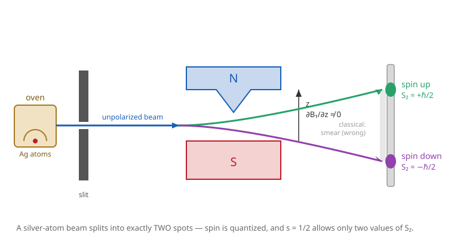

# Quantum Mechanics · Lesson 4.5: Spin-1/2, Pauli matrices, and Stern–Gerlach

> ⏱ ~15 min · Module 4: Three dimensions, angular momentum, and spin · Builds on: [4.2 Angular momentum: the operator algebra](#/lesson/quantum-mechanics/04-02-angular-momentum-algebra.md), [1.5 Measurement, collapse, and expectation values](#/lesson/quantum-mechanics/01-05-measurement-expectation-values.md) · Unlocks: 4.6 addition of angular momenta; then identical particles, entanglement, and Bell inequalities

## Why this matters

Send a beam of silver atoms through a magnet and it splits into **exactly two** spots — not a smear, not three, two. Nothing in the Schrödinger equation for a particle in space predicts this. Electrons carry an angular momentum that has nothing to do with orbiting anything: it is intrinsic, it is quantized in half-integer units, and it lives in a two-dimensional state space that no wavefunction $\psi(x)$ can hold. This is spin. It is where the periodic table's shell structure comes from, where the magnetism of matter comes from, and — cleaned up to its bare essentials — it is the **qubit** of quantum computing. It is also the simplest possible quantum system, which makes it the perfect laboratory for measurement, incompatibility, and collapse.

## The idea

In [4.2](#/lesson/quantum-mechanics/04-02-angular-momentum-algebra.md) we derived *everything* about angular momentum from one fact: the three components don't commute, $[\hat L_i,\hat L_j]=i\hbar\,\epsilon_{ijk}\hat L_k$. That derivation allowed $j$ to be any non-negative multiple of $\tfrac12$ — but orbital angular momentum $\hat L$, built from $\hat r\times\hat p$, only ever realized the **integer** values $\ell=0,1,2,\dots$ (its wavefunctions have to be single-valued on a sphere).

Spin is nature using the half-integer values the algebra always allowed. An electron has spin quantum number $s=\tfrac12$, so $\hat S_z$ has just **two** eigenvalues, $+\tfrac{\hbar}{2}$ and $-\tfrac{\hbar}{2}$ — "up" and "down." Because there are only two states, spin has no position dependence: there is no $\chi(x)$, no differential operator. The entire state space is $\mathbb{C}^2$, and every spin operator is a $2\times2$ matrix. The angular-momentum *machinery* carries over verbatim; only the arena shrinks to two dimensions. That shrinking is what makes spin both genuinely new and blessedly concrete: it's linear algebra you can do by hand.

## The formal version

**Spin operators.** $\hat S_x,\hat S_y,\hat S_z$ satisfy the *same* algebra as orbital angular momentum:

$$[\hat S_i,\hat S_j]=i\hbar\,\epsilon_{ijk}\hat S_k,\qquad \hat S^2\,\chi = \hbar^2 s(s+1)\,\chi = \tfrac34\hbar^2\,\chi\ \ (s=\tfrac12).$$

*In words:* spin components fail to commute in exactly the pattern of $\hat L$, and the total spin length is fixed forever at $s=\tfrac12$ — you can never change how much spin an electron has, only its orientation.

**Spinors.** A spin-$\tfrac12$ state is a two-component column vector, a **spinor**:

$$\chi=\begin{pmatrix}a\\ b\end{pmatrix}=a\,|{\uparrow}\rangle+b\,|{\downarrow}\rangle,\qquad |{\uparrow}\rangle=\begin{pmatrix}1\\0\end{pmatrix},\ |{\downarrow}\rangle=\begin{pmatrix}0\\1\end{pmatrix},$$

with $|a|^2+|b|^2=1$. Here $|{\uparrow}\rangle,|{\downarrow}\rangle$ are the eigenstates of $\hat S_z$ with eigenvalues $\pm\tfrac{\hbar}{2}$; $|a|^2$ is the probability of measuring $S_z=+\tfrac{\hbar}{2}$. *In words:* the two amplitudes $a,b$ are the entire description of the electron's spin.

**Pauli matrices.** Write $\hat{\mathbf S}=\tfrac{\hbar}{2}\boldsymbol{\sigma}$, where

$$\sigma_x=\begin{pmatrix}0&1\\1&0\end{pmatrix},\quad \sigma_y=\begin{pmatrix}0&-i\\ i&0\end{pmatrix},\quad \sigma_z=\begin{pmatrix}1&0\\0&-1\end{pmatrix}.$$

They are Hermitian and traceless, and obey

$$\sigma_i^2=I,\qquad \{\sigma_i,\sigma_j\}=2\delta_{ij}I,\qquad \sigma_x\sigma_y=i\sigma_z\ (\text{and cyclic}),\qquad [\sigma_i,\sigma_j]=2i\,\epsilon_{ijk}\sigma_k.$$

*In words:* squaring any Pauli matrix gives the identity (so its eigenvalues are $\pm1$); different ones anticommute; and multiplying two of them gives $i$ times the third — the same right-hand-rule cycle as cross products.

**Spin along an arbitrary axis.** For a unit vector $\hat{\mathbf n}=(\sin\theta\cos\phi,\sin\theta\sin\phi,\cos\theta)$, the component of spin along $\hat{\mathbf n}$ is $\hat S_{\mathbf n}=\hat{\mathbf S}\cdot\hat{\mathbf n}=\tfrac{\hbar}{2}\,\hat{\mathbf n}\cdot\boldsymbol\sigma$, and

$$\hat{\mathbf n}\cdot\boldsymbol\sigma=\begin{pmatrix}\cos\theta & \sin\theta\,e^{-i\phi}\\ \sin\theta\,e^{i\phi} & -\cos\theta\end{pmatrix}.$$

Its eigenvalues are $\pm1$ (so $\hat S_{\mathbf n}$ has eigenvalues $\pm\tfrac{\hbar}{2}$ — *any* axis gives the same two outcomes), with the "$+$" eigenspinor

$$|{\uparrow}\rangle_{\mathbf n}=\begin{pmatrix}\cos\tfrac{\theta}{2}\\[2pt] e^{i\phi}\sin\tfrac{\theta}{2}\end{pmatrix}.$$

*In words:* measure spin along any direction you like and you still get only two answers, $\pm\tfrac{\hbar}{2}$; the direction only changes the *probabilities*, encoded in that half-angle spinor.

**Magnetic moment and the Stern–Gerlach force.** A spin carries a magnetic moment $\boldsymbol\mu=\gamma\hat{\mathbf S}$ with gyromagnetic ratio $\gamma=-g\dfrac{e}{2m}$ ($g\approx2$ for the electron). Its energy in a field is $H=-\boldsymbol\mu\cdot\mathbf B$, and in an **inhomogeneous** field it feels a force

$$\mathbf F=\nabla(\boldsymbol\mu\cdot\mathbf B)=\mu_z\,\frac{\partial B_z}{\partial z}\,\hat{\mathbf z}\ \ (\text{for } \mathbf B\approx B_z(z)\hat{\mathbf z}).$$

*In words:* a magnet whose field *changes across the beam* pushes the atom up or down by an amount set by $\mu_z$ — and since $\mu_z\propto S_z$ takes only two values, the beam splits into two.

## Picture

Classically $\mu_z$ could point anywhere, so you'd expect a continuous vertical smear on the screen (the faint gray band). Instead you get two sharp spots: direct evidence that $S_z$ is quantized and that $s=\tfrac12$ allows exactly two values.

## Worked examples

**Example 1 (mechanical — diagonalizing $\sigma_x$).** What are the eigenstates of $\hat S_x$? Solve $\sigma_x\chi=\lambda\chi$ with $\sigma_x=\begin{pmatrix}0&1\\1&0\end{pmatrix}$. The characteristic equation is $\lambda^2-1=0$, so $\lambda=\pm1$ and $\hat S_x=\tfrac{\hbar}{2}\sigma_x$ has eigenvalues $\pm\tfrac{\hbar}{2}$ — same two answers as $\hat S_z$, just along a different axis. For $\lambda=+1$: the equation $b=a$ gives, normalized,

$$|{\uparrow}\rangle_x=\frac{1}{\sqrt2}\begin{pmatrix}1\\1\end{pmatrix}=\frac{1}{\sqrt2}\big(|{\uparrow}\rangle+|{\downarrow}\rangle\big),\qquad |{\downarrow}\rangle_x=\frac{1}{\sqrt2}\begin{pmatrix}1\\-1\end{pmatrix}.$$

*A "spin-up-along-$x$" electron is an equal superposition of up and down along $z$.* (This is the $\theta=\tfrac{\pi}{2},\phi=0$ case of the general spinor above.)

**Example 2 (why you'd care — sequential Stern–Gerlach and collapse).** Run a $z$-magnet and keep only the upper beam: those atoms are now in $|{\uparrow}\rangle$. Send them through an $x$-magnet. The probability of coming out $S_x=+\tfrac{\hbar}{2}$ is

$$P(+x)=\big|\,{}_x\langle{\uparrow}|{\uparrow}\rangle\big|^2=\left|\tfrac{1}{\sqrt2}(1,\,1)\begin{pmatrix}1\\0\end{pmatrix}\right|^2=\left|\tfrac{1}{\sqrt2}\right|^2=\tfrac12,$$

and likewise $P(-x)=\tfrac12$. The beam splits 50/50 again. Now take *that* $S_x=+\tfrac{\hbar}{2}$ beam and send it back through a $z$-magnet: it splits 50/50 in $z$ once more — **the $x$-measurement erased the earlier $z$-information.** You cannot pin down $S_z$ and $S_x$ simultaneously, because $[\hat S_x,\hat S_z]=-i\hbar\hat S_y\neq0$ (from [3.4](#/lesson/quantum-mechanics/03-04-compatible-observables.md), non-commuting observables have no shared eigenbasis). Measuring one collapses the state and scrambles the other.

## Watch out

- You might think spin is the electron literally rotating, so $g$ should be $1$. It isn't a spinning ball — a classical sphere would fly apart faster than light to make this angular momentum, and the electron is pointlike. "Spin" is a name for an intrinsic two-state degree of freedom; its $g\approx2$ (measured: $2.00232\dots$) is a fingerprint of relativistic quantum theory, not classical rotation.
- You might think $\hat S^2$ changes when you rotate the spin. It never does: $\hat S^2=\tfrac34\hbar^2$ for *every* spin-$\tfrac12$ state. Only the *component* along your chosen axis is quantized to $\pm\tfrac{\hbar}{2}$; the spin vector can't fully align with any axis (that would need $S_z=\tfrac{\hbar}{2}$ *and* $|\mathbf S|=\tfrac{\hbar}{2}$, but $|\mathbf S|=\tfrac{\sqrt3}{2}\hbar$).
- You might read "spin up along $x$" as some new third basis state. It's an ordinary superposition of $|{\uparrow}\rangle,|{\downarrow}\rangle$ — the half-angle $\theta/2$, not $\theta$, is what shows up in the amplitudes, so a $180^\circ$ flip in axis ($\theta:0\to\pi$) turns $|{\uparrow}\rangle$ into $|{\downarrow}\rangle$, exactly once.

## One-liner

> Spin is angular momentum with the algebra of $\hat L$ but only two states — $\hat{\mathbf S}=\tfrac{\hbar}{2}\boldsymbol\sigma$ on $\mathbb{C}^2$ — and Stern–Gerlach's two spots are the whole story made visible.

## Problems

**P1 (🟢)** Verify by direct computation that $\sigma_x$ has eigenvalues $\pm1$, find both normalized eigenspinors, and write $|{\uparrow}\rangle_x$ as a combination of $|{\uparrow}\rangle$ and $|{\downarrow}\rangle$.

**P2 (🟡)** An electron measured $S_z=+\tfrac{\hbar}{2}$ is then measured along an axis $\hat{\mathbf n}$ making angle $\theta$ with $\hat{\mathbf z}$ (take $\phi=0$). Show that the probability of the "up" outcome is $P(\uparrow)=\cos^2\tfrac{\theta}{2}$, and check the two special cases $\theta=0$ and $\theta=\tfrac{\pi}{2}$.

**P3 (🔴, optional)** For general $(\theta,\phi)$, verify that $|{\uparrow}\rangle_{\mathbf n}=\bigl(\cos\tfrac{\theta}{2},\ e^{i\phi}\sin\tfrac{\theta}{2}\bigr)^{\mathsf T}$ is the $+1$ eigenspinor of $\hat{\mathbf n}\cdot\boldsymbol\sigma$, then compute $\langle\hat S_z\rangle$ in this state and interpret the result geometrically.

Solutions

**P1** With $\sigma_x=\begin{pmatrix}0&1\\1&0\end{pmatrix}$, $\det(\sigma_x-\lambda I)=\lambda^2-1=0\Rightarrow\lambda=\pm1$. For $\lambda=+1$: $\sigma_x\begin{pmatrix}a\\b\end{pmatrix}=\begin{pmatrix}b\\a\end{pmatrix}=\begin{pmatrix}a\\b\end{pmatrix}$ forces $a=b$, giving (after normalizing) $|{\uparrow}\rangle_x=\tfrac{1}{\sqrt2}\begin{pmatrix}1\\1\end{pmatrix}$. For $\lambda=-1$: $b=-a$, so $|{\downarrow}\rangle_x=\tfrac{1}{\sqrt2}\begin{pmatrix}1\\-1\end{pmatrix}$. In the $z$-basis,

$$|{\uparrow}\rangle_x=\tfrac{1}{\sqrt2}\big(|{\uparrow}\rangle+|{\downarrow}\rangle\big).$$

Check: the two eigenspinors are orthogonal, ${}_x\langle{\uparrow}|{\downarrow}\rangle_x=\tfrac12(1\cdot1+1\cdot(-1))=0$. ✓

**P2** With $\phi=0$ the "up-along-$\hat{\mathbf n}$" eigenspinor is $|{\uparrow}\rangle_{\mathbf n}=\bigl(\cos\tfrac{\theta}{2},\ \sin\tfrac{\theta}{2}\bigr)^{\mathsf T}$. The incoming state is $|{\uparrow}\rangle=\bigl(1,0\bigr)^{\mathsf T}$. The Born rule gives

$$P(\uparrow)=\big|\,{}_{\mathbf n}\langle{\uparrow}|{\uparrow}\rangle\big|^2=\left|\cos\tfrac{\theta}{2}\cdot1+\sin\tfrac{\theta}{2}\cdot0\right|^2=\cos^2\tfrac{\theta}{2}.$$

Checks: $\theta=0$ (same axis) $\Rightarrow P=\cos^2 0=1$ — certainty, as it must be. $\theta=\tfrac{\pi}{2}$ ($x$-axis) $\Rightarrow P=\cos^2\tfrac{\pi}{4}=\tfrac12$ — the 50/50 of Example 2. And $\theta=\pi$ (measuring "up" along $-\hat{\mathbf z}$) gives $P=0$, i.e. a $z$-up electron is *never* found up along $-z$. ✓ (The complementary outcome is $P(\downarrow)=\sin^2\tfrac{\theta}{2}$, and $\cos^2\tfrac{\theta}{2}+\sin^2\tfrac{\theta}{2}=1$.)

**P3** Apply $\hat{\mathbf n}\cdot\boldsymbol\sigma=\begin{pmatrix}\cos\theta & \sin\theta\,e^{-i\phi}\\ \sin\theta\,e^{i\phi} & -\cos\theta\end{pmatrix}$ to $\chi=\bigl(\cos\tfrac{\theta}{2},\ e^{i\phi}\sin\tfrac{\theta}{2}\bigr)^{\mathsf T}$.

Top row: $\cos\theta\cos\tfrac{\theta}{2}+\sin\theta\,e^{-i\phi}\,e^{i\phi}\sin\tfrac{\theta}{2}=\cos\theta\cos\tfrac{\theta}{2}+\sin\theta\sin\tfrac{\theta}{2}=\cos\!\big(\theta-\tfrac{\theta}{2}\big)=\cos\tfrac{\theta}{2}.$

Bottom row: $\sin\theta\,e^{i\phi}\cos\tfrac{\theta}{2}-\cos\theta\,e^{i\phi}\sin\tfrac{\theta}{2}=e^{i\phi}\big(\sin\theta\cos\tfrac{\theta}{2}-\cos\theta\sin\tfrac{\theta}{2}\big)=e^{i\phi}\sin\tfrac{\theta}{2}.$

Both rows return $\chi$ itself, so $\hat{\mathbf n}\cdot\boldsymbol\sigma\,\chi=(+1)\chi$. ✓ Now the expectation:

$$\langle\hat S_z\rangle=\tfrac{\hbar}{2}\,\chi^\dagger\sigma_z\chi=\tfrac{\hbar}{2}\big(\cos^2\tfrac{\theta}{2}-\sin^2\tfrac{\theta}{2}\big)=\tfrac{\hbar}{2}\cos\theta.$$

*Geometrically:* the spin points along $\hat{\mathbf n}$, and $\langle\hat S_z\rangle=\tfrac{\hbar}{2}\cos\theta$ is exactly the projection of a length-$\tfrac{\hbar}{2}$ "arrow along $\hat{\mathbf n}$" onto the $z$-axis — the average of the $\pm\tfrac{\hbar}{2}$ outcomes weighted by $\cos^2\tfrac{\theta}{2}$ and $\sin^2\tfrac{\theta}{2}$: $\tfrac{\hbar}{2}\cos^2\tfrac{\theta}{2}-\tfrac{\hbar}{2}\sin^2\tfrac{\theta}{2}=\tfrac{\hbar}{2}\cos\theta$. ✓ (This is the Bloch-sphere picture: $(\theta,\phi)$ are literally the polar angles of the spin direction.)

## Flashback

**From Lesson 4.2 (Angular momentum: the operator algebra):** The raising operator acts by $\hat L_+|\ell,m\rangle=\hbar\sqrt{\ell(\ell+1)-m(m+1)}\;|\ell,m+1\rangle$. For $\ell=1$, evaluate $\hat L_+|1,-1\rangle$, and confirm that a second application, $\hat L_+^2|1,-1\rangle$, is proportional to $|1,1\rangle$. Why must $\hat L_+^3|1,-1\rangle=0$?

Solution

First rung ($m=-1$): $\sqrt{\ell(\ell+1)-m(m+1)}=\sqrt{1(2)-(-1)(0)}=\sqrt2$, so $\hat L_+|1,-1\rangle=\hbar\sqrt2\,|1,0\rangle$.

Second rung ($m=0$): $\sqrt{2-0(1)}=\sqrt2$, so $\hat L_+|1,0\rangle=\hbar\sqrt2\,|1,1\rangle$. Composing, $\hat L_+^2|1,-1\rangle=2\hbar^2|1,1\rangle$ — proportional to $|1,1\rangle$. ✓

A third application hits the top rung $m=+1$, where $\sqrt{\ell(\ell+1)-m(m+1)}=\sqrt{2-1(2)}=0$: the ladder terminates because there is no state with $m>\ell$. That termination is exactly what forced $m$ to run in integer steps from $-\ell$ to $+\ell$ — and the *same* argument, allowing a ladder of length $2s+1=2$, is why spin-$\tfrac12$ has precisely two states $|{\uparrow}\rangle,|{\downarrow}\rangle$.

## Connections

- **Backward:** this is [4.2](#/lesson/quantum-mechanics/04-02-angular-momentum-algebra.md)'s algebra realized in its smallest nontrivial representation — the half-integer case the commutators always permitted but orbital $\hat L$ never used. The measurement mechanics (Born probabilities, collapse, incompatibility) are [1.5](#/lesson/quantum-mechanics/01-05-measurement-expectation-values.md) and [3.4](#/lesson/quantum-mechanics/03-04-compatible-observables.md) in their cleanest two-state form.
- **Forward:** 4.6 (addition of angular momenta) couples this spin to orbital $\ell$ and to a second spin — the electron-spin coupling that builds fine structure and the singlet/triplet states. Those singlets are the entangled Bell pairs of Module 5, and the density matrix (5.4) is written most naturally as $\rho=\tfrac12(I+\mathbf a\cdot\boldsymbol\sigma)$.
- **Sideways (quantum information):** a spin-$\tfrac12$ is *the* **qubit**. $|{\uparrow}\rangle,|{\downarrow}\rangle$ are $|0\rangle,|1\rangle$; the general spinor $\bigl(\cos\tfrac{\theta}{2},\,e^{i\phi}\sin\tfrac{\theta}{2}\bigr)$ is a point $(\theta,\phi)$ on the Bloch sphere; and $\sigma_x,\sigma_y,\sigma_z$ are the single-qubit gates (bit-flip, phase-flip, and their product).
- **Sideways (Lie theory):** the Pauli matrices are the generators of $\mathfrak{su}(2)$ — $\hat S_i=\tfrac{\hbar}{2}\sigma_i$ satisfy the $\mathfrak{su}(2)$ bracket, and exponentiating, $e^{-i\theta\,\hat{\mathbf n}\cdot\boldsymbol\sigma/2}$, gives the rotation operators. The half-angle you kept meeting is why a spinor needs a *full* $720^\circ$ turn to return to itself: spin-$\tfrac12$ is a representation of $SU(2)$, the double cover of the rotation group, not of $SO(3)$ itself.
