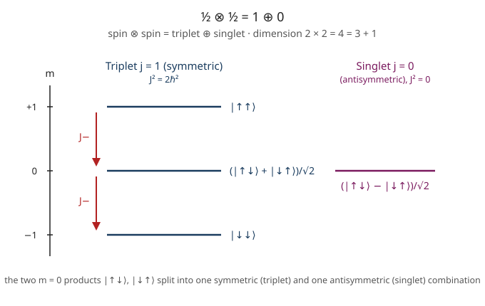

# Quantum Mechanics · Lesson 4.6: Addition of angular momenta

> ⏱ ~15 min · Module 4: Three dimensions, angular momentum, and spin · Builds on: [4.2 Angular momentum: the operator algebra](#/lesson/quantum-mechanics/04-02-angular-momentum-algebra.md), [4.5 Spin-1/2, Pauli matrices, and Stern–Gerlach](#/lesson/quantum-mechanics/04-05-spin-pauli-stern-gerlach.md) · Unlocks: identical particles and the symmetric/antisymmetric split (Module 5), the Bell singlet, and spin–orbit fine structure

## Why this matters

Every real atom has *two or more* angular momenta at once: an electron carries orbital $\hat{\mathbf L}$ **and** intrinsic spin $\hat{\mathbf S}$, and multi-electron atoms pile up several of each. Nature couples them — spin–orbit interaction, the term that splits sodium's yellow line into a doublet, is literally $\propto \hat{\mathbf L}\cdot\hat{\mathbf S}$. To label states by the conserved *total* angular momentum you must learn to **add** angular momenta: given two systems with definite $j_1$ and $j_2$, which total $j$ values are possible, and how are the combined states built? The same machinery produces the two-spin **singlet** — the maximally entangled pair that every Bell-inequality test (5.3) fires at two detectors. This lesson is the bridge from one spinning thing to many.

## The idea

Classically, adding two angular-momentum vectors is trivial: $\mathbf J = \mathbf J_1 + \mathbf J_2$, and the total length can be anything from $|J_1 - J_2|$ (antiparallel) to $J_1 + J_2$ (parallel). Quantum mechanics keeps the endpoints but **quantizes what's between**: only a discrete ladder of total-$j$ values survives, spaced by one unit.

Here is the tension that organizes everything. You have two natural ways to label a combined state:

- **Uncoupled:** say exactly what each part is doing — "$\hat J_{1z}$ points up, $\hat J_{2z}$ points down." You know both $z$-components separately.
- **Coupled:** say what the *whole* is doing — "the total has $j=1$ and $m=0$." You know the total length and its $z$-component.

You cannot have both. Once you fix the total $j$, the individual $z$-components $m_1, m_2$ become genuinely uncertain — the two arrows are entangled into a joint state, and asking "which way is arrow 1 pointing?" no longer has a definite answer. The **Clebsch–Gordan coefficients** are just the dictionary between these two descriptions.

## The formal version

**The total operators.** Define the componentwise sum
$$\hat{\mathbf J} = \hat{\mathbf J}_1 + \hat{\mathbf J}_2, \qquad \hat J_z = \hat J_{1z} + \hat J_{2z}.$$
Squaring, and using $2(\hat J_{1x}\hat J_{2x}+\hat J_{1y}\hat J_{2y}) = \hat J_{1+}\hat J_{2-} + \hat J_{1-}\hat J_{2+}$,
$$\hat J^2 = \hat J_1^2 + \hat J_2^2 + 2\hat J_{1z}\hat J_{2z} + \hat J_{1+}\hat J_{2-} + \hat J_{1-}\hat J_{2+}.$$
*In words:* the total-square is the two individual squares plus a coupling term that flips $z$-angular-momentum between the parts. That flip is exactly why $\hat J^2$ does **not** commute with $\hat J_{1z}$ or $\hat J_{2z}$ alone.

**Two bases for the same $(2j_1+1)(2j_2+1)$-dimensional space.**

- *Uncoupled basis* $\;|j_1 m_1\rangle|j_2 m_2\rangle\;$: simultaneous eigenstates of the commuting set $\{\hat J_1^2,\hat J_{1z},\hat J_2^2,\hat J_{2z}\}$. Here $m_1$ runs over $-j_1,\dots,j_1$ and likewise $m_2$.
- *Coupled basis* $\;|j\,m\rangle\;$ (at fixed $j_1,j_2$): simultaneous eigenstates of $\{\hat J^2,\hat J_z,\hat J_1^2,\hat J_2^2\}$, with $\hat J^2|j\,m\rangle = \hbar^2 j(j+1)|j\,m\rangle$ and $\hat J_z|j\,m\rangle = \hbar m\,|j\,m\rangle$.

*In words:* the uncoupled basis knows each part's $z$-spin; the coupled basis trades that away for knowledge of the total. Both are complete orthonormal bases of the same space — they just carve it up differently.

**The addition rule.** Since $\hat J_z = \hat J_{1z}+\hat J_{2z}$, every basis state has
$$m = m_1 + m_2,$$
and the allowed totals are the **triangle rule**
$$|j_1 - j_2| \;\le\; j \;\le\; j_1 + j_2, \qquad j \text{ in integer steps.}$$
*In words:* $z$-components simply add; total lengths run from "as antiparallel as allowed" to "fully parallel," one rung at a time. The number of multiplets is $2\min(j_1,j_2)+1$.

**Dimension check.** The coupled multiplets must repackage exactly the same states:
$$\sum_{j=|j_1-j_2|}^{j_1+j_2} (2j+1) = (2j_1+1)(2j_2+1).$$
*In words:* no state is created or destroyed by relabeling — count both ways and they must match. (This is the single most useful sanity check in the whole subject.)

**Clebsch–Gordan coefficients** are the change-of-basis matrix elements $\langle j_1 m_1\, j_2 m_2 | j\,m\rangle$:
$$|j\,m\rangle = \sum_{m_1+m_2 = m} \langle j_1 m_1\, j_2 m_2 | j\,m\rangle\;|j_1 m_1\rangle|j_2 m_2\rangle.$$
They are real (Condon–Shortley convention) and vanish unless both $m=m_1+m_2$ **and** the triangle rule hold. *Reading a table:* rows are labeled by $(m_1,m_2)$, columns by $(j,m)$; a **column** gives the expansion of one coupled $|j\,m\rangle$ over uncoupled products, a **row** gives the reverse. Griffiths lists the entries square-rooted with a sign kept out front.

**How the multiplets are built (top-of-ladder + lower).** There is exactly one state with the maximum $m = j_1+j_2$, so it *must* be the stretched top of the largest multiplet:
$$|\,j_1+j_2,\, j_1+j_2\rangle = |j_1 j_1\rangle|j_2 j_2\rangle.$$
Apply $\hat J_- = \hat J_{1-}+\hat J_{2-}$ repeatedly (using $\hat J_-|j\,m\rangle = \hbar\sqrt{j(j+1)-m(m-1)}\,|j\,m-1\rangle$ on each side) to walk down that multiplet. At the next value of $m$ down, the uncoupled subspace has one more state than the ladder has filled; the **orthogonal** combination is the top of the next-smaller multiplet. Repeat. No general formula needed — this recipe generates every coefficient.

**The headline case, two spin-$\tfrac12$** ($j_1=j_2=\tfrac12$, writing $|{\uparrow}\rangle=|\tfrac12,\tfrac12\rangle$, $|{\downarrow}\rangle=|\tfrac12,-\tfrac12\rangle$): the triangle rule gives $j=0$ and $j=1$, and $4 = 3+1$. The **triplet** ($j=1$, symmetric under swapping the two spins) and **singlet** ($j=0$, antisymmetric) are
$$
\underbrace{\;|1,1\rangle=|{\uparrow\uparrow}\rangle,\quad |1,0\rangle=\tfrac{1}{\sqrt2}\big(|{\uparrow\downarrow}\rangle+|{\downarrow\uparrow}\rangle\big),\quad |1,-1\rangle=|{\downarrow\downarrow}\rangle\;}_{\text{triplet, } \hat J^2=2\hbar^2}
$$
$$
\underbrace{\;|0,0\rangle=\tfrac{1}{\sqrt2}\big(|{\uparrow\downarrow}\rangle-|{\downarrow\uparrow}\rangle\big)\;}_{\text{singlet, } \hat J^2=0}.
$$
You derive these in P2; the sign is the whole story of Module 5.

## Picture

## Worked examples

**Example 1 (mechanical — count both ways).** Add $j_1=1$ and $j_2=1$. Triangle rule: $|1-1|=0 \le j \le 1+1=2$ in unit steps, so $j=0,1,2$. Dimensions:
$$(2\cdot 2+1)+(2\cdot 1+1)+(2\cdot 0+1) = 5+3+1 = 9 = 3\times 3 = (2j_1+1)(2j_2+1).\ \checkmark$$
So two spin-1 objects (say two photons' worth of $\ell=1$) split into a $j=2$ quintet, a $j=1$ triplet, and a $j=0$ singlet. The $m=0$ row alone contains three states ($m_1,m_2 = (1,-1),(0,0),(-1,1)$), one feeding each multiplet — which is why the CG table's $m=0$ column is the busy one.

**Example 2 (why you'd care — spin–orbit fine structure).** A single electron in a $p$-orbital has $\ell=1$ and $s=\tfrac12$. The triangle rule gives total $j=\tfrac12,\tfrac32$ (and $4+2 = 6 = 3\times 2$, exactly P1). The spin–orbit interaction is $\hat H_{\rm SO} = \xi\,\hat{\mathbf L}\cdot\hat{\mathbf S}$, and the coupling operator is diagonal in the **coupled** basis because
$$\hat{\mathbf L}\cdot\hat{\mathbf S} = \tfrac12\big(\hat J^2 - \hat L^2 - \hat S^2\big).$$
With $\hat L^2 = \ell(\ell+1)\hbar^2 = 2\hbar^2$ and $\hat S^2 = \tfrac34\hbar^2$:
$$j=\tfrac32:\;\; \langle \hat{\mathbf L}\cdot\hat{\mathbf S}\rangle = \tfrac12\big(\tfrac{15}{4}-2-\tfrac34\big)\hbar^2 = +\tfrac12\hbar^2, \qquad j=\tfrac12:\;\; \tfrac12\big(\tfrac34-2-\tfrac34\big)\hbar^2 = -\hbar^2.$$
So the single $p$-level splits into two — the **fine-structure doublet**, written $^2P_{3/2}$ (energy up by $\tfrac12\xi\hbar^2$, 4-fold degenerate) and $^2P_{1/2}$ (down by $\xi\hbar^2$, 2-fold). Check the barycenter: $4(+\tfrac12) + 2(-1) = 0$ — coupling shifts levels but never moves their weighted center. This *is* sodium's yellow doublet, and coupling many electrons' angular momenta to a grand total $J$ is how the periodic table's term symbols are assigned.

## Watch out

- You might think you can know $j$ **and** $m_1,m_2$ at once. You can't: $\hat J^2$ contains the flip term $\hat J_{1+}\hat J_{2-}+\hat J_{1-}\hat J_{2+}$, so $[\hat J^2,\hat J_{1z}]\ne 0$. Fixing the total length scrambles the individual $z$-components — that entanglement is physical, not ignorance.
- You might think $j$ decreases by $1$ down to $0$. It steps by $1$ down to $|j_1-j_2|$, which is $\tfrac12$ (not $0$) whenever exactly one of $j_1,j_2$ is a half-integer. Two half-integer spins give **integer** $j$; a half-integer plus an integer gives half-integer $j$.
- You might think the triplet and singlet $m=0$ states are interchangeable "$|{\uparrow\downarrow}\rangle$-ish" states. The **sign** distinguishes them: $+$ is symmetric ($j=1$), $-$ is antisymmetric ($j=0$). For identical particles (5.1) that sign decides whether the spatial part must be antisymmetric or symmetric — it controls chemistry.
- You might forget that CG coefficients connect **only same-$m$** states. If $m_1+m_2\ne m$, the coefficient is zero before you look anything up; a full CG table is block-diagonal in $m$.

## One-liner

> Two angular momenta combine into total-$j$ multiplets running from $|j_1-j_2|$ to $j_1+j_2$ with $m=m_1+m_2$; the Clebsch–Gordan coefficients are the dictionary between "know each part" and "know the whole," and the two-spin singlet's minus sign is where entanglement begins.

## Problems

**P1 (🟢)** For $j_1 = 1$ and $j_2 = \tfrac12$, list all allowed total $j$ values, give the $m$ range of each multiplet, and verify the state count $3\times 2 = 6 = 4+2$.

**P2 (🟡)** Starting from $|1,1\rangle = |{\uparrow\uparrow}\rangle$ for two spin-$\tfrac12$, apply the total lowering operator $\hat J_- = \hat S_{1-}+\hat S_{2-}$ (with $\hat S_-|{\uparrow}\rangle = \hbar|{\downarrow}\rangle$, $\hat S_-|{\downarrow}\rangle = 0$) to construct the three triplet states $|1,1\rangle,|1,0\rangle,|1,-1\rangle$ explicitly, then write down the singlet $|0,0\rangle$ using orthogonality. Confirm the triplet is symmetric and the singlet antisymmetric under swapping the two spins.

**P3 (🔴, optional)** For $\ell=1$ coupled to $s=\tfrac12$, the Clebsch–Gordan coefficients give
$$|\tfrac32,\tfrac12\rangle = \sqrt{\tfrac13}\,|1,1\rangle|\tfrac12,-\tfrac12\rangle + \sqrt{\tfrac23}\,|1,0\rangle|\tfrac12,\tfrac12\rangle.$$
(a) Confirm this is a $\hat J_z$ eigenstate with eigenvalue $\hbar/2$. (b) Write the orthogonal partner $|\tfrac12,\tfrac12\rangle$ in the same two-state subspace (Condon–Shortley: the highest-$m_1$ coefficient is positive). (c) Verify $\hat J^2|\tfrac32,\tfrac12\rangle = \tfrac{15}{4}\hbar^2|\tfrac32,\tfrac12\rangle$ using $\hat J^2 = \hat L^2+\hat S^2+2\hat L_z\hat S_z+\hat L_+\hat S_-+\hat L_-\hat S_+$.

Solutions

**P1** Triangle rule: $|1-\tfrac12| \le j \le 1+\tfrac12$, i.e. $\tfrac12 \le j \le \tfrac32$ in unit steps, so $j = \tfrac32$ and $j=\tfrac12$.
- $j=\tfrac32$: $m = -\tfrac32,-\tfrac12,+\tfrac12,+\tfrac32$ — four states ($2j+1=4$).
- $j=\tfrac12$: $m = -\tfrac12,+\tfrac12$ — two states ($2j+1=2$).

Total $4+2 = 6 = (2\cdot1+1)(2\cdot\tfrac12+1) = 3\times 2.\ \checkmark$ (These are exactly the $^2P_{3/2}$ and $^2P_{1/2}$ fine-structure levels of Example 2.)

**P2** Top state $|1,1\rangle = |{\uparrow\uparrow}\rangle$. Apply $\hat J_-$; on the coupled side $\hat J_-|j,m\rangle = \hbar\sqrt{j(j+1)-m(m-1)}\,|j,m-1\rangle$, on the uncoupled side $\hat J_-=\hat S_{1-}+\hat S_{2-}$:

Step down from $|1,1\rangle$. Coupled: $\hat J_-|1,1\rangle = \hbar\sqrt{2-0}\,|1,0\rangle = \hbar\sqrt2\,|1,0\rangle$. Uncoupled: $(\hat S_{1-}+\hat S_{2-})|{\uparrow\uparrow}\rangle = \hbar|{\downarrow\uparrow}\rangle + \hbar|{\uparrow\downarrow}\rangle$. Equate:
$$\hbar\sqrt2\,|1,0\rangle = \hbar\big(|{\uparrow\downarrow}\rangle + |{\downarrow\uparrow}\rangle\big)\;\Longrightarrow\; |1,0\rangle = \tfrac{1}{\sqrt2}\big(|{\uparrow\downarrow}\rangle+|{\downarrow\uparrow}\rangle\big).$$

Step down again. Coupled: $\hat J_-|1,0\rangle = \hbar\sqrt{2-0}\,|1,-1\rangle = \hbar\sqrt2\,|1,-1\rangle$. Uncoupled: apply $\hat J_-$ to $\tfrac{1}{\sqrt2}(|{\uparrow\downarrow}\rangle+|{\downarrow\uparrow}\rangle)$. Term $|{\uparrow\downarrow}\rangle \to \hbar|{\downarrow\downarrow}\rangle$ (only $\hat S_{1-}$ acts); $|{\downarrow\uparrow}\rangle\to\hbar|{\downarrow\downarrow}\rangle$ (only $\hat S_{2-}$ acts). So $\hat J_-|1,0\rangle = \tfrac{1}{\sqrt2}(2\hbar|{\downarrow\downarrow}\rangle) = \hbar\sqrt2\,|{\downarrow\downarrow}\rangle$. Equate: $|1,-1\rangle = |{\downarrow\downarrow}\rangle$. (As it must — the bottom of the ladder is both spins down.)

Singlet: the $m=0$ subspace is spanned by $|{\uparrow\downarrow}\rangle,|{\downarrow\uparrow}\rangle$. The triplet used the symmetric combination; the only normalized state orthogonal to it is the antisymmetric one:
$$|0,0\rangle = \tfrac{1}{\sqrt2}\big(|{\uparrow\downarrow}\rangle-|{\downarrow\uparrow}\rangle\big).$$
Check orthogonality: $\langle 1,0|0,0\rangle = \tfrac12(\langle{\uparrow\downarrow}| + \langle{\downarrow\uparrow}|)(|{\uparrow\downarrow}\rangle - |{\downarrow\uparrow}\rangle) = \tfrac12(1 - 1) = 0.\ \checkmark$

Symmetry under swap $1\leftrightarrow 2$: $|{\uparrow\uparrow}\rangle,|{\downarrow\downarrow}\rangle$ are obviously symmetric; $|{\uparrow\downarrow}\rangle+|{\downarrow\uparrow}\rangle \to |{\downarrow\uparrow}\rangle+|{\uparrow\downarrow}\rangle$ (unchanged, symmetric); $|{\uparrow\downarrow}\rangle-|{\downarrow\uparrow}\rangle \to |{\downarrow\uparrow}\rangle-|{\uparrow\downarrow}\rangle = -(|{\uparrow\downarrow}\rangle-|{\downarrow\uparrow}\rangle)$ (flips sign, antisymmetric). So the $j=1$ triplet is symmetric, the $j=0$ singlet antisymmetric — the fact that drives the Pauli principle in 5.1 and supplies the Bell state of 5.3.

**P3** Abbreviate $a \equiv |1,0\rangle|\tfrac12,\tfrac12\rangle$ (so $m_1=0,m_2=\tfrac12$) and $b \equiv |1,1\rangle|\tfrac12,-\tfrac12\rangle$ (so $m_1=1,m_2=-\tfrac12$). Then $|\tfrac32,\tfrac12\rangle = \sqrt{\tfrac23}\,a + \sqrt{\tfrac13}\,b$.

**(a)** $\hat J_z = \hat L_z+\hat S_z$ gives eigenvalue $\hbar(m_1+m_2)$ on each product: on $a$, $\hbar(0+\tfrac12)=\tfrac{\hbar}{2}$; on $b$, $\hbar(1-\tfrac12)=\tfrac{\hbar}{2}$. Both are $\tfrac{\hbar}{2}$, so any combination is a $\hat J_z$ eigenstate with eigenvalue $\hbar/2$. $\checkmark$

**(b)** In the same $\{a,b\}$ subspace the normalized orthogonal state is $\pm(\sqrt{\tfrac13}\,a - \sqrt{\tfrac23}\,b)$. The highest $m_1$ appears in $b$ ($m_1=1$); Condon–Shortley makes its coefficient positive, so flip the overall sign:
$$|\tfrac12,\tfrac12\rangle = \sqrt{\tfrac23}\,|1,1\rangle|\tfrac12,-\tfrac12\rangle - \sqrt{\tfrac13}\,|1,0\rangle|\tfrac12,\tfrac12\rangle.$$
Orthogonality check: $\langle\tfrac32,\tfrac12|\tfrac12,\tfrac12\rangle = \sqrt{\tfrac23}(-\sqrt{\tfrac13}) + \sqrt{\tfrac13}\sqrt{\tfrac23} = 0.\ \checkmark$

**(c)** Use $\hat J^2 = \hat L^2+\hat S^2+2\hat L_z\hat S_z+\hat L_+\hat S_-+\hat L_-\hat S_+$ with $\hat L^2 = 2\hbar^2$, $\hat S^2 = \tfrac34\hbar^2$ (so $\hat L^2+\hat S^2 = \tfrac{11}{4}\hbar^2$ on every term). Act on each product:

On $a$ ($m_1=0,m_2=\tfrac12$): $2\hat L_z\hat S_z\,a = 2(0)(\tfrac{\hbar}{2})a = 0$. $\hat L_-\hat S_+\,a = 0$ (since $\hat S_+|\tfrac12,\tfrac12\rangle=0$). $\hat L_+\hat S_-\,a$: $\hat L_+|1,0\rangle = \hbar\sqrt2|1,1\rangle$, $\hat S_-|\tfrac12,\tfrac12\rangle=\hbar|\tfrac12,-\tfrac12\rangle$, giving $\sqrt2\,\hbar^2\,b$. So
$$\hat J^2 a = \tfrac{11}{4}\hbar^2\,a + \sqrt2\,\hbar^2\,b.$$

On $b$ ($m_1=1,m_2=-\tfrac12$): $2\hat L_z\hat S_z\,b = 2(\hbar)(-\tfrac{\hbar}{2})b = -\hbar^2 b$. $\hat L_+\hat S_-\,b = 0$ (since $\hat L_+|1,1\rangle=0$). $\hat L_-\hat S_+\,b$: $\hat L_-|1,1\rangle=\hbar\sqrt2|1,0\rangle$, $\hat S_+|\tfrac12,-\tfrac12\rangle=\hbar|\tfrac12,\tfrac12\rangle$, giving $\sqrt2\,\hbar^2\,a$. So
$$\hat J^2 b = \big(\tfrac{11}{4}-1\big)\hbar^2\,b + \sqrt2\,\hbar^2\,a = \tfrac{7}{4}\hbar^2\,b + \sqrt2\,\hbar^2\,a.$$

Assemble $\hat J^2|\tfrac32,\tfrac12\rangle = \sqrt{\tfrac23}\,\hat J^2 a + \sqrt{\tfrac13}\,\hat J^2 b$:
$$\text{coeff of }a:\;\; \hbar^2\Big(\tfrac{11}{4}\sqrt{\tfrac23} + \sqrt2\sqrt{\tfrac13}\Big) = \hbar^2\sqrt{\tfrac23}\Big(\tfrac{11}{4}+1\Big) = \tfrac{15}{4}\hbar^2\sqrt{\tfrac23},$$
$$\text{coeff of }b:\;\; \hbar^2\Big(\sqrt2\sqrt{\tfrac23} + \tfrac{7}{4}\sqrt{\tfrac13}\Big) = \hbar^2\Big(\tfrac{2}{\sqrt3} + \tfrac{7}{4\sqrt3}\Big) = \tfrac{15}{4}\hbar^2\sqrt{\tfrac13},$$
using $\sqrt2\sqrt{\tfrac13}=\sqrt{\tfrac23}$ and $\sqrt2\sqrt{\tfrac23}=\tfrac{2}{\sqrt3}$. Both coefficients are $\tfrac{15}{4}\hbar^2$ times the original, so
$$\hat J^2|\tfrac32,\tfrac12\rangle = \tfrac{15}{4}\hbar^2\,|\tfrac32,\tfrac12\rangle = \hbar^2\,\tfrac32\!\left(\tfrac32+1\right)|\tfrac32,\tfrac12\rangle.\ \checkmark$$
The CG combination is genuinely a $j=\tfrac32$ eigenstate — the cross-terms $\hat L_\pm\hat S_\mp$ conspire to make it so.

## Flashback

**From Lesson 4.5 (Spin-1/2, Pauli matrices, and Stern–Gerlach):** An electron is prepared spin-up along $z$, $|{\uparrow}\rangle_z$, and you measure its spin along the $x$-axis. Using $\hat S_x = \tfrac{\hbar}{2}\sigma_x$ with eigenstates $|{\pm}\rangle_x = \tfrac{1}{\sqrt2}(|{\uparrow}\rangle_z \pm |{\downarrow}\rangle_z)$, find the possible outcomes and their probabilities.

Solution

Invert the eigenstate relations: adding and subtracting gives $|{\uparrow}\rangle_z = \tfrac{1}{\sqrt2}\big(|{+}\rangle_x + |{-}\rangle_x\big)$. The measurement of $\hat S_x$ can return $+\tfrac{\hbar}{2}$ (state $|{+}\rangle_x$) or $-\tfrac{\hbar}{2}$ (state $|{-}\rangle_x$), with probabilities
$$P(+\tfrac{\hbar}{2}) = \big|{}_x\langle{+}|{\uparrow}\rangle_z\big|^2 = \big|\tfrac{1}{\sqrt2}\big|^2 = \tfrac12, \qquad P(-\tfrac{\hbar}{2}) = \tfrac12.$$
A definite $z$-spin is maximally uncertain in $x$ — the two axes' spin operators don't commute ($[\hat S_x,\hat S_z]=-i\hbar\hat S_y\ne 0$), so a $\hat S_z$ eigenstate is an even superposition of $\hat S_x$ eigenstates. (This same non-commuting structure, promoted to the *total* $\hat J^2$ vs individual $\hat J_{iz}$, is why the coupled and uncoupled bases in this lesson can't be simultaneously sharp.)

## Connections

- **Backward:** the lowering-operator ladder is [4.2](#/lesson/quantum-mechanics/04-02-angular-momentum-algebra.md)'s $\hat J_\pm$ machinery applied to a *sum* of angular momenta; the two-state building blocks are the spin-$\tfrac12$ kets of [4.5](#/lesson/quantum-mechanics/04-05-spin-pauli-stern-gerlach.md). Building a basis of joint eigenstates of commuting operators is the complete-set-of-commuting-observables idea from [3.4](#/lesson/quantum-mechanics/03-04-compatible-observables.md).
- **Forward:** the symmetric-triplet / antisymmetric-singlet split is the seed of identical-particle statistics (5.1) — it decides whether two electrons share a spatial orbital. The singlet $\tfrac{1}{\sqrt2}(|{\uparrow\downarrow}\rangle-|{\downarrow\uparrow}\rangle)$ is the maximally entangled state that tensor products (5.2) formalize and Bell's inequality (5.3) tests. Spin–orbit coupling (Example 2) is the perturbation that Module 6 evaluates for hydrogen fine structure.
- **Sideways (analytical mechanics):** just as total momentum and angular momentum are the conserved sums that survive when you couple subsystems, the total $\hat{\mathbf J}$ is the generator of *joint* rotations — it commutes with any rotation-invariant coupling (like $\hat{\mathbf L}\cdot\hat{\mathbf S}$), which is exactly why the coupled basis diagonalizes such interactions.
