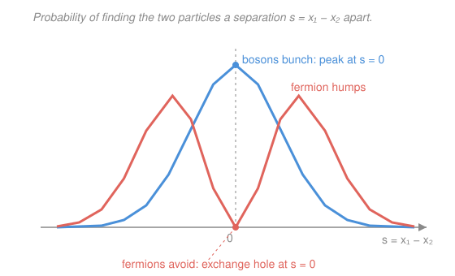

# Quantum Mechanics · Lesson 5.1: Identical particles — bosons and fermions

> ⏱ ~15 min · Module 5: Identical particles and entanglement · Builds on: [4.5 Spin-1/2, Pauli matrices, Stern–Gerlach](#/lesson/quantum-mechanics/04-05-spin-pauli-stern-gerlach.md), [4.6 Addition of angular momenta](#/lesson/quantum-mechanics/04-06-addition-angular-momenta.md) · Unlocks: 5.2 Tensor products and entanglement

## Why this matters

Two electrons are not "two things that happen to be identical" — they are identical in a way no classical object ever is: there is **no fact** about which one is which. That single sentence, taken seriously, forces the entire architecture of matter. It gives you the **Pauli exclusion principle** (a *theorem*, not a postulate), which stacks electrons into shells and hands you the whole periodic table. It creates an effective "force" — attractive for bosons, repulsive for fermions — that comes from *symmetry alone*, with no term in the Hamiltonian. And it splits every particle in the universe into two castes: the **bosons** that pile into one state (lasers, superfluids, Bose–Einstein condensates) and the **fermions** that refuse to (the degeneracy pressure that holds up a white dwarf against its own gravity). Chemistry, the stability of bulk matter, and the exclusion that keeps you from falling through the floor all sit downstream of this lesson.

## The idea

Classically you can always tag two billiard balls — paint one red — and follow them. Track their trajectories and at the end you know "ball 1 is here, ball 2 is there." Quantum mechanically there are no trajectories and no paint. If two electrons have the same mass, charge, and spin, then the state "electron in $a$, electron in $b$" and the state "electron in $b$, electron in $a$" describe the **same physical situation** — swapping the labels can't change anything measurable.

"Can't change anything measurable" means the probability density $|\Psi|^2$ is unchanged when you swap the two particles. So $\Psi$ itself can only pick up a phase. Do the swap twice and you're back to the start, so that phase squared must be $1$ — the phase is $\pm 1$. Nature uses **both** signs, and which one you get is fixed by the particle's spin:

- **$+1$, symmetric under swap → bosons** (integer spin: photons, phonons, $^4$He, the Higgs). They *like* to share a state.
- **$-1$, antisymmetric under swap → fermions** (half-integer spin: electrons, protons, neutrons, quarks). They *refuse* to share a state.

Everything else in the lesson is a consequence of that $\pm 1$.

## The formal version

Write a two-particle state $\Psi(x_1,x_2)$, where $x_i$ collects all coordinates (position **and** spin) of particle $i$. Define the **exchange operator** $\hat P_{12}$ that swaps the two particles:

$$\hat P_{12}\,\Psi(x_1,x_2) = \Psi(x_2,x_1).$$

Since swapping twice is the identity, $\hat P_{12}^2 = \hat{\mathbb 1}$, so its eigenvalues are $\pm 1$. Indistinguishability demands that the physical state be an eigenstate of $\hat P_{12}$:

$$\hat P_{12}\,\Psi = +\Psi \ \text{(symmetric, bosons)}, \qquad \hat P_{12}\,\Psi = -\Psi \ \text{(antisymmetric, fermions)}.$$

*In words:* an identical-particle state must have a **definite exchange symmetry** — swapping the particles either leaves it alone or flips its overall sign, nothing in between.

**Spin–statistics connection (stated, not proven).** Integer-spin particles are symmetric (bosons); half-integer-spin particles are antisymmetric (fermions). *In words:* spin dictates statistics. The proof requires relativistic quantum field theory (the spin–statistics theorem) and is genuinely beyond QM — but it is exact and never violated.

**Building two-particle states.** Take two orthonormal single-particle states $\psi_a,\psi_b$ (with $\int\psi_a^*\psi_b=0$). Neither product $\psi_a(x_1)\psi_b(x_2)$ nor $\psi_b(x_1)\psi_a(x_2)$ has definite symmetry, so we combine them:

$$\Psi_\pm(x_1,x_2) = \frac{1}{\sqrt 2}\big[\psi_a(x_1)\psi_b(x_2) \pm \psi_b(x_1)\psi_a(x_2)\big].$$

*In words:* $\Psi_+$ (bosons) is the symmetric combination, $\Psi_-$ (fermions) the antisymmetric one; the $1/\sqrt2$ normalizes it. Check: $\hat P_{12}\Psi_\pm = \pm\Psi_\pm$. ✓

**Pauli exclusion, as a theorem.** Set $b=a$ in the fermion state:

$$\Psi_-(x_1,x_2)\big|_{b=a} = \tfrac{1}{\sqrt2}\big[\psi_a(x_1)\psi_a(x_2)-\psi_a(x_1)\psi_a(x_2)\big] = 0.$$

*In words:* two fermions **cannot** occupy the same single-particle state — the antisymmetric combination annihilates itself. This isn't an extra rule bolted on; it falls straight out of antisymmetry.

**The Slater determinant.** For $N$ fermions in orthonormal states $\psi_{a_1},\dots,\psi_{a_N}$, the fully antisymmetric state is a determinant:

$$\Psi(x_1,\dots,x_N) = \frac{1}{\sqrt{N!}}\begin{vmatrix} \psi_{a_1}(x_1) & \psi_{a_1}(x_2) & \cdots & \psi_{a_1}(x_N) \\ \psi_{a_2}(x_1) & \psi_{a_2}(x_2) & \cdots & \psi_{a_2}(x_N) \\ \vdots & \vdots & \ddots & \vdots \\ \psi_{a_N}(x_1) & \psi_{a_N}(x_2) & \cdots & \psi_{a_N}(x_N)\end{vmatrix}.$$

*In words:* rows are states, columns are particles. Swapping two particles swaps two **columns** → the determinant flips sign (antisymmetry, automatic). Putting two fermions in the same state makes two **rows** equal → the determinant is zero (Pauli, automatic). Linear algebra does the bookkeeping for you.

**Don't forget spin.** For electrons, $x_i$ includes spin, so it is the **total** space$\,\otimes\,$spin state that must be antisymmetric. That leaves two ways to build it:

$$\underbrace{\text{spatial symmetric}}_{+}\otimes\underbrace{\text{spin singlet}}_{-}\quad\text{or}\quad\underbrace{\text{spatial antisymmetric}}_{-}\otimes\underbrace{\text{spin triplet}}_{+},$$

using the singlet/triplet from [4.6](#/lesson/quantum-mechanics/04-06-addition-angular-momenta.md): the antisymmetric singlet $\tfrac{1}{\sqrt2}(\lvert\uparrow\downarrow\rangle-\lvert\downarrow\uparrow\rangle)$ and the symmetric triplet. Symmetric $\times$ antisymmetric $=$ antisymmetric either way. This is why an atomic orbital holds **two** electrons: same spatial state is allowed only if the spins pair into the singlet.

## Picture

The single fact "$\pm 1$ under swap" reshapes where the two particles are found *relative to each other*, even with zero interaction. Bosons pile up at $x_1=x_2$ (bunching); fermions dig an **exchange hole** — the probability of coincidence drops to zero — and hump apart. No force in the Hamiltonian did this; the symmetry of $\Psi$ did.

## Worked examples

**Example 1 (mechanical — the exchange term).** Compute the mean-square separation $\langle(x_1-x_2)^2\rangle = \langle x_1^2\rangle + \langle x_2^2\rangle - 2\langle x_1 x_2\rangle$ in the state $\Psi_\pm$, with $\psi_a,\psi_b$ orthonormal.

Because $|\Psi_\pm|^2$ is symmetric under $1\leftrightarrow2$, we have $\langle x_1^2\rangle=\langle x_2^2\rangle$. Expanding $|\Psi_\pm|^2$, every cross term for $\langle x_1^2\rangle$ carries a factor $\int\psi_b^*\psi_a\,dx_2=0$, so it drops:

$$\langle x_1^2\rangle=\langle x_2^2\rangle=\tfrac12\big(\langle x^2\rangle_a+\langle x^2\rangle_b\big)\ \Rightarrow\ \langle x_1^2\rangle+\langle x_2^2\rangle=\langle x^2\rangle_a+\langle x^2\rangle_b.$$

For $\langle x_1 x_2\rangle$ the cross terms **survive**, because each integral now carries a factor of $x$. The direct terms give $\langle x\rangle_a\langle x\rangle_b$; the cross terms give $\pm|\langle x\rangle_{ab}|^2$, where the **exchange matrix element** is

$$\langle x\rangle_{ab}\equiv\int \psi_a^*(x)\,x\,\psi_b(x)\,dx.$$

So $\langle x_1 x_2\rangle_\pm=\langle x\rangle_a\langle x\rangle_b\pm|\langle x\rangle_{ab}|^2$, and therefore

$$\boxed{\ \langle(x_1-x_2)^2\rangle_\pm=\langle x^2\rangle_a+\langle x^2\rangle_b-2\langle x\rangle_a\langle x\rangle_b\ \mp\ 2\,|\langle x\rangle_{ab}|^2.\ }$$

The first three terms are exactly the **distinguishable** answer (a plain product state). The last term is pure quantum statistics:

- **Bosons** ($+$ state) take the $-2|\langle x\rangle_{ab}|^2$: separation shrinks → they **bunch**.
- **Fermions** ($-$ state) take the $+2|\langle x\rangle_{ab}|^2$: separation grows → they **avoid**.

This is the "exchange force": a correlation with no interaction behind it, switched on only when the single-particle states **overlap** (if $\langle x\rangle_{ab}=0$, nothing happens).

**Example 2 (why you'd care — the periodic table and beyond).** Put electrons, one at a time, into hydrogen-like orbitals labeled by $(n,\ell,m,m_s)$. Pauli forbids two in the same full state, but each spatial orbital $(n,\ell,m)$ admits **two** electrons — spin up and spin down, forming the singlet. Ground-state helium ($Z=2$) fills the $1s$ orbital with exactly those two. Lithium's third electron *cannot* join them; Pauli evicts it to the $n=2$ shell, giving lithium its lone, reactive valence electron. Iterate and you have built the shell structure — and hence chemistry — from one sign. Scale it up and the same exclusion becomes a *pressure*: in a white dwarf, gravity has crushed the atoms, but the electrons still refuse to share momentum states, and that **degeneracy pressure** — not thermal pressure, not any force — is what holds the star up. Fermionic stubbornness is structural, from atoms to stars.

## Watch out

- **You might think** you can say "electron 1 is in $a$, electron 2 is in $b$." **Actually** that labeled product state is unphysical — it lacks definite exchange symmetry. Only $\Psi_\pm$ is a legal state; the labels $1,2$ are bookkeeping indices, not tags on real electrons.
- **You might think** the exchange force is a genuine force. **Actually** there is *no term for it in the Hamiltonian* — it's a statistical correlation manufactured by the symmetry of $\Psi$. It nonetheless has real energetic consequences (it underlies ferromagnetism and the covalent bond).
- **You might think** Pauli forbids two electrons in the same spatial orbital. **Actually** it forbids the same **total** (space $\otimes$ spin) state. Two electrons share a spatial orbital freely — provided their spins form the antisymmetric singlet. That "provided" is exactly why orbitals hold two, not one or three.
- **You might think** symmetrization only matters when particles are close. **Actually** it's always required — but its *effect* vanishes when the states don't overlap ($\langle x\rangle_{ab}\to0$), which is why we get away with treating well-separated particles as distinguishable.

## One-liner

> Identical particles carry no labels, so the state must be an eigenstate of exchange — $+1$ for bosons that bunch, $-1$ for fermions that exclude — and the entire periodic table is the determinant refusing to have two equal rows.

## Problems

**P1 (🟢)** Two electrons occupy spatial orbitals $\psi_a$ and $\psi_b$. Write the properly antisymmetrized total (space $\otimes$ spin) state with **total spin $0$** (the singlet), and verify it is antisymmetric under exchange of the two electrons.

**P2 (🟡)** (a) Show explicitly that $\Psi_-$ vanishes when $b=a$, and state in one sentence which principle this is. (b) From Example 1's boxed result, give the sign of the exchange term $\mp2|\langle x\rangle_{ab}|^2$ for bosons and for fermions, and say which caste ends up closer together.

**P3 (🔴, optional)** For three fermions in orthonormal states $\psi_a,\psi_b,\psi_c$, write the $3\times3$ Slater determinant explicitly (all six terms). Then swap particles $1$ and $2$ everywhere and show the whole state changes sign. Note what happens to the determinant if $c=a$.

Solutions

**P1** The spin singlet is antisymmetric, so pair it with a **symmetric** spatial part:

$$\Psi = \underbrace{\frac{1}{\sqrt2}\big[\psi_a(\mathbf r_1)\psi_b(\mathbf r_2)+\psi_b(\mathbf r_1)\psi_a(\mathbf r_2)\big]}_{\text{spatial, symmetric}}\ \otimes\ \underbrace{\frac{1}{\sqrt2}\big(\lvert\uparrow\downarrow\rangle-\lvert\downarrow\uparrow\rangle\big)}_{\text{spin singlet, antisymmetric}}.$$

Exchange $1\leftrightarrow2$: the spatial factor is unchanged ($+1$), the spin factor flips sign ($-1$), so the product picks up $(+1)(-1)=-1$. The total state is antisymmetric, as required for electrons. ✓ (Had we instead wanted the spatial-antisymmetric part, we would pair it with the symmetric spin **triplet** — the other legal option.)

**P2** (a) Setting $b=a$,

$$\Psi_-\big|_{b=a}=\tfrac{1}{\sqrt2}\big[\psi_a(x_1)\psi_a(x_2)-\psi_a(x_1)\psi_a(x_2)\big]=0.$$

The state is identically zero, so this configuration does not exist: **the Pauli exclusion principle** — no two fermions in the same single-particle state.

(b) The exchange term is $\mp2|\langle x\rangle_{ab}|^2$: the **upper** sign goes with $\Psi_+$ (bosons), the **lower** with $\Psi_-$ (fermions).
- Bosons: $-2|\langle x\rangle_{ab}|^2$ → $\langle(x_1-x_2)^2\rangle$ *decreases* → bosons sit **closer** together (bunching).
- Fermions: $+2|\langle x\rangle_{ab}|^2$ → $\langle(x_1-x_2)^2\rangle$ *increases* → fermions stay **farther** apart (the exchange hole).

**P3** Rows are states, columns are particles:

$$\Psi=\frac{1}{\sqrt6}\begin{vmatrix}\psi_a(x_1)&\psi_a(x_2)&\psi_a(x_3)\\ \psi_b(x_1)&\psi_b(x_2)&\psi_b(x_3)\\ \psi_c(x_1)&\psi_c(x_2)&\psi_c(x_3)\end{vmatrix}.$$

Expanding along the first row (cofactor expansion):

$$\sqrt6\,\Psi=\psi_a(x_1)\big[\psi_b(x_2)\psi_c(x_3)-\psi_c(x_2)\psi_b(x_3)\big]-\psi_a(x_2)\big[\psi_b(x_1)\psi_c(x_3)-\psi_c(x_1)\psi_b(x_3)\big]+\psi_a(x_3)\big[\psi_b(x_1)\psi_c(x_2)-\psi_c(x_1)\psi_b(x_2)\big].$$

The six signed terms are the even/odd permutations of assigning $(a,b,c)$ to $(x_1,x_2,x_3)$:

$$\sqrt6\,\Psi = \psi_a(x_1)\psi_b(x_2)\psi_c(x_3)-\psi_a(x_1)\psi_c(x_2)\psi_b(x_3)-\psi_b(x_1)\psi_a(x_2)\psi_c(x_3)+\psi_b(x_1)\psi_c(x_2)\psi_a(x_3)+\psi_c(x_1)\psi_a(x_2)\psi_b(x_3)-\psi_c(x_1)\psi_b(x_2)\psi_a(x_3).$$

Swapping $x_1\leftrightarrow x_2$ is exactly swapping the first two **columns** of the determinant, which multiplies any determinant by $-1$. Term by term, the first term above maps to $\psi_a(x_2)\psi_b(x_1)\psi_c(x_3)=+\psi_b(x_1)\psi_a(x_2)\psi_c(x_3)$, which is (minus) the third term — every term lands on another term with the opposite sign. Hence $\Psi\to-\Psi$: the state is antisymmetric. ✓

If $c=a$, two rows of the determinant become identical, so $\Psi=0$: three fermions cannot occupy only two distinct states — Pauli again.

## Flashback

**From Lesson 4.6 (Addition of angular momenta):** For two spin-$\tfrac12$ particles, write the total-spin $S=1,\,m=0$ state and the $S=0$ state in the $\lvert m_1 m_2\rangle$ basis, and state which one is symmetric under exchange of the two spins.

Solution

Coupling two spin-$\tfrac12$'s gives a symmetric **triplet** ($S=1$) and an antisymmetric **singlet** ($S=0$). The $m=0$ members:

$$\lvert S=1,m=0\rangle=\tfrac{1}{\sqrt2}\big(\lvert\uparrow\downarrow\rangle+\lvert\downarrow\uparrow\rangle\big)\quad(\text{symmetric}),\qquad \lvert S=0,m=0\rangle=\tfrac{1}{\sqrt2}\big(\lvert\uparrow\downarrow\rangle-\lvert\downarrow\uparrow\rangle\big)\quad(\text{antisymmetric}).$$

Swapping the two spins sends $\lvert\uparrow\downarrow\rangle\leftrightarrow\lvert\downarrow\uparrow\rangle$: the triplet is unchanged ($+$), the singlet flips sign ($-$). This is precisely the spin factor P1 needs — the singlet's antisymmetry is what lets two electrons share a spatial orbital.

## Connections

- **Backward:** this is the payoff of [4.6](#/lesson/quantum-mechanics/04-06-addition-angular-momenta.md)'s singlet/triplet and [4.5](#/lesson/quantum-mechanics/04-05-spin-pauli-stern-gerlach.md)'s spin states — the total state must be antisymmetric, and the singlet/triplet are exactly the symmetric/antisymmetric spin partners you need. The exchange matrix element $\langle x\rangle_{ab}$ is computed with the single-particle wavefunctions from Module 2 (e.g. the [infinite well](#/lesson/quantum-mechanics/02-03-infinite-square-well.md)).
- **Forward:** [5.2](#/lesson/quantum-mechanics/05-02-tensor-products-entanglement.md) makes the tensor-product structure explicit and shows that a symmetrized two-particle state is a *forced* form of entanglement — identical particles are never truly independent.
- **Sideways (statistical mechanics):** counting how many particles can pile into each single-particle energy level is where quantum statistics is born. Fermions (at most one per state) obey the **Fermi–Dirac** distribution; bosons (no limit) obey **Bose–Einstein**. That single split explains electron degeneracy pressure in white dwarfs and metals, Bose–Einstein condensation, superfluid $^4$He, and — running all the way back to [1.1](#/lesson/quantum-mechanics/01-01-why-quantum.md) — the blackbody spectrum, since photons are bosons. The $\pm1$ you met here is the seed of an entire branch of physics.
