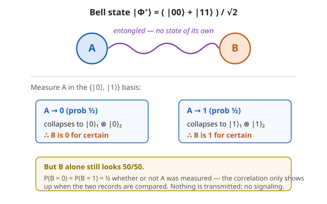

# Quantum Mechanics · Lesson 5.2: Tensor products and entanglement

> ⏱ ~15 min · Module 5: Identical particles and entanglement · Builds on: [5.1 Identical particles](#/lesson/quantum-mechanics/05-01-identical-particles.md), [1.3 Hilbert space and Dirac notation](#/lesson/quantum-mechanics/01-03-hilbert-space-dirac-notation.md) · Unlocks: Bell's inequality (5.3), the density matrix (5.4)

## Why this matters

Everything genuinely quantum about the *many-body* world lives here. Two particles are not just "particle 1 and particle 2" side by side — their joint state can be **entangled**, a state in which neither particle has any state of its own, only a correlation with the other. This is what Einstein called "spooky action at a distance," what makes Bell's theorem (next lesson) rule out any local classical story, and what quantum computing spends its qubits on. Before any of that, you need the arena entanglement lives in: the **tensor product** of two Hilbert spaces. Get the bookkeeping right and entanglement becomes a one-line test.

## The idea

Suppose system $A$ can be in $d_A$ distinguishable states and system $B$ in $d_B$. Classically the joint system has $d_A \times d_B$ configurations — you list one choice for $A$ and one for $B$. Quantum mechanics keeps that counting but lets you **superpose** across the whole list. The joint state space is the **tensor product** $\mathcal H_A \otimes \mathcal H_B$, whose dimension is $d_A \cdot d_B$ (dimensions *multiply* — this is not the direct sum, which would add them).

A basis is built by pairing basis vectors: if $\{|i\rangle_A\}$ spans $A$ and $\{|j\rangle_B\}$ spans $B$, then $\{|i\rangle_A \otimes |j\rangle_B\}$ spans the joint space. Two qubits ($d_A = d_B = 2$) give a $4$-dimensional space with basis $|00\rangle, |01\rangle, |10\rangle, |11\rangle$ (writing $|ij\rangle \equiv |i\rangle_A \otimes |j\rangle_B$).

Now the key split. Some joint states factor:

$$|\psi\rangle_A \otimes |\varphi\rangle_B \quad\text{— "}A\text{ is in }|\psi\rangle \text{ AND }B\text{ is in }|\varphi\rangle\text{."}$$

These are **product** (or **separable**) states — each part has a definite state. But most vectors in a $4$-dimensional space are *not* of this factored form. Those are **entangled**: you cannot name a state for $A$ and a state for $B$ separately, because $A$'s "state" depends on what you find for $B$. The tensor product is big enough to hold correlations that no pair of individual states can encode.

## The formal version

**Tensor product space.** $\mathcal H_A \otimes \mathcal H_B$ is the space spanned by symbols $|i\rangle_A \otimes |j\rangle_B$, with the pairing bilinear in each slot:

$$(\alpha|u\rangle + \beta|v\rangle)\otimes|w\rangle = \alpha\,|u\rangle\otimes|w\rangle + \beta\,|v\rangle\otimes|w\rangle,$$

and likewise in the second slot. *In words:* $\otimes$ distributes over sums and pulls scalars out — it behaves like a product, which is why the same distributive expansion you use for the outer product $|i\rangle\langle j|$ in `linalg-refresher` works here.

**Inner product.** Slots pair with slots:

$$\big(\langle a|\otimes\langle b|\big)\big(|c\rangle\otimes|d\rangle\big) = \langle a|c\rangle\,\langle b|d\rangle.$$

*In words:* the overlap of two product states is the product of the within-system overlaps. This makes $\{|i\rangle_A\otimes|j\rangle_B\}$ orthonormal whenever the factors are.

**Product vs. entangled.** A pure joint state is **separable** if it can be written as a *single* product $|\psi\rangle_A\otimes|\varphi\rangle_B$, and **entangled** otherwise. *In words:* separable = "each part has its own state"; entangled = "only the pair has a state."

**The two-qubit separability test.** Write a general two-qubit state

$$|\chi\rangle = a\,|00\rangle + b\,|01\rangle + c\,|10\rangle + d\,|11\rangle.$$

Then $|\chi\rangle$ is separable **iff** $ad = bc$. *In words:* arrange the amplitudes as a $2\times2$ matrix $\begin{pmatrix} a & b \\ c & d\end{pmatrix}$; the state factors exactly when this matrix has zero determinant ($ad - bc = 0$), i.e. when its rows are proportional. (Proof of the "product $\Rightarrow ad=bc$" direction is in Example 1.)

**The Bell basis.** The four **Bell states**

$$|\Phi^\pm\rangle = \tfrac{1}{\sqrt2}\big(|00\rangle \pm |11\rangle\big), \qquad |\Psi^\pm\rangle = \tfrac{1}{\sqrt2}\big(|01\rangle \pm |10\rangle\big)$$

form an orthonormal basis of the two-qubit space, and every one of them is **maximally entangled**. *In words:* a complete "measuring stick" for two qubits made entirely of maximally-correlated states. For $|\Phi^+\rangle$: $a=d=\tfrac1{\sqrt2}$, $b=c=0$, so $ad=\tfrac12 \neq 0 = bc$ — entangled. Same verdict for all four.

**Schmidt decomposition (the clean statement).** Any bipartite pure state can be written

$$|\chi\rangle = \sum_i \lambda_i\, |u_i\rangle_A \otimes |v_i\rangle_B, \qquad \lambda_i > 0,\ \ \sum_i \lambda_i^2 = 1,$$

with $\{|u_i\rangle\}$ orthonormal in $A$ and $\{|v_i\rangle\}$ orthonormal in $B$. The number of terms is the **Schmidt rank**. *In words:* one privileged pairing of orthonormal states in which the correlation is diagonal. **Schmidt rank $=1 \iff$ separable; rank $>1 \iff$ entangled.** The $\lambda_i$ are exactly the singular values of the coefficient matrix $\begin{pmatrix} a & b\\ c& d\end{pmatrix}$ — Schmidt decomposition *is* the [SVD](#/lesson/linalg-refresher/05-02-svd.md) of that matrix.

## Picture

## Worked examples

**Example 1 (mechanical — where $ad=bc$ comes from, and using it).** Take a general product state and expand it. With $|\psi\rangle = \alpha|0\rangle + \beta|1\rangle$ and $|\varphi\rangle = \gamma|0\rangle + \delta|1\rangle$,

$$|\psi\rangle\otimes|\varphi\rangle = \alpha\gamma\,|00\rangle + \alpha\delta\,|01\rangle + \beta\gamma\,|10\rangle + \beta\delta\,|11\rangle.$$

So $a=\alpha\gamma,\ b=\alpha\delta,\ c=\beta\gamma,\ d=\beta\delta$, giving $ad = \alpha\beta\gamma\delta = bc$. Every product state obeys $ad=bc$; contrapositive, $ad\neq bc$ forces entanglement. Test $|\Psi^-\rangle = \tfrac1{\sqrt2}(|01\rangle - |10\rangle)$: here $a=d=0$, $b=\tfrac1{\sqrt2}$, $c=-\tfrac1{\sqrt2}$, so $ad = 0$ but $bc = -\tfrac12$. Since $ad \neq bc$, the **singlet is entangled** — no choice of $\alpha,\beta,\gamma,\delta$ can build it.

**Example 2 (why you'd care — measurement correlations and no-signaling).** Take $|\Phi^+\rangle = \tfrac1{\sqrt2}(|00\rangle + |11\rangle)$ and measure qubit $A$ in the $\{|0\rangle,|1\rangle\}$ basis. Group the state by $A$'s value: it is already $\tfrac1{\sqrt2}\big(|0\rangle_A|0\rangle_B + |1\rangle_A|1\rangle_B\big)$.

- Outcome $A=0$ has probability $\big|\tfrac1{\sqrt2}\big|^2 = \tfrac12$; the state collapses to $|0\rangle_A|0\rangle_B$, so **$B$ is now $|0\rangle$ with certainty**.
- Outcome $A=1$ has probability $\tfrac12$; the state collapses to $|1\rangle_A|1\rangle_B$, so **$B$ is now $|1\rangle$**.

Measuring $A$ *instantly* fixes $B$'s conditional state — even if $B$ is a galaxy away. Yet look at $B$ *by itself*, ignoring $A$:

$$P(B=0) = \underbrace{\tfrac12}_{A=0}\cdot 1 + \underbrace{\tfrac12}_{A=1}\cdot 0 = \tfrac12, \qquad P(B=1) = \tfrac12.$$

$B$'s local statistics are $50/50$ — **exactly what they were before $A$ was touched**, and exactly what they'd be if $A$ were never measured at all. So the person holding $B$ sees nothing change; the correlation is invisible until the two measurement records are brought together and compared. This is the **no-signaling** principle: entanglement correlates, but it cannot transmit.

## Watch out

- You might think entanglement means the particles are "interacting" or exchanging something. It doesn't — the correlation is baked into the joint state and needs no interaction and no signal. Measuring $A$ changes your *description* of $B$ (your conditional probabilities), not any physical property $B$ carries locally.
- You might think $ad = bc$ being *close* means "almost separable" in some casual sense — but the test is exact and basis-dependent in appearance only. Compute it honestly; and remember it's the *two-qubit* shortcut. In higher dimensions the real criterion is Schmidt rank $=1$ (equivalently, the coefficient matrix has rank $1$).
- You might think "$A$ collapsed $B$, so I sent $B$ a bit." No: $B$'s marginal is untouched (Example 2). Extracting the correlation requires classical communication of $A$'s result — which travels no faster than light. Entanglement never beats no-signaling.
- Don't confuse the tensor product $\otimes$ (dimensions multiply, joins *different* systems) with the direct sum $\oplus$ (dimensions add, stacks alternatives within *one* system).

## One-liner

> Two systems live in the tensor product $\mathcal H_A\otimes\mathcal H_B$; a joint state is entangled exactly when it refuses to factor ($ad\neq bc$ for two qubits), and then measuring one instantly conditions the other while changing nothing you can measure locally.

## Problems

**P1 (🟢)** For each two-qubit state, decide product or entangled using $ad=bc$; for the product one, factor it as $|\psi\rangle\otimes|\varphi\rangle$.
(a) $\ |\chi_a\rangle = \tfrac{1}{\sqrt{10}}\big(2|00\rangle + |01\rangle + 2|10\rangle + |11\rangle\big)$.
(b) $\ |\chi_b\rangle = \tfrac{1}{\sqrt{30}}\big(|00\rangle + 2|01\rangle + 3|10\rangle + 4|11\rangle\big)$.

**P2 (🟡)** For the spin singlet $|\Psi^-\rangle = \tfrac{1}{\sqrt2}\big(|{\uparrow}{\downarrow}\rangle - |{\downarrow}{\uparrow}\rangle\big)$ (with $|0\rangle=|{\uparrow}\rangle$, $|1\rangle=|{\downarrow}\rangle$), measure spin $A$ along $z$. Find $B$'s state when $A$ comes out $\uparrow$ and when it comes out $\downarrow$, then show $B$'s own outcome is $50/50$ either way — so no signal is sent.

**P3 (🔴, optional)** Using the Schmidt / coefficient-matrix viewpoint, show that a Bell state is *maximally* entangled (equal Schmidt coefficients) while any product state has a single Schmidt term. Relate the two cases to the determinant $ad-bc$.

Solutions

**P1** (a) $a=2,\,b=1,\,c=2,\,d=1$ (up to the common $\tfrac1{\sqrt{10}}$). Then $ad = 2 = bc$ ✓ → **product**. To factor, write $|\psi\rangle=\alpha|0\rangle+\beta|1\rangle$, $|\varphi\rangle=\gamma|0\rangle+\delta|1\rangle$ with $\alpha\gamma=2,\ \alpha\delta=1,\ \beta\gamma=2,\ \beta\delta=1$. From $\alpha\gamma=\beta\gamma$ we get $\alpha=\beta$; from $\alpha\gamma=2,\ \alpha\delta=1$ we get $\gamma=2\delta$. Choose $\alpha=\beta=1$, then $\gamma=2,\ \delta=1$:
$$|\chi_a\rangle \propto (|0\rangle+|1\rangle)\otimes(2|0\rangle+|1\rangle).$$
Normalize each factor: $\tfrac1{\sqrt2}(|0\rangle+|1\rangle)\otimes\tfrac1{\sqrt5}(2|0\rangle+|1\rangle)$, and $\sqrt2\cdot\sqrt5=\sqrt{10}$ matches the given norm. So $|\chi_a\rangle = |{+}\rangle\otimes\tfrac1{\sqrt5}(2|0\rangle+|1\rangle)$. ✓

(b) $a=1,\,b=2,\,c=3,\,d=4$. Then $ad = 4$, $bc = 6$, and $4 \neq 6$ → **entangled** (no factorization exists).

**P2** Write $|\Psi^-\rangle = \tfrac1{\sqrt2}\big(|{\uparrow}\rangle_A|{\downarrow}\rangle_B - |{\downarrow}\rangle_A|{\uparrow}\rangle_B\big)$, already grouped by $A$'s value.
- $A=\uparrow$ (probability $\big|\tfrac1{\sqrt2}\big|^2=\tfrac12$): the surviving term is $|{\uparrow}\rangle_A|{\downarrow}\rangle_B$, so **$B=|{\downarrow}\rangle$**.
- $A=\downarrow$ (probability $\tfrac12$): the surviving term is $-|{\downarrow}\rangle_A|{\uparrow}\rangle_B$, so **$B=|{\uparrow}\rangle$** (the overall $-1$ phase is physically irrelevant).

The spins are perfectly *anti*-correlated. Now $B$ alone:
$$P(B=\uparrow) = \tfrac12\cdot\underbrace{0}_{A=\uparrow} + \tfrac12\cdot\underbrace{1}_{A=\downarrow} = \tfrac12, \qquad P(B=\downarrow)=\tfrac12.$$
$B$'s marginal is $50/50$ regardless of $A$'s result (and regardless of whether $A$ is measured), so the holder of $B$ learns nothing from $A$'s choice — **no signaling**. The anti-correlation only appears when the two records are compared afterward. (This exact setup, measured along *tilted* axes, is what 5.3 turns into a Bell-inequality violation.)

**P3** Encode $|\chi\rangle = \sum_{ij} C_{ij}|i\rangle|j\rangle$ by the coefficient matrix $C=\begin{pmatrix} a & b\\ c & d\end{pmatrix}$. Its singular value decomposition $C = U\Sigma V^\dagger$ gives orthonormal columns of $U$ (states $|u_i\rangle_A$) and of $V$ (states $|v_i\rangle_B$) with the singular values $\lambda_i=\Sigma_{ii}$ as coefficients — that is precisely the Schmidt decomposition, and the $\lambda_i$ are the Schmidt coefficients.

- *Bell state* $|\Phi^+\rangle$: $C = \begin{pmatrix} \tfrac1{\sqrt2} & 0\\ 0 & \tfrac1{\sqrt2}\end{pmatrix} = \tfrac1{\sqrt2}\mathbb{I}$. Its singular values are both $\lambda_1=\lambda_2=\tfrac1{\sqrt2}$ — *two equal* nonzero Schmidt coefficients (check $\sum\lambda_i^2=\tfrac12+\tfrac12=1$). Schmidt rank $2$, and equal coefficients is the definition of **maximal** entanglement (each is $1/\sqrt{d}$ with $d=2$). Note $\det C = \tfrac12 \neq 0$.

- *Product state* $|\psi\rangle\otimes|\varphi\rangle$: its coefficient matrix is the outer product $C = \mathbf{p}\,\mathbf{q}^{\!\top}$, where $\mathbf p=(\alpha,\beta)^\top$, $\mathbf q=(\gamma,\delta)^\top$ hold the single-qubit amplitudes. An outer product has **rank $1$**: one nonzero singular value $\lambda_1 = \|\mathbf p\|\,\|\mathbf q\| = 1$, the other $\lambda_2=0$. Schmidt rank $1$ → a **single** Schmidt term → separable. Here $\det C = ad-bc = 0$.

So $\det C = ad-bc$ is the hinge: $\det C=0 \iff$ rank $1 \iff$ one Schmidt term $\iff$ product; $\det C \neq 0 \iff$ rank $2 \iff$ entangled, and the two singular values being *equal* is maximal entanglement. The humble $ad=bc$ test is the determinant of the Schmidt/SVD picture.

## Flashback

**From Lesson 1.3 (Hilbert space and Dirac notation):** Let $|a\rangle = \tfrac1{\sqrt2}\big(|0\rangle + i|1\rangle\big)$ and $|b\rangle = \tfrac1{\sqrt2}\big(|0\rangle - i|1\rangle\big)$. Compute $\langle a|b\rangle$ and $\langle a|a\rangle$. Are $|a\rangle,|b\rangle$ orthonormal?

Solution

Forming the bra $\langle a|$ **conjugates** the amplitudes: $\langle a| = \tfrac1{\sqrt2}\big(\langle 0| - i\langle 1|\big)$ (the $+i$ becomes $-i$). Using $\langle 0|0\rangle=\langle 1|1\rangle=1$, $\langle 0|1\rangle=\langle 1|0\rangle=0$:
$$\langle a|b\rangle = \tfrac12\big(\langle 0| - i\langle 1|\big)\big(|0\rangle - i|1\rangle\big) = \tfrac12\big(\underbrace{\langle0|0\rangle}_{1} + (-i)(-i)\underbrace{\langle1|1\rangle}_{1}\big) = \tfrac12(1 + i^2) = \tfrac12(1-1) = 0.$$
Orthogonal. And
$$\langle a|a\rangle = \tfrac12\big(\langle 0| - i\langle 1|\big)\big(|0\rangle + i|1\rangle\big) = \tfrac12\big(1 + (-i)(i)\big) = \tfrac12(1+1) = 1.$$
Normalized. So $\{|a\rangle,|b\rangle\}$ is orthonormal. (The must-conjugate-the-bra rule is exactly what keeps the Bell states orthonormal too — and the tensor inner product $\langle a b|cd\rangle = \langle a|c\rangle\langle b|d\rangle$ is just this rule applied slot by slot.)

## Connections

- **Backward:** the tensor product is where [5.1](#/lesson/quantum-mechanics/05-01-identical-particles.md)'s (anti)symmetrized states actually live — symmetric/antisymmetric combinations are specific *entangled* vectors in $\mathcal H\otimes\mathcal H$. The inner-product and bra-conjugation rules are [1.3](#/lesson/quantum-mechanics/01-03-hilbert-space-dirac-notation.md) applied one slot at a time, and the measurement collapse in Example 2 is the measurement postulate of [1.5](#/lesson/quantum-mechanics/01-05-measurement-expectation-values.md).
- **Forward:** [5.3](#/lesson/quantum-mechanics/05-03-bell-inequality-nonlocality.md) measures the singlet along tilted axes and shows the correlations beat every local hidden-variable bound; [5.4](#/lesson/quantum-mechanics/05-04-density-matrix-mixed-states.md) makes "$B$'s marginal" precise as the reduced density matrix, whose eigenvalues are the $\lambda_i^2$ from Schmidt.
- **Sideways (linear algebra):** the separability test is a determinant and the Schmidt decomposition is the singular value decomposition of the coefficient matrix — the same [SVD](#/lesson/linalg-refresher/05-02-svd.md) that diagonalizes any linear map now diagnoses entanglement, with equal singular values ⇔ maximal entanglement.
