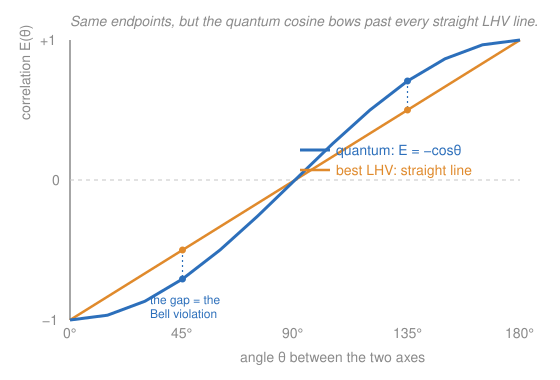

# Quantum Mechanics · Lesson 5.3: Bell's inequality and nonlocality

> ⏱ ~15 min · Module 5: Identical particles and entanglement · Builds on: [5.2 Tensor products and entanglement](#/lesson/quantum-mechanics/05-02-tensor-products-entanglement.md), [4.6 Addition of angular momenta](#/lesson/quantum-mechanics/04-06-addition-angular-momenta.md), [4.5 Spin, Pauli, and Stern–Gerlach](#/lesson/quantum-mechanics/04-05-spin-pauli-stern-gerlach.md) · Unlocks: 5.4 mixed states and the density matrix; **Boss Problem 5**

## Why this matters

For thirty years the question "is quantum mechanics the whole story, or is there a deeper deterministic layer underneath?" looked like philosophy — untestable, a matter of taste. Then John Bell did something extraordinary in 1964: he turned it into a **number you can measure in a lab**. He showed that *any* theory in which particles carry pre-set answers and nothing travels faster than light must obey a hard ceiling on how correlated two distant measurements can be — and that quantum mechanics predicts a violation of that ceiling. The experiments were done (Aspect in the 1980s, loophole-free in 2015), quantum mechanics won, and the 2022 Nobel Prize honored it. This is arguably the deepest experimental result in physics: nature is **not** locally deterministic. It's also your Boss Problem for this module, and the conceptual engine behind quantum cryptography and quantum computing.

## The idea

Start with Einstein's discomfort. Take the two-spin **singlet** you built from adding angular momenta ([4.6](#/lesson/quantum-mechanics/04-06-addition-angular-momenta.md)),

$$|\Psi^-\rangle = \tfrac{1}{\sqrt{2}}\big(|{\uparrow\downarrow}\rangle - |{\downarrow\uparrow}\rangle\big),$$

and send one spin to **Alice** and the other, light-years away, to **Bob**. Measure both along the same axis and you *always* get opposite results — perfect anticorrelation. Einstein, Podolsky, and Rosen (EPR, 1935) argued: since Alice's outcome lets her predict Bob's with certainty, without touching it, Bob's spin must have *had* a definite value all along. The correlation is no more mysterious than mailing one glove to Alice and one to Bob — open Alice's box, see "left," and you instantly "know" Bob has "right." Nothing spooky, just **pre-arranged answers**. EPR concluded quantum mechanics is *incomplete*: there must be **local hidden variables** (LHV) — extra data $\lambda$ each particle carries that predetermines every measurement outcome, so no faster-than-light "spooky action" is needed.

Bell's genius was to notice: gloves and quantum spins agree when you measure along the *same* axis — but what if Alice and Bob choose *different* axes? A local-hidden-variable world and the quantum world make **different numerical predictions** there. Bell packaged the difference into one inequality that every LHV theory must satisfy and quantum mechanics breaks. The philosophy became an experiment.

## The formal version

**The setup.** Alice picks a measurement axis (a unit vector) from two choices, $\hat a$ or $\hat a'$; Bob picks $\hat b$ or $\hat b'$. Each measures the spin component $\vec\sigma\cdot\hat n$ (Pauli operator along their axis), always getting an eigenvalue of $\pm 1$. Repeating over many singlet pairs, they estimate the **correlation**

$$E(\hat a,\hat b) = \langle\Psi^-|(\vec\sigma\cdot\hat a)\otimes(\vec\sigma\cdot\hat b)|\Psi^-\rangle = \text{average of (Alice's } \pm1)\times(\text{Bob's }\pm1).$$

*In words: $E=+1$ means their outcomes always match, $E=-1$ always oppose, $E=0$ no correlation.*

**The quantum correlation.** For the singlet,

$$\boxed{\,E(\hat a,\hat b) = -\,\hat a\cdot\hat b = -\cos\theta_{ab}\,}$$

where $\theta_{ab}$ is the angle between the two axes. *In words: aligned axes ($\theta=0$) give perfect anticorrelation $-1$; perpendicular axes give $0$; opposite axes give $+1$.*

*Derivation.* The singlet is perfectly anticorrelated on a common axis, so if Alice measures along $\hat a$ and gets $+1$, Bob's spin collapses to "down along $\hat a$," i.e. it points in direction $-\hat a$. Bob then measures along $\hat b$, which makes angle $\theta_{ab}$ with $\hat a$ (hence $\pi-\theta_{ab}$ with $-\hat a$). The Born rule for spin-½ gives Bob outcome $+1$ with probability $\cos^2\!\big(\tfrac{\pi-\theta_{ab}}{2}\big)=\sin^2\!\tfrac{\theta_{ab}}{2}$ and $-1$ with probability $\cos^2\tfrac{\theta_{ab}}{2}$. So the product $AB$ averages to

$$\langle AB\rangle_{A=+1} = (+1)\sin^2\tfrac{\theta_{ab}}{2} + (-1)\cos^2\tfrac{\theta_{ab}}{2} = -\cos\theta_{ab},$$

using $\cos^2\tfrac\theta2-\sin^2\tfrac\theta2=\cos\theta$. Alice getting $-1$ gives the same by symmetry, so $E(\hat a,\hat b)=-\cos\theta_{ab}$. $\;\blacksquare$

**The CHSH inequality (the Bell ceiling).** Form the combination (Clauser–Horne–Shimony–Holt, 1969)

$$S = E(\hat a,\hat b) - E(\hat a,\hat b') + E(\hat a',\hat b) + E(\hat a',\hat b').$$

**Claim: every local hidden-variable theory obeys $|S|\le 2$.** *In words: if outcomes are pre-set locally, these four correlations can't jointly exceed 2.*

*Proof.* In an LHV theory each particle carries $\lambda$ that fixes the answers: Alice's outcome is a function $A(\hat a,\lambda)=\pm1$ (depending only on *her* axis and $\lambda$, **not** Bob's choice — that's the *locality* assumption), likewise $B(\hat b,\lambda)=\pm1$. For a single $\lambda$,

$$A(\hat a)\big[B(\hat b)-B(\hat b')\big] + A(\hat a')\big[B(\hat b)+B(\hat b')\big].$$

Since $B(\hat b),B(\hat b')\in\{-1,+1\}$, exactly one of the brackets $\big[B(\hat b)\mp B(\hat b')\big]$ is $0$ and the other is $\pm2$. So this whole expression equals $\pm2$ for *every* $\lambda$. Averaging over $\lambda$ (an average of numbers each $\pm2$) can only shrink the magnitude: $|S|\le 2$. $\;\blacksquare$

**The quantum violation.** Plug the quantum $E=-\cos\theta$ into $S$ and choose the coplanar axes at
$$\hat a = 0^\circ,\quad \hat b = 45^\circ,\quad \hat a' = 90^\circ,\quad \hat b' = 135^\circ.$$
Then $\theta_{ab}=\theta_{a'b}=\theta_{a'b'}=45^\circ$ and $\theta_{ab'}=135^\circ$, so (Example 2 below)

$$S = -2\sqrt{2}\approx -2.83,\qquad |S| = 2\sqrt{2} > 2.$$

Quantum mechanics blows through the LHV ceiling. And $2\sqrt2$ is not just *a* violation — it is the **maximum** any quantum theory allows (the **Tsirelson bound**); no choice of axes or state does better. *In words: no local-hidden-variable theory can reproduce quantum mechanics — nature is genuinely nonlocal.*

**No faster-than-light signaling.** This nonlocality cannot send a message. Alice's *marginal* outcome is completely random: $\langle\Psi^-|(\vec\sigma\cdot\hat a)\otimes\mathbb{1}|\Psi^-\rangle = 0$, so she gets $+1$ and $-1$ with probability $\tfrac12$ each **no matter what Bob does or which axis he picks**. She sees only noise; the correlation reveals itself only when the two distant records are later brought together and compared. *In words: the spookiness lives in the correlations, not in either side alone — so causality and relativity survive.*

## Picture

Both predictions pin down at the ends — perfect anticorrelation ($-1$) for aligned axes, perfect correlation ($+1$) for opposite axes. In between, the quantum cosine **bows past** the straight line any local-hidden-variable theory is stuck on (the orange line is the best one can do; see P3). At $45^\circ$ the quantum anticorrelation is $-\tfrac{1}{\sqrt2}\approx-0.71$ but the LHV best is only $-0.5$. That excess correlation, accumulated over the four CHSH terms, is what pushes $S$ from $2$ up to $2\sqrt2$.

## Worked examples

**Example 1 (mechanical — read the correlation off the angle).** Using $E(\hat a,\hat b)=-\cos\theta_{ab}$:

| $\theta_{ab}$ | $E$ | meaning |
|---|---|---|
| $0^\circ$ | $-\cos 0 = -1$ | always opposite (perfect anticorrelation) |
| $60^\circ$ | $-\cos 60^\circ = -0.5$ | oppose 75% of the time |
| $90^\circ$ | $-\cos 90^\circ = 0$ | uncorrelated |
| $120^\circ$ | $-\cos 120^\circ = +0.5$ | agree 75% of the time |
| $180^\circ$ | $-\cos 180^\circ = +1$ | always the same |

(The "75%" reading: outcomes oppose with probability $\tfrac{1+|E|}{2}=\cos^2\tfrac\theta2$ when $E<0$. At $60^\circ$ that's $\cos^2 30^\circ = 0.75$.)

**Example 2 (why you'd care — the CHSH violation, fully computed).** Take the optimal coplanar axes $\hat a=0^\circ,\ \hat b=45^\circ,\ \hat a'=90^\circ,\ \hat b'=135^\circ$. Compute each correlation from the axis angle:

$$
\begin{aligned}
E(\hat a,\hat b)   &= -\cos(45^\circ) = -\tfrac{1}{\sqrt2}, &\quad
E(\hat a,\hat b')  &= -\cos(135^\circ) = +\tfrac{1}{\sqrt2},\\[2pt]
E(\hat a',\hat b)  &= -\cos(45^\circ) = -\tfrac{1}{\sqrt2}, &\quad
E(\hat a',\hat b') &= -\cos(45^\circ) = -\tfrac{1}{\sqrt2}.
\end{aligned}
$$

Assemble $S$, watching the **minus** sign on the second term (which flips the $+\tfrac{1}{\sqrt2}$ into a $-\tfrac{1}{\sqrt2}$ contribution):

$$
S = \underbrace{-\tfrac{1}{\sqrt2}}_{E(\hat a,\hat b)} \;-\; \underbrace{\big(+\tfrac{1}{\sqrt2}\big)}_{E(\hat a,\hat b')} \;+\; \underbrace{\big(-\tfrac{1}{\sqrt2}\big)}_{E(\hat a',\hat b)} \;+\; \underbrace{\big(-\tfrac{1}{\sqrt2}\big)}_{E(\hat a',\hat b')} = -\frac{4}{\sqrt2} = -2\sqrt2.
$$

So $|S| = 2\sqrt2 \approx 2.83 > 2$ — the LHV ceiling is broken by a comfortable $41\%$. Every one of the four terms happens to contribute $-\tfrac{1}{\sqrt2}$; that's the magic of the $45^\circ$ staircase, and it's exactly the Tsirelson maximum. A real experiment doesn't need the optimum: it just needs to land a measured $S$ several error bars above $2$, which is what Aspect (1982) and the loophole-free tests (Hensen/Giustina/Shalm, 2015) did.

## Watch out

- You might think a Bell violation lets Alice **signal** Bob instantly. It does not. Alice's outcomes are $50/50$ random regardless of Bob's setting (the marginals are flat), so no information rides the correlation — you only *see* the correlation by comparing both logs afterward, a comparison limited by light-speed. Nonlocal correlations, yes; nonlocal communication, no.
- You might think the measurement "**changes** the far particle" or "sends" it something. Nothing is sent, and there's no preferred order — whose measurement is "first" is frame-dependent in relativity. The lesson of Bell is subtler: the outcomes simply weren't predetermined by any local $\lambda$. Don't read a causal arrow into a correlation.
- You might think "the particles were just correlated at the source, like Bertlmann's socks." That is *exactly* the local-hidden-variable hypothesis — and it is the thing Bell's inequality **rules out**. Pre-set answers cap $S$ at $2$; nature gives $2\sqrt2$. Classical shared randomness is not enough.
- You might think one clean experiment settled it. The violation is real, but experiments must close **loopholes** (detection efficiency, and locality — the axis choices must be made too far apart and too fast for any signal to coordinate them). No single early experiment closed all at once; the 2015 experiments did, which is why they mattered.

## One-liner

> Any world with pre-set local answers obeys $|S|\le 2$; the quantum singlet reaches $2\sqrt2$ — so reality is nonlocal, though the randomness of each side keeps it from ever sending a signal.

## Problems

**P1 (🟢)** Two experimenters share singlets. Compute the correlation $E(\hat a,\hat b)=-\cos\theta_{ab}$ when their axes differ by (a) $\theta = 30^\circ$, and (b) $\theta = 120^\circ$. For each, state in one phrase whether the outcomes mostly agree or mostly oppose.

**P2 (🟡)** Correlations and the fragility of the effect.
(a) Alice and Bob get sloppy and use axes $\hat a=0^\circ,\ \hat b=30^\circ,\ \hat a'=60^\circ,\ \hat b'=90^\circ$ (a $30^\circ$ staircase instead of $45^\circ$). Compute $S = E(\hat a,\hat b)-E(\hat a,\hat b')+E(\hat a',\hat b)+E(\hat a',\hat b')$. Is it still a violation?
(b) Show that if Bob uses only *one* axis ($\hat b'=\hat b$), then $|S|\le 2$ automatically — no matter what anyone measures. What does this say about how many settings each side needs?

**P3 (🔴, optional)** Build the best local-hidden-variable model and show it caps at $S=2$. Let the hidden variable be a unit vector $\hat\lambda$, shared by both particles and uniformly random over the sphere. Alice, measuring along $\hat a$, returns $A=\operatorname{sign}(\hat\lambda\cdot\hat a)$; Bob returns $B=-\operatorname{sign}(\hat\lambda\cdot\hat b)$ (the minus builds in the singlet's anticorrelation).
(a) Argue that the correlation is $E_{\text{LHV}}(\theta) = -1 + \dfrac{2\theta}{\pi}$ — a straight line (a "triangle wave" once you extend it), *not* the cosine.
(b) Plug this into $S$ at the optimal angles $\hat a=0^\circ,\hat b=45^\circ,\hat a'=90^\circ,\hat b'=135^\circ$ and show $S = -2$ exactly. Contrast with the quantum $-2\sqrt2$: the LHV model *saturates* Bell's bound but can never exceed it, while the cosine does.

Solutions

**P1** (a) $E = -\cos 30^\circ = -\tfrac{\sqrt3}{2}\approx -0.87$ — strongly anticorrelated, so the outcomes **mostly oppose** (they differ with probability $\cos^2 15^\circ\approx 0.93$). (b) $E = -\cos 120^\circ = -(-\tfrac12) = +0.5$ — positive, so the outcomes **mostly agree** (same result with probability $\tfrac{1+0.5}{2}=0.75$).

**P2** (a) Compute the four correlations from the axis-angle differences:
$$E(\hat a,\hat b)=-\cos 30^\circ=-\tfrac{\sqrt3}{2},\quad E(\hat a,\hat b')=-\cos 90^\circ=0,$$
$$E(\hat a',\hat b)=-\cos 30^\circ=-\tfrac{\sqrt3}{2},\quad E(\hat a',\hat b')=-\cos 30^\circ=-\tfrac{\sqrt3}{2}.$$
Then
$$S = -\tfrac{\sqrt3}{2} - 0 + \left(-\tfrac{\sqrt3}{2}\right) + \left(-\tfrac{\sqrt3}{2}\right) = -\tfrac{3\sqrt3}{2} \approx -2.60.$$
So $|S|\approx 2.60 > 2$ — **still a violation**, just not maximal ($2.60 < 2\sqrt2\approx 2.83$). The effect is robust: you don't need perfect angles, only good enough ones. (This is why real experiments, with imperfect alignment and noise, still clear the bound.)

(b) Set $\hat b'=\hat b$, so $E(\hat a,\hat b')=E(\hat a,\hat b)$ and $E(\hat a',\hat b')=E(\hat a',\hat b)$. Then
$$S = E(\hat a,\hat b) - E(\hat a,\hat b) + E(\hat a',\hat b) + E(\hat a',\hat b) = 2\,E(\hat a',\hat b),$$
and since every correlation satisfies $|E|\le 1$, we get $|S| = 2|E(\hat a',\hat b)|\le 2$. **No violation is possible.** The moral: the CHSH test genuinely needs *two distinct settings on each side*. A Bell experiment is about the impossibility of jointly assigning outcomes to *counterfactual* measurements — settings you could have chosen but didn't — and collapsing Bob to one axis removes the counterfactual that creates the tension.

**P3** (a) The correlation is $E_{\text{LHV}}(\theta)=\langle AB\rangle = -\big\langle \operatorname{sign}(\hat\lambda\cdot\hat a)\,\operatorname{sign}(\hat\lambda\cdot\hat b)\big\rangle$. The product of signs is $+1$ when $\hat\lambda$ lies on the same side of both planes $\hat\lambda\cdot\hat a=0$ and $\hat\lambda\cdot\hat b=0$, and $-1$ otherwise. These two great-circle planes split the sphere into wedges; the fraction of directions on which the two signs *disagree* is exactly the lune fraction $\theta/\pi$ (the two half-spaces overlap in a wedge of opening angle $\theta$). Hence
$$\big\langle \operatorname{sign}\cdot\operatorname{sign}\big\rangle = P(\text{agree}) - P(\text{disagree}) = \Big(1-\tfrac{\theta}{\pi}\Big) - \tfrac{\theta}{\pi} = 1 - \tfrac{2\theta}{\pi},$$
so $E_{\text{LHV}}(\theta) = -\big(1-\tfrac{2\theta}{\pi}\big) = -1 + \dfrac{2\theta}{\pi}$. This is **linear** in $\theta$: it matches the quantum cosine at $\theta=0,90^\circ,180^\circ$ but is too shallow in between (the straight line in the Picture).

(b) With $\theta$ in radians, at $\hat a=0,\hat b=\tfrac\pi4,\hat a'=\tfrac\pi2,\hat b'=\tfrac{3\pi}4$:
$$E(\hat a,\hat b)=-1+\tfrac{2}{\pi}\cdot\tfrac\pi4=-\tfrac12,\quad E(\hat a,\hat b')=-1+\tfrac{2}{\pi}\cdot\tfrac{3\pi}4=+\tfrac12,$$
$$E(\hat a',\hat b)=-\tfrac12,\quad E(\hat a',\hat b')=-\tfrac12 \quad(\text{all three }45^\circ\text{ gaps}).$$
Then
$$S = -\tfrac12 - \big(+\tfrac12\big) + \big(-\tfrac12\big) + \big(-\tfrac12\big) = -2.$$
So $|S| = 2$ **exactly** — this hidden-variable model rides right up to Bell's ceiling but cannot cross it, precisely as the general proof guarantees. The quantum singlet, using the same angles, reaches $2\sqrt2$: the extra $\sqrt2$ is the measurable gap between "pre-set local answers" and reality. No straight line can mimic the cosine's bow.

## Flashback

**From Lesson 5.2 (Tensor products and entanglement):** Prove the singlet $|\Psi^-\rangle=\tfrac{1}{\sqrt2}\big(|{\uparrow\downarrow}\rangle-|{\downarrow\uparrow}\rangle\big)$ is **entangled** — that no choice of single-spin states makes it a product $|\alpha\rangle\otimes|\beta\rangle$. (This is the property that gives the whole lesson its teeth.)

Solution

Suppose it *were* a product. Write the most general single-spin states $|\alpha\rangle = a|{\uparrow}\rangle + b|{\downarrow}\rangle$ and $|\beta\rangle = c|{\uparrow}\rangle + d|{\downarrow}\rangle$. Their tensor product is
$$|\alpha\rangle\otimes|\beta\rangle = ac\,|{\uparrow\uparrow}\rangle + ad\,|{\uparrow\downarrow}\rangle + bc\,|{\downarrow\uparrow}\rangle + bd\,|{\downarrow\downarrow}\rangle.$$
Matching coefficients against $|\Psi^-\rangle$ (which has no $|{\uparrow\uparrow}\rangle$ or $|{\downarrow\downarrow}\rangle$ part) requires
$$ac = 0,\qquad bd = 0,\qquad ad = \tfrac{1}{\sqrt2},\qquad bc = -\tfrac{1}{\sqrt2}.$$
From $ac=0$, either $a=0$ or $c=0$. If $a=0$ then $ad=0\ne \tfrac1{\sqrt2}$ — contradiction. If $c=0$ then $bc=0\ne -\tfrac1{\sqrt2}$ — contradiction. No factorization exists, so the singlet is **entangled**. $\;\blacksquare$ (A product state would obey the CHSH bound; it's precisely the non-factorizability that lets the singlet reach $2\sqrt2$.)

## Connections

- **Backward:** the state is the $j=0$ singlet from adding two spin-½'s in [4.6](#/lesson/quantum-mechanics/04-06-addition-angular-momenta.md); "entangled = non-factorizable" and the Bell states are straight from [5.2](#/lesson/quantum-mechanics/05-02-tensor-products-entanglement.md); the $\pm1$ outcomes of $\vec\sigma\cdot\hat n$ and the Born probabilities $\cos^2\tfrac\theta2$ are the spin-measurement machinery of [4.5](#/lesson/quantum-mechanics/04-05-spin-pauli-stern-gerlach.md). This lesson **is Boss Problem 5**: measure the singlet along axes separated by $\theta$, get $\langle\vec\sigma_a\otimes\vec\sigma_b\rangle=-\cos\theta$, and violate CHSH.
- **Forward:** [5.4](#/lesson/quantum-mechanics/05-04-density-matrix-mixed-states.md) explains *why Alice's marginal is random* — her half of an entangled pair is a **mixed state** described by a reduced density matrix $\rho_A = \tfrac12\mathbb{1}$, the maximally uncertain one. Decoherence (a mixed-state phenomenon) is why we don't see Bell violations at everyday scales.
- **Sideways (probability & information):** the CHSH proof is a statement about **joint distributions that don't exist** — you cannot assign consistent $\pm1$ values to all four counterfactual measurements at once. That impossibility of a global joint distribution is the probabilist's version of nonlocality, and the resource that quantum key distribution (BB84/E91) turns into provably secure encryption: an eavesdropper who pre-sets answers would lower $S$ below $2\sqrt2$ and be caught.
