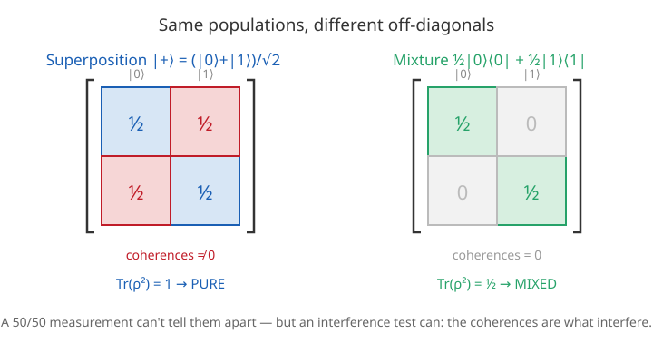

# Quantum Mechanics · Lesson 5.4: Mixed states and the density matrix

> ⏱ ~15 min · Module 5: Identical particles and entanglement · Builds on: [1.5 Measurement & expectation values](#/lesson/quantum-mechanics/01-05-measurement-expectation-values.md), [5.2 Tensor products & entanglement](#/lesson/quantum-mechanics/05-02-tensor-products-entanglement.md) · Unlocks: Module 6 (approximation methods) — and the whole language of open systems, decoherence, and quantum information

## Why this matters

A state vector $|\psi\rangle$ encodes **maximal** knowledge: you know the system's state exactly, down to every relative phase. But two very ordinary situations blow past what a single ket can say. First, **classical ignorance** — a machine spits out $|\!\uparrow\rangle$ half the time and $|\!\downarrow\rangle$ half the time, and you don't know which you got. That's a *probability distribution over states*, not a superposition, and no single $|\psi\rangle$ represents it. Second, and more deeply quantum: take an entangled pair and look at **just one particle**. Even when the *pair* is in a perfectly definite pure state, the single particle you hold has no state vector of its own. The density matrix $\rho$ is the object that handles both — it is the correct, complete description of a quantum system whenever you have less than total information about it. It's also the working language of decoherence, quantum computing, and open-system dynamics, so this lesson is the door into all of them.

## The idea

Think of two different coins. Coin A is a fair superposition: the *balanced* state $|+\rangle = \tfrac{1}{\sqrt2}(|0\rangle + |1\rangle)$. It is one definite quantum state — spin pointing crisply along $+x$. Coin B is a shoebox with a 50/50 *classical mixture*: half the slips inside say "$|0\rangle$", half say "$|1\rangle$", and you draw blind.

Measure either one in the $\{|0\rangle,|1\rangle\}$ basis and you get 0 or 1 with probability $\tfrac12$ — **identical statistics**. Yet they are physically different objects: rotate your measuring axis to $x$ and Coin A gives "$+x$" *with certainty*, while Coin B still shrugs out 50/50. The superposition carries a **phase relationship** between $|0\rangle$ and $|1\rangle$ that the mixture has thrown away. The density matrix is built precisely so that this difference is visible — it lives in the **off-diagonal** entries, the *coherences*. Superposition: coherences present. Mixture: coherences gone. Same diagonal, different matrix.

The punchline of the lesson: a mixture is what a pure entangled state *looks like from the inside*. Tracing out a partner turns global purity into local mixedness. Entanglement is exactly the price of local ignorance.

## The formal version

**The density operator.** For a *mixture* — state $|\psi_i\rangle$ occurring with classical probability $p_i$ (with $\sum_i p_i = 1$, $p_i \geq 0$) — define

$$\rho = \sum_i p_i\,|\psi_i\rangle\langle\psi_i|.$$

In words: weight each state's projector by how likely it is, and add. A single pure state $|\psi\rangle$ is the special case $\rho = |\psi\rangle\langle\psi|$ (one term, $p=1$).

**Its three defining properties.** Any legal $\rho$ is
- **Hermitian**, $\rho^\dagger = \rho$ (each $|\psi_i\rangle\langle\psi_i|$ is; a real-weighted sum stays Hermitian) — so its eigenvalues are real;
- **positive semidefinite**, $\langle\phi|\rho|\phi\rangle \geq 0$ for all $|\phi\rangle$ — those eigenvalues are $\geq 0$, they're honest probabilities;
- **unit trace**, $\operatorname{Tr}\rho = \sum_i p_i = 1$.

In words: $\rho$ is a Hermitian, positive matrix whose diagonal entries (the populations) sum to 1.

**Expectation values.** For any observable $\hat A$,

$$\langle \hat A\rangle = \operatorname{Tr}(\rho\,\hat A).$$

In words: everything you can predict is a trace against $\rho$ — the density matrix *is* the state, in the sense that it delivers every measurable number. (Check the pure case: $\operatorname{Tr}(|\psi\rangle\langle\psi|\hat A) = \langle\psi|\hat A|\psi\rangle$, the old formula from [1.5](#/lesson/quantum-mechanics/01-05-measurement-expectation-values.md).)

**Pure vs. mixed — the purity test.** Because $\rho^2 = \rho$ iff $\rho$ is a single projector,

$$\operatorname{Tr}(\rho^2) = 1 \iff \text{pure}, \qquad \operatorname{Tr}(\rho^2) < 1 \iff \text{mixed}.$$

In words: the *purity* $\operatorname{Tr}(\rho^2)$ is 1 for a genuine state vector and drops below 1 the moment classical ignorance creeps in (minimum $1/d$ for the maximally mixed state in $d$ dimensions).

**The reduced density matrix (partial trace).** For a composite system $AB$ in state $\rho_{AB}$, subsystem $A$ alone is described by tracing out $B$:

$$\rho_A = \operatorname{Tr}_B\,\rho_{AB} = \sum_b \big(\mathbb{1}_A \otimes \langle b|_B\big)\,\rho_{AB}\,\big(\mathbb{1}_A \otimes |b\rangle_B\big),$$

where $\{|b\rangle_B\}$ is any orthonormal basis of $B$. The one rule you actually use: $\operatorname{Tr}_B\big(|a\rangle\langle a'| \otimes |b\rangle\langle b'|\big) = |a\rangle\langle a'|\,\langle b'|b\rangle$ — keep the $A$ part, collapse the $B$ part to $\delta_{b b'}$. In words: $\rho_A$ is the object that reproduces every measurement done on $A$ alone, ignoring $B$. **Key fact:** if $\rho_{AB}$ is a *pure entangled* state, $\rho_A$ is *mixed*. Local mixedness is the signature of entanglement.

## Picture

## Worked examples

**Example 1 (mechanical — superposition vs. mixture, side by side).** In the basis $|0\rangle = \binom{1}{0}$, $|1\rangle = \binom{0}{1}$:

*Superposition* $|+\rangle = \tfrac{1}{\sqrt2}(|0\rangle+|1\rangle)$:

$$\rho_+ = |+\rangle\langle+| = \tfrac12\begin{pmatrix}1\\1\end{pmatrix}\begin{pmatrix}1&1\end{pmatrix} = \frac12\begin{pmatrix}1&1\\1&1\end{pmatrix}.$$

Trace $=\tfrac12+\tfrac12 = 1$. Purity: $\rho_+^2 = \tfrac14\begin{pmatrix}2&2\\2&2\end{pmatrix} = \tfrac12\begin{pmatrix}1&1\\1&1\end{pmatrix} = \rho_+$, so $\operatorname{Tr}(\rho_+^2) = 1$ → **pure**. The off-diagonal $\tfrac12$'s are the coherences.

*Mixture* (50/50 of $|0\rangle$ and $|1\rangle$):

$$\rho_{\text{mix}} = \tfrac12|0\rangle\langle0| + \tfrac12|1\rangle\langle1| = \frac12\begin{pmatrix}1&0\\0&1\end{pmatrix} = \tfrac12\mathbb{1}.$$

Trace $= 1$ (same populations!). Purity: $\rho_{\text{mix}}^2 = \tfrac14\mathbb{1}$, so $\operatorname{Tr}(\rho_{\text{mix}}^2) = \tfrac12 < 1$ → **mixed**. The diagonals match $\rho_+$ exactly; only the coherences differ. That single algebraic difference *is* the physical difference between "definitely pointing along $+x$" and "a coin flip between $z$-up and $z$-down."

**Example 2 (the payoff — a Bell state's subsystem is maximally mixed).** Take the singlet, a *pure* two-qubit state:

$$|\Psi^-\rangle = \tfrac{1}{\sqrt2}\big(|01\rangle - |10\rangle\big), \qquad \rho_{AB} = |\Psi^-\rangle\langle\Psi^-|.$$

Expand the projector (writing $|ab\rangle = |a\rangle_A|b\rangle_B$):

$$\rho_{AB} = \tfrac12\Big(|01\rangle\langle01| - |01\rangle\langle10| - |10\rangle\langle01| + |10\rangle\langle10|\Big).$$

Trace out $B$ using $\operatorname{Tr}_B(|ab\rangle\langle a'b'|) = |a\rangle\langle a'|\,\delta_{bb'}$. Go term by term:

- $|01\rangle\langle01| \to |0\rangle\langle0|\,\delta_{11} = |0\rangle\langle0|$
- $|01\rangle\langle10| \to |0\rangle\langle1|\,\delta_{01} = 0$ (the $B$ labels $1$ and $0$ don't match)
- $|10\rangle\langle01| \to |1\rangle\langle0|\,\delta_{10} = 0$
- $|10\rangle\langle10| \to |1\rangle\langle1|\,\delta_{00} = |1\rangle\langle1|$

The cross terms die because tracing demands matching $B$-indices. So

$$\rho_A = \tfrac12\big(|0\rangle\langle0| + |1\rangle\langle1|\big) = \tfrac12\mathbb{1}.$$

Purity $\operatorname{Tr}(\rho_A^2) = \tfrac12$ — **maximally mixed**. Read that again: the *pair* is in a perfectly definite state (you could verify $\operatorname{Tr}(\rho_{AB}^2)=1$), yet electron $A$ *by itself* is as random as a fair coin, its spin equally likely along any axis. Nothing is "hidden inside" $A$; the missing information lives in the **correlations** with $B$. This is why entanglement and local mixedness are two faces of one coin — and why the singlet's perfect anticorrelations (Lesson [5.3](#/lesson/quantum-mechanics/05-03-bell-inequality-nonlocality.md)) coexist with each spin looking totally random on its own.

**Decoherence preview.** Now let $B$ be not a partner qubit but the **environment** — air molecules, photons, the lab. A pointer left in a superposition $\tfrac{1}{\sqrt2}(|{\text{here}}\rangle + |{\text{there}}\rangle)$ instantly entangles with $10^{23}$ environmental degrees of freedom. We only ever access the pointer, i.e. $\rho_{\text{pointer}} = \operatorname{Tr}_{\text{env}}(\dots)$ — and the partial trace, exactly as above, *scrubs the off-diagonal coherences to zero*. The pure superposition becomes an effective classical mixture "here **or** there." That is the practical answer to "why don't we see macroscopic superpositions?": we do, briefly — the environment just measures them for us, absurdly fast, and we're left holding a diagonal $\rho$.

## Watch out

- You might think a superposition and a 50/50 mixture are "the same random thing." They give the same statistics **only in one basis**. Change basis (rotate the measurement axis) and the superposition's certainty reappears while the mixture stays random. The coherences are physical — they interfere.
- You might think $\rho_A$ being mixed means the total state $\rho_{AB}$ is mixed too. Opposite can hold: a **pure** entangled whole has **mixed** parts. Purity is not inherited by subsystems. (And: $\rho_A$ pure $\iff$ the state is a *product* — no entanglement.)
- You might think the ensemble $\{p_i,|\psi_i\rangle\}$ is recoverable from $\rho$. It is **not** — different mixtures give the *same* $\rho$ (e.g. $\tfrac12|0\rangle\langle0|+\tfrac12|1\rangle\langle1| = \tfrac12|+\rangle\langle+|+\tfrac12|-\rangle\langle-| = \tfrac12\mathbb{1}$). Only $\rho$ is physical; the "recipe" is not. Don't over-read the decomposition.
- $\operatorname{Tr}(\rho^2) \le 1$ **always**, with equality *only* for pure states — it can never exceed 1. If your arithmetic gives $>1$, a normalization or a stray factor slipped.

## One-liner

> A pure state is a mixture with all its coherences intact; trace out a partner and those coherences vanish — entanglement seen from one side *is* mixedness.

## Problems

**P1 (🟢)** A qubit is described by $\rho = \begin{pmatrix} 0.7 & 0.3 \\ 0.3 & 0.3 \end{pmatrix}$. (a) Verify $\operatorname{Tr}\rho = 1$. (b) Compute $\operatorname{Tr}(\rho^2)$ and decide whether the state is pure or mixed.

**P2 (🟡)** Write the density matrices of (a) the superposition $|\psi\rangle = \tfrac{1}{\sqrt2}(|0\rangle + i|1\rangle)$ and (b) the 50/50 classical mixture of $|0\rangle$ and $|1\rangle$. Identify the coherence terms in each, confirm the diagonals agree, and compute both purities to confirm one is pure and one is mixed.

**P3 (🔴, optional)** Take the Bell state $|\Phi^+\rangle = \tfrac{1}{\sqrt2}(|00\rangle + |11\rangle)$. Form $\rho_{AB} = |\Phi^+\rangle\langle\Phi^+|$, trace out qubit $B$ to get $\rho_A$, and show $\operatorname{Tr}(\rho_A^2) = \tfrac12$ (maximally mixed) — even though the pair is pure. Then, in one sentence, say what this implies about a local measurement on $A$ and connect it to the singlet's perfect anticorrelation from Lesson 5.3.

Solutions

**P1** (a) $\operatorname{Tr}\rho = 0.7 + 0.3 = 1$. ✓ (It's also Hermitian with real diagonal, and one can check it's positive — eigenvalues $\approx 0.86, 0.14 \ge 0$.)

(b) Compute $\rho^2$:
$$\rho^2 = \begin{pmatrix}0.7&0.3\\0.3&0.3\end{pmatrix}\begin{pmatrix}0.7&0.3\\0.3&0.3\end{pmatrix} = \begin{pmatrix}0.49+0.09 & 0.21+0.09\\ 0.21+0.09 & 0.09+0.09\end{pmatrix} = \begin{pmatrix}0.58 & 0.30\\0.30 & 0.18\end{pmatrix}.$$
$\operatorname{Tr}(\rho^2) = 0.58 + 0.18 = 0.76 < 1$ → **mixed**. (Shortcut for any $2\times2$ $\rho$: $\operatorname{Tr}(\rho^2) = \sum_{ij}|\rho_{ij}|^2 = 0.7^2 + 0.3^2 + 0.3^2 + 0.3^2 = 0.49+0.09+0.09+0.09 = 0.76$. ✓)

**P2** (a) $|\psi\rangle = \tfrac{1}{\sqrt2}\binom{1}{i}$, so $\langle\psi| = \tfrac{1}{\sqrt2}(1,\,-i)$ (conjugate the $i$):
$$\rho_\psi = \tfrac12\binom{1}{i}(1,\,-i) = \tfrac12\begin{pmatrix}1 & -i\\ i & 1\end{pmatrix}.$$
Coherences: the off-diagonals $\mp i/2$ (nonzero → phase info present). Purity: for a pure state it must be 1; check $\operatorname{Tr}(\rho_\psi^2) = |{\tfrac12}|^2 + |{-\tfrac{i}{2}}|^2 + |{\tfrac{i}{2}}|^2 + |{\tfrac12}|^2 = \tfrac14\cdot4 = 1$ → **pure**. ✓ (Hermiticity check: the $(2,1)$ entry $i/2$ is the conjugate of the $(1,2)$ entry $-i/2$. ✓)

(b) $\rho_{\text{mix}} = \tfrac12|0\rangle\langle0| + \tfrac12|1\rangle\langle1| = \tfrac12\begin{pmatrix}1&0\\0&1\end{pmatrix}$. Coherences: **zero**. Purity: $\operatorname{Tr}(\rho_{\text{mix}}^2) = (\tfrac12)^2 + (\tfrac12)^2 = \tfrac12 < 1$ → **mixed**.

Diagonals of both are $(\tfrac12,\tfrac12)$ — identical populations, so a $z$-measurement can't distinguish them. The *only* difference is the coherences $\mp i/2$, which encode that $|\psi\rangle$ points definitely along a specific axis in the $x$–$y$ plane (here, $+y$).

**P3** $\rho_{AB} = |\Phi^+\rangle\langle\Phi^+| = \tfrac12\big(|00\rangle\langle00| + |00\rangle\langle11| + |11\rangle\langle00| + |11\rangle\langle11|\big)$.

Trace out $B$ with $\operatorname{Tr}_B(|ab\rangle\langle a'b'|) = |a\rangle\langle a'|\,\delta_{bb'}$:
- $|00\rangle\langle00| \to |0\rangle\langle0|\,\delta_{00} = |0\rangle\langle0|$
- $|00\rangle\langle11| \to |0\rangle\langle1|\,\delta_{01} = 0$
- $|11\rangle\langle00| \to |1\rangle\langle0|\,\delta_{10} = 0$
- $|11\rangle\langle11| \to |1\rangle\langle1|\,\delta_{11} = |1\rangle\langle1|$

$$\rho_A = \tfrac12\big(|0\rangle\langle0| + |1\rangle\langle1|\big) = \tfrac12\mathbb{1}, \qquad \operatorname{Tr}(\rho_A^2) = (\tfrac12)^2 + (\tfrac12)^2 = \tfrac12.$$

Maximally mixed, even though $\operatorname{Tr}(\rho_{AB}^2) = 1$ (the pair is pure). **Implication:** a measurement on $A$ alone — in *any* basis — is a perfect coin flip; $A$ carries no local information. Yet that randomness is perfectly *correlated* with $B$ (for $|\Phi^+\rangle$, same outcomes; for the singlet of Lesson [5.3](#/lesson/quantum-mechanics/05-03-bell-inequality-nonlocality.md), opposite outcomes). The information isn't in either half — it lives entirely in the correlations, which is what "maximally entangled" means.

## Flashback

**From Lesson 5.2 (Tensor products & entanglement):** Is the two-qubit state $|\chi\rangle = \tfrac12\big(|00\rangle - |01\rangle + |10\rangle - |11\rangle\big)$ entangled or a product state? If product, factor it; if entangled, say how you know.

Solution

Use the $2\times2$ product test: $a|00\rangle + b|01\rangle + c|10\rangle + d|11\rangle$ factors **iff** $ad = bc$. Here $a=\tfrac12,\ b=-\tfrac12,\ c=\tfrac12,\ d=-\tfrac12$, so $ad = -\tfrac14$ and $bc = -\tfrac14$ — equal, so it **is a product state**.

Factor by grouping: $\tfrac12\big(|0\rangle(|0\rangle-|1\rangle) + |1\rangle(|0\rangle-|1\rangle)\big) = \tfrac12(|0\rangle+|1\rangle)(|0\rangle-|1\rangle) = |+\rangle\otimes|-\rangle$.

Consistency check with this lesson: since $|\chi\rangle$ is a *product* state, its reduced density matrix $\rho_A = |+\rangle\langle+|$ is **pure** ($\operatorname{Tr}\rho_A^2 = 1$) — no local mixedness, exactly because there's no entanglement to trace away. Contrast the Bell states, whose parts come out maximally mixed.

## Connections

- **Backward:** the expectation rule $\langle\hat A\rangle = \operatorname{Tr}(\rho\hat A)$ generalizes $\langle\psi|\hat A|\psi\rangle$ from [1.5](#/lesson/quantum-mechanics/01-05-measurement-expectation-values.md); the partial trace acts on the tensor-product spaces built in [5.2](#/lesson/quantum-mechanics/05-02-tensor-products-entanglement.md), and it explains *why* the entangled correlations of [5.3](#/lesson/quantum-mechanics/05-03-bell-inequality-nonlocality.md) leave each subsystem locally random.
- **Forward:** $\rho$ is the state object for **open quantum systems** and **decoherence** — the mechanism that damps the coherences and hands classical mechanics back at large scales. It's also the native language of quantum information (entropy $S = -\operatorname{Tr}(\rho\ln\rho)$, quantum channels), and mixed-state ensembles reappear the moment you do **statistical mechanics** quantum-mechanically (the thermal state $\rho \propto e^{-\hat H/kT}$).
- **Sideways (probability/stat-mech):** $\rho$ is the quantum upgrade of a classical probability distribution — populations on the diagonal are an ordinary distribution, and the off-diagonal coherences are the extra, uniquely quantum, degrees of freedom. The purity $\operatorname{Tr}(\rho^2)$ plays the role a distribution's "concentration" does in `prob-stat-refresher`, and $-\operatorname{Tr}(\rho\ln\rho)$ is literally the Gibbs/Shannon entropy carried into Hilbert space.
