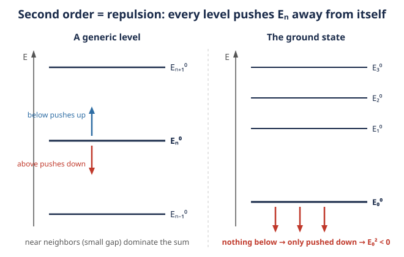

# Quantum Mechanics · Lesson 6.1: Time-independent perturbation theory (nondegenerate)

> ⏱ ~15 min · Module 6: Approximation methods · Builds on: [3.2 Harmonic oscillator: ladder operators](#/lesson/quantum-mechanics/03-02-harmonic-oscillator-ladder-operators.md), [2.3 The infinite square well](#/lesson/quantum-mechanics/02-03-infinite-square-well.md), [1.5 Measurement and expectation values](#/lesson/quantum-mechanics/01-05-measurement-expectation-values.md) · Unlocks: 6.2 degenerate perturbation theory, 6.3 variational principle

## Why this matters

You have spent five modules solving the handful of systems that surrender exactly: the well, the oscillator, hydrogen. That list is essentially complete — add a stray electric field, a second electron, an anharmonic wiggle, and the exact solution evaporates. **Almost nothing in nature is exactly solvable.** Perturbation theory is the trade that makes quantum mechanics predictive anyway: if your hard problem is a small deformation of an easy one, you can borrow the easy answer and correct it in powers of the deformation. The very first correction — $E_n^1 = \langle n^0|\hat H'|n^0\rangle$, the expectation value of the extra term in the unperturbed state — is the single most-used formula in all of quantum mechanics, from the Stark and Zeeman shifts to fine structure to the Lamb shift.

## The idea

Split the Hamiltonian into a part you already solved and a small leftover:

$$\hat H = \hat H_0 + \lambda \hat H',$$

where $\hat H_0$ has known eigenvalues $E_n^0$ and eigenstates $|n^0\rangle$, and $\lambda \hat H'$ is a *small* perturbation. The bookkeeping parameter $\lambda$ (think of it as a dial from $0$ to $1$) just tracks "how many powers of the small thing" a term carries; at the end you can set $\lambda = 1$.

The bet is that the true energy and state are *smooth deformations* of the unperturbed ones — turn the dial up slowly and everything drifts continuously, no jumps. So expand each as a power series in $\lambda$:

$$E_n = E_n^0 + \lambda E_n^1 + \lambda^2 E_n^2 + \cdots, \qquad |n\rangle = |n^0\rangle + \lambda|n^1\rangle + \lambda^2|n^2\rangle + \cdots$$

The whole method is just: substitute these series into $\hat H|n\rangle = E_n|n\rangle$, and demand it hold *at each power of $\lambda$ separately* (because $\lambda$ is a free dial — the coefficient of every power must independently vanish). That single move hands you a correction at each order, each expressed in the language you already own: matrix elements $\langle m^0|\hat H'|n^0\rangle$ and unperturbed energy gaps $E_n^0 - E_m^0$.

## The formal version

Substitute the series into $(\hat H_0 + \lambda\hat H')|n\rangle = E_n|n\rangle$ and collect powers of $\lambda$. We adopt *intermediate normalization*, $\langle n^0|n^1\rangle = 0$ (the corrections add no component along the original state).

**Order $\lambda^0$:** $\hat H_0|n^0\rangle = E_n^0|n^0\rangle$ — the problem you already solved.

**Order $\lambda^1$:** $\;\hat H_0|n^1\rangle + \hat H'|n^0\rangle = E_n^0|n^1\rangle + E_n^1|n^0\rangle.$ Project onto $\langle n^0|$; the $\hat H_0$ term cancels ($\langle n^0|\hat H_0 = E_n^0\langle n^0|$) and you get

$$\boxed{\,E_n^1 = \langle n^0|\hat H'|n^0\rangle\,}$$

**In words:** the first-order energy shift is just the *average of the perturbation in the unperturbed state* — no need to know how the state itself changes. Memorize this one.

Now project the same $\lambda^1$ equation onto $\langle m^0|$ with $m \neq n$: you get $(E_m^0 - E_n^0)\langle m^0|n^1\rangle + \langle m^0|\hat H'|n^0\rangle = 0$, which fixes every other-state component of the correction:

$$\boxed{\,|n^1\rangle = \sum_{m \neq n} \frac{\langle m^0|\hat H'|n^0\rangle}{E_n^0 - E_m^0}\,|m^0\rangle\,}$$

**In words:** the perturbation mixes in a little of every other unperturbed state, each weighted by how strongly $\hat H'$ connects it to $|n^0\rangle$ and divided by the energy gap — nearby levels mix in more.

**Order $\lambda^2$:** project onto $\langle n^0|$ and use the $|n^1\rangle$ just found (with $\hat H'$ Hermitian, so $\langle n^0|\hat H'|m^0\rangle = \langle m^0|\hat H'|n^0\rangle^*$):

$$\boxed{\,E_n^2 = \sum_{m \neq n} \frac{|\langle m^0|\hat H'|n^0\rangle|^2}{E_n^0 - E_m^0}\,}$$

**In words:** each other state contributes a term that is *positive over the gap* — states below $n$ (gap $>0$) push $E_n$ up, states above $n$ (gap $<0$) push it down. Every level repels $n$ away from itself.

**Ground-state corollary.** For $n = 0$ every other state lies *above*, so every gap $E_0^0 - E_m^0 < 0$ while every numerator $\geq 0$: **the second-order shift of the ground state is always negative.** $E_0^2 \le 0$, no exceptions.

**Validity.** The expansion in $\lambda$ is trustworthy only when each mixed-in coefficient is small, i.e.

$$|\langle m^0|\hat H'|n^0\rangle| \ll |E_n^0 - E_m^0| \quad\text{for all } m \neq n.$$

**In words:** the perturbation's off-diagonal reach must be small compared to the gaps it reaches across. When two unperturbed levels are *degenerate* ($E_n^0 = E_m^0$), the denominator is zero and these formulas blow up — that failure is exactly what forces the machinery of **6.2 (degenerate perturbation theory)**.

## Picture

Second order is *level repulsion*. Each other state $|m^0\rangle$ shoves $E_n$ away from $E_m^0$: a level above pushes $n$ down, a level below pushes $n$ up, and closer levels (smaller gap in the denominator) shove harder. The ground state (right panel) has nothing beneath it, so it is only ever pushed down — the reason $E_0^2 \le 0$.

## Worked examples

**Example 1 — the oscillator kicked by $\hat H' = x$ (ladder operators do all the work).**

Take $\hat H_0 = \frac{\hat p^2}{2m} + \frac12 m\omega^2 \hat x^2$, so $E_n^0 = \hbar\omega(n+\tfrac12)$ and $|n^0\rangle = |n\rangle$. Perturb with a uniform force: $\lambda\hat H' = \lambda \hat x$ (this is a charged oscillator in a field $\lambda = -q\mathcal{E}$). From [3.2](#/lesson/quantum-mechanics/03-02-harmonic-oscillator-ladder-operators.md),

$$\hat x = \sqrt{\tfrac{\hbar}{2m\omega}}\,(a + a^\dagger), \qquad a|n\rangle = \sqrt{n}\,|n-1\rangle,\quad a^\dagger|n\rangle = \sqrt{n+1}\,|n+1\rangle.$$

*First order.* Since $a$ and $a^\dagger$ each shift $n$ by one, $\langle n|\hat x|n\rangle = 0$:

$$E_n^1 = \lambda\langle n|\hat x|n\rangle = 0.$$

The odd perturbation has no diagonal average — no first-order effect. You must go to second order.

*Second order.* The only nonzero matrix elements of $\hat x$ are the neighbors:

$$\langle n-1|\hat x|n\rangle = \sqrt{\tfrac{\hbar}{2m\omega}}\sqrt{n}, \qquad \langle n+1|\hat x|n\rangle = \sqrt{\tfrac{\hbar}{2m\omega}}\sqrt{n+1}.$$

Only $m = n\pm1$ survive the sum, with gaps $E_n^0 - E_{n-1}^0 = +\hbar\omega$ and $E_n^0 - E_{n+1}^0 = -\hbar\omega$:

$$E_n^2 = \frac{\lambda^2\frac{\hbar}{2m\omega}\,n}{+\hbar\omega} + \frac{\lambda^2\frac{\hbar}{2m\omega}(n+1)}{-\hbar\omega} = \frac{\lambda^2}{2m\omega^2}\big[n - (n+1)\big] = -\frac{\lambda^2}{2m\omega^2}.$$

*Exact check.* Complete the square: $\frac12 m\omega^2 x^2 + \lambda x = \frac12 m\omega^2\big(x + \tfrac{\lambda}{m\omega^2}\big)^2 - \frac{\lambda^2}{2m\omega^2}$. That is the *same* oscillator shifted in $x$ (same $\omega$) with every level lowered by $\frac{\lambda^2}{2m\omega^2}$. So the exact energies are $E_n = \hbar\omega(n+\tfrac12) - \frac{\lambda^2}{2m\omega^2}$ — and perturbation theory nailed it: $E^1 = 0$, $E^2 = -\frac{\lambda^2}{2m\omega^2}$, and all higher corrections vanish. A rare case where second order is *exact*.

**Example 2 — a two-level system, exact vs. perturbative.**

The cleanest possible instance. Two states with unperturbed energies $E_a < E_b$, gap $\Delta = E_b - E_a > 0$, coupled off-diagonally:

$$\hat H = \begin{pmatrix} E_a & 0 \\ 0 & E_b \end{pmatrix} + \lambda\begin{pmatrix} 0 & V \\ V & 0 \end{pmatrix}, \qquad V \text{ real}.$$

Here $|a^0\rangle = \binom{1}{0}$, $|b^0\rangle = \binom{0}{1}$, and $\hat H' = \begin{pmatrix}0&V\\V&0\end{pmatrix}$ is purely off-diagonal, so both first-order shifts vanish: $E_a^1 = \langle a^0|\hat H'|a^0\rangle = 0$, likewise $E_b^1 = 0$. Second order, each level having exactly one partner:

$$E_a^2 = \frac{|\langle b^0|\hat H'|a^0\rangle|^2}{E_a - E_b} = \frac{V^2}{-\Delta} = -\frac{V^2}{\Delta}, \qquad E_b^2 = \frac{V^2}{+\Delta} = +\frac{V^2}{\Delta}.$$

So to second order $E_a \approx E_a - \lambda^2 V^2/\Delta$ and $E_b \approx E_b + \lambda^2 V^2/\Delta$: the levels **repel**. Compare the exact eigenvalues of the $2\times2$ matrix:

$$E_\pm = \frac{E_a + E_b}{2} \pm \frac12\sqrt{\Delta^2 + 4\lambda^2 V^2}.$$

Expand the root for small $\lambda V/\Delta$: $\sqrt{\Delta^2 + 4\lambda^2 V^2} = \Delta\sqrt{1 + 4\lambda^2 V^2/\Delta^2} \approx \Delta + \frac{2\lambda^2 V^2}{\Delta}$, giving $E_- \approx E_a - \frac{\lambda^2 V^2}{\Delta}$ and $E_+ \approx E_b + \frac{\lambda^2 V^2}{\Delta}$ — exactly the perturbative answer. Notice the exact result is honest only while $\lambda|V| \ll \Delta$; as $\Delta \to 0$ the square root $\sqrt{\Delta^2 + 4\lambda^2 V^2} \to 2\lambda|V|$ stays finite, but the *perturbative* $V^2/\Delta$ diverges. Degeneracy breaks the series, not the physics.

## Watch out

- You might think you need the corrected state $|n^1\rangle$ to get the first energy shift. You don't — $E_n^1 = \langle n^0|\hat H'|n^0\rangle$ uses only the *unperturbed* state. (This is the first instance of a general truth: the $k$-th state correction suffices for the $(2k{+}1)$-th energy — a first-order state gets you the energy to *third* order.)
- You might think a zero first-order shift means "no effect." Example 1 and 2 both had $E^1 = 0$ yet a real second-order shift. A symmetric or off-diagonal perturbation routinely kills first order; the physics hides at second order.
- You might read the $E_n^2$ denominator $E_n^0 - E_m^0$ as an absolute gap. It is *signed*: states below $n$ contribute $+$, states above contribute $-$. Drop the sign and you lose level repulsion (and get the ground state's sign wrong).
- You might trust the numbers near a degeneracy. When $E_n^0 \approx E_m^0$, the term $\frac{|\langle m^0|\hat H'|n^0\rangle|^2}{E_n^0 - E_m^0}$ explodes and the whole expansion is invalid — you must first diagonalize $\hat H'$ inside the degenerate subspace (Lesson 6.2).

## One-liner

> Correct the easy answer order by order: $E_n^1$ is the perturbation's average in the unperturbed state, and $E_n^2$ is level repulsion — each other state pushes $E_n$ away, scaled by matrix element squared over the (signed) gap.

## Problems

**P1 (🟢)** A particle in the infinite square well on $[0, L]$ (so $\psi_n(x) = \sqrt{2/L}\,\sin(n\pi x/L)$, $E_n^0 = \frac{n^2\pi^2\hbar^2}{2mL^2}$) is perturbed by a small constant potential bump $\hat H' = V_0$ across the *entire* well. Find the first-order energy shift $E_n^1$ for every level. Then redo it for a bump confined to the left half, $\hat H' = V_0$ on $[0, L/2]$ and $0$ elsewhere, for the ground state $n=1$.

**P2 (🟡)** For the harmonic oscillator, take the perturbation $\hat H' = x^2$ (so $\lambda\hat H' = \lambda x^2$). Using ladder operators, compute the first-order shift $E_n^1 = \lambda\langle n|\hat x^2|n\rangle$. Then compute the *exact* spectrum by absorbing $\lambda x^2$ into the oscillator, and show your first-order answer is the leading term of the exact expansion in $\lambda$. Where does perturbation theory start to disagree?

**P3 (🔴, optional)** Return to the two-level system of Example 2 but now with a *diagonal* perturbation as well: $\hat H = \begin{pmatrix}E_a & 0\\ 0 & E_b\end{pmatrix} + \lambda\begin{pmatrix}\alpha & V\\ V & \beta\end{pmatrix}$, all real. Compute $E_a$ and $E_b$ to *second order* in $\lambda$ using the perturbation formulas, then diagonalize the full $2\times2$ matrix exactly, expand to order $\lambda^2$, and confirm they agree.

Solutions

**P1** For the full-well bump, $\hat H' = V_0$ is a constant, so it pulls straight out of the expectation value:

$$E_n^1 = \langle n|V_0|n\rangle = V_0\langle n|n\rangle = V_0.$$

Every level shifts by exactly $V_0$ — as it must, since adding a constant to the Hamiltonian just resets the zero of energy. (Physically empty, but a perfect sanity check on the formula.)

For the left-half bump, only the integration region changes:

$$E_1^1 = \int_0^{L/2} \frac{2}{L}\sin^2\!\Big(\frac{\pi x}{L}\Big)V_0\,dx = \frac{2V_0}{L}\int_0^{L/2}\frac{1 - \cos(2\pi x/L)}{2}\,dx.$$

$$= \frac{V_0}{L}\left[x - \frac{L}{2\pi}\sin\!\Big(\frac{2\pi x}{L}\Big)\right]_0^{L/2} = \frac{V_0}{L}\left[\frac{L}{2} - \frac{L}{2\pi}\sin(\pi)\right] = \frac{V_0}{L}\cdot\frac{L}{2} = \frac{V_0}{2}.$$

Half the bump, half the shift — the ground state spends exactly half its probability in each half of the well ($\sin^2$ integrates symmetrically), so it feels half of $V_0$.

**P2** With $\hat x = \sqrt{\frac{\hbar}{2m\omega}}(a + a^\dagger)$,

$$\hat x^2 = \frac{\hbar}{2m\omega}\big(a^2 + a^{\dagger 2} + a a^\dagger + a^\dagger a\big).$$

Only $aa^\dagger + a^\dagger a$ is diagonal ($a^2$ and $a^{\dagger2}$ shift by $\pm2$). Using $a^\dagger a|n\rangle = n|n\rangle$ and $aa^\dagger|n\rangle = (n+1)|n\rangle$:

$$\langle n|\hat x^2|n\rangle = \frac{\hbar}{2m\omega}\big[(n+1) + n\big] = \frac{\hbar}{m\omega}\Big(n + \tfrac12\Big).$$

So the first-order shift is

$$E_n^1 = \lambda\langle n|\hat x^2|n\rangle = \frac{\lambda\hbar}{m\omega}\Big(n+\tfrac12\Big).$$

*Exact.* The perturbed Hamiltonian is $\frac{\hat p^2}{2m} + \frac12 m\omega^2 x^2 + \lambda x^2 = \frac{\hat p^2}{2m} + \frac12 m\omega'^2 x^2$ with a stiffened frequency

$$\omega' = \omega\sqrt{1 + \frac{2\lambda}{m\omega^2}}.$$

Exact energies $E_n = \hbar\omega'(n+\tfrac12) = \hbar\omega(n+\tfrac12)\sqrt{1 + \frac{2\lambda}{m\omega^2}}$. Expand the root, $\sqrt{1+u} \approx 1 + \frac{u}{2} - \frac{u^2}{8}$ with $u = \frac{2\lambda}{m\omega^2}$:

$$E_n \approx \hbar\omega\Big(n+\tfrac12\Big)\left[1 + \frac{\lambda}{m\omega^2} - \frac{\lambda^2}{2m^2\omega^4} + \cdots\right] = \underbrace{\hbar\omega\Big(n+\tfrac12\Big)}_{E_n^0} + \underbrace{\frac{\lambda\hbar}{m\omega}\Big(n+\tfrac12\Big)}_{E_n^1} - \cdots$$

The $O(\lambda)$ term is exactly the $E_n^1$ we computed. Perturbation theory agrees to first order and starts to disagree at $O(\lambda^2)$ — and the *whole* series (hidden inside the square root) only converges while $\frac{2\lambda}{m\omega^2} > -1$, i.e. $\lambda > -\frac{m\omega^2}{2}$; push $\lambda$ that negative and $\omega'^2 < 0$, the well flips to a barrier, bound states vanish, and no power series in $\lambda$ can survive.

**P3** *Perturbatively.* Now $\hat H'$ has diagonal entries too. First order picks up the diagonal:

$$E_a^1 = \langle a^0|\hat H'|a^0\rangle = \alpha, \qquad E_b^1 = \beta.$$

Second order uses the off-diagonal $V$ across the *unperturbed* gap $\Delta = E_b - E_a$ (the diagonal $\alpha,\beta$ don't contribute here — only $m\neq n$ terms, and the coupling is $V$):

$$E_a^2 = \frac{V^2}{E_a - E_b} = -\frac{V^2}{\Delta}, \qquad E_b^2 = \frac{V^2}{E_b - E_a} = +\frac{V^2}{\Delta}.$$

$$E_a \approx E_a + \lambda\alpha - \frac{\lambda^2 V^2}{\Delta}, \qquad E_b \approx E_b + \lambda\beta + \frac{\lambda^2 V^2}{\Delta}.$$

*Exactly.* The matrix is $\begin{pmatrix}E_a + \lambda\alpha & \lambda V\\ \lambda V & E_b + \lambda\beta\end{pmatrix}$. Let $d = E_a + \lambda\alpha$, $e = E_b + \lambda\beta$. Eigenvalues:

$$E_\pm = \frac{d+e}{2} \pm \frac12\sqrt{(e-d)^2 + 4\lambda^2 V^2}.$$

Here $e - d = \Delta + \lambda(\beta - \alpha)$. For small $\lambda$, write $\delta = e-d$ and expand the root: $\sqrt{\delta^2 + 4\lambda^2V^2} \approx |\delta|\big(1 + \frac{2\lambda^2 V^2}{\delta^2}\big) \approx \Delta + \lambda(\beta-\alpha) + \frac{2\lambda^2 V^2}{\Delta}$ (keeping to $O(\lambda^2)$, using $\delta \approx \Delta$ in the correction). Then the lower root:

$$E_- = \frac{d+e}{2} - \frac12\sqrt{\cdots} \approx \frac{(E_a + E_b) + \lambda(\alpha+\beta)}{2} - \frac12\Big[\Delta + \lambda(\beta - \alpha) + \frac{2\lambda^2 V^2}{\Delta}\Big].$$

$$= E_a + \lambda\alpha - \frac{\lambda^2 V^2}{\Delta},$$

using $\frac{E_a + E_b}{2} - \frac{\Delta}{2} = E_a$ and $\frac{\alpha+\beta}{2} - \frac{\beta-\alpha}{2} = \alpha$. Likewise $E_+ \approx E_b + \lambda\beta + \frac{\lambda^2 V^2}{\Delta}$. Both match the perturbative results term by term — the diagonal parts land at first order, the off-diagonal coupling at second. And once more, the expansion of the root demands $\lambda|V| \ll \Delta$: at degeneracy the exact splitting is $2\lambda|V|$ (linear in $\lambda$), which no second-order-in-$\lambda$ series can reproduce.

## Flashback

**From Lesson 3.3 (Commutators and the uncertainty principle):** Using only $[\hat x, \hat p] = i\hbar$ and the product rule for commutators $[\hat A, \hat B\hat C] = [\hat A,\hat B]\hat C + \hat B[\hat A,\hat C]$, evaluate $[\hat x, \hat p^2]$.

Solution

$$[\hat x, \hat p^2] = [\hat x, \hat p]\hat p + \hat p[\hat x, \hat p] = i\hbar\,\hat p + \hat p\,(i\hbar) = 2i\hbar\,\hat p.$$

(Both pieces are scalars times $\hat p$, so they add rather than fight. This is the commutator behind Ehrenfest's $\frac{d}{dt}\langle \hat x\rangle = \langle\hat p\rangle/m$ — the operator side of Newton's first relation.)

## Connections

- **Backward:** the entire method is built from [3.2](#/lesson/quantum-mechanics/03-02-harmonic-oscillator-ladder-operators.md)'s matrix elements $\langle m|\hat x|n\rangle$ and [1.5](#/lesson/quantum-mechanics/01-05-measurement-expectation-values.md)'s expectation value $\langle\hat A\rangle = \langle\psi|\hat A|\psi\rangle$ — $E_n^1$ *is* an expectation value, nothing new. The eigenbasis it expands in is the orthonormal set from [2.3](#/lesson/quantum-mechanics/02-03-infinite-square-well.md) and its siblings.
- **Forward:** the zero-denominator failure at degeneracy is the entire motivation for **6.2 (degenerate perturbation theory)** — diagonalize $\hat H'$ in the degenerate subspace *first*. The variational principle (**6.3**) attacks the ground state from the opposite side (an upper bound), and both are stress-tested by Boss Problem 6 (a box in a uniform field, or an anharmonic $\lambda x^4$ term).
- **Sideways (classical mechanics):** this is the quantum cousin of canonical perturbation theory in `analytical-mechanics` — expand around an integrable Hamiltonian in powers of a small coupling, and watch small denominators (there, resonances; here, near-degenerate gaps) signal where the naive series breaks. Both are the same story: a good approximation is only as good as the gap it divides by.
