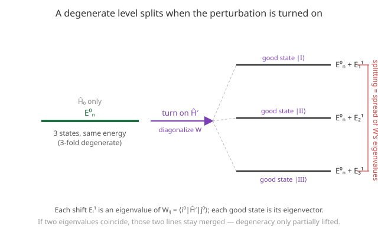

# Quantum Mechanics · Lesson 6.2: Degenerate perturbation theory

> ⏱ ~15 min · Module 6: Approximation methods · Builds on: [6.1 Nondegenerate perturbation theory](#/lesson/quantum-mechanics/06-01-perturbation-theory-nondegenerate.md), [3.4 Compatible observables and complete sets](#/lesson/quantum-mechanics/03-04-compatible-observables.md) · Unlocks: 6.3 the variational principle; fine structure and real atomic spectra

## Why this matters

Almost every interesting level in a real atom is **degenerate** — hydrogen's $n=2$ shell has four states at one energy, and that is exactly where the nondegenerate machinery of [6.1](#/lesson/quantum-mechanics/06-01-perturbation-theory-nondegenerate.md) detonates: its state-correction formula divides by an energy gap that is now zero. Yet degeneracy is where the physics *lives*. Turn on an electric field and hydrogen's spectral lines split (the **Stark effect**); turn on a magnetic field and they split differently (the **Zeeman effect**); even with no external field, relativistic corrections split them (**fine structure**). All three are the same question: when a perturbation hits a degenerate level, how does it fan apart, and into which states?

## The idea

In the nondegenerate case each unperturbed state $|n^0\rangle$ was unambiguous, so "how much does *this* state shift" had a clean answer. When a level is $g$-fold degenerate, there is no single $|n^0\rangle$ — there is a whole $g$-dimensional subspace, and **any** orthonormal basis of it is an equally valid set of unperturbed states. That freedom is the whole problem and the whole solution.

Here is the picture. Most bases of the subspace are "bad": the perturbation mixes their members violently, and any attempt to track one state's shift blows up. But there is (generically) one special basis — the **good states** — in which the perturbation does *not* mix members of the subspace with each other. In that basis each good state has a clean shift, and the formulas of 6.1 come back to life. Finding the good basis is a finite eigenvalue problem: build the little matrix of the perturbation *restricted to the degenerate subspace* and diagonalize it. Its eigenvalues are the shifts; its eigenvectors are the good states. That's the entire method.

Intuitively: the perturbation gets to choose its own preferred coordinates inside the degenerate room. Ask it which combinations it treats as independent — those are the states nature actually splits into.

## The formal version

Let $\hat H = \hat H_0 + \lambda \hat H'$, and suppose the level $E_n^0$ is $g$-fold degenerate with an orthonormal basis $\{|1^0\rangle, |2^0\rangle, \dots, |g^0\rangle\}$ of its eigenspace (all satisfying $\hat H_0 |i^0\rangle = E_n^0 |i^0\rangle$).

**Where 6.1 breaks.** The first-order state correction was

$$|n^1\rangle = \sum_{m \neq n} \frac{\langle m^0 | \hat H' | n^0\rangle}{E_n^0 - E_m^0}\,|m^0\rangle .$$

If $|m^0\rangle$ is a degenerate partner ($E_m^0 = E_n^0$), the denominator is **zero**. The formula is finite only if the numerator $\langle m^0|\hat H'|n^0\rangle$ vanishes for every degenerate partner. *In words: perturbation theory only works if the perturbation has no matrix elements linking the degenerate states — so we must first rotate to a basis where that's true.*

**The fix — the W matrix.** Define the $g \times g$ Hermitian matrix restricting the perturbation to the degenerate subspace:

$$W_{ij} = \langle i^0 | \hat H' | j^0 \rangle .$$

*In words: $W$ is just the perturbation, but with all the outside states ignored — only how it acts among the $g$ degenerate ones.*

**The secular equation.** The first-order energy shifts $E^{(1)}$ are the eigenvalues of $W$:

$$\det\!\big(W - E^{(1)} I\big) = 0 ,$$

and the corresponding eigenvectors $\mathbf{c} = (c_1, \dots, c_g)$ give the good states

$$|\text{good}\rangle = \sum_{j=1}^{g} c_j\, |j^0\rangle .$$

*In words: solve one small determinant equation; each root is a corrected energy $E_n^0 + \lambda E^{(1)}$, each eigenvector tells you which mixture of the original states actually has that energy.* The $g$ eigenvalues are generically distinct, so **the degeneracy is lifted** — one level fans into $g$ separated sublevels. If two eigenvalues coincide, that pair stays degenerate (the split is only partial, and you'd need higher order or a finer perturbation to separate them).

**The symmetry shortcut (from [3.4](#/lesson/quantum-mechanics/03-04-compatible-observables.md)).** Suppose an observable $\hat A$ commutes with *both* $\hat H_0$ and $\hat H'$. Then $\hat H'$ cannot connect two states with different $\hat A$-eigenvalues: $\langle a' | \hat H' | a\rangle = 0$ unless $a' = a$. So if you pick your degenerate basis to be **eigenstates of $\hat A$**, $W$ is already diagonal — no secular equation to solve, and the shifts are just the diagonal entries $\langle i^0|\hat H'|i^0\rangle$. *In words: a symmetry shared by $\hat H_0$ and $\hat H'$ hands you the good basis for free.* This is the CSCO idea from 3.4 doing real work: label the degenerate states by an operator the perturbation respects, and they are already the good states.

## Picture

## Worked examples

**Example 1 (mechanical — a 2-fold level, and why the naive answer is wrong).** A doubly degenerate level $E^0$ has orthonormal states $|1^0\rangle, |2^0\rangle$, and the perturbation restricted to them is

$$W = \varepsilon \begin{pmatrix} 3 & 1 \\ 1 & 3 \end{pmatrix}.$$

A tempting (wrong) move: read the diagonal entries as the two shifts — both $3\varepsilon$, "no splitting." But the off-diagonal $\varepsilon$ mixes the states, so we *must* diagonalize. Secular equation:

$$\det \begin{pmatrix} 3\varepsilon - E^{(1)} & \varepsilon \\ \varepsilon & 3\varepsilon - E^{(1)} \end{pmatrix} = (3\varepsilon - E^{(1)})^2 - \varepsilon^2 = 0 \;\Rightarrow\; E^{(1)} = 3\varepsilon \pm \varepsilon = 4\varepsilon,\ 2\varepsilon .$$

The level splits into $E^0 + 4\varepsilon$ and $E^0 + 2\varepsilon$. The good states are the eigenvectors: for $4\varepsilon$, $(1,1)/\sqrt2$; for $2\varepsilon$,$(1,-1)/\sqrt2$, i.e.

$$|\text{I}\rangle = \tfrac{1}{\sqrt2}\big(|1^0\rangle + |2^0\rangle\big), \qquad |\text{II}\rangle = \tfrac{1}{\sqrt2}\big(|1^0\rangle - |2^0\rangle\big).$$

The naive diagonal reading missed the entire splitting — the mixing term is doing all the physics.

**Example 2 (why you'd care — the normal Zeeman effect, symmetry hands you the basis).** Take an electron in a central potential with orbital angular momentum $\ell = 1$: the level is $2\ell+1 = 3$-fold degenerate, basis $|1,m\rangle$ with $m = -1, 0, +1$. Switch on a magnetic field $B$ along $z$; the orbital coupling is

$$\hat H' = \omega_L \hat L_z, \qquad \omega_L = \frac{eB}{2m_e} \ (\text{the Larmor frequency}).$$

Do we need the secular equation? No — $\hat L_z$ commutes with the central-potential $\hat H_0$ *and* is proportional to $\hat H'$ itself, so the $|1,m\rangle$ basis is already good. $W$ is diagonal:

$$W_{m'm} = \omega_L \langle 1,m'| \hat L_z |1,m\rangle = \omega_L\, \hbar m\, \delta_{m'm}.$$

The three shifts are $E^{(1)} = \omega_L \hbar m = -\hbar\omega_L,\ 0,\ +\hbar\omega_L$. The single line splits into **three equally spaced lines**, separated by $\hbar\omega_L = \mu_B B$ (with $\mu_B = e\hbar/2m_e$ the Bohr magneton). Degeneracy fully lifted, no determinant needed — the symmetry did the diagonalization for us. This is the textbook Zeeman triplet.

## Watch out

- You might think the first-order shifts are the diagonal entries $\langle i^0|\hat H'|i^0\rangle$ of your chosen basis. Only if that basis is already good (i.e. $W$ is diagonal). In a generic basis the off-diagonal elements matter — Example 1 is the warning shot. Always diagonalize $W$, don't just read its diagonal.
- You might think degeneracy is always fully lifted. Not necessarily: repeated eigenvalues of $W$ mean some states stay degenerate at first order (see P2). A symmetry that survives the perturbation *protects* a degeneracy.
- You might think you must build $W$ in some "natural" basis. You are free to choose any orthonormal basis of the subspace — and choosing one adapted to a symmetry (an $\hat A$ commuting with both Hamiltonians) can make $W$ diagonal by inspection. Picking the basis cleverly is half the skill.
- Don't confuse the two roles of the eigenvectors: they are the good *zeroth-order* states, not the first-order corrections $|n^1\rangle$. Getting the good states right is precisely what lets you *then* apply the 6.1 machinery (now with all zero denominators killed) for higher orders.

## One-liner

> When a level is degenerate, don't ask how each state shifts — ask which combinations the perturbation refuses to mix, by diagonalizing $W_{ij}=\langle i^0|\hat H'|j^0\rangle$ inside the subspace.

## Problems

**P1 (🟢)** A doubly degenerate level $E^0$ has orthonormal states $|1^0\rangle,|2^0\rangle$, and the perturbation restricted to them is

$$W = V \begin{pmatrix} 1 & 2 \\ 2 & -2 \end{pmatrix}.$$

Find the two first-order energy shifts and the good states. What is the splitting between the two resulting levels?

**P2 (🟡)** A 3-fold degenerate level has orthonormal states $|1^0\rangle,|2^0\rangle,|3^0\rangle$, and the perturbation gives

$$W = V \begin{pmatrix} 2 & 1 & 1 \\ 1 & 2 & 1 \\ 1 & 1 & 2 \end{pmatrix}.$$

Find the first-order shifts. Is the degeneracy fully lifted, partially lifted, or not at all? Identify the good state(s) for the *most-shifted* level. *(Hint: $W = 2V\,I + V\,J$, where $J$ is the all-ones matrix.)*

**P3 (🔴, optional — the linear Stark effect in hydrogen)** The hydrogen $n=2$ level is 4-fold degenerate (ignore spin): $|2,0,0\rangle$ (the $2s$ state) and $|2,1,m\rangle$ for $m=-1,0,+1$ (the three $2p$ states). A uniform electric field $\mathcal{E}$ along $z$ adds $\hat H' = e\mathcal{E}\, z = e\mathcal{E}\, r\cos\theta$. Without computing any radial integral, use two symmetry arguments to show that **almost every entry of the $4\times4$ matrix $W$ vanishes**, and deduce the splitting pattern.
(a) **Parity.** $z$ is odd under $\mathbf{r}\to-\mathbf{r}$, and $|2,\ell,m\rangle$ has parity $(-1)^\ell$. Which matrix elements $\langle 2,\ell',m'|z|2,\ell,m\rangle$ must vanish? In particular, what are all the *diagonal* elements?
(b) **Azimuthal symmetry.** $z=r\cos\theta$ is independent of $\phi$, so $[\hat H', \hat L_z]=0$. Which pairs of states can $\hat H'$ connect? Combine with (a): which single pair of states actually couples?
(c) Given that the one surviving element is $\langle 2,0,0|z|2,1,0\rangle = -3a_0$ (Bohr radius $a_0$), write $W$, find its eigenvalues, and describe the resulting levels and good states.

Solutions

**P1** Secular equation: with $W = V\begin{pmatrix}1 & 2\\ 2 & -2\end{pmatrix}$, the eigenvalues $E^{(1)}$ satisfy $E^{(1)2} - (\operatorname{tr}W)E^{(1)} + \det W = 0$. Here $\operatorname{tr}W = (1-2)V = -V$ and $\det W = \big(1\cdot(-2) - 2\cdot 2\big)V^2 = -6V^2$, so

$$E^{(1)2} + V E^{(1)} - 6V^2 = 0 \;\Rightarrow\; E^{(1)} = \frac{-V \pm \sqrt{V^2 + 24V^2}}{2} = \frac{-V \pm 5V}{2} = 2V,\ -3V.$$

Good states (eigenvectors): for $E^{(1)}=2V$, $(1-2)c_1 + 2c_2 = 0 \Rightarrow c_1 = 2c_2$, giving $|\text{I}\rangle = \tfrac{1}{\sqrt5}\big(2|1^0\rangle + |2^0\rangle\big)$. For $E^{(1)}=-3V$, $(1+3)c_1 + 2c_2 = 0 \Rightarrow c_2 = -2c_1$, giving $|\text{II}\rangle = \tfrac{1}{\sqrt5}\big(|1^0\rangle - 2|2^0\rangle\big)$. (They are orthogonal, as they must be — $W$ is Hermitian.) The two levels are $E^0 + 2V$ and $E^0 - 3V$, so the **splitting is $5V$**.

**P2** With the hint, $W = 2V I + V J$. The all-ones matrix $J$ has rank 1: its eigenvalues are $3$ (eigenvector $(1,1,1)$, since each row sums to 3) and $0$ (doubly, the whole plane $c_1+c_2+c_3=0$). Adding $2V I$ shifts every eigenvalue by $2V$:

$$E^{(1)} = 2V + V\{3, 0, 0\} = 5V,\ 2V,\ 2V.$$

The degeneracy is **partially lifted**: the 3-fold level splits into a **singlet at $E^0+5V$** and a **doublet at $E^0+2V$**. The most-shifted level ($5V$) has the single good state $|\text{I}\rangle = \tfrac{1}{\sqrt3}\big(|1^0\rangle + |2^0\rangle + |3^0\rangle\big)$ (the symmetric combination). The remaining doublet spans any orthonormal pair in the plane $c_1+c_2+c_3=0$ — e.g. $\tfrac{1}{\sqrt2}(|1^0\rangle-|2^0\rangle)$ and $\tfrac{1}{\sqrt6}(|1^0\rangle+|2^0\rangle-2|3^0\rangle)$ — but that basis is not pinned down by first order, precisely because those two stay degenerate.

**P3**
(a) **Parity.** $|2,\ell,m\rangle$ has parity $(-1)^\ell$, and $z$ is odd, so $\langle 2,\ell',m'|z|2,\ell,m\rangle$ has integrand of parity $(-1)^{\ell'}\cdot(-1)\cdot(-1)^{\ell}$; it vanishes unless $(-1)^{\ell'+\ell} = -1$, i.e. unless $\ell'$ and $\ell$ have **opposite** parity. Within $n=2$ that means only $s\leftrightarrow p$ ($\ell=0$ with $\ell=1$) can be nonzero; $s\leftrightarrow s$ and $p\leftrightarrow p$ all vanish. In particular **every diagonal element vanishes** ($\ell'=\ell$), so naive nondegenerate PT would predict *zero* shift for all four states — we are forced into degenerate PT.
(b) **Azimuthal.** $[\hat H',\hat L_z]=0$ means $\langle \ell',m'|z|\ell,m\rangle = 0$ unless $m'=m$. The four states have $m$-values $0$ (for $|2,0,0\rangle$), $0$ (for $|2,1,0\rangle$), $+1$ (for $|2,1,1\rangle$), $-1$ (for $|2,1,-1\rangle$). So $\hat H'$ can only connect states with equal $m$. Combining with (a) (opposite $\ell$), the **only surviving coupling** is between $|2,0,0\rangle$ and $|2,1,0\rangle$ — the two $m=0$ states of opposite parity. The $m=\pm1$ states have no partner (no other state shares their $m$ and has opposite $\ell$), so they don't shift at first order.
(c) In the ordered basis $\{|2,0,0\rangle, |2,1,0\rangle, |2,1,1\rangle, |2,1,-1\rangle\}$, with $\gamma \equiv e\mathcal{E}\langle2,0,0|z|2,1,0\rangle = -3 e\mathcal{E}a_0$,

$$W = \begin{pmatrix} 0 & \gamma & 0 & 0 \\ \gamma & 0 & 0 & 0 \\ 0 & 0 & 0 & 0 \\ 0 & 0 & 0 & 0 \end{pmatrix}.$$

The $m=\pm1$ block contributes eigenvalues $0,0$; the upper $2\times2$ $\begin{pmatrix}0&\gamma\\\gamma&0\end{pmatrix}$ gives $\pm\gamma$, i.e. $\pm 3e\mathcal{E}a_0$. So the 4-fold level splits into **three**: one at $E_2 + 3e\mathcal{E}a_0$, one at $E_2 - 3e\mathcal{E}a_0$, and a still **2-fold-degenerate** level at $E_2$ (the untouched $m=\pm1$ states). The two shifted good states are the $s$–$p$ hybrids $\tfrac{1}{\sqrt2}\big(|2,0,0\rangle \mp |2,1,0\rangle\big)$ — orbitals with a permanent electric dipole, which is exactly why the shift is **linear** in $\mathcal{E}$. (This linear Stark effect is special to hydrogen's accidental $s$–$p$ degeneracy; in other atoms the leading effect is quadratic.)

## Flashback

**From Lesson 6.1 (Nondegenerate perturbation theory):** A particle is in the infinite square well of width $L$ (states $\psi_n(x)=\sqrt{2/L}\,\sin(n\pi x/L)$, non-degenerate). A thin spike $\hat H' = \alpha\,\delta(x - L/2)$ is added at the center. Find the first-order energy shift $E_n^{(1)}$ for general $n$, and explain why the even-$n$ levels are unaffected.

Solution

First-order shift is the diagonal matrix element (here the basis is nondegenerate, so 6.1 applies directly):

$$E_n^{(1)} = \langle \psi_n | \hat H' | \psi_n\rangle = \alpha\, |\psi_n(L/2)|^2 = \alpha \cdot \frac{2}{L}\sin^2\!\Big(\frac{n\pi}{2}\Big).$$

Now $\sin(n\pi/2) = 0$ for even $n$ and $\pm 1$ for odd $n$, so

$$E_n^{(1)} = \begin{cases} \dfrac{2\alpha}{L}, & n \text{ odd},\\[4pt] 0, & n \text{ even}. \end{cases}$$

The even states have a **node** at the center $x=L/2$ — their probability density vanishes exactly where the spike sits, so they never "feel" it. The odd states peak there and take the full hit. (This is the point-perturbation cousin of the Stark selection rule in P3: whether a matrix element survives is decided by where the wavefunction has support and by symmetry.)

## Connections

- **Backward:** this repairs the exact failure mode of [6.1](#/lesson/quantum-mechanics/06-01-perturbation-theory-nondegenerate.md) — the zero denominator — by first rotating to the good basis so no degenerate partner is coupled. The good-basis idea *is* the [3.4](#/lesson/quantum-mechanics/03-04-compatible-observables.md) CSCO principle: label states by an operator the perturbation commutes with, and they diagonalize $W$ automatically. The secular equation $\det(W - E^{(1)}I)=0$ is just the eigenvalue problem from `linalg-refresher`, now living inside a degenerate subspace.
- **Forward:** real atomic spectra are degenerate PT in action — fine structure (spin–orbit + relativistic corrections splitting hydrogen's $n$-levels by $\ell,j$), the Zeeman and Stark effects, and the hydrogen $(n,\ell,m,m_s)$ counting from Boss Problem 4. The next lesson, [6.3 the variational principle](#/lesson/quantum-mechanics/06-03-variational-principle.md), attacks the ground state from the opposite direction (an upper bound rather than a series).
- **Sideways (classical normal modes):** the secular determinant is the same object that appears in small-oscillation theory in [analytical mechanics](#/course/analytical-mechanics) — when several oscillators share a frequency (a degenerate normal-mode subspace), diagonalizing the coupling matrix picks out the "good" normal coordinates that oscillate independently. Degenerate PT and normal modes are one linear-algebra move wearing two uniforms.
