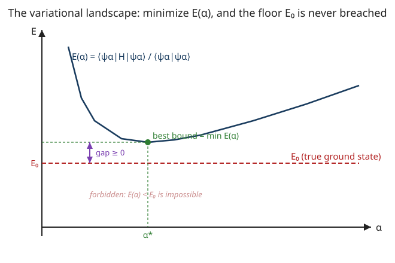

# Quantum Mechanics · Lesson 6.3: The variational principle

> ⏱ ~15 min · Module 6: Approximation methods · Builds on: [6.1 Time-independent perturbation theory](#/lesson/quantum-mechanics/06-01-perturbation-theory-nondegenerate.md), [3.1 The harmonic oscillator (analytic method)](#/lesson/quantum-mechanics/03-01-harmonic-oscillator-analytic.md), [1.5 Measurement and expectation values](#/lesson/quantum-mechanics/01-05-measurement-expectation-values.md) · Unlocks: 6.4 The WKB approximation

## Why this matters

Perturbation theory ([6.1](#/lesson/quantum-mechanics/06-01-perturbation-theory-nondegenerate.md)) needs a solvable starting point and a *small* extra term. But most real Hamiltonians — the helium atom, a molecule, a lump of interacting electrons — have no small parameter and no exact neighbor to perturb from. The variational principle works anyway, and it works with almost nothing: **guess a wavefunction, compute one expectation value, and you have earned a rigorous upper bound on the ground-state energy** — a number the true answer cannot beat. Tune a knob in your guess to push the bound down, and it gets sharper. This one idea is the computational engine of quantum chemistry: Hartree–Fock and density-functional theory (DFT), the methods behind essentially every molecular-energy calculation run today, are industrial-scale variational minimizations. It is also, underneath, exactly the constrained optimization you met in economics and analytical mechanics — minimize a quantity subject to a normalization constraint.

## The idea

Energy in quantum mechanics has a floor. Every system has a lowest energy level $E_0$, and no state — however exotic — can have a smaller expected energy than that. So if you take *any* normalized state $|\psi\rangle$ you like, sensible or crude, and compute the average energy $\langle\psi|\hat H|\psi\rangle$, the number you get is **guaranteed to sit at or above $E_0$**. You've boxed the true ground energy in from above without solving anything.

That turns finding $E_0$ into a game of *lowering your guess*. Build a trial wavefunction with an adjustable dial — call it $\alpha$ — so you actually have a whole family of guesses. Each setting of the dial gives an energy $E(\alpha)$, and every one of them is an honest ceiling over $E_0$. Turn the dial to make $E(\alpha)$ as small as possible; the minimum is your best ceiling. And here is the payoff: the closer your trial's *shape* is to the true ground state, the tighter the ceiling clamps down. A wild guess gives a loose (but still valid) bound; a good guess gives a great one; and if your family happens to contain the exact ground state, the minimum lands *exactly* on $E_0$. You get a rigorous answer from a hunch and a derivative.

## The formal version

Let $\hat H$ have eigenstates $|n\rangle$ and energies $E_0\le E_1\le E_2\le\cdots$, with $\hat H|n\rangle=E_n|n\rangle$ and $\langle m|n\rangle=\delta_{mn}$ (a complete orthonormal basis, guaranteed because $\hat H$ is Hermitian — the spectral theorem from [1.4](#/lesson/quantum-mechanics/01-04-observables-hermitian-operators.md)).

**The variational (Rayleigh–Ritz) theorem.** For *any* normalized state $|\psi\rangle$,
$$
\boxed{\;\langle H\rangle_\psi \equiv \langle\psi|\hat H|\psi\rangle \ \ge\ E_0\;,}
$$
with equality if and only if $|\psi\rangle$ is a ground state.

*In words: the average energy of every state is an upper bound on the true ground-state energy — you can only overestimate, never undershoot.*

**Proof (one line of algebra).** Expand the trial state in the energy eigenbasis, $|\psi\rangle=\sum_n c_n|n\rangle$ with $c_n=\langle n|\psi\rangle$. Normalization gives $\sum_n|c_n|^2=1$. Then
$$
\langle H\rangle_\psi=\sum_{m,n}c_m^{*}c_n\,\langle m|\hat H|n\rangle=\sum_{m,n}c_m^{*}c_n\,E_n\,\delta_{mn}=\sum_n|c_n|^2E_n .
$$
Since every $E_n\ge E_0$ and every weight $|c_n|^2\ge0$,
$$
\sum_n|c_n|^2E_n\ \ge\ \sum_n|c_n|^2E_0\ =\ E_0\sum_n|c_n|^2\ =\ E_0 .
$$
*In words: $\langle H\rangle$ is a weighted average of the energy levels, and no average can fall below the smallest thing being averaged.* Equality needs all the weight on the lowest level(s), i.e. $|\psi\rangle$ is a ground state. $\blacksquare$

**Working with unnormalized trials.** In practice you don't want to renormalize after every tweak of $\alpha$, so use the **Rayleigh quotient**, which normalizes automatically:
$$
E(\alpha)=\frac{\langle\psi_\alpha|\hat H|\psi_\alpha\rangle}{\langle\psi_\alpha|\psi_\alpha\rangle}\ \ge\ E_0\qquad\text{for every }\alpha .
$$
*In words: divide by the state's own length-squared and the bound holds for any trial, normalized or not.* The **method** is then: pick a trial family $\psi_\alpha$, compute $E(\alpha)$, and solve $\dfrac{dE}{d\alpha}=0$ for the best (lowest) bound $E(\alpha^*)$.

**Excited states, by orthogonality.** If you restrict your trial to states orthogonal to the true ground state, $\langle\psi|0\rangle=0$, then $c_0=0$ and the same sum starts at $E_1$:
$$
\langle H\rangle_\psi=\sum_{n\ge1}|c_n|^2E_n\ \ge\ E_1 .
$$
*In words: knock out the ground state and the floor rises to the first excited level.* You rarely know $|0\rangle$ exactly, but **symmetry does the job for free**: if $\hat H$ is even (parity-symmetric) the ground state is even, so any *odd* trial is automatically orthogonal to it and bounds $E_1$.

**This is genuine constrained optimization.** Minimizing $\langle\psi|\hat H|\psi\rangle$ subject to the constraint $\langle\psi|\psi\rangle=1$ is a Lagrange-multiplier problem. Introduce a multiplier $E$ and make the functional $\langle\psi|\hat H|\psi\rangle-E\big(\langle\psi|\psi\rangle-1\big)$ stationary; setting the variation to zero returns $\hat H|\psi\rangle=E|\psi\rangle$ — the Schrödinger equation itself, with the multiplier $E$ playing the role of the energy. The variational method is that same optimization done approximately, over a limited family instead of all of Hilbert space. It is the exact analogue of the constrained utility maximization from the micro refresher and the constrained dynamics of analytical mechanics: same machinery, different uniform.

## Picture

The trial energy $E(\alpha)$ traces a curve as you sweep the dial; its lowest point is the best bound you can claim. The red line $E_0$ is a floor the curve can touch but never cross — the purple gap is the unavoidable overestimate, and it shrinks to zero exactly when your trial family reaches the true ground state (as the Gaussian does for the oscillator below).

## Worked examples

**Example 1 (the classic — Gaussian trial nails the oscillator).** Take $\hat H=-\dfrac{\hbar^2}{2m}\dfrac{d^2}{dx^2}+\tfrac12 m\omega^2x^2$ and the (unnormalized) trial $\psi_\alpha(x)=e^{-\alpha x^2}$, $\alpha>0$. We need three Gaussian integrals; all follow from $\int_{-\infty}^{\infty}e^{-2\alpha x^2}dx=\sqrt{\tfrac{\pi}{2\alpha}}$.

*Norm.* $\displaystyle\langle\psi|\psi\rangle=\int e^{-2\alpha x^2}dx=\sqrt{\tfrac{\pi}{2\alpha}}.$

*Kinetic.* With $\psi'=-2\alpha x\,e^{-\alpha x^2}$, integrate by parts so $\langle\hat T\rangle=\tfrac{\hbar^2}{2m}\int|\psi'|^2dx\big/\langle\psi|\psi\rangle$. Using $\int x^2e^{-2\alpha x^2}dx=\tfrac{1}{4\alpha}\sqrt{\tfrac{\pi}{2\alpha}}$,
$$
\int|\psi'|^2dx=4\alpha^2\!\int x^2e^{-2\alpha x^2}dx=4\alpha^2\cdot\tfrac{1}{4\alpha}\sqrt{\tfrac{\pi}{2\alpha}}=\alpha\sqrt{\tfrac{\pi}{2\alpha}}
\ \Rightarrow\ \langle\hat T\rangle=\frac{\hbar^2\alpha}{2m}.
$$

*Potential.* $\displaystyle\langle\hat V\rangle=\tfrac12 m\omega^2\,\frac{\int x^2e^{-2\alpha x^2}dx}{\int e^{-2\alpha x^2}dx}=\tfrac12 m\omega^2\cdot\frac{1}{4\alpha}=\frac{m\omega^2}{8\alpha}.$

Adding,
$$
E(\alpha)=\frac{\hbar^2\alpha}{2m}+\frac{m\omega^2}{8\alpha}.
$$
This is exactly the U-curve of the Picture. Minimize:
$$
\frac{dE}{d\alpha}=\frac{\hbar^2}{2m}-\frac{m\omega^2}{8\alpha^2}=0\ \Longrightarrow\ \alpha^*=\frac{m\omega}{2\hbar}.
$$
Plug back in:
$$
E(\alpha^*)=\frac{\hbar^2}{2m}\cdot\frac{m\omega}{2\hbar}+\frac{m\omega^2}{8}\cdot\frac{2\hbar}{m\omega}=\frac{\hbar\omega}{4}+\frac{\hbar\omega}{4}=\tfrac12\hbar\omega .
$$
This is the **exact** ground energy $E_0=\tfrac12\hbar\omega$ — and no accident: at $\alpha^*=\tfrac{m\omega}{2\hbar}$ the trial $e^{-\alpha^* x^2}$ *is* the true ground state $\psi_0\propto e^{-m\omega x^2/2\hbar}$ from [3.1](#/lesson/quantum-mechanics/03-01-harmonic-oscillator-analytic.md). The family contained the answer, so the bound closed the gap to zero.

**Example 2 (why you'd care — hydrogen from a crude guess).** Now a case where the trial's shape is *wrong*, so the bound stays above the truth — yet is still rigorous and close. Hydrogen has $\hat H=-\dfrac{\hbar^2}{2m}\nabla^2-\dfrac{k}{r}$ with $k=\dfrac{e^2}{4\pi\varepsilon_0}$, and exact ground energy $E_0=-\dfrac{mk^2}{2\hbar^2}=-13.6$ eV. Try a **Gaussian** $\psi_\alpha=e^{-\alpha r^2}$ (the wrong shape — hydrogen's true state decays like $e^{-r/a_0}$, not like a bell). Carrying out the radial integrals ($\int_0^\infty r^n e^{-\beta r^2}dr$, with volume element $4\pi r^2\,dr$) gives
$$
\langle\hat T\rangle=\frac{3\hbar^2\alpha}{2m},\qquad
\langle\hat V\rangle=-2k\sqrt{\tfrac{2\alpha}{\pi}}
\quad\Rightarrow\quad
E(\alpha)=\frac{3\hbar^2\alpha}{2m}-2k\sqrt{\tfrac{2\alpha}{\pi}} .
$$
Setting $dE/d\alpha=0$ and simplifying yields the best bound
$$
E(\alpha^*)=-\frac{8}{3\pi}\cdot\frac{mk^2}{2\hbar^2}=-\frac{8}{3\pi}\,(13.6\text{ eV})\approx-11.5\text{ eV}.
$$
It overshoots the truth by about 15% — the Gaussian has no cusp at the nucleus and the wrong tail, so it cannot reach $E_0$. But notice what we got for almost nothing: a *guaranteed* statement that hydrogen's ground state is at least 11.5 eV deep, from one wrong-shaped guess and a derivative. Feed the method a better shape (P3) and it hits $-13.6$ eV exactly. This shape-sensitivity is precisely why quantum chemistry invests so heavily in good trial "basis sets": in Hartree–Fock and DFT the trial is a many-electron wavefunction (a Slater determinant, or a density) and the same $dE/d\alpha=0$ minimization — over millions of parameters — delivers molecular energies.

## Watch out

- You might think a low $\langle H\rangle$ means your wavefunction is *accurate*. Energy is a much more forgiving test than shape: a first-order error in the wavefunction produces only a second-order error in the energy (the bound sits at the *bottom* of the $E(\alpha)$ well, where $dE/d\alpha=0$). A trial can give a superb energy while getting other quantities — position spread, dipole moment — visibly wrong.
- You might think the method bounds *any* level you want. Raw, it only bounds the **ground state**. To reach an excited level you must enforce orthogonality to everything below it — easy for $E_1$ via a symmetry (odd trial), genuinely hard deeper up, since you'd need the exact lower states you don't have.
- You might forget to divide by $\langle\psi|\psi\rangle$. The bound $\langle H\rangle\ge E_0$ assumes a *normalized* state; for an unnormalized trial you must use the Rayleigh quotient. Skip the denominator and $E(\alpha)$ is meaningless (and usually not even a bound).
- You might expect the minimum over $\alpha$ to be the true $E_0$. It equals $E_0$ *only* if your family contains a ground state (as with the oscillator Gaussian). Generically the minimum is a strict overestimate — right idea, honest ceiling, not the exact floor.

## One-liner

> Any normalized guess gives $\langle H\rangle\ge E_0$, so tune your trial to push that ceiling as low as it will go — the closer the shape, the tighter the clamp, and a family containing the true state closes the gap exactly.

## Problems

**P1 (🟢)** Prove the variational bound from scratch: starting from $|\psi\rangle=\sum_n c_n|n\rangle$ (normalized, $\hat H|n\rangle=E_n|n\rangle$, $E_0$ the smallest eigenvalue), show $\langle\psi|\hat H|\psi\rangle\ge E_0$ and state exactly when equality holds. Then show the companion fact: $\langle\psi|\hat H|\psi\rangle\le E_{\max}$ if the spectrum has a largest eigenvalue $E_{\max}$.

**P2 (🟡)** *(Excited state by symmetry.)* For the harmonic oscillator, use the odd trial $\psi_\alpha(x)=x\,e^{-\alpha x^2}$. First explain why its energy bounds $E_1$ rather than $E_0$. Then compute $E(\alpha)$, minimize, and identify the bound. *(Hint: an odd function has zero overlap with the even ground state — reuse the Gaussian moments from Example 1, now including $\int x^4 e^{-2\alpha x^2}dx=\tfrac{3}{16\alpha^2}\sqrt{\tfrac{\pi}{2\alpha}}$.)*

**P3 (🔴, optional)** *(The right shape for hydrogen — bridge to quantum chemistry.)* Redo Example 2 with the **exponential** trial $\psi_\alpha=e^{-\alpha r}$ (dimensions of $\alpha$: inverse length). Using $\langle\hat T\rangle=\dfrac{\hbar^2\alpha^2}{2m}$ and $\langle\hat V\rangle=-k\alpha$ (derive these from the radial integrals if you like), find $E(\alpha)$, minimize, and show the bound is the *exact* $-13.6$ eV. Explain why this trial succeeds where Example 2's Gaussian fell 15% short.

Solutions

**P1** Expand and use $\langle m|\hat H|n\rangle=E_n\delta_{mn}$:
$$
\langle\psi|\hat H|\psi\rangle=\sum_{m,n}c_m^{*}c_n E_n\delta_{mn}=\sum_n|c_n|^2E_n .
$$
Because $E_n\ge E_0$ for all $n$ and $|c_n|^2\ge0$,
$$
\sum_n|c_n|^2E_n\ge\sum_n|c_n|^2E_0=E_0\sum_n|c_n|^2=E_0,
$$
using normalization $\sum_n|c_n|^2=1$. **Equality** requires $|c_n|^2(E_n-E_0)=0$ for every $n$: the weight sits entirely on eigenstates with $E_n=E_0$, i.e. $|\psi\rangle$ is a ground state. The upper bound is symmetric: every $E_n\le E_{\max}$ gives $\sum_n|c_n|^2E_n\le E_{\max}\sum_n|c_n|^2=E_{\max}$. So $\langle H\rangle$ is trapped in $[E_0,E_{\max}]$ — always, for any state — because it is a convex average (probabilities $|c_n|^2$) of the eigenvalues.

**P2** *Why $E_1$:* the oscillator potential is even, so its ground state $\psi_0$ is even; the trial $x\,e^{-\alpha x^2}$ is odd, hence $\langle\psi_\alpha|\psi_0\rangle=\int(\text{odd})\,dx=0$. With $c_0=0$ the variational sum starts at $E_1$, so $E(\alpha)\ge E_1$.

*Compute.* Norm: $\int x^2e^{-2\alpha x^2}dx=\tfrac{1}{4\alpha}\sqrt{\tfrac{\pi}{2\alpha}}$.

Potential: $\langle\hat V\rangle=\tfrac12 m\omega^2\dfrac{\int x^4e^{-2\alpha x^2}dx}{\int x^2e^{-2\alpha x^2}dx}=\tfrac12 m\omega^2\cdot\dfrac{3/16\alpha^2}{1/4\alpha}=\dfrac{3m\omega^2}{8\alpha}.$

Kinetic: $\psi'=(1-2\alpha x^2)e^{-\alpha x^2}$, and
$$
\int|\psi'|^2dx=\int(1-4\alpha x^2+4\alpha^2x^4)e^{-2\alpha x^2}dx=\sqrt{\tfrac{\pi}{2\alpha}}\Big(1-4\alpha\cdot\tfrac{1}{4\alpha}+4\alpha^2\cdot\tfrac{3}{16\alpha^2}\Big)=\tfrac34\sqrt{\tfrac{\pi}{2\alpha}},
$$
so $\langle\hat T\rangle=\dfrac{\hbar^2}{2m}\dfrac{(3/4)\sqrt{\pi/2\alpha}}{(1/4\alpha)\sqrt{\pi/2\alpha}}=\dfrac{3\hbar^2\alpha}{2m}.$ Hence
$$
E(\alpha)=\frac{3\hbar^2\alpha}{2m}+\frac{3m\omega^2}{8\alpha}=3\left(\frac{\hbar^2\alpha}{2m}+\frac{m\omega^2}{8\alpha}\right)
$$
— exactly three times Example 1's function. So the same minimizer $\alpha^*=\tfrac{m\omega}{2\hbar}$ works, giving $E(\alpha^*)=3\cdot\tfrac12\hbar\omega=\tfrac32\hbar\omega=E_1$ **exactly**. As with the ground state, the family contains the true first excited state $\psi_1\propto x\,e^{-m\omega x^2/2\hbar}$, so the bound is sharp.

**P3** With $\psi_\alpha=e^{-\alpha r}$ and volume element $4\pi r^2dr$, the needed integrals are $\int_0^\infty r^2e^{-2\alpha r}dr=\tfrac{1}{4\alpha^3}$ and $\int_0^\infty r\,e^{-2\alpha r}dr=\tfrac{1}{4\alpha^2}$. The norm is $\int e^{-2\alpha r}4\pi r^2dr=\pi/\alpha^3$. For a spherically symmetric $\psi$, $\langle\hat T\rangle=\tfrac{\hbar^2}{2m}\int(\psi')^2 4\pi r^2dr/\text{norm}$ with $\psi'=-\alpha e^{-\alpha r}$, giving $\langle\hat T\rangle=\tfrac{\hbar^2\alpha^2}{2m}$; and $\langle\hat V\rangle=-k\int\tfrac1r e^{-2\alpha r}4\pi r^2dr/\text{norm}=-k\alpha$. Thus
$$
E(\alpha)=\frac{\hbar^2\alpha^2}{2m}-k\alpha,\qquad
\frac{dE}{d\alpha}=\frac{\hbar^2\alpha}{m}-k=0\ \Rightarrow\ \alpha^*=\frac{mk}{\hbar^2}=\frac{1}{a_0},
$$
the inverse Bohr radius. Then
$$
E(\alpha^*)=\frac{\hbar^2}{2m}\Big(\frac{mk}{\hbar^2}\Big)^2-k\frac{mk}{\hbar^2}=\frac{mk^2}{2\hbar^2}-\frac{mk^2}{\hbar^2}=-\frac{mk^2}{2\hbar^2}=-13.6\text{ eV}.
$$
Exact. The exponential trial *contains* the true 1s state $\psi_{100}\propto e^{-r/a_0}$ (at $\alpha^*=1/a_0$), so the gap closes — whereas Example 2's Gaussian, missing the nuclear cusp and with a too-fast tail, never reaches the truth and stalls 15% high. Moral: variational accuracy is set by whether your trial family can *shape itself* like the real state — the guiding principle of every basis-set choice in Hartree–Fock and DFT.

## Flashback

**From Lesson 1.5 (Measurement and expectation values):** A system has ground energy $E_0$ and first excited energy $E_1>E_0$. A particle is prepared in $|\psi\rangle=\tfrac{\sqrt3}{2}|0\rangle+\tfrac12 e^{i\varphi}|1\rangle$. Compute $\langle H\rangle$, confirm it is properly normalized, and check that $E_0\le\langle H\rangle\le E_1$ — the two-level shadow of today's bound.

Solution

Normalization: $|c_0|^2+|c_1|^2=\tfrac34+\tfrac14=1$ ✓ (the phase $e^{i\varphi}$ drops out of $|c_1|^2$). Expectation value:
$$
\langle H\rangle=\sum_n|c_n|^2E_n=\tfrac34E_0+\tfrac14E_1 .
$$
This is a convex combination of $E_0$ and $E_1$ (weights nonnegative, summing to 1), so it lies between them: $E_0=\tfrac34E_0+\tfrac14E_0\le\tfrac34E_0+\tfrac14E_1\le\tfrac34E_1+\tfrac14E_1=E_1$. In particular $\langle H\rangle\ge E_0$ — this superposition is a perfectly good (if unoptimized) trial state, and it obeys the variational bound automatically. Any state you write down is a candidate ceiling; the whole method is just hunting for the lowest one.

## Connections

- **Backward:** the proof is nothing but the expectation-value machinery of [1.5](#/lesson/quantum-mechanics/01-05-measurement-expectation-values.md) — $\langle H\rangle=\sum|c_n|^2E_n$ — read as an inequality, and it leans on the completeness of the Hermitian eigenbasis from [1.4](#/lesson/quantum-mechanics/01-04-observables-hermitian-operators.md). Example 1 recovers the oscillator ground state of [3.1](#/lesson/quantum-mechanics/03-01-harmonic-oscillator-analytic.md); P3 recovers hydrogen's from [4.4](#/lesson/quantum-mechanics/04-04-hydrogen-atom.md).
- **Forward:** where perturbation theory ([6.1](#/lesson/quantum-mechanics/06-01-perturbation-theory-nondegenerate.md)) needs a small parameter, the variational method needs only a guess — the two are the complementary halves of the approximation toolkit, and Boss Problem 6 pits them against each other on the same anharmonic well. [6.4](#/lesson/quantum-mechanics/06-04-wkb-approximation.md) (WKB) is a third route, sharp in the opposite (semiclassical) regime.
- **Sideways (quantum chemistry):** Hartree–Fock and DFT are this lesson at industrial scale — minimize $\langle H\rangle$ over a huge family of trial wavefunctions/densities to get molecular ground-state energies. The trial's shape is everything (Example 2 vs P3), which is why chemists obsess over basis sets.
- **Sideways (optimization / analytical mechanics):** minimizing $\langle\psi|\hat H|\psi\rangle$ subject to $\langle\psi|\psi\rangle=1$ is a Lagrange-multiplier problem whose stationarity condition *is* the Schrödinger equation, the multiplier being the energy — the same constrained-optimization structure as utility maximization in the micro refresher and constrained dynamics in analytical mechanics.
