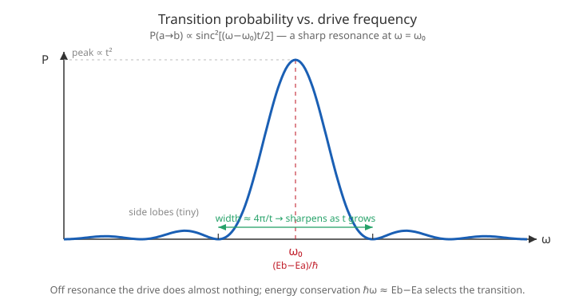

# Quantum Mechanics · Lesson 6.5: Time-dependent perturbation theory

> ⏱ ~15 min · Module 6: Approximation methods · Builds on: [2.2 Stationary states and time evolution](#/lesson/quantum-mechanics/02-02-stationary-states-time-evolution.md), [6.1 Time-independent perturbation theory](#/lesson/quantum-mechanics/06-01-perturbation-theory-nondegenerate.md) · Unlocks: 6.6 (Fermi's golden rule — transition *rates* into a continuum, and radiation selection rules)

## Why this matters

Everything a stationary state *cannot* do lives here. An electron sitting in an energy eigenstate never changes — but shine light on an atom and it absorbs, jumps, and re-emits; that is a transition between states, and stationary-state theory is silent on it. All of spectroscopy — absorption lines, emission lines, laser gain, NMR, the color of everything — is a **transition driven by a time-dependent perturbation** $\hat H'(t)$. Time-*independent* perturbation theory (6.1) asked "how does a small extra term nudge the energy *levels*?" This lesson asks a completely different question: "given a perturbation that switches on and wiggles, how likely is the system to *hop* from one level to another?" Answer that and you can predict which transitions happen, which are forbidden, and how strongly a system responds to a driving frequency.

## The idea

Take the cleanest possible system: just **two** levels, $|a\rangle$ (lower) and $|b\rangle$ (upper), eigenstates of the unperturbed Hamiltonian $\hat H_0$ with energies $E_a, E_b$. With no perturbation, a system in $|a\rangle$ stays in $|a\rangle$ forever (up to a phase). Now add a perturbation $\hat H'(t)$ that can *connect* the two — its off-diagonal matrix element $\langle b|\hat H'|a\rangle$ is nonzero. That coupling lets amplitude leak from $|a\rangle$ into $|b\rangle$.

The whole trick is bookkeeping. Any state is $|\psi(t)\rangle = c_a(t)\,e^{-iE_a t/\hbar}|a\rangle + c_b(t)\,e^{-iE_b t/\hbar}|b\rangle$: we peel off the "boring" stationary-state phases $e^{-iEt/\hbar}$ (from [2.2](#/lesson/quantum-mechanics/02-02-stationary-states-time-evolution.md)) and let the *coefficients* $c_a, c_b$ carry all the real news. If $\hat H'=0$, the $c$'s are constant — nothing happens, as it should. Turn $\hat H'$ on and the coefficients start to move; $|c_b(t)|^2$ is exactly the probability of finding the system in the upper state, i.e. the probability the transition has occurred.

One physical punchline to hold onto: a **static** push does little, but a push that **oscillates at the right frequency** does a lot. Drive the system at the frequency $\omega_0 = (E_b - E_a)/\hbar$ matching the energy gap — deliver photons of exactly the right energy $\hbar\omega_0$ — and the transition rings like a struck bell. Off that resonance, almost nothing. That is energy conservation, wearing the costume of a resonance curve.

## The formal version

**Exact two-level equations.** Write the full Hamiltonian $\hat H = \hat H_0 + \hat H'(t)$ and plug $|\psi(t)\rangle$ into the time-dependent Schrödinger equation $i\hbar\,\partial_t|\psi\rangle = \hat H|\psi\rangle$. The $\hat H_0$ terms cancel the derivative of the phases exactly (that is what "stationary" means), leaving only the perturbation. Projecting onto $\langle a|$ and $\langle b|$, and abbreviating $H'_{ij} \equiv \langle i|\hat H'(t)|j\rangle$, gives the **exact** coupled equations

$$\dot c_a = -\frac{i}{\hbar}\Big[H'_{aa}\,c_a + H'_{ab}\,e^{-i\omega_0 t}\,c_b\Big], \qquad \dot c_b = -\frac{i}{\hbar}\Big[H'_{ba}\,e^{+i\omega_0 t}\,c_a + H'_{bb}\,c_b\Big],$$

with the **Bohr frequency** $\omega_0 \equiv (E_b - E_a)/\hbar$. In words: the rate of change of each coefficient is set by the perturbation's matrix elements, and the *off-diagonal* piece — dressed with the phase $e^{\pm i\omega_0 t}$ that survived from the stationary phases — is what shuttles amplitude between the levels. No approximation yet; this is just the Schrödinger equation in a two-state basis. From here on we take the diagonal elements $H'_{aa}=H'_{bb}=0$ (true for any perturbation, like a dipole $\propto \hat x$, that has no diagonal expectation in these states).

**First-order perturbation theory.** Start in the lower state: $c_a(0)=1,\ c_b(0)=0$. If $\hat H'$ is weak, $c_a$ barely moves over the times of interest, so set $c_a \approx 1$ on the right-hand side. Then the $\dot c_b$ equation integrates directly:

$$\boxed{\;c_b(t) \approx -\frac{i}{\hbar}\int_0^t H'_{ba}(t')\,e^{\,i\omega_0 t'}\,dt'\;}, \qquad P_{a\to b}(t) = |c_b(t)|^2.$$

In words: the transition amplitude is the perturbation's off-diagonal element, "listened to" at the transition frequency — a Fourier component of $H'_{ba}(t)$ at $\omega_0$. The transition probability is its modulus squared. (First order is trustworthy only while $P_{a\to b}\ll 1$; once it's not small, $c_a\approx 1$ has failed.)

**Sinusoidal drive and resonance.** Take a monochromatic perturbation $\hat H'(t) = \hat V\cos(\omega t)$, so $H'_{ba}(t) = V_{ba}\cos(\omega t)$ with $V_{ba}=\langle b|\hat V|a\rangle$. Writing $\cos\omega t = \tfrac12(e^{i\omega t}+e^{-i\omega t})$, the integral produces two terms with denominators $(\omega_0+\omega)$ and $(\omega_0-\omega)$. Near resonance $\omega\approx\omega_0$ the second blows up and dominates (the **rotating-wave approximation** — keep the near-resonant term, drop the counter-rotating one), giving

$$P_{a\to b}(t) \approx \frac{|V_{ba}|^2}{\hbar^2}\,\frac{\sin^2\!\big[(\omega-\omega_0)t/2\big]}{(\omega-\omega_0)^2}.$$

In words: as a function of the drive frequency $\omega$, the response is a sharp peak centered at $\omega=\omega_0$ — a $\operatorname{sinc}^2$ lineshape whose central spike has height $|V_{ba}|^2 t^2/4\hbar^2$ and width $\sim 4\pi/t$. Resonance $\omega=\omega_0$ means $\hbar\omega = E_b - E_a$: the photon energy equals the level gap. **That is energy conservation.** As $t$ grows the peak gets taller ($\propto t^2$) and narrower ($\propto 1/t$) — sharpening toward a delta function, which is precisely the seed of Fermi's golden rule in 6.6.

**Rabi flopping (the exact two-level result).** First order fails once $P$ is no longer small — but at/near resonance the RWA equations can be solved *exactly*, giving **Rabi oscillations**:

$$P_{a\to b}(t) = \frac{|V_{ba}|^2/\hbar^2}{\Omega^2}\,\sin^2\!\Big(\frac{\Omega t}{2}\Big), \qquad \Omega \equiv \sqrt{(\omega-\omega_0)^2 + |V_{ba}|^2/\hbar^2}\,,$$

with $\Omega$ the **generalized Rabi frequency**. In words: the population doesn't just leak — it *sloshes* back and forth between $|a\rangle$ and $|b\rangle$ periodically. At exact resonance ($\omega=\omega_0$) the prefactor becomes $1$ and $P = \sin^2(\Omega_R t/2)$ with $\Omega_R = |V_{ba}|/\hbar$: the sloshing reaches a full $100\%$ — complete population transfer, then back again. First-order theory is just the short-time snapshot of this ($\sin^2 x \approx x^2$).

## Picture

The response $P_{a\to b}$ as a function of drive frequency $\omega$. Almost all of the transition probability lives in a narrow central lobe at $\omega=\omega_0=(E_b-E_a)/\hbar$; drive even slightly off that frequency and the tiny side lobes are all you get. As the drive lasts longer, the central peak grows like $t^2$ and its width shrinks like $1/t$ — the resonance condition $\hbar\omega\approx E_b-E_a$ tightens into strict energy conservation.

## Worked examples

**Example 1 (mechanical — a constant perturbation switched on).** Suppose $\hat H'$ is *constant* in time (value $V_{ba}$ off-diagonal) but switched on abruptly for $0<t'<t$. First order:

$$c_b(t) = -\frac{i}{\hbar}V_{ba}\int_0^t e^{i\omega_0 t'}\,dt' = -\frac{i}{\hbar}V_{ba}\,\frac{e^{i\omega_0 t}-1}{i\omega_0} = -\frac{V_{ba}}{\hbar}\,\frac{e^{i\omega_0 t}-1}{\omega_0}.$$

Using $|e^{i\theta}-1|^2 = 2-2\cos\theta = 4\sin^2(\theta/2)$,

$$P_{a\to b}(t) = \frac{|V_{ba}|^2}{\hbar^2}\,\frac{4\sin^2(\omega_0 t/2)}{\omega_0^2} = \frac{|V_{ba}|^2 t^2}{\hbar^2}\,\operatorname{sinc}^2\!\Big(\frac{\omega_0 t}{2}\Big),$$

writing $\operatorname{sinc}(x)=\sin x/x$. This is the same lineshape as the driven case, but centered at $\omega_0=0$: a constant push only transfers appreciable probability if the levels are nearly *degenerate* ($\omega_0 t \lesssim 1$). The larger the gap, the more the phase $e^{i\omega_0 t'}$ oscillates inside the integral and cancels itself — you cannot excite a big jump with a steady nudge.

**Example 2 (why you'd care — reading a resonance).** An atom with gap $E_b-E_a = 2.0\ \text{eV}$ sits in a light field. What frequency of light drives the transition, and what happens if you detune? Resonance demands $\hbar\omega = 2.0\ \text{eV}$, i.e. $\omega_0 = (2.0\ \text{eV})/\hbar \approx 3.0\times10^{15}\ \text{s}^{-1}$ — visible light, $\sim 620$ nm. Drive there and $P_{a\to b}$ climbs; the first zeros of the $\operatorname{sinc}^2$ sit at $\omega-\omega_0 = \pm 2\pi/t$, so a longer pulse means a *sharper* line. This is why spectral lines have a natural width tied to how long the atom interacts: energy–time uncertainty in action. The atom is a frequency filter that only "hears" light matched to its gap — the microscopic origin of every absorption spectrum.

## Watch out

- You might think first-order theory gives the transition probability at *any* time — but it's only valid while $P_{a\to b}\ll 1$. The formula $P\propto t^2$ grows without bound and would exceed 1; that's the theory telling you it has broken. The honest answer at long times or strong coupling is the bounded Rabi $\sin^2$, which oscillates and never exceeds 1.
- You might think the diagonal elements $H'_{aa}, H'_{bb}$ drive transitions — they don't; they only shift phases (like a small energy correction). It's the **off-diagonal** $H'_{ba}$ that moves probability between states. If $\langle b|\hat H'|a\rangle = 0$, the transition is *forbidden* at this order — the seed of selection rules (6.6).
- You might think both $e^{\pm i\omega t}$ pieces of $\cos\omega t$ matter equally — near resonance only the co-rotating term $(\omega_0-\omega)$ has a small denominator and survives; dropping the other is the rotating-wave approximation, valid precisely when the coupling is weak compared to $\omega_0$.
- Don't confuse the two frequencies: $\omega_0=(E_b-E_a)/\hbar$ is a fixed property of the *atom* (the gap); $\omega$ is the *drive* you control. Resonance is the statement $\omega \to \omega_0$.

## One-liner

> Peel off the stationary phases and watch the coefficients: a perturbation moves probability between levels only through its off-diagonal element, and only strongly when you drive at the gap frequency $\hbar\omega = E_b-E_a$ — energy conservation as a resonance peak.

## Problems

**P1 (🟢)** A two-level system starts in $|a\rangle$. A constant off-diagonal perturbation $V_{ba}$ is switched on for a time $t$. Using first-order theory, derive $P_{a\to b}(t)$ and show it has the form $\dfrac{|V_{ba}|^2 t^2}{\hbar^2}\operatorname{sinc}^2(\omega_0 t/2)$. For fixed $t$, at what gap frequency $\omega_0$ is the transition probability largest, and what is that maximum value?

**P2 (🟡)** Now drive the same system sinusoidally, $\hat H'(t)=\hat V\cos(\omega t)$. State the resonance condition on the drive frequency $\omega$ in terms of the energies $E_a, E_b$, and explain in one sentence why it expresses energy conservation. Using the near-resonance result, find the peak transition probability at exact resonance after time $t$, and confirm it matches the short-time limit of the Rabi formula.

**P3 (🔴, optional)** *Rabi flopping and the $\pi$-pulse.* At **exact** resonance ($\omega=\omega_0$), the two-level probability is $P_{a\to b}(t) = \sin^2(\Omega_R t/2)$ with $\Omega_R=|V_{ba}|/\hbar$. (a) Find the earliest time $t_\pi$ at which the system is found in $|b\rangle$ with certainty. (b) What is $P_{a\to b}$ at $t=2t_\pi$, and what does it mean physically? (c) In one sentence, connect this to how a qubit or an NMR spin is flipped. (Cross-link: this coherent two-state rotation is the same $2\times2$ dynamics you met for spin-1/2 in a magnetic field.)

Solutions

**P1** With $H'_{ba}$ constant, first order gives
$$c_b(t) = -\frac{i}{\hbar}V_{ba}\int_0^t e^{i\omega_0 t'}dt' = -\frac{V_{ba}}{\hbar}\frac{e^{i\omega_0 t}-1}{\omega_0}.$$
Then $|c_b|^2 = \dfrac{|V_{ba}|^2}{\hbar^2}\dfrac{|e^{i\omega_0 t}-1|^2}{\omega_0^2}$, and since $|e^{i\theta}-1|^2 = 4\sin^2(\theta/2)$,
$$P_{a\to b}(t) = \frac{|V_{ba}|^2}{\hbar^2}\frac{4\sin^2(\omega_0 t/2)}{\omega_0^2} = \frac{|V_{ba}|^2 t^2}{\hbar^2}\operatorname{sinc}^2\!\Big(\frac{\omega_0 t}{2}\Big),$$
using $\dfrac{4\sin^2(\omega_0 t/2)}{\omega_0^2} = t^2\dfrac{\sin^2(\omega_0 t/2)}{(\omega_0 t/2)^2}$. The function $\operatorname{sinc}^2$ is maximal (value $1$) at argument zero, i.e. $\omega_0\to 0$ (degenerate levels). Taking $\omega_0\to 0$: $P_{a\to b}\to \dfrac{|V_{ba}|^2 t^2}{\hbar^2}$. A static perturbation excites transitions efficiently only between (near-)degenerate levels; a large gap suppresses it via the oscillating phase.

**P2** Resonance condition: $\omega = \omega_0 = (E_b-E_a)/\hbar$, equivalently $\boxed{\hbar\omega = E_b - E_a}$. It is energy conservation because the drive supplies energy in quanta $\hbar\omega$ (photons), and the transition can only occur if one quantum exactly bridges the gap $E_b-E_a$. Peak value: from $P_{a\to b}\approx \dfrac{|V_{ba}|^2}{\hbar^2}\dfrac{\sin^2[(\omega-\omega_0)t/2]}{(\omega-\omega_0)^2}$, take $\omega\to\omega_0$. With $x=(\omega-\omega_0)t/2$, $\dfrac{\sin^2 x}{(\omega-\omega_0)^2} = \dfrac{t^2}{4}\dfrac{\sin^2 x}{x^2}\to \dfrac{t^2}{4}$, so
$$P_{a\to b}^{\text{peak}}(t) = \frac{|V_{ba}|^2 t^2}{4\hbar^2}.$$
Check against Rabi: at resonance $P = \sin^2(\Omega_R t/2)$ with $\Omega_R=|V_{ba}|/\hbar$; for small $\Omega_R t$, $\sin^2(\Omega_R t/2)\approx (\Omega_R t/2)^2 = \dfrac{|V_{ba}|^2 t^2}{4\hbar^2}$. ✓ Identical — first order is the short-time slice of Rabi flopping. (Note the factor $1/4$ versus P1's factor $1$: splitting $\cos\omega t$ into two exponentials sends half the amplitude to the far-off-resonant term, halving the amplitude and quartering the probability.)

**P3** (a) $P_{a\to b}=\sin^2(\Omega_R t/2)=1$ first when $\Omega_R t/2 = \pi/2$, i.e.
$$t_\pi = \frac{\pi}{\Omega_R} = \frac{\pi\hbar}{|V_{ba}|}.$$
At this **$\pi$-pulse** time the system is with certainty in $|b\rangle$: complete population transfer $a\to b$.
(b) At $t=2t_\pi$: $\Omega_R t/2 = \pi$, so $P_{a\to b}=\sin^2\pi = 0$ — the population has returned entirely to $|a\rangle$. The population oscillates ("flops") coherently between the two states with period $2t_\pi = 2\pi/\Omega_R$; it never leaks away, it swaps back and forth.
(c) A resonant pulse of duration $t_\pi$ is exactly what flips a qubit $|0\rangle\to|1\rangle$ (a quantum NOT / spin flip); tuning the pulse *length* sets any superposition — a half-length pulse ($t_\pi/2$, a "$\pi/2$-pulse") makes an equal superposition. This is the same coherent $2\times2$ rotation as a spin-1/2 precessing in a magnetic field, and it is the physical basis of NMR and gate operations in quantum computing.

## Flashback

**From Lesson 2.2 (Stationary states and time evolution):** A system is prepared in the superposition $|\psi(0)\rangle = \tfrac{1}{\sqrt2}\big(|a\rangle + |b\rangle\big)$ of two energy eigenstates with $E_a\neq E_b$, and left alone ($\hat H'=0$). Write $|\psi(t)\rangle$, then compute the expectation value of an observable $\hat A$ with $\langle a|\hat A|a\rangle=\langle b|\hat A|b\rangle=0$ and $\langle a|\hat A|b\rangle = \langle b|\hat A|a\rangle = \alpha$ (real). What frequency does $\langle \hat A\rangle$ oscillate at, and why is that the *same* $\omega_0$ that governs transitions in this lesson?

Solution

Each eigenstate just picks up its phase: $|\psi(t)\rangle = \tfrac{1}{\sqrt2}\big(e^{-iE_a t/\hbar}|a\rangle + e^{-iE_b t/\hbar}|b\rangle\big)$. Sandwiching $\hat A$ and keeping only the nonzero (off-diagonal) matrix elements $\langle a|\hat A|b\rangle=\langle b|\hat A|a\rangle=\alpha$,
$$\langle\hat A\rangle = \tfrac12\Big(e^{i(E_b-E_a)t/\hbar}\alpha + e^{-i(E_b-E_a)t/\hbar}\alpha\Big) = \alpha\cos\!\big[(E_b-E_a)t/\hbar\big] = \alpha\cos(\omega_0 t).$$
So $\langle\hat A\rangle$ oscillates at exactly $\omega_0 = (E_b-E_a)/\hbar$. This is the same Bohr frequency because it is intrinsic to the *pair of levels*: a superposition already "rings" at $\omega_0$, so a perturbation must supply energy at $\omega_0$ to resonate with it. An oscillating dipole $\langle\hat A\rangle$ at $\omega_0$ is also exactly what radiates light at that frequency — the emission side of spectroscopy.

## Connections

- **Backward:** the expansion $|\psi(t)\rangle=\sum c_n e^{-iE_n t/\hbar}|n\rangle$ is the superposition/time-evolution machinery of [2.2](#/lesson/quantum-mechanics/02-02-stationary-states-time-evolution.md), now with the coefficients *allowed to change*; the "small parameter" logic and off-diagonal matrix elements come straight from [6.1](#/lesson/quantum-mechanics/06-01-perturbation-theory-nondegenerate.md), but here they drive *dynamics* instead of shifting *levels*.
- **Forward:** 6.6 replaces the single upper level $|b\rangle$ with a *continuum* of final states; summing the $\operatorname{sinc}^2$ resonance over that continuum collapses it to a delta function and yields **Fermi's golden rule** — a constant transition *rate* — plus the dipole selection rules of radiation.
- **Sideways (spin & control):** the exact two-level Rabi dynamics is identical to a spin-1/2 driven by an oscillating magnetic field (magnetic resonance) — the physics of NMR, atomic clocks, and single-qubit gates in quantum computing, where pulse area ($\Omega_R t$) is the control knob.
