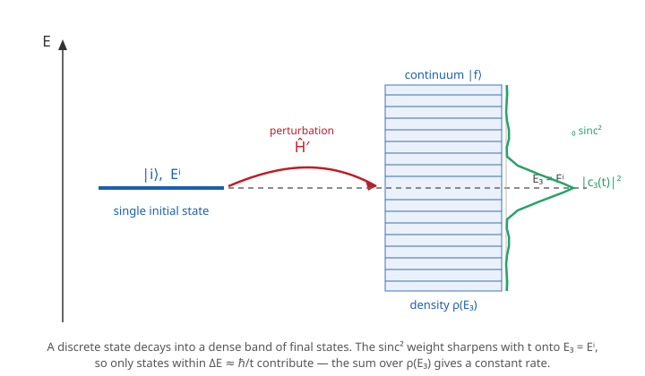

# Quantum Mechanics · Lesson 6.6: Fermi's golden rule and radiation

> ⏱ ~15 min · Module 6: Approximation methods · Builds on: [6.5 Time-dependent perturbation theory](#/lesson/quantum-mechanics/06-05-time-dependent-perturbation.md), [6.1 Perturbation theory (nondegenerate)](#/lesson/quantum-mechanics/06-01-perturbation-theory-nondegenerate.md), [4.4 The hydrogen atom](#/lesson/quantum-mechanics/04-04-hydrogen-atom.md) · Unlocks: the course is complete — this is the capstone that turns amplitudes into rates and explains why atoms shine

## Why this matters

An excited atom emits a photon and drops to the ground state. That single sentence hides two of the most consequential numbers in physics: the **rate** at which it happens (which sets spectral line widths, laser gain, and the lifetime of every excited state) and the **selection rules** that decide which transitions are allowed at all (which is why the periodic table's spectra look the way they do). In Lesson 6.5 you computed the probability of a transition into *one* named final state and watched it oscillate. Real emission is into a *continuum* — a photon can fly off in any direction with any of a continuous band of energies. This lesson does the one calculation that converts an oscillating amplitude into a steady, constant rate: **Fermi's golden rule**. It is the workhorse formula behind spontaneous emission, absorption, photoionization, scattering rates, and nuclear decay — the bridge from the abstract formalism to numbers you can measure.

## The idea

From 6.5, a perturbation $\hat H'$ switched on at $t=0$ gives a first-order probability of finding the system in a specific final state $|f\rangle$ that *oscillates* in time — it goes up, comes back down, and never commits. That is fine when there is a single sharp final state, but it cannot describe a decay, which should proceed steadily and irreversibly.

The escape hatch is that in a real transition the final states form a **continuum**: an emitted photon (or an ejected electron) has a dense band of available energies and directions. So you do not ask for the probability of one final state — you *sum* the oscillating $|c_f(t)|^2$ over the whole dense band, weighting by how many final states sit near each energy. That weighting is the **density of states** $\rho(E_f)$: the number of final states per unit energy.

Here is the magic. Each individual $|c_f(t)|^2$ is a sharply peaked function of the energy mismatch $E_f - E_i$ (a $\mathrm{sinc}^2$), and as time grows this peak gets **taller and narrower**, but its total area under the curve grows *linearly* in $t$. Sum over the continuum and the narrowing peak simply enforces **energy conservation** ($E_f = E_i$), while the linear-in-$t$ area hands you a total transition probability that grows like $t$ — and a probability proportional to $t$ means a **constant rate** $\Gamma = P/t$. Oscillation became decay because there were many places to go.

## The formal version

**Starting point (from 6.5).** A constant perturbation $\hat H'$ turned on at $t=0$ drives the first-order amplitude into state $|f\rangle$ with

$$|c_f(t)|^2 = \frac{|\langle f|\hat H'|i\rangle|^2}{\hbar^2}\,\frac{\sin^2(\omega_{fi}\,t/2)}{(\omega_{fi}/2)^2},\qquad \omega_{fi}\equiv\frac{E_f-E_i}{\hbar},$$

where $\langle f|\hat H'|i\rangle$ is the **matrix element** of the perturbation between initial and final states and $\omega_{fi}$ is the transition (angular) frequency. *In words:* the chance of landing in $|f\rangle$ is the perturbation's matrix element squared times a $\mathrm{sinc}^2$ factor that is largest when the final energy matches the initial energy.

**Sum over the continuum.** Replace the single state by an integral over final energies weighted by the density of states $\rho(E_f)$ (states per unit energy), and pull the slowly varying $|\langle f|\hat H'|i\rangle|^2$ and $\rho$ out at $E_f=E_i$:

$$P(t)=\sum_f |c_f(t)|^2 \approx \frac{|\langle f|\hat H'|i\rangle|^2}{\hbar^2}\,\rho(E_f)\int_{-\infty}^{\infty}\frac{\sin^2(\omega t/2)}{(\omega/2)^2}\,\hbar\,d\omega.$$

The remaining integral is a standard one, $\displaystyle\int_{-\infty}^{\infty}\frac{\sin^2(\omega t/2)}{(\omega/2)^2}\,d\omega = 2\pi t$ — the $\mathrm{sinc}^2$ kernel behaves like $2\pi t\,\delta(\omega)$, a spike at $\omega=0$ (energy conservation) whose area grows linearly in $t$. Hence

$$P(t)=\frac{2\pi}{\hbar}\,|\langle f|\hat H'|i\rangle|^2\,\rho(E_f)\;t.$$

**Fermi's golden rule.** The transition rate $\Gamma = dP/dt$ is therefore constant:

$$\boxed{\;\Gamma_{i\to f}=\frac{2\pi}{\hbar}\,\big|\langle f|\hat H'|i\rangle\big|^2\,\rho(E_f)\;}$$

*In words:* the transition **rate** (probability per unit time) equals $2\pi/\hbar$ times the **matrix element squared** (how strongly the perturbation couples initial to final) times the **density of final states** (how many places there are to land, at the energy-conserving energy $E_f=E_i$). Read the three factors as *coupling strength × availability of destinations*, with $2\pi/\hbar$ the universal conversion constant. The rule is named for Fermi, who called it "golden rule number two" — and its constancy is exactly what makes decay follow $N(t)=N_0 e^{-\Gamma t}$ with a well-defined lifetime $\tau = 1/\Gamma$.

**Application: atomic radiation and the dipole interaction.** For an atom in an electromagnetic wave, the perturbation is the coupling of the electron's charge to the field. When the wavelength is large compared to the atom (the **electric-dipole approximation** — the field is essentially uniform across the atom), it reduces to

$$\hat H' = -q\,\mathbf E\cdot\mathbf r = -\mathbf d\cdot\mathbf E,\qquad \mathbf d = q\,\mathbf r,$$

where $q$ is the electron charge, $\mathbf E$ the electric field, $\mathbf r$ the electron position, and $\mathbf d=q\mathbf r$ the electric dipole moment. *In words:* to leading order the light grabs the atom by its dipole moment. The whole physics of the transition is then in the **dipole matrix element** $\langle f|\mathbf r|i\rangle$. This mechanism underlies **absorption** (photon in, atom up), **stimulated emission** (photon in, atom down, second identical photon out — the basis of the laser), and, once the quantized field's vacuum fluctuations are included, **spontaneous emission** (photon out with no photon in).

**Dipole selection rules.** The angular part of $\langle f|\mathbf r|i\rangle$ vanishes unless the quantum numbers change by specific amounts:

$$\boxed{\;\Delta\ell=\pm 1,\qquad \Delta m = 0,\pm 1.\;}$$

*In words:* an electric-dipole transition must change the orbital angular-momentum quantum number by exactly one unit, and the magnetic quantum number by at most one. If a transition violates these, its dipole matrix element is exactly zero and the transition is **forbidden** (to this order — it may proceed far more slowly through higher multipoles). The rules are not arbitrary: $\mathbf r$ is an odd-parity vector, so $\langle f|\mathbf r|i\rangle$ can be nonzero only if initial and final states have *opposite* parity — and hydrogenic parity is $(-1)^\ell$, forcing $\ell$ to change by an odd number, with the angular integral (a product of three spherical harmonics) then permitting only the single step $\Delta\ell=\pm 1$. The $\Delta m$ rule and the $\Delta\ell=\pm1$ rule together are just **angular-momentum conservation**: the emitted photon is a spin-1 object carrying off exactly one unit of angular momentum.

**Einstein coefficients and lifetimes (qualitative).** Einstein packaged the three processes into rate coefficients: $B_{i\to f}$ for absorption and stimulated emission (both proportional to the incident intensity) and $A_{f\to i}$ for spontaneous emission (independent of any applied field). Thermodynamic balance forces the ratio $A/B \propto \omega^3$ — spontaneous emission is dramatically stronger at high frequency, which is why UV lines are broad and sharp and microwave transitions are nearly forbidden-slow. The spontaneous rate is $A = \Gamma$ from the golden rule with the quantized vacuum field, giving a radiative lifetime $\tau = 1/A$; for allowed optical transitions in hydrogen this comes out to a few nanoseconds (e.g. the $2p\to1s$ line, $\tau\approx 1.6$ ns).

## Picture

The single initial level $|i\rangle$ (blue, left) is driven by $\hat H'$ into a **band** of closely spaced final states $|f\rangle$ (right), whose closeness is measured by the density of states $\rho(E_f)$. Overlaid in green is the $\mathrm{sinc}^2$ weight $|c_f(t)|^2$ as a function of the final energy: it peaks sharply at $E_f=E_i$ (the dashed energy-conservation line) and only states within $\Delta E \approx \hbar/t$ of that line contribute. As $t$ grows the peak narrows toward a true delta function (strict energy conservation), but the *area* it sweeps grows linearly in $t$ — the mathematical origin of a constant rate. More available final states (a taller $\rho$) means a faster decay: that is the whole content of the golden rule in one figure.

## Worked examples

**Example 1 (mechanical — the rule as a plug-in).** A perturbation couples an initial state to a continuum with matrix element $|\langle f|\hat H'|i\rangle| = 4.0\times10^{-30}\ \mathrm{J}$ and density of final states $\rho(E_f)=1.0\times10^{33}\ \mathrm{states/J}$ at the energy-conserving energy. With $\hbar=1.05\times10^{-34}\ \mathrm{J\,s}$,

$$\Gamma=\frac{2\pi}{\hbar}|\langle f|\hat H'|i\rangle|^2\rho = \frac{2\pi}{1.05\times10^{-34}}\,(4.0\times10^{-30})^2(1.0\times10^{33}).$$

Step it out: $2\pi/\hbar = 5.98\times10^{34}$; $(4.0\times10^{-30})^2=1.6\times10^{-59}$; multiply the three: $5.98\times10^{34}\times1.6\times10^{-59}\times10^{33}\approx 9.6\times10^{8}\ \mathrm{s^{-1}}$. The lifetime is $\tau=1/\Gamma\approx1.0\ \mathrm{ns}$ — a typical allowed optical transition. Notice the *units bookkeeping*: energy² × (1/energy) / (energy·time) $=$ 1/time. If your $\Gamma$ does not come out per-second, a factor is misplaced.

**Example 2 (why you'd care — reading a spectrum with selection rules).** Why does excited hydrogen in the $2p$ state decay to $1s$ in nanoseconds, while the $2s$ state is metastable and lives about a *tenth of a second* — a hundred million times longer? Both sit at the same energy ($n=2$), and both could in principle drop to $1s$. But $2p\to1s$ has $\Delta\ell=-1$: dipole-allowed, $\langle 1s|\mathbf r|2p\rangle\neq0$, fast. The $2s\to1s$ transition has $\Delta\ell=0$: the dipole matrix element $\langle 1s|\mathbf r|2s\rangle$ vanishes identically (both states are even parity, $\mathbf r$ is odd, the integral is zero). It is dipole-**forbidden**, so it cannot radiate a single photon by the leading mechanism; it decays only through the vastly weaker two-photon process. The astronomical lifetime gap is not a small numerical effect — it is a *selection rule turning a matrix element exactly to zero*. This is the entire reason the $2s$ state matters in astrophysics: metastable hydrogen is a reservoir precisely because the fast door is closed.

## Watch out

- **You might think** the golden rule gives a probability, **but actually** it gives a *rate* (per unit time). The linear-in-$t$ growth of $P(t)$ is what makes $\Gamma=dP/dt$ well-defined; if you ever find $P(t)$ oscillating or saturating, you are outside the rule's regime (times long enough for the $\mathrm{sinc}^2$ to sharpen, but short enough that first-order perturbation theory and $P\ll1$ still hold).
- **You might think** the density of states $\rho(E_f)$ is optional bookkeeping, **but actually** it is essential and is what makes the rate finite and constant — a transition to a *single* discrete final state has no $\rho$ and does **not** obey the golden rule; it Rabi-oscillates instead (that was 6.5). You need a continuum.
- **You might think** a "forbidden" transition is strictly impossible, **but actually** it only means the *electric-dipole* matrix element vanishes. Higher-order couplings (magnetic dipole, electric quadrupole) or multi-photon processes can still drive it — just orders of magnitude more slowly. "Forbidden" means "slow," not "never."
- **You might think** $\Delta\ell=0$ is allowed because angular momentum "didn't change much." It is forbidden: the photon *always* carries one unit of angular momentum, so the electron's $\ell$ must change by exactly one. Parity makes this airtight — $\Delta\ell=0$ connects same-parity states through an odd operator, giving zero.

## One-liner

> Sum an oscillating transition probability over a continuum of final states and it becomes a constant rate — $\Gamma=\tfrac{2\pi}{\hbar}|\langle f|\hat H'|i\rangle|^2\rho(E_f)$ — coupling squared times destinations, with the dipole rules $\Delta\ell=\pm1,\ \Delta m=0,\pm1$ deciding which destinations exist.

## Problems

**P1 (🟢)** A weak perturbation couples a discrete initial state to a continuum. The matrix element is $|\langle f|\hat H'|i\rangle| = 2.0\times10^{-30}\ \mathrm{J}$ and the density of final states at $E_f=E_i$ is $\rho(E_f)=4.0\times10^{33}\ \mathrm{states/J}$. Using $\hbar=1.05\times10^{-34}\ \mathrm{J\,s}$, compute the transition rate $\Gamma$ and the corresponding lifetime $\tau=1/\Gamma$.

**P2 (🟡)** For each hydrogen transition below, decide whether it is electric-dipole **allowed** or **forbidden**, and state the reason ($\Delta\ell$ value / parity):
(a) $2p\to1s$, (b) $3d\to2p$, (c) $2s\to1s$, (d) $3d\to1s$, (e) $3s\to2p$, (f) $3p\to3s$.

**P3 (🔴, optional)** *Density of states for a free-particle final state.* A particle of mass $m$ is ejected into a large cubic box of side $L$ (volume $V=L^3$), with allowed wavevectors $\mathbf k$ on the lattice $k_i = 2\pi n_i/L$. Show that the number of states with energy below $E=\hbar^2k^2/2m$ is $N(E)=\dfrac{V}{6\pi^2}\left(\dfrac{2mE}{\hbar^2}\right)^{3/2}$, and hence that the density of states is

$$\rho(E)=\frac{dN}{dE}=\frac{V}{4\pi^2}\left(\frac{2m}{\hbar^2}\right)^{3/2}\sqrt{E}\;\propto\;\sqrt{E}.$$

Then argue in one sentence what this $\sqrt{E}$ scaling implies for the golden-rule rate of, say, photoionization as the ejected electron's energy increases.

Solutions

**P1.** Plug straight into the golden rule:
$$\Gamma=\frac{2\pi}{\hbar}|\langle f|\hat H'|i\rangle|^2\rho(E_f)=\frac{2\pi}{1.05\times10^{-34}}\,(2.0\times10^{-30})^2(4.0\times10^{33}).$$
Compute the pieces: $2\pi/\hbar = 5.98\times10^{34}\ \mathrm{J^{-1}s^{-1}}$; $(2.0\times10^{-30})^2 = 4.0\times10^{-60}\ \mathrm{J^2}$; then
$$\Gamma = 5.98\times10^{34}\times 4.0\times10^{-60}\times 4.0\times10^{33} = 9.6\times10^{8}\ \mathrm{s^{-1}}.$$
The lifetime is $\tau = 1/\Gamma \approx 1.0\times10^{-9}\ \mathrm{s} = 1.0\ \mathrm{ns}$ — a typical allowed optical transition. (Units check: $\mathrm{J^{-1}s^{-1}\cdot J^2\cdot J^{-1}=s^{-1}}$. ✓)

**P2.** Apply $\Delta\ell=\pm1$ (recall $s\!:\ell=0,\ p\!:\ell=1,\ d\!:\ell=2$):
- (a) $2p\to1s$: $\ell:1\to0$, $\Delta\ell=-1$ → **allowed**.
- (b) $3d\to2p$: $\ell:2\to1$, $\Delta\ell=-1$ → **allowed**.
- (c) $2s\to1s$: $\ell:0\to0$, $\Delta\ell=0$ → **forbidden** (same parity, dipole integral $=0$; this is the metastable $2s$ of Example 2).
- (d) $3d\to1s$: $\ell:2\to0$, $\Delta\ell=-2$ → **forbidden** ($\Delta\ell$ even; would be an electric-quadrupole transition).
- (e) $3s\to2p$: $\ell:0\to1$, $\Delta\ell=+1$ → **allowed** ($3s$ lies above $2p$ in energy, so this is a legitimate downward emission).
- (f) $3p\to3s$: $\ell:1\to0$, $\Delta\ell=-1$ satisfies the angular rule, **but** both states have $n=3$, so $E_f=E_i$ in the non-relativistic spectrum: there is no photon energy to emit ($\omega_{fi}=0$), and the spontaneous rate $\propto\omega^3$ vanishes. Angularly allowed, but radiatively dead — a reminder that the golden rule also needs a real energy gap. (Small relativistic/Lamb splittings make it a radio-frequency transition, but negligibly slow.)

**P3.** Each allowed $\mathbf k$ occupies a cell of volume $(2\pi/L)^3=(2\pi)^3/V$ in $k$-space. The number of states with $|\mathbf k|<k$ is the sphere volume divided by the cell volume:
$$N=\frac{\tfrac{4}{3}\pi k^3}{(2\pi)^3/V}=\frac{V}{6\pi^2}\,k^3.$$
Substitute $k=\sqrt{2mE}/\hbar$, i.e. $k^3=(2mE/\hbar^2)^{3/2}$:
$$N(E)=\frac{V}{6\pi^2}\left(\frac{2mE}{\hbar^2}\right)^{3/2}.$$
Differentiate with respect to $E$ (the exponent $3/2$ brings down a factor and $E^{3/2}\to\tfrac32E^{1/2}$):
$$\rho(E)=\frac{dN}{dE}=\frac{V}{6\pi^2}\left(\frac{2m}{\hbar^2}\right)^{3/2}\cdot\frac{3}{2}E^{1/2}=\frac{V}{4\pi^2}\left(\frac{2m}{\hbar^2}\right)^{3/2}\sqrt{E}\;\propto\;\sqrt{E}.$$
(If you use standing-wave boundary conditions with $k_i=\pi n_i/L$ and $n_i>0$, you count only one octant of $k$-space but each cell is $8\times$ smaller — the two factors of 8 cancel and you get the identical $\rho(E)$.)

*Interpretation:* since the golden-rule rate carries a factor of $\rho(E_f)\propto\sqrt{E_f}$, the transition rate into free-particle final states **grows with the ejected particle's energy** (all else equal) — more energetic final states are more densely available, so a channel that dumps the electron out with higher kinetic energy is intrinsically favored by the density of states (though the matrix element's energy dependence can compete). This $\sqrt{E}$ phase-space factor is the same one that shapes beta-decay spectra and photoionization cross-sections.

## Flashback

**From Lesson 3.2 (Harmonic oscillator: ladder operators):** A charged harmonic oscillator (charge $q$, mass $m$, frequency $\omega$) radiates via the same dipole coupling $\hat H'\propto x$ used in this lesson. Using the ladder-operator form $\hat x=\sqrt{\dfrac{\hbar}{2m\omega}}\,(\hat a+\hat a^\dagger)$, compute the matrix element $\langle m|\hat x|n\rangle$ and read off the oscillator's dipole selection rule. What single frequency does such an oscillator emit, and why is that the classical answer?

Solution

Act with the ladder operators on $|n\rangle$: $\hat a|n\rangle=\sqrt{n}\,|n-1\rangle$ and $\hat a^\dagger|n\rangle=\sqrt{n+1}\,|n+1\rangle$. Then
$$\langle m|\hat x|n\rangle=\sqrt{\frac{\hbar}{2m\omega}}\,\langle m|(\hat a+\hat a^\dagger)|n\rangle=\sqrt{\frac{\hbar}{2m\omega}}\Big(\sqrt{n}\,\langle m|n{-}1\rangle+\sqrt{n+1}\,\langle m|n{+}1\rangle\Big).$$
By orthonormality $\langle m|n\pm1\rangle=\delta_{m,n\pm1}$, so
$$\langle m|\hat x|n\rangle=\sqrt{\frac{\hbar}{2m\omega}}\Big(\sqrt{n}\,\delta_{m,n-1}+\sqrt{n+1}\,\delta_{m,n+1}\Big).$$
The matrix element is **nonzero only for $m=n\pm1$** — the selection rule $\Delta n=\pm1$. Every allowed transition therefore connects adjacent levels, whose energy gap is always $E_{n+1}-E_n=\hbar\omega$, so the oscillator emits at the **single frequency $\omega$** regardless of which level it starts in. That is exactly the classical result: a charge on a spring of frequency $\omega$ radiates at $\omega$ — the quantum selection rule reproduces the classical monochromatic emission, and it is the direct oscillator analog of the atomic $\Delta\ell=\pm1$ rule you learned today (both come from a dipole matrix element that survives only for a one-step change).

## Connections

- **Backward:** this is the payoff of [6.5](#/lesson/quantum-mechanics/06-05-time-dependent-perturbation.md) — the same first-order $|c_f(t)|^2$, but summed over a continuum so the oscillation becomes a rate. The matrix elements $\langle f|\mathbf r|i\rangle$ are computed with the hydrogen wavefunctions of [4.4](#/lesson/quantum-mechanics/04-04-hydrogen-atom.md), and the selection rules are pure angular-momentum bookkeeping from [4.2](#/lesson/quantum-mechanics/04-02-angular-momentum-algebra.md) and the parity of the spherical harmonics from [4.3](#/lesson/quantum-mechanics/04-03-spherical-harmonics-rigid-rotor.md). The Flashback shows the oscillator ([3.2](#/lesson/quantum-mechanics/03-02-harmonic-oscillator-ladder-operators.md)) obeys the identical logic.
- **Forward (beyond this course):** the golden rule is the entry point to quantum optics (Einstein $A$/$B$ coefficients, lasers), to scattering theory (the Born approximation and cross-sections are golden-rule rates), and to quantum field theory, where "matrix element squared times density of final states" becomes Fermi's rule dressed as a Feynman-diagram amplitude integrated over phase space. Every decay rate and cross-section you will ever meet is a descendant of this formula.
- **Sideways (statistical mechanics / condensed matter):** the free-particle density of states $\rho(E)\propto\sqrt{E}$ from P3 is the *same* function that sets the electronic heat capacity of metals, the Fermi energy of an electron gas, and the phase-space factor in beta-decay spectra — "how many states per unit energy" is a currency shared across all of physics.

---

*Course complete.* You can now start from the experiments that broke classical physics, build the Hilbert-space formalism, solve the well, oscillator, and hydrogen atom, wield angular momentum and spin, diagnose entanglement, and — with this final lesson — deploy the full approximation toolkit to turn any perturbation into measurable energies, transition rates, and selection rules. That is the working vocabulary of a graduate quantum text: you are equipped to read it.
