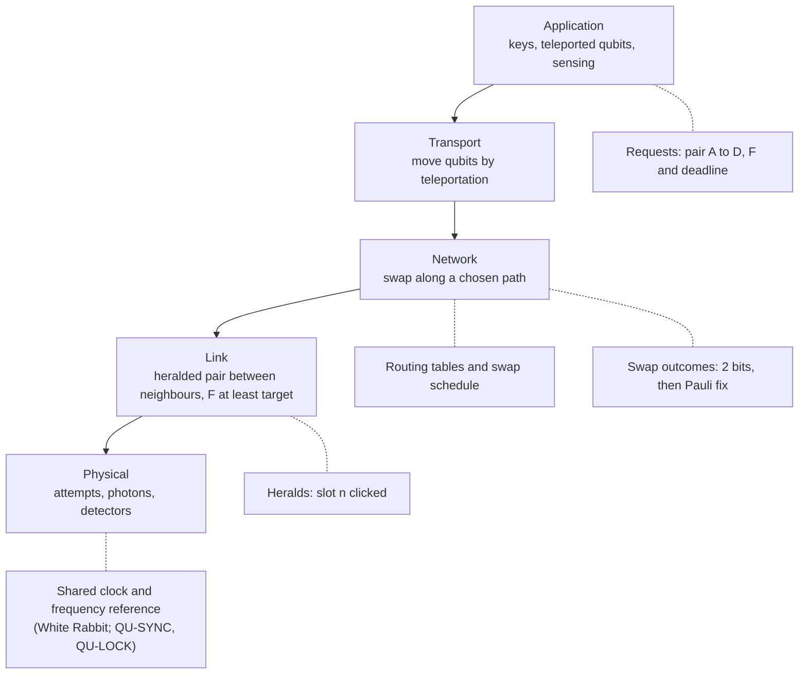

# Quantum Networking · Lesson 6.2: The network stack and timing

> ⏱ ~15 min · Module 6: Protocols and applications · Builds on: [1.2 The stack in one picture](01-02-the-stack-in-one-picture.md), [5.3 Bell-state measurement and swapping](05-03-bell-state-measurement-and-swapping.md), [computer-networks 1.1](../../computer-networks/lessons/01-01-packet-switching-and-layers.md), [computer-networks 3.3](../../computer-networks/lessons/03-03-routing-algorithms-link-state-and-distance-vector.md) · Unlocks: [6.3 Beyond keys](06-03-beyond-keys.md)

## Why this matters

Lesson 1.2 described the network as boxes in a pipeline. Boxes are not a network, though. A network is something a programmer can ask, "give me a pair between Brooklyn and Queens with fidelity at least 0.9 in the next second," without knowing which fiber, memory or swap will make it. The internet got there by **layering**. Quantum networks are being layered the same way, with two twists: the best path is not the shortest one, and every site has to agree on the time to well under a nanosecond. Both twists decide what gets built and who sells it.

## The idea

**Layers.** The best-known proposal (Dahlberg, Wehner and co-workers, 2019) borrows the internet's shape ([quantum network stack](../reference.md#quantum-network-stack)):

- **Physical**: fire attempts, send photons, click detectors, herald the successes. It knows time slots and wavelengths, not users.
- **Link**: turn that unreliable trickle into a *service* between neighbours ([heralded link layer](../reference.md#heralded-link-layer)). A request names two nodes, a minimum fidelity and a deadline. The link layer answers with a labelled pair and its expected fidelity. It offers two flavours: **create and keep** (store the pair in memories for later use) and **measure directly** (measure at once, which is all QKD needs).
- **Network**: join link pairs into end-to-end pairs by swapping along a chosen path. Choosing the path is **routing**.
- **Transport**: use end-to-end pairs to move qubits, by teleportation.
- **Application**: keys, linked processors, sensors ([6.3](06-03-beyond-keys.md)).

Each layer trusts the one below without knowing how it works, as in [computer-networks 1.1](../../computer-networks/lessons/01-01-packet-switching-and-layers.md).

**The hidden twin.** Every quantum layer runs on classical messages. Physical: "slot 48,213 clicked." Link: "pair 17 lives in memory slot 3, expected fidelity 0.94." Network: "swap at B gave outcome 01, so apply $Z$ at D." Transport: two bits per teleported qubit. A quantum network is therefore *two* networks: a quantum data plane and a classical **control plane** riding beside it, and the quantum one is useless without the other.

**Routing.** On the internet, fewer hops is usually better. Here a swap multiplies the pair's "good fraction", so three excellent links can beat one mediocre link.

**Timing.** A detector click is matched with its partner only if both land in the same coincidence window, about a nanosecond wide. When those detectors sit in different buildings, their clocks must agree to a fraction of that.

## The formal version

**Routing metric.** Take Werner links ([swap fidelity rule](../reference.md#swap-fidelity-rule)): link $i$ has good fraction $p_i=(4F_i-1)/3$, where $F_i$ is its fidelity to $|\Phi^+\rangle$. Model noiseless, deterministic swaps and memories that hold long enough. Lesson [5.3](05-03-bell-state-measurement-and-swapping.md) showed swapping multiplies good fractions, so a path $P$ delivers

$$p_P=\prod_{i\in P}p_i,\quad F_P=\frac{1+3p_P}{4}.$$

*In words: fidelity along a path is set by the product of the links' good fractions, not by how many links there are.*

Taking logs turns the product into a sum. With edge weight $w_i=-\ln p_i\ge 0$,

$$\max_P F_P \iff \min_P \sum_{i\in P} w_i.$$

*In words: give each link the length $-\ln p_i$ and the highest-fidelity path is the shortest path, so Dijkstra ([computer-networks 3.3](../../computer-networks/lessons/03-03-routing-algorithms-link-state-and-distance-vector.md)) finds it ([entanglement routing](../reference.md#entanglement-routing)).*

Rate needs its own model. With good memories, a path delivers at its slowest link's rate $r_\text{min}$. With a linear-optics Bell-state measurement that succeeds half the time per swap, a path of $n$ links delivers roughly

$$R_P\approx r_\text{min}\left(\tfrac12\right)^{n-1}.$$

*In words: extra hops are free for fidelity in this model but cost a factor of two in rate each, so routing has two objectives.*

**Timing.** Let two free-running clocks differ in rate by a fractional offset $y$ (1 ppm means $y=10^{-6}$). Their disagreement grows as

$$\delta(t)=\delta_0+y\,t.$$

*In words: a frequency error turns into a time error that grows without limit.*

Model the click-time difference of a true pair as Gaussian with standard deviation $\sigma$, from the combined [timing jitter](../reference.md#timing-jitter). The fraction of true coincidences inside a window of width $\tau$, centred on the expected arrival but shifted by offset $\delta$, is

$$c(\delta)=\Phi\!\left(\frac{\tau/2-\delta}{\sigma}\right)-\Phi\!\left(\frac{-\tau/2-\delta}{\sigma}\right),$$

with $\Phi$ the standard normal cumulative distribution.

*In words: as the clocks slide apart, true pairs fall out of the [coincidence window](../reference.md#coincidence-window) while accidentals, which are spread evenly in time, stay, so the measured fidelity drops.*

## Picture

The layered stack, with its classical control plane alongside. Solid arrows are "uses the service below"; dotted lines show the classical messages each layer depends on.

Read it bottom-up as a promise chain: the clock lets the physical layer label slots, labelled slots let the link layer herald pairs, heralded pairs let the network layer swap, and swap outcomes let transport finish a teleportation.

## Worked examples

**Example 1 (the shortest path loses).** Four nodes, route A to D. Links (fidelity, pairs/s): A–D (0.82, 200), A–B (0.97, 1000), B–D (0.96, 800), A–C (0.99, 1500), C–B (0.99, 1500). Model: Werner links, noiseless swaps, rate set by the slowest link.

Good fractions $p=(4F-1)/3$: A–D 0.7600, A–B 0.9600, B–D 0.9467, A–C 0.9867, C–B 0.9867.

| Path | Hops | $p_P$ | $F_P$ | Rate, deterministic swaps | Rate, 50% swaps |
|---|---|---|---|---|---|
| A–D | 1 | 0.7600 | 0.820 | 200 | 200 |
| A–B–D | 2 | 0.9088 | 0.932 | 800 | 400 |
| A–C–B–D | 3 | 0.9216 | 0.941 | 800 | 200 |

Edge weights $-\ln p$: A–D 0.2744; A–B–D $0.0408+0.0548=0.0956$; A–C–B–D $0.0134+0.0134+0.0548=0.0816$. Dijkstra picks A–C–B–D, the *longest* path, for fidelity. Hop-count routing picks A–D, the worst on fidelity and never better on rate. With half-efficient swaps, A–B–D wins on rate (400 vs 200 pairs/s) for a fidelity cost of about 0.01. Which one is "best" depends on what the application asked for, which is exactly why the request carries a fidelity target.

**Example 2 (Qunnect's timing budget).** In GothamQ the 1324 nm photon hit an SNSPD (about 90 ps jitter) and the 795 nm photon a SPAD (about 350 ps). Combined jitter adds in quadrature: $\sqrt{350^2+90^2}=361$ ps. Treat that as a Gaussian full width at half maximum, so $\sigma=361/2.355=153$ ps. Use a 1 ns window.

| Offset $\delta$ | 0 | 100 ps | 300 ps | 500 ps |
|---|---|---|---|---|
| True pairs kept, $c(\delta)$ | 0.999 | 0.995 | 0.904 | 0.500 |

Now let the two sites run on free clocks 1 ppm apart. They drift $10^{-6}\times10^9=1000$ ns per second, so they reach 100 ps of offset after 100 µs, half the window after 0.5 ms, and the full window after 1 ms. Even one herald's flight around the 34 km loop (about 170 µs at 5 µs/km) costs 0.17 ns of slip. Setting the clocks once is hopeless; they must be **frequency-locked** continuously, with the fiber delay measured and removed.

That is what **White Rabbit** does ([White Rabbit timing](../reference.md#white-rabbit-timing)). Developed at CERN, it extends Ethernet so one fiber carries both the frequency (the receiver locks to the incoming bit clock) and two-way timestamps that measure the link delay, reaching sub-nanosecond agreement across kilometres. In Qunnect's line the slot is QU-SYNC; the two papers give it no published spec. The memory paper is candid about why: its source–memory runs were triggered locally by the telecom click, with the memory-only runs on a 500 kHz global clock, and it notes that globally clocked operation is closer to a real deployment.

## Watch out

- **You might think the fewest hops is best.** Fidelity composes through the product of good fractions, so several high-fidelity hops can beat one long noisy link. Hop count is a fine proxy only when every link has the same quality.
- **You might think setting clocks once (as NTP does, to milliseconds) is enough.** Any frequency offset grows into a time offset; at 1 ppm a 1 ns window is lost in a millisecond. You need continuous frequency lock plus delay calibration, a million times finer than NTP.
- **You might think the quantum stack is TCP/IP with qubits.** No-cloning forbids keeping a copy to retransmit, and stored pairs decay, so "deliver later" is not free. The link layer delivers fresh pairs with an expected fidelity, and the herald acknowledges an *attempt*, not a delivery.

## Business lens

Layering decides where money flows. Once a link layer offers a clean service ("pair between A and B, fidelity at least 0.9, within 1 s"), whoever owns the layer above can route, schedule and bill across any vendor's hardware. That is where incumbents are entering. Cisco runs a quantum networking research effort, invests (Cisco Investments is a Qunnect investor) and is reported to partner with Aliro, whose software designs and orchestrates quantum networks. IonQ is consolidating hardware beneath it.

For a hardware company like Qunnect the lesson is two-sided. A well-specified, telemetry-rich link-layer interface makes Carina easy to plug into an operator's network-management system and someone else's orchestration, which widens the market. It also risks making the hardware a component while the software layer sets the price. Timing is the requirement customers forget to ask about until two sites must swap. A one-sentence answer for a buyer: a link needs its own window, two linked sites need a shared clock, and QU-SYNC is the box for that, still without a published spec.

## One-liner

> A quantum network is a layered service riding on a classical twin, routed by the product of good fractions rather than hop count, and held together by clocks that agree to a fraction of a nanosecond.

## Problems

**P1 (🟢)** Two sites run free clocks with a fractional frequency offset of 0.1 ppm and use a 0.5 ns coincidence window. Model the offset as growing linearly from zero. (a) How long until the offset equals the full window? (b) To keep the offset below 50 ps, how many times per second must the clocks be re-synchronised?

**P2 (🟡)** Route S to T. Links (Werner, fidelity): S–T 0.88, S–X 0.95, X–T 0.94, S–Y 0.985, Y–X 0.985. There are no other links. Model: noiseless deterministic swaps, memories that hold long enough. The application needs $F\ge0.89$. (a) Compute the end-to-end fidelity of each of the three loop-free paths. (b) Which path does hop-count routing pick, and does it meet the requirement?

**P3 (🔴, practical)** Using the [Carina product stack](../reference.md#carina-product-stack) (QU-SRC, QU-APC, QU-MEM, QU-SWAP, QU-SYNC, QU-LOCK), assign each box to the layer(s) it serves. Then, in three sentences or fewer, name the layer none of these boxes provides and say why it matters commercially.

Solutions

**P1** (a) Drift rate: $y=10^{-7}$, so $10^{-7}\times10^9=100$ ns per second. Time to reach 0.5 ns: $0.5/100=5\times10^{-3}$ s $=5$ ms.

(b) Time to reach 50 ps $=0.05$ ns: $0.05/100=5\times10^{-4}$ s $=0.5$ ms. Re-sync at least $1/(5\times10^{-4})=2000$ times per second. That is why real systems lock frequency continuously rather than re-setting time.

---

**P2** (a) Good fractions $p=(4F-1)/3$: S–T 0.8400, S–X 0.9333, X–T 0.9200, S–Y 0.9800, Y–X 0.9800.

S–T: $p=0.8400$, $F=0.880$.

S–X–T: $p=0.9333\times0.9200=0.8587$, $F=(1+3\times0.8587)/4=0.894$.

S–Y–X–T: $p=0.98\times0.98\times0.92=0.8836$, $F=(1+3\times0.8836)/4=0.913$.

The three-hop path S–Y–X–T has the highest fidelity.

(b) Hop-count routing picks the direct link S–T, with $F=0.880<0.89$: it fails the application, while both longer paths pass.

---

**P3** *(practical)*

**Accept:** any mapping that puts the source, compensation and frequency lock in the physical layer, the memory in the link (or link and network) layer, the swap as the network layer's mechanism, and treats sync as serving every layer; and that names routing and orchestration (network-layer decisions), or transport and application, as unsold.

**Must hit:**

- Physical: QU-SRC (pairs), QU-APC (keeps the channel), QU-LOCK (frequency); QU-SYNC underpins all layers by labelling time slots.
- Link: heralding plus QU-MEM for "create and keep" pairs.
- Network: QU-SWAP executes swaps, but no box *decides* which path or when.
- Commercial point: the deciding layer is software where Cisco/Aliro-style orchestration competes, so a clean link-layer interface is what makes Carina pluggable.

**Model answer:** None of the six boxes is the network layer's brain: routing, scheduling and orchestration of requests across many links, nor the transport and application layers above it. That software is where the customer's request ("a pair with fidelity at least 0.9, A to D") is actually met, and where players like Cisco and Aliro are positioning. Qunnect's leverage is to expose a clean, well-instrumented link-layer service so its hardware is the default underneath whoever wins that layer.

## Flashback

**From Lesson [5.5](05-05-repeater-generations-and-platform-bets.md) (Repeater generations and platform bets):** A third-generation design treats each lost photon as an erasure, so a hop with transmission $\eta_0$ has quantum capacity $Q=\max(0,\,1-2\varepsilon)$ with $\varepsilon=1-\eta_0$. Each hop runs over C-band fiber at 0.2 dB/km and also loses a fixed 1.4 dB in couplers and detectors. (a) What is the longest hop with $Q>0$? (b) For a 4 km hop, find $\eta_0$ and $Q$, and compare with the classical erasure capacity $1-\varepsilon$. (c) For contrast, take $v=2\times10^8$ m/s and the midpoint layout: what minimum memory time would a 2G node on the same 4 km link need, and what would a 1G chain of 100 such links need?

Solution

(a) $Q>0$ needs $\eta_0>\tfrac12$, a total loss under $10\log_{10}2=3.01$ dB. The fixed hardware takes 1.4 dB, leaving 1.61 dB of fiber:

$$L_\text{max}=\frac{1.61\ \text{dB}}{0.2\ \text{dB/km}}=8.05\ \text{km}.$$

(b) Loss $0.2\times4+1.4=2.2$ dB, so $\eta_0=10^{-0.22}=0.603$ and $\varepsilon=0.397$. Then $Q=1-2(0.397)=0.205$, against a classical $1-\varepsilon=0.603$: about three times less, because no-cloning doubles the erasure penalty.

(c) 2G: $\tau\gtrsim L_0/v=4\times10^3/(2\times10^8)$ s $=20$ µs. 1G: the chain spans 400 km, so $\tau\gtrsim L/v=2$ ms, 100 times more. A 3G node needs only its gate time, but it pays with a station every 8 km or less.

## Connections

- **Backward:** [1.2](01-02-the-stack-in-one-picture.md) gave the boxes; this lesson stacks them into layers. The routing metric is [5.3](05-03-bell-state-measurement-and-swapping.md)'s swap rule in logarithms, and the timing budget reuses [3.2](03-02-detectors-noise-and-the-brightness-fidelity-tradeoff.md)'s jitter and window. The "2 bits, then Pauli fix" message is [QC 2.4](../../quantum-computing/lessons/02-04-quantum-teleportation.md)'s classical channel.
- **Forward:** [6.3](06-03-beyond-keys.md) puts applications on top of this stack; linked processors need the transport layer, sensor networks need the clock most of all.
- **Sideways:** the layer model is [computer-networks 1.1](../../computer-networks/lessons/01-01-packet-switching-and-layers.md), and entanglement routing is Dijkstra from [computer-networks 3.3](../../computer-networks/lessons/03-03-routing-algorithms-link-state-and-distance-vector.md) on weights $-\ln p$. Repeater architectures that would sit under the network layer are in [5.5](05-05-repeater-generations-and-platform-bets.md).
