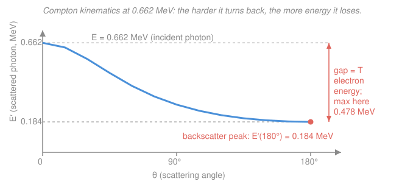

# Radiation Detection & Shielding · Lesson 1.1: Photon interactions I — photoelectric & Compton

> ⏱ ~15 min · Module 1: Radiation interactions & detector physics · Builds on: [intro-nuclear-engineering](../../intro-nuclear-engineering/syllabus.md) (photons through matter), [em-refresher](../../em-refresher/syllabus.md) · Unlocks: [1.2 Pair production & total attenuation](01-02-photon-pair-production-total-attenuation.md)

## Why this matters

A gamma-ray spectrum is a story about *how* photons handed their energy to your detector. Before you can read that story — name the full-energy peak, the ledge below it, the little bump near 0.2 MeV — you need the two interactions that dominate below a few MeV: the **photoelectric effect** (the photon vanishes entirely) and **Compton scattering** (the photon survives but limps away with less energy). Get their energetics right and half the features in any spectrum become predictable arithmetic. Get them wrong and you'll mistake a Compton edge for a real gamma line.

## The idea

Picture a photon of energy $E$ walking into matter. Two very different things can happen.

**Photoelectric:** the photon slams into a *tightly bound* inner electron and is swallowed whole. All of $E$ goes into knocking that electron free (a "photoelectron") plus a little to free it from its shell. The photon is gone — 100% of its energy deposited on the spot. This is a low-energy, high-$Z$ game: it needs a tightly bound electron to absorb the recoil, so it loves heavy atoms (lots of inner-shell binding) and low photon energies. That's exactly why a lead apron stops dental X-rays and why detectors are built from dense, high-$Z$ crystals.

**Compton:** the photon glances off a *loosely bound, essentially free* outer electron like a cue ball off the eight ball. It doesn't disappear — it ricochets away at some angle $\theta$ with *less* energy, having kicked the electron forward with the difference. A near-miss (small $\theta$) barely dents its energy; a head-on rebound (back the way it came, $\theta = 180^\circ$) costs it the most. Crucially, the photon can leave at *any* angle, so the recoil electron can carry *any* energy from zero up to a sharp maximum — and that spread of electron energies is what paints the "Compton continuum" in a spectrum.

## The formal version

**Photoelectric cross section.** The probability per atom scales roughly as

$$\sigma_{pe} \propto \frac{Z^{\,n}}{E^{3}}, \qquad n \approx 4\text{–}5,$$

where $Z$ is the atomic number of the absorber and $E$ the photon energy. In words: photoabsorption is a steep, high-$Z$, low-energy effect — halve the energy and it jumps by $\sim 8\times$; go from aluminum to lead and it jumps by thousands. After the photoelectron leaves, the atom fills the inner-shell hole and emits a **characteristic X-ray** or an **Auger electron** — a fingerprint of the absorber, and (later) a source of "escape peaks."

**Compton kinematics.** Conserving energy and momentum for a photon scattering off a free electron at rest, the scattered-photon energy is

$$E' = \frac{E}{1 + \dfrac{E}{m_e c^2}\,(1 - \cos\theta)}, \qquad m_e c^2 = 0.511\,\text{MeV},$$

where $\theta$ is the photon's deflection angle and $m_e c^2$ is the electron rest energy. In words: the more the photon turns ($\cos\theta$ falls from $+1$ toward $-1$), the smaller $E'$ gets — and higher-energy photons ($E$ large compared to $0.511\,\text{MeV}$) lose a bigger *fraction*.

The electron carries off the rest:

$$T = E - E'.$$

In words: whatever the photon loses, the recoil electron gains — and it's $T$, not the scattered photon, that your detector usually registers.

**Compton edge and backscatter peak.** $T$ is largest when the photon reverses completely, $\theta = 180^\circ$:

$$T_{\max} = E - E'(180^\circ), \qquad E'(180^\circ) = \frac{E}{1 + \dfrac{2E}{m_e c^2}}.$$

In words: $T_{\max}$ is the **Compton edge** — the sharp upper cliff of the electron continuum, sitting *below* the full-energy photopeak (the photon never gives the electron *all* its energy in a single scatter). The leftover photon $E'(180^\circ)$ is the **backscatter peak** — what you see when a photon Compton-scatters in the shielding *around* the detector and limps back in. Note the tidy bookkeeping: (edge) $+$ (backscatter) $= E$.

## Picture

The blue curve is $E'(\theta)$: full energy straight ahead, minimum at $180^\circ$. At any angle the vertical gap down from the dashed $E$ line to the curve is the electron energy $T$; that gap is widest at $180^\circ$, and *that* maximum is the Compton edge.

## Worked examples

**Example 1 (Compton — the $^{137}$Cs line, $E = 0.662\,\text{MeV}$).** First the ratio that appears everywhere: $\dfrac{E}{m_e c^2} = \dfrac{0.662}{0.511} = 1.296$.

*Scattered photon at $90^\circ$* ($\cos 90^\circ = 0$, so $1-\cos\theta = 1$):

$$E'(90^\circ) = \frac{0.662}{1 + 1.296 \times 1} = \frac{0.662}{2.296} = 0.288\,\text{MeV}.$$

*Scattered photon at $180^\circ$* ($\cos 180^\circ = -1$, so $1-\cos\theta = 2$):

$$E'(180^\circ) = \frac{0.662}{1 + 1.296 \times 2} = \frac{0.662}{3.591} = 0.184\,\text{MeV}.$$

*Compton edge* (max electron energy):

$$T_{\max} = E - E'(180^\circ) = 0.662 - 0.184 = 0.478\,\text{MeV}.$$

*Backscatter peak* $= E'(180^\circ) = 0.184\,\text{MeV}$. Sanity check: $0.478 + 0.184 = 0.662 = E$. ✓ So in a real $^{137}$Cs spectrum you expect a photopeak at $0.662$, a continuum ending in an edge at $0.478$, and a backscatter bump at $0.184$ — three features, all from this one formula.

**Example 2 (photoelectric trend — lead vs aluminum).** Take two absorbers at the *same* low photon energy: lead ($Z = 82$) and aluminum ($Z = 13$). Only the $Z^{\,n}$ factor differs, so the per-atom ratio of photoabsorption is

$$\frac{\sigma_{pe}^{\text{Pb}}}{\sigma_{pe}^{\text{Al}}} = \left(\frac{82}{13}\right)^{\!n} = (6.31)^{\,n}.$$

With $n = 4$: $(6.31)^4 \approx 1.58\times10^{3}$. With $n = 5$: $(6.31)^5 \approx 1.0\times10^{4}$. In words: **atom for atom, lead is roughly 1,600–10,000 times more likely to photoabsorb than aluminum** — before you even count that lead packs more atoms per cm³. That enormous $Z$ leverage is the whole reason shields and high-resolution detectors reach for high-$Z$ materials.

And the energy half of the scaling explains *why this is a low-energy story*: the $E^{-3}$ factor means raising the photon energy from $100\,\text{keV}$ to $200\,\text{keV}$ cuts $\sigma_{pe}$ by $2^3 = 8\times$. Push to $500\,\text{keV}$ and it's down by $5^3 = 125\times$ — by then Compton has taken over (that hand-off is Lesson 1.2).

## Watch out

- **The Compton edge is not a gamma line.** You might think every peak-like feature marks a photon energy in the source — but the edge sits *below* the photopeak by $E'(180^\circ)$ and belongs to *recoil electrons*, not to any emitted gamma. Reading it as a real line is a classic beginner misidentification.
- **A single Compton scatter never deposits all of $E$.** You might expect the electron to be able to take everything in a head-on hit, but even at $180^\circ$ the photon keeps $E'(180^\circ) > 0$. Full-energy deposition (the photopeak) requires the *photon* to also be caught — by photoabsorbing after scattering, which is why bigger, denser detectors have taller photopeaks.
- **Backscatter peak vs. edge — don't swap them.** They're complementary halves of the same $180^\circ$ event ($E'(180^\circ)$ is the backscatter photon; $E - E'(180^\circ)$ is the edge electron), so they always sum to $E$ — but one appears low in the spectrum and one high. Confusing them scrambles your energy calibration.

## One-liner

> Photoelectric swallows the photon whole (steeply favoring low $E$, high $Z$); Compton merely dents it, and the hardest-turned $180^\circ$ scatter fixes both the Compton edge and the backscatter peak, which sum to $E$.

## Problems

**P1 (🟢)** A $1.00\,\text{MeV}$ gamma Compton-scatters. Compute the scattered-photon energy at $90^\circ$, the Compton-edge electron energy, and the backscatter-peak energy. Verify your edge and backscatter sum to $E$.

**P2 (🟡)** Measurements show that at $100\,\text{keV}$ lead ($Z=82$) photoabsorbs about $4{,}000\times$ more per atom than aluminum ($Z=13$). Estimate the exponent $n$ in the $Z^{\,n}$ scaling. (Small idea: take logs.) Does your $n$ land in the expected range?

**P3 (🔴, optional)** Show that as $E \to \infty$ the backscatter-peak energy $E'(180^\circ)$ approaches a *constant*, and find it. Then evaluate $E'(180^\circ)$ and the Compton edge for a $6.0\,\text{MeV}$ gamma and comment on how close the backscatter peak already is to the limit. (This is why, in real spectra, the backscatter peak from *any* high-energy source parks near the same spot — a fact you'll lean on in gamma spectroscopy, Lesson 2.4.)

Solutions

**P1** Ratio $\dfrac{E}{m_e c^2} = \dfrac{1.00}{0.511} = 1.957$.

At $90^\circ$ ($1-\cos\theta = 1$): $E'(90^\circ) = \dfrac{1.00}{1 + 1.957} = \dfrac{1.00}{2.957} = 0.338\,\text{MeV}$.

At $180^\circ$ ($1-\cos\theta = 2$): $E'(180^\circ) = \dfrac{1.00}{1 + 2(1.957)} = \dfrac{1.00}{4.914} = 0.204\,\text{MeV}$ — the backscatter peak.

Compton edge: $T_{\max} = 1.00 - 0.204 = 0.796\,\text{MeV}$.

Check: $0.796 + 0.204 = 1.00 = E$. ✓

**P2** Set $(82/13)^{n} = 4000$, i.e. $(6.31)^{n} = 4000$. Take logs:

$$n = \frac{\ln 4000}{\ln 6.31} = \frac{8.294}{1.842} = 4.5.$$

An exponent $n \approx 4.5$ sits squarely in the quoted $n \approx 4$–5 range — consistent with the $Z^{\,n}/E^3$ rule of thumb. (The exponent isn't truly constant; it drifts with energy and $Z$, which is why textbooks quote a range rather than a single value.)

**P3** Divide top and bottom of $E'(180^\circ) = \dfrac{E}{1 + 2E/m_e c^2}$ by $E$:

$$E'(180^\circ) = \frac{1}{\tfrac{1}{E} + \tfrac{2}{m_e c^2}} \xrightarrow[E\to\infty]{} \frac{1}{2/m_e c^2} = \frac{m_e c^2}{2} = \frac{0.511}{2} = 0.256\,\text{MeV}.$$

So the backscatter peak can never exceed about $0.256\,\text{MeV}$, no matter how energetic the source.

For $E = 6.0\,\text{MeV}$: $\dfrac{E}{m_e c^2} = \dfrac{6.0}{0.511} = 11.74$, so

$$E'(180^\circ) = \frac{6.0}{1 + 2(11.74)} = \frac{6.0}{24.48} = 0.245\,\text{MeV},$$

and the Compton edge is $T_{\max} = 6.0 - 0.245 = 5.75\,\text{MeV}$. The backscatter peak ($0.245$) is already within $\sim 4\%$ of its $0.256\,\text{MeV}$ ceiling — high-energy sources all pile their backscatter bumps in the same narrow band just above $0.2\,\text{MeV}$.

## Connections

- **Backward:** this sharpens [intro-nuclear-engineering](../../intro-nuclear-engineering/syllabus.md)'s qualitative "photons interact with matter" into exact energetics; the momentum-conservation move behind the Compton formula is the relativistic kinematics from [em-refresher](../../em-refresher/syllabus.md).
- **Forward:** [Lesson 1.2](01-02-photon-pair-production-total-attenuation.md) adds pair production and folds all three processes into one total attenuation coefficient $\mu(E)$ with a dominance-by-energy map — and the photopeak/edge/backscatter trio computed here is exactly what you'll label on a real spectrum in Lesson 2.4 (gamma-ray spectroscopy).
- **Sideways (medical & health physics):** the same $Z^{\,n}/E^3$ photoelectric leverage is why bone (calcium, higher $Z$) shows up bright against soft tissue in a diagnostic X-ray, and why contrast agents use high-$Z$ iodine and barium — imaging physics running on this lesson's arithmetic.
