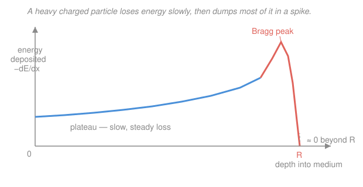

# Radiation Detection & Shielding · Lesson 1.3: Charged particles — stopping power & range

> ⏱ ~15 min · Module 1: Radiation interactions & detector physics · Builds on: [1.2 Pair production & total attenuation](01-02-photon-pair-production-total-attenuation.md), [`intro-nuclear-engineering`](../../intro-nuclear-engineering/syllabus.md) · Unlocks: [1.4 Neutron interactions](01-04-neutron-interactions.md), dosimetry Module 3

## Why this matters

A photon either survives a slab or is removed in one shot — there's no such thing as "half a gamma ray" coming out the far side. A **charged particle** is the opposite: it grinds to a halt over a definite, finite distance, ionizing atoms the whole way. That single fact drives three things you'll build on all course: why an alpha source is harmless in your pocket but lethal if inhaled, how a detector turns a particle into a countable pulse (Module 1.5), and how "energy deposited" becomes "dose" (Module 3). It also hides a beautiful trick — the energy loss *spikes* right before the particle stops, which is exactly why proton beams can hit a tumor and spare the tissue behind it.

## The idea

Fire an alpha particle into matter. It's a heavy, doubly-charged bullet plowing through a fog of atomic electrons. Each electron it passes gives a tiny Coulomb tug, siphoning off a sip of energy — an **ionization** (electron knocked free) or **excitation** (electron bumped up a level). One collision barely dents the alpha; but it makes *millions* of them, so the energy bleeds away **continuously**, like a truck coasting through deep mud. Because the alpha is thousands of times heavier than an electron, it barely deflects — it travels a nearly straight line and stops at a well-defined **range**.

Now the punchline. How fast does it lose energy? Mostly it depends on how *slow* it's going: a sluggish particle lingers near each electron, so the tug lasts longer and steals more. As the alpha slows down, it loses energy *faster* — a runaway. So the energy-loss rate is modest at first, then blows up right at the end of the trip. Plot energy-deposited-per-millimeter against depth and you get a flat plateau followed by a sharp spike: the **Bragg peak**. The particle saves its biggest punch for its last micron.

## The formal version

**Linear stopping power.** The energy a charged particle loses per unit path length is

$$S = -\frac{dE}{dx} \quad \left[\tfrac{\text{MeV}}{\text{cm}}\right],$$

where $E$ is the particle's kinetic energy and $x$ is distance travelled. *In words: how many MeV the particle sheds per cm of material.* Dividing by the material density $\rho$ gives the **mass collision stopping power** $-\frac{1}{\rho}\frac{dE}{dx}$ (units MeV·cm²/g), which strips out density so different materials can be compared fairly.

**The Bethe formula — the intuition.** For a heavy particle of charge $ze$ moving at speed $v$ through a medium, the collisional stopping power is

$$-\frac{dE}{dx} \;\propto\; \frac{z^2}{v^2}\, n \,\ln\!\left(\frac{2 m_e v^2}{I}\right), \qquad n = \frac{N_A\,Z\,\rho}{A}.$$

Here $z$ is the projectile charge number, $v$ its speed, $n$ the medium's **electron density** (electrons per cm³), $Z/A$ the target's atomic-number-to-mass ratio, $m_e$ the electron mass, and $I$ the material's **mean excitation energy** (roughly $10Z$ eV). *In words: stopping power is set by how hard the projectile pulls (its charge squared), how slowly it moves (so it lingers), and how many electrons it meets.* Three scalings carry all the physics:

- **$\propto z^2$** — double the charge, quadruple the loss. An alpha ($z=2$) stops four times harder than a proton at the *same speed*.
- **$\propto 1/v^2$** — slower means deadlier. This term explodes as the particle stops: the seed of the Bragg peak.
- **$\propto n \propto Z/A$** — more target electrons, more collisions. Most materials have $Z/A \approx 0.5$, so mass stopping power is nearly material-independent (hydrogen, with $Z/A = 1$, is the standout).

Notice the projectile *mass* is absent (only its charge and speed appear) — a subtlety we'll cash in below.

**Specific ionization.** Divide the energy lost per cm by the average energy $W$ needed to make one ion pair ($W \approx 34$ eV in air) to get ion pairs created per cm:

$$\text{SI} = \frac{1}{W}\left(-\frac{dE}{dx}\right).$$

*In words: the stopping power, converted from MeV/cm into ion-pairs/cm — this is literally the signal a gas detector will collect (Lesson 1.5).*

**CSDA range.** Assume the particle slows down continuously (the **continuous-slowing-down approximation**). Its range is the total path length, found by integrating the reciprocal stopping power from the starting energy $E_0$ down to zero:

$$R_{\text{CSDA}} = \int_0^{E_0} \frac{dE}{\,-dE/dx\,}.$$

*In words: add up the little distances $dx = dE/(-dE/dx)$ over which each slice of energy is spent.* For heavy charged particles this range is sharp and reproducible — a 5.5 MeV alpha travels essentially the same 4 cm in air every time. A handy empirical shortcut for alphas in air (4–7 MeV):

$$R_{\text{air}}(\text{cm}) \approx 0.325\, E^{3/2}, \qquad E \text{ in MeV}.$$

**Electrons are different.** A beta particle has the *mass of the electrons it hits*, so a single collision can fling it sideways — its path is a drunken zig-zag, and identical betas stop at scattered depths (**range straggling**). "Range" becomes fuzzy, quoted as a mass thickness (g/cm²) rather than a crisp distance. Worse, a light particle decelerating near a nucleus radiates **bremsstrahlung** X-rays, a loss channel that scales as $\approx 3.5\times10^{-4}\,Z\,E_{\max}$ (fraction of beta energy, $E$ in MeV) — so **high-Z shields turn a clean beta into penetrating X-rays**. That's why you stop betas with *low-Z* material (plastic, aluminum), not lead.

## Picture

## Worked examples

**Example 1 — Bethe scaling: alpha vs proton vs beta at the same energy.** Take a 5 MeV alpha ($z=2$, mass $\approx 4u$), a 5 MeV proton ($z=1$, mass $\approx 1u$), and a 5 MeV beta.

*Step 1 — same energy means different speed.* Kinetic energy $E = \tfrac12 M v^2$, so at fixed $E$, $v^2 \propto 1/M$. The alpha is four times heavier than the proton, so

$$\frac{v_\alpha^2}{v_p^2} = \frac{M_p}{M_\alpha} = \frac14.$$

The alpha lumbers along at half the proton's speed.

*Step 2 — plug into $z^2/v^2$.* The instantaneous stopping-power ratio (ignoring the slowly-varying log) is

$$\frac{S_\alpha}{S_p} = \frac{z_\alpha^2/v_\alpha^2}{z_p^2/v_p^2} = \frac{2^2}{1^2}\cdot\frac{v_p^2}{v_\alpha^2} = 4 \times 4 = 16.$$

The alpha dumps energy about **16 times faster** — bigger charge *and* slower speed both pile on. So its range is far shorter: measured air ranges are about 3.6 cm (alpha) versus roughly 30 cm (proton), an order-of-magnitude gap.

*Step 3 — the beta.* A 5 MeV beta is relativistic ($v \approx c$), so its $1/v^2$ factor is tiny next to the crawling alpha's, and $z=1$. It penetrates about 2.5 cm of *water* (roughly $0.54\times 5 - 0.13 \approx 2.6$ g/cm²) — while the 5 MeV alpha stops in about 40 µm of tissue. Same energy, ~600× the reach.

*Why an alpha stops in microns.* Convert the 3.6 cm air range to tissue with the Bragg–Kleeman density scaling (range $\propto 1/\rho$, times an order-one $\sqrt{A}$ factor $\approx 0.7$): tissue is ~770× denser than air, so

$$R_{\text{tissue}} \approx 3.6\,\text{cm} \times \frac{0.00129}{1.0}\times 0.7 \approx 3.3\times10^{-3}\,\text{cm} = 33\ \mu\text{m}.$$

A few cell diameters. That's why an alpha emitter can't get through the dead outer layer of your skin from outside — but inhaled or ingested, it deposits everything into live tissue at point-blank range.

**Example 2 — range and shield thickness for an Am-241 alpha.** An $^{241}\text{Am}$ source emits 5.5 MeV alphas. How far do they go in air, and what stops them?

*Air range.* Using the empirical rule,

$$R_{\text{air}} \approx 0.325\,(5.5)^{3/2} = 0.325 \times 12.9 \approx 4.2\ \text{cm}.$$

*As a mass thickness.* Multiply by air density to get the material-independent measure:

$$R \times \rho_{\text{air}} = 4.2\ \text{cm} \times 0.00129\ \tfrac{\text{g}}{\text{cm}^3} \approx 5.4\times10^{-3}\ \tfrac{\text{g}}{\text{cm}^2}.$$

*The shield.* A sheet of office paper is about $80\ \text{g/m}^2 = 8\times10^{-3}\ \text{g/cm}^2$ — *thicker* than the alpha's entire mass range. So **one sheet of paper stops a 5.5 MeV alpha**, and so does the ~40 µm dead layer of your skin. No lead, no aluminum, nothing exotic: the whole "shielding" problem for external alphas is solved by a few centimeters of air. (Contrast this with the photon of Lesson 1.2, which needs centimeters of lead and still only *attenuates*, never fully stops.)

## Watch out

- **You might think a bigger, more energetic particle penetrates further — so an alpha should out-reach a beta.** Backwards. At equal energy the alpha's charge² and low speed make it stop in microns while the beta travels centimeters. Penetration is about *charge and speed*, not energy alone.
- **You might read the Bragg peak as "the particle speeds up at the end."** No — it's *slowing down*, and slow is exactly when $1/v^2$ makes each collision costlier. The peak is the death rattle, not a sprint.
- **You might reach for lead to shield a beta source, out of gamma habit.** Lead's high $Z$ maximizes bremsstrahlung — you'd trade an easily-stopped beta for penetrating X-rays. Use low-Z plastic first; add lead only for the bremsstrahlung it *creates*.

## One-liner

> A heavy charged particle loses energy continuously at a rate $\propto z^2/v^2$, so it stops in a sharp finite range and dumps its biggest punch — the Bragg peak — in the final microns.

## Problems

**P1 (🟢)** The 5.5 MeV alpha from Example 2 stops in air, where it takes about $W = 34$ eV to create one ion pair. Estimate (a) the total number of ion pairs it makes, and (b) its *average* specific ionization (ion pairs per cm) over the 4.2 cm range. Would the specific ionization at the Bragg peak be higher or lower than this average?

**P2 (🟡)** Proton therapy places the Bragg peak on a tumor at depth. Using the approximate proton range rule in tissue $R(\text{cm}) \approx 0.0022\,E^{1.8}$ ($E$ in MeV), estimate the proton energy needed to reach a tumor 15 cm deep. Sketch (in words) why a proton beam spares tissue *behind* the tumor while an X-ray beam of the same reach does not.

**P3 (🔴)** A $^{90}\text{Sr}/^{90}\text{Y}$ source emits betas up to $E_{\max} = 2.28$ MeV. Using the bremsstrahlung fraction $f \approx 3.5\times10^{-4}\,Z\,E_{\max}$, estimate the fraction of beta energy radiated as X-rays if you shield with lead ($Z = 82$) versus acrylic plastic (effective $Z \approx 6$). What shielding strategy does this dictate?

Solutions

**P1.** (a) Every bit of the 5.5 MeV eventually goes into ionization and excitation; taking $W$ as the average cost per ion pair,

$$N = \frac{E}{W} = \frac{5.5\times10^{6}\ \text{eV}}{34\ \text{eV/ip}} \approx 1.6\times10^{5}\ \text{ion pairs}.$$

(b) Spread over the range,

$$\overline{\text{SI}} = \frac{N}{R} = \frac{1.6\times10^{5}}{4.2\ \text{cm}} \approx 3.9\times10^{4}\ \tfrac{\text{ip}}{\text{cm}}.$$

The specific ionization at the Bragg peak is **higher** than this average — by definition the peak is where $-dE/dx$ (hence ion pairs per cm) is largest, several times the mean, while the entry plateau sits below it.

*Check.* Units: eV / (eV/ip) = ip ✓; ip / cm ✓. Magnitude $\sim 10^4$–$10^5$ ip/cm is the textbook value for MeV alphas in air. ✓

**P2.** Solve the range rule for $E$ with $R = 15$ cm:

$$15 = 0.0022\,E^{1.8} \;\Longrightarrow\; E^{1.8} = \frac{15}{0.0022} = 6.8\times10^{3}.$$

Take logs: $1.8\ln E = \ln(6818) = 8.83$, so $\ln E = 4.90$ and

$$E = e^{4.90} \approx 1.3\times10^{2}\ \text{MeV} \approx 135\ \text{MeV}.$$

(Real therapy machines use ~150 MeV for this depth; the rule is a rough empirical fit, good to tens of percent.) *Why it spares the far side:* a proton deposits little in the entry plateau and dumps most of its energy in the Bragg peak, then **stops** — nothing continues past the range, so tissue behind the tumor gets almost nothing. An X-ray beam attenuates exponentially ($I = I_0 e^{-\mu x}$, Lesson 1.2): it deposits the *most* near the entrance and keeps going with an exponential tail through everything beyond, irradiating the far tissue too.

*Check.* $0.0022\times135^{1.8}$: $135^{1.8}= e^{1.8\ln135}=e^{1.8\times4.905}=e^{8.83}\approx 6.8\times10^3$, times $0.0022 = 15$ cm ✓.

**P3.** Plug into $f \approx 3.5\times10^{-4}\,Z\,E_{\max}$ with $E_{\max} = 2.28$ MeV:

$$f_{\text{Pb}} \approx 3.5\times10^{-4}\times 82 \times 2.28 \approx 0.065 \quad (\sim 6.5\%),$$
$$f_{\text{acrylic}} \approx 3.5\times10^{-4}\times 6 \times 2.28 \approx 0.0048 \quad (\sim 0.5\%).$$

Lead radiates roughly $82/6 \approx 14\times$ more of the beta energy as penetrating X-rays. **Strategy:** stop the betas with the low-Z acrylic first (it fully absorbs them with minimal bremsstrahlung); only if the residual X-rays matter do you add a thin high-Z layer *outside* the plastic to attenuate them. Never lead-first.

*Check.* $f$ is dimensionless (Z and MeV are just numbers in this empirical rule) ✓; both fractions are small, consistent with bremsstrahlung being a minor channel for few-MeV betas, and the high-Z penalty is the ~14× ratio that motivates the material choice. ✓

## Flashback

**From Lesson 1.2 (pair production & total attenuation):** A 3.0 MeV gamma ray undergoes pair production in a lead shield. What is the total kinetic energy shared by the electron–positron pair, and roughly how much does each carry on average?

Solution

Pair production must first "pay" for the rest-mass energy of the two created particles, $2 m_e c^2 = 2(0.511) = 1.022$ MeV (the threshold). Everything above that becomes kinetic energy:

$$K_{\text{total}} = E_\gamma - 2 m_e c^2 = 3.0 - 1.022 = 1.978\ \text{MeV}.$$

On average the electron and positron share it roughly equally, so each carries about $1.978/2 \approx 0.99$ MeV. *Check.* $E_\gamma = 3.0 > 1.022$ MeV, so the process is allowed ✓; those ~1 MeV charged particles then slow down exactly as this lesson describes — pair production seeds the very stopping-power physics we just studied. ✓

## Connections

- **Backward:** [1.2](01-02-photon-pair-production-total-attenuation.md) gave photons an *exponential* survival ($I = I_0 e^{-\mu x}$, no finite range); charged particles are the mirror image — continuous loss, a hard stop at $R$. And pair production (1.2) *creates* the fast electrons whose stopping this lesson describes, tying the two together.
- **Forward:** the ion pairs counted here become the raw signal of a **gas-filled detector** ([1.5](01-05-gas-filled-detectors.md)), and the energy deposited *is* the **absorbed dose** of Module 3 — the Bragg peak is why alpha dose concentrates so sharply. Next up, [1.4 Neutron interactions](01-04-neutron-interactions.md): neutrals that must first make a charged particle before any of this applies.
- **Sideways (calculus):** the CSDA range is a textbook definite integral, $R = \int_0^{E_0} dE/(-dE/dx)$ — the same "integrate the reciprocal rate to get total displacement" move from [`calc-refresher`](../../calc-refresher/syllabus.md). And the Bragg peak underwrites **proton and heavy-ion therapy** in medical physics: place the peak on the tumor, spare what's behind.
