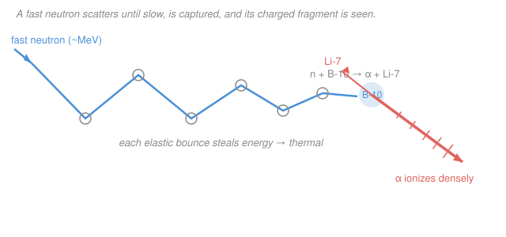

# Radiation Detection & Shielding · Lesson 1.4: Neutron interactions — scattering & capture

> ⏱ ~15 min · Module 1: Radiation interactions & detector physics · Builds on: [1.3 Charged particles: stopping power & range](01-03-charged-particles-stopping-power-range.md), [intro-nuclear-engineering](../../intro-nuclear-engineering/syllabus.md) · Unlocks: [1.5 Gas-filled detectors](01-05-gas-filled-detectors.md), [4.4 Neutron moderation & shielding](04-04-neutron-moderation-shielding.md)

## Why this matters

Every detector in the last three lessons worked because the radiation *ionizes directly* — a photon kicks out an electron, an alpha rips a track of ion pairs. A neutron does none of that. It carries no charge, so it sails past the electron cloud untouched and only "sees" the nucleus. That means you can never detect a neutron head-on; you detect the **charged particle or gamma it liberates** when it finally hits a nucleus. Get this reaction chain right and you can pick the correct neutron tube, understand why every neutron detector is wrapped in plastic, and later size a neutron shield — the whole game is *slow it down, then catch it*.

## The idea

Picture a cue ball with no electric charge rolling across a table studded with heavier balls (nuclei). It ignores the felt entirely and only changes course when it physically strikes a ball. Two things can happen at a strike:

- **Scatter** — it bounces off, handing over some of its speed. Off a light ball (a proton, nearly its own mass) it can lose *everything* in one hit; off a heavy ball it barely slows, like a marble off a bowling ball.
- **Absorb** — the ball swallows it, and something new flies out: a gamma ray, or a charged fragment.

Here's the twist that governs all neutron work: a *slow* neutron is far more likely to be swallowed than a fast one. A fast neutron blitzes past a nucleus with almost no chance to react; a crawling one lingers in range long enough to be captured. So the recipe for detecting or absorbing a fast neutron is always two-step — **scatter it down to a crawl (thermalize), then let a nucleus capture it** and read the charged particle that comes out.

## The formal version

**No direct ionization.** A neutron has charge $0$, so it exerts no Coulomb force on atomic electrons. It interacts only with nuclei, via two channels:

**1. Scattering** (neutron survives, redirected).
- *Elastic* $(n,n)$: billiard-ball collision, kinetic energy conserved. For a head-on hit on a nucleus of mass number $A$ (taking the neutron mass as $1$), the neutron transfers a fraction
$$f_{\max}=\frac{4A}{(1+A)^2}$$
of its energy. In words: the lighter the target, the bigger the maximum bite a neutron can take — and hydrogen ($A=1$) gives $f_{\max}=1$, a total wipeout in one collision.
- *Inelastic* $(n,n'\gamma)$: the neutron briefly enters the nucleus, leaves it in an excited state, and a gamma is emitted as the nucleus relaxes. This needs a neutron energetic enough to reach the first nuclear excited level (typically $\gtrsim 0.1$–$1\,\text{MeV}$), so **only fast neutrons scatter inelastically**.

**2. Absorption** (neutron vanishes, new particle out).
- *Radiative capture* $(n,\gamma)$: the nucleus swallows the neutron and de-excites by emitting a gamma, e.g. $\ce{^{113}Cd(n,\gamma)^{114}Cd}$. In words: the neutron is gone; a gamma carries off the binding energy.
- *Charged-particle reactions* — the workhorses of neutron detection, because they hand you a directly-ionizing product:
$$\ce{^{10}B + n -> ^{7}Li + \alpha}, \qquad \ce{^{6}Li + n -> ^{3}H + \alpha}, \qquad \ce{^{3}He + n -> ^{3}H + p}.$$
In words: each converts an undetectable neutron into a heavy charged particle that lays down a dense ionization track — exactly the signal a gas or scintillation detector is built to read.

**The $1/v$ law.** For most absorbers, over the low-energy range, the absorption cross section rises as the neutron slows:
$$\sigma_a(v)\propto \frac{1}{v}\propto \frac{1}{\sqrt{E}},$$
since $E=\tfrac12 m v^2$ gives $v\propto\sqrt{E}$. In words: the *reaction rate per unit path* holds roughly constant (a slower neutron spends proportionally more time near the nucleus), so the probability of capture per unit distance is nearly flat — but the cross section itself, the effective target area, grows without bound as $v\to 0$. That is why thermal neutrons are captured hundreds to thousands of times more readily than fast ones.

**Energy ranges** (worth memorizing):

| Band | Energy | Behavior |
|---|---|---|
| Fast | $\gtrsim 0.1\,\text{MeV}$ | scatters (elastic + inelastic); tiny capture $\sigma$ |
| Epithermal | $\sim 1\,\text{eV}$–$0.1\,\text{MeV}$ | slowing down; resonance capture peaks |
| Thermal | $\approx 0.025\,\text{eV}$ ($v_0=2200\,\text{m/s}$, $20\,^\circ\text{C}$) | in equilibrium with matter; huge capture $\sigma$ |

**Thermalization** is the deliberate use of elastic scattering off light nuclei to walk a fast neutron down into the thermal band, where the $1/v$ law makes capture easy.

## Picture

The blue path is one neutron: big zig-zags at first (large energy loss per bounce), shrinking as it slows. When it reaches thermal speed a $\ce{^{10}B}$ nucleus captures it; the coral $\alpha$ flies off and lays down the dense ionization track (ticks) that the detector actually counts. The neutron is never seen — its **proxy** is.

## Worked examples

**Example 1 — elastic recoil: why hydrogen wins.** A $2.0\,\text{MeV}$ fast neutron scatters elastically. What is the maximum energy it can hand to (a) a hydrogen nucleus (proton, $A=1$) and (b) a carbon nucleus ($A=12$)?

Use $E_{\text{recoil}}^{\max}=f_{\max}E_n=\dfrac{4A}{(1+A)^2}E_n$.

(a) Hydrogen: $f_{\max}=\dfrac{4(1)}{(1+1)^2}=\dfrac{4}{4}=1.$
$$E_{\text{recoil}}^{\max}=1\times 2.0\,\text{MeV}=2.0\,\text{MeV}\quad(100\%).$$
A single head-on hit can stop the neutron dead and give *all* its energy to the proton.

(b) Carbon: $f_{\max}=\dfrac{4(12)}{(13)^2}=\dfrac{48}{169}=0.284.$
$$E_{\text{recoil}}^{\max}=0.284\times 2.0\,\text{MeV}=0.57\,\text{MeV}\quad(28\%).$$

**Why this matters twice over.** Hydrogen removes the most energy per collision, so hydrogenous materials (water, paraffin, polyethylene) are the best moderators — the reason neutron sources and detectors are wrapped in plastic. And the *recoil proton itself* is a charged particle: a hydrogen-filled or plastic detector is a **proton-recoil** detector, reading the ion track the struck proton leaves (straight back to Lesson 1.3's stopping power). Averaged over all scattering angles the mean transferred fraction is $\dfrac{2A}{(1+A)^2}$, which for hydrogen is $\tfrac12$ — about half the energy gone per bounce on average, so only $\sim\!18$ collisions carry $2\,\text{MeV}$ down to thermal, versus $\sim\!115$ off carbon.

**Example 2 — the $1/v$ law scales a capture cross section.** The $\ce{^{10}B(n,\alpha)}$ reaction has a thermal cross section $\sigma_0=3840\,\text{barns}$ at $E_0=0.025\,\text{eV}$. Estimate $\sigma$ at (a) an epithermal $1\,\text{eV}$ and (b) a fast $100\,\text{keV}$, and say what it means for detection.

The $1/v$ law gives $\sigma\propto 1/\sqrt{E}$, so
$$\sigma(E)=\sigma_0\sqrt{\frac{E_0}{E}}.$$

(a) At $E=1\,\text{eV}$: $\sqrt{E_0/E}=\sqrt{0.025/1}=\sqrt{0.025}=0.158$,
$$\sigma=3840\times0.158=607\,\text{barns}.$$

(b) At $E=100\,\text{keV}=1.0\times10^{5}\,\text{eV}$: $\sqrt{E_0/E}=\sqrt{0.025/10^{5}}=\sqrt{2.5\times10^{-7}}=5.0\times10^{-4}$,
$$\sigma=3840\times5.0\times10^{-4}=1.9\,\text{barns}.$$

So the effective target shrinks from $3840$ barns at thermal to about $2$ barns at $100\,\text{keV}$ — a factor of roughly $2000$. A $\ce{^{10}B}$ or $\ce{^{3}He}$ tube (both $1/v$ absorbers, with thermal cross sections of thousands of barns) is therefore a superb **thermal**-neutron detector but nearly blind to fast neutrons. The fix is built into every such tube: surround it with a hydrogenous moderator so incoming fast neutrons scatter down into the thermal band *first*, where the cross section is enormous and capture — hence detection — becomes efficient. Slow it down, then catch it.

## Watch out

- You might think a neutron ionizes a little on its way in, like a weak charged particle. It ionizes **nothing** directly — zero charge, zero Coulomb force. Every neutron "signal" is secondary: a recoil proton, an $\alpha$, a $\ce{^{3}H}$, or a capture gamma. Design the detector around the *proxy*, not the neutron.
- You might think a bigger cross section means the neutron deposits more energy. Cross section is a *probability of interacting*, an effective area in barns ($1\,\text{barn}=10^{-24}\,\text{cm}^2$) — it says nothing about how much energy is transferred. The thermal neutron captured by $\ce{^{10}B}$ arrives with only $0.025\,\text{eV}$; the $\sim2.3\,\text{MeV}$ your detector reads is *reaction* energy released by the nucleus, not the neutron's own kinetic energy.
- You might think inelastic scattering is just a slower elastic bounce. No — inelastic scattering **excites the nucleus and emits a gamma**, and it has an energy *threshold* (the first excited state). Below that threshold it's forbidden, so only fast neutrons do it; slow-neutron scattering is purely elastic.

## One-liner

> A neutron is invisible until a nucleus turns it into something charged — so you thermalize it with light-nucleus scattering, then let the $1/v$ law hand it to a capture reaction you can actually count.

## Problems

**P1 (🟢)** A neutron scatters elastically off a deuterium nucleus ($A=2$). What is the maximum fraction of its energy it can lose in one collision? Is deuterium a better or worse moderator per collision than ordinary hydrogen, and why might you still prefer it in a reactor?

**P2 (🟡)** A $\ce{^{6}Li(n,\alpha)^{3}H}$ detector has thermal cross section $\sigma_0=940\,\text{barns}$ at $0.025\,\text{eV}$. (a) Using the $1/v$ law, at what neutron energy does the cross section fall to $94\,\text{barns}$? (b) A colleague proposes detecting $2\,\text{MeV}$ fission neutrons by shooting them straight at a bare $\ce{^6Li}$ film. Estimate $\sigma$ at $2\,\text{MeV}$ and explain in one sentence why they should moderate first.

**P3 (🔴, optional)** A $\ce{^{3}He}$ proportional tube ($\sigma_0=5330\,\text{barns}$ at $0.025\,\text{eV}$) is wrapped in polyethylene. A $1.0\,\text{MeV}$ neutron enters. (a) Roughly how much energy can it lose to a single proton in the polyethylene in one head-on hit? (b) After it reaches thermal energy, the $\ce{^{3}He}$ capture releases $Q=0.76\,\text{MeV}$ shared by a proton and a triton. Which particle carries more kinetic energy, and (qualitatively) why? (Momentum conservation from a nearly-at-rest capture.)

Solutions

**P1** Maximum fractional energy loss in one elastic collision is $f_{\max}=\dfrac{4A}{(1+A)^2}$. For $A=2$:
$$f_{\max}=\frac{4(2)}{(1+2)^2}=\frac{8}{9}=0.889\quad(89\%).$$
Per collision, deuterium is a *worse* moderator than hydrogen ($f_{\max}=1$, i.e. $100\%$): it removes at most $89\%$ versus $100\%$, so on average it needs more collisions to thermalize. But hydrogen also *absorbs* neutrons via $\ce{^1H(n,\gamma)^2H}$ (thermal $\sigma\approx0.33\,\text{barn}$), removing neutrons you may want to keep. Deuterium's capture cross section is tiny ($\sim0.0005\,\text{barn}$), so heavy water ($\ce{D2O}$) moderates while wasting almost no neutrons — the trade that makes it the moderator for natural-uranium reactors. (Cross-link: this "slow-but-don't-absorb" balance is the moderating-ratio idea in reactor-physics and in [4.4 Neutron moderation & shielding](04-04-neutron-moderation-shielding.md).)

**P2** (a) $1/v$ law: $\sigma=\sigma_0\sqrt{E_0/E}$. Set $\sigma=94\,\text{barns}=\sigma_0/10$, so $\sqrt{E_0/E}=1/10$, i.e. $E_0/E=1/100$, giving
$$E=100\,E_0=100\times0.025\,\text{eV}=2.5\,\text{eV}.$$
(A tenfold drop in cross section costs a hundredfold rise in energy — the square root at work.)

(b) At $E=2\,\text{MeV}=2\times10^{6}\,\text{eV}$:
$$\sqrt{E_0/E}=\sqrt{\frac{0.025}{2\times10^{6}}}=\sqrt{1.25\times10^{-8}}=1.12\times10^{-4},$$
$$\sigma=940\times1.12\times10^{-4}=0.105\,\text{barn}\approx0.1\,\text{barn}.$$
The bare-film capture cross section at $2\,\text{MeV}$ is $\sim0.1\,\text{barn}$ versus $940\,\text{barns}$ at thermal — nearly $10{,}000$ times smaller — so almost every fast neutron passes through uncaptured; moderating to thermal first raises the capture (and hence detection) probability by that same factor.

**P3** (a) Head-on hit on a proton ($A=1$): $f_{\max}=1$, so the neutron can lose up to its *entire* $1.0\,\text{MeV}$ to one proton — this is what thermalizes it inside the polyethylene.

(b) The capture $\ce{^3He + n -> ^3H + p}$ happens on a nearly-at-rest $\ce{^3He}$ nucleus, so total momentum is $\approx 0$: the proton and triton fly apart back-to-back with **equal and opposite momenta**, $p_p=p_t$. Kinetic energy is $E=p^2/2m$, so with equal momentum the *lighter* particle carries more energy: $E_p/E_t=m_t/m_p\approx3$. The proton (mass $1$) takes about $3/4$ of $Q$ ($\approx0.57\,\text{MeV}$) and the triton (mass $3$) about $1/4$ ($\approx0.19\,\text{MeV}$). Both are charged and both ionize — the tube reads their combined $0.76\,\text{MeV}$ as one full-energy pulse.

## Flashback

**From Lesson 1.3 (Charged particles: stopping power & range):** Collisional stopping power scales as $-\dfrac{dE}{dx}\propto \dfrac{z^2}{v^2}$, where $z$ is the particle's charge and $v$ its speed. An $\alpha$ particle ($z=2$) and a proton ($z=1$) move through the same gas at the **same speed**. Which loses energy faster, and by what factor? What does this imply about their relative ranges?

Solution

At equal speed the $v^2$ factors cancel, so the ratio of stopping powers is set purely by $z^2$:
$$\frac{(-dE/dx)_\alpha}{(-dE/dx)_p}=\frac{z_\alpha^2}{z_p^2}=\frac{2^2}{1^2}=4.$$
The $\alpha$ loses energy **4 times faster** per unit path. It therefore deposits its energy over a much shorter distance — a far shorter range and a denser ionization track — which is exactly why the $\alpha$ from a $\ce{^{10}B(n,\alpha)}$ capture stops within a fraction of a millimeter inside the detector gas and produces a sharp, fully-contained pulse. (Same $z^2$ dependence that made the alpha's Bragg peak so pronounced in 1.3.)

## Connections

- **Backward:** the detected signal is a *charged particle* — the recoil proton or capture $\alpha/$triton — so its ionization track, range, and Bragg peak are pure [1.3 stopping-power](01-03-charged-particles-stopping-power-range.md) physics; neutron detection is charged-particle detection one step removed. The cross-section and reaction language comes from [intro-nuclear-engineering](../../intro-nuclear-engineering/syllabus.md).
- **Forward:** the $\ce{^{10}B}$, $\ce{^6Li}$, and $\ce{^3He}$ reactions here become the fill gases and coatings of the [1.5 gas-filled detectors](01-05-gas-filled-detectors.md), and the *scatter-then-capture* strategy is the whole architecture of [4.4 neutron moderation & shielding](04-04-neutron-moderation-shielding.md) — a hydrogenous moderator layer followed by a boron/cadmium absorber, with a secondary-gamma penalty from the $(n,\gamma)$ captures.
- **Sideways:** the $1/v$ law and elastic-moderation math are the same equations that govern the neutron economy of a reactor core (reactor-physics: moderating ratio, thermal utilization) — a detector tube and a reactor lattice are solving the identical *slow-down-then-absorb* problem at opposite scales.
