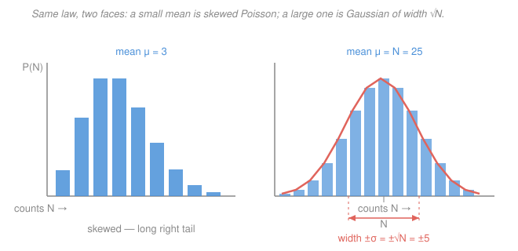

# Radiation Detection & Shielding · Lesson 2.1: Counting statistics I — Poisson & Gaussian

> ⏱ ~15 min · Module 2: Counting statistics & spectroscopy · Builds on: [1.6 Scintillation & semiconductor detectors](01-06-scintillation-semiconductor-detectors.md) · Unlocks: [2.2 Error propagation & dead time](02-02-error-propagation-dead-time.md)

## Why this matters

You point a detector at a source, wait 60 seconds, and read $N = 4{,}812$ counts. What is that number *worth*? If you can't put an error bar on it, you can't say whether two samples differ, whether a reading is above background, or whether a dose estimate is defensible in a report. The remarkable thing about radioactive counting is that the error bar comes free: the count carries its own uncertainty, no repeated trials required. This lesson turns a raw count into a number with honest limits — the foundation for every net rate, activity, and detection limit in the rest of the module.

## The idea

Radioactive decay is the textbook case of *rare independent random events*. Each nucleus in a large population decays or doesn't, on its own schedule, with a tiny probability per second, and there are enormous numbers of them. When you count events like that over a fixed time, the total you get is governed by the **Poisson distribution**: run the same one-minute count again and you'd get a slightly different number, scattered around some true mean.

Here is the fact that makes counting statistics so clean. For a Poisson process, the *spread* of that scatter is fixed by the mean alone — the standard deviation equals the square root of the mean. So if your single count is $N$, your best estimate of the true mean is $N$, and your best estimate of the spread is $\sqrt{N}$. **A single count is its own error estimate.** Record 100 counts and the noise is about $\pm 10$; record 10,000 and it's about $\pm 100$.

Notice what that does to *relative* precision. The absolute error $\sqrt{N}$ grows, but slower than $N$, so the fractional error $\sqrt{N}/N = 1/\sqrt{N}$ *shrinks*. Ten thousand counts is only ten times noisier in absolute terms than a hundred, but ten times *more precise* in relative terms. Precision is bought by accumulating counts — count longer, or count a stronger source.

## The formal version

A **Poisson distribution** with mean $\mu$ gives the probability of observing exactly $N$ events:

$$P(N) = \frac{\mu^N e^{-\mu}}{N!}, \qquad N = 0, 1, 2, \dots$$

*In words:* if independent events arrive at a steady average of $\mu$ per counting interval, this is how often you'll actually see $N$ of them. Its defining property is that mean and variance coincide:

$$\text{mean} = \mu, \qquad \sigma^2 = \mu \quad\Longrightarrow\quad \sigma = \sqrt{\mu}.$$

*In words:* for a Poisson process the standard deviation is locked to the square root of the mean — you can't have one without the other.

In practice you don't know $\mu$; you have one measurement $N$. You take $N$ as your estimate of $\mu$, so your estimate of the standard deviation is

$$\boxed{\;\sigma_N = \sqrt{N}\;}\qquad \frac{\sigma_N}{N} = \frac{1}{\sqrt{N}}.$$

*In words:* report a raw count as $N \pm \sqrt{N}$; its relative uncertainty is one over the square root of the count.

For a large mean the Poisson distribution is well approximated by a **Gaussian (normal)** distribution of the same mean and standard deviation:

$$P(N) \approx \frac{1}{\sqrt{2\pi N}}\, \exp\!\left[-\frac{(N-\mu)^2}{2N}\right] \quad\text{for } N \gtrsim 20\text{–}30.$$

*In words:* once you've collected a few dozen counts the skew washes out and the familiar symmetric bell curve takes over, which lets you use standard confidence intervals:

$$\pm 1\sigma \approx 68\%, \qquad \pm 2\sigma \approx 95\%, \qquad \pm 3\sigma \approx 99.7\%.$$

*In words:* the true mean lies within $\pm\sqrt{N}$ of your count about 68% of the time, and within $\pm 2\sqrt{N}$ about 95% of the time.

**Count vs. count rate.** The $\sqrt{N}$ rule applies to the *raw number of counts* — a pure Poisson integer — never directly to a rate. If you accumulate $N$ counts in a time $t$ (taken as exact), the **count rate** is

$$r = \frac{N}{t}, \qquad \sigma_r = \frac{\sigma_N}{t} = \frac{\sqrt{N}}{t} = \sqrt{\frac{r}{t}}.$$

*In words:* find the error on the *count* first, then divide by the time. Because $\sigma_r = \sqrt{r/t}$, doubling the count time cuts the rate uncertainty by $\sqrt{2}$ — precision improves with the square root of how long you watch. This connects straight back to the Poisson/Gaussian machinery you built in [prob-stat-refresher](../../prob-stat-refresher/syllabus.md): counting statistics is that theory wearing a lab coat.

## Picture

Left: a small mean ($\mu = 3$) gives a lopsided distribution with a long right tail — you literally can't have fewer than zero counts, so the low side is squeezed. Right: at $\mu = 25$ the same Poisson law has filled into a symmetric bell (coral envelope), centered on $N$ with a $1\sigma$ half-width of exactly $\sqrt{N} = 5$. That coral width *is* your error bar.

## Worked examples

**Example 1 — a raw count and the precision you paid for.**
You record $N = 10{,}000$ counts from a long-lived source.

*Uncertainty.* The standard deviation is
$$\sigma = \sqrt{N} = \sqrt{10{,}000} = 100 \text{ counts}.$$
So you report $N = 10{,}000 \pm 100$ counts. This is comfortably in the Gaussian regime, so "$\pm 100$" is a $68\%$ interval and "$\pm 200$" is a $95\%$ interval.

*Relative uncertainty.*
$$\frac{\sigma}{N} = \frac{100}{10{,}000} = \frac{1}{\sqrt{10{,}000}} = 0.010 = 1\%.$$

*How many counts for $0.5\%$?* Set the relative uncertainty to the target and solve for $N$:
$$\frac{1}{\sqrt{N}} = 0.005 \;\Longrightarrow\; \sqrt{N} = \frac{1}{0.005} = 200 \;\Longrightarrow\; N = 200^2 = 40{,}000 \text{ counts}.$$
Halving the relative error costs *four times* the counts (hence four times the count time at fixed rate) — the tax you pay for chasing precision with a $1/\sqrt{N}$ law.

**Example 2 — count vs. rate, and why longer is better.**
You collect $N = 2{,}500$ counts in a live time $t = 100\,\text{s}$ (treat $t$ as exact).

*The count first.* $\sigma_N = \sqrt{2{,}500} = 50$ counts, so $N = 2{,}500 \pm 50$ (relative error $50/2500 = 1/\sqrt{2500} = 2\%$).

*Now the rate.* Divide both the count and its error by the time:
$$r = \frac{N}{t} = \frac{2{,}500}{100} = 25.0\,\text{cps}, \qquad \sigma_r = \frac{\sqrt{N}}{t} = \frac{50}{100} = 0.50\,\text{cps}.$$
So $r = 25.0 \pm 0.5\,\text{cps}$ — a $2\%$ measurement of the rate, the *same* relative error as the count, because dividing by an exact constant doesn't change fractional precision. Cross-check with the compact form: $\sigma_r = \sqrt{r/t} = \sqrt{25/100} = \sqrt{0.25} = 0.50\,\text{cps}$. ✓

*Count longer.* Watch the *same* source at the same $25\,\text{cps}$ for $t = 400\,\text{s}$ (four times as long). Now you accumulate $N = 25 \times 400 = 10{,}000$ counts, and
$$\sigma_r = \frac{\sqrt{10{,}000}}{400} = \frac{100}{400} = 0.25\,\text{cps} \;\Longrightarrow\; \frac{\sigma_r}{r} = \frac{0.25}{25} = 1\%.$$
Four times the time gave $\sqrt{4} = 2$ times the precision ($2\% \to 1\%$). That $\sqrt{t}$ trade-off is the single most useful budgeting fact in counting: to halve your error bar, quadruple your count time.

## Watch out

- **You might think** you must repeat a count several times to get an error bar — **but actually** a single Poisson count already contains it: $\sigma = \sqrt{N}$, no replication needed. Repeated counts are for checking that the process really is Poisson, not for finding the spread.
- **You might think** the $\sqrt{N}$ rule works on rates too, so a $25\,\text{cps}$ rate has error $\sqrt{25} = 5\,\text{cps}$ — **but actually** $\sqrt{N}$ applies only to the raw *counts*. Always take the square root of the integer count, *then* divide by the exact time: here $\sigma_r = \sqrt{N}/t$, which for $N=2500,\ t=100$ is $0.5\,\text{cps}$, not $5$.
- **You might think** the low-count Poisson is symmetric like a Gaussian, so a $\pm\sqrt{N}$ band is a clean $68\%$ interval even for $N = 3$ — **but actually** the Gaussian approximation and its neat $68\%/95\%$ intervals only kick in around $N \gtrsim 20$–$30$; for a handful of counts the distribution is skewed and $N - \sqrt{N}$ can even fall below zero, which is nonsense. Small counts need exact-Poisson intervals, a topic for detection limits in [2.5](02-05-efficiency-detection-limits.md).

## One-liner

> Every radioactive count comes pre-loaded with its own error bar, $\sigma = \sqrt{N}$; precision costs counts, and counts cost time — quadruple the time to halve the error.

## Problems

**P1 (🟢)** A one-minute background count reads $N = 900$. (a) Give the count with its $1\sigma$ uncertainty and the relative uncertainty as a percentage. (b) How many counts would you need for a $1\%$ relative uncertainty?

**P2 (🟡)** A technician wants to measure a source's rate to $\pm 0.5\%$ (relative). The source produces about $200\,\text{cps}$ in her detector. (a) How many total counts must she accumulate? (b) How long must she count? (c) If she instead accepts $\pm 1\%$, how does the required time change, and why?

**P3 (🔴, optional)** Two counts are taken: a $30\,\text{s}$ count gives $3{,}600$, and a $120\,\text{s}$ count of a *weaker* source gives $1{,}200$. Which rate is known more precisely in *relative* terms, and by what factor? (Compute each rate with its uncertainty.)

Solutions

**P1.**
(a) $\sigma = \sqrt{900} = 30$ counts, so $N = 900 \pm 30$. Relative uncertainty $= 30/900 = 1/\sqrt{900} = 0.0333 = 3.3\%$.
(b) Need $1/\sqrt{N} = 0.01 \Rightarrow \sqrt{N} = 100 \Rightarrow N = 10{,}000$ counts. (Going from $3.3\%$ to $1\%$ is a factor $3.33$ in precision, so $3.33^2 \approx 11.1\times$ the counts: $900 \times 11.1 \approx 10{,}000$. ✓)

**P2.**
(a) Target relative error $1/\sqrt{N} = 0.005 \Rightarrow \sqrt{N} = 200 \Rightarrow N = 40{,}000$ counts.
(b) At $r = 200\,\text{cps}$, time $t = N/r = 40{,}000/200 = 200\,\text{s}$ (about $3.3$ min).
(c) For $\pm 1\%$: $\sqrt{N} = 100 \Rightarrow N = 10{,}000$ counts $\Rightarrow t = 10{,}000/200 = 50\,\text{s}$. That's one-quarter the time ($200\,\text{s} \to 50\,\text{s}$), because relaxing the target error by a factor $2$ ($0.5\% \to 1\%$) cuts the required counts — and hence time — by $2^2 = 4$. The $1/\sqrt{t}$ law again.

**P3.**
Fast source: $r_1 = 3{,}600/30 = 120\,\text{cps}$. $\sigma_{r_1} = \sqrt{3600}/30 = 60/30 = 2.0\,\text{cps}$, relative $= 2/120 = 1/\sqrt{3600} = 1.67\%$.
Weak source: $r_2 = 1{,}200/120 = 10\,\text{cps}$. $\sigma_{r_2} = \sqrt{1200}/120 = 34.64/120 = 0.289\,\text{cps}$, relative $= 0.289/10 = 1/\sqrt{1200} = 2.89\%$.
Relative precision is set purely by the *total counts*, not the rate or the time separately: $3{,}600$ counts beats $1{,}200$ counts. The fast source's rate is known better by a factor $2.89\%/1.67\% = 1.73 \approx \sqrt{3600/1200} = \sqrt{3}$. The longer count time on the weak source didn't save it — too few events landed.

## Flashback

**From Lesson 1.6 (Scintillation & semiconductor detectors):** A high-purity germanium detector produces on average one electron–hole pair per $\approx 3.0\,\text{eV}$ of energy deposited. A fully absorbed $600\,\text{keV}$ gamma ray therefore liberates a large number of charge carriers. Roughly how many carriers, and — treating that number as a Poisson count — what is the *relative* statistical fluctuation in the collected charge from carrier statistics alone? (This is the raw statistical limit on energy resolution; the real Fano-corrected spread is smaller, a refinement for [2.3](02-03-energy-resolution-pulse-height.md).)

Solution

Carriers produced:
$$n = \frac{600{,}000\,\text{eV}}{3.0\,\text{eV/pair}} = 2.0 \times 10^{5} \text{ carriers}.$$
Treating $n$ as a Poisson count, the fractional fluctuation is
$$\frac{\sigma_n}{n} = \frac{1}{\sqrt{n}} = \frac{1}{\sqrt{2.0\times 10^{5}}} = \frac{1}{447} \approx 2.2 \times 10^{-3} = 0.22\%.$$
That tiny fractional spread — a direct payoff of the $1/\sqrt{N}$ law — is *why* semiconductors resolve energy so much better than scintillators: a NaI(Tl) scintillator produces only a few thousand information carriers (photoelectrons) for the same gamma, so $1/\sqrt{N}$ is roughly ten times larger, and its peaks are correspondingly broader. More carriers per keV $\Rightarrow$ smaller $1/\sqrt{N}$ $\Rightarrow$ sharper lines. (The measured HPGe resolution is even better still because carrier production isn't fully independent — the Fano factor, coming in 2.3.)

## Connections

- **Backward:** In [1.6](01-06-scintillation-semiconductor-detectors.md) more information carriers per keV meant better energy resolution — that was the $1/\sqrt{N}$ law in disguise, and now you have the statistics that make "better" quantitative.
- **Forward:** [2.2](02-02-error-propagation-dead-time.md) propagates this $\sqrt{N}$ through subtractions (net = gross − background, with $\sigma_{\text{net}} = \sqrt{G+B}$) and rates corrected for dead time; [2.5](02-05-efficiency-detection-limits.md) pushes it to the low-count limit to define the minimum detectable activity.
- **Sideways:** This is the Poisson and Gaussian theory of [prob-stat-refresher](../../prob-stat-refresher/syllabus.md) applied to real detectors — the variance-equals-mean identity and the central-limit passage to a bell curve are exactly the same theorems, here paying rent in the lab.
