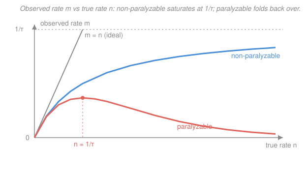

# Radiation Detection & Shielding · Lesson 2.2: Counting statistics II — propagation & dead time

> ⏱ ~15 min · Module 2: Counting statistics & spectroscopy · Builds on: [2.1 Counting statistics I: Poisson & Gaussian](02-01-counting-statistics-poisson-gaussian.md), [`prob-stat-refresher` syllabus](../../prob-stat-refresher/syllabus.md) · Unlocks: [2.5 Efficiency & detection limits](02-05-efficiency-detection-limits.md)

## Why this matters

Lesson 2.1 gave you the error bar on a *single* raw count: $\sigma = \sqrt{N}$. But no real measurement stops there. You subtract a background, divide by a live-time to get a rate, multiply by an efficiency to get an activity — and every one of those operations has to carry the uncertainty forward. Get the bookkeeping wrong and you'll quote a net peak of "$3100 \pm 56$" when the honest answer is "$3100 \pm 70$." On top of that, a detector is briefly *blind* after each pulse, so at high rates it silently undercounts. This lesson gives you both: how to propagate Poisson error through the arithmetic of a real measurement, and how to correct the count rate a busy detector actually reports.

## The idea

Two separate ideas, both about being honest with numbers.

**Error propagation.** When you combine measured quantities, their uncertainties combine too — but not the way the quantities do. The key rule of thumb: **variances add for sums and differences; *relative* variances add for products and quotients.** The surprising consequence for counting: when you subtract a background from a gross count to get the net, the uncertainty does *not* shrink — it *grows*, because you've now got two noisy numbers instead of one. Subtraction removes signal but adds noise.

**Dead time.** Every detector needs a sliver of time to process each pulse — the gas ions must clear, the amplifier must reset, the analyzer must digitize. During that sliver, $\tau$ (the **dead time**, typically microseconds), a second event that arrives is lost or distorted. So the rate you *observe*, $m$, is always less than the *true* rate $n$. At low rates who cares; at high rates the loss is large, and — depending on the detector's electronics — it can even *decrease* the observed rate as the true rate climbs. You have to invert the loss to recover $n$.

## The formal version

**Error propagation, general rule.** For a quantity $Q(x, y, \dots)$ computed from independent measurements with uncertainties $\sigma_x, \sigma_y, \dots$,

$$\sigma_Q^2 = \left(\frac{\partial Q}{\partial x}\right)^2 \sigma_x^2 + \left(\frac{\partial Q}{\partial y}\right)^2 \sigma_y^2 + \cdots$$

*In words: each input's uncertainty is scaled by how strongly $Q$ responds to it, then added in quadrature.* Two special cases cover almost everything in counting:

- **Sum or difference**, $Q = a \pm b$: the derivatives are $\pm 1$, so absolute variances add:
$$\sigma_{a\pm b} = \sqrt{\sigma_a^2 + \sigma_b^2}.$$
*In words: whether you add or subtract, the error bars combine the same way — in quadrature, never by simple subtraction.*

- **Product or quotient**, $Q = ab$ or $Q = a/b$: the *relative* variances add:
$$\left(\frac{\sigma_Q}{Q}\right)^2 = \left(\frac{\sigma_a}{a}\right)^2 + \left(\frac{\sigma_b}{b}\right)^2.$$
*In words: for multiplying or dividing, work in percentages — the fractional errors add in quadrature.* Multiplying by an exact constant $c$ just scales: $\sigma_{cN} = c\,\sigma_N$.

**Net counts.** A peak sits on a background. You record **gross** counts $G$ (peak + background) and, in an equal-width region, **background** counts $B$. Both are Poisson, so $\sigma_G = \sqrt{G}$ and $\sigma_B = \sqrt{B}$. The **net**:

$$N_{\text{net}} = G - B, \qquad \sigma_{\text{net}} = \sqrt{\sigma_G^2 + \sigma_B^2} = \sqrt{G + B}.$$

*In words: the net count is gross minus background, but its uncertainty uses the **sum** $G+B$ — subtracting the counts adds their variances.* This is the single most important formula in the module. Note $\sqrt{G+B} > \sqrt{G}$: subtracting background *costs* you precision.

**Rates.** Dividing a count by a live-time $t$ (known essentially exactly) just scales: a net rate $r = N_{\text{net}}/t$ has $\sigma_r = \sigma_{\text{net}}/t = \sqrt{G+B}/t$, so its *relative* uncertainty equals the count's: $\sigma_r/r = \sigma_{\text{net}}/N_{\text{net}}$.

**Optimal split of counting time.** Given a fixed total time $T$ to share between the source-plus-background measurement (gross rate $R_G$) and a background-only measurement (rate $R_B$), the net-rate variance is minimized when

$$\frac{t_G}{t_B} = \sqrt{\frac{R_G}{R_B}}.$$

*In words: spend more time on whichever measurement is noisier per second — but only as the square root, so a hot source barely tips the balance while a strong background pulls hard.*

**Dead time.** Let $\tau$ be the dead time per event, $n$ the true interaction rate, $m$ the recorded rate. Two idealized models bracket real detectors:

- **Non-paralyzable:** dead periods don't extend each other — events during dead time are simply lost, and *don't* restart the clock.
$$m = \frac{n}{1 + n\tau} \qquad\Longleftrightarrow\qquad n = \frac{m}{1 - m\tau}.$$
*In words: the detector is dead a fraction $m\tau$ of the time; divide the observed rate by the live fraction $(1-m\tau)$ to recover the truth.* As $n \to \infty$, $m \to 1/\tau$ — the rate saturates and never exceeds $1/\tau$.

- **Paralyzable:** every event — even one arriving during dead time — *restarts* the dead period. A recorded event is one preceded by a gap longer than $\tau$; by Poisson statistics that has probability $e^{-n\tau}$:
$$m = n\,e^{-n\tau}.$$
*In words: only events with a clear $\tau$-wide gap before them get counted.* This is **non-monotonic**: $m$ rises, peaks at $n = 1/\tau$ (where $m = 1/(e\tau) \approx 0.368/\tau$), then *folds back down*. A paralyzed detector facing an intense source can report a *deceptively low* rate — dangerously mistakable for a weak one.

The non-paralyzable model has a clean inverse; the paralyzable one you solve numerically (or read off a curve). Most real detectors live between the two.

## Picture

The grey line is the fantasy of a perfect detector, $m = n$. Real detectors peel away below it. The blue (non-paralyzable) curve bends over and levels off at $1/\tau$; the coral (paralyzable) curve climbs to a peak at $n = 1/\tau$ and then *decreases* — the same observed $m$ can correspond to two very different true rates.

## Worked examples

**Example 1 (net count and net rate — build the error bar).** A $^{60}\text{Co}$ photopeak is counted for $t = 300\,\text{s}$. You record $G = 4000$ gross counts in the peak window and $B = 900$ counts in an equal-width background window. Find the net counts, its $1\sigma$ uncertainty, and the net count rate with uncertainty.

Net counts:
$$N_{\text{net}} = G - B = 4000 - 900 = 3100 \text{ counts}.$$

Its uncertainty uses the **sum**, not the difference:
$$\sigma_{\text{net}} = \sqrt{G + B} = \sqrt{4000 + 900} = \sqrt{4900} = 70 \text{ counts}.$$

So the net is $3100 \pm 70$ counts — a relative uncertainty of $70/3100 = 2.26\%$. (Had you naïvely written $\sqrt{N_{\text{net}}} = \sqrt{3100} \approx 56$, you'd have understated the error by 20%.)

Now the rate. Live-time $t = 300\,\text{s}$ is known exactly, so dividing just scales:
$$r_{\text{net}} = \frac{N_{\text{net}}}{t} = \frac{3100}{300} = 10.33\,\text{s}^{-1}, \qquad \sigma_r = \frac{\sigma_{\text{net}}}{t} = \frac{70}{300} = 0.23\,\text{s}^{-1}.$$

The net rate is $10.33 \pm 0.23\,\text{s}^{-1}$ — same 2.26% relative uncertainty as the count, because dividing by an exact constant leaves the fraction untouched.

**Example 2 (dead time — correct the rate, both directions).** A detector with a non-paralyzable dead time $\tau = 5\,\mu\text{s} = 5\times10^{-6}\,\text{s}$ faces a source whose true rate is $n = 5000\,\text{s}^{-1}$. What rate does it *record*?

$$m = \frac{n}{1 + n\tau} = \frac{5000}{1 + (5000)(5\times10^{-6})} = \frac{5000}{1 + 0.025} = \frac{5000}{1.025} = 4878\,\text{s}^{-1}.$$

The detector is dead a fraction $n\tau/(1+n\tau) = 0.025/1.025 = 2.44\%$ of the time, so it loses $5000 - 4878 = 122$ counts per second — a $2.44\%$ undercount. Modest here, but it grows fast: this detector can never report more than $1/\tau = 200{,}000\,\text{s}^{-1}$ no matter how hot the source.

Now run it backward. Suppose the *same* detector reads $m = 8000\,\text{s}^{-1}$. What was the true rate? Invert:

$$n = \frac{m}{1 - m\tau} = \frac{8000}{1 - (8000)(5\times10^{-6})} = \frac{8000}{1 - 0.04} = \frac{8000}{0.96} = 8333\,\text{s}^{-1}.$$

The detector was undercounting by $333\,\text{s}^{-1}$ (a $4\%$ correction). Always apply this correction *before* you turn a count rate into an activity — otherwise the dead-time loss masquerades as a weaker source.

## Watch out

- **You might think subtracting a background *reduces* your uncertainty** (you removed the noisy background, right?). It's the opposite: $\sigma_{\text{net}} = \sqrt{G+B}$ is *larger* than $\sqrt{G}$. You now have two Poisson measurements' worth of noise, and quadrature never lets error bars cancel. A weak peak on a big background is the hardest thing to measure precisely.
- **You might apply $\sigma = \sqrt{N}$ to a *rate*.** The $\sqrt{N}$ law is a statement about **counts** — the raw integer number of pulses. A rate is a count divided by a time; propagate through the division ($\sigma_r = \sqrt{N}/t$), don't take $\sqrt{r}$. "$\sqrt{\text{rate}}$" is meaningless (wrong units, wrong value).
- **You might assume high observed rate means high true rate.** For a *paralyzable* detector that's false past the peak — the curve folds over, so a low $m$ can hide an intense source. When a reading seems implausibly low near a strong source, suspect paralysis, not a weak source. Knowing your detector's dead-time *type* is a safety issue, not a nicety.

## One-liner

> Variances add for $\pm$ (so $\sigma_{\text{net}}=\sqrt{G+B}$ even though you subtract) and relative variances add for $\times \div$; and a real detector reports $m<n$, saturating at $1/\tau$ if non-paralyzable or folding back over if paralyzable.

## Problems

**P1 (🟢)** A gamma peak is counted for $600\,\text{s}$: $G = 2500$ gross counts, and an equal-time background window gives $B = 400$ counts. Find (a) the net counts with its $1\sigma$ uncertainty, and (b) the net count rate with uncertainty.

**P2 (🟡)** A GM tube with a non-paralyzable dead time $\tau = 100\,\mu\text{s}$ reads $m = 2000\,\text{s}^{-1}$. (a) What is the true rate $n$? (b) What fraction of counts is the tube losing? (c) What is the highest rate this tube could ever display?

**P3 (🔴)** A detector's dead-time *type* is unknown. At a true rate $n = 1/\tau$, compare the observed rate $m$ predicted by the non-paralyzable and paralyzable models (as multiples of $1/\tau$). Which reads higher there, and what does the paralyzable value tell you about using this detector at very high rates? (This feeds [2.5 Efficiency & detection limits](02-05-efficiency-detection-limits.md), where dead-time-corrected rates become activities.)

Solutions

**P1** (a) Net counts:
$$N_{\text{net}} = G - B = 2500 - 400 = 2100 \text{ counts}.$$
Uncertainty uses the sum:
$$\sigma_{\text{net}} = \sqrt{G + B} = \sqrt{2500 + 400} = \sqrt{2900} \approx 53.9 \text{ counts}.$$
So $N_{\text{net}} = 2100 \pm 54$ counts (relative uncertainty $53.9/2100 = 2.57\%$).

(b) Live-time $t = 600\,\text{s}$ is exact, so scale:
$$r_{\text{net}} = \frac{2100}{600} = 3.50\,\text{s}^{-1}, \qquad \sigma_r = \frac{53.9}{600} \approx 0.090\,\text{s}^{-1}.$$
Net rate $= 3.50 \pm 0.09\,\text{s}^{-1}$ — same $2.57\%$ relative uncertainty as the count. *Check:* $\sqrt{2900} > \sqrt{2100} \approx 45.8$, confirming that subtracting background inflates the error bar. ✓

**P2** (a) Invert the non-paralyzable relation with $\tau = 100\,\mu\text{s} = 1\times10^{-4}\,\text{s}$:
$$n = \frac{m}{1 - m\tau} = \frac{2000}{1 - (2000)(1\times10^{-4})} = \frac{2000}{1 - 0.20} = \frac{2000}{0.80} = 2500\,\text{s}^{-1}.$$
(b) Loss fraction $= (n - m)/n = (2500 - 2000)/2500 = 500/2500 = 20\%$. (Equivalently, the dead fraction $m\tau = 0.20$.) A GM tube's long dead time makes this loss serious even at a modest 2000 counts/s.
(c) The non-paralyzable observed rate saturates at
$$m_{\max} = \frac{1}{\tau} = \frac{1}{1\times10^{-4}\,\text{s}} = 10{,}000\,\text{s}^{-1}.$$
No true rate, however large, makes this tube read above $10{,}000\,\text{s}^{-1}$. ✓

**P3** Set $n = 1/\tau$, i.e. $n\tau = 1$.

Non-paralyzable:
$$m = \frac{n}{1 + n\tau} = \frac{1/\tau}{1 + 1} = \frac{1}{2\tau} = 0.500\,\frac{1}{\tau}.$$
Paralyzable:
$$m = n\,e^{-n\tau} = \frac{1}{\tau}\,e^{-1} = \frac{0.368}{\tau} = 0.368\,\frac{1}{\tau}.$$
The **non-paralyzable** model reads higher at this rate ($0.500/\tau$ vs $0.368/\tau$). The paralyzable value $0.368/\tau$ is its **maximum** — the peak of that folded curve. Beyond $n = 1/\tau$ a paralyzable detector reads *less*, so at very high rates its output is ambiguous (two true rates give the same $m$) and can badly *under*state an intense source. Practical lesson: don't operate a paralyzable detector anywhere near $n = 1/\tau$. ✓

## Flashback

**From Lesson 2.1 (Poisson & Gaussian):** A single-channel scaler records $N = 2500$ counts (no background subtraction). (a) Give the $1\sigma$ uncertainty and the relative (fractional) uncertainty. (b) How many total counts would you need to accumulate to reach a $1\%$ relative uncertainty? (Fresh numbers.)

Solution

(a) Poisson: $\sigma = \sqrt{N} = \sqrt{2500} = 50$ counts. Relative uncertainty $= \sigma/N = 50/2500 = 0.02 = 2\%$. (Equivalently $1/\sqrt{N} = 1/50 = 2\%$.)

(b) The relative uncertainty is $1/\sqrt{N}$, so set $1/\sqrt{N} = 0.01$:
$$\sqrt{N} = 100 \;\Longrightarrow\; N = 10{,}000 \text{ counts}.$$
Halving the error bar costs *four times* the counts — the tyranny of $\sqrt{N}$: precision improves only as the square root of counting effort. ✓

## Connections

- **Backward:** the $\sigma = \sqrt{N}$ of [2.1](02-01-counting-statistics-poisson-gaussian.md) is the atom this lesson builds with — every propagation rule here just carries that single-count error through the arithmetic of nets, rates, and corrections.
- **Forward:** [2.5 Efficiency & detection limits](02-05-efficiency-detection-limits.md) multiplies a dead-time-corrected net rate by an efficiency and branching ratio to get an activity — a chain of divisions where relative variances add — and pushes $\sigma_{\text{net}} = \sqrt{G+B}$ to its limit in the Currie critical level and minimum detectable activity.
- **Sideways (probability & statistics):** the propagation-of-error machinery and the quadrature rule are general tools from the [`prob-stat-refresher`](../../prob-stat-refresher/syllabus.md) — the same $\sigma_Q^2 = \sum (\partial Q/\partial x_i)^2\sigma_i^2$ that a lab physicist uses for any derived quantity, an economist uses for error bars on a regression prediction, and an engineer uses for tolerance stack-up.
