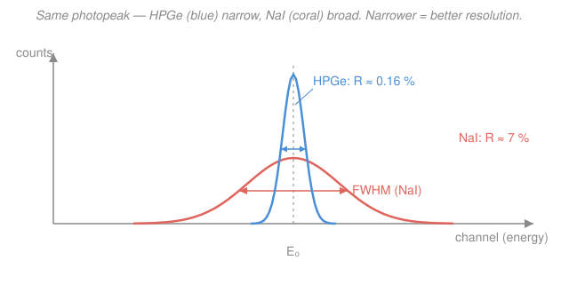

# Radiation Detection & Shielding · Lesson 2.3: Energy resolution & pulse-height spectra

> ⏱ ~15 min · Module 2: Counting statistics & spectroscopy · Builds on: [1.6 Scintillation & semiconductor detectors](01-06-scintillation-semiconductor-detectors.md), [2.1 Counting statistics I](02-01-counting-statistics-poisson-gaussian.md) · Unlocks: [2.4 Gamma-ray spectroscopy](02-04-gamma-ray-spectroscopy.md)

## Why this matters

Point a detector at a single-energy gamma source and it does **not** report one sharp energy — it reports a *bump*, a peak with real width. How narrow that bump is decides whether you can tell two nearby gamma lines apart, and therefore whether you can say *which* isotope you're looking at. That width is **energy resolution**, and this lesson explains where it comes from (counting statistics, again), how to put a number on it, and why a germanium crystal costing 50× more than a sodium-iodide one earns its price. Everything you do in [2.4](02-04-gamma-ray-spectroscopy.md) — reading a spectrum, identifying isotopes — rests on it.

## The idea

A detector doesn't measure energy directly. It converts a photon's energy into a *countable pile of carriers* — electron-hole pairs in a semiconductor, or photoelectrons at a photomultiplier in a scintillator (that conversion chain is [1.6](01-06-scintillation-semiconductor-detectors.md)'s whole story). The size of the output pulse is proportional to **how many carriers** got made. More energy in, more carriers, taller pulse.

Here's the catch. Making carriers is a *random* process. Two photons of the *identical* energy don't produce the exact same number of carriers — one makes a few more, the next a few less, just by chance. So identical photons give slightly different pulse heights, and when you histogram thousands of them you get a **Gaussian bump** instead of a spike. That bump — the **photopeak** — has a width set by the *statistical scatter* in the carrier count.

And now the payoff you can already guess from [2.1](02-01-counting-statistics-poisson-gaussian.md): counting statistics says the scatter in a pile of $N$ things grows like $\sqrt{N}$, so the *relative* scatter shrinks like $1/\sqrt{N}$. **Make more carriers per unit energy and the peak gets relatively narrower.** That single fact is why a detector that spends only 3 eV to make one carrier crushes one that spends 100 eV: it makes ~30× more carriers, so its peaks are several times sharper.

## The formal version

**Pulse-height spectrum.** A **multichannel analyzer (MCA)** measures the height of every pulse and drops it into one of many bins ("channels"), each channel a narrow slice of pulse height. Sorting thousands of pulses fills a histogram: counts vs. channel. *In words: the MCA is an automatic sorter that stacks each pulse into a bin by its height, building the energy spectrum one event at a time.* Since pulse height $\propto$ energy, channel number maps (after calibration, [2.4](02-04-gamma-ray-spectroscopy.md)) to energy.

**The photopeak is Gaussian.** A monoenergetic source produces a full-energy peak of the form

$$C(x) = C_0 \, \exp\!\left(-\frac{(x-x_0)^2}{2\sigma^2}\right),$$

centered at channel $x_0$ (the true energy $E_0$), with standard deviation $\sigma$ (in energy or channel units). *In words: identical photons scatter into a bell curve around the true energy, and $\sigma$ measures how far they scatter.*

**FWHM.** Peak width is quoted not as $\sigma$ but as the **full width at half maximum** — the width of the peak measured between the two points where it drops to half its height:

$$\text{FWHM} = 2\sqrt{2\ln 2}\;\sigma \approx 2.355\,\sigma.$$

*In words: FWHM is the "how fat is the bump at half its height" width; for a Gaussian it's always 2.355 times $\sigma$.* (We use FWHM because it's what you can literally read off a plotted peak with a ruler.)

**Energy resolution.** The figure of merit is the *fractional* width, as a percent:

$$\boxed{\,R = \frac{\text{FWHM}}{E_0}\times 100\%\,}$$

*In words: resolution is the peak's width as a fraction of its energy — smaller $R$ means a sharper, more selective detector.* A detector with $R = 0.2\%$ is far better than one with $R = 7\%$.

**The statistical limit.** If a photon of energy $E_0$ makes on average $N$ information carriers with energy $w$ per carrier ($N = E_0/w$), and carrier production were pure Poisson, the scatter would be $\sigma_N = \sqrt{N}$. Pulse height $\propto N$, so the *fractional* width is $\sigma_N/N = 1/\sqrt N$, giving

$$R_{\text{stat}} = 2.355\,\frac{\sigma_N}{N} = \frac{2.355}{\sqrt{N}}.$$

*In words: resolution can never beat the statistical scatter in the carrier count, and that scatter shrinks as $1/\sqrt N$ — so more carriers (smaller $w$) means a sharper peak.* This is the deep reason semiconductors ($w\approx 3$ eV) beat scintillators (effective $w \sim 10^2$ eV): smaller $w \Rightarrow$ larger $N \Rightarrow$ smaller $R$.

**The Fano factor.** Real carrier production is slightly *better* than Poisson, because the events aren't fully independent — the total energy is fixed, so once you've spent it on carriers there's less freedom left, gently anti-correlating the fluctuations. We fold this into a factor $F$ (the **Fano factor**):

$$\sigma_N^2 = F N, \qquad\Longrightarrow\qquad R_{\text{stat}} \approx 2.355\sqrt{\frac{F}{N}}.$$

*In words: the variance in carrier count is $F$ times the naive Poisson value; $F<1$ means the peak is narrower than pure Poisson would predict.* For gases and semiconductors $F \approx 0.06$–$0.15$ (a real resolution boost of $1/\sqrt F \approx 3\times$); for scintillators the photoelectron statistics are effectively Poisson, $F \approx 1$.

## Picture

Both peaks sit at the *same* energy $E_0$ and (roughly) contain the same number of counts — but the HPGe peak concentrates them into a narrow spike, while NaI smears them wide. FWHM is marked at half height on each; $R = \text{FWHM}/E_0$ is ~44× smaller for HPGe.

## Worked examples

**Example 1 (resolution from a measured peak, then the statistical floor).** A NaI(Tl) detector records the 662 keV photopeak of \ce{^{137}Cs}. The peak's measured FWHM is $46\,\text{keV}$. Find $R$ and $\sigma$, then estimate the statistical floor from the carrier count.

Resolution is just the fractional width:

$$R = \frac{\text{FWHM}}{E_0}\times 100\% = \frac{46\,\text{keV}}{662\,\text{keV}}\times 100\% = 6.95\% \approx 7.0\%.$$

Back out $\sigma$ from FWHM $= 2.355\,\sigma$:

$$\sigma = \frac{\text{FWHM}}{2.355} = \frac{46\,\text{keV}}{2.355} = 19.5\,\text{keV}.$$

Now the statistical floor. Take an effective $w \approx 100\,\text{eV}$ per information carrier for NaI, so the carrier count is

$$N = \frac{E_0}{w} = \frac{662{,}000\,\text{eV}}{100\,\text{eV}} = 6620 \text{ carriers}, \qquad R_{\text{stat}} = \frac{2.355}{\sqrt{N}} = \frac{2.355}{\sqrt{6620}} = 2.9\%.$$

The *measured* $7.0\%$ is more than double the $2.9\%$ carrier-statistics floor. Lesson: the statistical limit is a **floor, not a promise** — real NaI is broadened further by non-uniform light collection and PMT gain jitter, so it sits well above its own carrier-statistics limit.

**Example 2 (NaI vs. HPGe at 662 keV — which resolves two nearby lines?).** Compare the *statistical* resolutions at $E_0 = 662\,\text{keV}$. Use $w_{\text{NaI}} \approx 100\,\text{eV}$, $F_{\text{NaI}}\approx 1$; and $w_{\text{Ge}} \approx 3\,\text{eV}$, $F_{\text{Ge}}\approx 0.10$.

Carrier counts:

$$N_{\text{NaI}} = \frac{662{,}000}{100} = 6620, \qquad N_{\text{Ge}} = \frac{662{,}000}{3} = 2.2\times 10^{5}.$$

The germanium crystal makes **33× more carriers** for the same photon, purely because its $w$ is 33× smaller. Now the resolutions, $R\approx 2.355\sqrt{F/N}$:

$$R_{\text{NaI}} = 2.355\sqrt{\frac{1}{6620}} = 2.9\%, \qquad R_{\text{Ge}} = 2.355\sqrt{\frac{0.10}{2.2\times 10^5}} = 0.16\%.$$

In FWHM: NaI $\approx 0.029\times 662 = 19\,\text{keV}$ (its floor; the real detector is ~45 keV), HPGe $\approx 0.0016\times 662 = 1.1\,\text{keV}$. The ratio is

$$\frac{R_{\text{NaI}}}{R_{\text{Ge}}} = \sqrt{\frac{N_{\text{Ge}}}{N_{\text{NaI}}}\cdot\frac{F_{\text{NaI}}}{F_{\text{Ge}}}} = \sqrt{33\times 10} = 18\times.$$

Of that 18×, a factor $\sqrt{33}\approx 5.7$ is the extra carriers (small $w$) and a factor $\sqrt{10}\approx 3.2$ is the favorable Fano factor.

**Which resolves two lines 8 keV apart near 662 keV?** HPGe's $\approx 1.1\,\text{keV}$ FWHM is far smaller than the 8 keV spacing — two cleanly separated peaks. NaI's FWHM (19 keV floor, ~45 keV real) is *wider* than the spacing — the two lines merge into one shapeless bump. **HPGe resolves them; NaI cannot.** That is exactly why isotope identification ([2.4](02-04-gamma-ray-spectroscopy.md)) is HPGe's job.

## Watch out

- **You might think a wider peak means the detector "measured more counts."** It doesn't — width is about *scatter*, not area. Two peaks with identical total counts can have wildly different FWHM; the narrow one just packs the same events into fewer channels. Resolution is a shape property, independent of how long you counted.
- **You might think $\sigma = \sqrt{N}$ from [2.1](02-01-counting-statistics-poisson-gaussian.md) is the peak width.** Careful about *which* $N$. That $\sqrt{N}$ was the uncertainty in the **number of counts** in a measurement. Here the width comes from the scatter in the number of **information carriers per pulse** — a different $N$, and reduced further by the Fano factor $F<1$. Same statistics, different quantity.
- **You might quote resolution in keV.** Usually quote it as the dimensionless percent $R = \text{FWHM}/E_0$, because FWHM in keV *grows* with energy (more carriers scatter more in absolute terms) even as the *fractional* resolution improves. Always say at which energy: "0.2% at 1332 keV."

## One-liner

> A monoenergetic source gives a Gaussian photopeak whose fractional width $R = \text{FWHM}/E_0 = 2.355\sqrt{F/N}$ shrinks as you make more information carriers — so small-$w$ HPGe out-resolves NaI by ~20×.

## Problems

**P1 (🟢)** An HPGe detector's \ce{^{60}Co} photopeak at $1332\,\text{keV}$ has a measured FWHM of $2.0\,\text{keV}$. (a) What is the energy resolution $R$ (in percent)? (b) What is $\sigma$ of the peak?

**P2 (🟡)** A CdTe detector uses $w = 4.4\,\text{eV}$ per electron-hole pair with a Fano factor $F = 0.11$. Estimate its statistical energy resolution $R$ at $122\,\text{keV}$ (a \ce{^{57}Co} line). Would you expect it to resolve the \ce{^{57}Co} lines at 122 and 136 keV?

**P3 (🔴)** A detector has statistical resolution $R = 6.0\%$ at $662\,\text{keV}$. Assuming the resolution is purely carrier-statistics-limited ($R = 2.355\sqrt{F/N}$) and that $N \propto E$ (fixed $w$), predict $R$ at $1332\,\text{keV}$. State the scaling law you used.

Solutions

**P1.** (a) Resolution is the fractional width:

$$R = \frac{\text{FWHM}}{E_0}\times 100\% = \frac{2.0\,\text{keV}}{1332\,\text{keV}}\times 100\% = 0.150\%.$$

(b) From FWHM $=2.355\,\sigma$:

$$\sigma = \frac{2.0\,\text{keV}}{2.355} = 0.85\,\text{keV}.$$

*Check.* $0.15\%$ is the textbook figure for a good HPGe at 1332 keV — this is why HPGe is the reference for gamma spectroscopy. ✓

**P2.** Carrier count at $122\,\text{keV}$:

$$N = \frac{E_0}{w} = \frac{122{,}000\,\text{eV}}{4.4\,\text{eV}} = 2.77\times 10^{4}.$$

Statistical resolution:

$$R = 2.355\sqrt{\frac{F}{N}} = 2.355\sqrt{\frac{0.11}{2.77\times 10^4}} = 2.355\sqrt{3.97\times 10^{-6}} = 2.355\times 1.99\times 10^{-3} = 0.47\%.$$

FWHM $= 0.0047\times 122\,\text{keV} = 0.57\,\text{keV}$ — much smaller than the 14 keV gap between the 122 and 136 keV lines, so **yes**, CdTe resolves them easily (this is the statistical floor; a real device is somewhat worse from electronic noise but still far better than 14 keV). ✓

**P3.** Purely carrier-limited with fixed $w$ and $F$: $R = 2.355\sqrt{F/N}$ and $N\propto E$, so $R \propto 1/\sqrt N \propto 1/\sqrt{E}$. Scaling from 662 to 1332 keV:

$$R(1332) = R(662)\sqrt{\frac{662}{1332}} = 6.0\%\times\sqrt{0.497} = 6.0\%\times 0.705 = 4.2\%.$$

*Scaling law:* fractional resolution improves as $1/\sqrt{E}$ when the peak is carrier-statistics-limited. (Note the *absolute* FWHM still grows: FWHM $=R\cdot E$ goes from $40\,\text{keV}$ to $56\,\text{keV}$.) ✓

## Flashback

**From Lesson 2.2 (net counts and their uncertainty):** A gamma peak region collects $G = 2500$ gross counts. An equal-width background region beside it collects $B = 400$ counts. Report the **net** peak counts and its $1\sigma$ uncertainty.

Solution

Net is gross minus background:

$$\text{net} = G - B = 2500 - 400 = 2100 \text{ counts.}$$

Both $G$ and $B$ are independent Poisson counts, so their variances add ($\sigma_G^2 = G$, $\sigma_B^2 = B$), and subtracting still *adds* the uncertainties in quadrature:

$$\sigma_{\text{net}} = \sqrt{\sigma_G^2 + \sigma_B^2} = \sqrt{G + B} = \sqrt{2500 + 400} = \sqrt{2900} = 53.9 \approx 54 \text{ counts.}$$

So $\text{net} = 2100 \pm 54$ counts (a $2.6\%$ uncertainty). *Check.* The uncertainty uses $G+B$, **not** $G-B$ — subtracting signals *adds* their noise, the recurring trap from 2.2. ✓

## Connections

- **Backward:** the peak width *is* [2.1](02-01-counting-statistics-poisson-gaussian.md)'s $\sqrt{N}$ scatter wearing a spectroscopy uniform — applied to the number of information carriers per pulse instead of the number of counts in a measurement. The carrier-generation physics (electron-hole pairs vs. photoelectrons, and their $w$-values) comes straight from [1.6](01-06-scintillation-semiconductor-detectors.md).
- **Forward:** [2.4 Gamma-ray spectroscopy](02-04-gamma-ray-spectroscopy.md) uses resolution to decide whether real spectral features (photopeak, Compton edge, escape peaks) can be separated and isotopes identified — the payoff of a narrow FWHM. Resolution also sets how well you can sit a peak on the Compton background you'll fight in [2.5](02-05-efficiency-detection-limits.md).
- **Sideways (statistics):** the Fano factor is a concrete case of *correlated* counting statistics — variance below the Poisson value because the events aren't independent. The same variance-reduction-from-constraints idea appears throughout probability and statistics; the honest Poisson baseline ($F=1$) is the [`prob-stat-refresher`](../../prob-stat-refresher/syllabus.md) starting point this refines.
