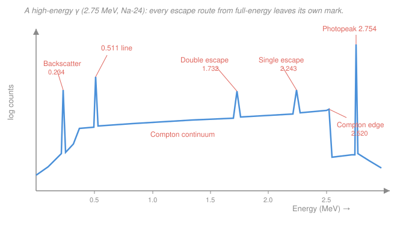

# Radiation Detection & Shielding · Lesson 2.4: Gamma-ray spectroscopy

> ⏱ ~15 min · Module 2: Counting statistics & spectroscopy · Builds on: [2.3 Energy resolution & pulse-height spectra](02-03-energy-resolution-pulse-height.md), [1.1 Photon interactions: photoelectric & Compton](01-01-photon-photoelectric-compton.md), [1.2 Pair production & total attenuation](01-02-photon-pair-production-total-attenuation.md) · Unlocks: [2.5 Efficiency & detection limits](02-05-efficiency-detection-limits.md)

## Why this matters

Hand someone a gamma spectrum and the first question is always the same: *what's in the sample?* The answer is written in the peaks — but only one of the bumps is the actual gamma energy. The rest are ghosts: partial-energy deposits, photons that snuck back in from the walls, annihilation radiation escaping the crystal. Read them wrong and you misidentify the nuclide; read them right and each ghost *confirms* the identification. This lesson teaches you to name every feature in the spectrum and then pin an energy scale to it, so an unknown peak becomes a number.

## The idea

A monoenergetic gamma of energy $E$ deposits its full energy in the detector only *sometimes* — when the photon photoabsorbs, or Compton-scatters and then the scattered photon is caught too. Every such event dumps exactly $E$, and those events pile into one sharp line: the **photopeak** (full-energy peak). That's the line you actually measure.

But photons have other fates, and each incomplete one lands somewhere predictable:

- **Compton, then the scattered photon escapes.** Only the recoil electron's energy stays behind — anywhere from ~0 (grazing scatter) up to a maximum at a 180° scatter. That spread of partial deposits is the **Compton continuum**, and its sharp upper cliff is the **Compton edge**.
- **A photon scatters off the room and comes back.** Gammas Compton-scatter ~180° in the shielding/walls and re-enter the detector at the *scattered* energy — a small bump, the **backscatter peak**.
- **Pair production, then annihilation photons escape.** If $E > 1.022$ MeV the photon can make an $e^+e^-$ pair; the positron annihilates into two 0.511 MeV photons. If one escapes the crystal you lose 0.511 (**single-escape peak**); if both escape you lose 1.022 (**double-escape peak**).

So the whole cast — photopeak, Compton edge, backscatter, escape peaks, the 0.511 annihilation line — is just *the same gamma losing different amounts of energy on the way out*. Learn the arithmetic and you can predict every feature from $E$ alone. Then **calibration** is the reverse trick: measure where two known peaks land on the multichannel-analyzer (MCA) channel axis, fit a line, and read any unknown peak's energy off it.

## The formal version

Start from Compton kinematics (Lesson 1.1). A photon of energy $E$ scattering by angle $\theta$ leaves with

$$E'(\theta) = \frac{E}{1 + \dfrac{E}{m_ec^2}\,(1-\cos\theta)}, \qquad m_ec^2 = 0.511\,\text{MeV}.$$

The recoil electron keeps the rest, $T(\theta) = E - E'(\theta)$.

**Compton edge.** The electron energy is largest at a head-on backscatter, $\theta = 180^\circ$ ($\cos\theta = -1$):

$$T_{\max} = E - E'_{180}, \qquad E'_{180} = \frac{E}{1 + \dfrac{2E}{m_ec^2}}.$$

In words: the continuum stops abruptly at $T_{\max}$ because no single Compton scatter can hand the electron more than that. The edge is *below* the photopeak by exactly $E'_{180}$.

**Backscatter peak.** Photons that Compton-scatter by ~180° in material *around* the detector and then deposit fully sit at energy $E'_{180}$ — the same $E'_{180}$ as above.

$$E_\text{bs} = E'_{180} = E - T_{\max}.$$

In words: the backscatter peak and the Compton edge are complements — their energies add back to $E$. (A quick sanity check on any spectrum.)

**Escape peaks (only for $E > 1.022$ MeV).**

$$E_\text{SE} = E - 0.511\,\text{MeV}, \qquad E_\text{DE} = E - 1.022\,\text{MeV}.$$

In words: pair production deposits everything *except* the annihilation photon(s) that leak out — one escapes (single) or both do (double). You'll also see a stand-alone **0.511 MeV annihilation line** from positrons annihilating in nearby material. **Sum peaks** appear at $E_1+E_2$ when two gammas from the same decay strike within one resolving time.

**Energy calibration.** The MCA bins pulses into channel numbers $c$; the energy response is linear (Lesson 2.3), so

$$E = m\,c + b,$$

with slope $m$ (keV/channel) and intercept $b$ (keV) fit from two or more known peaks:

$$m = \frac{E_2 - E_1}{c_2 - c_1}, \qquad b = E_1 - m\,c_1.$$

In words: two known lines fix a straight line through channel-vs-energy space; drop any unknown peak's channel into it to get its energy. Never assume $b=0$ — real electronics carry an offset.

## Picture

## Worked examples

**Example 1 — feature identification (Na-24, $E = 2.754$ MeV).** Na-24 is a workhorse high-energy calibration source; its 2.754 MeV line clears the pair-production threshold comfortably, so it shows the full cast. Predict every feature.

*Backscatter photon / Compton-edge complement.* With $2E/m_ec^2 = 2(2.754)/0.511 = 10.78$,

$$E'_{180} = \frac{2.754}{1 + 10.78} = \frac{2.754}{11.78} = 0.234\,\text{MeV}.$$

So the **backscatter peak** sits at $0.234\,\text{MeV}$, and the **Compton edge** at

$$T_{\max} = 2.754 - 0.234 = 2.520\,\text{MeV}.$$

Check: $0.234 + 2.520 = 2.754 = E$. ✓

*Escape peaks.* Since $2.754 > 1.022$, both appear:

$$E_\text{SE} = 2.754 - 0.511 = 2.243\,\text{MeV}, \qquad E_\text{DE} = 2.754 - 1.022 = 1.732\,\text{MeV},$$

plus a **0.511 MeV annihilation line**. Full inventory: peaks at $0.234,\ 0.511,\ 1.732,\ 2.243,\ 2.754$ MeV, a Compton edge at $2.520$, and continuum filling in below it. Every number came from $E$ and $0.511$.

**Example 2 — energy calibration.** Two known photopeaks land on the MCA:

| Nuclide | Known energy | Channel |
|---|---|---|
| Cs-137 | 662 keV | 260 |
| Co-60 | 1332 keV | 528 |

Fit the line:

$$m = \frac{1332 - 662}{528 - 260} = \frac{670}{268} = 2.50\ \text{keV/channel},$$
$$b = 662 - (2.50)(260) = 662 - 650 = 12\ \text{keV}.$$

So $E = 2.50\,c + 12$ keV. Now an unknown peak shows up at **channel 200**:

$$E = 2.50(200) + 12 = 500 + 12 = 512\ \text{keV} \approx 511\ \text{keV}.$$

That's the annihilation line — the sample (or its surroundings) has a positron emitter or a $>1.022$ MeV gamma making pairs. The 3 keV gap from 511 is well inside a NaI detector's resolution, so the identification holds.

## Watch out

- **The photopeak is *not* the Compton edge.** Beginners point at the tall continuum cliff and call it the line. The photopeak is the *full-energy* peak, sitting a distance $E'_{180}$ *above* the edge (for 2.754 MeV, that gap is 0.234 MeV — small, so on a low-energy source the edge can crowd the peak). Always identify the highest sharp peak as the full-energy line first.
- **Escape peaks only exist above 1.022 MeV.** A peak exactly $0.511$ or $1.022$ MeV below a photopeak is a dead giveaway of an escape — but only bother looking when $E > 1.022$ MeV. Below threshold there's no pair production, hence no escapes.
- **Backscatter and annihilation are both near 0.2–0.5 MeV — don't confuse them.** The backscatter peak tracks the source energy ($E'_{180}$, always $\le m_ec^2/2 = 0.256$ MeV for high $E$); the annihilation line is *fixed* at 0.511 MeV regardless of source. If a low-energy bump moves when you change sources, it's backscatter; if it's nailed to 0.511, it's annihilation.

## One-liner

> Only the photopeak is the gamma; every other bump is that same gamma minus whatever energy escaped — and once two known peaks fix the channel-to-energy line, any unknown peak becomes a number.

## Problems

**P1 (🟢) — feature inventory.** A monoenergetic source emits a $1.50$ MeV gamma into a NaI detector. Compute (a) the backscatter-peak energy, (b) the Compton-edge energy, and (c) state whether single- and double-escape peaks appear, and at what energies.

**P2 (🟡) — calibration + ID.** Two photopeaks are located: Cs-137 (662 keV) at channel 281 and Co-60 (1332 keV) at channel 616. (a) Find the calibration slope and intercept. (b) An unknown peak sits at channel 536 — what energy is it, and what's a plausible source line?

**P3 (🔴, optional) — read the ghost backwards.** An unknown emitter's spectrum has a clean peak at $1.674$ MeV that you suspect is a *single-escape* peak, not a true photopeak. (a) What full-energy gamma would produce it? (b) Predict the exact energies of the double-escape peak and the annihilation line you should then also see. (c) Name one on-spectrum check that would confirm 1.674 MeV is an escape peak rather than a real line.

Solutions

**P1.** With $E = 1.50$ MeV and $m_ec^2 = 0.511$ MeV, $\ 2E/m_ec^2 = 3.00/0.511 = 5.871$.

(a) Backscatter: $E'_{180} = \dfrac{1.50}{1 + 5.871} = \dfrac{1.50}{6.871} = 0.218\,\text{MeV}.$

(b) Compton edge: $T_{\max} = 1.50 - 0.218 = 1.282\,\text{MeV}.$ (Check: $0.218 + 1.282 = 1.500$ ✓.)

(c) $E = 1.50 > 1.022$ MeV, so pair production is possible and **both escape peaks appear** (weakly at this energy, where pair production is a small fraction of the total cross-section):
$$E_\text{SE} = 1.50 - 0.511 = 0.989\,\text{MeV}, \qquad E_\text{DE} = 1.50 - 1.022 = 0.478\,\text{MeV}.$$

**P2.** (a) $m = \dfrac{1332 - 662}{616 - 281} = \dfrac{670}{335} = 2.00\ \text{keV/channel}$; $\ b = 662 - (2.00)(281) = 662 - 562 = 100\ \text{keV}.$ So $E = 2.00\,c + 100$ keV.

(b) At channel 536: $E = 2.00(536) + 100 = 1072 + 100 = 1172\ \text{keV} \approx 1173\ \text{keV}$ — the **second Co-60 line** (Co-60 emits both 1173 and 1332 keV). The sample is Co-60 + Cs-137; finding the 1173 line cross-confirms it.

**P3.** (a) A single-escape peak is $0.511$ MeV below the full-energy line, so
$$E = 1.674 + 0.511 = 2.185\,\text{MeV}.$$

(b) Double escape: $E_\text{DE} = 2.185 - 1.022 = 1.163\,\text{MeV}$ (equivalently $1.674 - 0.511$). Annihilation line: **0.511 MeV**, fixed.

(c) A true escape peak must be accompanied by the **full-energy photopeak at 2.185 MeV** (and ideally the double-escape at 1.163 MeV and the 0.511 line). A genuine single-escape peak always sits *exactly* 0.511 MeV below a real photopeak — find that parent line and the identification is locked; if no line sits 0.511 MeV above 1.674, it's a real photopeak instead.

## Flashback

**From Lesson 2.3 (energy resolution).** A Co-60 photopeak at $1332$ keV is measured with a full-width-at-half-maximum of $44$ keV. (a) What is the percent energy resolution at this line? (b) What Gaussian standard deviation $\sigma$ does that FWHM correspond to?

Solution

(a) $R = \dfrac{\text{FWHM}}{E} = \dfrac{44}{1332} = 0.0330 = 3.30\%.$

(b) For a Gaussian, $\text{FWHM} = 2\sqrt{2\ln 2}\,\sigma = 2.355\,\sigma$, so
$$\sigma = \frac{44}{2.355} = 18.7\,\text{keV}.$$

(A typical 3″ NaI(Tl) value at 1332 keV — HPGe would be an order of magnitude tighter, which is exactly why it resolves the escape peaks in this lesson.)

## Connections

- **Backward:** every feature is a Lesson [1.1](01-01-photon-photoelectric-compton.md) Compton scatter or a [1.2](01-02-photon-pair-production-total-attenuation.md) pair-production/annihilation event read off the pulse-height axis; the linear channel-to-energy response is the calibrated version of [2.3](02-03-energy-resolution-pulse-height.md)'s MCA spectrum.
- **Forward:** [2.5](02-05-efficiency-detection-limits.md) turns the *area* under the photopeak (once you've isolated it from the Compton continuum beneath it) into an activity — spectroscopy identifies the line, efficiency quantifies how much source made it.
- **Sideways (statistics):** fitting the calibration line is ordinary linear least-squares — the same regression machinery in the `../../prob-stat-refresher/syllabus.md` toolkit, and the annihilation line ties detector physics to positron annihilation, the basis of PET imaging in medical physics.
