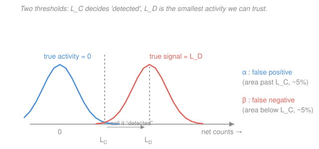

# Radiation Detection & Shielding · Lesson 2.5: Efficiency & detection limits

> ⏱ ~15 min · Module 2: Counting statistics & spectroscopy · Builds on: [2.2 Error propagation & dead time](02-02-error-propagation-dead-time.md), [2.4 Gamma-ray spectroscopy](02-04-gamma-ray-spectroscopy.md) · Unlocks: [3.1 Absorbed dose, kerma & exposure](03-01-absorbed-dose-kerma-exposure.md)

## Why this matters

You've calibrated the spectrum and picked out the photopeak. Now the two questions a client actually pays for: *how much source is there* (in becquerels, not counts), and — when the peak is tiny — *is there any source at all, or am I fooling myself with background wiggle?* The first is an efficiency-and-yield division. The second is a genuine statistical decision with two ways to be wrong, and the **Currie framework** is how health physics draws the line defensibly. This lesson closes Module 2 by turning counts into a number with error bars and a detection limit.

## The idea

**Counts are not decays.** A source spitting out 1,000 gammas per second does *not* give you 1,000 counts per second. Most gammas miss the detector entirely (it only subtends a small solid angle), some pass straight through without interacting, and some deposit only part of their energy and land outside the photopeak. **Efficiency** is the single fudge factor that folds all of that in: the fraction of emitted particles you actually record. Divide your net count rate by the efficiency (and by the fraction of decays that even emit your gamma) and you climb back up to the true emission rate — the activity.

**Detection is a bet, not a certainty.** Background never sits still; count the same empty shelf twice and you get different numbers (that's Poisson, [2.1](02-01-counting-statistics-poisson-gaussian.md)). So a small excess over background might be a real trace of source — or just background having a good day. You need a threshold: *how far above background must the net counts sit before I call it a detection?* Set the bar too low and you cry wolf (false positive); too high and you miss real contamination (false negative). Currie's insight was to control **both** error rates explicitly with two different levels: the **critical level** $L_C$ (the decision line you apply *after* counting) and the **detection limit** $L_D$ (the smallest true signal you can be confident of catching, decided *before* counting — it sets your instrument's minimum detectable activity).

## The formal version

**Absolute vs intrinsic efficiency.** Two definitions, and mixing them is a classic blunder:

$$\varepsilon_{\text{abs}} = \frac{\text{counts recorded}}{\text{particles emitted by the source}}, \qquad \varepsilon_{\text{int}} = \frac{\text{counts recorded}}{\text{particles incident on the detector}}.$$

*In words: absolute efficiency is per particle the source throws out in all directions; intrinsic efficiency is per particle that actually reaches the detector's face.* They differ by the **geometry factor** — the fraction of emitted particles that strike the detector, essentially the solid angle it subtends:

$$\varepsilon_{\text{abs}} = \frac{\Omega}{4\pi}\,\varepsilon_{\text{int}},$$

where $\Omega$ is the solid angle (steradians) the detector presents at the source. *In words: absolute efficiency = geometry $\times$ intrinsic.* Move the source twice as far and $\Omega/4\pi$ drops by $\approx 4$, so $\varepsilon_{\text{abs}}$ does too — but $\varepsilon_{\text{int}}$ (a property of the detector material and photon energy) doesn't change. When someone quotes a "full-energy-peak efficiency" of a percent or two for a fixed geometry, they mean the absolute, photopeak-only version — exactly what you divide by.

**Activity from counts.** If the source has activity $A$ (becquerels, 1 Bq = 1 decay/s) and emits your gamma in a fraction $y$ of its decays — the **gamma yield** or **branching ratio** (e.g. $y \approx 0.999$ for the 1332 keV line of $\ce{^{60}Co}$) — then the net full-energy count rate is $R_{\text{net}} = A\,y\,\varepsilon$. Invert:

$$\boxed{\,A = \frac{R_{\text{net}}}{\varepsilon\,y}\,}, \qquad R_{\text{net}} = \frac{N_{\text{net}}}{t} = \frac{G - B}{t},$$

with $G$ = gross counts in the peak region, $B$ = background counts in an equal-width region, $t$ = live time, and $\varepsilon = \varepsilon_{\text{abs}}$ the full-energy-peak efficiency. *In words: strip the background, spread over time to get a rate, then undo the two ways a decay fails to become a photopeak count — the detector's efficiency and the fraction of decays that emit the line.* The uncertainty rides along from [2.2](02-02-error-propagation-dead-time.md): $\sigma_{N_{\text{net}}} = \sqrt{G+B}$, and since $A \propto N_{\text{net}}$, the fractional uncertainty passes straight through, $\dfrac{\sigma_A}{A} = \dfrac{\sqrt{G+B}}{G-B}$.

**The Currie decision framework.** Let $B$ be the expected background counts in the peak region over the count time. Two levels, each tied to a 5% error rate:

$$L_C = 2.33\sqrt{B} \quad\big(\text{paired-blank form: } 1.645\sqrt{2B}\big).$$

*In words: after counting, if your net exceeds $L_C$, declare "detected" — a threshold set so that pure background sneaks past it only 5% of the time (type-I / false-positive control).* The two expressions agree because $2.33 = 1.645\sqrt2$; the $\sqrt{2B}$ appears when the background is measured from a **separate equal-time blank**, so its Poisson fluctuation adds to the gross sample's and the variance of the net doubles.

$$L_D \approx 2.71 + 4.65\sqrt{B} \quad\big(\text{paired-blank form: } 2.71 + 4.65\sqrt{2B}\big).$$

*In words: $L_D$ is the smallest true net signal (in counts) that will clear $L_C$ at least 95% of the time — so a source at $L_D$ is one you're confident you won't miss (type-II / false-negative control).* The $4.65$ is $2\times2.33$ (both tails budgeted); the constant $2.71 \approx 1.645^2$ keeps the limit honest when $B$ is tiny. Converting the count limit to an activity gives the **minimum detectable activity**:

$$\boxed{\,\text{MDA} = \frac{L_D}{\varepsilon\,y\,t}\,}.$$

*In words: run the detection-limit counts back through the same efficiency-and-yield division you used for activity.* Note $L_C$ answers "did I see it?" for one specific measurement; MDA answers "what's the faintest source this setup could see?" — a spec of the instrument-plus-count-time, quotable before any sample arrives.

## Picture

The blue bell is what "nothing there" looks like — net counts scattered around zero by background noise. Push the decision line $L_C$ out to its upper 5% tail, and background rarely lies its way past. The coral bell is a source sitting exactly at $L_D$: it's placed just far enough right that only 5% of its area falls *below* $L_C$, so you'll catch it 95% of the time. Both errors, controlled by construction — and $L_D$ lands at roughly $2L_C$.

## Worked examples

**Example 1 (activity from counts — the Module 2 boss shape).** A $\ce{^{60}Co}$ 1332 keV photopeak gives $G = 4000$ gross counts; an equal-width background region gives $B = 900$ counts; live time $t = 300\,\text{s}$; full-energy-peak efficiency $\varepsilon = 2\%$; gamma yield $y = 99.9\% = 0.999$. Find the activity with its uncertainty.

Net counts and their spread (from [2.2](02-02-error-propagation-dead-time.md)):

$$N_{\text{net}} = G - B = 4000 - 900 = 3100\ \text{counts}, \qquad \sigma_{N_{\text{net}}} = \sqrt{G+B} = \sqrt{4900} = 70\ \text{counts}.$$

Net rate:

$$R_{\text{net}} = \frac{N_{\text{net}}}{t} = \frac{3100}{300} = 10.33\ \text{cps}.$$

Now undo efficiency and yield:

$$A = \frac{R_{\text{net}}}{\varepsilon\,y} = \frac{10.33}{(0.02)(0.999)} = \frac{10.33}{0.01998} \approx 517\ \text{Bq}.$$

The fractional uncertainty passes straight through the division by constants:

$$\frac{\sigma_A}{A} = \frac{\sigma_{N_{\text{net}}}}{N_{\text{net}}} = \frac{70}{3100} = 2.26\%, \qquad \sigma_A \approx 0.0226 \times 517 \approx 12\ \text{Bq}.$$

So $A \approx 517 \pm 12\ \text{Bq}$. *Sanity:* only 2% of emitted gammas are counted and essentially every decay emits the line, so the true rate should be roughly $50\times$ the count rate — and $517/10.33 \approx 50$. ✓

**Example 2 (minimum detectable activity).** Same geometry, same count time, and the background region gave $B = 900$ counts. What's the smallest activity this setup could reliably detect? Because $B$ comes from a **separate** equal-width region, use the paired-blank form:

$$L_D \approx 2.71 + 4.65\sqrt{2B} = 2.71 + 4.65\sqrt{1800} = 2.71 + 4.65(42.43) \approx 2.71 + 197.3 \approx 200\ \text{counts}.$$

Convert those counts to an activity through the same $\varepsilon\,y\,t$:

$$\text{MDA} = \frac{L_D}{\varepsilon\,y\,t} = \frac{200}{(0.02)(0.999)(300)} = \frac{200}{5.994} \approx 33\ \text{Bq}.$$

So this instrument-plus-3-minute-count can't be trusted to find anything weaker than about **33 Bq**. Two cross-checks worth noticing: the decision line here is $L_C = 2.33\sqrt{900} = 2.33(30) \approx 70$ counts — and our Example-1 net of 3100 counts blows past it, so that source is unambiguously detected (net $\gg L_C$). And the MDA of 33 Bq is comfortably below the 517 Bq we measured, as it must be for a clean peak.

## Watch out

- **You might think efficiency alone converts counts to activity — but you also need the yield $y$.** A detector can be perfectly efficient and still undercount if the isotope only emits your gamma in, say, half its decays. Forgetting $y$ (or using $y$ for the wrong line) is the most common activity error. For $\ce{^{60}Co}$'s 1332 keV, $y\approx 1$ so it hides; for many nuclides $y$ is well under one and *dominates* the correction.
- **You might report "not detected" when the net is negative or small — but the verdict is $L_C$, not zero.** Random background fluctuation makes $G < B$ happen even with a real (weak) source, and a positive blip below $L_C$ is *not* a detection. Compare $N_{\text{net}}$ to $L_C$; report the MDA as your upper bound when you fall short. And $L_C$ (post-count decision) is a different number from $L_D$/MDA (pre-count capability) — don't quote one where the other belongs.
- **You might trust the plain $\sqrt{B}$ form when your background is a separate measurement — but then the variance doubles.** A blank counted for the same live time contributes its own Poisson noise, so use the $\sqrt{2B}$ (paired) versions. Only when the background rate is known essentially exactly (long reference measurement) does the single-$B$ form apply.

## One-liner

> Activity is net rate divided by efficiency and yield; detection is a two-sided bet — clear $L_C=2.33\sqrt{B}$ to call it seen, and $\text{MDA}=L_D/(\varepsilon y t)$ with $L_D\approx2.71+4.65\sqrt{2B}$ is the faintest source the setup can promise to find.

## Problems

**P1 (🟢)** A point source is counted for $t = 600\,\text{s}$: the peak region collects $G = 6000$ gross counts and an equal-width background region collects $B = 1500$ counts. The full-energy-peak efficiency is $\varepsilon = 3.0\%$ and the gamma yield is $y = 85\% = 0.85$. Find the source activity in Bq with its $1\sigma$ uncertainty.

**P2 (🟡)** Same geometry as P1 ($\varepsilon = 3.0\%$, $y = 0.85$, $t = 600\,\text{s}$, expected background $B = 1500$ counts in the peak region, measured from a separate equal-width blank). (a) Compute the critical level $L_C$ and decide whether a fresh sample giving $1560$ gross counts (against the $1500$-count blank) counts as a detection. (b) Compute the MDA in becquerels.

**P3 (🔴)** In P1's setup the background rate is $b = 1500/600 = 2.5\ \text{cps}$, so over a count time $t$ the background is $B = bt$ counts. (a) In the background-dominated limit (drop the $2.71$), show that MDA $\propto 1/\sqrt{t}$. (b) You measured MDA $\approx 16.8\ \text{Bq}$ at $t = 600\,\text{s}$ (that's P2b's answer). How long must you count to halve the MDA to $\approx 8.4\ \text{Bq}$?

Solutions

**P1** Net counts and spread:

$$N_{\text{net}} = 6000 - 1500 = 4500\ \text{counts}, \qquad \sigma_{N_{\text{net}}} = \sqrt{G+B} = \sqrt{7500} \approx 86.6\ \text{counts}.$$

Net rate: $R_{\text{net}} = 4500/600 = 7.50\ \text{cps}$. Activity:

$$A = \frac{R_{\text{net}}}{\varepsilon\,y} = \frac{7.50}{(0.03)(0.85)} = \frac{7.50}{0.0255} \approx 294\ \text{Bq}.$$

Fractional uncertainty $\dfrac{\sigma_A}{A} = \dfrac{86.6}{4500} = 1.92\%$, so $\sigma_A \approx 0.0192 \times 294 \approx 5.7\ \text{Bq}$. Thus $A \approx 294 \pm 6\ \text{Bq}$.

*Check:* efficiency $\times$ yield $= 0.0255$, and $7.5/0.0255 \approx 294$; only about 2.6% of decays become a peak count, so activity $\approx 39\times$ the count rate. ✓

**P2** (a) With a separate blank, $L_C = 1.645\sqrt{2B} = 1.645\sqrt{3000} = 1.645(54.77) \approx 90\ \text{counts}$ (equivalently $2.33\sqrt{1500} = 2.33(38.7) \approx 90$). The sample's net is $N_{\text{net}} = 1560 - 1500 = 60\ \text{counts}$. Since $60 < 90$, the net is **below the critical level — not a detection.** (The 60-count excess is within background's ordinary swing; you'd report an upper bound, i.e. the MDA, not a positive result.)

(b) Detection limit (paired form):

$$L_D \approx 2.71 + 4.65\sqrt{2B} = 2.71 + 4.65\sqrt{3000} = 2.71 + 4.65(54.77) \approx 2.71 + 254.7 \approx 257\ \text{counts}.$$

$$\text{MDA} = \frac{L_D}{\varepsilon\,y\,t} = \frac{257}{(0.03)(0.85)(600)} = \frac{257}{15.3} \approx 16.8\ \text{Bq}.$$

*Check:* the not-detected sample sat at 60 counts, well under the $L_D = 257$ counts a reliably-detectable source would produce — fully consistent with "below limit." ✓

**P3** (a) Background-dominated: $L_D \approx 4.65\sqrt{2B} = 4.65\sqrt{2bt}$. Then

$$\text{MDA} = \frac{L_D}{\varepsilon\,y\,t} = \frac{4.65\sqrt{2bt}}{\varepsilon\,y\,t} = \frac{4.65\sqrt{2b}}{\varepsilon\,y}\cdot\frac{\sqrt{t}}{t} = \frac{4.65\sqrt{2b}}{\varepsilon\,y}\cdot\frac{1}{\sqrt{t}} \propto \frac{1}{\sqrt{t}}.$$

*In words: the background counts grow like $t$, so their noise grows like $\sqrt{t}$, while the signal you can attribute grows like $t$ — net sensitivity improves as $1/\sqrt{t}$.*

(b) Since MDA $\propto 1/\sqrt{t}$, halving it needs $\sqrt{t}$ to double, i.e. $t$ to **quadruple**: $t = 4 \times 600 = 2400\ \text{s}$ (40 minutes).

*Check:* at $t = 2400\,\text{s}$, $B = 2.5(2400) = 6000$ counts, $L_D \approx 2.71 + 4.65\sqrt{12000} \approx 2.71 + 509 \approx 512$ counts, and $\text{MDA} = 512/[(0.03)(0.85)(2400)] = 512/61.2 \approx 8.4\ \text{Bq}$. ✓ (The dropped $2.71$ is negligible against 509, so the clean $1/\sqrt{t}$ law holds.)

## Flashback

**From Lesson 2.2 (dead-time correction, fresh variant — now solving for the *true* rate).** A detector with a **non-paralyzable** dead time $\tau = 8\ \mu\text{s}$ records an observed count rate $m = 25{,}000\ \text{cps}$. What is the true interaction rate $n$, and what fraction of events were lost to dead time?

Solution

The non-paralyzable model is $m = \dfrac{n}{1 + n\tau}$. Solve for $n$: multiply out, $m(1+n\tau) = n \Rightarrow m = n(1 - m\tau) \Rightarrow n = \dfrac{m}{1 - m\tau}$.

Compute $m\tau = 25{,}000 \times 8\times10^{-6} = 0.20$, so

$$n = \frac{25{,}000}{1 - 0.20} = \frac{25{,}000}{0.80} = 31{,}250\ \text{cps}.$$

Lost fraction:

$$1 - \frac{m}{n} = 1 - \frac{25{,}000}{31{,}250} = 1 - 0.80 = 0.20 = 20\%.$$

*Check:* forward-substitute — $\dfrac{31{,}250}{1 + 31{,}250(8\times10^{-6})} = \dfrac{31{,}250}{1.25} = 25{,}000$ cps ✓. At these rates a fifth of your events vanish, which is exactly why a raw count rate must be dead-time corrected *before* it feeds the activity formula in this lesson.

## Connections

- **Backward:** the net-count spread $\sqrt{G+B}$ and its propagation into $\sigma_A$ come straight from [2.2](02-02-error-propagation-dead-time.md), which itself rests on Poisson $\sigma=\sqrt{N}$ from [2.1](02-01-counting-statistics-poisson-gaussian.md); the efficiency and yield here are the photopeak you learned to isolate in [2.4](02-04-gamma-ray-spectroscopy.md). Together these close the Module 2 boss problem — activity, its uncertainty, MDA, and dead time.
- **Forward:** an activity in becquerels is the input to dosimetry — [3.1 Absorbed dose, kerma & exposure](03-01-absorbed-dose-kerma-exposure.md) and [3.3 Dose from a source](03-03-dose-from-a-source.md) turn "how much source" into "how much dose at a distance," so a measurement error bar becomes a dose error bar.
- **Sideways (statistics):** the Currie critical level and detection limit are exactly a hypothesis test with controlled type-I ($\alpha$) and type-II ($\beta$) errors — the significance-and-power machinery of the [prob-stat-refresher](../../prob-stat-refresher/syllabus.md). And efficiency's geometry factor $\Omega/4\pi$ is the same inverse-square solid-angle bookkeeping that governs external dose from a point source, bridging detection and radiation protection.
