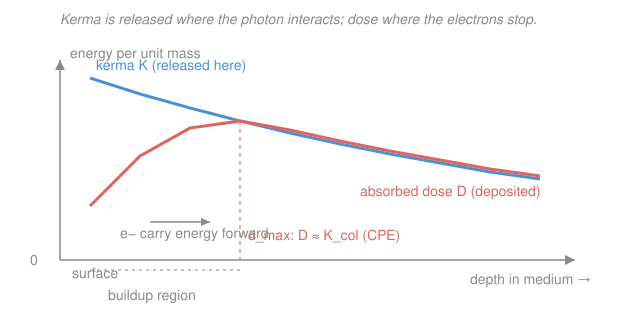

# Radiation Detection & Shielding · Lesson 3.1: Absorbed dose, kerma & exposure

> ⏱ ~15 min · Module 3: Dosimetry & biological effects · Builds on: [intro-nuclear-engineering](../../intro-nuclear-engineering/syllabus.md), [2.5 Efficiency & detection limits](02-05-efficiency-detection-limits.md) · Unlocks: [3.2 Equivalent & effective dose](03-02-equivalent-effective-dose.md)

## Why this matters

You've spent two modules learning to *count* radiation. Now you have to say what it *does*. Every dose number a health physicist ever quotes — a chest X-ray, a fuel-handling job, an evacuation threshold — rests on one physical quantity, **absorbed dose**: joules of energy dumped per kilogram of matter. But the instruments don't measure that directly, and the older units (roentgen, rad) still haunt the paperwork. This lesson pins down the three quantities — dose, kerma, exposure — that you'll spend the rest of the module weighting, converting, and defending.

## The idea

Picture a photon beam hitting tissue. The photon itself is uncharged, so it deposits *nothing* on its own — it just Comptons or photoelectrics and hands its energy to a fast electron. That electron then screeches to a halt over the next millimeter or so, ionizing everything along its track. So there are two distinct events, separated in space:

- **Kerma** = the energy the photon *hands off* to charged particles, counted **at the interaction point**. ("Kinetic Energy Released per unit MAss.")
- **Absorbed dose** = the energy those charged particles actually *deposit*, counted **where they stop** — a short distance downstream.

Same energy, two different bookkeeping locations. Near a surface the two disagree: at the very edge, electrons are flying *inward* but none have arrived *from outside* yet, so dose starts low and climbs as the electron population builds up. A little deeper, every electron leaving a slice is replaced by an identical one entering it — **charged-particle equilibrium (CPE)** — and dose finally catches up to kerma. That equilibrium is the whole trick: it's the condition under which you're allowed to say dose ≈ kerma and compute one from the other.

**Exposure** is the grandparent quantity: instead of energy per mass, it measures *ionization charge liberated in air*. It's air-specific and historical, but survey meters are still calibrated in it, so you must be able to convert.

## The formal version

**Absorbed dose.**

$$D = \frac{d\bar\varepsilon}{dm}$$

where $d\bar\varepsilon$ is the mean energy imparted to matter in a mass element $dm$. In words: dose is energy actually deposited, per kilogram, at the point in question. Unit: the **gray**, $1\,\text{Gy} = 1\,\text{J/kg}$. Old unit: the **rad**, $1\,\text{rad} = 0.01\,\text{Gy} = 10\,\text{mGy}$. Dose is the master physical quantity — defined for *any* radiation in *any* material.

**Kerma.**

$$K = \frac{dE_{tr}}{dm}$$

where $dE_{tr}$ is the sum of *initial* kinetic energies of all charged particles set in motion by uncharged radiation (photons, neutrons) in mass $dm$. In words: energy transferred to electrons at the interaction site, before they've gone anywhere. Also in gray. Split it into **collision kerma** $K_{col}$ (energy the electrons spend on ionization/excitation) and **radiative kerma** $K_{rad}$ (energy they later radiate as bremsstrahlung): $K = K_{col} + K_{rad}$.

**Charged-particle equilibrium.** When each charged particle leaving a volume is replaced by an identical one entering it,

$$D = K_{col} \qquad (\text{under CPE}).$$

In words: at equilibrium, absorbed dose equals *collision* kerma exactly — the bremsstrahlung leaks away, so dose tracks $K_{col}$, not total $K$. This is the bridge that lets you compute dose from photon interaction data.

**Flux-to-dose.** For a monoenergetic photon fluence $\Phi$ (photons per cm², integrated over the exposure) of energy $E$, at CPE:

$$D = \Phi \, E \, \left(\frac{\mu_{en}}{\rho}\right)$$

where $\mu_{en}/\rho$ is the **mass energy-absorption coefficient** of the medium (cm²/g) — the fraction of the beam's energy actually absorbed per unit mass thickness. In words: dose = how many photons × energy each × fraction of that energy the material keeps. (This is $\mu_{en}$, the *absorption* cousin of the attenuation coefficient $\mu$ you'll meet in [4.1](04-01-exponential-attenuation-hvl.md).)

**Exposure.**

$$X = \frac{dQ}{dm_{air}}$$

the ionization charge $dQ$ of one sign liberated in a mass $dm$ of **air**. Unit: the **roentgen**, $1\,\text{R} = 2.58\times10^{-4}\,\text{C/kg}$ (air). It converts to air kerma through the mean energy per ion pair $W/e = 33.97\,\text{J/C}$:

$$1\,\text{R} \;\to\; K_{air} = 2.58\times10^{-4}\,\tfrac{\text{C}}{\text{kg}} \times 33.97\,\tfrac{\text{J}}{\text{C}} \approx 8.76\,\text{mGy (air)}, \qquad \approx 9.3\,\text{mGy (tissue)}.$$

In words: one roentgen delivers about 8.76 mGy of dose to air, or about 9.3 mGy to soft tissue (tissue absorbs a bit more per unit mass at these energies).

## Picture

The blue kerma curve is highest at the surface (most photons, least attenuation) and falls with depth. The coral dose curve starts *low* — no electrons have built up yet — climbs through the **buildup region**, and meets kerma at $d_{max}$, roughly the range of the secondary electrons. That crossing point is CPE, where $D \approx K_{col}$. (Deeper still, dose runs slightly *above* collision kerma because kerma keeps falling ahead of it — "transient" CPE — a subtlety we can ignore for hand calculations.)

## Worked examples

**Example 1 (flux-to-dose — the core dosimetry calculation).** A soft-tissue sample is exposed to a fluence $\Phi = 1.0\times10^{10}$ photons/cm² of $1.0\,\text{MeV}$ gammas. The tissue mass energy-absorption coefficient at this energy is $\mu_{en}/\rho = 0.0310\,\text{cm}^2/\text{g}$. Find the absorbed dose (assume CPE).

Work in energy fluence first — number of photons times energy each:

$$\Psi = \Phi\,E = (1.0\times10^{10}\,\text{cm}^{-2})(1.0\,\text{MeV}) = 1.0\times10^{10}\,\text{MeV/cm}^2.$$

Convert to SI energy ($1\,\text{MeV} = 1.602\times10^{-13}\,\text{J}$):

$$\Psi = 1.0\times10^{10} \times 1.602\times10^{-13}\,\text{J/cm}^2 = 1.602\times10^{-3}\,\text{J/cm}^2.$$

Now apply the absorption coefficient — this converts "energy passing through" into "energy kept per gram":

$$D = \Psi\left(\frac{\mu_{en}}{\rho}\right) = (1.602\times10^{-3}\,\text{J/cm}^2)(0.0310\,\text{cm}^2/\text{g}) = 4.97\times10^{-5}\,\text{J/g}.$$

Convert grams to kilograms ($\times\,1000\,\text{g/kg}$) to land in gray:

$$D = 4.97\times10^{-5}\,\text{J/g} \times 1000\,\text{g/kg} = 4.97\times10^{-2}\,\text{J/kg} = \boxed{49.7\,\text{mGy}}.$$

Watch the unit cascade: MeV → J, cm²/g → the coefficient, g → kg. Every dose problem is that chain.

**Example 2 (exposure conversion — reading a survey meter).** An air-filled ion chamber reads an exposure of $150\,\text{mR}$ at a workstation. What air kerma and tissue dose does that represent?

First convert to coulombs per kilogram. $150\,\text{mR} = 0.150\,\text{R}$, and $1\,\text{R} = 2.58\times10^{-4}\,\text{C/kg}$:

$$X = 0.150 \times 2.58\times10^{-4}\,\text{C/kg} = 3.87\times10^{-5}\,\text{C/kg (air)}.$$

Each coulomb of ionization cost $W/e = 33.97\,\text{J}$ to create (that's the energy the electrons spent ionizing air — i.e. collision kerma):

$$K_{air} = X \cdot \frac{W}{e} = 3.87\times10^{-5}\,\text{C/kg} \times 33.97\,\text{J/C} = 1.31\times10^{-3}\,\text{J/kg} = 1.31\,\text{mGy (air)}.$$

Sanity check against the shortcut: $0.150\,\text{R} \times 8.76\,\text{mGy/R} = 1.31\,\text{mGy}$. ✓ Now cross to tissue with the shortcut ($1\,\text{R} \approx 9.3\,\text{mGy}$ tissue), or scale by the ratio $9.3/8.76 \approx 1.06$:

$$D_{tissue} = 0.150\,\text{R} \times 9.3\,\text{mGy/R} = 1.40\,\text{mGy (tissue)}.$$

So a 150 mR reading is about a 1.4 mGy tissue dose — the survey meter's air-based number, translated into what the person actually receives.

## Watch out

- You might think kerma and dose are the same thing measured twice. They're the *same energy* but booked at different **places** — release point vs deposition point. They coincide only under CPE, and near boundaries (a surface, an air–tissue interface) they genuinely differ, which is exactly why buildup exists.
- You might think dose equals *total* kerma. Under CPE, $D = K_{col}$, the **collision** part — the radiative (bremsstrahlung) fraction escapes and is not deposited locally. At the low photon energies of most health-physics work $K_{rad}$ is tiny, so $D \approx K$; at high energy or high $Z$ don't drop the distinction.
- You might treat exposure as a universal dose. It's defined **only in air** and **only for photons** (up to a few MeV), because it relies on collecting ionization in air. There is no roentgen for neutrons or for tissue — convert to kerma or dose before you compare anything.

## One-liner

> Kerma is energy handed to electrons where the photon hits; absorbed dose is where those electrons dump it — and once charged-particle equilibrium sets in, $D \approx K_{col}$, the hinge that turns fluence into gray.

## Problems

**P1 (🟢)** A tissue voxel of mass $2.0\,\text{g}$ absorbs $1.0\times10^{-4}\,\text{J}$ of energy from a radiation field. What is the absorbed dose in gray, in mGy, and in rad?

**P2 (🟡)** A beam of $0.50\,\text{MeV}$ photons delivers a fluence $\Phi = 4.0\times10^{9}$ photons/cm² to soft tissue, for which $\mu_{en}/\rho = 0.0330\,\text{cm}^2/\text{g}$ at this energy. Assuming charged-particle equilibrium, find the absorbed dose in mGy. (Uses [4.1](04-01-exponential-attenuation-hvl.md)'s absorption idea — but note $\mu_{en}$, energy *absorbed*, not $\mu$, energy *removed*.)

**P3 (🔴, optional)** A radiographer's ion chamber logs $2.0\,\text{R}$ of exposure during a shot. (a) Convert to air kerma (mGy) using $W/e = 33.97\,\text{J/C}$ and $1\,\text{R} = 2.58\times10^{-4}\,\text{C/kg}$. (b) Give the approximate soft-tissue dose. (c) Roughly how many $0.50\,\text{MeV}$ photons per cm² would produce that tissue dose, reusing $\mu_{en}/\rho = 0.0330\,\text{cm}^2/\text{g}$? (This stitches P2 and P3 together.)

Solutions

**P1** Dose is energy per mass; convert the mass to kilograms ($2.0\,\text{g} = 2.0\times10^{-3}\,\text{kg}$):

$$D = \frac{1.0\times10^{-4}\,\text{J}}{2.0\times10^{-3}\,\text{kg}} = 5.0\times10^{-2}\,\text{J/kg} = 0.050\,\text{Gy} = 50\,\text{mGy}.$$

In rad: $0.050\,\text{Gy} \div 0.01\,\text{Gy/rad} = 5.0\,\text{rad}$. So $0.050\,\text{Gy} = 50\,\text{mGy} = 5.0\,\text{rad}$.

**P2** Energy fluence:

$$\Psi = \Phi E = (4.0\times10^{9}\,\text{cm}^{-2})(0.50\,\text{MeV}) = 2.0\times10^{9}\,\text{MeV/cm}^2.$$

To SI: $2.0\times10^{9} \times 1.602\times10^{-13}\,\text{J} = 3.20\times10^{-4}\,\text{J/cm}^2$. Then

$$D = \Psi\left(\frac{\mu_{en}}{\rho}\right) = (3.20\times10^{-4}\,\text{J/cm}^2)(0.0330\,\text{cm}^2/\text{g}) = 1.06\times10^{-5}\,\text{J/g}.$$

Times $1000\,\text{g/kg}$: $D = 1.06\times10^{-2}\,\text{J/kg} = 10.6\,\text{mGy}$.

**P3** (a) $X = 2.0\,\text{R} \times 2.58\times10^{-4}\,\text{C/kg} = 5.16\times10^{-4}\,\text{C/kg}$. Then

$$K_{air} = 5.16\times10^{-4}\,\text{C/kg} \times 33.97\,\text{J/C} = 1.75\times10^{-2}\,\text{J/kg} = 17.5\,\text{mGy (air)}.$$

(Check: $2.0 \times 8.76 = 17.5\,\text{mGy}$. ✓)

(b) Tissue dose $\approx 2.0\,\text{R} \times 9.3\,\text{mGy/R} = 18.6\,\text{mGy}$.

(c) Invert the flux-to-dose relation for fluence. First put the target dose back in J/g: $18.6\,\text{mGy} = 1.86\times10^{-2}\,\text{J/kg} = 1.86\times10^{-5}\,\text{J/g}$. Divide by the coefficient to recover energy fluence:

$$\Psi = \frac{D}{\mu_{en}/\rho} = \frac{1.86\times10^{-5}\,\text{J/g}}{0.0330\,\text{cm}^2/\text{g}} = 5.64\times10^{-4}\,\text{J/cm}^2.$$

Convert energy back to MeV and divide by the per-photon energy: $5.64\times10^{-4}\,\text{J/cm}^2 \div 1.602\times10^{-13}\,\text{J/MeV} = 3.52\times10^{9}\,\text{MeV/cm}^2$, then $\div\,0.50\,\text{MeV} = 7.0\times10^{9}$ photons/cm². So roughly $7\times10^{9}$ photons per cm² — about the fluence a 2 R exposure represents at this energy.

## Flashback

**From Lesson 2.5 (Efficiency & detection limits):** You count a gamma source and record $3{,}200$ gross counts in the photopeak and $200$ counts in an equal-width background region, over a $600\,\text{s}$ live time. The detector's full-energy efficiency is $\varepsilon = 3.0\%$ and the gamma yield (branching ratio) is $0.85$. Find the source activity in Bq with its $1\sigma$ uncertainty.

Solution

Net counts and their uncertainty (Poisson error is on the raw counts, so $\sigma_{net} = \sqrt{G+B}$):

$$N = G - B = 3200 - 200 = 3000, \qquad \sigma_{net} = \sqrt{3200 + 200} = \sqrt{3400} = 58.3.$$

Net count rate: $r = N/t = 3000/600 = 5.00\,\text{cps}$. Activity divides the rate by what fraction of decays get counted — efficiency times branching:

$$A = \frac{r}{\varepsilon \cdot y} = \frac{5.00\,\text{cps}}{(0.030)(0.85)} = \frac{5.00}{0.0255} = 196\,\text{Bq}.$$

Uncertainty scales with the fractional error on the net counts (efficiency and yield taken exact here):

$$\sigma_A = A\,\frac{\sigma_{net}}{N} = 196 \times \frac{58.3}{3000} = 196 \times 0.0194 = 3.8\,\text{Bq}.$$

So $A \approx 196 \pm 4\,\text{Bq}$.

## Connections

- **Backward:** the $\mu_{en}/\rho$ in flux-to-dose is the energy-absorbing sibling of the photon interaction cross-sections from [intro-nuclear-engineering](../../intro-nuclear-engineering/syllabus.md) — photoelectric, Compton, and pair production are precisely the channels that *transfer* energy to the electrons kerma counts.
- **Forward:** [3.2](03-02-equivalent-effective-dose.md) weights this physical dose by radiation type ($w_R$) and organ sensitivity ($w_T$) to get equivalent and effective dose in sieverts; [3.3](03-03-dose-from-a-source.md) turns fluence-to-dose into a dose *rate* at a distance from a real source.
- **Sideways (measurement):** the $1\,\text{J/kg} = 1\,\text{Gy}$ definition is why a calorimeter — literally a thermometer on an absorber — is the primary dose standard, and why survey meters (which read exposure in air) must be cross-calibrated against it. The Poisson uncertainty from the Flashback rides along: a dose derived from counts inherits their $\sqrt{N}$ error bar, straight from `prob-stat-refresher`.
