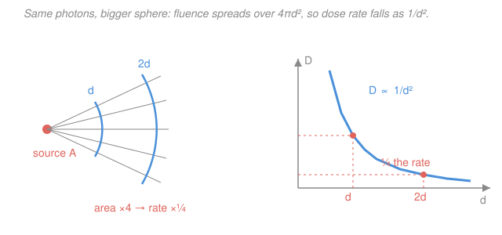

# Radiation Detection & Shielding · Lesson 3.3: Dose from a source

> ⏱ ~15 min · Module 3: Dosimetry & Radiation Protection · Builds on: [3.2 Equivalent & effective dose](03-02-equivalent-effective-dose.md), [3.1 Absorbed dose, kerma, exposure](03-01-absorbed-dose-kerma-exposure.md) · Unlocks: [4.1 Exponential attenuation & HVL](04-01-exponential-attenuation-hvl.md), [4.5 Health physics, ALARA & limits](04-05-health-physics-alara-limits.md)

## Why this matters

You are handed a sealed source and a number on a label — its activity — and asked the only question that matters in the room: *how fast am I getting dose, and how long can I stand here?* Two facts turn the label into an answer. First, a source's photon output per becquerel is fixed physics, packaged into one number, the **dose-rate constant** $\Gamma$. Second, that dose spreads over the surface of an expanding sphere, so it dies as $1/d^2$ with distance. Together they give a dose rate you can compute in your head at the bench — and distance is the cheapest, most powerful lever you own for cutting it.

## The idea

Picture a point source spitting gamma rays equally in all directions. At any moment the same number of photons per second is crossing every sphere centered on the source — the count is conserved, nothing is created or destroyed in empty air. But a sphere of radius $2d$ has **four times** the surface area of one at radius $d$ (area $=4\pi d^2$). The same photons, smeared over four times the area, means one-quarter the flux — and dose rate tracks flux. Step twice as far back, take one-quarter the dose rate. That is the **inverse-square law**, and it is the single most useful protection move you have: it costs nothing, needs no lead, and it is *ruthless* up close.

The other half is the label. Activity $A$ tells you decays per second; each decay emits a known menu of photons at known energies. How much of that photon energy actually deposits as dose in tissue (or air) per unit activity, measured at a standard 1 metre, is a property of *the nuclide* — cobalt-60 always gives the same, caesium-137 always gives its own. Roll all of it into one constant $\Gamma$, and dose rate at any distance is just "constant times activity, divided by distance squared."

## The formal version

**The point-source dose-rate equation.** For a point source of activity $A$ at distance $d$ in air (unshielded), the dose rate is

$$\boxed{\;\dot D = \dfrac{\Gamma A}{d^{2}}\;}$$

- $\dot D$ — dose rate (here air-kerma rate, in $\text{mGy}\,\text{h}^{-1}$; the dot means "per unit time").
- $A$ — activity of the source ($\text{GBq}$; $1\,\text{GBq}=10^{9}$ decays per second).
- $d$ — distance from the source to the point ($\text{m}$).
- $\Gamma$ — the **dose-rate constant** for that nuclide, with units $\text{mGy}\cdot\text{m}^{2}\,\text{h}^{-1}\,\text{GBq}^{-1}$.

*In words: dose rate is the nuclide's built-in output $\Gamma$ times how much source you have, cut down by the square of how far away you stand.* For $\ce{^{60}Co}$ the course adopts $\Gamma \approx 1.29\,\text{mGy}\cdot\text{m}^{2}\,\text{h}^{-1}\,\text{GBq}^{-1}$ (air-kerma basis).

Read $\Gamma$ as "the dose rate one metre from a 1 GBq source": set $A=1\,\text{GBq}$ and $d=1\,\text{m}$ and $\dot D = \Gamma$ falls out. Everything else is scaling.

**Where $\Gamma$ comes from.** It is not magic — it is the flux-to-dose chain of [3.1](03-01-absorbed-dose-kerma-exposure.md) evaluated at unit activity and distance. A source emitting $n_i$ photons of energy $E_i$ per decay sends a fluence rate $\dot\varphi = A\,n_i/(4\pi d^2)$ through a sphere; the energy fluence rate $\dot\varphi E_i$ times the mass energy-absorption coefficient $(\mu_{en}/\rho)$ gives kerma rate. Summing over the nuclide's emission lines,

$$\Gamma \;=\; \frac{1}{4\pi}\sum_i n_i\,E_i\left(\frac{\mu_{en}}{\rho}\right)_i \times(\text{unit conversions}).$$

*In words: add up, over every gamma line, "photons per decay × energy × how strongly that energy is absorbed," then divide by the $4\pi$ of the sphere.* For $\ce{^{60}Co}$ that sum runs over its two lines, $1.17\,\text{MeV}$ and $1.33\,\text{MeV}$ (very nearly two photons per decay), with air's $\mu_{en}/\rho\approx 0.0267\,\text{cm}^2\text{g}^{-1}$ near $1.25\,\text{MeV}$. Because the unit-juggling is fiddly and reliable tables exist, in practice you **look $\Gamma$ up** — but the structure above tells you *why* a hard, high-yield gamma emitter like cobalt has a large $\Gamma$ and a soft or low-yield emitter a small one.

**From kerma to what the body feels.** For gammas, air-kerma $\approx$ absorbed dose $\approx$ equivalent dose, because the radiation weighting factor is $w_R=1$ (from [3.2](03-02-equivalent-effective-dose.md)): $1\,\text{mGy}\to 1\,\text{mSv}$. So for a photon source you can read $\dot D$ in $\text{mGy}\,\text{h}^{-1}$ straight across as $\text{mSv}\,\text{h}^{-1}$ for protection bookkeeping — a convenience that fails the moment neutrons or alphas enter ($w_R>1$).

## Picture

## Worked examples

**Example 1 (the bench source — rate and time).** A $5.0\,\text{mCi}$ $\ce{^{60}Co}$ source sits on a bench. First convert activity to SI: $5.0\,\text{mCi}\times 37\,\text{MBq/mCi}=185\,\text{MBq}=0.185\,\text{GBq}$. With $\Gamma=1.29\,\text{mGy}\cdot\text{m}^2\,\text{h}^{-1}\,\text{GBq}^{-1}$ and $d=1.5\,\text{m}$:

$$\dot D = \frac{\Gamma A}{d^2} = \frac{1.29\times 0.185}{(1.5)^2} = \frac{0.2387}{2.25} \approx 0.106\,\text{mGy/h}.$$

Now the time question. A common weekly control level is $1\,\text{mSv}$. Since $w_R=1$ for these gammas, $0.106\,\text{mGy/h}\approx 0.106\,\text{mSv/h}$, so the allowed standing time is

$$t = \frac{1\,\text{mSv}}{0.106\,\text{mSv/h}} \approx 9.4\,\text{h}.$$

*In words: parked $1.5\,\text{m}$ from this source you'd hit a $1\,\text{mSv}$ weekly limit after about nine and a half hours of exposure* — comfortable for occasional handling, tight if you lived there. (This is the unshielded, "worst case, ignore the walls" number; Module 4 knocks it down with lead.)

**Example 2 (distance is the lever).** Your local action level for that bench area is $0.020\,\text{mGy/h}$. How far back must the source sit? Solve $\dot D = \Gamma A/d^2$ for $d$:

$$d = \sqrt{\frac{\Gamma A}{\dot D}} = \sqrt{\frac{1.29\times 0.185}{0.020}} = \sqrt{11.9} \approx 3.5\,\text{m}.$$

And watch how cheap distance is once you're already out. Doubling from $1.5\,\text{m}$ to $3.0\,\text{m}$:

$$\dot D(3.0) = \frac{1.29\times 0.185}{(3.0)^2} = \frac{0.2387}{9.0} \approx 0.0265\,\text{mGy/h} = \tfrac14\,\dot D(1.5).$$

*In words: two metres becomes four times the shielding-equivalent for free.* That $1/d^2$ steepness is exactly why "take one step back" beats "reach in and rush" almost every time — the payoff is largest precisely where you're closest and the rate is highest.

## Watch out

- **You might think $\Gamma$ is one fixed number for a nuclide.** It is fixed *once you fix the basis* — references tabulate $\Gamma$ on an exposure basis (older, $\text{R}\cdot\text{m}^2\,\text{h}^{-1}\,\text{Ci}^{-1}$), an air-kerma basis, or an ambient-dose-equivalent $H^*(10)$ basis, and per $\text{Ci}$ or per $\text{GBq}$. The numbers differ severalfold. Always check *which* $\Gamma$ your table means, and match its activity unit before you multiply.
- **You might apply $\dot D=\Gamma A/d^2$ right up against the source.** Inverse-square is a *point-source idealization*. Within a source diameter or so — hugging an extended source, or standing beside a line/area source — the geometry is no longer "one point on a sphere," and the true rate falls off slower than $1/d^2$ (it looks $1/d$ near a line). The point-kernel method of [4.3](04-03-point-kernel-method.md) handles finite sources by summing many points; near-field, treat $\Gamma A/d^2$ as an *over*-conservative estimate at best.
- **You might carry $\text{mGy}\to\text{mSv}$ across for anything.** That one-to-one shortcut works *only* because $w_R=1$ for photons. Put a neutron source on the bench and the same air-kerma rate implies a much larger equivalent-dose rate ($w_R$ up to $\sim20$) — you must re-weight before comparing to an $\text{mSv}$ limit.

## One-liner

> A point source delivers $\dot D=\Gamma A/d^2$: the nuclide's built-in output $\Gamma$ times how much you have, divided by distance squared — so backing up twice as far cuts the dose rate to a quarter, no lead required.

## Problems

**P1 (🟢)** A $2.0\,\text{GBq}$ $\ce{^{60}Co}$ point source is $2.0\,\text{m}$ away. Using $\Gamma=1.29\,\text{mGy}\cdot\text{m}^2\,\text{h}^{-1}\,\text{GBq}^{-1}$, find the unshielded dose rate. Then find the dose rate if you move to $4.0\,\text{m}$ — without recomputing from scratch.

**P2 (🟡)** A worker is limited to $0.30\,\text{mSv}$ for a task beside the $0.185\,\text{GBq}$ source of Example 1. At $1.5\,\text{m}$ the rate is $0.106\,\text{mGy/h}$. (a) How long may the task take at $1.5\,\text{m}$? (b) If the task actually takes $6\,\text{h}$, what is the *minimum* distance that keeps the worker under $0.30\,\text{mSv}$? (Treat $\text{mGy}=\text{mSv}$ here, $w_R=1$.)

**P3 (🔴)** You measure $0.40\,\text{mGy/h}$ at an unknown distance from a $\ce{^{137}Cs}$ point source of activity $0.90\,\text{GBq}$, for which $\Gamma\approx 0.093\,\text{mGy}\cdot\text{m}^2\,\text{h}^{-1}\,\text{GBq}^{-1}$. (a) How far away is the detector? (b) The area behind a wall must stay under $0.010\,\text{mGy/h}$ — before adding any shielding, how much *further* back than your measurement point is that, in metres?

Solutions

**P1.** At $2.0\,\text{m}$:
$$\dot D = \frac{\Gamma A}{d^2} = \frac{1.29\times 2.0}{(2.0)^2} = \frac{2.58}{4.0} = 0.645\,\text{mGy/h}.$$
Moving from $2.0\,\text{m}$ to $4.0\,\text{m}$ *doubles* the distance, so by inverse-square the rate drops by $2^2=4$:
$$\dot D(4.0) = \frac{0.645}{4} \approx 0.161\,\text{mGy/h}.$$
*Check.* Direct: $1.29\times 2.0/16 = 2.58/16 = 0.161\,\text{mGy/h}$ ✓. Units: $(\text{mGy}\cdot\text{m}^2\,\text{h}^{-1}\,\text{GBq}^{-1})(\text{GBq})/\text{m}^2 = \text{mGy/h}$ ✓.

**P2.** (a) Time = budget ÷ rate:
$$t = \frac{0.30\,\text{mSv}}{0.106\,\text{mSv/h}} \approx 2.8\,\text{h}.$$
(b) If the task is fixed at $t=6\,\text{h}$, the *allowed* rate is
$$\dot D_{\text{max}} = \frac{0.30\,\text{mSv}}{6\,\text{h}} = 0.050\,\text{mSv/h} = 0.050\,\text{mGy/h}.$$
Solve for the distance that gives this rate:
$$d = \sqrt{\frac{\Gamma A}{\dot D_{\text{max}}}} = \sqrt{\frac{1.29\times 0.185}{0.050}} = \sqrt{4.77} \approx 2.2\,\text{m}.$$
*Check.* $2.2\,\text{m}>1.5\,\text{m}$, so the worker must indeed back up to stretch the same budget over more time — consistent. And $\dot D(2.2)=1.29\times0.185/2.18^2 = 0.2387/4.75\approx0.050\,\text{mGy/h}$ ✓.

**P3.** (a) Solve $\dot D=\Gamma A/d^2$ for $d$:
$$d = \sqrt{\frac{\Gamma A}{\dot D}} = \sqrt{\frac{0.093\times 0.90}{0.40}} = \sqrt{\frac{0.0837}{0.40}} = \sqrt{0.209} \approx 0.46\,\text{m}.$$
(b) Distance for $0.010\,\text{mGy/h}$:
$$d' = \sqrt{\frac{0.093\times 0.90}{0.010}} = \sqrt{8.37} \approx 2.89\,\text{m}.$$
So the wall-shielded area must be about $2.89 - 0.46 \approx 2.4\,\text{m}$ further back than the measurement point (before any lead — distance alone).
*Check.* The rate dropped by a factor $0.40/0.010 = 40$, so the distance should grow by $\sqrt{40}\approx6.3\times$: $0.46\times6.3\approx2.9\,\text{m}$ ✓.

## Flashback

**From Lesson 3.2 (Equivalent & effective dose):** A small tissue volume absorbs $2.0\,\text{mGy}$ from fast neutrons (radiation weighting factor $w_R=20$) and, at the same time, $3.0\,\text{mGy}$ from the $\ce{^{60}Co}$ gammas ($w_R=1$). What is the total **equivalent dose** to that tissue? (Fresh variant — a mixed field, not a pure photon source.)

Solution

Equivalent dose sums each radiation's absorbed dose weighted by its $w_R$ (from [3.2](03-02-equivalent-effective-dose.md)):
$$H = \sum_R w_R\,D_R = (20)(2.0\,\text{mGy}) + (1)(3.0\,\text{mGy}) = 40 + 3 = 43\,\text{mSv}.$$
*Check.* Note the neutrons deposited *less* energy ($2.0$ vs $3.0\,\text{mGy}$) yet dominate the equivalent dose ($40$ of $43\,\text{mSv}$) — precisely the point of $w_R$: densely-ionizing radiation does more biological damage per gray. This is exactly why the $\text{mGy}\to\text{mSv}$ shortcut from this lesson is legal *only* for the photon term. ✓

## Connections

- **Backward:** $\Gamma$ is the whole flux-to-dose chain of [3.1 Absorbed dose, kerma, exposure](03-01-absorbed-dose-kerma-exposure.md) — fluence, energy fluence, $\mu_{en}/\rho$ — collapsed into one per-nuclide number; and the $\text{mGy}\to\text{mSv}$ read-across leans on $w_R=1$ from [3.2 Equivalent & effective dose](03-02-equivalent-effective-dose.md). The two Co-60 gamma energies trace back to the photon interactions of the [`intro-nuclear-engineering`](../../intro-nuclear-engineering/syllabus.md) prerequisite.
- **Forward:** $\dot D=\Gamma A/d^2$ is the *unshielded* starting line. [4.1 Exponential attenuation & HVL](04-01-exponential-attenuation-hvl.md) multiplies it by $e^{-\mu x}$ for a shield, [4.2](04-02-buildup-factors.md) corrects that for scatter, and [4.5 Health physics, ALARA & limits](04-05-health-physics-alara-limits.md) puts distance, time, and shielding into one optimization — this lesson is the "distance" leg of that triangle.
- **Sideways (finite sources):** real sources aren't points. [4.3 Point-kernel method](04-03-point-kernel-method.md) rebuilds a line or volume source by superposing many point kernels, each obeying this same $1/d^2$ law — the near-field breakdown flagged in *Watch out* is exactly the problem it solves.
