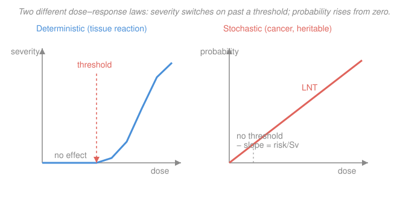

# Radiation Detection & Shielding · Lesson 3.4: Biological effects & risk

> ⏱ ~15 min · Module 3: Dosimetry & biological effects · Builds on: [3.3 Dose from a source](03-03-dose-from-a-source.md), [3.2 Equivalent & effective dose](03-02-equivalent-effective-dose.md) · Unlocks: [4.5 Health physics, ALARA & limits](04-05-health-physics-alara-limits.md)

## Why this matters

You now have a number — say 20 mSv. What does it *do* to a person? The answer splits cleanly in two, and mixing them up is the classic health-physics blunder. A firefighter who takes 5 Sv in one minute at a reactor accident and a radiographer who takes 5 mSv over a year are living in two different biological regimes: one faces a **guaranteed injury that gets worse with dose**, the other faces a **small increase in the *chance* of cancer decades later**. Separating those two regimes is what lets you say, correctly, "this scan is harmless enough to justify" and also "evacuate that room now." It is also the entire reason ALARA exists.

## The idea

Radiation harms tissue by breaking molecules — above all, DNA. But the *consequence* of that damage comes in two flavors, and they follow completely different dose–response laws.

**Deterministic effects** (the modern name is *tissue reactions*) are what happens when radiation kills *enough* cells that an organ can't do its job: skin reddens and blisters, the lens of the eye clouds into a cataract, bone marrow fails. These have a **threshold** — below some dose, so few cells die that the tissue repairs and repopulates with no visible harm. Above it, the effect appears, and it gets **more severe** the higher the dose. Think of a sunburn: a little sun does nothing, past a point you burn, and more sun burns worse. Everyone above the threshold is affected.

**Stochastic effects** are the opposite. A single damaged cell that survives *but is mis-repaired* can carry a mutation that, years or decades later, seeds a cancer (or, in a germ cell, a heritable defect). Here there is **no threshold we can point to** — even one ionizing track can, in principle, cause the mutation — and raising the dose does **not** make the cancer worse. It makes it **more likely**. Dose sets a *probability*, not a severity. You can't get "a little bit of cancer."

That single distinction — severity-with-threshold versus probability-without-threshold — is the whole lesson. Everything else is putting numbers on it.

## The formal version

**Deterministic (tissue-reaction) effects.** Below a threshold dose $D_\text{th}$ the effect does not occur; above it, severity increases with dose. Rough acute whole-body landmarks (absorbed dose ≈ equivalent dose here, since accident fields are mostly gammas/betas with $w_R=1$):

- **~0.5 Sv** — first detectable changes (drop in blood cell counts).
- **~1 Sv** — onset of **acute radiation syndrome (ARS)**: nausea, fatigue.
- **~4 Sv** — **LD50/60**: roughly half of exposed people die within 60 days *without* medical care (bone-marrow failure).
- **~8 Sv+** — usually fatal even with treatment.
- Localized thresholds: skin erythema ~2 Sv, lens cataracts ~0.5 Sv (cumulative), temporary sterility ~0.15 Sv.

*In words: these need a big dose delivered fast, they hit everyone above the threshold, and the sicker you get the more dose you took — the domain of accidents, not routine work.*

**Stochastic effects.** Cancer and heritable effects, modeled with **no threshold**. The probability of a fatal cancer is taken proportional to effective dose $E$:

$$P_\text{fatal cancer} \approx r \cdot E, \qquad r \approx 5\times 10^{-2}\ \text{Sv}^{-1} = 5\%\ \text{per Sv}.$$

*In words: each sievert of effective dose adds about a 5% chance of a fatal cancer, and we assume that line runs straight down to zero dose.* Equivalently $r \approx 5\times 10^{-5}$ per mSv. This is the **Linear No-Threshold (LNT)** model: risk is *linear* in dose and passes through the origin with *no* safe threshold. The coefficient $r$ (ICRP's nominal risk coefficient) is population-averaged detriment, not a personal prophecy.

**Why LNT ⟹ ALARA.** If there were a threshold, doses below it would be free and you'd only care about staying under it. LNT says there is *no* free dose: every millisievert carries a proportional slice of risk. So the rational policy is not "stay under a line" but **As Low As Reasonably Achievable** — minimize *all* dose, weighing each reduction against its cost. LNT is the mathematical reason ALARA is a principle and not just a limit. (Whether LNT is literally true at very low doses is debated — but as a *protection* assumption it is deliberately conservative.)

**Mechanism.** Ionizing radiation damages DNA two ways:

- **Direct:** the charged-particle track ionizes the DNA molecule itself, snapping a strand.
- **Indirect:** the track ionizes surrounding water, producing free radicals — chiefly the hydroxyl radical (&bull;OH) — which then chemically attack DNA. For sparsely-ionizing (low-LET) radiation like gammas, the *indirect* path causes the majority of the damage.

The dangerous lesion is a **double-strand break**. Most breaks are repaired faithfully; a cell with too many dies (→ deterministic, when many cells die at once); a cell that survives with a *mis-repair* keeps a mutation (→ stochastic seed). Higher LET (alphas, neutrons) makes denser, harder-to-repair clusters — exactly why $w_R>1$ for them, from [3.2](03-02-equivalent-effective-dose.md).

## Picture

The blue curve sits pinned at zero until the threshold, then climbs — **severity**. The coral line starts at the origin and rises straight — **probability**. Same horizontal axis (dose), two entirely different verticals.

## Worked examples

**Example 1 (LNT risk — putting a number on a routine dose).** A radiation worker receives an effective dose of $E = 20\ \text{mSv}$ in a year (a typical occupational value, well under the 50 mSv/yr limit). Estimate the added lifetime fatal-cancer risk and compare it to the baseline.

Convert and multiply by the risk coefficient:

$$P = r\,E = (5\times 10^{-2}\ \text{Sv}^{-1})(0.020\ \text{Sv}) = 1.0\times 10^{-3}.$$

So about **1 in 1000** added chance of a fatal cancer. Now compare: the *baseline* lifetime risk of dying of cancer (all causes) is roughly $20\%$, i.e. 1 in 5. The radiation adds

$$\frac{0.001}{0.20} = 0.5\%\ \text{relative increase} \;\Rightarrow\; 20.0\% \to 20.1\%.$$

*In words: one year at this dose nudges a 1-in-5 baseline to barely above 1-in-5 — real, non-zero, and worth minimizing, but small.* The scale changes if it accumulates: a 40-year career at 20 mSv/yr is $0.8\ \text{Sv}$, giving $r\,E = 0.05\times 0.8 = 4\times 10^{-2}$ — a **4%** added risk, no longer negligible. That accumulation is precisely why ALARA cares about *every* year, not just this one.

**Example 2 (deterministic vs stochastic — classify and justify).** For each exposure, say which effect governs and why.

*(a) A chest CT delivering $E \approx 1\ \text{mSv}$ effective dose.* This is thousands of times below any deterministic threshold (the lowest are ~150 mSv). No tissue reaction is possible. **Only stochastic** applies: added fatal-cancer risk $r\,E = (5\times 10^{-5}\,\text{mSv}^{-1})(1\ \text{mSv}) = 5\times 10^{-5}$, about **1 in 20,000** — the price of the diagnostic information, and clinically easy to justify.

*(b) A 5 Sv acute whole-body accidental exposure.* This is **above LD50/60 (~4 Sv)**, so it is squarely in **deterministic** territory: severe acute radiation syndrome, life-threatening within weeks, requiring immediate medical intervention. Stochastic risk is also elevated (nominally $r\times5 = 25\%$), but that cancer would appear *years later* — the deterministic injury is what governs the outcome, because the patient must survive the acute phase first.

*The rule of thumb:* if the dose is small and chronic, think **stochastic (probability)**; if it is large and acute (≳ few hundred mSv, and especially ≳ 1 Sv), think **deterministic (severity)** — while remembering the stochastic risk rides along on top.

## Watch out

- **You might think LNT means a small dose gives you "a little cancer."** No — under LNT a small dose gives a small *probability* of a full-blown cancer. Stochastic effects have no "mild" version; dose controls the odds, not the severity. Severity-with-dose is the *deterministic* story.
- **You might treat the 5% per Sv as a personal prediction.** It is a population-averaged detriment coefficient. It answers "how many extra cancers in a large exposed group," not "will *this* person get cancer." Use it for planning and comparison, not prophecy.
- **You might assume a threshold dose exists because doctors quote "safe" limits.** Regulatory limits (e.g. 50 mSv/yr) are *risk-management* lines chosen to keep stochastic risk acceptably low — not biological thresholds. For stochastic effects the assumed threshold is zero; that is the entire point of LNT and ALARA.

## One-liner

> Deterministic effects have a threshold and grow *worse* with dose; stochastic effects have no threshold and grow *more likely* — LNT turns "more likely" into ~5% added fatal-cancer risk per sievert, which is why every dose is kept ALARA.

## Problems

**P1 (🟢)** A patient undergoes a series of scans totaling an effective dose of $8\ \text{mSv}$. Using the LNT coefficient $r = 5\times 10^{-2}\ \text{Sv}^{-1}$, estimate the added lifetime fatal-cancer risk, and express it as "1 in $N$."

**P2 (🟡)** Classify each and name the governing effect: (a) a 3 Sv acute whole-body dose; (b) a 2 mSv/yr chronic occupational dose sustained for 30 years. For (b), also give the total added fatal-cancer risk under LNT.

**P3 (🔴)** A safety officer argues: "Our workers stay under 20 mSv/yr, far below the 1 Sv ARS threshold, so there is no health effect and no reason to spend money reducing dose further." Identify the conceptual error and rebut it in two sentences, using the two effect types.

Solutions

**P1** Convert and multiply:

$$P = r\,E = (5\times 10^{-2}\ \text{Sv}^{-1})(0.008\ \text{Sv}) = 4\times 10^{-4}.$$

That is **1 in 2,500**. *Check:* $8\ \text{mSv}\times 5\times 10^{-5}\,\text{mSv}^{-1} = 4\times 10^{-4}$ ✓, and it sits between the 1-mSv CT (1 in 20,000) and the 20-mSv year (1 in 1,000) from the examples, as it should.

**P2** *(a)* $3\ \text{Sv}$ acute is above the ~1 Sv ARS onset and below LD50/60 (~4 Sv): **deterministic** — acute radiation syndrome, serious but often survivable with treatment. (Stochastic risk is also raised, but the acute tissue reaction governs.)

*(b)* $2\ \text{mSv/yr}$ is far below every deterministic threshold, so **stochastic only**. Total dose $= 2\ \text{mSv/yr}\times 30\ \text{yr} = 60\ \text{mSv} = 0.060\ \text{Sv}$, giving

$$P = r\,E = (5\times 10^{-2}\ \text{Sv}^{-1})(0.060\ \text{Sv}) = 3\times 10^{-3},$$

about **1 in 330** added fatal-cancer risk over the career. *Check:* $60\ \text{mSv}\times 5\times 10^{-5}\,\text{mSv}^{-1}=3\times 10^{-3}$ ✓.

**P3** The error is assuming that being below the **deterministic** threshold means *no* effect. That is only true for tissue reactions; **stochastic** cancer risk has **no threshold** under LNT, so 20 mSv/yr still carries a proportional risk ($\sim 1\times 10^{-3}$ per year, accumulating to $\sim 4\%$ over a career) — which is exactly why ALARA calls for reducing dose even when you are legally under the limit.

## Flashback

**From Lesson 3.3 (Dose from a source):** A small gamma source produces a dose rate of $0.40\ \text{mSv/h}$ at a distance of $1.0\ \text{m}$. (a) Using the inverse-square law, what is the dose rate at $2.5\ \text{m}$? (b) How long may a worker stand at $2.5\ \text{m}$ before accumulating a $1\ \text{mSv}$ dose? (Fresh numbers.)

Solution

**(a)** Dose rate falls as $1/d^2$, so scale by the ratio of distances squared:

$$\dot D(2.5) = \dot D(1.0)\left(\frac{1.0}{2.5}\right)^2 = 0.40\ \text{mSv/h}\times \frac{1}{6.25} = 0.064\ \text{mSv/h}.$$

**(b)** Time to reach the limit is dose divided by dose rate:

$$t = \frac{1\ \text{mSv}}{0.064\ \text{mSv/h}} \approx 15.6\ \text{h}.$$

*Check:* moving from 1.0 m to 2.5 m is $2.5\times$ farther, so the rate drops by $2.5^2 = 6.25$, and $0.40/6.25 = 0.064$ ✓. Backing away buys the worker time — the "distance" leg of the time–distance–shielding trilogy you'll formalize in [4.5](04-05-health-physics-alara-limits.md). ✓

## Connections

- **Backward:** [3.3](03-03-dose-from-a-source.md) gave you the *number* (a dose rate, an accumulated mSv); this lesson tells you what that number *means* biologically. And [3.2](03-02-equivalent-effective-dose.md)'s effective dose $E$ was engineered for exactly this purpose — it weights organs by $w_T$ so that a single number is proportional to total stochastic risk, which is why the LNT formula takes $E$ as its input.
- **Forward:** [4.5 Health physics, ALARA & limits](04-05-health-physics-alara-limits.md) turns the ALARA rationale here into practice — time, distance, and shielding traded off against a dose budget and regulatory limits.
- **Sideways (biophysics / radiation biology):** the direct-vs-indirect DNA damage mechanism, water radiolysis, and free-radical chemistry are the bridge into radiation biology — see the [biophysics](../../biophysics/syllabus.md) track, where the same &bull;OH radicals and double-strand-break repair kinetics are studied as molecular biophysics rather than as a dose coefficient.
