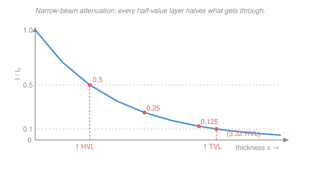

# Radiation Detection & Shielding · Lesson 4.1: Exponential attenuation & HVL

> ⏱ ~15 min · Module 4: Shielding design & health physics · Builds on: [1.2 Pair production & total attenuation](01-02-photon-pair-production-total-attenuation.md), [3.3 Dose from a source](03-03-dose-from-a-source.md) · Unlocks: [4.2 Buildup factors](04-02-buildup-factors.md)

## Why this matters

Someone hands you a hot gamma source and a dose limit, and asks: *how thick a slab of lead makes it safe?* This lesson is the first honest answer. In Module 1 you learned that a photon beam thins out as $I = I_0 e^{-\mu x}$; now you turn that curve into a design tool — read a half-value layer off a table, count how many you need, and quote a thickness. It's the workhorse calculation of every shielding memo, and it's exact for a clean pencil beam. (The messier real-world correction — scattered photons sneaking through — is [4.2](04-02-buildup-factors.md)'s job.)

## The idea

Picture photons marching through a slab. In each thin sheet of material, a *fixed fraction* of the survivors gets absorbed or scattered out of the beam — not a fixed number, a fixed fraction. That "same fraction per layer" is the entire story, and it forces an exponential: if one centimeter lets 60 percent through, two centimeters let $0.6 \times 0.6 = 36$ percent through, three let $0.6^3$, and so on. Thickness multiplies transmission; it doesn't subtract from it.

The cleanest way to talk about this is the **half-value layer (HVL)**: the thickness that cuts the beam exactly in half. It's a property of the material *and* the photon energy. One HVL leaves $1/2$, two leave $1/4$, three leave $1/8$ — every HVL you stack halves what remains. Want a factor-of-100 reduction? That's between six and seven halvings ($2^6 = 64$, $2^7 = 128$), so you need about 6.6 HVLs. The whole design problem collapses to *counting halvings*. The tenth-value layer (TVL) is the same idea in factors of ten — handy because "reduce by $10^3$" is just three TVLs.

One caveat up front: this "good geometry" law assumes any photon that interacts is *gone for good*. A photon that Compton-scatters but keeps heading downstream is counted as removed even though it's still in play. That white lie is why narrow-beam always **over**-predicts how well your shield works — we repay the debt in 4.2.

## The formal version

**Narrow-beam (good-geometry) attenuation.** For a monoenergetic photon beam of incident intensity $I_0$ crossing a uniform absorber of thickness $x$,

$$I(x) = I_0\, e^{-\mu x},$$

where $I$ is the transmitted intensity (photons, or fluence rate, or dose rate — anything proportional to beam strength) and $\mu$ is the **total linear attenuation coefficient** (units of inverse length, e.g. $\text{mm}^{-1}$ or $\text{cm}^{-1}$), the sum of the photoelectric, Compton, and pair contributions you assembled in [1.2](01-02-photon-pair-production-total-attenuation.md). *In words: each unit of thickness removes the same fraction $\mu\,dx$ of whatever beam is left, and repeated multiplication of a constant fraction is an exponential.*

**Half- and tenth-value layers.** Set $I/I_0 = \tfrac12$ and solve; likewise for $\tfrac{1}{10}$:

$$\text{HVL} = \frac{\ln 2}{\mu} \approx \frac{0.693}{\mu}, \qquad \text{TVL} = \frac{\ln 10}{\mu} \approx \frac{2.303}{\mu}.$$

*In words: the HVL is the slab that halves the beam, the TVL the slab that drops it to a tenth; both are just $\mu$ turned into a thickness.* Note $\text{TVL} = \text{HVL}\cdot(\ln 10/\ln 2) \approx 3.32\,\text{HVL}$ — one tenth-value layer is 3.32 half-value layers.

**Solving for the thickness you need.** Invert the law to hit a target reduction $I_0/I$:

$$x = \frac{1}{\mu}\ln\!\frac{I_0}{I} = \underbrace{\frac{\ln(I_0/I)}{\ln 2}}_{n \,=\, \text{number of HVLs}}\times\,\text{HVL} = \frac{\ln(I_0/I)}{\ln 10}\times\text{TVL}.$$

*In words: divide the log of the reduction you want by $\ln 2$ to get how many HVLs to stack, then multiply by the HVL thickness.* The number of HVLs is $n = \log_2(I_0/I)$; a factor of $100$ needs $n = \log_2 100 = 6.64$ HVLs.

**Mass thickness — comparing materials fairly.** Divide $\mu$ by the density $\rho$ to get the **mass attenuation coefficient** $\mu/\rho$ (units $\text{cm}^2/\text{g}$), and measure the slab not in cm but in **mass thickness** $\rho x$ ($\text{g}/\text{cm}^2$):

$$I = I_0\exp\!\Big[-\tfrac{\mu}{\rho}\,(\rho x)\Big].$$

*In words: weigh the shield per unit area instead of measuring its thickness, and the coefficient $\mu/\rho$ that governs attenuation barely changes from one material to the next* — because in the Compton regime attenuation tracks *electrons per gram*, which is nearly constant across the periodic table. That's why $\mu/\rho$, not $\mu$, is what tables list.

**Mixtures and compounds.** For a material that is a blend, the mass attenuation coefficient is the mass-fraction-weighted average of its elements:

$$\left(\frac{\mu}{\rho}\right)_{\text{mix}} = \sum_i w_i\left(\frac{\mu}{\rho}\right)_i, \qquad \sum_i w_i = 1,$$

with $w_i$ the mass fraction of element $i$. *In words: attenuation adds up per gram, so a compound's stopping power is just the weighted sum of its ingredients'* — this is how you get $\mu/\rho$ for water, concrete, or tissue from element data.

## Picture

## Worked examples

**Example 1 (thickness for a target reduction — the boss-problem core).** You must knock a $1332\,\text{keV}$ Co-60 beam down by a factor of $100$ with lead, for which $\mu \approx 0.0576\,\text{mm}^{-1}$ at this energy. How thick, and how many HVLs is that?

Straight from the inverted law:

$$x = \frac{1}{\mu}\ln\frac{I_0}{I} = \frac{\ln 100}{0.0576\,\text{mm}^{-1}} = \frac{4.605}{0.0576\,\text{mm}^{-1}} \approx 80\,\text{mm}.$$

As a count of halvings,

$$\text{HVL} = \frac{\ln 2}{\mu} = \frac{0.693}{0.0576\,\text{mm}^{-1}} \approx 12.0\,\text{mm}, \qquad n = \frac{x}{\text{HVL}} = \frac{80}{12.0} \approx 6.6\ \text{HVLs}.$$

So about $80\,\text{mm}$ (roughly 8 cm, or 6.6 halvings) of lead. Sanity check: $6.6$ halvings is $2^{6.6} \approx 100$ ✓. And since one TVL $\approx 3.32$ HVL $\approx 40\,\text{mm}$, a factor of $100 = 10^2$ is exactly $2\ \text{TVLs} = 80\,\text{mm}$ — the two routes agree. *(Remember this is narrow-beam only; 4.2's buildup will push it thicker.)*

**Example 2 (HVL/TVL, layer-counting, and a mass-thickness face-off).** Same lead, $\mu = 0.0576\,\text{mm}^{-1}$, so HVL $\approx 12.0\,\text{mm}$ and TVL $\approx 40.0\,\text{mm}$. 

*Count layers for a bigger reduction.* To cut the beam by $10^3$, that's $3\ \text{TVLs} = 3 \times 40.0 = 120\,\text{mm}$ of lead. (Equivalently $\log_2 1000 = 9.97 \approx 10$ HVLs $\times\,12.0\,\text{mm} = 120\,\text{mm}$ — consistent.)

*Now compare lead against ordinary concrete by mass thickness.* Lead has $\rho = 11.35\,\text{g/cm}^3$, so its mass attenuation coefficient is

$$\frac{\mu}{\rho} = \frac{0.576\,\text{cm}^{-1}}{11.35\,\text{g/cm}^3} = 0.0508\,\text{cm}^2/\text{g}.$$

The $80\,\text{mm} = 8.0\,\text{cm}$ lead slab from Example 1 weighs $\rho x = 11.35 \times 8.0 = 90.8\,\text{g/cm}^2$. Ordinary concrete at this energy has $\mu/\rho \approx 0.0570\,\text{cm}^2/\text{g}$ and $\rho = 2.3\,\text{g/cm}^3$. For the same factor-of-100 cut,

$$\rho x = \frac{\ln 100}{\mu/\rho} = \frac{4.605}{0.0570} = 80.8\,\text{g/cm}^2 \;\Longrightarrow\; x = \frac{80.8}{2.3} \approx 35\,\text{cm}.$$

Read the two numbers side by side. Per unit *area weight* the shields are close ($91$ vs $81\,\text{g/cm}^2$) — that's the near-material-independence mass thickness promises. But in *physical thickness* lead wins hugely ($8\,\text{cm}$ vs $35\,\text{cm}$), purely because it packs those grams into far less space. The lesson: at $1.3\,\text{MeV}$ (deep in the Compton regime) low-$Z$ concrete is actually a hair *better per gram*; lead earns its keep on **compactness**, not efficiency — and it only becomes dramatically better per gram at lower energies where the photoelectric $Z^n$ advantage kicks in.

## Watch out

- **You might think stacking two HVLs cuts the beam by three-quarters "and then some."** No — halvings multiply, they don't add. Two HVLs leave $\tfrac12\times\tfrac12 = \tfrac14$ (a 75 percent cut), three leave $\tfrac18$. Ten HVLs is a factor of $2^{10} = 1024$, not 20.
- **You might use $\mu$ from one energy for a beam of another.** $\mu$ (and the HVL) are energy-dependent — a Co-60 HVL in lead is $\approx 12\,\text{mm}$, but for a $100\,\text{keV}$ x-ray it's under a millimeter. For a source with several gamma lines, shield the *most penetrating* line (smallest $\mu$).
- **You might trust this thickness as your final shield.** Narrow-beam attenuation assumes every interacting photon vanishes; in a real broad beam, scattered photons leak through and the true dose is higher by a buildup factor $B > 1$. Narrow-beam is always the *optimistic* estimate — treat it as a floor, then add [4.2](04-02-buildup-factors.md)'s buildup.

## One-liner

> Every half-value layer halves the beam, so shielding is just counting halvings: $x = \tfrac{1}{\mu}\ln(I_0/I) = \log_2(I_0/I)\times\text{HVL}$ — an exact floor that buildup only makes thicker.

## Problems

**P1 (🟢)** A gamma beam passes through an aluminum absorber with $\mu = 0.15\,\text{cm}^{-1}$ at the beam energy. (a) Find the HVL and TVL. (b) What thickness reduces the beam to 1 percent of its incident intensity, and how many HVLs is that?

**P2 (🟡)** You need to attenuate a beam by a factor of $500$. A steel shield has HVL $= 1.6\,\text{cm}$; a lead shield has HVL $= 1.2\,\text{cm}$. (a) How many HVLs, and what physical thickness of each, do you need? (b) Steel has $\rho = 7.9\,\text{g/cm}^3$ and lead $\rho = 11.3\,\text{g/cm}^3$ — which shield is lighter per unit area (smaller $\rho x$)?

**P3 (🔴, optional)** A shield is built from $2.0\,\text{cm}$ of lead ($\mu_{\text{Pb}} = 0.58\,\text{cm}^{-1}$) followed by $10\,\text{cm}$ of water ($\mu_{\text{H}_2\text{O}} = 0.060\,\text{cm}^{-1}$) at the beam energy. Treating the layers as narrow-beam, what overall transmission factor $I/I_0$ do they give? (Hint: attenuation through stacked slabs multiplies.)

Solutions

**P1** (a) With $\mu = 0.15\,\text{cm}^{-1}$:

$$\text{HVL} = \frac{\ln 2}{\mu} = \frac{0.693}{0.15} = 4.62\,\text{cm}, \qquad \text{TVL} = \frac{\ln 10}{\mu} = \frac{2.303}{0.15} = 15.4\,\text{cm}.$$

(b) A reduction to 1 percent is a factor $I_0/I = 100$:

$$x = \frac{\ln 100}{\mu} = \frac{4.605}{0.15} = 30.7\,\text{cm}, \qquad n = \frac{x}{\text{HVL}} = \frac{30.7}{4.62} \approx 6.6\ \text{HVLs}.$$

*Check.* $100 = 10^2$ is $2$ TVLs $= 2 \times 15.4 = 30.7\,\text{cm}$ ✓, and $6.6$ HVLs gives $2^{6.6} \approx 100$ ✓.

**P2** (a) Number of HVLs is set by the reduction alone: $n = \log_2 500 = \dfrac{\ln 500}{\ln 2} = \dfrac{6.215}{0.693} = 8.97 \approx 9.0\ \text{HVLs}$.

$$x_{\text{steel}} = 9.0 \times 1.6 = 14.4\,\text{cm}, \qquad x_{\text{Pb}} = 9.0 \times 1.2 = 10.7\,\text{cm}.$$

(b) Compare mass thickness $\rho x$:

$$\rho x\big|_{\text{steel}} = 7.9 \times 14.4 = 114\,\text{g/cm}^2, \qquad \rho x\big|_{\text{Pb}} = 11.3 \times 10.7 = 121\,\text{g/cm}^2.$$

Steel is (slightly) lighter per unit area — $114$ vs $121\,\text{g/cm}^2$ — even though lead is physically thinner. Same story as Example 2: high-$Z$ lead buys compactness, not per-gram efficiency, in the Compton regime.

*Check.* $n = 8.97$ gives $2^{8.97} = 501 \approx 500$ ✓.

**P3** Stacked slabs multiply their transmissions, so the exponents add:

$$\frac{I}{I_0} = e^{-\mu_{\text{Pb}} x_{\text{Pb}}}\, e^{-\mu_{\text{H}_2\text{O}} x_{\text{H}_2\text{O}}} = e^{-(0.58)(2.0)}\,e^{-(0.060)(10)} = e^{-1.16}\,e^{-0.60} = e^{-1.76}.$$

$$\frac{I}{I_0} = e^{-1.76} \approx 0.172.$$

So the two layers together transmit about 17 percent of the beam. 

*Check.* Lead alone: $e^{-1.16} = 0.314$; water alone: $e^{-0.60} = 0.549$; product $0.314 \times 0.549 = 0.172$ ✓. Total optical thickness $\mu x = 1.76$ is a bit over $2.5$ HVLs ($1.76/0.693 = 2.54$), and $2^{-2.54} = 0.172$ ✓.

## Flashback

**From Lesson 3.3 (Dose from a source):** At $1.0\,\text{m}$ from an unshielded point gamma source you measure a dose rate of $2.4\,\text{mGy/h}$. You retreat to $2.0\,\text{m}$ *and* slide in a lead shield of $3$ half-value layers. What dose rate do you read now? (Combine inverse-square with attenuation.)

Solution

Two independent factors multiply the dose rate. Inverse-square from moving $1.0 \to 2.0\,\text{m}$:

$$\left(\frac{d_1}{d_2}\right)^2 = \left(\frac{1.0}{2.0}\right)^2 = \frac14.$$

Shielding by $3$ HVLs multiplies by $(\tfrac12)^3 = \tfrac18$. So

$$\dot D = 2.4\,\text{mGy/h} \times \frac14 \times \frac18 = 2.4 \times \frac{1}{32} = 0.075\,\text{mGy/h} = 75\,\mu\text{Gy/h}.$$

*Check.* Distance alone: $2.4/4 = 0.6\,\text{mGy/h}$; then three halvings $0.6 \to 0.3 \to 0.15 \to 0.075\,\text{mGy/h}$ ✓. This is the "time–distance–shielding" combination in miniature — distance and shielding stack multiplicatively, which is exactly why moving back a little can save you a lot of lead (see [4.5](04-05-health-physics-alara-limits.md)).

## Connections

- **Backward:** the coefficient $\mu$ is the total attenuation coefficient you built from photoelectric + Compton + pair production in [1.2](01-02-photon-pair-production-total-attenuation.md); this lesson just reads a design thickness off that one number. The multiplicative distance-and-shield stacking reuses the inverse-square dose geometry of [3.3](03-03-dose-from-a-source.md).
- **Forward:** [4.2 Buildup factors](04-02-buildup-factors.md) repairs the narrow-beam white lie — real broad beams let scattered photons through, so the true dose is $I = B\,I_0 e^{-\mu x}$ with $B>1$, and your thickness grows. [4.3](04-03-point-kernel-method.md) then superposes this attenuation over distributed sources.
- **Sideways (interaction physics):** the "fixed fraction removed per layer" that makes attenuation exponential is the same survival-probability logic behind mean free path and radioactive decay ($N = N_0 e^{-\lambda t}$) — and mirrors the charged-particle range idea from the intro course's [interaction physics](../../intro-nuclear-engineering/syllabus.md), except photons thin out exponentially with *no* finite range while charged particles stop at a definite depth.
