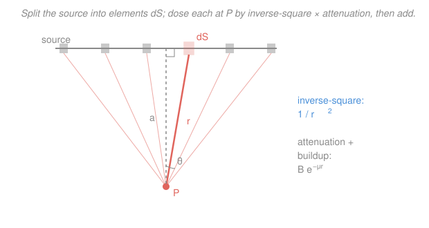

# Radiation Detection & Shielding · Lesson 4.3: Point-kernel method

> ⏱ ~15 min · Module 4: Shielding design & health physics · Builds on: [4.2 Buildup factors](04-02-buildup-factors.md), [3.3 Dose from a source](03-03-dose-from-a-source.md) · Unlocks: [4.4 Neutron moderation & shielding](04-04-neutron-moderation-shielding.md)

## Why this matters

Real sources are almost never neat points. A contaminated pipe is a *line*. A spill on the floor is a *disk*. A drum of waste is a *volume* that shields itself from the inside. You already know the dose from a single point ([3.3](03-03-dose-from-a-source.md)) and how attenuation and buildup shrink it ([4.1](04-01-exponential-attenuation-hvl.md), [4.2](04-02-buildup-factors.md)). The **point-kernel method** is the one move that turns those point-source tools into a dose estimate for *any* shape: chop the source into points, dose each one, and add. It is the workhorse hand-calculation that stands in for a full Monte-Carlo transport code.

## The idea

Dose obeys **superposition**: the dose rate at a point P from a collection of sources is just the sum of what each source delivers on its own. Radiation doesn't negotiate — two sources don't interfere, they add.

So take an extended source and imagine slicing it into tiny elements, each so small it *is* a point. You already know exactly what one point contributes at P: its strength, spread over a sphere ($1/r^2$), knocked down by attenuation ($e^{-\mu r}$), and nudged back up by scattered photons ($B$). Write that contribution down for a *generic* element, then **integrate** over the whole source. The geometry — how far each piece sits from P, how much shield each ray crosses — lives entirely inside that integral.

The payoff is that the shape of the source shows up as the shape of the answer. A **line source** integrates to an **arctangent** (it's all about the *angle* the line subtends at P). A **thick source** integrates against its own attenuation and reveals **self-absorption**: the far side is buried behind so much of its own material that it can't be seen from outside at all.

## The formal version

**The point kernel.** A source element of strength $dS$ (activity, in Bq, of that little piece) sitting a distance $r$ from the field point P contributes a dose rate

$$d\dot D = \frac{\Gamma\, dS}{4\pi r^2}\, B(\mu r)\, e^{-\mu r}.$$

In words: one point's dose at P is its strength spread over the sphere of radius $r$ (the $4\pi r^2$), cut down by the shield it shines through ($e^{-\mu r}$), and corrected upward for scattered photons that limp back in ($B$).

Symbols: $\Gamma$ is the dose-rate constant (dose rate per unit activity, converting photons to dose — the flux-to-dose factor of [3.3](03-03-dose-from-a-source.md), here written with the $4\pi$ solid angle shown explicitly); $\mu$ is the linear attenuation coefficient of whatever the ray crosses (source material and/or shield); $B(\mu r)\ge 1$ is the buildup factor from [4.2](04-02-buildup-factors.md). In vacuum $\mu=0$ and $B=1$, and a single element reproduces the inverse-square law $\dot D=\Gamma A/(4\pi r^2)$.

**The total dose is the integral over the source:**

$$\boxed{\ \dot D_P = \int_{\text{source}} \frac{\Gamma\, dS}{4\pi r^2}\, B(\mu r)\, e^{-\mu r}\ }$$

In words: add up every point's contribution. For a **line** source $dS = S_L\,dx$ (with $S_L$ = activity per unit length); for an **area** source $dS = S_A\,dA$; for a **volume** source $dS = S_V\,dV$. The whole job is setting up $r$ and the path length as functions of the integration variable, then integrating.

**Why not just use a point?** Because $1/r^2$ is not linear: spreading the same activity out over a length or a volume moves most of it *farther* from P than a single point at the center would be, so the true dose is generally **lower** than the point-at-center estimate — and for a self-shielding volume, dramatically lower. Point-kernel makes that geometry honest.

**Where Monte-Carlo comes in (out of scope).** A transport code like MCNP tracks millions of individual photon histories — every scatter, every angle — through arbitrary geometry. Point-kernel skips all that: it uses the *pre-tabulated* buildup factor to stand in for scatter and just does an analytic integral. It's fast, transparent, and conservative for routine shield sizing; you reach for Monte-Carlo only when geometry or streaming gets too complex for a kernel to capture.

## Picture

## Worked examples

**Example 1 — a line source (the arctan geometry).** A straight contaminated pipe of length $L$ has uniform activity per length $S_L$. Field point P sits a perpendicular distance $a$ from the pipe, opposite its **center**, in air (take $\mu \approx 0$, $B=1$ — unshielded). Find the dose rate and compare it to lumping the whole pipe into a point at its center.

Put the origin at the foot of the perpendicular; let $x$ run along the pipe. An element $dx$ at position $x$ is a distance $r=\sqrt{a^2+x^2}$ from P, so

$$\dot D = \int_{-L/2}^{L/2} \frac{\Gamma S_L\,dx}{4\pi (a^2+x^2)}.$$

Now the clean trick: measure each ray by the angle $\theta$ it makes with the perpendicular, so $x=a\tan\theta$, $dx=a\sec^2\theta\,d\theta$, and $a^2+x^2=a^2\sec^2\theta$. The messy fraction collapses:

$$\frac{dx}{a^2+x^2}=\frac{a\sec^2\theta\,d\theta}{a^2\sec^2\theta}=\frac{d\theta}{a}\quad\Longrightarrow\quad \dot D=\frac{\Gamma S_L}{4\pi a}\int_{-\alpha}^{\alpha} d\theta=\frac{\Gamma S_L}{4\pi a}\,\Theta,$$

where $\alpha=\arctan\dfrac{L/2}{a}$ and $\Theta=2\alpha$ is the **total angle the pipe subtends at P**. In words: a line source's dose depends only on the *angle* it fills at your eye, divided by the perpendicular distance.

Numbers: $L=4\,\text{m}$, $a=2\,\text{m}$. Then $\alpha=\arctan\frac{2}{2}=\arctan 1=\frac{\pi}{4}$, so $\Theta=\frac{\pi}{2}=1.571\,\text{rad}$ and

$$\dot D=\frac{\Gamma S_L}{4\pi(2)}(1.571)=0.0625\,\Gamma S_L.$$

Compare to putting all the activity $A=S_L L$ at the center, distance $a$: $\ \dot D_{\text{pt}}=\dfrac{\Gamma S_L L}{4\pi a^2}=\dfrac{\Gamma S_L (4)}{4\pi(4)}=0.0796\,\Gamma S_L.$ The ratio is

$$\frac{\dot D_{\text{line}}}{\dot D_{\text{pt}}}=\frac{\arctan u}{u}\quad\text{with }u=\frac{L}{2a}=1\ \Rightarrow\ \frac{\pi/4}{1}=0.785.$$

The real pipe gives **21% less** dose than the point-at-center guess, because most of it is farther than $a$. As $u\to0$ (short pipe or far P), $\arctan u/u\to1$ and the point approximation becomes exact — a distant line *is* a point.

*Shielded version (Sievert integral).* Slip a shield of thickness $t$ between pipe and P. The ray at angle $\theta$ crosses a slanted path $t\sec\theta$, so $e^{-\mu t\sec\theta}$ rides inside the integral:

$$\dot D=\frac{\Gamma S_L}{4\pi a}\int_{-\alpha}^{\alpha} e^{-\mu t\sec\theta}\,d\theta.$$

That integral is the **Sievert integral** — no elementary antiderivative, so it's read from tables or done numerically. The unshielded arctan is its $\mu t=0$ special case.

**Example 2 — self-absorption in a thick source.** A slab of radioactive material, thickness $T$, has uniform activity per volume $S_V$ and attenuates its *own* photons with coefficient $\mu$ (self-absorption). Does the dose leaving the front face keep growing as you make the slab thicker?

Track the photons headed straight out the front face. A thin layer at depth $y$ (measured in from the face) emits $S_V\,dy$ per unit area, but those photons must climb back through $y$ of the slab's own material, surviving by $e^{-\mu y}$. Summing the layers:

$$\phi_{\text{out}}=\int_0^{T} S_V\, e^{-\mu y}\,dy=\frac{S_V}{\mu}\Big(1-e^{-\mu T}\Big).$$

(This normal-ray version is the honest skeleton; a full slab folds in oblique rays via an exponential-integral $E_2(\mu T)$, but the conclusion is identical.) In words: the emergent output is capped at $S_V/\mu$ no matter how thick the slab gets.

Watch what thickness buys you. With $\mu=0.5\ \text{cm}^{-1}$ (mean free path $1/\mu=2\ \text{cm}$), the fraction of the saturated output $1-e^{-\mu T}$ is:

| $T$ (cm) | $\mu T$ | $1-e^{-\mu T}$ |
|---|---|---|
| 1 | 0.5 | 0.393 |
| 2 | 1.0 | 0.632 |
| 4 | 2.0 | 0.865 |
| 8 | 4.0 | 0.982 |

Going from $T=2$ to $T=8\,\text{cm}$ is **four times** the material and activity, but the surface dose rises only $0.632\to0.982$ — a factor of **1.6**, not 4. Everything past a few mean free paths is buried behind its own shielding and never reaches the face. In words: a thick source shields itself, so its surface dose **saturates** instead of growing with thickness. (Without self-absorption, $\mu\to0$ gives $\phi_{\text{out}}\to S_V T$ — a straight line climbing forever. Self-absorption is exactly what bends it into a ceiling.)

## Watch out

- **You might think a bigger source always means proportionally more dose.** For a self-shielding volume it doesn't — the surface dose saturates at $S_V/\mu$. Doubling a thick drum's contents barely moves the dose at its skin, because the added material hides behind the old.
- **You might reach for the point-source formula on a nearby extended source.** Point-at-center *overestimates* a line or area source (by the factor $u/\arctan u > 1$ for a line). It's only safe when the source is small compared to the distance — then $\arctan u/u\to1$. Up close, integrate.
- **You might drop buildup inside the kernel.** For a shielded source the scattered photons are already accounted for by $B(\mu r)\ge1$ from [4.2](04-02-buildup-factors.md); leaving it out under-predicts the dose. The kernel carries *both* $e^{-\mu r}$ (down) and $B$ (up) — you need the pair.

## One-liner

> Slice the source into points, dose each with $\dfrac{\Gamma\,dS}{4\pi r^2}Be^{-\mu r}$, and integrate: a line becomes an arctangent, a thick source shields itself, and a distant blob becomes a point again.

## Problems

**P1 (🟢)** A straight pipe carries uniform contamination over length $L=6\,\text{m}$. A worker stands a perpendicular distance $a=1.5\,\text{m}$ from the pipe, opposite its center, in air (no shield). (a) What total angle $\Theta$ does the pipe subtend at the worker? (b) By what factor does the true line-source dose differ from treating all the activity as a point at the pipe's center?

**P2 (🟡)** A slab source self-absorbs with $\mu=0.20\ \text{cm}^{-1}$. Its surface dose saturates at the infinitely-thick value. (a) What thickness $T$ delivers 90% of that saturated surface dose? (b) If you then *double* that thickness, what fraction of saturation do you reach — i.e., how much does the extra material buy you?

**P3 (🔴, optional)** A circular spill of radius $R$ has uniform activity per area $S_A$. Find the unshielded dose rate on the axis, a height $h$ above the center. (Integrate the kernel over rings; in air take $\mu\approx0$, $B=1$.) Then show that for $h\gg R$ your result collapses to the point-source law with the spill's total activity — the inverse-square law re-emerging from the integral.

Solutions

**P1.** (a) The pipe reaches an angle $\alpha=\arctan\dfrac{L/2}{a}=\arctan\dfrac{3}{1.5}=\arctan 2=1.107\,\text{rad}$ on each side of the perpendicular, so the total subtended angle is

$$\Theta=2\alpha=2(1.107)=2.214\,\text{rad}\ (\approx 127^\circ).$$

(b) The line-to-point ratio is $\dfrac{\arctan u}{u}$ with $u=\dfrac{L}{2a}=\dfrac{6}{3}=2$:

$$\frac{\dot D_{\text{line}}}{\dot D_{\text{pt}}}=\frac{\arctan 2}{2}=\frac{1.107}{2}=0.554.$$

The real pipe delivers about **55%** of the point-at-center estimate — the point model overestimates by nearly a factor of two here, because the worker is close ($a<L$) and most of the pipe is well beyond $1.5\,\text{m}$. *Check:* $u=2$ is not small, so a big discrepancy is expected; if the worker backed off to $a\gg L$, $u\to0$ and the ratio would climb toward 1. ✓

**P2.** The emergent fraction of saturation is $f(T)=1-e^{-\mu T}$.

(a) Set $f=0.90$: $\ e^{-\mu T}=0.10\ \Rightarrow\ \mu T=\ln 10=2.303\ \Rightarrow\ T=\dfrac{2.303}{0.20}=11.5\ \text{cm}.$

(b) Doubling to $T=23.0\,\text{cm}$ gives $\mu T=4.605$, so

$$f=1-e^{-4.605}=1-0.010=0.990.$$

You go from 90% to 99% of saturation — the second 11.5 cm of material (another full slab's worth of activity) buys only **10% more dose**. *Check:* consistent with saturation — beyond a couple of mean free paths ($1/\mu=5\,\text{cm}$ here) the source hides behind itself. ✓

**P3.** Slice the disk into rings. A ring at radius $\rho$, width $d\rho$, has area $dA=2\pi\rho\,d\rho$, hence element strength $dS=S_A\,2\pi\rho\,d\rho$, and every point on it sits a distance $r=\sqrt{h^2+\rho^2}$ from the axial field point. The kernel (with $\mu\approx0$, $B=1$):

$$\dot D=\int_0^{R}\frac{\Gamma\,(S_A\,2\pi\rho\,d\rho)}{4\pi(h^2+\rho^2)}=\frac{\Gamma S_A}{2}\int_0^R\frac{\rho\,d\rho}{h^2+\rho^2}.$$

Let $w=h^2+\rho^2$, $dw=2\rho\,d\rho$:

$$\dot D=\frac{\Gamma S_A}{2}\cdot\frac12\Big[\ln(h^2+\rho^2)\Big]_0^R=\frac{\Gamma S_A}{4}\ln\!\frac{h^2+R^2}{h^2}=\frac{\Gamma S_A}{4}\ln\!\Big(1+\frac{R^2}{h^2}\Big).$$

Large-$h$ limit: for $h\gg R$, $\dfrac{R^2}{h^2}$ is tiny and $\ln(1+\varepsilon)\approx\varepsilon$, so

$$\dot D\approx\frac{\Gamma S_A}{4}\cdot\frac{R^2}{h^2}=\frac{\Gamma\,(S_A\pi R^2)}{4\pi h^2}=\frac{\Gamma A_{\text{tot}}}{4\pi h^2},$$

with $A_{\text{tot}}=S_A\pi R^2$ the whole spill's activity — exactly the point-source inverse-square law of [3.3](03-03-dose-from-a-source.md). *Check:* at $h=R$ the exact result is $\frac{\Gamma S_A}{4}\ln 2=0.693\cdot\frac{\Gamma S_A}{4}$, i.e. 69% of the point-at-center value $\frac{\Gamma S_A}{4}$ — same lesson as the line, an extended source up close reads *lower* than its point stand-in. ✓

## Flashback

**From Lesson 4.1 (Exponential attenuation & HVL):** A narrow beam of 1 MeV gammas passes through concrete with linear attenuation coefficient $\mu=0.15\ \text{cm}^{-1}$. (a) Find the half-value layer. (b) What concrete thickness cuts the beam to 1% of the incident intensity (narrow beam — ignore buildup)?

Solution

(a) $\text{HVL}=\dfrac{\ln 2}{\mu}=\dfrac{0.693}{0.15}=4.62\ \text{cm}.$

(b) Narrow-beam attenuation is $I/I_0=e^{-\mu x}$. Set it to $0.01$:

$$e^{-\mu x}=0.01\ \Rightarrow\ \mu x=\ln 100=4.605\ \Rightarrow\ x=\frac{4.605}{0.15}=30.7\ \text{cm}.$$

*Check:* 1% is two tenth-value layers, and $\text{TVL}=\ln 10/\mu=2.303/0.15=15.35\,\text{cm}$, so $2\times15.35=30.7\,\text{cm}$ ✓. (Broad-beam, this would need to be thicker — buildup, [4.2](04-02-buildup-factors.md), makes real shields fatter.)

## Connections

- **Backward:** the kernel is just [3.3](03-03-dose-from-a-source.md)'s point-source dose ($\Gamma A/4\pi r^2$) carrying [4.1](04-01-exponential-attenuation-hvl.md)'s $e^{-\mu r}$ and [4.2](04-02-buildup-factors.md)'s $B$ — this lesson only adds the integral that sums many of them.
- **Forward:** [4.4 Neutron moderation & shielding](04-04-neutron-moderation-shielding.md) faces the same distributed-source bookkeeping for neutrons, where self-absorption becomes self-*moderation* and captured neutrons breed secondary gammas you then point-kernel back out. The self-absorption ceiling also governs how a thick fuel or waste form limits its own surface dose, a theme in the [nuclear-materials](../../nuclear-materials/syllabus.md) and fuel-cycle tracks.
- **Sideways (calculus + reactor physics):** the "chop-into-elements-and-integrate" move is superposition — the same Green's-function idea that builds a reactor's flux from distributed fission sources in [reactor-physics](../../reactor-physics/syllabus.md), and the arctan/secant integrals here are the geometry cousins of the improper integrals you sized up in [calc-refresher](../../calc-refresher/syllabus.md).
