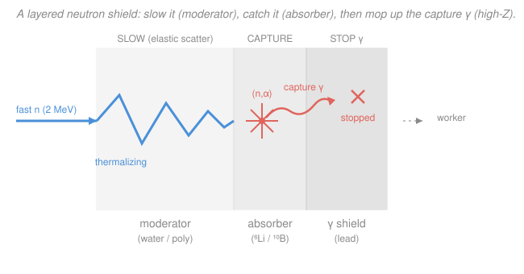

# Radiation Detection & Shielding · Lesson 4.4: Neutron moderation & shielding

> ⏱ ~15 min · Module 4: Shielding design & health physics · Builds on: [1.4 Neutron interactions](01-04-neutron-interactions.md), [4.1 Exponential attenuation & HVL](04-01-exponential-attenuation-hvl.md), [`intro-nuclear-engineering` 2.4 (moderation)](../../intro-nuclear-engineering/lessons/02-04-moderation-slowing-neutrons.md) · Unlocks: [4.5 Health physics, ALARA & limits](04-05-health-physics-alara-limits.md), reactor & materials shielding

## Why this matters

Every photon shield you've built so far leans on one idea: pack in enough dense, high-$Z$ material and the beam attenuates exponentially. Neutrons laugh at that. A neutron is **uncharged** — it feels no electric field, ionizes nothing, and slips through a slab of lead almost as if it weren't there. You cannot stop a neutron by making the wall heavier; you have to *play billiards with it and then set a trap*. This lesson is how a neutron shield actually works — slow the neutron down, capture it, and then clean up the gamma that the capture itself produces — and it's the reason a neutron shield is a **sandwich of materials**, each doing a different job.

## The idea

Think of a fast neutron as a marble fired into a room. You can't grab it in flight, but you *can* fill the room with obstacles its own size so it loses speed on every bounce, and then line the far wall with glue so that once it's crawling, it sticks. Two completely separate steps, needing two completely different materials:

1. **Moderate** — slow the fast neutron to thermal energy by elastic scattering off *light* nuclei. From [`intro-nuclear` 2.4](../../intro-nuclear-engineering/lessons/02-04-moderation-slowing-neutrons.md): the lighter the target, the more energy lost per hit, so **hydrogen** is king. That's why neutron moderators are *hydrogenous* — water, polyethylene, concrete — not lead. Density is irrelevant; hydrogen content is everything.
2. **Capture** — once the neutron is thermal (about 0.025 eV), it moves slowly enough that a nucleus with a huge *thermal* absorption cross-section can swallow it. The classic traps are $^{10}\text{B}$, $^6\text{Li}$, and cadmium.

And then the sting in the tail: many captures spit out a **gamma ray**. Hydrogen capturing a neutron emits a 2.2 MeV photon; that gamma now has to be shielded like any other, which is a *third* material (high-$Z$, back to lead). A neutron shield that ignores its own secondary gammas isn't a shield — it's a gamma *source* wearing a disguise.

## The formal version

**Step 1 — moderation (recap the machine).** A neutron of energy $E$ scattering elastically off a nucleus of mass number $A$ loses, on average, a fixed slice of *log*-energy per collision:

$$\xi \;\equiv\; \overline{\ln\frac{E}{E'}} \;=\; 1 + \frac{\alpha\ln\alpha}{1-\alpha}, \qquad \alpha=\left(\frac{A-1}{A+1}\right)^2 .$$

*In words: each collision multiplies the neutron's energy down by the same factor $e^{-\xi}$, and light nuclei (big $\xi$) drain the most.* Hydrogen has $\xi=1$, the largest possible. The number of collisions to fall from birth energy $E_0$ to thermal $E_{th}$ is

$$\bar n = \frac{\ln(E_0/E_{th})}{\xi}.$$

*In words: total log-energy drop divided by the drop per collision.* This is the moderator's whole job.

**Step 2 — capture.** A thermal neutron is absorbed by a nuclide with a large thermal $\sigma_a$. The workhorse reactions:

$$\ce{^{10}B + ^{1}n -> ^{7}Li + ^{4}He} \qquad (\sigma_a \approx 3840\ \text{barn}),$$

$$\ce{^{6}Li + ^{1}n -> ^{3}H + ^{4}He} \qquad (\sigma_a \approx 940\ \text{barn}).$$

*In words: boron-10 and lithium-6 each split a captured neutron into a charged alpha (and a $^7$Li or a triton), which stop dead within microns — no penetrating particle escapes the absorber.* These are $(n,\alpha)$ reactions written $^{10}\text{B}(n,\alpha)^{7}\text{Li}$ and $^{6}\text{Li}(n,\alpha)^{3}\text{H}$. Their cross-sections are enormous because both obey the $1/v$ law ([1.4](01-04-neutron-interactions.md)): the slower the neutron, the fatter the target — which is exactly why you *must* moderate first. Fire a fast neutron straight at boron and it mostly sails through.

**The secondary-gamma penalty.** The alternative capture channel, radiative capture $(n,\gamma)$, releases the binding energy as a photon instead of a charged particle. The unavoidable one happens in the moderator itself:

$$\ce{^{1}H + ^{1}n -> ^{2}H + \gamma}, \qquad E_\gamma = 2.2\ \text{MeV}.$$

*In words: the very hydrogen you used to slow the neutron sometimes eats it and emits a hard 2.2 MeV gamma — a new penetrating photon born inside your shield.* This is why the two absorbers are not interchangeable:

- $^{10}\text{B}(n,\alpha)^{7}\text{Li}$ leaves $^7$Li in an excited state 94% of the time, which de-excites with a **soft 478 keV** gamma — easy to stop.
- $^{6}\text{Li}(n,\alpha)^{3}\text{H}$ emits **essentially no gamma** — the energy leaves as charged-particle kinetic energy.
- Cadmium is a gluttonous absorber ($\sigma_a \approx 2450$ barn) but its $(n,\gamma)$ capture unleashes a cascade of gammas up to ~9 MeV — the *worst* secondary-gamma offender.

So the design rule: use $^6\text{Li}$ where a clean, gamma-free capture matters (or accept boron's mild 478 keV line and back it with a little lead). Everything gets wrapped in a **high-$Z$ outer layer** to attenuate both the source's own gammas and the 2.2 MeV / 478 keV capture gammas, using ordinary $I=I_0e^{-\mu x}$ attenuation from [4.1](04-01-exponential-attenuation-hvl.md).

## Picture

Three layers, three jobs: the moderator slows (blue path losing energy on each bounce), the absorber captures (coral burst), the high-$Z$ backing stops the capture gamma (coral wave, absorbed). Miss any one and the shield leaks.

## Worked examples

**Example 1 (moderate-then-capture — how thick a moderator?).** A 2 MeV fast neutron must be thermalized in a hydrogenous shield. (a) How many collisions on hydrogen does that take? (b) Why does the *hydrogen content* set the thickness — and does water or polyethylene do it in less material?

(a) With $\xi=1$ for hydrogen and thermal energy $E_{th}=0.025$ eV,

$$\bar n = \frac{\ln(E_0/E_{th})}{\xi} = \frac{\ln\!\big(2\times10^{6}/0.025\big)}{1} = \ln(8\times10^{7}) \approx 18.2 \approx 18\ \text{collisions.}$$

(Real water needs a few more — its oxygen ($\xi_{\text{O}}\approx0.12$) dilutes the hydrogen, pushing the effective count to about 20 — but hydrogen carries the load.)

(b) Those ~18–20 collisions have to physically *fit* inside the slab. The average distance between scatters is the scattering mean free path $\lambda_s = 1/\Sigma_s = 1/(N_{\text{H}}\sigma_s)$, so the moderator thickness scales as $\bar n\,\lambda_s \propto 1/N_{\text{H}}$: **more hydrogen atoms per cm³ means shorter hops, hence a thinner shield.** Compare the hydrogen number densities ($N = \rho N_A\,(\text{H per molecule})/M$):

$$N_{\text{H}}^{\text{water}} = \frac{(1.00)(6.022\times10^{23})}{18.0}\times 2 \approx 6.7\times10^{22}\ \text{cm}^{-3},$$

$$N_{\text{H}}^{\text{poly}} = \frac{(0.94)(6.022\times10^{23})}{14.03}\times 2 \approx 8.1\times10^{22}\ \text{cm}^{-3}.$$

Polyethylene $\ce{(CH2)}_n$ packs about $8.1/6.7 \approx 1.2\times$ more hydrogen per cm³ than water, so it thermalizes in roughly **20% less thickness** — which is why solid neutron shields and detector collars are so often polyethylene (and why you *load boron into it*, giving borated poly, to do steps 1 and 2 in one block).

**Example 2 (shield design — name the layers, then pick the absorber).** A source emits fast neutrons *and* gammas. Outline a working shield and justify choosing $^6\text{Li}$ over $^{10}\text{B}$ for the capture layer.

A three-layer (source $\to$ worker) sandwich:

| Layer | Material | Job |
|---|---|---|
| 1 · Moderator | polyethylene or water (hydrogenous) | elastic-scatter the fast neutrons down to thermal ($\xi\approx1$, Ex. 1) |
| 2 · Absorber | $^6\text{Li}$- or $^{10}\text{B}$-loaded layer | capture the now-thermal neutrons via $(n,\alpha)$ before they leak through |
| 3 · Gamma shield | lead (high $Z$) | attenuate the source gammas **and** the capture gammas born in layers 1–2 |

Why the absorber goes *behind* the moderator: thermal capture cross-sections are huge only at low energy ($1/v$), so the boron/lithium is wasted on fast neutrons — you thermalize first, then trap.

Now the $^6\text{Li}$-vs-$^{10}\text{B}$ call, decided entirely by the **secondary-gamma penalty**. Boron's capture, $^{10}\text{B}(n,\alpha)^{7}\text{Li}$, emits a 478 keV gamma 94% of the time; lithium's, $^{6}\text{Li}(n,\alpha)^{3}\text{H}$, emits none — its energy leaves as a charged alpha and triton that stop within microns. If layer 3 is thin, or the whole point is to *minimize* the photon field a detector sees (e.g. a neutron collimator next to a gamma spectrometer), $^6\text{Li}$ wins: it captures without adding a photon to shield. Boron is cheaper, denser in absorber, and its 478 keV line is soft enough to kill with a modest lead thickness, so **boron + lead** is the common industrial combination; $^6\text{Li}$ is chosen precisely when you cannot afford the extra gamma. (Cadmium, despite its giant cross-section, is disqualified here by its ~9 MeV capture cascade — it would need *more* lead than it saves.)

## Watch out

- **You might think a thick lead wall stops neutrons because it stops gammas.** It barely does. Lead is $A=207$ ($\xi \approx 0.01$) — a fast neutron bounces off it losing almost nothing and keeps going, and lead's thermal capture cross-section is tiny. Density stops *photons*; **light nuclei** stop neutrons. A pure-lead "neutron shield" is a fast-neutron sieve.
- **You might think capturing the neutron ends the story.** Radiative capture $(n,\gamma)$ hands you a new, penetrating photon — hydrogen's 2.2 MeV gamma is born *inside* your moderator. That's why the shield needs a gamma layer it wouldn't otherwise; the neutrons you "stopped" become photons you now have to.
- **You might put the boron out front to catch neutrons early.** Backwards: thermal absorbers obey $1/v$, so they're nearly transparent to fast neutrons. Absorb *after* moderating, never before — order matters.

## One-liner

> You can't stop a neutron with mass — you slow it on light nuclei, trap the thermal neutron in a $(n,\alpha)$ absorber, and then shield the capture gamma the trap gives back.

## Problems

**P1 (🟢)** A neutron shield uses graphite ($A=12$, $\xi=0.158$) as its moderator instead of a hydrogenous material. How many collisions does it take to thermalize a 2 MeV neutron to 0.025 eV, and what does the answer tell you about how thick a graphite neutron shield must be compared with polyethylene?

**P2 (🟡)** You are designing a thermal-neutron capture layer for a detector shield and must minimize any secondary photons that would spoil the gamma spectrum. You have $^{10}\text{B}$ and $^{6}\text{Li}$ available. (a) Write each capture reaction and state the secondary gamma it produces. (b) Which do you choose, and why? (c) If you had to use boron for cost reasons, what single additional layer fixes the problem, and roughly how would you size it?

**P3 (🔴, optional)** A borated-polyethylene block thermalizes fast neutrons and captures them on $^{10}$B, whose $^7$Li product emits a 478 keV gamma. Downstream you also worry about the 2.2 MeV hydrogen-capture gamma. Given a lead HVL of 4.2 mm at 478 keV and 12 mm at 2.2 MeV, which capture gamma dominates the *lead* thickness you need, and by roughly what factor is the high-energy line harder to stop for the same attenuation? (Connect this to [4.1](04-01-exponential-attenuation-hvl.md).)

Solutions

**P1** Same total log-energy drop as Example 1, $\ln(2\times10^6/0.025)=\ln(8\times10^7)\approx18.2$, now divided by graphite's much smaller $\xi$:

$$\bar n = \frac{18.2}{0.158}\approx 115\ \text{collisions.}$$

That's about $115/18 \approx 6\times$ more collisions than hydrogen. Combined with graphite's lower atom density and moderate scattering cross-section, a graphite neutron shield must be **far bulkier** than a hydrogenous one — the neutron needs room to make six times as many bounces. This is the same reason graphite reactors are physically huge, and why compact shields are hydrogenous. ✓

**P2** (a) The two reactions:

$$\ce{^{10}B + ^{1}n -> ^{7}Li + ^{4}He} \ \Rightarrow\ \text{478 keV } \gamma\ (94\%\text{ of captures});$$
$$\ce{^{6}Li + ^{1}n -> ^{3}H + ^{4}He} \ \Rightarrow\ \text{no gamma (energy is all charged-particle KE).}$$

(b) Choose **$^6\text{Li}$.** It captures the thermal neutron with the same $(n,\alpha)$ mechanism but emits no penetrating photon, so it adds nothing to the spectrum you're trying to keep clean. Boron would inject a 478 keV line into every measurement.

(c) If forced to use boron, add a **thin lead backing** behind the absorber to attenuate the 478 keV line. Size it with $I=I_0e^{-\mu x}$ / HVLs from [4.1](04-01-exponential-attenuation-hvl.md): e.g. cutting it to 10% needs $\log_2 10\approx 3.3$ HVLs. Because 478 keV is soft, a few mm of lead per HVL suffices — cheap insurance. ✓

**P3** Convert each required attenuation to a number of HVLs; thickness $=(\#\text{HVLs})\times\text{HVL}$. For the *same* attenuation factor the number of HVLs is identical, so the thickness ratio is just the ratio of HVLs:

$$\frac{\text{HVL}_{2.2\,\text{MeV}}}{\text{HVL}_{478\,\text{keV}}} = \frac{12\ \text{mm}}{4.2\ \text{mm}} \approx 2.9.$$

The **2.2 MeV hydrogen-capture gamma dominates** the lead requirement — it's roughly $2.9\times$ harder to stop per unit attenuation than boron's 478 keV line (higher-energy photons have smaller $\mu$, so a fatter HVL). Concretely, a factor-100 cut is $\log_2 100 = 6.6$ HVLs: about $6.6\times4.2\approx 28$ mm of lead for the 478 keV line but $6.6\times12\approx 79$ mm for the 2.2 MeV line. Lesson: the hydrogen capture gamma, not the absorber's own line, sets how much lead the neutron shield secretly costs — a hidden tax for using a hydrogenous moderator. ✓

## Flashback

**From Lesson 4.1 (Exponential attenuation & HVL):** The 478 keV capture gamma leaking out of a boron layer must be cut to 10% of its intensity by a lead backing whose half-value layer at this energy is 4.2 mm. How many HVLs is that, and how thick must the lead be? (Fresh variant — a tenth, not a half.)

Solution

Cutting to a fraction $f$ takes $n$ HVLs where $(1/2)^n = f$, so $n=\log_2(1/f)$. For $f=0.10$:

$$n = \log_2 10 = \frac{\ln 10}{\ln 2} = \frac{2.303}{0.693} \approx 3.32\ \text{HVLs}.$$

Thickness:

$$x = n\times\text{HVL} = 3.32\times 4.2\ \text{mm} \approx 13.9\ \text{mm} \approx 1.4\ \text{cm of lead.}$$

*Check.* Three HVLs would cut to $(1/2)^3=1/8=12.5\%$ and four to $6.25\%$; 10% sits between, so $n$ between 3 and 4 — consistent. Equivalently via $\mu=\ln2/\text{HVL}=0.693/4.2=0.165\ \text{mm}^{-1}$ and $x=\ln(10)/\mu=2.303/0.165\approx13.9$ mm. ✓ A modest slab of lead handles boron's soft capture gamma — which is exactly why boron + a little lead is a viable alternative to $^6$Li. ✓

## Connections

- **Backward:** the moderation half is [`intro-nuclear` 2.4](../../intro-nuclear-engineering/lessons/02-04-moderation-slowing-neutrons.md)'s $\xi$ and collision-count machinery reused for defense instead of reactor design; the capture half is the $(n,\gamma)$ / $(n,\alpha)$ and $1/v$ physics from [1.4](01-04-neutron-interactions.md); and the outer gamma layer is pure [4.1](04-01-exponential-attenuation-hvl.md) attenuation. This lesson stitches all three into one wall.
- **Forward:** [4.5 Health physics, ALARA & limits](04-05-health-physics-alara-limits.md) folds the neutron dose (with its large radiation weighting factor $w_R$) into the shielding-time-distance budget — a neutron field is far more biologically costly per unit fluence than the same energy in photons, so the shield you just designed is doing outsized work.
- **Sideways:** the exact same moderate-then-capture logic sizes the biological shield of a reactor and the blanket of a fusion device — pressing on into reactor operations and materials shielding ([`nuclear-materials`](../../nuclear-materials/syllabus.md), [`reactor-physics`](../../reactor-physics/syllabus.md)), where the secondary-gamma and activation problems this lesson previews become a central design driver.
