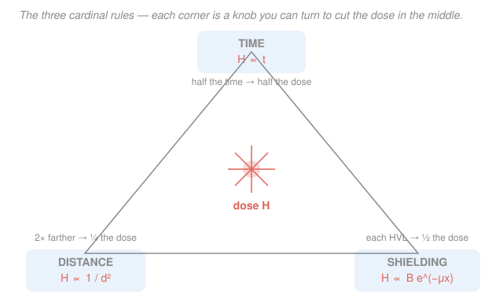

# Radiation Detection & Shielding · Lesson 4.5: Health physics, ALARA & limits

> ⏱ ~15 min · Module 4: Shielding design & health physics · Builds on: [4.4 Neutron moderation & shielding](04-04-neutron-moderation-shielding.md), [3.3 Dose from a source](03-03-dose-from-a-source.md), [3.4 Biological effects & risk](03-04-biological-effects-risk.md) · Unlocks: [reactor-physics](../../reactor-physics/syllabus.md) operations, [nuclear-fuel-cycle](../../nuclear-fuel-cycle/syllabus.md), medical physics

## Why this matters

Every earlier lesson gave you a piece of a number: how a source deposits dose (Module 3), how a shield attenuates it (4.1–4.4). This lesson is where you spend that number wisely. A real job comes with a **dose budget** — "you may take at most *this much* to do this task" — and three knobs to hit it: do the job *faster*, do it *farther away*, or put *matter in the way*. Health physics is the discipline of turning those three knobs until the estimate fits under the budget, and then, because there's no proven safe threshold, turning them a little further. Get this right and you've closed the loop from "radiation exists" to "I can defend exactly how much a worker will receive, and why it's acceptable."

## The idea

There are only three ways to lower an external dose, and you already know all the physics behind them — this lesson just names them and puts them in one equation.

- **Time.** Dose piles up while you're exposed. Halve the minutes, halve the dose. Boring, linear, and often the easiest thing to control by *practicing on a mock-up first* so the real job is quick.
- **Distance.** A point source spreads its rays over a sphere, so intensity falls as $1/d^2$ (this is [3.3](03-03-dose-from-a-source.md)'s inverse-square law). Doubling your distance doesn't halve the rate — it **quarters** it. That makes distance the cheapest big win: a longer pair of tongs weighs almost nothing, but buys you the same protection as a slab of lead.
- **Shielding.** Put mass between you and the source and the beam attenuates exponentially, $e^{-\mu x}$, bumped up by the buildup factor $B$ from scattered photons ([4.2](04-02-buildup-factors.md)). Powerful, but heavy and expensive — the knob of last resort when you can't back away or speed up.

The mental model: you're spending from a budget. Estimate the dose the naive way, see how far over you are, then apply whichever combination of the three levers is cheapest and most practical to get under. Because two of the levers (distance ÷4, each shield layer ÷2) *multiply*, a modest move on each beats a heroic move on one.

And the reason you don't just stop at the legal limit: the prevailing **linear-no-threshold (LNT)** model ([3.4](03-04-biological-effects-risk.md)) assumes risk is proportional to dose all the way down to zero — no safe floor. So the limit is a *ceiling you must never touch*, not a *target you're allowed to reach*. That's the whole logic of **ALARA**.

## The formal version

**The three levers, in one equation.** Combine the reference dose rate $\dot H_0$ (measured at reference distance $d_0$, in mSv/h) with all three knobs. The dose $H$ (mSv) accumulated by a worker at distance $d$, for time $t$ (h), behind shield thickness $x$ is

$$H \;=\; \dot H_0 \left(\frac{d_0}{d}\right)^{2} \, t \; B\,e^{-\mu x},$$

where $\mu$ (mm$^{-1}$) is the linear attenuation coefficient of the shield, $x$ (mm) its thickness, and $B\ge 1$ the buildup factor. *In words: your dose is the reference rate, scaled down by backing away (inverse-square), by spending less time (linear), and by shielding (exponential, nudged back up by scattered photons).* Each factor is an independent knob — this single formula is the synthesis of Modules 3 and 4.

**The half-value layer as a "factor-of-2" currency.** From [4.1](04-01-exponential-attenuation-hvl.md), the half-value layer is $\text{HVL} = \ln 2/\mu$, and $n$ HVLs cut the rate by $2^{n}$:

$$e^{-\mu x} = 2^{-x/\text{HVL}} \qquad\Longleftrightarrow\qquad n = \frac{x}{\text{HVL}} = \log_2\!\left(\frac{1}{\text{attenuation factor}}\right).$$

*In words: count reductions in "doublings." A factor-of-8 cut is 3 HVLs; a factor-of-4 cut is 2 HVLs.* This makes the levers comparable: **doubling the distance is worth exactly 2 HVLs of shielding** (both give ÷4), and it's usually far cheaper.

**Regulatory dose limits (ICRP-style).** For *effective dose* $E$ (Module 3.2), the International Commission on Radiological Protection recommends

$$E_{\text{occupational}} \le 20\ \text{mSv/yr} \ (\text{averaged over 5 yr, } \le 50\ \text{mSv in any single year}), \qquad E_{\text{public}} \le 1\ \text{mSv/yr}.$$

*In words: a radiation worker may average 20 mSv per year; a member of the public, 1 mSv per year above natural background.* Numbers vary by jurisdiction — the US NRC, for instance, sets the occupational limit at 50 mSv/yr (5 rem) — so **always cite your local regulator**; use the ICRP values as the reference.

**ALARA.** As Low As Reasonably Achievable: keep every dose *below* its limit and then reduce it further as far as is reasonable, weighing the cost and effort of protection against the dose (and hence risk) it averts.

$$\text{minimize dose subject to } (\text{cost of protection}) \lesssim (\text{value of dose averted}).$$

*In words: don't stop at the limit — optimize below it, spending on time/distance/shielding up to the point where the next increment of protection costs more than the harm it prevents.* Under LNT there's no threshold, so there's always *some* benefit to going lower; ALARA is what stops you spending infinitely to chase zero.

## Picture

## Worked examples

**Example 1 (fit the budget — combine all three levers).** A worker must free a stuck source. At the hands-on working distance $d_0 = 0.5$ m the dose rate is $\dot H_0 = 2.0$ mSv/h, and the job is estimated at $t = 1.5$ h. The ALARA sub-budget set for this task is $H_{\text{budget}} = 0.30$ mSv (comfortably under the ~0.4 mSv a 20 mSv/yr limit allows per week).

*Naive estimate — no protection:*
$$H = 2.0\ \tfrac{\text{mSv}}{\text{h}} \times 1.5\ \text{h} = 3.0\ \text{mSv},$$
which is $3.0/0.30 = 10\times$ over budget. You need a **factor of 10** reduction. Reach for shielding alone and that's $\log_2 10 \approx 3.3$, round up to **4 HVLs** of lead ($\approx 48$ mm, a heavy slab). Do better by turning every knob:

- **Distance.** Use 1-m tongs instead of reaching in at 0.5 m: $d$ doubles, so $(d_0/d)^2 = (0.5/1.0)^2 = \tfrac14$. Rate drops to $0.5$ mSv/h; dose so far $0.75$ mSv. *(That one move bought 2 HVLs for free.)*
- **Time.** Rehearse the sequence on a cold mock-up so the live job takes $0.75$ h instead of $1.5$ h — a factor $\tfrac12$. Dose $\to 0.375$ mSv. Still a hair over.
- **Shielding.** Drop in **one** HVL of lead ($\approx 12$ mm), a factor $\tfrac12$. Dose $\to 0.19$ mSv.

$$H = \underbrace{3.0}_{\text{naive}} \times \underbrace{\tfrac14}_{\text{distance}} \times \underbrace{\tfrac12}_{\text{time}} \times \underbrace{\tfrac12}_{\text{1 HVL}} = 0.1875 \approx 0.19\ \text{mSv} \ \checkmark \ (<0.30).$$

Same factor-of-16 reduction as before, but the actual lead needed fell from 4 HVLs to **1** — distance and time supplied the other three "doublings" at almost no weight or cost. That's the boss move: *a longer tool is 2 HVLs of lead you never had to carry.*

**Example 2 (ALARA optimization — two ways to hit the same limit).** A monitoring station reads $\dot H_0 = 0.80$ mSv/h at $d_0 = 1$ m from a Co-60-like line, and you must bring the working-point rate to $\le 0.10$ mSv/h — a **factor of 8**. Two clean options (take lead HVL $\approx 12$ mm here):

- **Option A — shield.** Factor 8 $= 2^3$, so **3 HVLs** $= 36$ mm of lead. For a 40 cm × 40 cm wall that's $0.40\times0.40\times0.036\ \text{m}^3 \times 11{,}340\ \text{kg/m}^3 \approx 65$ kg of lead to fabricate, mount, and support. Achieved rate: $0.80/8 = 0.10$ mSv/h.
- **Option B — distance.** Solve $0.80\,(1/d)^2 = 0.10 \Rightarrow d^2 = 8 \Rightarrow d = 2.83$ m. Stand back (or use a remote manipulator) $2.83$ m. No material at all. Achieved rate: $0.10$ mSv/h.

Both meet the limit and deliver the **same** dose — for a 30-min task, $0.10\ \tfrac{\text{mSv}}{\text{h}}\times 0.5\ \text{h} = 0.05$ mSv either way. So the choice isn't about dose; it's **ALARA on cost and practicality**: if 2.8 m of floor space and remote handling are available, distance wins outright (free, zero weight, and it also shields you from *any* other nearby source). If the task is unavoidably hands-on, the 65 kg of lead is the price of admission. In practice you'd **split the difference**: back off to $1.4$ m (a factor $1/1.4^2 \approx \tfrac12$) *and* use **2 HVLs** = 24 mm of lead (factor 4) — together factor 8, halving both the standoff distance *and* the lead mass versus either pure option.

## Watch out

- **You might think reaching the annual limit is "fine" — it's the allowance, after all.** Under LNT there's no safe threshold, so the limit is a hard **ceiling**, not a goal. A dose of 15 mSv is legal *and* carries real (if small) risk; ALARA still expects you to knock it down if a longer tool or a few more minutes of planning would do it cheaply.
- **You might halve the distance-lever by halving $d$ — but inverse-square is quadratic.** Doubling $d$ gives $\tfrac14$, not $\tfrac12$; halving $d$ *quadruples* the rate. Each distance move is worth *two* shielding HVLs, which is exactly why distance is the first knob to reach for.
- **You might size the shield from $e^{-\mu x}$ alone and come up short.** For a real broad-beam geometry the buildup factor $B>1$ ([4.2](04-02-buildup-factors.md)) lets scattered photons through, so the shield must be *thicker* than the bare exponential predicts. Neglecting $B$ under-shields — always carry it (as in the Flashback below).

## One-liner

> Time, distance, shielding: dose scales as $t$, as $1/d^2$, and as $B\,e^{-\mu x}$ — turn all three knobs to slip under the budget, then keep turning, because LNT says the limit is a ceiling, not a target.

## Problems

**P1 (🟢 · time + distance).** A point source reads $1.2$ mSv/h at $1$ m. You do a task $2$ m away for $40$ minutes. (a) What dose do you receive? (b) The task budget is $0.10$ mSv — are you under, and if not, name one single change that would fit it.

**P2 (🟡 · fit the budget).** A glovebox job reads $\dot H_0 = 4.0$ mSv/h at $d_0 = 0.5$ m and takes $1$ h hands-on. The weekly budget is $0.40$ mSv (from a 20 mSv/yr limit over ~50 working weeks). You may (i) switch to 1-m tools (double the distance) and (ii) add lead in whole HVLs (HVL $= 12$ mm). After doubling the distance, how many HVLs of lead do you need to get under budget, and how many mm is that? How many HVLs would you have needed *without* the distance trick?

**P3 (🔴 · cross-subject — ALARA & LNT risk).** A worker accumulates $15$ mSv of effective dose over a year. Using the ICRP-style nominal risk coefficient $\approx 5\times10^{-2}$ per Sv for fatal cancer ([3.4](03-04-biological-effects-risk.md)): (a) estimate the added lifetime fatal-cancer risk; (b) this is below the 20 mSv/yr limit — explain in one sentence why ALARA still pushes to reduce it.

Solutions

**P1.** (a) Inverse-square from 1 m to 2 m is a factor $(1/2)^2 = \tfrac14$, and $40$ min $= \tfrac23$ h:
$$\dot H(2\,\text{m}) = 1.2 \times \tfrac14 = 0.30\ \tfrac{\text{mSv}}{\text{h}}, \qquad H = 0.30 \times \tfrac23 = 0.20\ \text{mSv}.$$
(b) $0.20 > 0.10$ — over by a factor of **2**. Any single factor-of-2 move fits it: halve the time to $20$ min ($\Rightarrow 0.10$ mSv), *or* add **one HVL** of shielding ($\Rightarrow 0.10$ mSv), *or* back off to $2\sqrt2 \approx 2.8$ m (factor $\tfrac12$). 
*Check:* $1.2\times\tfrac14\times\tfrac23 = 1.2\times\tfrac16 = 0.20$ ✓; units mSv/h × h = mSv ✓.

**P2.** Naive dose: $H = 4.0 \times 1 = 4.0$ mSv. 
Double the distance ($0.5\to1.0$ m): factor $\tfrac14 \Rightarrow 1.0$ mSv. 
Remaining reduction needed to reach $0.40$ mSv: factor $1.0/0.40 = 2.5$, i.e. $e^{-\mu x}\le 0.40$, so
$$n = \log_2(2.5) \approx 1.32 \ \text{HVL} \ \Rightarrow\ \text{round up to } \mathbf{2\ HVL} = 2\times12 = \mathbf{24\ mm}\ \text{lead}.$$
Check: 2 HVLs give factor 4, so $H = 1.0/4 = 0.25$ mSv $< 0.40$ ✓ (1 HVL would give $0.50$ mSv, still over — hence round *up*). 
Without the distance trick you'd need the full factor $4.0/0.40 = 10$: $n = \log_2 10 \approx 3.32 \Rightarrow$ **4 HVLs** ($48$ mm). The distance move saved **2 HVLs** (24 mm) of lead — inverse-square in action.

**P3.** (a) Risk $\approx (5\times10^{-2}\ \text{Sv}^{-1})\times(0.015\ \text{Sv}) = 7.5\times10^{-4}$, i.e. about $0.075\%$, or **roughly 1 in 1,300**. 
(b) Because LNT assumes risk is proportional to dose with **no threshold**: 15 mSv already carries that ~$7.5\times10^{-4}$ risk, and any reasonable, low-cost reduction (more distance, less time) removes a proportional slice of it — the 20 mSv limit is a ceiling, not a floor to relax toward. 
*Check:* $0.05\times0.015 = 0.00075$ ✓; $1/0.00075 \approx 1333$ ✓.

## Flashback

**From Lesson 4.2 (buildup factors) — fresh variant, now combined with distance.** A point gamma source reads $\dot H_0 = 5.0$ mSv/h at $1$ m. A worker station sits at $2$ m, and you must bring the rate there below $0.05$ mSv/h using lead ($\mu = 0.0576\ \text{mm}^{-1}$, so HVL $= \ln2/\mu \approx 12.0$ mm), with buildup $B \approx 2.5$ at the resulting thickness. What lead thickness $x$ is required?

Solution

First spend the free distance factor: at $2$ m the *unshielded* rate is
$$\dot H(2\,\text{m}) = 5.0\times\left(\tfrac{1}{2}\right)^2 = 1.25\ \tfrac{\text{mSv}}{\text{h}}.$$
The shield must supply the rest: attenuation factor $= 0.05/1.25 = 0.040$. With buildup, $B\,e^{-\mu x} = 0.040$:
$$e^{-\mu x} = \frac{0.040}{2.5} = 0.016 \ \Rightarrow\ \mu x = \ln\!\frac{1}{0.016} = \ln 62.5 = 4.14 \ \Rightarrow\ x = \frac{4.14}{0.0576} \approx 71.8\ \text{mm}.$$
So about **72 mm of lead** (≈ 6 HVLs). 
*Comment:* ignoring buildup you'd get $\mu x = \ln(1/0.040)=\ln 25 = 3.22$, $x = 55.9$ mm — buildup adds ~16 mm ($\approx$ 1.3 HVL). And note the distance did real work: without backing off to 2 m the shield would have to kill a factor of $5.0/0.05 = 100$ instead of 25, costing ~2 more HVLs. *Check:* $B e^{-\mu x} = 2.5\times e^{-0.0576\times71.8} = 2.5\times e^{-4.14} = 2.5\times0.0159 = 0.040$ ✓, giving $1.25\times0.040 = 0.050$ mSv/h ✓.

## Connections

- **Backward:** this lesson fuses [3.3 Dose from a source](03-03-dose-from-a-source.md) (the $\dot H_0$ and the $1/d^2$ term), [4.1 Exponential attenuation & HVL](04-01-exponential-attenuation-hvl.md) and [4.2 Buildup factors](04-02-buildup-factors.md) (the $B\,e^{-\mu x}$ term), and [3.4 Biological effects & risk](03-04-biological-effects-risk.md) (LNT, which turns "below the limit" into "as low as reasonable"). The master equation $H=\dot H_0(d_0/d)^2\,t\,Be^{-\mu x}$ is the course's Module 3 + Module 4 in one line.
- **Forward:** the same time–distance–shielding budgeting governs [reactor-physics](../../reactor-physics/syllabus.md) operations (containment and worker-access planning around an operating core) and the whole [nuclear-fuel-cycle](../../nuclear-fuel-cycle/syllabus.md) (cask and reprocessing-glovebox shielding), where these hand estimates are the first sanity check before a Monte-Carlo transport run.
- **Sideways (medical physics & cost–benefit optimization):** ALARA is a constrained-optimization problem — minimize dose subject to a cost/benefit trade-off — the same shape as the Lagrange-multiplier optimizations in economics and mechanics. Medical physics runs it in the other direction: in radiotherapy you *maximize* dose to a tumor while ALARA-minimizing it to healthy tissue, using these very same time–distance–shielding levers around the patient and staff.
