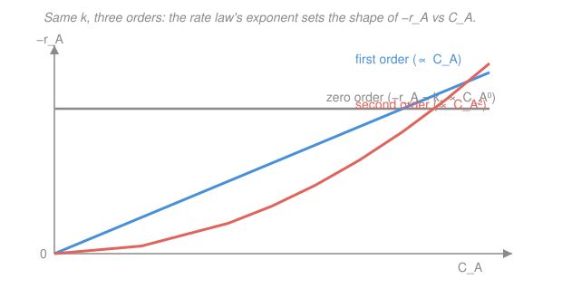

# Chemical Reaction Engineering · Lesson 1.1: The rate of reaction and the rate law

> ⏱ ~15 min · Module 1: Rate laws and the mole balance · Builds on: [`physical-chemistry` 3.1 (rate laws & reaction order)](../../physical-chemistry/lessons/03-01-rate-laws-reaction-order.md), [`general-chemistry` 4.3 (a taste of kinetics)](../../general-chemistry/lessons/04-03-taste-of-kinetics.md) · Unlocks: [1.2 (Arrhenius temperature dependence)](01-02-arrhenius-temperature-dependence.md), [1.3 (general mole balance)](01-03-general-mole-balance.md)

## Why this matters

Every reactor you will ever size — a 200,000-liter fermenter, a catalytic pipe the width of your thumb, a batch kettle — is designed by answering two separate questions. **How fast** does the chemistry go? And, given that speed, **how much reactor** do I need to hit my target? This course spends its whole length on the second question (mole balances, conversion, temperature, catalysis). But none of that machinery can turn until you feed it the first answer, and that answer is a single algebraic object: the **rate law**. It is the one piece of physics the reactor design equations cannot derive for themselves — it comes from the lab. Get it right and the rest is bookkeeping; get it wrong and every reactor volume you compute is wrong by the same factor. So we start here, and we start by pinning down exactly what "the rate" *means* — a definition that is deceptively easy to get sloppy about.

## The idea

"The reaction rate" sounds like it should mean one obvious thing, but ask three chemists and you'll get three numbers unless you agree on conventions first. Two traps to disarm up front.

**Trap 1: whose disappearance?** In $2A \to B$, species $A$ vanishes twice as fast as $B$ appears. So "the rate" depends on which species you watch. The engineer's fix: pick a **basis species** (almost always the key reactant $A$) and quote everything relative to it. We write $-r_A$ = "the rate at which $A$ is consumed."

**Trap 2: rate of *what* — a bucketful or a spoonful?** If I double the tank size at the same temperature and composition, twice as many moles react per second, but that tells you nothing new about the *chemistry* — only that there's more of it. The chemistry lives in a **per-unit-volume** rate: moles of $A$ consumed per liter (or cubic meter) per second. That number is an **intensive** property — it depends only on the *local* temperature and composition, not on how big the reactor is or what shape it takes. This is the single most important idea in the lesson: **the rate is a property of the fluid at a point, not of the vessel.** That is exactly what lets us measure it in a tiny flask and then use it to design a vessel a million times larger.

Once the rate is defined, the second idea is empirical: that per-volume rate almost always turns out to be a **product of concentration powers**. More crowded reactants collide more often, so the rate climbs with concentration — and the *shape* of that climb (flat, straight, or curving up) is the reaction's fingerprint.

## The formal version

**Rate of reaction.** For a reaction written with $A$ as the basis, the rate of consumption of $A$ is

$$-r_A \;=\; \text{moles of } A \text{ consumed per unit volume per unit time}, \qquad [-r_A] = \frac{\mathrm{mol}}{\mathrm{m^3\cdot s}}\ \ \left(\text{or } \frac{\mathrm{mol}}{\mathrm{L\cdot s}}\right).$$

*In words: how many moles of $A$ disappear each second in each liter of reacting fluid.* The symbol $r_A$ is the *generation* rate of $A$ (signed): a reactant is being destroyed, so $r_A < 0$, and we attach a minus sign so that the quantity we actually work with, $-r_A$, comes out **positive**. Sign convention in one line:

$$\text{reactant consumed} \;\Longrightarrow\; r_A < 0 \;\Longrightarrow\; -r_A > 0.$$

For a product, $r_B > 0$ and you'd track $+r_B$. Three things $-r_A$ is emphatically **not**: it is not a rate of change $d C_A/dt$ (that's a *reactor* outcome that also depends on flow), it does not carry the reactor volume in it, and it is not tied to any particular reactor. It is a function of the *state* — temperature $T$ and the concentrations present — evaluated at a point:

$$-r_A = f(T,\; C_A,\; C_B,\; \dots).$$

**Heterogeneous flag.** When the reaction happens *on a solid catalyst*, "per unit volume" is awkward — the action is on surface area, which scales with catalyst mass. There we quote the rate **per unit mass of catalyst**:

$$-r_A' \;=\; \frac{\mathrm{mol}\ A}{\mathrm{kg\ catalyst}\cdot \mathrm{s}}.$$

*In words: moles of $A$ consumed per second per kilogram of catalyst.* The prime means "per mass." We will meet $-r_A'$ properly with packed-bed reactors ([1.6](01-06-pfr-packed-bed.md)) and catalysis ([4.2](04-02-heterogeneous-rate-laws-lhhw.md)); for now just recognize the prime as the heterogeneous cousin of $-r_A$.

**The rate law.** The rate law is the *algebraic* statement of how $-r_A$ depends on composition. The workhorse form is the **power law**

$$\boxed{\,-r_A = k\,C_A^{\alpha}\,C_B^{\beta}\,}$$

with each symbol earning its keep:

- $C_A, C_B$ — concentrations of $A$ and $B$ ($\mathrm{mol/L}$ or $\mathrm{mol/m^3}$).
- $\alpha$ — the **order with respect to $A$**; $\beta$ — the order with respect to $B$. *In words: double $C_A$ and the rate scales by $2^{\alpha}$.*
- $\alpha + \beta$ — the **overall order** of the reaction.
- $k$ — the **rate constant** (a.k.a. specific reaction rate): the intrinsic speed at a fixed temperature, independent of concentration. It carries the *temperature* dependence instead — that's the Arrhenius law of [1.2](01-02-arrhenius-temperature-dependence.md).

**Units of $k$ follow from the order.** Because $-r_A$ is always $\mathrm{mol\,L^{-1}\,s^{-1}}$, whatever powers of concentration sit on the right must be cancelled by $k$. For overall order $n$,

$$[k] = \left(\frac{\mathrm{mol}}{\mathrm{L}}\right)^{1-n}\mathrm{s^{-1}} = \mathrm{(mol/L)^{1-n}\,s^{-1}}.$$

Worked example 1 derives this; commit the *method*, not the formula.

**Elementary vs. non-elementary.** This is the conceptual heart of the lesson.

- A reaction is **elementary** if it happens in a *single molecular event* exactly as written — the molecules in the equation collide and react in one step. For an elementary reaction, and *only* then, **the orders equal the stoichiometric coefficients.** So $A + B \to$ products, if elementary, has $-r_A = k C_A C_B$ (first order in each, second overall).
- A reaction is **non-elementary** if the balanced equation is really the *sum* of a hidden multi-step mechanism. Then the orders are whatever the *slowest step* dictates, fit to experimental data, and they need not match the coefficients — they can be fractional, zero, even negative. You cannot read the rate law off a non-elementary equation; you must measure it (the initial-rate and isolation methods from [`physical-chemistry` 3.1](../../physical-chemistry/lessons/03-01-rate-laws-reaction-order.md)).

A crucial distinction of vocabulary rides along here:

> **Molecularity** counts the molecules in an *elementary* step (uni-, bi-, termolecular) — it is a mechanistic, whole-number idea. **Order** is an *empirical* exponent from the rate law. They coincide only for an elementary step. When someone quotes "order 1.5," they are describing data, not molecules.

## Picture

The order is visible in the *shape*. Zero order (grey): the rate ignores concentration — a flat line, the mark of a saturated catalyst or enzyme working flat-out. First order (blue): rate is proportional to $C_A$ — a straight line through the origin, the most common case. Second order (coral): rate $\propto C_A^2$ — a parabola curving upward, so the rate collapses fast as $A$ is used up. Same $k$-scale for all three; only the exponent changes the curve.

## Worked examples

**Example 1 (mechanical — units of $k$ from the order).** Start from $-r_A = k\,C_A^{\,n}$ and solve for the units of $k$ by demanding that both sides come out in $\mathrm{mol\,L^{-1}\,s^{-1}}$. Rearranged, $k = (-r_A)/C_A^{\,n}$, so

$$[k] = \frac{\mathrm{mol\,L^{-1}\,s^{-1}}}{(\mathrm{mol\,L^{-1}})^{n}} = (\mathrm{mol\,L^{-1}})^{1-n}\,\mathrm{s^{-1}}.$$

Plug in the three everyday orders:

| overall order $n$ | rate law | units of $k$ |
|---|---|---|
| $0$ | $-r_A = k$ | $\mathrm{mol\,L^{-1}\,s^{-1}}$ |
| $1$ | $-r_A = k\,C_A$ | $\mathrm{s^{-1}}$ |
| $2$ | $-r_A = k\,C_A^2$ | $\mathrm{L\,mol^{-1}\,s^{-1}}$ |

*Check.* At $n=0$ the exponent $1-n=1$, so $k$ carries the *full* $\mathrm{mol\,L^{-1}\,s^{-1}}$ — sensible, since a zero-order rate *is* just a constant with rate units. At $n=1$, $1-n=0$, concentration units vanish and $k$ is a pure inverse time — the "$0.23\ \mathrm{min^{-1}}$" you'll see all course. Each step up in order strips one power of concentration from $k$ and adds it as $\mathrm{L/mol}$. Units are also a cheap error-detector: if a data table hands you $k$ in $\mathrm{L\,mol^{-1}\,s^{-1}}$, the reaction is second order overall before you read another word. ✓

**Example 2 (why you'd care — the equation is not the mechanism).** A reaction is written $2A \to B$. Naively, "elementary" would predict two $A$ molecules must collide, giving $-r_A = k C_A^2$ (second order). But the lab measures

$$-r_A = k\,C_A \qquad (\text{first order, } k = 0.05\ \mathrm{s^{-1}}).$$

Why can the reaction **not** be elementary as written? Because *elementary* means the balanced equation *is* the molecular event, which forces order = stoichiometry = 2. The data say order 1. A first-order rate is the signature of a slow step that involves only **one** $A$ molecule — for instance a mechanism where a single $A$ first isomerizes or decomposes in the rate-limiting step, $A \xrightarrow{\text{slow}} A^{*}$, and a fast follow-up consumes the second $A$. The overall equation $2A \to B$ correctly tallies the atoms, but it *hides* that two-step route. So the honest statement is: $2A \to B$ is **non-elementary**, and its measured first-order law describes the bottleneck, not the collision you'd guess from the coefficients.

*Design consequence.* This is not academic. If you'd assumed second order and sized a reactor with $-r_A = k C_A^2$, you'd have predicted the rate *plummeting* as $A$ is consumed (the coral parabola) and over-built the vessel. The true first-order rate (blue line) falls only linearly, so the real reactor is smaller. The rate law's exponent directly sets how big a tank you buy. ✓

## Watch out

- **You might think $-r_A$ is a rate of change like $dC_A/dt$.** It isn't. $-r_A$ is a *property of the local state* — plug in $T$ and the concentrations and it returns a number, no reactor required. In a flow reactor $C_A$ can be perfectly constant in time while $-r_A$ is large and nonzero. The link between $-r_A$ and any actual $dC_A/dt$ is the *mole balance* ([1.3](01-03-general-mole-balance.md)), which also brings in flow — don't conflate the input with the bookkeeping.
- **You might read the rate law off the balanced equation.** Only legal if the reaction is *elementary*, which is a claim about mechanism you must justify, not assume. For everything else the exponents are experimental and can be fractional, zero, or negative — see Example 2 and [`physical-chemistry` 3.1](../../physical-chemistry/lessons/03-01-rate-laws-reaction-order.md).
- **You might treat $-r_A$ and $-r_A'$ as interchangeable.** They differ by the catalyst density: $-r_A$ is per volume ($\mathrm{mol\,L^{-1}\,s^{-1}}$), $-r_A'$ is per catalyst mass ($\mathrm{mol\,kg^{-1}\,s^{-1}}$), related by $-r_A = \rho_b(-r_A')$ with $\rho_b$ the bed's mass of catalyst per volume. Mixing them silently rescales every reactor size by $\rho_b$.
- **You might equate molecularity and order.** Molecularity counts molecules in an elementary step (always a small whole number); order is a fitted exponent (need not be). Saying a reaction "is order 2" is a statement about *data*; saying a step "is bimolecular" is a statement about *molecules*.

## One-liner

> $-r_A$ is the intensive, positive rate at which $A$ disappears per unit volume — a property of the local $T$ and composition — and the rate law $-r_A = kC_A^\alpha C_B^\beta$ is the empirical "how fast" that every reactor design equation takes as its input.

## Problems

**P1 (🟢)** A liquid-phase reaction has the rate law $-r_A = k\,C_A^{3/2}$ (order $\tfrac32$). Working in units of $\mathrm{mol\,L^{-1}\,s^{-1}}$ for the rate and $\mathrm{mol\,L^{-1}}$ for concentration, find the units of $k$.

**P2 (🟡)** The gas-phase decomposition $A \to 2B$ is reported as elementary. (a) Write its rate law and give the overall order. (b) A textbook lists $k = 12\ \mathrm{L\,mol^{-1}\,s^{-1}}$ for this same reaction. Is that consistent with the reaction being elementary as written? What order does that $k$ imply, and what does the discrepancy tell you?

**P3 (🔴)** A reaction $A + B \to C$ is measured to be *first order in $A$* and *order $-1$ in $B$*, i.e. $-r_A = k\,C_A\,C_B^{-1}$. (a) What is the overall order, and what are the units of $k$ (rate in $\mathrm{mol\,L^{-1}\,s^{-1}}$, concentration in $\mathrm{mol\,L^{-1}}$)? (b) Physically, what does a *negative* order in $B$ mean for the reaction, and can the reaction possibly be elementary?

Solutions

**P1** Use $[k] = (\mathrm{mol/L})^{1-n}\,\mathrm{s^{-1}}$ with $n = \tfrac32$:

$$[k] = (\mathrm{mol\,L^{-1}})^{1 - 3/2}\,\mathrm{s^{-1}} = (\mathrm{mol\,L^{-1}})^{-1/2}\,\mathrm{s^{-1}} = \mathrm{mol^{-1/2}\,L^{1/2}\,s^{-1}}.$$

*Check.* Reassemble the rate law: $k\,C_A^{3/2}$ has units $\mathrm{mol^{-1/2}L^{1/2}s^{-1}}\times(\mathrm{mol\,L^{-1}})^{3/2} = \mathrm{mol^{-1/2+3/2}\,L^{1/2-3/2}\,s^{-1}} = \mathrm{mol\,L^{-1}\,s^{-1}}$ ✓ — exactly a rate. Fractional order gives fractional-power units, a dead giveaway of a non-elementary mechanism.

**P2** (a) Elementary means order = stoichiometry. Only one $A$ molecule appears on the left, so the reaction is **first order**: $-r_A = k\,C_A$, overall order 1. (Note $B$ is a product and doesn't enter the forward rate law.) Its $k$ would have units $\mathrm{s^{-1}}$.

(b) A $k$ in $\mathrm{L\,mol^{-1}\,s^{-1}}$ has the units-signature of a **second-order** rate constant, $[k] = (\mathrm{mol/L})^{1-2}\mathrm{s^{-1}} = \mathrm{L\,mol^{-1}\,s^{-1}}$. That is inconsistent with a first-order elementary $A \to 2B$. So either the reaction is **not** elementary as written (its true rate law is second order, hiding a bimolecular step such as $2A$ in the mechanism), or the quoted constant is for a different rate expression. The units alone flag the contradiction before any kinetics is done.

*Check.* First-order $k$ must be $\mathrm{s^{-1}}$; the given $\mathrm{L\,mol^{-1}\,s^{-1}}$ is off by one power of $\mathrm{L/mol}$, i.e. one order higher. ✓

**P3** (a) Overall order $= 1 + (-1) = 0$. Units: $[k] = (\mathrm{mol/L})^{1-0}\,\mathrm{s^{-1}} = \mathrm{mol\,L^{-1}\,s^{-1}}$.

*Check.* Reassemble: $k\,C_A C_B^{-1}$ has units $\mathrm{mol\,L^{-1}\,s^{-1}}\cdot(\mathrm{mol\,L^{-1}})\cdot(\mathrm{mol\,L^{-1}})^{-1} = \mathrm{mol\,L^{-1}\,s^{-1}}$ ✓. Zero overall order does *not* mean the rate is constant here — it means the two concentration dependences cancel dimensionally, not numerically.

(b) A negative order in $B$ means **more $B$ slows the reaction down** — $B$ inhibits it. That is impossible for an elementary step, where every reactant in the collision can only *help* the rate (orders are the positive coefficients). Negative order is a hallmark of a mechanism: typically $B$ ties up an intermediate or occupies a catalytic site (a pre-equilibrium that appears in the denominator of the true rate expression, as in the LHHW forms of [4.2](04-02-heterogeneous-rate-laws-lhhw.md)). So the reaction is necessarily **non-elementary**. ✓

## Connections

- **Backward:** this sharpens the reaction rate and rate law you first met in [`general-chemistry` 4.3](../../general-chemistry/lessons/04-03-taste-of-kinetics.md) and formalized in [`physical-chemistry` 3.1](../../physical-chemistry/lessons/03-01-rate-laws-reaction-order.md) — same power-law object, now recast as an *intensive, per-volume* quantity because a reactor engineer needs a rate that scales from flask to plant. The "orders are not coefficients" warning is the same one physical chemistry gives; here it decides how big a tank you build.
- **Forward:** [1.2 (Arrhenius)](01-02-arrhenius-temperature-dependence.md) supplies the missing temperature dependence of $k$, $k = A e^{-E/RT}$, so the rate law becomes a full function of both $T$ and composition. [1.3 (the general mole balance)](01-03-general-mole-balance.md) is the "bookkeeping" that takes this $-r_A$ as input and turns it into a reactor volume — every design equation in Modules 1–2 (batch, CSTR, PFR, PBR) is that balance with a rate law plugged in.
- **Sideways:** the heterogeneous rate $-r_A'$ flagged here is the entry point to catalysis ([4.1](04-01-catalysis-langmuir-isotherm.md)–[4.2](04-02-heterogeneous-rate-laws-lhhw.md)), where the "flat" zero-order curve in the Picture reappears as a saturated catalyst surface (Langmuir), and where negative orders like P3's fall naturally out of surface-site competition.
