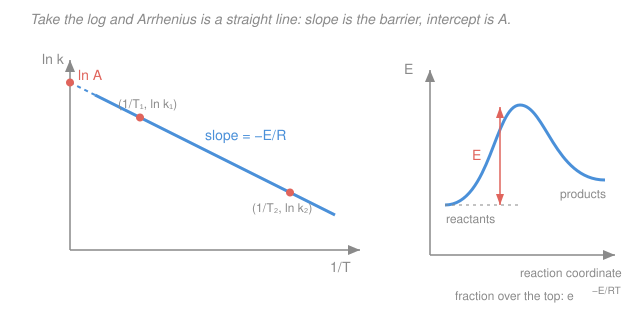

# Chemical Reaction Engineering · Lesson 1.2: Arrhenius and the temperature dependence of rate

> ⏱ ~15 min · Module 1: Mole balances and rate laws · Builds on: [1.1 Rate of reaction and the rate law](01-01-rate-of-reaction-rate-law.md), [phys-chem 3.4 Arrhenius and transition-state theory](../../physical-chemistry/lessons/03-04-arrhenius-transition-state-theory.md) · Unlocks: Module 3 (temperature couples to conversion), every reactor-sizing calculation

## Why this matters

In Lesson 1.1 we wrote $-r_A = kC_A^n$ and treated $k$ as a number. It isn't — it's a number that explodes with temperature. Warm a reactor by 10 K and the rate can *double*; that single fact is why every sizing calculation begins with "at what temperature?", and why exothermic reactors can **run away**: the reaction heats the pot, the hotter pot reacts faster, which heats it more. This lesson pins down exactly how steeply $k$ climbs with $T$, gives you the two tools to *measure* that climb from data and to *extrapolate* $k$ to a design temperature, and plants the seed for the thermal-stability drama of Module 3.

## The idea

Molecules react only when a collision is violent enough to break the old bonds — they have to clear an energy **barrier**, the activation energy $E$. In any pot, molecular energies are spread out lopsidedly (a few molecules carry far more than average), and the fraction carrying at least $E$ is $e^{-E/RT}$. Heat the pot and you shift the whole distribution upward, so *exponentially* more molecules qualify. You aren't making each molecule a bit faster — you're multiplying the **number** that can react at all.

So the rate constant factors into two pieces: how often reactants collide and line up correctly (a big number $A$ that barely cares about temperature), times the fraction energetic enough to react ($e^{-E/RT}$, which cares enormously). That product is the **Arrhenius law**. This is the same barrier picture from [phys-chem 3.4](../../physical-chemistry/lessons/03-04-arrhenius-transition-state-theory.md), where transition-state theory explained *where* the barrier comes from; here we put it to work sizing equipment.

## The formal version

**Arrhenius law.**

$$k = A\, e^{-E/(RT)}$$

- $k$ — rate constant (units depend on order $n$; e.g. $\mathrm{s^{-1}}$ for first order),
- $A$ — **pre-exponential** (or frequency) **factor**, same units as $k$: the collision-and-orientation rate, the value $k$ would take if every collision cleared the barrier,
- $E$ — **activation energy** in $\mathrm{J/mol}$: the barrier height,
- $R = 8.314\ \mathrm{J\,mol^{-1}\,K^{-1}}$ — gas constant,
- $T$ — absolute temperature in $\mathrm{K}$.

*In words: $k$ is a ceiling rate $A$ knocked down by the fraction $e^{-E/RT}$ of collisions with enough energy.* Note the exponent is dimensionless: $E/(RT)$ has units $\dfrac{\mathrm{J/mol}}{(\mathrm{J\,mol^{-1}\,K^{-1}})(\mathrm{K})}$, all of which cancel. Good.

**Linearized form — the Arrhenius plot.** Take the natural log:

$$\ln k = \ln A - \frac{E}{R}\cdot\frac{1}{T}.$$

*In words: plot $\ln k$ (vertical) against $1/T$ (horizontal) and the data fall on a straight line* — **slope** $= -E/R$, **intercept** $= \ln A$. This is the workhorse for extracting $E$ and $A$ from a table of measured rate constants (see the Picture).

**Two-point form.** Write the linear equation at two temperatures and subtract to cancel $\ln A$:

$$\boxed{\;\ln\frac{k_2}{k_1} = -\frac{E}{R}\left(\frac{1}{T_2}-\frac{1}{T_1}\right)\;}$$

*In words: knowing $k$ at two temperatures pins down $E$ with no need for $A$; knowing $E$ and one $k$ lets you predict $k$ at any other temperature.* This second use — extrapolating to a design temperature — is what you'll reach for constantly.

## Picture

The left panel is the Arrhenius plot: raw $k(T)$ data are curved and hard to read, but $\ln k$ vs $1/T$ straightens them — the slope *is* the barrier ($-E/R$) and the intercept *is* $\ln A$. The right inset is why: only the fraction $e^{-E/RT}$ of molecules sit above the barrier, and that fraction is what temperature controls.

## Worked examples

**Example 1 — "rate doubles per 10 K": find $E$, then extrapolate.**
A reaction's rate constant doubles when temperature rises from $T_1 = 300\ \mathrm{K}$ to $T_2 = 310\ \mathrm{K}$: $k_2/k_1 = 2$. Find $E$, then predict $k$ at $T_3 = 350\ \mathrm{K}$.

Two-point form:
$$\ln 2 = -\frac{E}{R}\left(\frac{1}{310}-\frac{1}{300}\right).$$
Compute the temperature bracket:
$$\frac{1}{310}-\frac{1}{300} = \frac{300-310}{310\cdot 300} = \frac{-10}{93000} = -1.0753\times10^{-4}\ \mathrm{K^{-1}}.$$
So
$$E = -\frac{R\ln 2}{(1/T_2 - 1/T_1)} = -\frac{(8.314)(0.6931)}{-1.0753\times10^{-4}} = 5.36\times10^{4}\ \mathrm{J/mol} \approx 52\ \mathrm{kJ/mol}.$$

Now extrapolate from $T_1 = 300\ \mathrm{K}$ to $T_3 = 350\ \mathrm{K}$:
$$\ln\frac{k_3}{k_1} = -\frac{E}{R}\left(\frac{1}{350}-\frac{1}{300}\right) = -\frac{5.36\times10^{4}}{8.314}\left(2.857\times10^{-3}-3.333\times10^{-3}\right).$$
The bracket is $-4.762\times10^{-4}\ \mathrm{K^{-1}}$, so
$$\ln\frac{k_3}{k_1} = -(6447)(-4.762\times10^{-4}) = 3.07 \quad\Rightarrow\quad \frac{k_3}{k_1} = e^{3.07} \approx 21.5.$$

**Sanity check.** $E \approx 52\ \mathrm{kJ/mol}$ is a textbook mid-range barrier, and it reproduces the "doubles per 10 K near room temperature" rule of thumb — that rule *is* roughly $E \approx 50$–$55\ \mathrm{kJ/mol}$. Raising $T$ by 50 K multiplies $k$ by ~20: exponential sensitivity, exactly the design headache to remember.

**Example 2 — Arrhenius fit from a table: get $E$ and $A$.**
Measured first-order rate constants ($k$ in $\mathrm{s^{-1}}$):

| $T$ (K) | $1/T$ ($\mathrm{K^{-1}}$) | $k$ ($\mathrm{s^{-1}}$) | $\ln k$ |
|---|---|---|---|
| 300 | $3.333\times10^{-3}$ | $1.00\times10^{-3}$ | $-6.908$ |
| 320 | $3.125\times10^{-3}$ | $5.00\times10^{-3}$ | $-5.298$ |

Slope between the two points:
$$\text{slope} = \frac{\Delta(\ln k)}{\Delta(1/T)} = \frac{-5.298-(-6.908)}{3.125\times10^{-3}-3.333\times10^{-3}} = \frac{1.610}{-2.083\times10^{-4}} = -7.73\times10^{3}\ \mathrm{K}.$$
Then $E = -R\cdot\text{slope} = -(8.314)(-7.73\times10^{3}) = 6.43\times10^{4}\ \mathrm{J/mol} \approx 64\ \mathrm{kJ/mol}$.

Intercept from $\ln A = \ln k + \dfrac{E}{R}\cdot\dfrac1T$, using the 300 K row:
$$\ln A = -6.908 + (7.73\times10^{3})(3.333\times10^{-3}) = -6.908 + 25.77 = 18.86,$$
so $A = e^{18.86} \approx 1.6\times10^{8}\ \mathrm{s^{-1}}$.

**Sanity check.** $A$ has the units of $k$ (first order $\Rightarrow \mathrm{s^{-1}}$) — good. Plug back at 320 K: $k = 1.6\times10^{8}\,e^{-64300/(8.314\cdot320)} = 1.6\times10^{8}\,e^{-24.17} = 1.6\times10^{8}\cdot 3.2\times10^{-11} \approx 5\times10^{-3}\ \mathrm{s^{-1}}$. Matches the table.

## Watch out

- **You might think $E$ has units of energy like joules — but actually it's energy *per mole*** ($\mathrm{J/mol}$), which is why $R$ (not Boltzmann's $k_B$) sits in the denominator. If you ever see $e^{-E_a/k_BT}$, that $E_a$ is per molecule; the two differ by Avogadro's number. Keep $E$ in $\mathrm{J/mol}$ with $R$ and the exponent stays dimensionless.
- **You might think the two-point formula's sign is a formality — but actually flipping which state is "1" vs "2" flips the bracket sign too**, so the answer for $E$ comes out positive either way. If your $E$ lands negative, you crossed the subscripts on one side but not the other. $E$ is always positive for an ordinary reaction.
- **You might think $A$ is truly temperature-independent — but actually it drifts weakly** (collision theory gives $A \propto \sqrt{T}$, transition-state theory a $T$ factor too). Over a modest window the $e^{-E/RT}$ term swamps it, so we treat $A$ as constant and fold any drift into an *effective* $E$. Fine for design; just don't extrapolate hundreds of kelvin and expect three-figure accuracy.

## One-liner

> $k = A\,e^{-E/RT}$: temperature doesn't nudge the rate, it multiplies it — plot $\ln k$ vs $1/T$, and the slope is the barrier.

## Problems

**P1 (🟢)** A gas-phase reaction has $E = 80\ \mathrm{kJ/mol}$ and $k = 0.10\ \mathrm{s^{-1}}$ at $500\ \mathrm{K}$. What is $k$ at $550\ \mathrm{K}$?

**P2 (🟡)** Two rate constants are measured: $k = 2.0\times10^{-4}\ \mathrm{s^{-1}}$ at $290\ \mathrm{K}$ and $k = 8.0\times10^{-4}\ \mathrm{s^{-1}}$ at $310\ \mathrm{K}$. Find the activation energy $E$ and the pre-exponential factor $A$.

**P3 (🔴)** An exothermic reaction with $E = 100\ \mathrm{kJ/mol}$ runs in a reactor whose temperature accidentally climbs from $400\ \mathrm{K}$ to $420\ \mathrm{K}$. By what factor does the rate constant increase? Comment in one sentence on why this makes tight temperature control critical for exothermic reactors (a preview of Module 3's runaway).

Solutions

**P1.** Two-point form with $T_1 = 500$, $T_2 = 550$, $E = 80{,}000\ \mathrm{J/mol}$:
$$\frac{1}{550}-\frac{1}{500} = \frac{500-550}{550\cdot500} = \frac{-50}{275000} = -1.818\times10^{-4}\ \mathrm{K^{-1}}.$$
$$\ln\frac{k_2}{k_1} = -\frac{80000}{8.314}(-1.818\times10^{-4}) = -(9623)(-1.818\times10^{-4}) = 1.749.$$
$$k_2 = k_1\,e^{1.749} = 0.10\times5.75 = 0.58\ \mathrm{s^{-1}}.$$
*Sanity:* a 50 K rise near 500 K gives ~6×, believable for an 80 kJ/mol barrier; units carry through as $\mathrm{s^{-1}}$.

**P2.** Two-point form for $E$:
$$\frac{1}{310}-\frac{1}{290} = \frac{290-310}{310\cdot290} = \frac{-20}{89900} = -2.225\times10^{-4}\ \mathrm{K^{-1}}.$$
$$\ln\frac{8.0\times10^{-4}}{2.0\times10^{-4}} = \ln 4 = 1.386 = -\frac{E}{8.314}(-2.225\times10^{-4}).$$
$$E = \frac{(8.314)(1.386)}{2.225\times10^{-4}} = 5.18\times10^{4}\ \mathrm{J/mol} \approx 52\ \mathrm{kJ/mol}.$$
For $A$, use $\ln A = \ln k + \dfrac{E}{R}\dfrac1T$ at $T = 290\ \mathrm{K}$:
$$\ln A = \ln(2.0\times10^{-4}) + \frac{5.18\times10^{4}}{8.314}\cdot\frac{1}{290} = -8.517 + (6231)(3.448\times10^{-3}) = -8.517 + 21.49 = 12.97.$$
$$A = e^{12.97} \approx 4.3\times10^{5}\ \mathrm{s^{-1}}.$$
*Sanity:* check at 310 K — $k = 4.3\times10^{5}e^{-51800/(8.314\cdot310)} = 4.3\times10^{5}e^{-20.10} = 4.3\times10^{5}(1.86\times10^{-9}) \approx 8\times10^{-4}\ \mathrm{s^{-1}}$. Matches.

**P3.** 
$$\frac{1}{420}-\frac{1}{400} = \frac{400-420}{420\cdot400} = \frac{-20}{168000} = -1.190\times10^{-4}\ \mathrm{K^{-1}}.$$
$$\ln\frac{k_2}{k_1} = -\frac{100000}{8.314}(-1.190\times10^{-4}) = -(12027)(-1.190\times10^{-4}) = 1.431.$$
$$\frac{k_2}{k_1} = e^{1.431} \approx 4.2.$$
A mere 20 K overshoot quadruples the rate — and in an exothermic reactor a faster rate releases heat faster, pushing $T$ up further, which speeds the rate again: a positive feedback loop. Without active cooling that keeps $T$ pinned, the reactor can **run away** thermally, the central hazard of [Module 3's nonisothermal design](../syllabus.md).

## Connections

- **Backward:** this is the missing half of the rate law from [1.1](01-01-rate-of-reaction-rate-law.md) — $-r_A = kC_A^n$ gave the *concentration* dependence; Arrhenius gives the *temperature* dependence of the same $k$. It's the identical equation you derived from transition-state theory in [phys-chem 3.4](../../physical-chemistry/lessons/03-04-arrhenius-transition-state-theory.md).
- **Forward:** the next lessons build the [general mole balance](01-03-general-mole-balance.md) and the four ideal reactors; those sizing equations all carry $k$, so every one inherits this temperature sensitivity.
- **Sideways / the payoff:** in Module 3, temperature stops being a knob you set and becomes a variable coupled to conversion through the energy balance. The steep $k(T)$ you just quantified is precisely what makes CSTRs show [multiple steady states and runaway](../syllabus.md) — the same exponential, now with a feedback loop closed around it. The Boltzmann-fraction barrier picture also underlies [catalysis](../../physical-chemistry/lessons/03-05-catalysis-enzyme-kinetics.md), where a catalyst lowers $E$ to raise $k$ without touching $T$.
