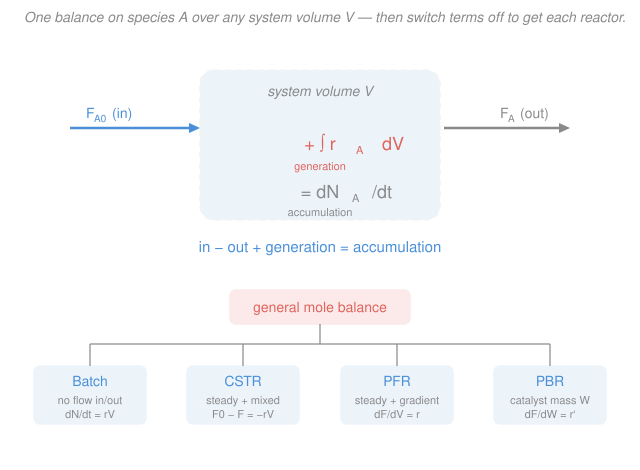

# Chemical Reaction Engineering · Lesson 1.3: The general mole balance

> ⏱ ~15 min · Module 1: Rate Laws & the Ideal Reactors · Builds on: [1.1 The rate of reaction & the rate law](01-01-rate-of-reaction-rate-law.md), [`engineering-thermodynamics` 2.3 Mass & energy balance for control volumes](../../engineering-thermodynamics/lessons/02-03-mass-energy-balance-control-volumes.md) · Unlocks: [1.4 Batch](01-04-batch-reactor.md), [1.5 CSTR](01-05-cstr.md), [1.6 PFR & packed bed](01-06-pfr-packed-bed.md)

## Why this matters

Here is the good news you should hold onto for the whole course: there is really only **one** reactor equation. Batch, CSTR, PFR, packed bed — they look like four different beasts with four different design formulas, but every one of them is the same molecular head-count with a couple of terms crossed out. Learn to write that head-count and you never have to memorize a reactor formula again; you *derive* the one you need in two lines. This lesson is that head-count. Everything in Modules 1 and 2 — sizing a tank, sizing a tube, sizing a catalyst bed — is bookkeeping downstream of it.

It is the exact same move you already made in [`engineering-thermodynamics` 2.3](../../engineering-thermodynamics/lessons/02-03-mass-energy-balance-control-volumes.md): draw a boundary in space, count what crosses it, count what piles up inside. There you counted joules and kilograms; here you count **moles of one species**, and you add a term that thermodynamics never needed — chemical reaction can *create and destroy* the thing you're tracking.

## The idea

Pick one chemical species — call it $A$ — and draw a boundary around whatever region you care about: a flask, a tank, a slice of pipe. Now audit the molecules of $A$ inside that boundary the way an accountant audits a bank account. Over any moment, the balance of $A$ can change for exactly four reasons:

- some $A$ **flows in** across the boundary,
- some $A$ **flows out** across the boundary,
- some $A$ is **generated** inside (reaction makes or destroys it), and
- whatever's left over shows up as $A$ **accumulating** — the amount inside going up or down.

That's the whole idea: **in − out + generation = accumulation.** The one new wrinkle versus a thermo mass balance is that middle term. Money doesn't spontaneously appear in a vault, but $A$ *does* appear or vanish inside the box whenever a reaction runs. If $A$ is a reactant it's being eaten (generation is negative); if $A$ is a product it's being born (generation is positive). Reaction is the source term, and the rate law from [1.1](01-01-rate-of-reaction-rate-law.md) is what sets its size.

One subtlety worth flagging now, because it drives half the algebra later: the reaction rate can be **different at different points inside the box**. In a well-stirred tank every spot is identical, so "total generation" is just rate × volume. But in a long tube the reactant is fresh and fast at the inlet and depleted and slow at the outlet — the rate varies down the length. To total it up you have to *add over every little piece of volume*, which is what an integral is for.

## The formal version

Draw the boundary around a **system volume** $V$ (units: volume, e.g. $\mathrm{L}$ or $\mathrm{m^3}$). Track species $A$. The general mole balance is

$$\boxed{\,F_{A0} - F_A + \int_V r_A\,dV = \frac{dN_A}{dt}\,}$$

*In words: (moles of $A$ flowing in) minus (moles flowing out) plus (moles made by reaction) equals (the rate at which moles of $A$ are stockpiling inside).* Every term has units of **moles per time** (e.g. $\mathrm{mol/s}$) — we'll verify that in Worked Example 2. Term by term:

- $F_{A0}$ — the **molar flow rate of $A$ into** the system ($\mathrm{mol/s}$). The "0" subscript means "at the entrance / feed." For a liquid feed, $F_{A0} = C_{A0}\,v_0$, concentration times volumetric flow (this identity gets a full workout in [1.5](01-05-cstr.md)).
- $F_A$ — the **molar flow rate of $A$ out** ($\mathrm{mol/s}$), evaluated at the exit.
- $\displaystyle\int_V r_A\,dV$ — the **total rate of generation of $A$ by reaction** ($\mathrm{mol/s}$). Here $r_A$ is the rate of *formation* of $A$ per unit volume ($\mathrm{mol/(L\cdot s)}$), the signed quantity from [1.1](01-01-rate-of-reaction-rate-law.md): $r_A < 0$ when $A$ is consumed. If the rate is different at different places, $r_A = r_A(\text{position})$, and the integral sums the local generation $r_A\,dV$ over every volume element $dV$.
- $\dfrac{dN_A}{dt}$ — the **accumulation**: how fast the number of moles of $A$ inside, $N_A$ ($\mathrm{mol}$), is changing with time $t$ ($\mathrm{s}$).

**The whole strategy of the course lives in that boxed equation.** Each ideal reactor is what you get by switching terms off:

| Reactor | What's special | Which terms survive | Design equation |
|---|---|---|---|
| **Batch** | no flow in or out | generation = accumulation | $\dfrac{dN_A}{dt} = \displaystyle\int_V r_A\,dV = r_A V$ |
| **CSTR** | steady state *and* perfectly mixed | in − out = −generation | $F_{A0} - F_A = -r_A V$ |
| **PFR** | steady state, but rate varies down the tube | in − out (across a slice) + generation = 0 | $\dfrac{dF_A}{dV} = r_A$ |
| **PBR** | steady, catalytic — mass, not volume | same, per catalyst weight $W$ | $\dfrac{dF_A}{dW} = r_A'$ |

*In words: batch keeps only reaction and accumulation; the flow reactors are all steady ($dN_A/dt = 0$) and differ only in whether you can treat the interior as one uniform blob (CSTR) or must slice it (PFR/PBR).* Lessons [1.4](01-04-batch-reactor.md)–[1.6](01-06-pfr-packed-bed.md) derive each row properly. Right now the point is only this: **they are one equation wearing four costumes.**

Why can the CSTR pull $r_A$ out of the integral but the PFR can't? Because "perfectly mixed" *means* the same concentration — and therefore the same rate — everywhere inside, so $\int_V r_A\,dV = r_A\int_V dV = r_A V$. A PFR is the opposite: reactant marches down the tube getting used up, so $r_A$ is large near the inlet and small near the outlet. Pulling it out of the integral would be claiming the rate is uniform — exactly the thing that isn't true. That single distinction — **can I treat the box as uniform?** — is what separates an *algebraic* design equation (CSTR) from a *differential* one (PFR).

## Picture

## Worked examples

**Example 1 — specialize the balance to a batch reactor, then to a CSTR.**

Start from the general balance and turn the knobs.

*Batch.* A sealed, well-stirred flask: nothing flows in or out, so $F_{A0} = 0$ and $F_A = 0$. Because it's well stirred, $r_A$ is uniform, so $\int_V r_A\,dV = r_A V$. The balance collapses to

$$0 - 0 + r_A V = \frac{dN_A}{dt} \quad\Longrightarrow\quad \frac{dN_A}{dt} = r_A V.$$

*In words: with no doors, the moles inside change only as fast as reaction makes or eats them.* Since $A$ is consumed, $r_A < 0$ and $N_A$ falls with time — the flask empties of reactant. This is the seed of the batch design equation in [1.4](01-04-batch-reactor.md).

*CSTR.* Now a continuously fed, overflowing tank at **steady state** — running the same at 3:00 as at 3:01 — so the amount inside isn't changing: $dN_A/dt = 0$. It's a *stirred* tank, so again $r_A$ is uniform and $\int_V r_A\,dV = r_A V$. The balance becomes

$$F_{A0} - F_A + r_A V = 0 \quad\Longrightarrow\quad F_{A0} - F_A = -r_A V.$$

*In words: at steady state, whatever extra $A$ comes in over what goes out is exactly what reaction destroyed.* Since $r_A<0$, the right side $-r_A V$ is positive, so $F_{A0} > F_A$ — less $A$ leaves than entered, as it must. Rearranged for the tank size, $V = \dfrac{F_{A0}-F_A}{-r_A}$, this is the CSTR design equation you'll meet in [1.5](01-05-cstr.md). Two reactors, one parent equation, two crossed-out terms.

**Example 2 — units: is every term really mol/time?**

A balance is only trustworthy if every term carries the same units. Check all four, using SI ($\mathrm{mol}$, $\mathrm{s}$, $\mathrm{L}$ for volume):

- $F_{A0},\,F_A$: molar flow rates, $\left[\dfrac{\mathrm{mol}}{\mathrm{s}}\right]$. ✓
- $\displaystyle\int_V r_A\,dV$: the rate of formation per volume $r_A$ has units $\left[\dfrac{\mathrm{mol}}{\mathrm{L}\cdot\mathrm{s}}\right]$; multiply by a volume element $dV$ in $[\mathrm{L}]$ and integrate: $\dfrac{\mathrm{mol}}{\mathrm{L}\cdot\mathrm{s}}\times \mathrm{L} = \dfrac{\mathrm{mol}}{\mathrm{s}}$. ✓
- $\dfrac{dN_A}{dt}$: moles over time, $\left[\dfrac{\mathrm{mol}}{\mathrm{s}}\right]$. ✓

All four terms are $\mathrm{mol/s}$, so the equation is dimensionally legal — you may add and equate them. The one that trips people is the generation term: $r_A$ **is not** a rate of moles, it's a rate of moles *per volume*. The $dV$ (or the $\times V$ in a well-mixed reactor) is what promotes it to $\mathrm{mol/s}$ so it can stand next to the flow terms. Miss that volume factor and your balance is off by a factor of the reactor size.

## Watch out

- **You might think** $r_A$ already has units of moles per time, **but actually** $r_A$ is *per unit volume* ($\mathrm{mol/(L\cdot s)}$). It only becomes a moles-per-time generation after you multiply by volume (well-mixed) or integrate over $dV$ (everything else). The volume factor is not optional decoration — it's what makes the term belong in the balance.
- **You might think** you can always write generation as $r_A V$, **but actually** that shortcut is legal *only* when $r_A$ is the same everywhere inside — i.e. a well-mixed reactor (batch, CSTR). In a PFR the rate varies along the tube, so generation is genuinely $\int_V r_A\,dV$ and pulling $r_A$ out is wrong. "Uniform interior" is the license to drop the integral.
- **You might think** generation is positive because reaction "produces" something, **but actually** the sign follows the species. For a reactant, $r_A < 0$ (it's being destroyed), so the generation term is *negative* and $N_A$ or $F_A$ drops. Keep $r_A$ signed and let the algebra tell you the direction; don't hand-force a sign.
- **You might think** $dN_A/dt = 0$ means "no reaction," **but actually** steady state means the *amount inside isn't changing with time* — reaction is roaring away, but inflow, outflow, and generation are in perpetual balance. Batch has reaction with $dN_A/dt \ne 0$; a CSTR has reaction with $dN_A/dt = 0$. Steady ≠ dead.

## One-liner

> Draw a box, count moles of $A$: in − out + (rate × volume) = pile-up — and every reactor in this course is that one sentence with two terms crossed out.

## Problems

**P1 (🟢)** A perfectly mixed tank of volume $V = 50\ \mathrm{L}$ runs at steady state. Species $A$ is fed at $F_{A0} = 8\ \mathrm{mol/min}$ and leaves at $F_A = 3\ \mathrm{mol/min}$. Assuming the rate is uniform (well mixed), find the rate of formation $r_A$ inside the tank, with sign and units. Is $A$ being consumed or produced?

**P2 (🟡)** Start from the general mole balance and specialize it to a **semi-batch** reactor: a tank that is *fed* but has **no outflow** ($F_A = 0$), well mixed, and *not* at steady state. Write the resulting differential balance for $N_A(t)$, and say in one sentence what each surviving term means physically.

**P3 (🔴, optional)** In a plug-flow tube the local rate isn't uniform; suppose over a small volume slice $dV$ the *molar flow* of $A$ drops by $dF_A$. Argue from the general balance (steady state, one thin slice as the "system") that $\dfrac{dF_A}{dV} = r_A$. Then, taking $r_A = -kC_A$ with $C_A = F_A/v_0$ (constant volumetric flow $v_0$), show the flow decays exponentially along the tube: $F_A(V) = F_{A0}\,e^{-kV/v_0}$.

Solutions

**P1** Steady state, well mixed → use the CSTR form $F_{A0} - F_A = -r_A V$. Solve for $r_A$:

$$r_A = -\frac{F_{A0}-F_A}{V} = -\frac{8 - 3}{50} = -0.10\ \frac{\mathrm{mol}}{\mathrm{L\cdot min}}.$$

The sign is **negative**, so $A$ is being **consumed** (it's a reactant) — consistent with less $A$ leaving ($3$) than entering ($8$). *Units check:* $\dfrac{\mathrm{mol/min}}{\mathrm{L}} = \dfrac{\mathrm{mol}}{\mathrm{L\cdot min}}$ ✓, a rate per volume as it should be.

**P2** Semi-batch: $F_{A0} \ne 0$, $F_A = 0$, well mixed so $\int_V r_A\,dV = r_A V$, and *not* steady so $dN_A/dt \ne 0$. The general balance $F_{A0} - F_A + \int_V r_A\,dV = dN_A/dt$ becomes

$$\frac{dN_A}{dt} = F_{A0} + r_A V.$$

*Meaning:* $F_{A0}$ is the moles of $A$ being poured in per unit time (adds to the pile); $r_A V$ is reaction (with $r_A<0$ for a reactant, it subtracts); their net is the rate the moles inside, $N_A$, actually change. It's the batch equation ($dN_A/dt = r_A V$) plus a live feed term — exactly the reactor you'd use to add a reagent slowly.

**P3** Take one thin slice of the tube, of volume $dV$, as the system. Steady state ⇒ $dN_A/dt = 0$. Flow in across the left face is $F_A$; flow out across the right face is $F_A + dF_A$; generation in the slice is $r_A\,dV$ (the slice is thin, so $r_A$ is effectively constant across it). The general balance for the slice:

$$\underbrace{F_A}_{\text{in}} - \underbrace{(F_A + dF_A)}_{\text{out}} + \underbrace{r_A\,dV}_{\text{gen}} = 0 \quad\Longrightarrow\quad -dF_A + r_A\,dV = 0 \quad\Longrightarrow\quad \frac{dF_A}{dV} = r_A.$$

Now substitute $r_A = -kC_A = -k\,\dfrac{F_A}{v_0}$:

$$\frac{dF_A}{dV} = -\frac{k}{v_0}F_A \quad\Longrightarrow\quad \frac{dF_A}{F_A} = -\frac{k}{v_0}\,dV.$$

Integrate from the inlet ($V=0$, $F_A = F_{A0}$) to a position $V$:

$$\ln\frac{F_A}{F_{A0}} = -\frac{k}{v_0}V \quad\Longrightarrow\quad F_A(V) = F_{A0}\,e^{-kV/v_0}.$$

*Sanity check:* at $V=0$, $F_A = F_{A0}$ ✓; as $V\to\infty$, $F_A\to 0$ (all $A$ eventually consumed) ✓. The exponent $kV/v_0$ is dimensionless ($[\mathrm{s^{-1}}][\mathrm{L}]/[\mathrm{L/s}]$) ✓. Notice the rate genuinely varied along the tube — $F_A$, and hence $-r_A = kF_A/v_0$, is largest at the inlet — which is precisely why we could **not** replace $\int_V r_A\,dV$ with $r_A V$ here. This is the PFR of [1.6](01-06-pfr-packed-bed.md), previewed.

## Flashback

**From Lesson 1.2 (Arrhenius & the temperature dependence of rate):** A liquid-phase reaction has rate constant $k = 0.015\ \mathrm{s^{-1}}$ at $300\ \mathrm{K}$ and activation energy $E = 60{,}000\ \mathrm{J/mol}$. Estimate $k$ at $320\ \mathrm{K}$ ($R = 8.314\ \mathrm{J/(mol\cdot K)}$).

Solution

Use the two-temperature Arrhenius form (from $\ln k = \ln A - \tfrac{E}{R}\tfrac{1}{T}$, subtract the two temperatures):

$$\ln\frac{k_2}{k_1} = -\frac{E}{R}\left(\frac{1}{T_2} - \frac{1}{T_1}\right) = \frac{E}{R}\left(\frac{1}{T_1} - \frac{1}{T_2}\right).$$

Compute the bracket: $\dfrac{1}{300} - \dfrac{1}{320} = 3.333\times10^{-3} - 3.125\times10^{-3} = 2.083\times10^{-4}\ \mathrm{K^{-1}}$. Then

$$\ln\frac{k_2}{k_1} = \frac{60{,}000}{8.314}\,(2.083\times10^{-4}) = 7216 \times 2.083\times10^{-4} = 1.503.$$

So $\dfrac{k_2}{k_1} = e^{1.503} = 4.50$, giving

$$k_2 = 0.015 \times 4.50 = 0.0675\ \mathrm{s^{-1}}.$$

*Sanity check:* a $20\ \mathrm{K}$ rise near room temperature multiplying $k$ by ~4.5 is the familiar "rate roughly doubles every 10 K" rule of thumb ($2^2 = 4$), and $k_2$ keeps the same units $\mathrm{s^{-1}}$ ✓. Higher $T$ → larger $k$ ✓.

## Connections

- **Backward:** this generalizes the control-volume mass balance from [`engineering-thermodynamics` 2.3](../../engineering-thermodynamics/lessons/02-03-mass-energy-balance-control-volumes.md) — same "in − out + generation = accumulation" audit around a fixed region — with a generation term powered by the signed rate $r_A$ from [1.1](01-01-rate-of-reaction-rate-law.md).
- **Forward:** the next three lessons are nothing but this balance with terms switched off — [1.4 Batch](01-04-batch-reactor.md) ($dN_A/dt = r_A V$), [1.5 CSTR](01-05-cstr.md) ($F_{A0}-F_A = -r_A V$), [1.6 PFR & PBR](01-06-pfr-packed-bed.md) ($dF_A/dV = r_A$). In Module 2 we'll recast all of them in terms of conversion $X$ ([2.1](02-01-conversion-design-equations.md)) and size them graphically ([2.2](02-02-levenspiel-plots-reactors-in-series.md)).
- **Sideways:** the integral $\int_V r_A\,dV$ is the same "sum a local density over a region" move as $\int \rho\,dV$ for mass in [`transport-phenomena`](../../transport-phenomena/syllabus.md) — a *species* continuity equation with a reaction source, which is exactly where diffusion-with-reaction ([`transport-phenomena` 4.3](../../transport-phenomena/lessons/04-03-diffusion-with-reaction-thiele.md)) lives.
