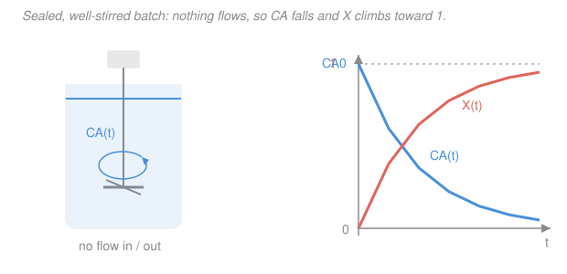

# Chemical Reaction Engineering · Lesson 1.4: The batch reactor

> ⏱ ~15 min · Module 1: Mole balances and rate laws · Builds on: [1.3 The general mole balance](01-03-general-mole-balance.md), [1.1 Rate of reaction and the rate law](01-01-rate-of-reaction-rate-law.md) · Unlocks: [2.1 Conversion and the design equations](02-01-conversion-design-equations.md), reactor sizing

## Why this matters

The batch reactor is the pot on the stove: charge it, seal it, stir, wait, drain. It's the workhorse of every teaching lab and of small or high-value production — pharmaceuticals, fermentations, specialty polymers — anywhere runs are small, recipes change often, or the product is too precious to risk in a continuous line. Because nothing enters or leaves once the clock starts, the batch is also the cleanest place to *measure* kinetics: whatever you see happening is the reaction and nothing else. And its entire design question collapses to a single number — **how long do I hold it to hit my target conversion?** That number, plus the time to fill, heat, drain, and clean, sets how many kilograms a day the vessel makes.

## The idea

In the flow reactors of the next two lessons, a molecule of A is converted as it *travels* — position tells you how far the reaction has gone. In a batch, nothing goes anywhere: the whole vessel is well-stirred, so the composition is uniform in space and the only thing that changes is the **clock**. Conversion is a function of *time*, not of position.

So think of it as watching a single beaker. At $t=0$ it's full of reactant. The rate law from [1.1](01-01-rate-of-reaction-rate-law.md) tells you how fast A disappears *right now*, given how much A is present *right now*. As A gets consumed, its concentration drops, the rate slows, and the whole thing decelerates — a fast opening rush that trails into a long, patient tail as the last few percent of A gets hard to find. The design job is to add up all those instantaneous rates until enough A is gone. That "adding up" is an integral, and for the common cases it has a clean closed form you can do on a napkin.

## The formal version

**The batch mole balance.** Take the general mole balance from [1.3](01-03-general-mole-balance.md),

$$\frac{dN_A}{dt}=F_{A0}-F_A+\int r_A\,dV,$$

and switch off the flows: a batch has no feed and no withdrawal, so $F_{A0}=F_A=0$. If the contents are well-mixed, $r_A$ (mol per L per time, the generation rate of A — negative for a reactant) is the same everywhere, so the integral is just $r_A V$ with $V$ the reacting volume (L):

$$\boxed{\;\frac{dN_A}{dt}=r_A V\;}$$

*In words: the moles of A in the tank change only because A is being consumed by reaction — nothing is flowing in to replenish it or out to drain it.* Here $N_A$ is moles of A (mol).

**In terms of conversion.** Define conversion $X$ = fraction of the initial A that has reacted, so $N_A=N_{A0}(1-X)$ where $N_{A0}$ is the moles charged at $t=0$. Then $dN_A=-N_{A0}\,dX$, and since $r_A$ is negative for a reactant we write the *disappearance* rate as $-r_A>0$:

$$N_{A0}\frac{dX}{dt}=-r_A V \qquad\Longrightarrow\qquad \boxed{\;t=N_{A0}\int_0^{X}\frac{dX}{-r_A\,V}\;}$$

*In words: the batch time to reach conversion $X$ is the initial charge times the accumulated "slowness" $1/(-r_AV)$ summed over the whole approach.* Where the reaction is fast $(-r_AV$ large$)$ the integrand is small and time barely ticks; near the finish, as $-r_A\to 0$, the integrand blows up — that's the punishing tail.

**Constant volume — the liquid workhorse.** Most liquid-phase batches barely change volume as they react, so $V$ is constant and $C_A=N_A/V=C_{A0}(1-X)$, with $C_{A0}=N_{A0}/V$ the initial concentration (mol/L). Now the integral is in concentration and the standard rate laws integrate cleanly:

- **First order,** $-r_A=kC_A=kC_{A0}(1-X)$, with $k$ in $\mathrm{min^{-1}}$:
$$t=\frac{1}{k}\int_0^X\frac{dX}{1-X}=\frac{1}{k}\ln\frac{1}{1-X}.$$
- **Second order,** $-r_A=kC_A^2=kC_{A0}^2(1-X)^2$, with $k$ in $\mathrm{L\,mol^{-1}\,min^{-1}}$:
$$t=\frac{1}{kC_{A0}}\int_0^X\frac{dX}{(1-X)^2}=\frac{1}{kC_{A0}}\,\frac{X}{1-X}.$$

*In words: these are exactly the **integrated rate laws** from [`physical-chemistry` 3.2](../../physical-chemistry/lessons/03-02-integrated-rate-laws-half-lives.md) — the constant-volume batch reactor is that chemistry experiment given a stirrer and a jacket.* Notice the first-order time depends only on $X$ (not on how concentrated you started), while the second-order time is stretched by $1/C_{A0}$ — dilute a bimolecular reaction and it drags.

**Variable volume (gases).** If the mixture is a gas and the reaction changes the total number of moles (or $T$ or $P$ shifts), $V$ moves as A converts and $C_A=C_{A0}(1-X)/(1+\varepsilon X)$ — you keep $V(X)$ inside the integral. We handle that expansion factor $\varepsilon$ in [2.3](02-03-stoichiometry-concentration-conversion.md); for now, constant-volume liquid is the default.

## Picture

The tank has no ports once sealed; on the right, first-order kinetics make $C_A(t)=C_{A0}e^{-kt}$ decay and $X(t)=1-e^{-kt}$ rise — mirror images, because every mole of A that vanishes is a mole converted.

## Worked examples

**Example 1 (first order — the clean log).** A liquid decomposition $A\to B$ is first order with $k=0.05\ \mathrm{min^{-1}}$, run constant-volume in a batch. How long to reach $X=0.90$?

$$t=\frac{1}{k}\ln\frac{1}{1-X}=\frac{1}{0.05}\ln\frac{1}{1-0.90}=20\ln 10 = 20(2.303)\approx 46\ \mathrm{min}.$$

*Check.* Units: $(1/k)=\mathrm{min}$, and $\ln(\cdot)$ is dimensionless, so $t$ is in minutes ✓. Sanity: $\ln 10\approx 2.3$, so you hold for a bit over two "e-folding" times $1/k=20$ min — reasonable, since $90\%$ gone is between $2$ and $3$ time constants. Note $C_{A0}$ never appeared: for first order the *time* to a given conversion is set by $k$ alone.

**Example 2 (second order — the heavy tail).** A liquid dimerization $2A\to B$ is second order with $k=0.05\ \mathrm{L\,mol^{-1}\,min^{-1}}$ and $C_{A0}=2\ \mathrm{mol/L}$, constant volume. Time to $X=0.80$?

$$t=\frac{1}{kC_{A0}}\frac{X}{1-X}=\frac{1}{(0.05)(2)}\cdot\frac{0.80}{1-0.80}=\frac{1}{0.1}\cdot 4 = 40\ \mathrm{min}.$$

Now push to $X=0.90$: $\dfrac{X}{1-X}=\dfrac{0.90}{0.10}=9$, so $t=10\cdot 9=90\ \mathrm{min}$. Getting the *last* $10$ points of conversion ($0.80\to0.90$) costs **50 more minutes** — more than the entire first $80\%$ took. That's the second-order tail: the rate $\propto C_A^2$ collapses as A depletes, so the reactor spends most of its life scraping out the final traces.

*Check.* Units: $kC_{A0}=\mathrm{L\,mol^{-1}\,min^{-1}\cdot mol\,L^{-1}}=\mathrm{min^{-1}}$, so $1/(kC_{A0})=\mathrm{min}$ and $X/(1-X)$ is dimensionless ✓. Contrast with Example 1: a first-order reaction's cost per fixed *fractional* step is a constant $\ln$-increment, but the second-order factor $X/(1-X)$ diverges — which is exactly why you rarely chase a bimolecular liquid reaction to $99\%$ in a batch; you cut it off and recover the rest.

## Watch out

- **You might think batch conversion depends on where you are in the tank.** It doesn't — the well-mixed batch is *uniform in space*; $X$ depends only on time. Position-dependent conversion is the flow reactors' story ([1.6 PFR](01-06-pfr-packed-bed.md)), where a molecule converts as it moves down the tube.
- **You might drop the volume from $-r_AV$.** The mole balance is on *moles*, so the rate (per volume) must be multiplied by $V$; $dN_A/dt=r_A$ is wrong dimensionally. Only after you divide through by a *constant* $V$ do you get the tidy $dC_A/dt=r_A$ — and that step is illegal for a gas whose volume moves.
- **You might read "batch time" as the whole story of throughput.** The reaction time $t$ is only part of the cycle; a real batch also spends **turnaround time** — filling, heating, cooling, draining, cleaning — during which the vessel makes nothing. Kilograms per day depends on $t+t_{\text{down}}$, not $t$ alone (see P3).

## One-liner

> A batch reactor converts in *time*, not space: kill the flows in the mole balance and $t=N_{A0}\!\int_0^X dX/(-r_AV)$ — a clean $\tfrac1k\ln\tfrac1{1-X}$ for first order, a tail-heavy $\tfrac{1}{kC_{A0}}\tfrac{X}{1-X}$ for second.

## Problems

**P1 (🟢)** A constant-volume liquid reaction is first order with $k=0.20\ \mathrm{min^{-1}}$. How long must the batch run to reach $X=0.75$?

**P2 (🟡)** A liquid reaction $2A\to$ products is second order with $k=0.10\ \mathrm{L\,mol^{-1}\,min^{-1}}$ and is charged at $C_{A0}=1.0\ \mathrm{mol/L}$, constant volume. Find the batch time to reach $X=0.50$ and to reach $X=0.90$. By what factor does the time grow, and why is it so much more than the factor by which $X$ grew?

**P3 (🔴)** The first-order reaction of Example 1 ($k=0.05\ \mathrm{min^{-1}}$) runs in a batch with a fixed turnaround of $t_{\text{down}}=30\ \mathrm{min}$ per cycle (fill, heat, drain, clean). Compare two operating targets over a 24-hour day: running each batch to $X=0.90$ versus to $X=0.95$. Which makes more product per day? (Assume the same charge $N_{A0}$ every batch; "product made" $\propto$ (batches per day) $\times X$.)

Solutions

**P1** First order, constant volume:
$$t=\frac{1}{k}\ln\frac{1}{1-X}=\frac{1}{0.20}\ln\frac{1}{0.25}=5\ln 4 = 5(1.386)\approx 6.9\ \mathrm{min}.$$
*Check.* $(1/k)=5$ min; $\ln 4\approx1.39$ dimensionless ⇒ minutes ✓. About $1.4$ time constants for $75\%$ gone — reasonable.

**P2** Second order, $1/(kC_{A0})=1/[(0.10)(1.0)]=10\ \mathrm{min}$.
$$t(0.50)=10\cdot\frac{0.50}{0.50}=10\ \mathrm{min},\qquad t(0.90)=10\cdot\frac{0.90}{0.10}=90\ \mathrm{min}.$$
Time grows by a factor of **9** while $X$ only went from $0.50$ to $0.90$ (a factor $1.8$). The mismatch is the $X/(1-X)$ tail: as $X\to1$ the denominator $(1-X)$ shrinks, so the *slowness* $1/(-r_A)\propto 1/(1-X)^2$ explodes. Half the conversion, but almost none of the time; the last stretch eats the clock.
*Check.* Units: $1/(kC_{A0})=\mathrm{min}$ ✓; ratios dimensionless. Sanity: same qualitative behavior as Example 2, just scaled by $C_{A0}$.

**P3** Reaction times (first order, Example 1's $k$):
$$t(0.90)=20\ln 10\approx 46.1\ \mathrm{min},\qquad t(0.95)=20\ln 20 = 20(2.996)\approx 59.9\ \mathrm{min}.$$
Cycle times (react + turnaround): $46.1+30=76.1$ min and $59.9+30=89.9$ min. Batches in $1440$ min:
$$\frac{1440}{76.1}\approx 18.9\to 18\ \text{batches at }X=0.90,\qquad \frac{1440}{89.9}\approx 16.0\to 16\ \text{batches at }X=0.95.$$
Product index (batches $\times X$): $18\times0.90=16.2$ versus $16\times0.95=15.2$. **Running to $X=0.90$ makes more product per day** — the extra $5$ points of conversion cost so much tail time (and forfeit whole batches) that total throughput falls. The unconverted A can be recovered and recharged; the *time* can't. This is the batch-design trade-off in one number: conversion target versus turnaround, decided on throughput, not on conversion alone.
*Check.* Units: minutes throughout; batch counts floored to whole runs. The result flips the naive intuition "higher conversion = more product," which is the point.

## Flashback

**From Lesson 1.3 (The general mole balance):** Starting from the general mole balance, specialize it to a *constant-volume* batch and use a first-order rate law to write the differential equation for $C_A(t)$ directly. Then, if $k=0.05\ \mathrm{min^{-1}}$ and at some instant $C_A=1.2\ \mathrm{mol/L}$, find $dC_A/dt$ at that instant. (Fresh variant — earlier you specialized the balance; here you push it to a concentration ODE and read off an instantaneous rate.)

Solution

Kill the flows in the general balance: $dN_A/dt=r_AV$. Constant $V$ lets you divide through, and $N_A/V=C_A$, so
$$\frac{dC_A}{dt}=r_A=-kC_A.$$
That's the first-order concentration ODE (whose solution is the $C_A=C_{A0}e^{-kt}$ in the figure). At the given instant,
$$\frac{dC_A}{dt}=-(0.05\ \mathrm{min^{-1}})(1.2\ \mathrm{mol/L})=-0.06\ \mathrm{mol\,L^{-1}\,min^{-1}}.$$
*Check.* Units: $\mathrm{min^{-1}\cdot mol\,L^{-1}}=\mathrm{mol\,L^{-1}\,min^{-1}}$ ✓; sign negative because A is being consumed ✓. Note this is the *instantaneous* rate — integrating it over the run is exactly what gives the batch-time formula.

## Connections

- **Backward:** this is the flow-free specialization of [1.3's general mole balance](01-03-general-mole-balance.md), fed by the rate law of [1.1](01-01-rate-of-reaction-rate-law.md). The constant-volume integrals *are* the integrated rate laws of [`physical-chemistry` 3.2](../../physical-chemistry/lessons/03-02-integrated-rate-laws-half-lives.md) — same math, now with a design purpose (time-to-target rather than a curve fit).
- **Forward:** [1.5 The CSTR](01-05-cstr.md) and [1.6 the PFR](01-06-pfr-packed-bed.md) apply the same general balance to *flow*, where conversion depends on position/residence rather than clock time; [2.1 Conversion and the design equations](02-01-conversion-design-equations.md) puts all three side by side. The variable-volume case waits for [2.3 Stoichiometry](02-03-stoichiometry-concentration-conversion.md).
- **Sideways:** the "space time" $\tau$ of a flow reactor plays the role the batch reaction time $t$ plays here — both answer "how long must A sit to convert this much?" A well-run PFR needs essentially the *same* holding time as a batch for the same kinetics; the CSTR needs more. That comparison is [2.2's Levenspiel plot](02-02-levenspiel-plots-reactors-in-series.md).
