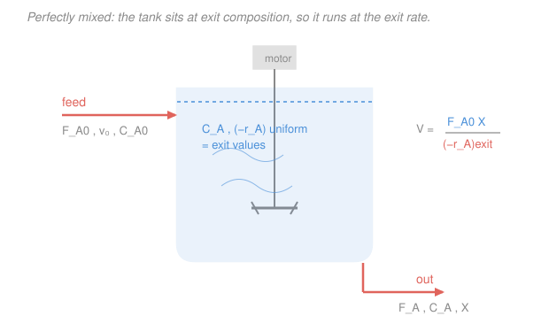

# Chemical Reaction Engineering · Lesson 1.5: The CSTR

> ⏱ ~15 min · Module 1: Rate Laws & the Ideal Reactors · Builds on: [1.3 The general mole balance](01-03-general-mole-balance.md), [1.4 The batch reactor](01-04-batch-reactor.md) · Unlocks: [2.2 Levenspiel plots](02-02-levenspiel-plots-reactors-in-series.md), [3.4 Multiple steady states](03-04-multiple-steady-states-cstr.md), Boss problem 1

## Why this matters

The batch reactor from Lesson 1.4 is a bucket: fill it, let it react, empty it, repeat. That is fine for a specialty chemical, but the world's ammonia, ethylene, and fuel don't come from buckets — they come from reactors that run continuously for years. The **CSTR** (continuous stirred-tank reactor) is the simplest continuous reactor: a stirred vat with feed pouring in one side and product flowing out the other. Its design equation is not an integral or a differential equation — it is a single line of algebra. That simplicity is bought at a real cost in reactor volume, and understanding that trade is the whole point of Boss problem 1.

## The idea

Picture a well-stirred tank with reactant flowing in the top and product draining out the bottom, steadily, forever. The stirrer is so vigorous that the instant a molecule of feed enters, it is smeared uniformly across the entire tank. **The tank has one composition, and the exit stream carries exactly that composition** — whatever the fluid looks like inside is what pours out.

Here is the consequence that makes the CSTR both easy and expensive. Because the inside is uniform and equals the exit, the concentration everywhere is the *low, already-reacted* exit concentration. In a batch or plug-flow reactor the fluid starts rich and fast and only slows as it converts; in a CSTR every molecule is instantly diluted down to the final, dilute, slow condition. The reaction runs at the *exit* rate throughout the whole volume — the slowest rate the reactor will ever see. To get the same throughput at that slow rate, you simply need a bigger tank.

"Steady state" is the other half of the idea: nothing inside changes with time, so accumulation is zero. What flows in that doesn't flow out has been eaten by the reaction — no more, no less.

## The formal version

Start from the general mole balance on species $A$ (Lesson 1.3), with $F_{A0}$ the molar feed rate in (mol/s), $F_A$ the molar rate out (mol/s), $r_A$ the rate of generation per volume (mol/(s·L), negative for a reactant), and $V$ the reactor volume (L):

$$\frac{dN_A}{dt} = F_{A0} - F_A + \int r_A\,dV.$$

Two specializations collapse it. **Steady state** kills the accumulation term: $\dfrac{dN_A}{dt}=0$. **Perfect mixing** makes $r_A$ the same everywhere, so the integral is just $r_A V$ evaluated at the (uniform, = exit) condition:

$$0 = F_{A0} - F_A + r_A V.$$

In words: in minus out plus generation equals zero. Solve for volume, and write the rate as the positive quantity $(-r_A)$ (a reactant disappears, so $r_A<0$):

$$\boxed{\,V = \frac{F_{A0} - F_A}{-r_A}\,}$$

Now bring in **conversion** $X$, the fraction of the fed $A$ that has reacted (dimensionless), so $F_A = F_{A0}(1-X)$ and $F_{A0}-F_A = F_{A0}X$:

$$\boxed{\,V = \frac{F_{A0}\,X}{(-r_A)_{\text{exit}}}\,}$$

In words: reactor volume equals the molar rate of $A$ consumed, divided by the rate per volume at which it is consumed — and that rate is read off at the *exit* conversion. This is **algebra, not calculus**: no integral (unlike the PFR of Lesson 1.6), no time derivative (unlike batch). The subscript "exit" is the entire personality of the CSTR — the design equation is an integral over conversion in a PFR but a single evaluation at $X$ here.

**Space time.** Define $v_0$ as the volumetric feed rate (L/s) and

$$\tau \equiv \frac{V}{v_0}.$$

In words: $\tau$ (units of time) is how long it takes to process one reactor-volume of feed — and, for a constant-density (liquid) stream, it is the **mean residence time**, the average time a molecule spends inside. Using $F_{A0}=C_{A0}v_0$, the design equation rearranges to $\tau = \dfrac{C_{A0}X}{(-r_A)_{\text{exit}}}$. For a **liquid first-order** reaction, $-r_A = kC_A = kC_{A0}(1-X)$, and the $C_{A0}$ cancels:

$$\boxed{\,\tau = \frac{X}{k\,(1-X)}\,}$$

with $k$ the rate constant (1/s). Notice $\tau\to\infty$ as $X\to 1$: chasing the last few percent of conversion in a CSTR costs unbounded volume, because the rate you're stuck at goes to zero.

## Picture

The dashed swirls are the point: the stirrer erases any gradient, so the concentration inside is flat and equal to the exit. The rate $(-r_A)$ is therefore evaluated once, at the exit $X$ — the lowest rate anywhere in the process.

## Worked examples

### Example 1 — Boss problem 1(a): sizing a CSTR

A liquid-phase first-order reaction $A\to B$ runs with $k = 0.23\ \mathrm{min^{-1}}$, fed at $v_0 = 10\ \mathrm{L/min}$ and $C_{A0} = 2\ \mathrm{mol/L}$, to a conversion $X = 0.80$. Find the CSTR volume.

**Feed rate.** $F_{A0} = C_{A0}\,v_0 = (2\ \mathrm{mol/L})(10\ \mathrm{L/min}) = 20\ \mathrm{mol/min}.$

**Exit rate.** The rate is evaluated at the exit condition, where $C_A = C_{A0}(1-X) = 2(1-0.80) = 0.40\ \mathrm{mol/L}$:
$$(-r_A)_{\text{exit}} = k\,C_A = (0.23\ \mathrm{min^{-1}})(0.40\ \mathrm{mol/L}) = 0.092\ \mathrm{mol/(L\cdot min)}.$$

**Volume.**
$$V = \frac{F_{A0}X}{(-r_A)_{\text{exit}}} = \frac{(20)(0.80)}{0.092} = \frac{16}{0.092} \approx 174\ \mathrm{L}.$$

Equivalently, via the clean liquid-first-order form $V = \dfrac{v_0}{k}\dfrac{X}{1-X} = \dfrac{10}{0.23}\cdot\dfrac{0.8}{0.2} = 43.5\times 4 \approx 174\ \mathrm{L}$.

**Units/sanity check.** $\dfrac{\mathrm{mol/min}}{\mathrm{mol/(L\cdot min)}} = \mathrm{L}$ — a volume, good. And 174 L is a modest tank for a fast liquid reaction. Hold onto this number: in Lesson 1.6 the *same* reaction in a PFR needs only $\approx 70$ L, and Boss problem 1 asks you to explain that 2.5× gap. The answer is already in this lesson — the CSTR is stuck at the slow exit rate; the PFR gets to use the high inlet rate over its front end.

### Example 2 — space time and residence time

For the reactor above, find $\tau$ and interpret it.

$$\tau = \frac{V}{v_0} = \frac{174\ \mathrm{L}}{10\ \mathrm{L/min}} = 17.4\ \mathrm{min}.$$

Check against the closed form: $\tau = \dfrac{X}{k(1-X)} = \dfrac{0.8}{0.23\times 0.2} = \dfrac{0.8}{0.046} = 17.4\ \mathrm{min}.$ Consistent.

**Interpretation.** The average molecule of feed sits in the tank about **17 minutes** before draining out — that is the mean residence time (this is a constant-density liquid, so $\tau$ *is* the mean residence time). Contrast that with the batch reactor of Lesson 1.4: to hit $X=0.80$ in a first-order batch you'd need $t = \frac{1}{k}\ln\frac{1}{1-X} = \frac{1}{0.23}\ln 5 = 7.0\ \mathrm{min}$ of reaction time. The CSTR molecule spends **more than twice** as long inside to reach the same conversion — the same volume penalty as before, now read as a time. In a CSTR most molecules experience only the sluggish exit rate; a batch molecule got to enjoy the fast early rate. Same physics, two dialects.

## Watch out

- **You might think** the reaction rate in a CSTR is evaluated at the inlet or at some average concentration — **but actually** it is evaluated entirely at the *exit* concentration. Perfect mixing means the inlet feed is instantly diluted to exit conditions; there is no gradient to average over. Plugging $C_{A0}$ (the feed concentration) into the rate law is the single most common CSTR error and it undersizes the reactor badly.
- **You might think** the CSTR being "simple algebra" makes it the cheap choice — **but actually** for normal kinetics (rate falling as $X$ rises) it needs *more* volume than a PFR for the same conversion, precisely because it runs at the lowest rate. Simplicity of the equation is not economy of the reactor. (The one time a CSTR wins on volume: autocatalytic or otherwise rate-*increasing* kinetics — a Module 2 curiosity.)
- **You might think** space time $\tau=V/v_0$ is always the mean residence time — **but actually** they coincide only when the volumetric flow is constant (liquids, or a gas with no mole change and no $T$/$P$ change). For a gas reaction that changes the number of moles (Lesson 2.3), $v$ varies through the reactor and $\tau\neq$ mean residence time. Keep them mentally separate.

## One-liner

> A CSTR runs its entire volume at the low exit rate, so sizing it is one line of algebra — $V = F_{A0}X/(-r_A)_{\text{exit}}$ — and the bill is a bigger tank.

## Problems

**P1 (🟢)** A liquid reaction $A\to$ products is first-order with $k = 0.5\ \mathrm{min^{-1}}$. Feed: $v_0 = 4\ \mathrm{L/min}$, $C_{A0} = 1.5\ \mathrm{mol/L}$. You want $X = 0.60$ in a single CSTR. Find $F_{A0}$, the exit rate $(-r_A)$, the volume $V$, and the space time $\tau$.

**P2 (🟡)** Keep everything from P1 but push the target to $X = 0.90$. By what factor does the required CSTR volume grow relative to $X=0.60$? Explain the number in one sentence using the shape of $\tau = X/[k(1-X)]$.

**P3 (🔴)** A liquid reaction is *second*-order: $-r_A = kC_A^2$ with $k = 0.10\ \mathrm{L/(mol\cdot min)}$, $C_{A0}=2\ \mathrm{mol/L}$, $v_0 = 5\ \mathrm{L/min}$, target $X=0.70$. Derive the CSTR space-time expression $\tau(X)$ for second-order liquid kinetics from scratch (don't reuse the first-order formula), then compute $V$.

Solutions

**P1** Feed: $F_{A0}=C_{A0}v_0 = 1.5\times 4 = 6\ \mathrm{mol/min}$. Exit concentration $C_A=C_{A0}(1-X)=1.5(0.4)=0.60\ \mathrm{mol/L}$, so $(-r_A)_{\text{exit}}=kC_A=0.5\times0.60=0.30\ \mathrm{mol/(L\cdot min)}$. Volume $V=\dfrac{F_{A0}X}{(-r_A)}=\dfrac{6\times0.6}{0.30}=\dfrac{3.6}{0.30}=12\ \mathrm{L}$. Space time $\tau=V/v_0=12/4=3\ \mathrm{min}$ (check: $\tau=\frac{X}{k(1-X)}=\frac{0.6}{0.5\times0.4}=3\ \mathrm{min}$ ✓). Units: $\frac{\mathrm{mol/min}}{\mathrm{mol/(L\cdot min)}}=\mathrm L$ ✓.

**P2** Volume scales with $\dfrac{X}{1-X}$ (the $F_{A0}$, $C_{A0}$, $k$, $v_0$ are unchanged). At $X=0.90$: $\frac{0.9}{0.1}=9$. At $X=0.60$: $\frac{0.6}{0.4}=1.5$. Ratio $=9/1.5 = \mathbf{6\times}$. In words: because $\tau=\frac{X}{k(1-X)}$ has $(1-X)$ in the denominator, the required volume blows up as $X\to1$ — the last stretch of conversion is disproportionately expensive in a CSTR since the exit rate it must run at is heading to zero. (For completeness, $V_{0.90}=\frac{v_0}{k}\frac{X}{1-X}=\frac{4}{0.5}(9)=72\ \mathrm L$, versus $12\ \mathrm L$ at $X=0.6$.)

**P3** Start from the design equation $V=\dfrac{F_{A0}X}{(-r_A)_{\text{exit}}}$ and $\tau=V/v_0=\dfrac{C_{A0}X}{(-r_A)_{\text{exit}}}$. For second order, the exit rate is $(-r_A)=kC_A^2=k\,C_{A0}^2(1-X)^2$. So
$$\tau=\frac{C_{A0}X}{k\,C_{A0}^2(1-X)^2}=\frac{X}{k\,C_{A0}(1-X)^2}.$$
Plug in: $\tau=\dfrac{0.70}{(0.10)(2)(0.30)^2}=\dfrac{0.70}{0.10\times2\times0.09}=\dfrac{0.70}{0.018}\approx 38.9\ \mathrm{min}$. Then $V=\tau\,v_0=38.9\times5\approx 194\ \mathrm L$. Sanity: the $(1-X)^2$ in the denominator makes second-order kinetics even more punishing at high $X$ than first order — a big tank for a modest 70% conversion, as expected.

## Flashback

**From Lesson 1.4 (The batch reactor):** A liquid first-order reaction $A\to B$ with $k=0.40\ \mathrm{min^{-1}}$ runs in a constant-volume batch reactor. Starting from pure $A$, how long must the batch react to reach $X=0.75$? (Then, for contrast, note whether a CSTR would need a longer or shorter mean residence time to hit the same $X$.)

Solution

For a constant-volume first-order batch, $t=\dfrac{1}{k}\ln\dfrac{1}{1-X}=\dfrac{1}{0.40}\ln\dfrac{1}{0.25}=2.5\times\ln4=2.5\times1.386=\mathbf{3.47\ min}$.

Contrast: a CSTR at the same $X=0.75$ would need $\tau=\dfrac{X}{k(1-X)}=\dfrac{0.75}{0.40\times0.25}=\dfrac{0.75}{0.10}=7.5\ \mathrm{min}$ — more than double the batch time. Same lesson as Example 2: the batch molecule rides the fast early rate as it converts, while every CSTR molecule is stuck at the slow exit rate.

## Connections

- **Backward:** this is the general mole balance of [1.3](01-03-general-mole-balance.md) with two terms deleted — accumulation (steady state) and the spatial integral (perfect mixing collapses $\int r_A\,dV$ to $r_A V$). Compare with [1.4 batch](01-04-batch-reactor.md), which instead deletes the flow terms and keeps the time derivative.
- **Forward:** the "runs at the exit rate" fact becomes a *rectangle* on the [Levenspiel plot](02-02-levenspiel-plots-reactors-in-series.md) of $F_{A0}/(-r_A)$ vs. $X$ (width $X$, height evaluated at the exit) — versus the PFR's *area under the curve* — which is the cleanest visual proof of the CSTR volume penalty and of when to sequence reactors. The CSTR design equation is also the mole-balance half of the [multiple-steady-state analysis](03-04-multiple-steady-states-cstr.md), where the exit rate itself depends on temperature and the algebra suddenly has three solutions.
- **Sideways:** the space time $\tau=V/v_0$ is the same quantity that becomes the mean of the residence-time distribution in [4.5](04-05-residence-time-distribution.md); an ideal CSTR turns out to have the exponential RTD $E(t)=\frac{1}{\tau}e^{-t/\tau}$, the mathematical signature of "instantly mixed, then randomly drained."
