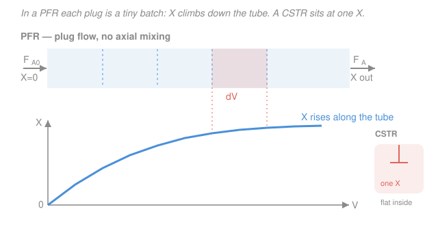

# Chemical Reaction Engineering · Lesson 1.6: The PFR & the packed-bed reactor

> ⏱ ~15 min · Module 1: Rate Laws & the Ideal Reactors · Builds on: [general mole balance](01-03-general-mole-balance.md), [the CSTR](01-05-cstr.md) · Unlocks: [conversion & design equations](02-01-conversion-design-equations.md), [pressure drop & Ergun](02-04-isothermal-design-pressure-drop-ergun.md), Boss problem 1(b)

## Why this matters

The CSTR was one number: mix everything, react at the exit rate, solve algebra. But most industrial reactors are *tubes* — feed pours in one end, product leaves the other, and the mixture never gets stirred back on itself. That single change turns the design equation from algebra into an **integral**, and it makes the tube *smaller* than a stirred tank for the same job. This is the reactor you reach for when you want the reaction to run at its fastest as long as possible — and the catalytic version of it (the packed bed) is where a huge fraction of the world's chemicals are actually made.

## The idea

Picture a garden hose full of reacting liquid, flowing steadily. Slice the flow into thin discs — "plugs" — stacked nose to tail. In an ideal **plug-flow reactor (PFR)** each plug slides straight down the tube and **never mixes with the plug ahead or behind it**. So a plug is just a little **batch reactor on a conveyor belt**: the longer it has been in the tube, the more it has reacted.

That's the whole picture. At the inlet the reactant is fresh and concentrated, so the reaction *screams*. As a plug moves downstream, reactant burns off, the rate sags, and conversion climbs toward its target. Conversion is not one number for the whole reactor — it's a **profile that grows along the length**. Contrast the CSTR, where a stirrer smears everything to a single exit concentration and the *entire* volume plods along at that one slow exit rate.

The consequence you should feel before we prove it: because the PFR spends its early length at high rates, it gets more conversion per liter. For the same conversion, **a PFR needs less volume than a CSTR** (for ordinary kinetics where rate drops as reactant is consumed).

## The formal version

Take the general mole balance from [1.3](01-03-general-mole-balance.md), $\dfrac{dN_A}{dt}=F_{A0}-F_A+\displaystyle\int r_A\,dV$, and specialize it. Steady state kills $dN_A/dt$. But unlike the CSTR we **can't** treat the whole volume as uniform — the rate varies down the tube — so we balance a **differential slice** of volume $dV$ instead. Across that slice:

$$F_A\big|_V - F_A\big|_{V+dV} + r_A\,dV = 0 \quad\Longrightarrow\quad \frac{dF_A}{dV}=r_A.$$

**In words:** as you march one slice further down the tube, the molar flow of $A$ changes by exactly the rate at which $A$ is consumed in that slice.

Now write flow in terms of conversion $X$ (the fraction of fed $A$ that has reacted): $F_A=F_{A0}(1-X)$, so $dF_A=-F_{A0}\,dX$. With $r_A=-(-r_A)$,

$$\boxed{\;\frac{dX}{dV}=\frac{-r_A}{F_{A0}}\;}\qquad\Longrightarrow\qquad \boxed{\;V=F_{A0}\int_0^X\frac{dX}{-r_A}\;}$$

- $V$ — reactor volume, L (or m³)
- $F_{A0}=C_{A0}v_0$ — molar feed rate of $A$, mol/min
- $X$ — conversion, dimensionless fraction (0 to target)
- $-r_A$ — rate of consumption of $A$, mol/(L·min); it **depends on $X$**, which is why this is an integral and not a product.

**In words:** the volume is the feed rate times the accumulated "difficulty" $1/(-r_A)$ summed over every increment of conversion. Because $-r_A$ shrinks as $X$ grows, later increments cost more volume — the integrand climbs as you approach your target.

**The clean liquid first-order case.** For a liquid (constant $v_0$, so $C_A=C_{A0}(1-X)$) with $-r_A=kC_A=kC_{A0}(1-X)$:

$$V=F_{A0}\int_0^X\frac{dX}{kC_{A0}(1-X)}=\frac{v_0}{k}\int_0^X\frac{dX}{1-X}=\frac{v_0}{k}\ln\frac{1}{1-X}.$$

using $F_{A0}/C_{A0}=v_0$. That $\ln\frac{1}{1-X}$ is the PFR fingerprint — compare the CSTR's $\dfrac{X}{1-X}$ from [1.5](01-05-cstr.md).

**The packed-bed reactor (PBR).** Now line the tube with solid catalyst pellets. The reaction happens *on the catalyst surface*, so the natural measure of "how much reactor" is not volume but **mass of catalyst** $W$ (kg). Rates are quoted **per unit mass of catalyst**, written $-r_A'$ with units mol/(kg·s). The derivation is identical — balance a slice of catalyst weight $dW$ — giving

$$\frac{dX}{dW}=\frac{-r_A'}{F_{A0}}\qquad\Longrightarrow\qquad W=F_{A0}\int_0^X\frac{dX}{-r_A'}.$$

**In words:** same equation, catalyst weight instead of volume, a per-mass rate instead of per-volume. If the bed has bulk density $\rho_b$ (kg catalyst per L of bed), the two are tied by $W=\rho_b V$ and $-r_A'=(-r_A)/\rho_b$. We kept $-r_A'$ constant down the tube here; in [2.4](02-04-isothermal-design-pressure-drop-ergun.md) the gas loses pressure as it squeezes through the packing, $-r_A'$ falls along $W$, and the Ergun equation joins the party.

## Picture

The blue curve is the point: $X$ rises steeply where the feed is fresh and flattens as reactant runs low. The coral slice $dV$ is the control volume the design equation balances. The CSTR at right has no profile at all — one conversion, everywhere inside.

## Worked examples

### Example 1 — Boss problem 1(b): the PFR for the first-order liquid reaction

Same reaction we sized as a CSTR in [1.5](01-05-cstr.md): liquid-phase $A\to B$, $k=0.23\ \mathrm{min^{-1}}$, $v_0=10\ \mathrm{L/min}$, $C_{A0}=2\ \mathrm{mol/L}$, target $X=0.80$. Find the PFR volume, and explain the CSTR/PFR ratio.

**Setup.** $F_{A0}=C_{A0}v_0=2\times10=20\ \mathrm{mol/min}$. First-order liquid, so use the fingerprint formula directly:

$$V=\frac{v_0}{k}\ln\frac{1}{1-X}=\frac{10}{0.23}\,\ln\frac{1}{1-0.80}=43.5\,\ln 5.$$

$\ln 5=1.609$, so $V=43.5\times1.609\approx 70\ \mathrm{L}$.

**The comparison.** The CSTR for the identical job was $V_{\text{CSTR}}=\dfrac{v_0}{k}\dfrac{X}{1-X}=43.5\times\dfrac{0.8}{0.2}=43.5\times4\approx174\ \mathrm{L}$. So

$$\frac{V_{\text{CSTR}}}{V_{\text{PFR}}}=\frac{174}{70}\approx 2.5.$$

**Why 2.5×?** Both reactors process the same 20 mol/min to 80% conversion. The CSTR is instantly diluted to the *exit* condition, $C_A=C_{A0}(1-0.8)=0.4\ \mathrm{M}$, so its *entire* 174 L reacts at that one sluggish rate, $-r_A=0.23\times0.4=0.092\ \mathrm{mol/(L\cdot min)}$. The PFR instead runs its inlet section at the *full* fresh rate $-r_A=0.23\times2=0.46\ \mathrm{mol/(L\cdot min)}$ — five times faster — and only slows to the exit rate at the very end. Averaging over that high-rate early stretch, the PFR clears the same conversion in 2.5× less volume. Graphically (you'll see this in [2.2](02-02-levenspiel-plots-reactors-in-series.md)): the PFR is the *area under* the $F_{A0}/(-r_A)$ curve; the CSTR is the *full rectangle* out to the exit value — and the rectangle always swallows the area for normal kinetics.

**Units/sanity check.** $[v_0/k]=\dfrac{\mathrm{L/min}}{\mathrm{1/min}}=\mathrm{L}$ ✓, and $\ln$ is dimensionless, so $V$ is in liters. 70 L $<$ 174 L, as the theory demands. Both far exceed the volume of an unstirred slug, as they should for 80% conversion of a moderately slow reaction.

### Example 2 — from PFR volume to catalyst weight

The same first-order chemistry is now run over a solid catalyst in a packed bed of bulk density $\rho_b=0.80\ \mathrm{kg/L}$. Two questions: (a) if a design calls for the equivalent of $V=70\ \mathrm{L}$ of reacting volume, how much catalyst is that? (b) set up the weight integral from scratch when the rate is given per mass, $-r_A'=k'C_A$ with $k'=0.29\ \mathrm{L/(kg\cdot min)}$.

**(a)** Bulk density converts volume to weight directly: $W=\rho_b V=0.80\ \mathrm{kg/L}\times70\ \mathrm{L}=56\ \mathrm{kg}$ of catalyst.

**(b)** Start from the PBR design equation and substitute the per-mass rate law. For a liquid, $C_A=C_{A0}(1-X)$:

$$W=F_{A0}\int_0^X\frac{dX}{-r_A'}=F_{A0}\int_0^X\frac{dX}{k'C_{A0}(1-X)}=\frac{v_0}{k'}\int_0^X\frac{dX}{1-X}=\frac{v_0}{k'}\ln\frac{1}{1-X}.$$

With $v_0=10\ \mathrm{L/min}$, $k'=0.29\ \mathrm{L/(kg\cdot min)}$, $X=0.80$: $W=\dfrac{10}{0.29}\ln5=34.5\times1.609\approx 55.5\ \mathrm{kg}$.

**Units/sanity check.** $[v_0/k']=\dfrac{\mathrm{L/min}}{\mathrm{L/(kg\cdot min)}}=\mathrm{kg}$ ✓. And it lands within rounding of the 56 kg from part (a) — as it must, since $k'=k/\rho_b=0.23/0.80\approx0.29$ makes the two problems the same physics wearing different units.

## Watch out

- **You might think** the PFR design equation gives you a single "reactor rate" to divide by, like the CSTR. **Actually** the rate changes continuously down the tube, so you must *integrate* $1/(-r_A)$ over $X$ — you can't just evaluate $-r_A$ at one point. Using the exit rate (CSTR-style) overshoots the true PFR volume badly.
- **You might think** volume and catalyst weight are interchangeable labels. **Actually** they measure different things — $V$ is open space, $W$ is solid mass — and are linked only through the bulk density $\rho_b$. Keep your rate law's units honest: $-r_A$ is per volume (mol/L·s), $-r_A'$ is per mass (mol/kg·s). Mixing them silently is the most common PBR error.
- **You might think** "no axial mixing" means "no mixing at all." **Actually** plug flow assumes *perfect* mixing *within* each thin slice (uniform across the cross-section) but *zero* mixing *between* slices along the flow. It's the mirror image of the CSTR, which mixes everything everywhere. Real tubes live between the two — that's [4.5](04-05-residence-time-distribution.md)'s residence-time distributions.

## One-liner

> A PFR is a batch reactor stretched along a pipe: conversion is a profile that climbs from inlet to outlet, so you integrate $1/(-r_A)\,dX$ — and because the front end runs fast, the tube beats the stirred tank on volume.

## Problems

**P1 (🟢)** A liquid first-order reaction with $k=0.5\ \mathrm{min^{-1}}$ is fed at $v_0=4\ \mathrm{L/min}$. What PFR volume reaches $X=0.90$? What CSTR volume reaches the same conversion, and what is the ratio?

**P2 (🟡)** A gas-phase reaction on catalyst obeys $-r_A'=k'C_A$ (treat $C_A=C_{A0}(1-X)$, i.e. ignore volume change for now). With $F_{A0}=5\ \mathrm{mol/s}$, $C_{A0}=0.1\ \mathrm{mol/L}$, and $k'=2\ \mathrm{L/(kg\cdot s)}$, find the catalyst weight $W$ for $X=0.70$. If the bed's bulk density is $\rho_b=1.2\ \mathrm{kg/L}$, what bed *volume* is that?

**P3 (🔴, optional)** For the same first-order liquid kinetics, at what conversion $X^*$ is the CSTR exactly **twice** the volume of the PFR? (Set $\dfrac{X/(1-X)}{\ln[1/(1-X)]}=2$ and solve numerically.) What does this tell you about *when* the tank-vs-tube choice matters most?

Solutions

**P1** First-order liquid, so use the fingerprints. PFR: $V=\dfrac{v_0}{k}\ln\dfrac{1}{1-X}=\dfrac{4}{0.5}\ln\dfrac{1}{0.10}=8\ln10=8\times2.303\approx 18.4\ \mathrm{L}$. CSTR: $V=\dfrac{v_0}{k}\dfrac{X}{1-X}=8\times\dfrac{0.9}{0.1}=8\times9=72\ \mathrm{L}$. Ratio $=72/18.4\approx 3.9$. Units: $[v_0/k]=$ L ✓. The ratio has ballooned past the 2.5 we saw at $X=0.8$ — chasing the last few percent of conversion punishes the CSTR far more than the PFR, because the tank's whole volume is stuck at the vanishing exit rate.

**P2** PBR design equation with per-mass first-order rate:
$$W=F_{A0}\int_0^X\frac{dX}{k'C_{A0}(1-X)}=\frac{F_{A0}}{k'C_{A0}}\ln\frac{1}{1-X}=\frac{5}{2\times0.1}\ln\frac{1}{0.30}=25\ln(3.33).$$
$\ln(3.33)=1.204$, so $W=25\times1.204\approx 30.1\ \mathrm{kg}$. Bed volume: $V=W/\rho_b=30.1/1.2\approx 25.1\ \mathrm{L}$. Units: $[F_{A0}/(k'C_{A0})]=\dfrac{\mathrm{mol/s}}{\mathrm{L/(kg\cdot s)}\cdot\mathrm{mol/L}}=\mathrm{kg}$ ✓.

**P3** We need $\dfrac{X/(1-X)}{\ln[1/(1-X)]}=2$. Let $u=1-X$; the equation is $\dfrac{(1-u)/u}{-\ln u}=2$, i.e. $\dfrac{1-u}{u}=-2\ln u$. Try values: at $X=0.75$ ($u=0.25$): LHS ratio $=\dfrac{3}{\ln4}=\dfrac{3}{1.386}=2.16$. At $X=0.70$ ($u=0.30$): $\dfrac{2.333}{1.204}=1.94$. At $X=0.72$ ($u=0.28$): $\dfrac{2.571}{1.273}=2.02$. So $X^*\approx 0.72$. **Interpretation:** below ~72% conversion the CSTR is less than double the PFR — the geometry choice is a modest penalty. Above it, the gap widens fast (P1 hit 3.9× at 90%). The tank-vs-tube decision matters *most* when you demand high conversion; for low conversion the cheaper-to-build, easier-to-cool CSTR is often the sensible pick.

## Flashback

**From Lesson 1.5 (the CSTR):** A liquid second-order reaction $A\to$ products, $-r_A=kC_A^2$ with $k=0.10\ \mathrm{L/(mol\cdot min)}$, runs in a CSTR. Feed: $v_0=5\ \mathrm{L/min}$, $C_{A0}=3\ \mathrm{mol/L}$, target $X=0.60$. Find the reactor volume. *(Fresh variant: second order, not first — so the exit rate uses $C_A^2$.)*

Solution

The CSTR design equation is $V=\dfrac{F_{A0}X}{(-r_A)_{\text{exit}}}$, evaluated at the *exit* conversion. $F_{A0}=C_{A0}v_0=3\times5=15\ \mathrm{mol/min}$. Exit concentration $C_A=C_{A0}(1-X)=3(0.4)=1.2\ \mathrm{mol/L}$, so the exit rate is $-r_A=kC_A^2=0.10\times(1.2)^2=0.10\times1.44=0.144\ \mathrm{mol/(L\cdot min)}$. Then

$$V=\frac{F_{A0}X}{(-r_A)_{\text{exit}}}=\frac{15\times0.60}{0.144}=\frac{9}{0.144}\approx 62.5\ \mathrm{L}.$$

Units: $\dfrac{\mathrm{mol/min}}{\mathrm{mol/(L\cdot min)}}=\mathrm{L}$ ✓. Key retrieval point: the CSTR always evaluates the rate at the single exit condition — the only change for second order is squaring that exit concentration.

## Connections

- **Backward:** this is the same [general mole balance](01-03-general-mole-balance.md) as everything else in Module 1 — here the slice is a differential $dV$ (or $dW$), which is why the PFR and PBR alone among the ideal reactors produce *integrals*. It shares its $\int dX/(-r_A)$ structure with the [batch reactor](01-04-batch-reactor.md)'s $\int dX/[(-r_A)V]$: a plug in a PFR literally *is* a batch running on the clock $t=V/v_0$.
- **Forward:** [2.1](02-01-conversion-design-equations.md) collects all four design equations side by side; [2.2](02-02-levenspiel-plots-reactors-in-series.md) turns "area under $F_{A0}/(-r_A)$" into a graphical sizing tool and shows when to *sequence* a CSTR then a PFR; [2.4](02-04-isothermal-design-pressure-drop-ergun.md) revisits the PBR when pressure drop makes $-r_A'$ fall along the bed — the Ergun equation.
- **Sideways:** the per-mass catalytic rate $-r_A'$ opens Module 4. When the reactant has to *diffuse into* a porous pellet before it can react, the effective $-r_A'$ is throttled by the Thiele modulus and effectiveness factor — the very same objects derived in [transport-phenomena 4.3](../../transport-phenomena/lessons/04-03-diffusion-with-reaction-thiele.md). There you *derived* $\eta(\phi)$; [here in 4.3](04-03-internal-diffusion-thiele-effectiveness.md) you use it to size a real catalytic reactor.
