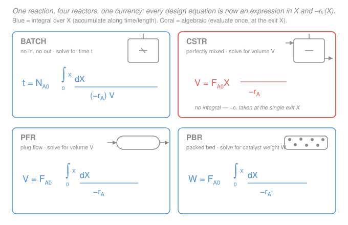

# Chemical Reaction Engineering · Lesson 2.1: Conversion & the design equations

> ⏱ ~15 min · Module 2: Conversion, Sizing & Multiple Reactions · Builds on: [1.4 The batch reactor](01-04-batch-reactor.md), [1.5 The CSTR](01-05-cstr.md), [1.6 The PFR & packed-bed reactor](01-06-pfr-packed-bed.md) · Unlocks: [2.2 Levenspiel plots](02-02-levenspiel-plots-reactors-in-series.md), [2.3 Stoichiometry: C(X)](02-03-stoichiometry-concentration-conversion.md)

## Why this matters

In Module 1 you derived four design equations that looked like four different animals — one had an integral over time, one was pure algebra, two were integrals over volume. That is a nuisance: to size a reactor you first have to remember *which* reactor you're holding. This lesson collapses all four into a **single bookkeeping variable, the conversion $X$**, and the payoff is enormous — every reactor becomes the *same* expression built from $X$ and one function, $-r_A(X)$. Size a CSTR or a PFR or a batch charge and you are now doing the *same* calculation with the integral turned on or off. Conversion is the shared currency the rest of this course trades in: Levenspiel plots ([2.2](02-02-levenspiel-plots-reactors-in-series.md)) are just pictures of these equations, and the energy balance in Module 3 rides on $X$ too.

## The idea

Instead of tracking the messy absolute amount of $A$ left, track **the fraction of $A$ that has reacted**. If 100 mol of $A$ walk in and 80 have reacted, you're at $X = 0.80$ — one clean dimensionless number that runs from $0$ (nothing has happened) to $1$ (complete conversion), no matter the feed size, the units, or the reactor. "How much reactant is left" becomes "$1-X$ of it."

Why does this simplify everything? Because the whole job of a reactor is to *push $X$ up*, and it does so at the local reaction rate $-r_A$. So the design question — "how big / how long?" — is always the same shape: **accumulate the reaction rate until you've bought the conversion you want.** A batch reactor buys $X$ over *time*; a flow reactor buys it over *volume*. The only real difference between the four reactors is *how* the running total is kept:

- A **flow reactor with a gradient** (PFR, PBR, and batch-over-time) sweeps $X$ from 0 up to the target, and the rate changes the whole way — so you **integrate** over $X$.
- A **CSTR** is perfectly mixed, so the entire vessel sits at the single exit conversion, at the single (low) exit rate — no gradient, no integral, just **algebra**.

That integral-versus-algebra split is the one distinction worth memorizing. Everything else is the same equation.

## The formal version

**Definition of conversion.** For the basis reactant $A$,

$$X = \frac{\text{moles of } A \text{ reacted}}{\text{moles of } A \text{ fed}}.$$

*In words: $X$ is the fraction of the incoming $A$ that has been consumed.* In a **batch** reactor "fed" means initially charged, so moles remaining are $N_A = N_{A0}(1-X)$, with $N_{A0}$ the initial moles (mol). In a **flow** reactor it is a rate: the molar feed rate is $F_{A0}$ (mol/s), and the molar flow leaving is $F_A = F_{A0}(1-X)$. The feed rate ties to concentration by

$$F_{A0} = C_{A0}\,v_0,$$

where $C_{A0}$ is the inlet concentration (mol/L) and $v_0$ the inlet volumetric flow (L/s). Every design equation from Module 1, rewritten with these substitutions, becomes:

| Reactor | Design equation in $X$ | Solve for | Integral or algebra? |
|---|---|---|---|
| **Batch** | $\displaystyle t = N_{A0}\int_0^X \frac{dX}{-r_A\,V}$ | time $t$ | integral (over time, via $X$) |
| **CSTR** | $\displaystyle V = \frac{F_{A0}\,X}{-r_A}$ | volume $V$ | **algebra** (rate at exit $X$) |
| **PFR** | $\displaystyle V = F_{A0}\int_0^X \frac{dX}{-r_A}$ | volume $V$ | integral (over volume) |
| **PBR** | $\displaystyle W = F_{A0}\int_0^X \frac{dX}{-r_A'}$ | catalyst weight $W$ | integral (over weight) |

Here $-r_A$ is the rate of consumption of $A$ per unit volume (mol/L·s) and $-r_A'$ is the catalytic rate per unit mass of catalyst (mol/kg·s); $V$ is reactor volume (L) and $W$ is catalyst mass (kg). *In words: the three gradient reactors accumulate $1/(\text{rate})$ across the conversion you want; the CSTR just divides the throughput by the single exit rate.*

**The move that makes them usable.** Look hard at every integrand: it contains $-r_A$, and the rate law gives $-r_A$ as a function of **concentration**, e.g. $-r_A = kC_A^n$. But we are integrating over $X$. So we cannot compute *anything* until we express $-r_A$ **as a function of $X$**. That conversion, $C_A \to C_A(X) \to -r_A(X)$, is stoichiometry — the whole job of [2.3](02-03-stoichiometry-concentration-conversion.md). For now take the one easy case: a **liquid-phase** reaction, where the volumetric flow barely changes, so

$$C_A = \frac{F_A}{v_0} = \frac{F_{A0}(1-X)}{v_0} = C_{A0}(1-X).$$

*In words: in a constant-density liquid, the concentration of $A$ just falls linearly as it's consumed.* Then for a first-order liquid reaction $-r_A = kC_A = kC_{A0}(1-X)$ — a clean function of $X$ you can drop straight into any of the four equations. That substitution is what unlocks Boss problem 1's tidy results $V_{\text{CSTR}} = \frac{v_0}{k}\frac{X}{1-X}$ and $V_{\text{PFR}} = \frac{v_0}{k}\ln\frac{1}{1-X}$.

## Picture

## Worked examples

**Example 1 (liquid, 2nd-order, PFR — turn the integral crank).** A liquid-phase reaction $A \to$ products is second order, $-r_A = kC_A^2$. Size a PFR for conversion $X$. Because it's a constant-density liquid, $C_A = C_{A0}(1-X)$, so

$$-r_A = kC_A^2 = kC_{A0}^2(1-X)^2.$$

Drop this into the PFR design equation:

$$V = F_{A0}\int_0^X \frac{dX}{-r_A} = F_{A0}\int_0^X \frac{dX}{kC_{A0}^2(1-X)^2} = \frac{F_{A0}}{kC_{A0}^2}\int_0^X \frac{dX}{(1-X)^2}.$$

The integral is standard: with $u = 1-X$, $du = -dX$, we get $\int (1-X)^{-2}\,dX = \frac{1}{1-X}$, so evaluated from $0$ to $X$ it is $\frac{1}{1-X} - 1 = \frac{X}{1-X}$. Therefore

$$V = \frac{F_{A0}}{kC_{A0}^2}\cdot\frac{X}{1-X}.$$

Now clean it up using $F_{A0} = C_{A0}v_0$:

$$\boxed{\,V_{\text{PFR}} = \frac{C_{A0}v_0}{kC_{A0}^2}\cdot\frac{X}{1-X} = \frac{v_0}{kC_{A0}}\cdot\frac{X}{1-X}\,}$$

*Units check.* $[v_0] = \mathrm{L/s}$; $[kC_{A0}]$ for a second-order rate constant $k$ in L/mol·s times $C_{A0}$ in mol/L is $(\mathrm{L\,mol^{-1}s^{-1}})(\mathrm{mol\,L^{-1}}) = \mathrm{s^{-1}}$; and $X/(1-X)$ is dimensionless. So $[V] = \frac{\mathrm{L/s}}{\mathrm{1/s}} = \mathrm{L}$ ✓. *Sanity:* as $X \to 1$ the factor $X/(1-X)\to\infty$ — you cannot reach complete conversion in finite volume, exactly as physics demands (the rate dies as the reactant runs out).

**Example 2 (same reaction, CSTR — algebra, then compare).** Same liquid second-order reaction, same target $X$, now a CSTR. No integral — evaluate the rate at the *exit* conversion, where $C_A = C_{A0}(1-X)$:

$$V = \frac{F_{A0}X}{-r_A} = \frac{F_{A0}X}{kC_{A0}^2(1-X)^2} = \frac{v_0}{kC_{A0}}\cdot\frac{X}{(1-X)^2}.$$

Compare the two vessels at the same conversion by taking the ratio:

$$\frac{V_{\text{CSTR}}}{V_{\text{PFR}}} = \frac{X/(1-X)^2}{X/(1-X)} = \frac{1}{1-X}.$$

*In words: for this reaction the CSTR must be a factor $1/(1-X)$ bigger than the PFR.* Put numbers on it: at $X = 0.9$, the CSTR needs $1/(1-0.9) = 10\times$ the PFR volume. That is the recurring moral of this course — the CSTR runs its *entire* volume at the slow exit rate, while the PFR enjoys the fast inlet rate over most of its length, so a CSTR always costs more volume for the same conversion (and the penalty explodes as $X\to 1$, and worse for higher reaction order). *Sanity:* the ratio is $\ge 1$ for all $0<X<1$ ✓ — the PFR is never the larger reactor here.

## Watch out

- **You might think $X$ is a concentration or a fraction of concentration.** It isn't — $X$ is a fraction of *moles reacted*, and $C_A = C_{A0}(1-X)$ only in a constant-density liquid. In a gas that changes total moles, the volume swells or shrinks, so $C_A \ne C_{A0}(1-X)$; you'll need the $\varepsilon$-corrected form in [2.3](02-03-stoichiometry-concentration-conversion.md). Never assume "$1-X$ of the concentration" for a gas.
- **You might reach for an integral in the CSTR.** Don't. A CSTR is one perfectly mixed point — the rate is a *single number*, evaluated at the exit $X$, and the design equation is pure algebra. Integrating over $X$ in a CSTR would be double-counting a gradient that doesn't exist.
- **You might use $-r_A(X)$ before you've built it.** The design equations *look* ready to integrate, but the integrand is written in $X$ while the rate law is written in $C_A$. You must substitute $C_A(X)$ first. Forgetting this — integrating $1/(kC_A^n)$ with $C_A$ held constant — is the single most common sizing error.

## One-liner

> Conversion $X$ turns "how much is left" into one number from 0 to 1, and every reactor into the same job — accumulate $1/(-r_A)$ over $X$ — with the CSTR's integral collapsing to algebra because it has no gradient to integrate.

## Problems

**P1 (🟢)** A liquid-phase **first-order** reaction $A\to B$ ($-r_A = kC_A$) is run in a PFR. Using $C_A = C_{A0}(1-X)$, show that $V_{\text{PFR}} = \dfrac{v_0}{k}\ln\dfrac{1}{1-X}$, and evaluate it for $k = 0.23\ \mathrm{min^{-1}}$, $v_0 = 10\ \mathrm{L/min}$, $X = 0.80$.

**P2 (🟡)** For the same first-order liquid reaction, the CSTR design equation gives $V_{\text{CSTR}} = \dfrac{v_0}{k}\dfrac{X}{1-X}$. Compute the CSTR volume at the same conditions as P1 and form the ratio $V_{\text{CSTR}}/V_{\text{PFR}}$. Explain in one sentence why the CSTR is larger.

**P3 (🔴)** A liquid reaction has an unusual **zero-order** rate law, $-r_A = k$ (constant, independent of $C_A$), valid until $A$ runs out. Derive the PFR volume and the CSTR volume as functions of $X$. What is special about the ratio $V_{\text{CSTR}}/V_{\text{PFR}}$ here, and why?

Solutions

**P1** With $-r_A = kC_A = kC_{A0}(1-X)$, the PFR equation is

$$V = F_{A0}\int_0^X \frac{dX}{kC_{A0}(1-X)} = \frac{C_{A0}v_0}{kC_{A0}}\int_0^X\frac{dX}{1-X} = \frac{v_0}{k}\big[-\ln(1-X)\big]_0^X = \frac{v_0}{k}\ln\frac{1}{1-X}.$$

Numbers: $\frac{v_0}{k} = \frac{10}{0.23} = 43.5\ \mathrm{L}$, and $\ln\frac{1}{1-0.8} = \ln 5 = 1.609$, so

$$V_{\text{PFR}} = 43.5 \times 1.609 \approx 70\ \mathrm{L}.$$

*Check.* $[v_0/k] = \frac{\mathrm{L/min}}{\mathrm{1/min}} = \mathrm{L}$ ✓; the log is dimensionless ✓. Matches Boss problem 1's PFR target of ~70 L. ✓

**P2** $V_{\text{CSTR}} = \frac{v_0}{k}\frac{X}{1-X} = 43.5\times\frac{0.8}{0.2} = 43.5\times 4 = 174\ \mathrm{L}$. Ratio:

$$\frac{V_{\text{CSTR}}}{V_{\text{PFR}}} = \frac{174}{70} \approx 2.5.$$

The CSTR is ~2.5× larger because its entire volume operates at the *slow exit rate* ($-r_A$ evaluated at $X=0.8$, i.e. $C_A = 0.2\,C_{A0}$), whereas the PFR processes most of its feed at the much faster near-inlet rates. *Check:* algebraically $\frac{V_{\text{CSTR}}}{V_{\text{PFR}}} = \frac{X/(1-X)}{\ln[1/(1-X)]} = \frac{4}{1.609} \approx 2.49$ ✓.

**P3** Zero order means $-r_A = k$ is constant, so it comes out of both expressions.

PFR: $V = F_{A0}\int_0^X \frac{dX}{k} = \frac{F_{A0}}{k}\int_0^X dX = \frac{F_{A0}X}{k} = \frac{C_{A0}v_0 X}{k}.$

CSTR: $V = \frac{F_{A0}X}{-r_A} = \frac{F_{A0}X}{k} = \frac{C_{A0}v_0 X}{k}.$

They are **identical**: $V_{\text{CSTR}}/V_{\text{PFR}} = 1$. The reason is that the rate never changes with conversion — there is no gradient for the PFR to exploit, so the "run everything at the exit rate" penalty of the CSTR costs nothing. *Check:* dimensionally $\frac{(\mathrm{mol/L})(\mathrm{L/s})}{\mathrm{mol/L\,s}} = \mathrm{L}$ ✓. The CSTR only loses to the PFR when $-r_A$ *falls* as $X$ rises; for zero order it's flat, so they tie — the one case where reactor choice doesn't affect volume.

## Flashback

**From Lesson 1.4 (The batch reactor):** A constant-volume batch reactor runs a liquid-phase **first-order** reaction $A\to B$ with $-r_A = kC_A$ and $k = 0.35\ \mathrm{min^{-1}}$. Starting from pure $A$, how long must it hold to reach $X = 0.90$? (Fresh variant — derive the batch time from the design equation.)

Solution

For a constant-volume batch reactor, $V$ is constant, and $C_A = C_{A0}(1-X)$, so $-r_A = kC_{A0}(1-X)$. The batch design equation:

$$t = N_{A0}\int_0^X \frac{dX}{-r_A\,V} = N_{A0}\int_0^X \frac{dX}{kC_{A0}(1-X)V}.$$

Since $N_{A0} = C_{A0}V$ for the initial charge, the $C_{A0}V$ cancels:

$$t = \frac{C_{A0}V}{kC_{A0}V}\int_0^X\frac{dX}{1-X} = \frac{1}{k}\ln\frac{1}{1-X}.$$

Numbers: $t = \frac{1}{0.35}\ln\frac{1}{1-0.9} = 2.857\times\ln 10 = 2.857\times 2.303 \approx 6.6\ \mathrm{min}.$

*Check.* $[1/k] = \mathrm{min}$, log dimensionless, so $[t] = \mathrm{min}$ ✓. Note this is the batch twin of P1's PFR result $\frac{v_0}{k}\ln\frac{1}{1-X}$ — same integral, because a constant-density batch reactor and a PFR see the identical $-r_A(X)$; the PFR trades "time" for "volume via $v_0$." A first-order reaction reaching 90% takes about $\ln 10 \approx 2.3$ time constants $1/k$. ✓

## Connections

- **Backward:** this is Module 1's four design equations ([1.4](01-04-batch-reactor.md), [1.5](01-05-cstr.md), [1.6](01-06-pfr-packed-bed.md)) re-dressed in the single variable $X$ via $N_A = N_{A0}(1-X)$ and $F_A = F_{A0}(1-X)$ — no new physics, just a change of bookkeeping that lines them up side by side.
- **Forward:** [2.2 Levenspiel plots](02-02-levenspiel-plots-reactors-in-series.md) draws these equations as areas under a $\frac{F_{A0}}{-r_A}$-vs-$X$ curve (PFR = area, CSTR = rectangle), and [2.3 Stoichiometry](02-03-stoichiometry-concentration-conversion.md) supplies the missing piece — the general $C_A(X)$, including gas-phase expansion — that turns any rate law into the $-r_A(X)$ these integrals need. The energy balance in Module 3 keeps $X$ as its master variable, coupling it to temperature.
- **Sideways (kinetics):** the rate law $-r_A = kC_A^n$ feeding these equations is exactly the power-law rate from physical chemistry ([`physical-chemistry` 3.1](../../physical-chemistry/lessons/03-01-rate-laws-reaction-order.md)); the first-order batch/PFR result $t = \frac{1}{k}\ln\frac{1}{1-X}$ is the same integrated first-order decay you met there ([`physical-chemistry` 3.2](../../physical-chemistry/lessons/03-02-integrated-rate-laws-half-lives.md)), just written in conversion instead of concentration.
