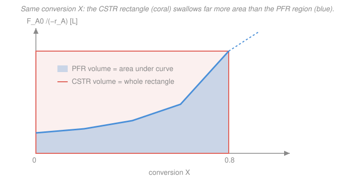

# Chemical Reaction Engineering · Lesson 2.2: Reactor sizing with Levenspiel plots

> ⏱ ~15 min · Module 2: Conversion, Sizing & Multiple Reactions · Builds on: [2.1 Conversion & the design equations](02-01-conversion-design-equations.md), [1.5 The CSTR](01-05-cstr.md), [1.6 The PFR & packed bed](01-06-pfr-packed-bed.md) · Unlocks: 2.6 (yield & selectivity), reactor trains

## Why this matters

In [2.1](02-01-conversion-design-equations.md) you got the two design equations that turn a target conversion into a reactor volume: an integral for the PFR, a single division for the CSTR. But the rate $-r_A$ almost never has a clean closed form you can integrate by hand — it comes off a data table, a messy rate law, or a spreadsheet. **Levenspiel's trick is to size the reactor with a picture instead of a formula.** Plot one curve, and a PFR becomes an *area* and a CSTR becomes a *rectangle* you can read off by eye. Better still, when you chain reactors together — a CSTR feeding a PFR feeding another CSTR — the picture tells you instantly which arrangement uses the least steel. This is the sketch a process engineer draws on a napkin before touching a simulator.

## The idea

Rewrite both design equations so the *only* thing that varies is a single quantity, $\dfrac{F_{A0}}{-r_A}$, plotted against conversion $X$. That quantity has units of **volume** — it's "how many liters of reactor you'd need per unit of conversion, right here." As the reaction proceeds, reactant runs out, the rate $-r_A$ drops, so $\dfrac{F_{A0}}{-r_A}$ *climbs*: the last bit of conversion is always the most expensive.

Now the magic. The PFR design equation is an integral of that quantity, and an integral is an **area under the curve**. The CSTR design equation is that quantity — evaluated at *one* point, the exit — times $X$, which is a **rectangle**. Same axes, two shapes. A CSTR always runs at its exit conversion (perfect mixing, from [1.5](01-05-cstr.md)), so its rectangle is as *tall* as the curve's endpoint — it pays the highest, most expensive rate across its whole volume. A PFR sweeps continuously from inlet to exit, so it hugs the curve and pays less. **Rectangle versus area: that single picture is the whole CSTR-vs-PFR story.**

## The formal version

Both start from the design equations of [2.1](02-01-conversion-design-equations.md), with $F_{A0}$ the molar feed rate of A (mol/min) and $-r_A$ the rate of consumption of A (mol/L·min), so $\dfrac{F_{A0}}{-r_A}$ has units of volume (L).

**PFR — area under the curve.**

$$V_{\text{PFR}} = F_{A0}\int_0^{X}\frac{dX}{-r_A} = \int_0^{X}\underbrace{\frac{F_{A0}}{-r_A}}_{\text{plot this}}\,dX.$$

*In words: the PFR volume is the area under the $\frac{F_{A0}}{-r_A}$-vs-$X$ curve, from 0 up to the exit conversion.*

**CSTR — the rectangle.**

$$V_{\text{CSTR}} = \frac{F_{A0}\,X}{(-r_A)\big|_{X}} = \left.\frac{F_{A0}}{-r_A}\right|_{X}\times X.$$

*In words: the CSTR volume is a rectangle — height = the curve's value at the exit conversion, width = the conversion itself.*

**Reactors in series.** The key fact: the **exit conversion of one reactor is the inlet conversion of the next**. If reactor $i$ takes the stream from $X_{i-1}$ to $X_i$, its volume is just the shape drawn over that sub-interval:

$$V_{\text{PFR},\,i}=\int_{X_{i-1}}^{X_i}\frac{F_{A0}}{-r_A}\,dX,\qquad V_{\text{CSTR},\,i}=\left.\frac{F_{A0}}{-r_A}\right|_{X_i}\!\!\big(X_i-X_{i-1}\big).$$

*In words: chop the X-axis into stages; each PFR stage is the area over its slice, each CSTR stage is a rectangle whose height is the value at that stage's **exit**.* Total volume = the shapes stacked side by side. Because you're free to choose the reactor type and the break-points, **sizing a train is just tiling the region under the curve with the least total area.**

The tiling rule follows directly. Over any slice, a PFR gives the *true* area; a CSTR gives a rectangle at the slice's right-hand height. So:

- Where the curve **rises**, the CSTR rectangle overshoots the area → the **PFR wins**.
- Where the curve **falls** (or is flat/low), the rectangle undershoots → the **CSTR wins**.

For an ordinary rate that only decays, the curve only rises, so a single PFR beats a single CSTR — but you can still shrink a *CSTR train* by staging (Example 2). The dramatic "combination beats either single reactor" case is an autocatalytic reaction, whose curve dips to a minimum: put a CSTR across the low flat basin, a PFR up the steep climb after it.

## Picture

The blue region (PFR) sits *under* the curve; the coral rectangle (CSTR) rises to the curve's endpoint and covers everything to the left of the exit. The coral area sticking out above the blue is the extra volume you pay for perfect mixing.

## Worked examples

**Example 1 (rectangle vs. area — size a single CSTR and PFR to $X=0.8$).** A liquid reaction is run at $F_{A0}=20$ mol/min. Lab work gives $\dfrac{F_{A0}}{-r_A}$ as a function of conversion:

| $X$ | 0.0 | 0.2 | 0.4 | 0.6 | 0.8 |
|---|---|---|---|---|---|
| $\dfrac{F_{A0}}{-r_A}$ (L) | 50 | 60 | 80 | 120 | 250 |

*CSTR* — one rectangle at the exit ($X=0.8$, height 250 L):

$$V_{\text{CSTR}} = \left.\frac{F_{A0}}{-r_A}\right|_{0.8}\times X = 250\ \mathrm{L}\times 0.8 = 200\ \mathrm{L}.$$

*PFR* — the area under the curve. With five evenly spaced points ($h=0.2$, four intervals) use **Simpson's rule**, $\int \approx \frac{h}{3}\big[f_0+4f_1+2f_2+4f_3+f_4\big]$:

$$V_{\text{PFR}} = \frac{0.2}{3}\Big[50+4(60)+2(80)+4(120)+250\Big] = \frac{0.2}{3}(1180) \approx 78.7\ \mathrm{L}.$$

The CSTR needs $200/78.7 \approx 2.5\times$ the volume of the PFR for the *same* conversion. **Why:** the CSTR does all its work at the exit rate — the expensive 250 L height — while the PFR enjoys the cheap 50–80 L rates through most of its length.

*Units/sanity check.* $\frac{F_{A0}}{-r_A}$ is in L and $X$ is dimensionless, so both volumes come out in L ✓. The PFR area lies between the low ($50\times0.8=40$) and high ($250\times0.8=200$) rectangles, as any honest area must ✓.

**Example 2 (staging — two CSTRs beat one big CSTR).** Same reaction and table, same final $X=0.8$. Instead of one CSTR, use **two in series** with the break at $X_1=0.6$.

- **CSTR-1** takes $0\to0.6$, so it runs at the $X=0.6$ height (120 L): $\;V_1 = 120\times(0.6-0) = 72\ \mathrm{L}.$
- **CSTR-2** takes $0.6\to0.8$, running at the $X=0.8$ height (250 L): $\;V_2 = 250\times(0.8-0.6) = 50\ \mathrm{L}.$

$$V_{\text{total}} = 72 + 50 = 122\ \mathrm{L} \quad<\quad 200\ \mathrm{L}\ \text{(one big CSTR)}.$$

Staging saves 78 L — a 39% cut — for free. **Why:** the single big CSTR forced the *entire* volume to sit at the punishing exit height of 250 L. Splitting lets the first 60% of conversion happen at the much cheaper 120 L height. On the plot, two short stacked rectangles hug the curve far better than one giant one. Push this further — more, smaller CSTRs — and the staircase of rectangles converges down onto the smooth PFR area (78.7 L), which is the true lower bound for a rising curve.

*Units/sanity check.* Both stages in L ✓. The two-CSTR total (122 L) sits between the single CSTR (200 L) and the PFR (78.7 L) — exactly where a finite staircase should land ✓.

## Watch out

- **You might think the CSTR rectangle uses the inlet (fast) rate — it uses the exit rate.** A CSTR is uniform at its *outlet* composition ([1.5](01-05-cstr.md)), which for decaying kinetics is the slowest, so its rectangle is as tall as the curve's endpoint. That "tallest possible height across the whole width" is precisely why a lone CSTR is the volume-hungry option.
- **You might think more reactors in series always helps regardless of order — order matters.** Volume is the total *area* of your tiling. On a rising stretch a PFR beats a CSTR; on a falling/flat stretch a CSTR beats a PFR. Slap the wrong type on the wrong stretch and you enlarge the reactor. Match the shape to the curve.
- **You might think the Levenspiel area is the *number of moles* or the reaction rate — it's a volume.** The vertical axis is $\frac{F_{A0}}{-r_A}$ (units of L), so the area (L $\times$ dimensionless $X$) is liters of reactor, full stop. If your axis carried different units, the "area" would mean something else.

## One-liner

> Plot $\frac{F_{A0}}{-r_A}$ against $X$: a PFR is the area under the curve, a CSTR is the rectangle up to it, and sizing a reactor train is just tiling that region with the least total area.

## Problems

**P1 (🟢)** Using the table from Example 1 ($F_{A0}=20$ mol/min), size a single **PFR** and a single **CSTR** for $X=0.4$ only. Which is smaller, and by what ratio?

**P2 (🟡)** Same table, final $X=0.8$. Now put a **PFR first** (from $0\to0.6$) followed by a **CSTR** (from $0.6\to0.8$). Find the total volume and compare it to (a) the single 200 L CSTR and (b) the two-CSTR train (122 L) from Example 2. Which arrangement is best here, and why does it fit the tiling rule?

**P3 (🔴)** For an **autocatalytic** reaction the product speeds the reaction up, so the rate is *low* at the start, peaks in the middle, then falls — meaning $\frac{F_{A0}}{-r_A}$ starts high, dips to a minimum at some $X^*$, then rises again. Sketch this curve and argue which single reactor (CSTR or PFR) is smaller for taking the feed from $X=0$ to just past the minimum, and why a **CSTR-then-PFR** pair can beat *either* single reactor over the full range.

Solutions

**P1** CSTR rectangle at $X=0.4$ (height 80 L): $V_{\text{CSTR}} = 80\times0.4 = 32\ \mathrm{L}$.

PFR area $0\to0.4$ by Simpson (three points $50,60,80$, $h=0.2$): $\frac{0.2}{3}[50+4(60)+80] = \frac{0.2}{3}(370) \approx 24.7\ \mathrm{L}$.

The PFR is smaller, ratio $32/24.7 \approx 1.3\times$. *Check:* both in L; the PFR area lies between $50\times0.4=20$ and $80\times0.4=32$ ✓. The ratio is milder than the $2.5\times$ at $X=0.8$ because the curve is nearly flat early on — rectangle and area barely differ where the curve doesn't climb.

**P2** PFR $0\to0.6$ by Simpson (points $50,60,80,120$? — that's four points/odd intervals, so use the four-point rule via Simpson on $[0,0.4]$ plus trapezoid on $[0.4,0.6]$, or just Simpson 3/8). Simpson's 3/8 on the four points ($h=0.2$): $\frac{3h}{8}[f_0+3f_1+3f_2+f_3] = \frac{3(0.2)}{8}[50+3(60)+3(80)+120] = 0.075(590) = 44.25\ \mathrm{L}$.

CSTR $0.6\to0.8$ (height at exit $X=0.8$ is 250 L): $250\times(0.8-0.6) = 50\ \mathrm{L}$.

Total $= 44.25 + 50 \approx 94.3\ \mathrm{L}$. This **beats** both the 200 L single CSTR and the 122 L two-CSTR train. *Why it fits the rule:* the curve **rises gently** over $0\to0.6$ (use a PFR — it captures the cheap area) and **rises steeply** into $0.6\to0.8$... but here we deliberately put the CSTR on the steep part, which the rule says is *sub-optimal* for the steep climb. It still beats the all-CSTR options because the PFR handled the bulk cheaply. The true optimum for this purely-rising curve is a **single PFR** (78.7 L) — no CSTR at all. *Check:* 94.3 L sits between the PFR-only 78.7 L and the two-CSTR 122 L ✓.

**P3** The curve is U-shaped: high at $X=0$, minimum at $X^*$, rising after. Over $0\to X^*$ the curve **falls**, so the CSTR rectangle (height at the *low* exit $X^*$) *undershoots* the area under the descending curve — the **CSTR is smaller** here. Past the minimum the curve **rises**, so a **PFR is smaller** there. The optimal train therefore is a **CSTR up to the minimum** (a short rectangle sitting in the basin) **then a PFR** up the climb — its total area is less than a single PFR (which pays the tall area over $0\to X^*$) and less than a single CSTR (whose rectangle to the final $X$ is enormous). This is the classic result: for a non-monotonic Levenspiel curve, a mixed train beats either ideal reactor alone. *Check:* consistent with the tiling rule — CSTR on the falling stretch, PFR on the rising stretch ✓.

## Flashback

**From Lesson 2.1 (Conversion & the design equations):** A liquid-phase reaction $A\to B$ is fed to a **CSTR** with molar feed $F_{A0}=12$ mol/min. At the exit conversion $X=0.5$ the measured rate is $-r_A = 0.40$ mol/(L·min). What reactor volume is required? (Fresh variant — a single algebraic sizing, no plot needed.)

Solution

The CSTR design equation from [2.1](02-01-conversion-design-equations.md), evaluated at the exit:

$$V = \frac{F_{A0}\,X}{(-r_A)\big|_X} = \frac{(12\ \mathrm{mol/min})(0.5)}{0.40\ \mathrm{mol/(L\cdot min)}} = \frac{6}{0.40} = 15\ \mathrm{L}.$$

*Check:* $\frac{\mathrm{mol/min}}{\mathrm{mol/(L\cdot min)}} = \mathrm{L}$ ✓. This is exactly the single coral rectangle of height $\frac{F_{A0}}{-r_A}\big|_{0.5} = 12/0.40 = 30$ L and width $0.5$: $30\times0.5 = 15$ L — the Levenspiel picture and the algebra agree ✓.

## Connections

- **Backward:** this is the graphical face of [2.1](02-01-conversion-design-equations.md)'s design equations — the PFR integral and the CSTR division — reusing the CSTR "runs at its exit" fact from [1.5](01-05-cstr.md) and the PFR differential sweep from [1.6](01-06-pfr-packed-bed.md).
- **Forward:** to *build* the $\frac{F_{A0}}{-r_A}$ curve for a real gas-phase reaction you need concentration as a function of $X$, including volume change — that's [2.3 Stoichiometry](02-03-stoichiometry-concentration-conversion.md). Reactor trains and reactor-type choice return with a vengeance in [2.6 Yield & selectivity](02-06-multiple-reactions-yield-selectivity.md), where the goal shifts from least volume to most desired product.
- **Sideways:** the same "tile the area with the least total shape" logic is a discrete optimization — you're choosing break-points to minimize an integral, the reactor-engineering cousin of picking control points to minimize a cost, and a preview of the sequencing arguments used for autocatalytic and biological reactors.
