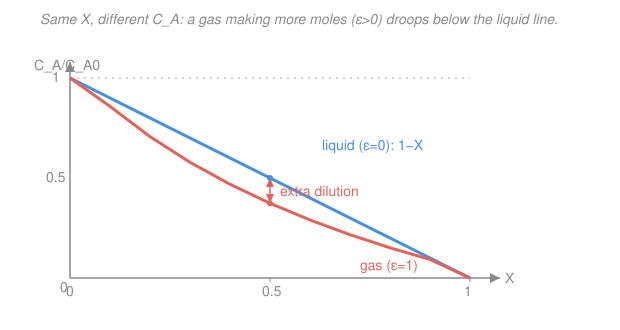

# Chemical Reaction Engineering · Lesson 2.3: Stoichiometry — Concentration as a Function of Conversion

> ⏱ ~15 min · Module 2: Conversion & Reactor Sizing · Builds on: [2.1 Conversion & the design equations](02-01-conversion-design-equations.md), [gen-chem 2.2 Stoichiometry & limiting reagents](../../general-chemistry/lessons/02-02-stoichiometry-limiting-reagents.md) · Unlocks: [2.4 Isothermal design & pressure drop](02-04-isothermal-design-pressure-drop-ergun.md), [2.6 Yield & selectivity](02-06-multiple-reactions-yield-selectivity.md), Boss Problem 2

## Why this matters

In [2.1](02-01-conversion-design-equations.md) every design equation ended with the same nuisance integral: $V = F_{A0}\int_0^X \frac{dX}{-r_A}$. You can't do that integral until $-r_A$ is a function of $X$ alone. But the rate law is written in **concentrations** — $-r_A = kC_A^n$, maybe with a $C_B$ in it too. This lesson is the bridge: a bookkeeping device, the **stoichiometric table**, that writes every species' concentration as a function of the single variable $X$. Get it right and sizing a reactor becomes one clean integral. Get it wrong — especially the gas-phase volume change — and your reactor comes out the wrong size. This is exactly the machinery behind Boss Problem 2.

## The idea

You already know the punchline from [general chemistry](../../general-chemistry/lessons/02-02-stoichiometry-limiting-reagents.md): the coefficients in a balanced equation are mole ratios. If $A + \tfrac12 B \to C$ and you've consumed 10 mol of $A$, you've also burned 5 mol of $B$ and made 10 mol of $C$. Reaction-engineering stoichiometry is that same ledger — with two upgrades.

First, we index everything to **conversion of $A$**, so "how much $A$ reacted" is $F_{A0}X$ and every other species' change is a fixed multiple of it. Set up one column — initial, change, remaining — for each species and you have every molar flow as a function of $X$.

Second — and this is the part gen-chem never worried about — concentration is moles *per volume*, so you also need the volume. In a **liquid** the volume barely changes, so concentration just tracks moles: $C_A = C_{A0}(1-X)$, a straight line. In a **gas** that changes the number of molecules, the volume swells or shrinks as the reaction runs. Turn 1 mol into 2 mol at constant $T$, $P$ and the gas takes up twice the room — so $A$ is spread thinner than the moles alone would say. That extra dilution slows the reaction, and ignoring it is the classic beginner's error.

## The formal version

Take the general reaction, divided through by the coefficient of $A$ so that $A$ has coefficient $-1$:

$$A + \tfrac{b}{a}B \;\longrightarrow\; \tfrac{c}{a}C + \tfrac{d}{a}D.$$

Use signed stoichiometric coefficients $\nu_i$ (negative for reactants, positive for products): $\nu_A=-1$. Define the **feed ratio**

$$\Theta_i = \frac{F_{i0}}{F_{A0}} \quad(\text{or } C_{i0}/C_{A0}),$$

**In words:** $\Theta_i$ is how many moles of species $i$ enter per mole of $A$ — so $\Theta_A=1$ always, and an inert has whatever $\Theta_I$ its feed fraction dictates.

**The stoichiometric table** (flow/continuous version; $F_{A0}X$ is the molar rate of $A$ consumed):

| Species | In ($F_{i0}$) | Change | Out ($F_i$) |
|---|---|---|---|
| $A$ | $F_{A0}$ | $-F_{A0}X$ | $F_{A0}(1-X)$ |
| $B$ | $\Theta_B F_{A0}$ | $-\tfrac{b}{a}F_{A0}X$ | $F_{A0}(\Theta_B-\tfrac{b}{a}X)$ |
| $C$ | $\Theta_C F_{A0}$ | $+\tfrac{c}{a}F_{A0}X$ | $F_{A0}(\Theta_C+\tfrac{c}{a}X)$ |
| $I$ (inert) | $\Theta_I F_{A0}$ | $0$ | $\Theta_I F_{A0}$ |

The change in species $i$ is always $\dfrac{\nu_i}{-\nu_A}F_{A0}X$. **In words:** every species moves in lockstep with $A$, scaled by its coefficient ratio.

**Liquid phase (constant volume/density).** Volumetric flow $v \approx v_0$, so $C_i = F_i/v_0$ and each concentration is just its molar flow over the unchanged $v_0$:

$$\boxed{\,C_i = C_{A0}\!\left(\Theta_i + \frac{\nu_i}{-\nu_A}X\right)\,}\qquad\Rightarrow\qquad C_A = C_{A0}(1-X).$$

**In words:** concentration is linear in $X$ — no volume correction needed.

**Gas phase with mole change.** Now total moles change, so $v$ changes. For an ideal gas the flow scales with total moles, temperature, and (inversely) pressure:

$$v = v_0\,(1+\varepsilon X)\,\frac{T}{T_0}\,\frac{P_0}{P}.$$

The bookkeeping collapses into two constants:

$$\delta = \frac{\text{change in total moles per mole } A \text{ reacted}}{1} = \frac{\sum_i \nu_i}{-\nu_A}, \qquad \varepsilon = y_{A0}\,\delta,$$

where $y_{A0}=F_{A0}/F_{T0}$ is the inlet mole fraction of $A$. **In words:** $\delta$ says how much the *reaction* changes total moles; multiplying by $y_{A0}$ dilutes that effect by how much of the feed is actually $A$. Dividing molar flow by this changing $v$:

$$\boxed{\,C_A = C_{A0}\,\frac{1-X}{1+\varepsilon X}\,\frac{T_0}{T}\,\frac{P}{P_0}\,},\qquad C_i = C_{A0}\,\frac{\Theta_i + \tfrac{\nu_i}{-\nu_A}X}{1+\varepsilon X}\,\frac{T_0}{T}\,\frac{P}{P_0}.$$

Isothermal and isobaric ($T=T_0$, $P=P_0$) drops the last two factors. A **positive $\varepsilon$** (more moles produced) makes the denominator grow — $A$ gets *diluted* and the reaction runs slower than the liquid formula would predict; a negative $\varepsilon$ concentrates it.

## Picture

Same reaction, same $X$, but the gas that makes extra moles ($\varepsilon=1$) sits **below** the liquid line everywhere — the growing volume spreads $A$ thinner. At $X=0.5$ the liquid still has half its $A$; the expanding gas is down to a third. That gap is real reactor volume: the diluted gas reacts more slowly, so you need more of it.

## Worked examples

### Example 1 — Pure-A gas cracking, $A \to B + C$

A gas $A$ decomposes, $A \to B + C$, fed **pure** ($y_{A0}=1$), isothermal and isobaric. Build the table and write $C_A(X)$.

Signed coefficients: $\nu_A=-1$, $\nu_B=+1$, $\nu_C=+1$. Pure feed means $\Theta_B=\Theta_C=0$.

| Species | In | Change | Out |
|---|---|---|---|
| $A$ | $F_{A0}$ | $-F_{A0}X$ | $F_{A0}(1-X)$ |
| $B$ | $0$ | $+F_{A0}X$ | $F_{A0}X$ |
| $C$ | $0$ | $+F_{A0}X$ | $F_{A0}X$ |
| **Total** | $F_{A0}$ | $+F_{A0}X$ | $F_{A0}(1+X)$ |

Total moles: $\sum\nu_i = -1+1+1 = +1$, so $\delta = \dfrac{\sum\nu_i}{-\nu_A} = \dfrac{1}{1}=1$. Then

$$\varepsilon = y_{A0}\,\delta = (1)(1) = 1.$$

The reactor's total molar flow doubles from inlet to $X=1$ (check: $1+\varepsilon X = 1+1 = 2$ ✓). Isothermal, isobaric:

$$C_A = C_{A0}\,\frac{1-X}{1+\varepsilon X} = C_{A0}\,\frac{1-X}{1+X}.$$

**Sanity check:** at $X=0$, $C_A=C_{A0}$ ✓; at $X=1$, $C_A=0$ ✓. Compare a liquid at $X=0.5$: liquid $C_A=0.5\,C_{A0}$, this gas $C_A=\tfrac{0.5}{1.5}C_{A0}=0.33\,C_{A0}$ — a third less reactant on hand, which is why the gas PFR in Boss Problem 2 comes out ~35% bigger than the naive constant-volume estimate.

### Example 2 — Reaction with an inert, $A + \tfrac12 B \to C$

Feed: $F_{A0}=5$ mol/s of $A$, $F_{B0}=2.5$ mol/s of $B$, and $F_{I0}=7.5$ mol/s of an inert $I$ (so $I$ is 50% of the feed). Gas, isothermal, isobaric. Find $\varepsilon$, $C_A(X)$, $C_B(X)$.

Total feed $F_{T0}=5+2.5+7.5=15$ mol/s, so $y_{A0}=5/15=\tfrac13$. Feed ratios:

$$\Theta_B=\frac{F_{B0}}{F_{A0}}=\frac{2.5}{5}=0.5,\qquad \Theta_I=\frac{7.5}{5}=1.5.$$

Signed coefficients (divide by $a=1$): $\nu_A=-1$, $\nu_B=-\tfrac12$, $\nu_C=+1$. Total-mole change:

$$\sum\nu_i = -1-\tfrac12+1 = -\tfrac12,\qquad \delta=\frac{-\tfrac12}{1}=-\tfrac12,\qquad \varepsilon = y_{A0}\,\delta = \tfrac13\cdot\left(-\tfrac12\right)=-\tfrac16.$$

Negative $\varepsilon$: the reaction **loses** moles ($1.5 \to 1$), so the gas contracts and reactant is slightly *concentrated*. Now the concentrations, with $C_{A0}=y_{A0}C_{T0}$:

$$C_A = C_{A0}\,\frac{1-X}{1+\varepsilon X} = C_{A0}\,\frac{1-X}{1-\tfrac16 X}.$$

For $B$, its change coefficient is $\dfrac{\nu_B}{-\nu_A}=-\tfrac12$:

$$C_B = C_{A0}\,\frac{\Theta_B + \tfrac{\nu_B}{-\nu_A}X}{1+\varepsilon X} = C_{A0}\,\frac{0.5-0.5X}{1-\tfrac16 X} = \tfrac12\,C_A.$$

**Sanity check:** the feed is exactly stoichiometric ($\Theta_B=0.5$ matches the $\tfrac12$ coefficient), so $A$ and $B$ run out together and $C_B=\tfrac12 C_A$ at *every* $X$ — including $X=1$, where both hit zero ✓. The inert never appears in $C_A$'s numerator but it *does* sit inside $y_{A0}$: pile in more inert and $y_{A0}$ (and thus $|\varepsilon|$) shrinks, pushing the gas back toward liquid-like behavior.

## Watch out

- **You might think** the volume-change factor $\frac{1}{1+\varepsilon X}$ is just a small correction you can drop for gases — **but actually** with $\varepsilon=1$ it changes $C_A$ by a factor of 2 at high conversion and can make your reactor 30–50% too small. Only drop it for liquids (or when $\delta=0$, equal moles each side).
- **You might think** $\varepsilon$ equals $\delta$ — **but actually** $\varepsilon = y_{A0}\,\delta$. The $y_{A0}$ matters: a reaction that doubles moles ($\delta=1$) but is fed 90% inert has $\varepsilon=0.1$, nearly no volume effect, because the inert doesn't change moles and dominates the total.
- **You might think** you can use partial *pressures* interchangeably with concentrations in the rate law — **but actually** they differ by $RT$ and, for gases with $\varepsilon\neq0$, by the volume-change factor too. Pick one (concentration here) and carry it through; conversions between the two are a common sign of a dropped $\varepsilon$.

## One-liner

> Build the table once: liquid concentrations are straight lines $C_{A0}(\Theta_i+\tfrac{\nu_i}{-\nu_A}X)$, gases carry an extra $\tfrac{1}{1+\varepsilon X}$ that dilutes ($\varepsilon>0$) or concentrates ($\varepsilon<0$) as moles change.

## Problems

**P1 (🟢)** Gas-phase $2A \to B$, fed pure $A$, isothermal and isobaric. Write the reaction per mole of $A$, then compute $\delta$, $\varepsilon$, and $C_A(X)$.

**P2 (🟡)** Liquid-phase $A + B \to 2C$ fed with $\Theta_B = 2$ (twice as much $B$ as $A$). Write $C_A(X)$, $C_B(X)$, and $C_C(X)$. At what conversion does $C_A$ reach zero — and is $B$ or $A$ limiting?

**P3 (🔴)** Gas $A \to 3B$ fed as 25% $A$, 75% inert, isothermal but with a pressure drop that halves the pressure by the exit ($P/P_0 = 1 - 0.5X$ as a crude model), isothermal. Find $\varepsilon$ and write $C_A(X)$ including the pressure factor. At $X=0.6$, is $C_A$ higher or lower than if pressure were held constant?

Solutions

**P1** Divide by 2: $A \to \tfrac12 B$. Then $\nu_A=-1$, $\nu_B=+\tfrac12$, $\sum\nu_i=-1+\tfrac12=-\tfrac12$, so $\delta=\dfrac{-1/2}{1}=-\tfrac12$. Pure feed $y_{A0}=1$, so $\varepsilon = (1)(-\tfrac12)=-\tfrac12$. Two moles collapse to one, so the gas contracts and $A$ is concentrated:
$$C_A = C_{A0}\,\frac{1-X}{1-\tfrac12 X}.$$
Sanity: at $X=1$ denominator is $\tfrac12$, numerator $0$ → $C_A=0$ ✓; at intermediate $X$ this is *above* the liquid line $C_{A0}(1-X)$ — contraction packs $A$ tighter.

**P2** Liquid, so no volume factor. Signed coefficients: $\nu_A=-1$, $\nu_B=-1$, $\nu_C=+2$, with $\Theta_A=1$, $\Theta_B=2$, $\Theta_C=0$.
$$C_A = C_{A0}(1-X),\quad C_B = C_{A0}(2 - X),\quad C_C = C_{A0}(0 + 2X)=2C_{A0}X.$$
$C_A=0$ at $X=1$. Since $A$ hits zero while $C_B=C_{A0}(2-1)=C_{A0}>0$ still remains, **$A$ is limiting** — consistent with $\Theta_B=2$ being an excess of $B$. (Conversion $X$ is always defined on the limiting reactant $A$, so $X$ can reach 1.)

**P3** Per mole of $A$: $A\to 3B$, $\nu_A=-1$, $\nu_B=+3$, $\sum\nu_i=+2$, $\delta = 2$. Feed $y_{A0}=0.25$, so $\varepsilon = (0.25)(2)=0.5$. Including the pressure factor $P/P_0 = 1-0.5X$ (isothermal drops $T_0/T$):
$$C_A = C_{A0}\,\frac{1-X}{1+0.5X}\,(1-0.5X).$$
At $X=0.6$: $\dfrac{1-0.6}{1+0.3}\times(1-0.3) = \dfrac{0.4}{1.3}\times 0.7 = 0.215\,C_{A0}$. With constant pressure it would be $\dfrac{0.4}{1.3}=0.308\,C_{A0}$. So the pressure drop makes $C_A$ **lower** (0.215 vs 0.308) — falling pressure thins the gas further, on top of the expansion dilution. This is the exact effect [2.4](02-04-isothermal-design-pressure-drop-ergun.md) quantifies with the Ergun equation.

## Flashback

**From Lesson 2.1 (Conversion & the design equations):** A liquid-phase first-order reaction $A \to B$ runs with $-r_A = kC_A$, $k = 0.5\ \mathrm{min^{-1}}$, feed $C_{A0}=1.5\ \mathrm{mol/dm^3}$, $v_0 = 4\ \mathrm{dm^3/min}$. Using the stoichiometry you just learned, write $-r_A$ as a function of $X$, then size a **CSTR** for $X=0.7$.

Solution

Liquid, so $C_A = C_{A0}(1-X)$ and the rate becomes a function of $X$ alone:
$$-r_A = kC_{A0}(1-X).$$
CSTR design equation from [2.1](02-01-conversion-design-equations.md), evaluated at the exit conversion:
$$V = \frac{F_{A0}X}{(-r_A)_{\text{exit}}} = \frac{v_0 C_{A0}\,X}{kC_{A0}(1-X)} = \frac{v_0}{k}\,\frac{X}{1-X}.$$
The $C_{A0}$ cancels: $V = \dfrac{4}{0.5}\cdot\dfrac{0.7}{0.3} = 8 \times 2.333 = 18.7\ \mathrm{dm^3}$.

Sanity: units $\dfrac{\mathrm{dm^3/min}}{\mathrm{min^{-1}}}$ = dm³ ✓, and $V\to\infty$ as $X\to1$ — a CSTR runs at the low exit concentration, so full conversion needs infinite volume. Notice the whole thing hinged on turning $C_A$ into $C_{A0}(1-X)$ first.

## Connections

- **Backward:** this is [general-chemistry 2.2](../../general-chemistry/lessons/02-02-stoichiometry-limiting-reagents.md) mole-ratio stoichiometry, re-indexed to conversion $X$ and extended with the ideal-gas volume change. The limiting-reagent idea returns as "conversion is defined on $A$."
- **Forward:** [2.4](02-04-isothermal-design-pressure-drop-ergun.md) adds a *falling* $P$ (Ergun) on top of $\varepsilon$; [2.6](02-06-multiple-reactions-yield-selectivity.md) needs $C_A(X)$ and $C_B(X)$ to compare competing rate laws for selectivity. Every energy-balance lesson in Module 3 reuses this table for $T$-dependent $C_i$.
- **Sideways:** the $1+\varepsilon X$ volume factor is the same ideal-gas mole-counting you saw in [engineering-thermodynamics](../../engineering-thermodynamics/syllabus.md) control-volume balances — here it's disguised as a concentration correction rather than a $PV=nRT$ statement.
