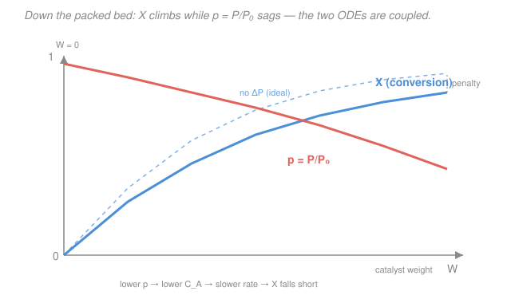

# Chemical Reaction Engineering · Lesson 2.4: Isothermal design & pressure drop in packed beds

> ⏱ ~15 min · Module 2: Conversion & Reactor Sizing · Builds on: [1.6 PFR & packed-bed reactor](01-06-pfr-packed-bed.md), [2.3 Stoichiometry: concentration vs. conversion](02-03-stoichiometry-concentration-conversion.md) · Unlocks: [2.5 Analysis of rate data](02-05-analysis-of-rate-data.md), Boss Problem 2 (gas PFR)

## Why this matters

You now hold every piece needed to actually **size a tubular reactor**: a design equation ([1.6](01-06-pfr-packed-bed.md)), a rate law ([1.1](01-01-rate-of-reaction-rate-law.md)), and the recipe for $C_A(X)$ ([2.3](02-03-stoichiometry-concentration-conversion.md)). This lesson snaps them together into a single integral and turns the crank. Two things bite you in the gas phase that never appeared with liquids: the reacting mixture **changes volume** as moles change, and the gas **loses pressure** grinding through a bed of catalyst pellets. Both dilute your reactant and cost you conversion — ignore them and your reactor comes out too small to hit spec.

## The idea

Sizing a plug-flow reactor is bookkeeping along the tube. Slice the reactor into thin discs. In each disc a little more A converts, so $X$ ticks up; the local rate $-r_A$ depends on the local concentration $C_A$, which depends on how far you've already converted. Stack up all the discs and you've got the volume. That "stacking up" is an integral:

$$V = F_{A0}\int_0^{X}\frac{dX}{-r_A}.$$

For a **liquid**, $C_A = C_{A0}(1-X)$ and the integral is tame. For a **gas that changes moles**, there's a twist. Take $A \to B + C$: one molecule in, two out. As A converts, the gas *expands* — total volumetric flow swells — so even the unconverted A gets spread thinner than $C_{A0}(1-X)$ would suggest. That extra dilution shows up as the factor $1+\varepsilon X$ in the denominator of $C_A$, and it makes the rate sag faster than you'd expect. The reactor has to be **bigger** to compensate.

Now stuff that tube with solid catalyst pellets. The gas has to squeeze through the gaps, and friction drops the pressure from inlet to outlet. Lower pressure means lower gas concentration (an ideal gas packs fewer moles per liter when you squeeze less on it), which means a slower rate, which means less conversion. That's the **pressure-drop penalty**, and it's governed by the Ergun equation — the same packed-bed friction relation studied in transport phenomena, here bolted onto the mole balance.

## The formal version

**One combined design ODE.** Start from the PFR/PBR design equation and substitute the rate law and $C_A(X)$. For a first-order gas reaction, isothermal ($T=T_0$) and (for now) isobaric ($P=P_0$):

$$-r_A = kC_A, \qquad C_A = C_{A0}\,\frac{1-X}{1+\varepsilon X}\quad(\text{gas, }T=T_0,\;P=P_0),$$

where $k$ is the rate constant (units s$^{-1}$ for first order), $C_{A0}$ the inlet concentration of A (mol/L), and $\varepsilon = y_{A0}\,\delta$ is the **expansion factor** — $y_{A0}$ the inlet mole fraction of A (dimensionless), $\delta$ the change in total moles per mole of A reacted (dimensionless). *In words: $\varepsilon$ measures how much the gas swells at complete conversion.* Feed these in with $F_{A0}=C_{A0}v_0$ ($v_0$ = inlet volumetric flow, L/s):

$$V = F_{A0}\int_0^{X}\frac{dX}{kC_{A0}\dfrac{1-X}{1+\varepsilon X}} = \frac{v_0}{k}\int_0^{X}\frac{1+\varepsilon X}{1-X}\,dX.$$

*In words: the reactor volume is the inlet flow divided by the rate constant, times an integral that the expansion factor makes non-trivial.* For $\varepsilon=0$ (liquid, or a gas with no mole change) this collapses to the familiar $\frac{v_0}{k}\ln\frac{1}{1-X}$. For $\varepsilon>0$ the $1+\varepsilon X$ in the numerator inflates the integral — a bigger reactor.

**Packed-bed pressure drop.** In a packed bed we size by **catalyst weight** $W$ (kg) rather than volume, with the catalytic rate $-r_A'$ per unit mass:

$$\frac{dX}{dW} = \frac{-r_A'}{F_{A0}}.$$

The gas pressure obeys the Ergun equation, which — written in the dimensionless pressure $p \equiv P/P_0$ for an isothermal bed — becomes

$$\boxed{\;\frac{dp}{dW} = -\frac{\alpha}{2p}\,(1+\varepsilon X)\;}$$

where $\alpha$ (units kg$^{-1}$) **lumps** all the Ergun constants: gas viscosity and density, superficial velocity, pellet diameter, void fraction, and bed cross-section. *In words: pressure falls faster where the gas is already thin (small $p$) and faster still where expansion has swollen the flow (large $1+\varepsilon X$).* And pressure feeds straight back into concentration:

$$C_A = C_{A0}\,\frac{1-X}{1+\varepsilon X}\,p \qquad (T=T_0).$$

So you have **two coupled ODEs** — $dX/dW$ and $dp/dW$ — that must be integrated *together*, because $X$ needs $p$ (through $C_A$) and $p$ needs $X$. There's no closed form in general; you march them numerically. One clean special case: if $\varepsilon=0$, the pressure equation decouples and integrates to $p = \sqrt{1-\alpha W}$ — pressure follows a square-root droop, hitting zero at $W_{\max}=1/\alpha$, a hard ceiling on how much catalyst the bed can hold before it chokes.

## Picture

## Worked examples

**Example 1 — Boss Problem 2: gas PFR, expansion matters.** Gas-phase $A \to B + C$, first order $-r_A = kC_A$ with $k=0.1\ \mathrm{s^{-1}}$. Feed is pure A at $C_{A0}=0.2\ \mathrm{M}$, $v_0 = 2\ \mathrm{L/s}$. Size a PFR for $X=0.6$ (isothermal, isobaric).

*Expansion factor.* One mole A makes one B plus one C: $\delta = \frac{(1+1)-1}{1} = 1$. Pure A means $y_{A0}=1$, so

$$\varepsilon = y_{A0}\,\delta = 1.$$

*Set up the integral.* With $F_{A0}=C_{A0}v_0$ and $-r_A=kC_{A0}\frac{1-X}{1+X}$,

$$V = \frac{v_0}{k}\int_0^{0.6}\frac{1+X}{1-X}\,dX.$$

*Do the integral.* Split the integrand: $\frac{1+X}{1-X} = -1 + \frac{2}{1-X}$, so

$$\int_0^{0.6}\frac{1+X}{1-X}\,dX = \Big[-X - 2\ln(1-X)\Big]_0^{0.6} = -0.6 - 2\ln(0.4) = -0.6 + 1.833 = 1.233.$$

*Volume.* With $\frac{v_0}{k} = \frac{2}{0.1} = 20\ \mathrm{L}$,

$$V = 20 \times 1.233 \approx \mathbf{24.7\ L}.$$

*What if you'd ignored expansion?* Setting $\varepsilon=0$ gives $V = 20\int_0^{0.6}\frac{dX}{1-X} = 20\,[-\ln(1-X)]_0^{0.6} = 20\ln(2.5) \approx \mathbf{18.3\ L}$.

The expansion-blind estimate is $\frac{24.7-18.3}{18.3} \approx 35\%$ **too small**. Physically: as A converts, the gas doubles in volume (toward $X=1$), diluting the A that's left, dragging the rate down, and forcing you to buy more reactor. *Units check:* $[v_0/k] = (\mathrm{L/s})/(\mathrm{s^{-1}}) = \mathrm{L}$, and the integral is dimensionless, so $V$ is in liters. ✓ *Sanity:* a first-order gas expansion reaction always needs a **larger** reactor than the $\varepsilon=0$ shortcut predicts, and 35% is a typical bite for $\varepsilon=1$. ✓

**Example 2 — the pressure-drop penalty.** Same catalytic reaction now runs in a packed bed with lumped Ergun coefficient $\alpha = 0.02\ \mathrm{kg^{-1}}$. Track the pressure and its effect on conversion.

For a first pass, take the decoupled $\varepsilon=0$ pressure profile $p=\sqrt{1-\alpha W}$:

| $W$ (kg) | $\alpha W$ | $p = P/P_0$ |
|---|---|---|
| 0  | 0.0 | 1.00 |
| 10 | 0.2 | 0.89 |
| 20 | 0.4 | 0.77 |
| 40 | 0.8 | 0.45 |
| 50 | 1.0 | 0.00 |

By $W=20$ kg the gas is at 77% of inlet pressure; by $W=40$ kg it's below half; at $W=50$ kg the model chokes ($W_{\max}=1/\alpha = 50$ kg). **Effect on conversion:** since $C_A \propto p$ and $-r_A' = k'C_A \propto p$, every kilogram past the inlet reacts *slower* than it would with no drop. In the coupled system $\frac{dX}{dW} = \frac{k'C_{A0}}{F_{A0}}(1-X)\,p$, the $p<1$ factor shrinks the right-hand side everywhere, so the conversion curve rises **below** the ideal no-drop curve (the dashed line in the figure) and lands short of the target. To recover the lost $X$ you can add catalyst — but only up to the $W_{\max}$ ceiling — or attack $\alpha$ itself.

*Design lever.* $\alpha$ scales roughly as $1/D_p$ (inverse pellet diameter) through the Ergun terms: **bigger pellets** slash pressure drop but bury catalyst surface inside the pellet where the gas can't easily reach ([internal-diffusion limits](04-03-internal-diffusion-thiele-effectiveness.md) — the Thiele-modulus story). So pellet size is a genuine trade-off: coarse pellets for low $\Delta P$, fine pellets for high surface area. *Sanity:* $p$ falling monotonically and the coupled $X$ trailing the ideal both match intuition — pressure drop can only ever *hurt* conversion. ✓

## Watch out

- **You might think expansion is a minor correction.** For $\varepsilon=1$ it inflated the reactor by 35% — that's not a rounding error, it's the difference between a reactor that meets spec and one that doesn't. Always compute $\varepsilon = y_{A0}\delta$ before assuming $C_A = C_{A0}(1-X)$; that liquid-phase form is only valid when $\varepsilon=0$.
- **You might drop the $(1+\varepsilon X)$ in the Ergun equation.** It belongs there: expansion speeds up the gas, and faster gas drops pressure faster. Keeping it is what makes $dp/dW$ and $dX/dW$ genuinely coupled — you can't solve one then the other, you march them together.
- **You might expect a neat closed-form for the packed bed.** Only the $\varepsilon=0$ case gives $p=\sqrt{1-\alpha W}$. With expansion, the two ODEs feed each other and you integrate numerically (Euler or Runge–Kutta) — which is exactly what the app's boss problem expects you to set up, not to solve by hand.

## One-liner

> Snap the design equation, rate law, and $C_A(X)$ into one integral — then remember that gas expansion ($1+\varepsilon X$) and Ergun pressure drop ($dp/dW$) both dilute A and make you buy a bigger reactor.

## Problems

**P1 (🟢)** A liquid-phase first-order reaction $A \to B$ ($-r_A=kC_A$, $k=0.05\ \mathrm{s^{-1}}$) is fed at $v_0=1\ \mathrm{L/s}$, $C_{A0}=1\ \mathrm{M}$. Size a PFR for $X=0.9$. (Liquid: $\varepsilon=0$.)

**P2 (🟡)** Repeat the Boss Problem 2 setup — gas $A\to B+C$, $k=0.1\ \mathrm{s^{-1}}$, $C_{A0}=0.2\ \mathrm{M}$, $v_0=2\ \mathrm{L/s}$, pure A — but now find the PFR volume for a deeper conversion $X=0.8$. Compare to the $\varepsilon=0$ estimate and report the percent penalty.

**P3 (🔴)** In an isothermal packed bed with $\varepsilon=0$ and $\alpha = 0.01\ \mathrm{kg^{-1}}$, the pressure follows $p=\sqrt{1-\alpha W}$. (a) At what catalyst weight has the pressure fallen to 90% of inlet? (b) By what factor is the *local rate* at that point reduced relative to the inlet, for a first-order reaction, ignoring the change in $X$?

Solutions

**P1** With $\varepsilon=0$, $C_A = C_{A0}(1-X)$ and

$$V = \frac{v_0}{k}\int_0^{0.9}\frac{dX}{1-X} = \frac{v_0}{k}\ln\frac{1}{1-X} = \frac{1}{0.05}\ln\frac{1}{0.1} = 20\ln(10) \approx 20(2.303) \approx \mathbf{46.1\ L}.$$

*Check.* $[v_0/k] = (\mathrm{L/s})/\mathrm{s^{-1}} = \mathrm{L}$ ✓. Deep conversion ($X=0.9$) needs a large reactor because the rate crawls as $C_A \to 0$ near the exit — the log diverges as $X\to1$, which is why you never chase 100% in a single PFR. ✓

**P2** Same $\varepsilon=1$, $\frac{v_0}{k}=20$ L. Now to $X=0.8$:

$$\int_0^{0.8}\frac{1+X}{1-X}\,dX = \big[-X - 2\ln(1-X)\big]_0^{0.8} = -0.8 - 2\ln(0.2) = -0.8 + 3.219 = 2.419.$$

$$V = 20 \times 2.419 \approx \mathbf{48.4\ L}.$$

Expansion-blind: $V_{\varepsilon=0} = 20\ln\frac{1}{0.2} = 20\ln(5) \approx 20(1.609) \approx 32.2\ \mathrm{L}$. Penalty:

$$\frac{48.4 - 32.2}{32.2} \approx 50\%.$$

*Check.* The penalty *grew* from 35% (at $X=0.6$) to 50% (at $X=0.8$) — deeper into the reaction, more of the gas has expanded, so the dilution factor $1+\varepsilon X$ is larger and the mismatch widens. Units: liters as before. ✓

**P3** (a) Set $p=0.9$: $0.9 = \sqrt{1-0.01\,W} \Rightarrow 0.81 = 1-0.01W \Rightarrow W = \frac{0.19}{0.01} = \mathbf{19\ kg}$.

(b) For first order, $-r_A' = k'C_A$ with $C_A \propto p$ (at fixed $X$, $T$). So the local rate scales directly with $p$: at $p=0.9$ the rate is reduced to $\mathbf{90\%}$ of its inlet value — a 10% throttle purely from lost pressure, before any conversion effect.

*Check.* Rate $\propto p$ is the whole reason pressure drop hurts conversion; a 10% pressure loss buys a 10% rate loss for first order (it would be $p^n$ for order $n$). Directionally correct — more catalyst, lower $p$, slower rate. ✓

## Flashback

**From Lesson 2.3 (Stoichiometry: concentration vs. conversion):** A gas-phase reaction $A \to 3B$ runs isothermally and isobarically. The feed is 40% A and 60% inert I (mole basis), with $C_{A0}=0.10\ \mathrm{M}$. Find the expansion factor $\varepsilon$ and the concentration $C_A$ at $X=0.5$. How does it compare to the liquid-phase value at the same conversion?

Solution

*Expansion factor.* One mole A makes three B: $\delta = \frac{3-1}{1} = 2$. Inlet mole fraction $y_{A0}=0.40$, so

$$\varepsilon = y_{A0}\,\delta = 0.40 \times 2 = 0.8.$$

*Concentration at $X=0.5$.* For an isothermal, isobaric gas,

$$C_A = C_{A0}\,\frac{1-X}{1+\varepsilon X} = 0.10\,\frac{1-0.5}{1+0.8(0.5)} = 0.10\,\frac{0.5}{1.4} \approx \mathbf{0.036\ M}.$$

*Compare.* A liquid (no expansion) would sit at $C_A = C_{A0}(1-X) = 0.10(0.5) = 0.050\ \mathrm{M}$. The gas is **28% lower** — the mole-tripling swells the volume and dilutes the surviving A beyond what conversion alone removes.

*Check.* Units: $C_A$ in M throughout ✓. The $1+\varepsilon X > 1$ denominator guarantees the expanding gas is always more dilute than the liquid at equal $X$ — the same effect that inflated Boss Problem 2's reactor volume. ✓

## Connections

- **Backward:** this lesson is the payoff of [1.6 (PFR/PBR design equations)](01-06-pfr-packed-bed.md) and [2.3 (the $C_A(X)$ stoichiometric table)](02-03-stoichiometry-concentration-conversion.md) — we just substituted one into the other and integrated. The $\varepsilon=0$ liquid special case reproduces the simple sizing from [2.1](02-01-conversion-design-equations.md).
- **Forward:** [2.5 (Analysis of rate data)](02-05-analysis-of-rate-data.md) runs this in reverse — given reactor data, back out $k$ and the order — and the coupled $dX/dW$–$dp/dW$ system reappears whenever a real catalytic reactor is designed in Module 4.
- **Sideways (transport phenomena):** the Ergun equation and the friction factor that define $\alpha$ come straight from packed-bed momentum transport — the same porous-media pressure-drop relation studied there. Reaction engineering just couples that friction law to the mole balance so pressure and conversion evolve together down the bed.
