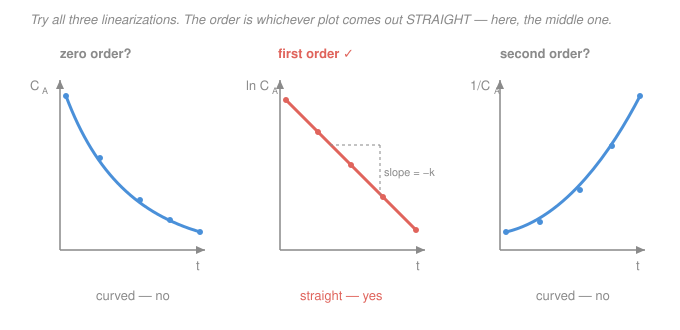

# Chemical Reaction Engineering · Lesson 2.5: Analysis of rate data

> ⏱ ~15 min · Module 2: Isothermal Reactor Design · Builds on: [1.1 Rate of reaction & the rate law](01-01-rate-of-reaction-rate-law.md), [1.4 Batch reactor](01-04-batch-reactor.md), [`physical-chemistry` 3.2 Integrated rate laws](../../physical-chemistry/lessons/03-02-integrated-rate-laws-half-lives.md) · Unlocks: every design in this course — you cannot size a reactor without a rate law

## Why this matters

Every reactor equation you have met — batch, CSTR, PFR — takes the rate law $-r_A = kC_A^n$ as an *input* and hands you a volume. But where do $k$ and $n$ come from? Nobody prints them on the drum of reagent. You **measure** them: run the reaction, record concentration versus time (or a conversion in a flow reactor), and work backward to the two numbers that make the whole design machine run. This lesson is the reverse gear — from data to rate law. Get it wrong and every downstream volume, temperature, and yield calculation inherits the error.

## The idea

You have a table: concentration of A at a handful of times. Somewhere hiding in it are an order $n$ and a rate constant $k$. Three ways to flush them out, in rough order of how forgiving they are to messy data:

1. **Integral method — guess and check the shape.** Pick an order. Integrate the batch rate law for that order; each order predicts that *some particular function of $C_A$* falls on a straight line against $t$. Plot it. If it's straight, you guessed right and the slope is $k$. If it bends, try another order. It's a shape-matching game: which transformation of the data straightens it out?

2. **Differential method — measure the rate directly.** Instead of integrating, estimate the *slope* of the $C_A$-vs-$t$ curve numerically — that slope **is** $-r_A$. Then $\ln(-r_A) = \ln k + n\ln C_A$ is a straight line whose slope is the order and whose intercept is $\ln k$. No guessing; the order pops out. The price: differentiating noisy data amplifies the noise.

3. **Method of initial rates — isolate one reactant.** With two or more reactants, or when products start interfering, run several experiments changing *one* initial concentration and clock only the very first rate. Compare rates to read the order in that one species, then repeat for the next.

Same underlying line — $\ln(\text{rate}) = \ln k + n\ln(\text{concentration})$ — approached from three angles.

## The formal version

**Integral method.** For a constant-volume batch reactor of a single reactant $A$ (from [1.4](01-04-batch-reactor.md)), $-\dfrac{dC_A}{dt} = kC_A^n$. Integrate for each candidate order — these are exactly the integrated rate laws from [`physical-chemistry` 3.2](../../physical-chemistry/lessons/03-02-integrated-rate-laws-half-lives.md):

| Order $n$ | Integrated form | Plot that is straight | Slope |
|---|---|---|---|
| $0$ | $C_A = C_{A0} - kt$ | $C_A$ vs $t$ | $-k$ |
| $1$ | $\ln C_A = \ln C_{A0} - kt$ | $\ln C_A$ vs $t$ | $-k$ |
| $2$ | $\dfrac{1}{C_A} = \dfrac{1}{C_{A0}} + kt$ | $1/C_A$ vs $t$ | $+k$ |

*In words: each order predicts one — and only one — of these three plots comes out as a straight line.* $C_A$ is concentration (mol/L), $t$ is time (min or s), $k$ carries whatever units make $kC_A^n$ come out in mol/L·time. Test the plots; the straight one names the order and its slope gives $k$.

**Differential method.** Don't integrate — differentiate the data. Approximate the rate by a finite difference of the $C_A(t)$ table. Using a **central difference** at an interior time $t_i$ (spacing $\Delta t$),

$$-r_A(t_i) \;=\; -\frac{dC_A}{dt}\bigg|_{t_i} \;\approx\; -\,\frac{C_A(t_{i+1}) - C_A(t_{i-1})}{t_{i+1} - t_{i-1}}.$$

*In words: the rate at a point is (minus) the slope of the line joining its two neighbours.* Then take logs of $-r_A = kC_A^n$:

$$\ln(-r_A) = \ln k + n\,\ln C_A.$$

*In words: on log–log axes the data fall on a line whose slope is the order $n$ and whose $y$-intercept is $\ln k$.* Read $n$ off the slope, then $k = e^{\text{intercept}}$.

**Method of initial rates.** For $-r_A = kC_A^{\alpha}C_B^{\beta}$, flood the system with a huge excess of $B$ so $C_B$ is effectively constant, or simply measure the rate at $t=0$ before products build up. Run two experiments changing only $C_{A0}$:

$$\frac{-r_{A0,\,2}}{-r_{A0,\,1}} = \left(\frac{C_{A0,2}}{C_{A0,1}}\right)^{\alpha} \;\Longrightarrow\; \alpha = \frac{\ln\!\big(r_{A0,2}/r_{A0,1}\big)}{\ln\!\big(C_{A0,2}/C_{A0,1}\big)}.$$

*In words: double a concentration, see how many times the rate multiplies — the exponent is the order in that species.* Repeat holding $A$ fixed and varying $B$ for $\beta$.

**Two modern/practical notes.**
- **Nonlinear regression** is the catch-all: fit the *whole* $C_A(t)$ curve (or $X$ data) to the integrated model by least squares, letting a solver find the $(k, n)$ that minimize $\sum (C_{A,\text{meas}} - C_{A,\text{model}})^2$. It uses every point at once, needs no straight-line guessing, and handles non-integer orders — the method you'd actually use at a workstation. The graphical methods above build the intuition and give the solver its starting guess.
- **CSTR data need no calculus at all.** A steady-state CSTR reports the rate *directly*: $-r_A = \dfrac{F_{A0}X}{V}$ (rearrange the design equation from [1.5](01-05-cstr.md)). Run the reactor at several feed rates to get several $(C_A, -r_A)$ pairs, then use the same $\ln(-r_A)$-vs-$\ln C_A$ plot as the differential method — but with rates you *measured* rather than *differentiated*. That's why a CSTR is a favourite kinetics tool.

## Picture

The order is not something you compute; it's the plot that refuses to bend.

## Worked examples

**Example 1 (integral method — find the order and $k$).** A liquid-phase decomposition $A \to$ products is run in a constant-volume batch reactor. The data:

| $t$ (min) | 0 | 5 | 10 | 15 | 20 |
|---|---|---|---|---|---|
| $C_A$ (mol/L) | 2.00 | 1.21 | 0.74 | 0.45 | 0.27 |

*Test zero order* ($C_A$ vs $t$): the drops are $0.79, 0.47, 0.29, 0.18$ per 5 min — shrinking, so the curve bends. Not a line.

*Test first order* ($\ln C_A$ vs $t$): compute $\ln C_A$:

| $t$ | 0 | 5 | 10 | 15 | 20 |
|---|---|---|---|---|---|
| $\ln C_A$ | $0.693$ | $0.191$ | $-0.301$ | $-0.799$ | $-1.309$ |

Successive changes: $-0.502, -0.492, -0.498, -0.510$ — all $\approx -0.5$ per 5 min. **Straight.** First order it is. The slope is

$$\text{slope} = \frac{-1.309 - 0.693}{20 - 0} = \frac{-2.002}{20} = -0.100\ \mathrm{min^{-1}} = -k \;\Longrightarrow\; \boxed{k = 0.100\ \mathrm{min^{-1}}.}$$

*(Quick check that second order fails: $1/C_A = 0.50, 0.83, 1.35, 2.22, 3.70$ — jumps of $0.33, 0.52, 0.87, 1.48$, growing fast. Curved.)*

**Units/sanity check:** for first order $k$ has units of $1/\text{time}$ ✓, and a positive $k$ means $C_A$ decays ✓. **How this feeds design:** with $k = 0.1\ \mathrm{min^{-1}}$ you could now size a batch time or a CSTR for this reaction — e.g. a CSTR for 80% conversion needs $\tau = \frac{X}{k(1-X)} = \frac{0.8}{0.1(0.2)} = 40$ min of space time. The whole point of the data analysis was to unlock that number.

**Example 2 (differential method — same data, cross-check).** Now ignore that we "know" the answer and extract it from slopes. Use central differences (spacing $\Delta t = 10$ min across neighbours) at the three interior times:

$$-r_A(5) \approx -\frac{0.74 - 2.00}{10} = 0.126, \quad -r_A(10) \approx -\frac{0.45 - 1.21}{10} = 0.076, \quad -r_A(15) \approx -\frac{0.27 - 0.74}{10} = 0.047$$

(all in mol/L·min, evaluated at $C_A = 1.21,\ 0.74,\ 0.45$). Take logs for the $\ln(-r_A)$-vs-$\ln C_A$ line:

| $C_A$ | 1.21 | 0.74 | 0.45 |
|---|---|---|---|
| $\ln C_A$ | $0.191$ | $-0.301$ | $-0.799$ |
| $\ln(-r_A)$ | $-2.071$ | $-2.577$ | $-3.058$ |

Slope (order):

$$n = \frac{-3.058 - (-2.071)}{-0.799 - 0.191} = \frac{-0.987}{-0.990} = 0.997 \approx 1.$$

Intercept: $\ln k = \ln(-r_A) - n\ln C_A = -2.071 - (1)(0.191) = -2.262$, so $k = e^{-2.262} = 0.104\ \mathrm{min^{-1}}$.

**Reconciliation:** $n \approx 1$ and $k \approx 0.10\ \mathrm{min^{-1}}$ — the same rate law the integral method gave, from the same numbers by a different route. The small drift ($0.104$ vs $0.100$) is exactly the noise-amplification the differential method warns you about: subtracting nearby concentrations and dividing by a small $\Delta t$ magnifies rounding. When the two methods agree, you trust the answer.

## Watch out

- **You might think you can read off the order without testing the plot.** You can't — a decaying curve *looks* like it could be any order to the eye. The order is defined operationally: it is whichever linearization is genuinely straight over the *whole* dataset, not just the first two points. Always check all three.
- **You might difference across the wrong spacing.** A central difference at $t_i$ uses the neighbours $t_{i-1}$ and $t_{i+1}$, so the denominator is $t_{i+1}-t_{i-1}$ (here $10$ min), **not** $\Delta t = 5$. Divide by the actual time gap between the two points you subtracted, or your rate — and your $k$ — is off by a factor.
- **You might trust the differential method on the endpoints.** Central differences only exist for interior points; the first and last must use one-sided (forward/backward) differences, which are cruder and bias the fit. Weight the interior points, or lean on the integral method / nonlinear regression, when the ends look ratty.
- **You might let products poison the fit.** If the reaction reverses or a product inhibits it, $-r_A = kC_A^n$ holds only early. That's the whole reason for the **initial-rate** method — measure at $t \to 0$, before the products are around to lie to you.

## One-liner

> To find a rate law: integrate-and-see-which-plot-is-straight (order names $k$), or differentiate-and-log-log (slope is the order) — and a good analysis passes both.

## Problems

**P1 (🟢)** A gas-phase decomposition $A \to$ products is followed in a constant-volume batch reactor:

| $t$ (min) | 0 | 10 | 20 | 30 | 40 |
|---|---|---|---|---|---|
| $C_A$ (mol/L) | 0.50 | 0.25 | 0.167 | 0.125 | 0.100 |

Determine the reaction order by the integral method and find $k$ (with units). *Hint: test $1/C_A$.*

**P2 (🟡)** For the reaction $A + B \to C$, initial-rate experiments at fixed temperature give:

| Run | $C_{A0}$ (M) | $C_{B0}$ (M) | $-r_{A0}$ (M/s) |
|---|---|---|---|
| 1 | 0.10 | 0.10 | $2.0\times10^{-3}$ |
| 2 | 0.20 | 0.10 | $8.0\times10^{-3}$ |
| 3 | 0.10 | 0.20 | $4.0\times10^{-3}$ |

Find the order in $A$, the order in $B$, the overall order, and the rate constant $k$ (with units).

**P3 (🔴)** A first-order liquid reaction is run instead in a **CSTR** at steady state with $C_{A0} = 1.0$ M and feed $v_0 = 2$ L/min. At two different reactor volumes you measure the exit concentration:

| $V$ (L) | 10 | 40 |
|---|---|---|
| $C_A$ (M) | 0.50 | 0.20 |

Using $-r_A = F_{A0}X/V$ directly (no differentiation), confirm the reaction is first order and find $k$. *Hint: $X = 1 - C_A/C_{A0}$, and $F_{A0} = C_{A0}v_0$.*

Solutions

**P1** Test second order via $1/C_A$: $1/C_A = 2.0,\ 4.0,\ 6.0,\ 8.0,\ 10.0\ \mathrm{L/mol}$ at $t = 0,10,20,30,40$. The successive jumps are all exactly $2.0$ — a perfect straight line, so the reaction is **second order**. Slope $= (10.0 - 2.0)/(40 - 0) = 0.20$, and for second order slope $= +k$, so $k = 0.20\ \mathrm{L\,mol^{-1}\,min^{-1}}$. (Sanity: second-order $k$ has units of 1/(conc·time) ✓. Quick reject of first order: $\ln C_A = -0.69, -1.39, -1.79, -2.08, -2.30$ — changes $-0.69, -0.41, -0.29, -0.22$ shrink, so it's curved.)

**P2** *Order in $A$:* runs 1→2 double $C_{A0}$ at fixed $C_{B0}$; the rate goes $2.0\to8.0\times10^{-3}$, a factor of 4. $\alpha = \ln 4/\ln 2 = 2$. *Order in $B$:* runs 1→3 double $C_{B0}$; rate goes $2.0\to4.0\times10^{-3}$, factor 2. $\beta = \ln 2/\ln 2 = 1$. **Overall order $= \alpha+\beta = 3$.** Rate constant from run 1: $k = \dfrac{-r_{A0}}{C_{A0}^2 C_{B0}} = \dfrac{2.0\times10^{-3}}{(0.10)^2(0.10)} = \dfrac{2.0\times10^{-3}}{1.0\times10^{-3}} = 2.0\ \mathrm{L^2\,mol^{-2}\,s^{-1}}$. (Units check: third order → $k$ in $(\text{conc})^{-2}(\text{time})^{-1}$ ✓.)

**P3** Convert each run to a measured rate. $F_{A0} = C_{A0}v_0 = 1.0\times 2 = 2.0\ \mathrm{mol/min}$.
- $V=10$: $X = 1 - 0.50/1.0 = 0.50$, so $-r_A = F_{A0}X/V = (2.0)(0.50)/10 = 0.10\ \mathrm{mol\,L^{-1}\,min^{-1}}$ at $C_A = 0.50$.
- $V=40$: $X = 1 - 0.20/1.0 = 0.80$, so $-r_A = (2.0)(0.80)/40 = 0.040\ \mathrm{mol\,L^{-1}\,min^{-1}}$ at $C_A = 0.20$.

Test first order: $k = (-r_A)/C_A$ should be constant. $0.10/0.50 = 0.20$ and $0.040/0.20 = 0.20$ — identical, so **first order**, $k = 0.20\ \mathrm{min^{-1}}$. (Had it been second order, $(-r_A)/C_A^2$ would be constant instead: $0.10/0.25 = 0.40$ vs $0.040/0.04 = 1.0$ — not constant, so second order is rejected.) Note we never differentiated: the CSTR handed us the rate.

## Flashback

**From Lesson 2.4 (Isothermal reactor design):** A gas-phase reaction $A \to 2B$ obeys $-r_A = kC_A$ with $k = 0.2\ \mathrm{s^{-1}}$. Pure $A$ is fed to a PFR at $v_0 = 5$ L/s with $C_{A0} = 0.10$ M. Size the reactor for $X = 0.5$. Then say how much bigger it is than if you had (wrongly) ignored the volume change of the gas.

Solution

Pure A, and one mole of A becomes two of B, so $\delta = (2-1)/1 = 1$, $y_{A0} = 1$, and $\varepsilon = y_{A0}\delta = 1$. Isothermal, isobaric gas: $C_A = C_{A0}\dfrac{1-X}{1+\varepsilon X} = C_{A0}\dfrac{1-X}{1+X}$.

PFR design equation with $F_{A0} = C_{A0}v_0$:

$$V = F_{A0}\int_0^X \frac{dX}{-r_A} = F_{A0}\int_0^X \frac{dX}{kC_{A0}\,\frac{1-X}{1+X}} = \frac{v_0}{k}\int_0^{0.5}\frac{1+X}{1-X}\,dX.$$

Integrate: $\dfrac{1+X}{1-X} = -1 + \dfrac{2}{1-X}$, so $\displaystyle\int_0^{0.5}\frac{1+X}{1-X}dX = \big[-X - 2\ln(1-X)\big]_0^{0.5} = -0.5 - 2\ln(0.5) = -0.5 + 1.386 = 0.886.$

With $v_0/k = 5/0.2 = 25$ L: $\;V = 25 \times 0.886 \approx \boxed{22.2\ \mathrm{L}}.$

Ignoring expansion ($\varepsilon = 0$): $V = \dfrac{v_0}{k}\ln\dfrac{1}{1-X} = 25\ln 2 = 17.3\ \mathrm{L}$. So accounting for the moles doubling makes the reactor about $22.2/17.3 \approx 1.28$ — **28% larger**. The extra volume created by A splitting into 2 B dilutes A, slowing the rate and demanding more reactor. (Units: $v_0/k = (\mathrm{L/s})/(\mathrm{1/s}) = \mathrm{L}$ ✓.)

## Connections

- **Backward:** this inverts [1.1](01-01-rate-of-reaction-rate-law.md)'s rate law and [1.4](01-04-batch-reactor.md)'s batch balance — and reuses the integrated rate laws from [`physical-chemistry` 3.2](../../physical-chemistry/lessons/03-02-integrated-rate-laws-half-lives.md) as ready-made straight-line templates. The CSTR shortcut recycles the design equation from [1.5](01-05-cstr.md).
- **Forward:** *everything*. A rate law is the input to every reactor you size from here on — the Levenspiel plots of [2.2](02-02-levenspiel-plots-reactors-in-series.md), the gas-phase PFR of [2.4](02-04-isothermal-design-pressure-drop-ergun.md), and the temperature dependence of [1.2](01-02-arrhenius-temperature-dependence.md), where you repeat this analysis at several temperatures and plot $\ln k$ vs $1/T$ to pull out the activation energy.
- **Sideways:** the "disguised kinetics" of [4.4](04-04-external-mass-transfer-disguised-kinetics.md) is a cautionary sequel — when mass transfer intrudes, the order and activation energy you *measure* here are not the true ones, and you'll need the diffusion machinery from [`transport-phenomena` 4.3](../../transport-phenomena/lessons/04-03-diffusion-with-reaction-thiele.md) to see through the disguise.
